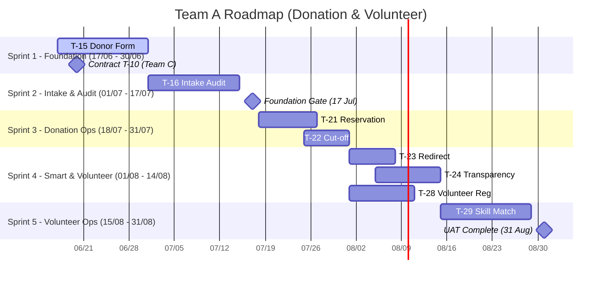

# Roadmap & Detailed Task Breakdown สำหรับทีม A (Donation & Volunteer)

เอกสารฉบับนี้จัดทำขึ้นเพื่อวิเคราะห์และแจกแจงแผนงานของ **ทีม A** (ชิโน, นัท, กาน) ที่ต้องดูแล **Module 4 ([Donation](file:///home/kanjicool/kanjicool/projects/tent/docs/task-breakdown/04-donation.md))** และ **Module 6 ([Module A — Volunteer](file:///home/kanjicool/kanjicool/projects/tent/docs/task-breakdown/06-A-volunteer.md))** ตามข้อสรุปใน [teamplanning.md](file:///home/kanjicool/kanjicool/projects/tent/docs/task-breakdown/teamplanning.md) และ [_timeline.md](file:///home/kanjicool/kanjicool/projects/tent/docs/task-breakdown/_timeline.md)

---

## 1. การแบ่งบทบาทภายในทีม (Team Roster & Roles)

เพื่อให้การทำงานสอดคล้องกับทักษะและความเสี่ยงของสมาชิกแต่ละคน ทีม A จะแบ่งหน้าที่หลักดังนี้:

*   **ชิโน (COE ปี 3 — เขียน Stack นี้เป็น):**
    *   **บทบาท:** Tech Lead & Security Specialist
    *   **หน้าที่หลัก:** คุมภาพรวมระบบ, ออกแบบ API Contract, รับผิดชอบความปลอดภัยหลังบ้าน (OTP, CAPTCHA, Rate-limiting, PII Masking, UUID Generator), ทำ Integration Tests และประกบดูแลนัทในการเขียน Frontend
*   **กาน (AIE ปี 4 — มีประสบการณ์ทำโปรเจกต์ แต่เป็น Stack ใหม่):**
    *   **บทบาท:** Backend & Business Logic Developer
    *   **หน้าที่หลัก:** พัฒนา Database Query, API Endpoints, เขียน Controller เชื่อมโยง CouchDB HTTP API (remote-first) และเขียน Logic การคำนวณฝั่ง Server (เช่น การจอง, การตัดโควตา, การจับคู่ทักษะ)
*   **นัท (AIE ปี 2 — ใหม่สำหรับ JS/TS, ความเสี่ยงเรื่องเวลาเรียนสูง):**
    *   **บทบาท:** Frontend & UI Developer
    *   **หน้าที่หลัก:** พัฒนา Responsive UI (Mobile-first) โดยใช้ HTML/Svelte, ออกแบบ Form กรอกข้อมูล, ตกแต่ง CSS, จัดการ Client-side validation และจัดเตรียม Mock Data สำหรับใช้ทดสอบ

---

## 2. แผนการดำเนินงานแบ่งราย Sprint (Roadmap)

แผนการดำเนินงานจะแบ่งเป็น 5 Sprints (มิถุนายน – สิงหาคม 2026) เพื่อให้สอดคล้องกับประตูสำคัญ (Gate) ของโครงการ

### รายละเอียด Sprint:
1.  **Sprint 1 (17/06 - 30/06):** โฟกัสฟอร์มรับบริจาคเบื้องหลัง (`T-15`) และประสานงานทีม C เพื่อกำหนดโครงสร้างข้อมูล Item Catalog (`T-10`) และ Stock Ledger (`T-11`)
2.  **Sprint 2 (01/07 - 17/07):** สร้างระบบรับของจริงที่ศูนย์ (`T-16`) เพื่อปิด Phase R2 ให้พร้อมสำหรับ **Foundation Gate (17 ก.ค.)**
3.  **Sprint 3 (18/07 - 31/07):** ขยับมาทำระบบควบคุมโควตาและการปิดรับอัตโนมัติเมื่อครบเป้า (`T-21`, `T-22`)
4.  **Sprint 4 (01/08 - 14/08):** ทำระบบส่งต่อไปยังศูนย์ที่ขาดแคลน (`T-23`), หน้ารายงานความโปร่งใส (`T-24`) และฟอร์มรับสมัครอาสาสมัคร (`T-28`)
5.  **Sprint 5 (15/08 - 31/08):** พัฒนาระบบจับคู่ตารางงานอาสาสมัคร (`T-29`) และร่วมทดสอบระบบในภาพรวมสำหรับ UAT ส่งมอบ 31 ส.ค.

---

## 3. รายละเอียดการแตก Task ย่อย (Detailed Task Breakdown)

DoD ทุกส่วนอ้างอิงตาม [Standard DoD](file:///home/kanjicool/kanjicool/projects/tent/docs/task-breakdown/_index.md#standard-dod) (UI + Write Path + Validation + Permission + Test + Demo)

---

### [R2] T-15 — Donor pre-declaration (แจ้งบริจาคล่วงหน้า)

*   **คำอธิบาย:** แบบฟอร์มสาธารณะที่ผู้บริจาคสามารถสแกน QR แล้วกรอกแจ้งสิ่งของและจำนวนที่จะนำมาบริจาคโดยไม่ต้องสมัครสมาชิก ระบบจะออก `tracking_token` สุ่มเพื่อใช้เช็คสถานะภายหลัง
*   **Dependencies:** ขึ้นอยู่กับโครงสร้าง Item Catalog ของระบบคลัง (`T-10` - ทีม C)
*   **การจัดสรรงานและการแตกงานย่อย:**
    *   **[ผม] UI & Form (1.0 MD) | Priority: Medium | Due: 26/06/2026:**
        *   [ ] **พัฒนาหน้าจอลงทะเบียนบริจาคแบบ Mobile-first**
            *   *วิธีทำเบื้องต้น:* ออกแบบหน้าตาโดยเน้นการใช้งานบนโทรศัพท์มือถือ (Responsive UI) ใช้ปุ่มขนาดใหญ่ที่กดได้ง่าย และลดฟิลด์ที่กรอกให้เหลือเฉพาะที่จำเป็นจริง ๆ
        *   [ ] **พัฒนาแบบฟอร์มให้เลือกรายการของบริจาค (Item Catalog) และกรอกจำนวน**
            *   *วิธีทำเบื้องต้น:* เรียกใช้ข้อมูลของที่ต้องการ (Needs List) หรือคลังของที่ขาดแคลนจาก API `GET /public/v1/needs` เพื่อแสดงให้ผู้บริจาคเลือกสิ่งของ พร้อมทำช่องใส่จำนวนที่ต้องการบริจาค
        *   [ ] **ทำ Client-side Validation**
            *   *วิธีทำเบื้องต้น:* ใช้ Svelte runes หรือ Zod schema ในการดักจับข้อผิดพลาดก่อนผู้บริจาคกดส่ง เช่น เช็คความครบถ้วนของข้อมูล เบอร์โทรศัพท์ต้องตรงตามรูปแบบ และจำนวนของบริจาคต้องมีค่ามากกว่า 0
    *   **[ผม] Backend API & Database (MongoDB) (1.0 MD) | Priority: High | Due: 23/06/2026:**
        *   [ ] **พัฒนา API POST `/public/v1/donations` เขียนลง MongoDB ในสถานะ `declared`**
            *   *วิธีทำเบื้องต้น:* สร้าง Endpoint รองรับข้อมูลที่ส่งมาจากฟอร์ม ทำการ Validate payload และบันทึกข้อมูลลงฐานข้อมูล MongoDB ส่วนกลาง (เช่น Collection `public_donations` หรือ `donations`) ด้วยสเตตัสเริ่มต้นเป็น `'declared'`
        *   [ ] **พัฒนา API GET `/public/v1/donations/{tracking_token}` ดึงจาก MongoDB**
            *   *วิธีทำเบื้องต้น:* สร้าง Endpoint ให้ฝั่ง Frontend ใช้เช็คสถานะการจองคิว โดยค้นหาเอกสารจาก MongoDB ผ่าน `tracking_token` และส่งกลับไปแสดงผลหน้ารายละเอียดคิว/ตั๋ว (Success Ticket)
        *   [ ] **พัฒนาฟังก์ชันสร้าง `tracking_token` แบบสุ่มที่คาดเดาไม่ได้ (ป้องกัน IDOR)**
            *   *วิธีทำเบื้องต้น:* ใช้ `crypto.randomUUID()` หรือไลบรารีสร้างโทเคนสุ่มเพื่อความปลอดภัยระดับสูง ไม่ให้บุคคลอื่นเดาโทเคนเพื่อแอบดูข้อมูลการบริจาคของผู अदอื่นได้
    *   **[ผม] Security & Verification (1.0 MD) | Priority: High | Due: 30/06/2026:**
        *   [ ] **ยกเลิก OTP — พัฒนาระบบ Rate Limiting และใส่ CAPTCHA อย่างเดียว (Risk-based policy)**
            *   *วิธีทำเบื้องต้น:* เชื่อมต่อ Google reCAPTCHA v3 หรือ Cloudflare Turnstile ที่ฝั่งหน้าบ้าน ส่ง Captcha Token ขึ้นมาตรวจเช็คที่ API ก่อนประมวลผล และใช้ Rate Limiter ป้องกันการถล่มยิง API
        *   [ ] **ทำระบบ Masking เบอร์โทรศัพท์ / ข้อมูล PII ก่อนบันทึกลง MongoDB**
            *   *วิธีทำเบื้องต้น:* ปิดบังข้อมูลส่วนบุคคล เช่น เบอร์โทรศัพท์ให้แสดงเป็น `081-***-5678` หรือเข้ารหัสส่วนข้อมูลที่อ่อนไหวก่อนลงฐานข้อมูล เพื่อป้องกันข้อมูลลูกค้ารั่วไหลและสอดคล้องกับข้อกำหนดความปลอดภัย
        *   [ ] **จัดทำ Integration Tests จำลองการยิง POST `/public/v1/donations`**
            *   *วิธีทำเบื้องต้น:* เขียนไฟล์ทดสอบ (Integration Test) เพื่อจำลองการส่งข้อมูล (Request) ทั้งในกรณีที่สำเร็จและล้มเหลว (เช่น Captcha ผิด, ข้อมูลไม่ครบ) เพื่อเช็คสถานะ API ผลลัพธ์ และความถูกต้องใน DB

---

### [R2] T-16 — Donation intake audit trail (การรับของหน้าศูนย์และตรวจสอบได้)

*   **คำอธิบาย:** ระบบสำหรับเจ้าหน้าที่เพื่อบันทึกรับสิ่งของที่หน้างานจริง ผูกกับรายการที่แจ้งล่วงหน้า (`T-15`) หรือกรณี Walk-in ที่ไม่ได้แจ้งล่วงหน้า แล้วทำการบันทึกข้อมูลลง Stock Ledger
*   **Dependencies:** ขึ้นอยู่กับ `T-15` (ทีม A) และ `T-11` (ระบบ Stock Ledger Write - ทีม C)
*   **การจัดสรรงานและการแตกงานย่อย:**
    *   **[ผม] UI เจ้าหน้าที่ (Remote-first) (1.0 MD) | Priority: Medium | Due: 12/07/2026:**
        *   [ ] **พัฒนาหน้าจอสำหรับเจ้าหน้าที่คลัง รองรับการอ่านและค้นหาจาก CouchDB central endpoint**
            *   *วิธีทำเบื้องต้น:* สร้าง UI สำหรับเจ้าหน้าที่คลังที่ดึงข้อมูลรายชื่อใบแจ้งบริจาคล่วงหน้ามาแสดงผลผ่าน HTTP GET ไปยัง CouchDB central endpoint (ผ่าน BFF/proxy) เมื่อเชื่อมต่อได้; เมื่อ disconnected แสดงสถานะการเชื่อมต่อเท่านั้น (ไม่มี local cache)
        *   [ ] **หน้าจอสำหรับกรอกจำนวนที่รับจริง แล้วกด Save เพื่อเขียนลง CouchDB central endpoint**
            *   *วิธีทำเบื้องต้น:* ทำช่องบันทึกจำนวนของที่ได้รับจริงจากผู้บริจาค (อาจเท่ากับ น้อยกว่า หรือมากกว่าที่แจ้งไว้) เมื่อตรวจสอบเรียบร้อยแล้วกด Save เพื่อส่ง HTTP PUT/POST ไปยัง CouchDB central endpoint; หากขาดการเชื่อมต่อ ปิดการบันทึกและแสดง banner (ไม่มี local write queue)
    *   **[ผม] CouchDB HTTP writes & retry (1.0 MD) | Priority: High | Due: 08/07/2026:**
        *   [ ] **บันทึก `stock_ledger` ผ่าน HTTP write ไปยัง CouchDB central endpoint**
            *   *วิธีทำเบื้องต้น:* บันทึกข้อมูลคลังลง CouchDB central ตาม schema `stock_ledger` ของทีม C (เช่น item_code, quantity, shelter_code, type: 'in') ผ่าน HTTP API; retry อัตโนมัติ 3 รอบ แล้วแสดง banner ให้ force retry
        *   [ ] **อัปเดตสถานะเอกสาร `donation` บน CouchDB central จาก `declared` เป็น `received`**
            *   *วิธีทำเบื้องต้น:* เมื่อทำรายการรับของเสร็จสิ้น ให้ค้นหาเอกสาร `donation` ผ่าน HTTP แล้วแก้ไขฟิลด์ `status` เป็น `'received'` พร้อมแนบยอดของที่ได้รับจริงและ timestamp การรับของ
    *   **[ผม] Security & Data Integrity in CouchDB (1.0 MD) | Priority: High | Due: 15/07/2026:**
        *   [ ] **ย้าย Logic ตรวจสอบสิทธิ์ (RBAC) และป้องกันข้อมูลซ้ำซ้อน ไปเขียนฝังที่ `validate_doc_update` ของ CouchDB**
            *   *วิธีทำเบื้องต้น:* เขียนฟังก์ชันตรวจสอบเอกสารในฝั่ง CouchDB Server เพื่อรับประกันว่าเฉพาะเจ้าหน้าที่ที่มีสิทธิ์เท่านั้นที่สามารถแก้ไขสถานะใบรับบริจาคได้ และป้องกันเอกสารไม่ให้ถูกอัปเดตย้อนหลังในฟิลด์ที่สำคัญ
        *   [ ] **สร้างระบบบันทึก `audit/movement` ลง CouchDB central แนบชื่อผู้รับของ**
            *   *วิธีทำเบื้องต้น:* ทุกครั้งที่มีการตรวจสอบและรับของจริง ให้สร้างเอกสาร Audit Trail เล็ก ๆ ผ่าน HTTP write บันทึกว่าใครเป็นผู้รับ เวลาใด และรับรายการอะไรบ้าง เพื่อใช้เป็นประวัติตรวจสอบย้อนหลัง
        *   [ ] **เขียน Automated Test ทบทวน disconnected status-only flow (ไม่มี local write queue)**
            *   *วิธีทำเบื้องต้น:* เขียนชุดทดสอบจำลองเหตุการณ์ central endpoint ไม่พร้อมใช้งาน — ยืนยันว่า UI แสดง banner สถานะ disconnected, ปิดการบันทึก, และไม่มีการคิวข้อมูลลง local storage; ทดสอบ retry policy (3 รอบ + force retry) เมื่อ endpoint กลับมาใช้งานได้

---

### [R3] T-21 — Donation reservation (การจองคิวบริจาค)

*   **คำอธิบาย:** ยกระดับจากการแจ้งบริจาคธรรมดาเป็นการจองโควตา โดยระบบต้องตรวจสอบความต้องการคงค้าง (เป้าหมายหักลบด้วยของที่มีอยู่และโควตาที่จองไว้แล้ว) หากไม่มีการส่งมอบภายในเวลาจำกัด (TTL) โควตาจะถูกคืนเข้าสู่ระบบอัตโนมัติ
*   **Dependencies:** ขึ้นอยู่กับข้อมูลคลังจริง `T-14` (ทีม C) และระบบรับของหน้าศูนย์ `T-16` (ทีม A)
*   **การจัดสรรงานและการแตกงานย่อย:**
    *   **[นัท] UI แสดงโควตาและการจอง (1.0 MD) | Priority: Medium | Due: 25/07/2026:**
        *   [ ] พัฒนาหน้าจอแสดงจำนวนของที่ขาดแคลนแบบ Real-time เพื่อให้ผู้บริจาคทราบว่าจองรายการไหนได้บ้าง
        *   [ ] พัฒนาหน้าจอยกเลิก/แก้ไขการจองสำหรับผู้บริจาคผ่านการใส่ `tracking_token`
    *   **[กาน] Reservation API & TTL Logic (1.5 MD) | Priority: High | Due: 23/07/2026:**
        *   [ ] เขียน Logic การคำนวณโควตา: `ความต้องการคงค้าง = target - on-hand - active_reservations`
        *   [ ] พัฒนา API สำหรับยืนยันการจองพร้อมระบบล็อคโควตาชั่วคราว
        *   [ ] พัฒนาระบบตรวจสอบวันหมดอายุของการจอง (TTL Expiration) เพื่อคืนโควตากลับเข้าระบบเมื่อเลยกำหนดเวลา
    *   **[ชิโน] Race Conditions & Security (1.0 MD) | Priority: High | Due: 27/07/2026:**
        *   [ ] ออกแบบระบบป้องกัน Race Conditions เมื่อมีผู้บริจาคพยายามจองของชิ้นเดียวกันเต็มโควตาพร้อมกัน
        *   [ ] พัฒนาระบบจำกัดจำนวนครั้งการจอง (Rate limit) ต่อเบอร์โทรศัพท์เพื่อป้องกันการสแปมจองเล่น
        *   [ ] ทดสอบจำลองสภาวะการจองพร้อมกันและการหมดอายุของเวลาจอง

---

### [R3] T-22 — Donation cut-off (ปิดรับบริจาคอัตโนมัติ)

*   **คำอธิบาย:** ระบบทำการปิดฟอร์มรับแจ้งและรับจองสิ่งของรายการนั้นๆ ทันทีเมื่อมียอดสะสมครบตามเป้าหมาย (เพื่อป้องกันของค้างล้นโกดัง) และสามารถเปิดรับใหม่ได้หากมีการแจกจ่ายออกไปจนยอดลดลงต่ำกว่าเป้าหมาย
*   **Dependencies:** `T-21` (ทีม A)
*   **การจัดสรรงานและการแตกงานย่อย:**
    *   **[นัท] UI Cut-off (0.5 MD) | Priority: Medium | Due: 29/07/2026:**
        *   [ ] พัฒนาระบบแสดงสถานะ "ปิดรับบริจาคชั่วคราว" ในหน้าเลือกรายการของบริจาค
        *   [ ] พัฒนาปุ่ม Manual Override สำหรับผู้บริหารศูนย์ (`shelter_manager`) เพื่อสั่งเปิด/ปิดรับสิ่งของแยกชิ้นแบบ Manual
    *   **[กาน] Auto Cut-off Engine & Re-open logic (1.5 MD) | Priority: High | Due: 28/07/2026:**
        *   [ ] เขียน Logic การตรวจจับค่า (Trigger Hook) เมื่อ `on-hand + reserved >= target` ให้ระบบเปลี่ยนสถานะเป็นปิดรับบริจาครายการนั้นโดยอัตโนมัติ
        *   [ ] เขียน Logic ตรวจจับเมื่อระดับสินค้าในคลังลดลงต่ำกว่าเป้าหมาย (จากประวัติการกระจายของ ทีม C) แล้วเปลี่ยนสถานะกลับมาเปิดรับบริจาคใหม่อัตโนมัติ
    *   **[ชิโน] Override Logs & Tests (1.0 MD) | Priority: Medium | Due: 31/07/2026:**
        *   [ ] ทำระบบบันทึกประวัติการ Override ด้วยสิทธิ์ผู้บริหารพร้อมเหตุผลกำกับ
        *   [ ] เขียนเทสตรวจสอบ Threshold Crossing ทั้งสองทิศทาง (บวกขึ้นจนปิด และลดลงจนเปิดใหม่)

---

### [R3] T-23 — Smart redirect to under-threshold shelters (แนะนำศูนย์อื่นที่ยังขาดของ)

*   **คำอธิบาย:** เมื่อระบบทำการปิดรับของรายการหนึ่งที่ศูนย์เป้าหมาย ระบบจะแนะนำศูนย์อื่นในเครือข่ายที่อยู่ใกล้เคียงและยังต้องการของสิ่งนั้นอยู่ เพื่อไม่ให้ผู้บริจาคเสียความตั้งใจและช่วยกระจายสิ่งของได้อย่างทั่วถึง
*   **Dependencies:** `T-22` (ทีม A) และ `T-14` (ข้อมูลเปรียบเทียบข้ามศูนย์จากทีม C)
*   **การจัดสรรงานและการแตกงานย่อย:**
    *   **[นัท] UI Suggestion & Flow Bridge (1.0 MD) | Priority: Medium | Due: 07/08/2026:**
        *   [ ] พัฒนา Component หน้าจอป๊อปอัปแนะนำศูนย์อื่นเมื่อศูนย์เดิมปิดรับ
        *   [ ] จัดเรียงรายชื่อศูนย์แนะนำตามความเร่งด่วนที่ขาดแคลน
        *   [ ] พัฒนาระบบโอนย้ายข้อมูลฟอร์มที่กรอกค้างไว้ไปยังศูนย์ใหม่ในคลิกเดียวโดยไม่ต้องกรอกใหม่
    *   **[กาน] Redirect Query Engine (1.5 MD) | Priority: High | Due: 05/08/2026:**
        *   [ ] พัฒนา Endpoint ดึงพิกัดและค่าความต้องการของแต่ละศูนย์เปรียบเทียบกัน
        *   [ ] เขียนฟังก์ชันคัดกรองเฉพาะข้อมูลสาธารณะ (Aggregate Data) ห้ามดึงข้อมูลผู้พักพิงหรือข้อมูล PII ของแต่ละศูนย์มาประมวลผลเด็ดขาด
    *   **[ชิโน] Multi-Shelter Integration Test (1.0 MD) | Priority: Medium | Due: 09/08/2026:**
        *   [ ] ทำแบบทดสอบตรวจจับ Flow การ Redirect จากศูนย์ A ไปศูนย์ B
        *   [ ] ออกแบบแผนรองรับกรณีเกิดข้อผิดพลาดในการดึงข้อมูลข้ามศูนย์ (Fallback logic)

---

### [R3] T-24 — Donation transparency report (รายงานสรุปความโปร่งใสสาธารณะ)

*   **คำอธิบาย:** หน้ารายงานสรุปยอดการรับของและแจกจ่ายของในรอบ 24 ชั่วโมงของแต่ละศูนย์เพื่อให้ประชาชนทั่วไปเข้าใช้งานผ่านลิงก์หรือสแกน QR Code หน้าศูนย์ได้โดยสะดวก
*   **Dependencies:** `T-16` (ทีม A) และระบบประวัติรับจ่าย (ทีม C)
*   **การจัดสรรงานและการแตกงานย่อย:**
    *   **[นัท] UI Public Dashboard (1.5 MD) | Priority: Medium | Due: 11/08/2026:**
        *   [ ] ออกแบบและพัฒนาหน้าเว็บสาธารณะสำหรับแสดงสถิติการรับเข้าและแจกจ่ายรายวัน
        *   [ ] ทำให้หน้าเว็บเป็นมิตรกับโทรศัพท์มือถือ (Mobile-First) และเพิ่มฟังก์ชันดาวน์โหลด/พิมพ์
    *   **[กาน] Stock Aggregator API (1.5 MD) | Priority: High | Due: 08/08/2026:**
        *   [ ] พัฒนา API คัดแยกประวัติการเคลื่อนไหวของสินค้าในรอบ 24 ชั่วโมงจาก Stock Ledger มาจัดแสดง
        *   [ ] พัฒนา API สำหรับเจนเนอเรต URL QR Code แยกตามรายศูนย์
    *   **[ชิโน] Data Privacy & Cache optimization (1.0 MD) | Priority: High | Due: 14/08/2026:**
        *   [ ] ออกแบบระบบกรองข้อมูล PII เพื่อรับประกันว่าจะไม่มีชื่อผู้บริจาคหรือข้อมูลผู้พักพิงหลุดไปหน้าเว็บ (Data-governance Compliance)
        *   [ ] ทำระบบ Caching สำหรับหน้ารายงานสาธารณะนี้เพื่อป้องกันการยิงดึงข้อมูลบ่อยเกินไป (DDoS protection)

---

### [R3] T-28 — Volunteer registration + skills + availability (การลงทะเบียนอาสาสมัคร)

*   **คำอธิบาย:** ฟอร์มลงทะเบียนสำหรับคนทั่วไปเพื่อสมัครมาเป็นอาสาสมัครในศูนย์ โดยสามารถระบุทักษะ (เช่น พยาบาล, ทำครัว, ขนของ) และระบุช่วงเวลาที่ว่างใช้งานได้
*   **Dependencies:** `T-18` (ข้อมูล Schema พื้นฐานของอาสาสมัคร - ทีม D)
*   **การจัดสรรงานและการแตกงานย่อย:**
    *   **[นัท] Registration Form UI (1.0 MD) | Priority: Medium | Due: 09/08/2026:**
        *   [ ] พัฒนาหน้าลงทะเบียนสมัครอาสาสมัครและฟอร์มแก้ไขโปรไฟล์ตัวเองภายหลัง
        *   [ ] พัฒนาช่องทางการเลือกทักษะ (Skill Tags) และปฏิทินระบุช่วงเวลาที่สะดวก
    *   **[กาน] Volunteer API & Search Engine (1.0 MD) | Priority: High | Due: 06/08/2026:**
        *   [ ] พัฒนา API บันทึกประวัติและแก้ไขประวัติอาสาสมัคร
        *   [ ] พัฒนา API ให้เจ้าหน้าที่ศูนย์สามารถ ค้นหา/กรอง อาสาสมัครตามทักษะและเวลาที่ว่างได้
    *   **[ชิโน] Security & PII Protection (1.0 MD) | Priority: High | Due: 12/08/2026:**
        *   [ ] เขียนระบบปิดบังข้อมูลส่วนบุคคล (PII Masking) สำหรับเจ้าหน้าที่ผู้ไม่มีสิทธิ์ตามนโยบาย NFR-5
        *   [ ] ลงทะเบียนรายการข้อมูลลงใน RoPA
        *   [ ] เขียน Test เคสการบันทึกข้อมูลและตรวจสอบการสิทธิ์การค้นหาประวัติอาสา

---

### [R3] T-29 — Skill match + task/shift assignment (การจัดสรรกะงานอาสา)

*   **คำอธิบาย:** ระบบแนะนำรายชื่ออาสาสมัครที่เหมาะสมกับงานโดยอัตโนมัติ โดยดูจากทักษะที่งานต้องการและช่วงเวลาที่ว่าง และช่วยเจ้าหน้าที่ในการจัดและยืนยันตารางกะงาน
*   **Dependencies:** `T-28` (ข้อมูลประวัติอาสา - ทีม A)
*   **การจัดสรรงานและการแตกงานย่อย:**
    *   **[นัท] UI Calendar & Planner (1.5 MD) | Priority: Medium | Due: 26/08/2026:**
        *   [ ] พัฒนาหน้าแสดงปฏิทินกะงานสำหรับฝั่งเจ้าหน้าที่เพื่อใช้สร้างกะงานใหม่
        *   [ ] พัฒนาหน้าตารางงานส่วนตัวสำหรับอาสาสมัครแต่ละคนเพื่อเปิดดูจากโทรศัพท์มือถือ
        *   [ ] แสดงสถานะในแต่ละกะงานว่าต้องการคนเพิ่มเท่าใดแยกตามทักษะ
    *   **[กาน] Skill Matching & Booking API (2.0 MD) | Priority: High | Due: 22/08/2026:**
        *   [ ] พัฒนาระบบแนะนำคนแบบอัตโนมัติ (เช่น ค้นหาคนที่มีทักษะพยาบาลและว่างในวันเสาร์)
        *   [ ] เขียน Logic บันทึกการส่งมอบกะและจัดเก็บประวัติการกะย้อนหลัง (Assignment History)
    *   **[ชิโน] Conflict Validation & Tests (1.0 MD) | Priority: High | Due: 29/08/2026:**
        *   [ ] เขียน Validation Rule ป้องกันไม่ให้อาสาสมัครคนเดียวกันถูกบรรจุเข้ากะงานที่เวลากลืนหรือชนกัน
        *   [ ] ออกแบบ JUnit / Integration Tests สำหรับ Matching Logic (ทักษะและเวลาตรงกันจริง)

---

## 4. กลยุทธ์การร่วมงานข้ามทีมและการแก้ปัญหาติดขัด (Mocking Strategy)

เนื่องจากทีม A ต้องใช้ข้อมูลจากหลายโมดูลที่ดูแลโดยทีมอื่น เพื่อไม่ให้เกิดปัญหางานติดขัด (Block) ทีม A จะใช้กลยุทธ์ดังนี้:

1.  **Mocking API Contract (ตั้งแต่วันแรก):**
    *   ทีม A และทีม C จะตกลงสร้าง JSON Mockup ของ `Item Catalog` (`T-10`) และ `Stock Ledger API` (`T-11`/`T-14`) ร่วมกัน
    *   ทีม A และทีม D จะตกลงโครงสร้าง `Volunteer DB Schema` (`T-18`) ร่วมกัน
    *   เมื่อตกลงกันได้แล้ว ทุกฝ่ายจะเขียนโปรแกรมเข้าหา Mock API เหล่านี้เพื่อให้แต่ละคนเดินงานหน้าบ้านและหลังบ้านของตัวเองได้โดยไม่ต้องรอโค้ดจริงเสร็จ
2.  **การปรับปรุงย้อนหลัง (Refactoring & Sync):**
    *   ในช่วงสัปดาห์แรกของแต่ละ Sprint จะเป็นช่วงของการพัฒนาคู่กับ Mock Data
    *   ในช่วงสัปดาห์สุดท้ายจะเป็นช่วงของการลบ Mock Data ออกแล้วทำการดึง API จริงเชื่อมหากัน

---

## 5. แนะนำ Slash Commands สำหรับผู้ใช้งาน

สำหรับผู้จัดการโครงการหรือนักพัฒนาที่ต้องการทำงานอย่างมีประสิทธิภาพ สามารถเลือกใช้งานคำสั่งเหล่านี้ในระบบช่วยเหลือได้:
*   พิมพ์ `/goal` เมื่อต้องการให้ผู้ช่วยทำงานวิเคราะห์ที่มีความซับซ้อนในเชิงลึกแบบต่อเนื่องยาวนาน
*   พิมพ์ `/schedule` เมื่อต้องการตั้งนาฬิกาเตือนการทำงาน หรือการตั้งตารางตรวจเช็คสถานะการเชื่อมต่อกับ CouchDB central endpoint เป็นระยะๆ
*   พิมพ์ `/grill-me` เมื่อต้องการเข้าสู่ระบบสัมภาษณ์เชิงรุกแบบตัวต่อตัวเพื่อช่วยหาข้อสรุปในประเด็นการออกแบบโครงสร้างฐานข้อมูลที่มีความขัดแย้งกัน
