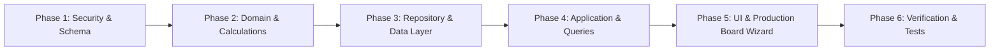

# Implementation Plan: Kitchen 2-Tier Meal Sessions, Production Setup Board (Stages A/B/C) & TKT-KITCHEN Flow 3

> **อ้างอิงจากข้อกำหนด:** [`docs/changes/draft-kitchen-meal-session-production-board-flow3 copy.md`](file:///home/kontuch/kontuch/lab/tent/docs/changes/draft-kitchen-meal-session-production-board-flow3%20copy.md)  
> **สาขา Git:** `team-Leader-Implement-Kitchen-Follow-UIv10`  
> **วันที่จัดทำ:** 2 กันยายน 2569  
> **อัปเดตล่าสุด:** Review Session 2 กันยายน 2569 (Grill)

---

## 0. Design Decisions (ผลจาก Grill Session)

| # | เรื่อง | Decision |
|---|-------|----------|
| D1 | Backward compat `kitchen_requisition` | เพิ่ม migration guard ใน `isKitchenRequisition()` — doc เก่า (ไม่มี `status`) ถูก coerce เป็น `approved` ใน read path |
| D2 | Ticket format | `[ShelterCode]-KITCHEN-[running_no]` เช่น `CNX01-KITCHEN-0042` |
| D3 | Running number strategy | `kitchen_counter` doc แยก — เพิ่มด้วย `bulkDocs` พร้อม retry loop เมื่อ MVCC conflict |
| D4 | `everyone` tag semantic | `target_tags: ['everyone']` → นับ `actual_yield` เข้าทุกกลุ่ม (halal, infant, soft_food, regular, volunteer) |
| D5 | Reactive progress layer | Derived ฝั่ง client — sum `actual_yield` จาก `meal_service` แล้วจัดกลุ่มตาม `target_tags` |
| D6 | Multi-tag batch attribution | `actual_yield` นับรวมเป็น progress ของทุก tag ใน batch โดยไม่ต้อง split |
| D7 | Wizard UI state | `$state` rune ใน `+page.svelte` ของ production-board |
| D8 | `meal_plan.headcount` | คงไว้ (non-breaking additive) — เพิ่มแค่ `meal_session_id`, `target_tags`, `allocated_target` เป็น optional |
| D9 | Navigation to board | Dynamic route `/back-office/kitchen/production-board/[session_id]/` อ่านจาก `$page.params.session_id` |
| D10 | Step A persistence | Commit on action — สร้าง `meal_plan` draft + requisition จริงเมื่อกด "สร้างใบเบิก" เท่านั้น |

---

## 1. ภาพรวมและวัตถุประสงค์ (Overview & Objectives)

ปรับโครงสร้างและกระบวนการทำงานของระบบโรงครัวกลาง (Field Kitchen Operations) ให้รองรับการบริหารจัดการแบบ **2-Tier Meal Structure** พร้อมกระดานจัดสรรการผลิตอาหารแบบ **3-Stage Wizard** และระบบตั๋วคำขอเบิกวัตถุดิบ **`[ShelterCode]-KITCHEN-[running_no]` (Flow 3)**:

1. **2-Tier Structure:** จัดการภาพรวมมื้ออาหารด้วย `meal_session` (เช่น มื้อเช้า/กลางวัน/เย็น) ที่ควบคุมเป้าหมาย 5 กลุ่มผู้พักพิง (`halal`, `infant`, `soft_food`, `regular`, `volunteer`, `total`) และแตกชุดการผลิตย่อยเป็น `meal_plan` (Production Batches)
2. **Production Setup Board Wizard 3 ช่วง** (แยกหน้า dynamic route `/production-board/[session_id]`):
   - **ช่วง A (Plan):** กรอก BOM Form ใน component — สร้าง `meal_plan` (draft) + `kitchen_requisition` (`pending`) ใน DB เมื่อกด "สร้างใบเบิก" เท่านั้น
   - **ช่วง B (Ticket Approval):** รอคลังอนุมัติตั๋ว `[ShelterCode]-KITCHEN-XXXX` ตัดสต็อก FEFO พร้อมปุ่มทดสอบจำลองอนุมัติ
   - **ช่วง C (Actual Yield & Service):** บันทึกผลผลิตจริง (`actual_yield`), การแจกจ่าย, และแก๊สจริง
3. **Reactive Group Progress:** คำนวณ derived ฝั่ง client — sum `actual_yield` ของทุก `meal_service` ตาม `target_tags` ใน session

---

## 2. การเปลี่ยนแปลงโครงสร้างข้อมูล (Schema Changes)

### 2.1 [NEW] `meal_session` — `meal_session:{ulid}` · **schema_v 1**
* **จุดประสงค์:** เอกสารระดับมื้ออาหารสำหรับคุมภาพรวมและเป้าหมายผู้รับ 5 กลุ่ม
* **โครงสร้างฟิลด์:**
  ```typescript
  export interface MealSessionHeadcount {
    halal: number;       // เป้าหมายกลุ่มฮาลาล (มุสลิม)
    infant: number;      // เป้าหมายกลุ่มเด็ก/ทารก
    soft_food: number;   // เป้าหมายกลุ่มเปราะบาง/อาหารอ่อน
    regular: number;     // เป้าหมายกลุ่มปกติ
    volunteer: number;   // เป้าหมายกลุ่มอาสาสมัคร/เจ้าหน้าที่
    total: number;       // เป้าหมายรวมทั้งหมด
  }

  export interface MealSession extends BaseDoc {
    type: 'meal_session';
    schema_v: 1;
    name: string;        // เช่น "มื้อเช้า 28 ส.ค. 2569"
    date: string;        // YYYY-MM-DD
    meal: MealPeriod;    // 'breakfast' | 'lunch' | 'dinner' | 'snack'
    status: 'active' | 'completed' | 'cancelled';
    target_headcount: MealSessionHeadcount;
    notes?: string;
  }
  ```

### 2.2 [MODIFY] `meal_plan` — `meal_plan:{ulid}` · **schema_v 2 (Non-breaking Additive)**
* **จุดประสงค์:** Production Batch ที่ผูกกับ `meal_session` — `headcount` เดิมคงไว้ (D8)
* **ฟิลด์ที่เพิ่ม (optional ทั้งหมด):**
  - `meal_session_id?: string | null`
  - `target_tags?: string[]` — เช่น `['everyone']`, `['halal']`, `['regular', 'soft_food']`
  - `allocated_target?: number` — จำนวนจานเป้าหมายของ batch นี้

### 2.3 [MODIFY] `kitchen_requisition` — `kitchen_requisition:{ulid}` · **schema_v 3**
* **State Machine** (D1: doc เก่าไม่มี `status` → coerce เป็น `'approved'` ใน read path)
* **ฟิลด์ที่เพิ่ม/ปรับเปลี่ยน:**
  - `ticket_no: string` — รูปแบบ `[ShelterCode]-KITCHEN-[running_no]` (D2)
  - `status: 'pending' | 'approved' | 'rejected'` (default `'pending'`)
  - `meal_session_id?: string | null`
  - `gas_drawdown?: Array<{ cylinder_id: string, qty_kg: string }>`
  - `requested_at: string`
  - `approved_at?: string | null`
  - `approved_by?: string | null`
  - `ledger_ids: string[]` — สร้างและผูกเมื่อ `status === 'approved'` เท่านั้น (ต่างจากเดิมที่ pre-generate)

### 2.4 [NEW] `kitchen_counter` — `kitchen_counter:main` · **schema_v 1**
* **จุดประสงค์:** เก็บ running number สำหรับ ticket_no (D3)
* **โครงสร้าง:**
  ```typescript
  { _id: 'kitchen_counter:main', type: 'kitchen_counter', schema_v: 1, seq: number }
  ```
* **กระบวนการ:** `bulkDocs` พร้อม retry loop เมื่อ MVCC conflict (CouchDB `409`)

### 2.5 [MODIFY] `meal_service` — `meal_service:{ulid}` · **schema_v 2 (Non-breaking Additive)**
* **ฟิลด์ที่เพิ่ม (optional):**
  - `meal_session_id?: string | null`
  - `actual_gas_used_kg?: string` — qty_str

---

## 3. กลไกคำนวณ Reactive Group Progress (D4, D5, D6)

### 3.1 `everyone` Tag Expansion
เมื่อ `target_tags = ['everyone']` ระบบจะ expand เป็น `['halal', 'infant', 'soft_food', 'regular', 'volunteer']` ก่อนคำนวณ

### 3.2 `computeSessionGroupProgress()` Algorithm
```
Input: session: MealSession, plans: MealPlan[], services: MealService[]
Output: Map<group_key, { done: number, target: number, complete: boolean }>

For each group_key in ['halal', 'infant', 'soft_food', 'regular', 'volunteer']:
  done = sum of actual_yield from all services
         where service.meal_plan_id links to plan
         where plan.meal_session_id === session._id
         where (plan.target_tags includes group_key)
             OR (plan.target_tags includes 'everyone')
  target = session.target_headcount[group_key]
  complete = done >= target
```

### 3.3 Multi-tag Attribution (D6)
Batch ที่มี `target_tags: ['halal', 'regular']` และ `actual_yield: 75`:
- halal done: `+75`
- regular done: `+75`
- ไม่มีการ split — batch นี้ "commit" 75 จานให้ทั้งสองกลุ่มรวมกัน

---

## 4. ขั้นตอนการดำเนินงาน (Step-by-Step Implementation Phases)



### Phase 1: Security & Schema Documentation
1. **ปรับสิทธิ์ [src/lib/server/shelter-access-design.ts](file:///home/kontuch/kontuch/lab/tent/frontend/src/lib/server/shelter-access-design.ts):**
   - เพิ่ม `'meal_session'` และ `'kitchen_counter'` ลงใน whitelist ของ `buildValidateDocUpdate`
2. **อัปเดต [docs/data/schema.md](file:///home/kontuch/kontuch/lab/tent/docs/data/schema.md):**
   - เพิ่มหัวข้อ §2.8 `meal_session` (schema_v 1)
   - เพิ่มหัวข้อ §2.9 `kitchen_counter` (schema_v 1)
   - อัปเดต §2.5 `meal_plan`, §2.6 `kitchen_requisition`, §2.7 `meal_service`

---

### Phase 2: Domain Layer & Calculation Engines

1. **ปรับปรุง [src/lib/features/kitchen/domain/kitchen.ts](file:///home/kontuch/kontuch/lab/tent/frontend/src/lib/features/kitchen/domain/kitchen.ts):**
   - สร้าง `MealSession`, `MealSessionHeadcount`, `mealSessionInputSchema`, `createMealSession()`, `isMealSession()`
   - สร้าง `KitchenCounter`, `isKitchenCounter()` สำหรับ running number doc
   - ขยาย `mealPlanInputSchema` และ `createMealPlan()` รองรับ `meal_session_id`, `target_tags`, `allocated_target`
   - ขยาย `KitchenRequisition` interface รองรับ `ticket_no`, `status`, `gas_drawdown`, `requested_at`, `approved_at`, `approved_by`
   - ปรับ `createKitchenRequisition()` — **ไม่รับ `ledgerIds` ล่วงหน้า**, สร้างเป็น `pending` state ก่อน
   - **Migration guard ใน `isKitchenRequisition()`** (D1):
     ```typescript
     // Coerce legacy doc (no status) to 'approved'
     if (d && typeof d === 'object' && d.type === 'kitchen_requisition') {
       if (!('status' in d)) (d as any).status = 'approved';
       return true;
     }
     ```
   - ขยาย `mealServiceInputSchema` รองรับ `meal_session_id`, `actual_gas_used_kg`

2. **เพิ่มฟังก์ชันคำนวณใน [src/lib/features/kitchen/domain/meal-calc.ts](file:///home/kontuch/kontuch/lab/tent/frontend/src/lib/features/kitchen/domain/meal-calc.ts):**
   - `computeTargetHeadcountFromEvacuees(evacuees)`: คำนวณยอด 5 กลุ่มอัตโนมัติจากทะเบียนผู้พักพิง
   - `expandTargetTags(tags: string[]): string[]`: expand `'everyone'` เป็น 5 กลุ่ม (D4)
   - `computeSessionGroupProgress(session, plans, services)`: Derived calculation ตาม algorithm §3.2 (D5, D6)

3. **เขียน Unit Tests ใน [src/lib/features/kitchen/domain/kitchen.test.ts](file:///home/kontuch/kontuch/lab/tent/frontend/src/lib/features/kitchen/domain/kitchen.test.ts):**
   - ทดสอบ migration guard, `everyone` expansion, multi-tag attribution, progress calculation

---

### Phase 3: Repository & Data Access Layer

1. **ขยาย Interface [src/lib/features/kitchen/data/kitchen.repository.ts](file:///home/kontuch/kontuch/lab/tent/frontend/src/lib/features/kitchen/data/kitchen.repository.ts):**
   - `createMealSession`, `getMealSessionById`, `listMealSessions`, `updateMealSession`, `deleteMealSession`
   - `createPendingRequisition(input, ctx)`: สร้างตั๋ว `pending` + `kitchen_counter` increment (D3)
   - `approveRequisition(id, approver, ctx)`: ตรวจสต็อก ตัด `stock_ledger` FEFO + `gas_ledger` แบบ Atomic `bulkDocs`, อัปเดต status `approved`
   - `rejectRequisition(id, reason, ctx)`: อัปเดต status `rejected`

2. **พัฒนา [src/lib/features/kitchen/data/kitchen.remote.ts](file:///home/kontuch/kontuch/lab/tent/frontend/src/lib/features/kitchen/data/kitchen.remote.ts):**
   - CRUD สำหรับ `meal_session` docs
   - `createPendingRequisition()`:
     1. อ่าน `kitchen_counter:main` (หรือสร้างใหม่ถ้าไม่มี)
     2. Increment `seq` → format `[shelterCode]-KITCHEN-${seq.toString().padStart(4, '0')}`
     3. `bulkDocs([updatedCounter, newRequisition])` — retry เมื่อ 409 conflict (D3)
   - `approveRequisition()`: อ่าน requisition + plan, validate stock/gas, `bulkDocs([updatedRequisition, ...ledgerEntries, ...gasEntries])` (D10 — ledger_ids สร้าง ณ ขณะนี้ ไม่ใช่ตอนสร้าง pending)

---

### Phase 4: Application Layer (TanStack Query Hooks)

1. **เพิ่ม Query Hooks ใน [src/lib/features/kitchen/application/queries.ts](file:///home/kontuch/kontuch/lab/tent/frontend/src/lib/features/kitchen/application/queries.ts):**
   - `useMealSessions()`, `useMealSession(idQuery)`
   - `useCreateMealSession()`, `useUpdateMealSession()`, `useDeleteMealSession()`
   - `useCreatePendingRequisition()`, `useApproveRequisition()`, `useRejectRequisition()`
   - `useActiveEvacueeDietCounts()`: ดึงยอดผู้พักพิงแยกตามประเภทอาหารเพื่อเป็นค่าตั้งต้น
   - ปรับปรุง `startKitchenLiveQuery` ให้ invalidate `meal_session` และ `kitchen_counter`

2. **Export ผ่าน [src/lib/features/kitchen/index.ts](file:///home/kontuch/kontuch/lab/tent/frontend/src/lib/features/kitchen/index.ts)**

---

### Phase 5: UI Components & Pages

#### 5.1 หน้ารายการมื้ออาหารหลัก ([src/routes/(protected)/back-office/kitchen/+page.svelte](file:///home/kontuch/kontuch/lab/tent/frontend/src/routes/(protected)/back-office/kitchen/+page.svelte))
- แสดงรายการการ์ด `meal_session` ตามวันที่และมื้อ
- แต่ละการ์ดแสดง:
  - Header: วันที่, มื้อ, สถานะ, badge สรุป `X/5 กลุ่มครบ`
  - ตารางเป้าหมาย 5 กลุ่ม: Target vs Done (derived จาก `computeSessionGroupProgress`) พร้อมป้าย `ครบแล้ว` / `ยังไม่ครบ`
  - รายการ Production Batches ในมื้อ
  - ปุ่ม "+ เพิ่มเมนูผลิต" → navigate ไป `/back-office/kitchen/production-board/[session_id]`
- ปุ่มหลัก: "+ สร้างมื้ออาหารใหม่" (เปิด Modal)

#### 5.2 Modal สร้างมื้ออาหาร ([src/lib/features/kitchen/ui/meal-session-modal.svelte](file:///home/kontuch/kontuch/lab/tent/frontend/src/lib/features/kitchen/ui/meal-session-modal.svelte))
- ดึงยอดผู้พักพิง 5 กลุ่มผ่าน `useActiveEvacueeDietCounts()` เป็นค่าตั้งต้น
- รองรับ Manual Override และ `notes`

#### 5.3 กระดานการผลิต — Dynamic Route [src/routes/(protected)/back-office/kitchen/production-board/[session_id]/+page.svelte](file:///home/kontuch/kontuch/lab/tent/frontend/src/routes/(protected)/back-office/kitchen/production-board/) (D9)
- อ่าน `session_id` จาก `$page.params.session_id`
- **Step state** เก็บใน `$state` rune (D7): `'A' | 'B' | 'C'`
- **ช่วง A (Plan) — Form ใน Component, Commit on Action (D10):**
  - เลือกสูตร BOM + กลุ่มเป้าหมาย (`target_tags`) + `allocated_target`
  - คำนวณวัตถุดิบที่ต้องใช้ เทียบยอดคงคลัง
  - เลือกเตา/ถังแก๊ส คำนวณการใช้แก๊ส
  - กด "สร้างใบเบิกวัตถุดิบ" → `createPendingRequisition()` เขียน `meal_plan` (draft) + `kitchen_requisition` (pending) + increment `kitchen_counter` → เปลี่ยน step เป็น B
- **ช่วง B (Ticket & Approval):**
  - แสดงรหัสตั๋ว `[ShelterCode]-KITCHEN-XXXX` และรายการของ
  - Banner "รอคลังตรวจสอบ"
  - ปุ่มทดสอบ "[สำหรับทดสอบ] จำลองคลังอนุมัติ" → `approveRequisition()` ตัด Stock & Gas Ledger
  - เมื่ออนุมัติ → เปลี่ยน step เป็น C
- **ช่วง C (Actual Yield):**
  - กรอก `actual_yield`, `served`, `waste`, `external`, `actual_gas_used_kg`
  - กด "บันทึกผลการผลิต" → เขียน `meal_service` → navigate กลับหน้า session list

---

## 5. เกณฑ์การตรวจรับและแผนการทดสอบ (Acceptance Criteria & Verification)

### 5.1 Automated Tests
- [ ] `pnpm test src/lib/features/kitchen/domain` — Unit test migration guard, `everyone` expansion, multi-tag attribution
- [ ] `pnpm test src/lib/features/kitchen/data` — Integration test `kitchen_counter` increment, pending→approved flow

### 5.2 Manual Verification Checklist
1. **ทดสอบสร้าง Meal Session:**
   - กด "+ สร้างมื้ออาหารใหม่" ตรวจสอบยอดผู้พักพิง 5 กลุ่มถูกดึงอัตโนมัติ, บันทึกสำเร็จ
2. **ทดสอบช่วง A (วางแผน BOM & แก๊ส):**
   - กด "+ เพิ่มเมนูผลิต" — navigate ไป `/production-board/[session_id]`
   - เลือกสูตร BOM, Tag `halal`, 50 จาน, เลือกถังแก๊ส, ตรวจสอบการคำนวณ
   - กด "สร้างใบเบิก" — ตรวจสอบ `meal_plan` (draft) + requisition (pending) ถูกสร้างใน DB
3. **ทดสอบช่วง B (ตั๋วคำขอเบิก):**
   - ตรวจสอบรหัสตั๋ว `CNX01-KITCHEN-0001` (รูปแบบ ShelterCode prefix)
   - กด "[สำหรับทดสอบ] จำลองอนุมัติ" — ตรวจสอบ stock/gas ledger ถูกตัด
4. **ทดสอบช่วง C:**
   - กรอก `actual_yield = 50`, `served = 48`, `waste = 2`, `actual_gas_used_kg = 1.5`
   - กดบันทึก — navigate กลับหน้า session list
5. **ทดสอบ Reactive Progress:**
   - Session card แสดง `50/50 (ครบแล้ว)` สำหรับกลุ่ม halal (สีเขียว)
6. **ทดสอบ `everyone` Tag:**
   - สร้าง batch ใหม่ด้วย `target_tags: ['everyone']`, `actual_yield: 30`
   - ตรวจสอบว่าทุกกลุ่ม (halal, infant, soft_food, regular, volunteer) progress เพิ่มขึ้น 30
7. **ทดสอบ Ticket Running Number:**
   - สร้างตั๋ว 2 ใบ ตรวจสอบ sequence number เพิ่มขึ้น (0001 → 0002)
