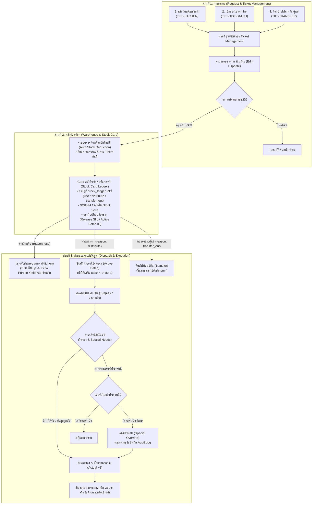
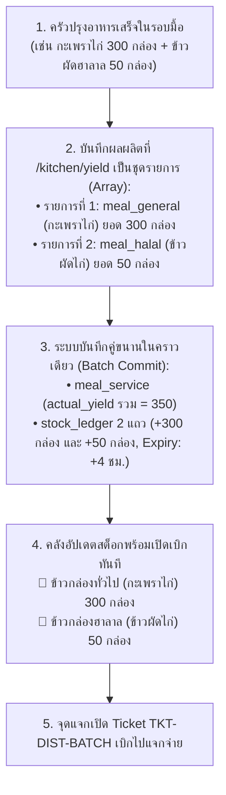
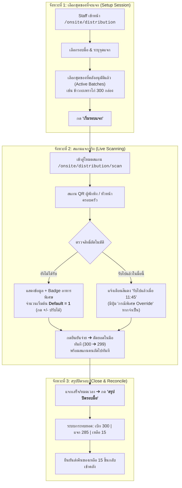
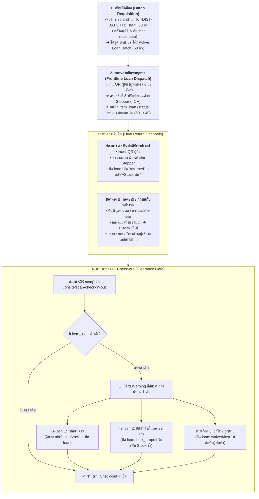
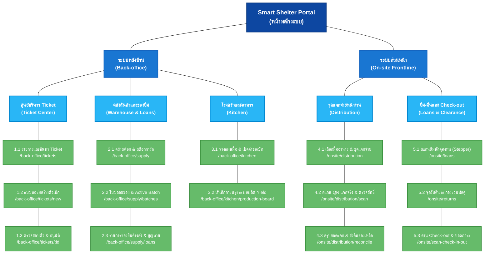

# ข้อกำหนดระบบตั๋วเบิกคลังและแจกจ่ายสิ่งของหน้างาน
## (Requisition Ticket & Frontline Distribution Specification)

> **สรุปภาพรวม (TL;DR):**  
> จัดการวงจรเบิกจ่ายพัสดุและอาหาร 3 ประเภท เชื่อมโยง **โรงครัว ➔ คลังสินค้า ➔ จุดแจกจ่ายหน้างาน** รองรับการตัดสต็อกคลังอัตโนมัติ การสแกน QR ตรวจสิทธิ์และเงื่อนไขพิเศษรายบุคคล (Default = 1 ชิ้น, ปรับจำนวนได้) พร้อมระบบกระทบยอด (Reconciliation) ปิดรอบการแจกจ่าย

---

## 1. ประเภทของตั๋วเบิกจ่าย (3 Requisition Types)

อ้างอิงสถาปัตยกรรมคลังสินค้าและเหตุผลการตัดสต็อกตาม `CR-059`:

| ประเภทตั๋ว (Type)            | ชื่อเอกสาร         | วัตถุประสงค์                      | ปลายทาง            | Stock Ledger Reason    |
| :------------------------- | :--------------- | :----------------------------- | :----------------- | :--------------------- |
| **Type 1: TKT-KITCHEN**    | ตั๋วเบิกวัตถุดิบเข้าครัว | เบิกวัตถุดิบ/เครื่องปรุงไปประกอบอาหาร | โรงครัวของศูนย์       | `reason: use`          |
| **Type 2: TKT-DIST-BATCH** | ตั๋วเบิกของไปแจกจ่าย | เบิกอาหารปรุงสุก/ของใช้ไปแจกผู้พักพิง  | จุดแจกจ่ายหน้างาน     | `reason: distribute`   |
| **Type 3: TKT-TRANSFER**   | ตั๋วโอนย้ายพัสดุ      | โอนย้ายของระหว่างคลังหรือข้ามศูนย์    | คลังปลายทาง / ศูนย์อื่น | `reason: transfer_out` |

### 1.1 การรวมศูนย์ผ่าน Ticket Dashboard (Single Table with Type Filter)
ตั๋วเบิกทั้ง 3 ประเภทถูกรวมศูนย์ไว้ที่หน้าจอหลัก **`/back-office/tickets`** หน้าเดียว เพื่อความเรียบง่ายและไม่ซับซ้อน โดยใช้ **ตารางเดียวร่วมกับแถบตัวกรองประเภท (Type Filter Pills)**:
* **แถบตัวกรองประเภท:** `[ ทั้งหมด ]` `[ 🍳 เบิกเข้าครัว ]` `[ 📦 เบิกไปแจกจ่าย ]` `[ 🚚 โอนย้ายข้ามศูนย์ ]`
* **กลไกการทำงาน:** โหลดข้อมูล Ticket มารอบเดียว แล้วใช้ State กรองข้อมูลบนตารางทันที (Client-side / Query Filter) รวดเร็ว ลื่นไหล ไม่โหลดหน้าใหม่
* **Badge Counters:** แสดงตัวเลขตั๋วที่รออนุมัติกำกับบนแต่ละปุ่มกรอง เช่น `เบิกเข้าครัว (2)` ช่วยให้คลังเห็นงานค้างได้ทันที

### 1.2 การแยกพฤติกรรมตั๋วเบิกตามประเภทพัสดุ (Behavior by `type_class`)
ระบบจำแนกประเภทพัสดุในตั๋วเบิกผ่านฟิลด์ `type_class` เพื่อควบคุม Business Logic ให้ถูกต้องตามลักษณะการใช้งานจริง:
* **🍱 `prepare_food` (อาหารปรุงสำเร็จ/อาหารพร้อมทาน — เพิ่มใหม่):**
  * **บังคับระบุมื้ออาหาร (`meal_round`):** ต้องระบุ เช้า / กลางวัน / เย็น / ของว่าง
  * **บังคับกฎควบคุมอายุอาหาร (Food Safety):** สต็อกมีอายุเพียง **4 ชั่วโมง** นับจากเวลาปรุงเสร็จ เกินกำหนดระบบจะบล็อกจ่ายทันที
  * **โหมดแจกจ่ายหน้างาน (Live QR Scan):** ส่งเข้าสู่โฟลว์สแกนแจกจ่ายจำกัดสิทธิ์ **1 คน ต่อ 1 มื้อ**
* **📦 `CONSUMABLE` (วัสดุสิ้นเปลือง/วัตถุดิบ/ของแห้ง):** ข้าวสาร น้ำมันพืช ยารักษาโรค สบู่ ยาสีฟัน — แจกตามรอบเสบียงหรือเบิกเข้าครัวประกอบอาหาร (ไม่ผูกกับกฎ 4 ชั่วโมง)
* **⛺ `DURABLE` (สิ่งของคงทน):** เต็นท์ มุ้ง ผ้าห่ม — แจกแบบครั้งเดียวต่อคน/ครัวเรือน (`one_time`) หรือติดตามการส่งคืน (`returnable`)
* **🔧 `EQUIPMENT` (ครุภัณฑ์และเครื่องมือ):** ถังแก๊ส เครื่องครัวขนาดใหญ่ — เบิกใช้งานพร้อมบันทึกสถานะทรัพย์สิน (`asset_status`) และต้องส่งคืนคลังเมื่อปิดศูนย์

---

## 2. ผังกระบวนการทำงานหลัก (End-to-End Workflow)

กระบวนการแบ่งเป็น 3 ช่วงตามลำดับจากบนลงล่าง: **1. ยื่นคำขอ ➔ 2. อนุมัติและตัดสต็อกคลัง ➔ 3. ปลายทางรับไปปฏิบัติการ**



### วงจรสถานะของตั๋วเบิก (Ticket Lifecycle)
* `DRAFT` ➔ อยู่ระหว่างร่างรายการ
* `REQUESTED` ➔ ยื่นคำขอ รออนุมัติ
* `APPROVED` ➔ อนุมัติแล้ว รอจัดของ
* `ALLOCATED / DISPATCHED` ➔ คลังตัดสต็อกและส่งมอบของให้ผู้ถือตั๋ว
* `IN_DISTRIBUTION` ➔ กำลังแจกจ่ายหน้างาน (เฉพาะ Type 2)
* `COMPLETED` ➔ สรุปยอดแจกจริงและคืนของเหลือเข้าคลังเสร็จสิ้น
* `CANCELLED` ➔ ยกเลิกคำขอ

---

## 3. การเชื่อมต่อ ครัว ↔ คลัง และ Master Data (Kitchen Yield Integration)

เพื่อป้องกันปัญหา **Master Data บวม (Catalog Bloat)** จากเมนูอาหารที่เปลี่ยนทุกวันตามของบริจาค ระบบใช้แนวทาง **"Standard Archetypes + Dynamic Lot Metadata"**

### 3.1 รายการอาหารปรุงสำเร็จมาตรฐาน (Standard Meal Archetypes)
กำหนด Master Data กลางไว้ 5 รายการใน `catalog` โดยขยายฟิลด์ **`type_class: 'prepare_food'`** (อาหารปรุงสำเร็จพร้อมทาน) เพื่อแยกออกจาก `CONSUMABLE` (วัตถุดิบ/ของแห้ง) ชัดเจน:

| รหัสสินค้า (`_id`)               | ชื่อสินค้า                      | ประเภท (`type_class`) | หน่วย     | กลุ่มเป้าหมายที่แจกได้                      |
| :---------------------------- | :-------------------------- | :-------------------- | :------- | :------------------------------------ |
| `item_master:meal_general`    | ข้าวกล่องปรุงสำเร็จ (อาหารทั่วไป)  | `prepare_food`        | กล่อง     | ผู้พักพิงทั่วไปทุกคน                         |
| `item_master:meal_halal`      | ข้าวกล่องปรุงสำเร็จ (ฮาลาล)      | `prepare_food`        | กล่อง     | ชาวมุสลิม (`halal`)                     |
| `item_master:meal_vegetarian` | ข้าวกล่องปรุงสำเร็จ (มังสวิรัติ/เจ)  | `prepare_food`        | กล่อง     | มังสวิรัติ (`vegetarian`)                 |
| `item_master:meal_soft`       | อาหารปรุงสำเร็จ (อาหารอ่อน/โจ๊ก) | `prepare_food`        | ถ้วย/กล่อง | ผู้สูงอายุ/ติดเตียง (`elderly`/`bedridden`) |
| `item_master:meal_infant`     | อาหารเสริมเด็กอ่อน/ทารก        | `prepare_food`        | ถ้วย      | ทารกและเด็กเล็ก (`infant`)              |

*(หมายเหตุ: ตัดคอลัมน์หมวดหมู่ `category` ออกจาก Master Archetypes เนื่องจากเป็น Dynamic Choice ที่ผู้ใช้เลือกจาก `item_category` ตอนบันทึกเข้าคลัง)*

> **💡 การจำแนกด้วย `type_class = 'prepare_food'`:**
> ช่วยให้ระบบตั๋วเบิก (`TKT-DIST-BATCH`) และระบบคลังสต็อกการ์ด สามารถคัดกรองได้อัตโนมัติว่าไอเทมใดต้องบังคับใช้ **กฎควบคุมอายุ 4 ชั่วโมง** และเปิดโหมดสแกนแจกจ่ายรายมื้อหน้างาน โดยไม่ไปปะปนกับของบริโภคทั่วไป เช่น ข้าวสาร น้ำดื่ม หรือปลากระป๋องที่เป็น `CONSUMABLE`

### 3.2 กฎการบันทึก Lot และความปลอดภัยทางอาหาร (Food Safety Invariants)
1. **ชื่อเมนูจริง:** บันทึกลงในฟิลด์ `lot.note` เช่น `"ข้าวกะเพราไก่ไข่ดาว"` โดยไม่ต้องเปิด SKU ใหม่
2. **รหัสล็อต:** ออกอัตโนมัติรูปแบบ `L-YYMMDD-XXX` (CR-088) พร้อมระบุโซนพักของ (`storage_zone`)
3. **⚠️ อายุอาหารปรุงสุก (Shelf-Life) = 4 ชั่วโมง:**
   * คำนวณ `lot.expiry = เวลาปรุงเสร็จ + 4 ชม.`
   * หากเกิน 4 ชม. สต็อกจะขึ้นสถานะ **"🚨 หมดอายุ (EXPIRED)"** และ **บล็อกการสแกนแจกจ่ายทันที**

### 3.3 โฟลว์การบันทึกผลผลิตเข้าคลังแบบชุดรายการ (Batch Yield as Array)

ใน 1 รอบมื้อ ครัวมักปรุงอาหารหลายประเภทพร้อมกัน (เช่น ข้าวทั่วไป 300 กล่อง, ข้าวฮาลาล 50 กล่อง, ข้าวต้ม 20 ถ้วย) ระบบจึงรองรับการส่งผลผลิตเป็น **Array ของรายการอาหาร (`items: [...]`)** เพื่อบันทึกเข้าคลังใน Transaction เดียว:



---

## 4. การเบิกของและแจกจ่ายจริงหน้างาน (On-site Distribution)

### 4.1 ผังกระบวนการแจกจ่าย 3 จังหวะ (3-Step Distribution Flow)



### 4.2 กฎการทำงานสำคัญ (Business Rules)
1. **การตรวจจับมื้ออาหาร (Meal Period Resolution):**
   * ล็อกตาม Ticket ที่เลือกเป็นหลัก
   * หรือตรวจจับตามเวลาจริง: เช้า (`06:00–09:30`), กลางวัน (`11:00–13:30`), เย็น (`17:00–19:30`), นอกเวลานี้คือของว่าง (`snack`)
   * Staff มีสิทธิ์กดสลับมื้อได้เองบน Header หากแจกเหลื่อมเวลา
2. **การตรวจสิทธิ์และเงื่อนไขพิเศษ (Validation & Flags):**
   * โควตามาตรฐาน: 1 สิทธิ์ ต่อ 1 คน ต่อ 1 มื้อ
   * แสดง Badge แจ้งเตือนเงื่อนไขพิเศษทันทีเมื่อสแกน: ⚠️ ฮาลาล, ⚠️ อาหารเด็ก, ⚠️ แพ้อาหาร, ⚠️ ผู้ป่วยติดเตียง
   * หากสแกน QR หัวหน้าครอบครัว ระบบจะแสดงจำนวนสมาชิกในบ้านที่ Active อยู่เพื่อใช้อ้างอิง
3. **การปรับจำนวนและการรับซ้ำ:**
   * **Default Quantity = 1:** จำนวนจ่ายตั้งต้นเป็น 1 ชิ้นเสมอ
   * **Quantity Stepper (`[-] 1 [+]`):** Staff กดปรับเพิ่ม/ลดจำนวนได้หน้างานจริง (เช่น รับแทนครอบครัว)
   * **Special Override:** กรณีสแกนซ้ำแต่มีความจำเป็น (อาหารหก/มีสมาชิกเพิ่ม) Staff สามารถกดอนุมัติพร้อมบันทึกเหตุผลลง Audit Log

### 4.3 องค์ประกอบหน้าจอหลัก (Key Screen Specs)
* **หน้าเลือกชุดของ (`/onsite/distribution`):** แสดงตัวเลือกมื้ออาหาร, รายการ Ticket ที่คลังปล่อยของแล้ว (Active Batches) พร้อมจำนวนคงเหลือในมือ และปุ่มเริ่มรอบแจก
* **หน้าจอสแกนจริง (`/onsite/distribution/scan`):** โหมดกล้องสแกน QR อัตโนมัติ (พร้อมช่องค้นหาชื่อ/เต็นท์), การ์ดแสดงข้อมูลผู้พักพิงและ Badge อาหารพิเศษ, Stepper ปรับจำนวน `[-] [1] [+]`, ปุ่มยืนยันจ่ายขนาดใหญ่ และปุ่ม Override สีส้ม

---

## 5. การเบิกจ่ายสิ่งของคงทนและการติดตามรับคืน (Returnable Items & Loan Lifecycle)

สำหรับสิ่งของคงทน (`type_class: 'DURABLE'`) และครุภัณฑ์/อุปกรณ์ (`type_class: 'EQUIPMENT'`) ที่ต้องนำกลับมาใช้งานซ้ำ เช่น **พัดลม, มุ้ง, เต็นท์, วีลแชร์, ปลั๊กพ่วง, วิทยุสื่อสาร, เสื้อกั๊กสะท้อนแสง** ระบบได้ออกแบบกระบวนการควบคุม 2 ชั้น (Two-Tier Accountability) เพื่อความคล่องตัวหน้างานสูงสุด โดย**ไม่ใช้ Barcode หรือ Asset Tag รายชิ้น** แต่ใช้การนับจำนวนผูกกับตัวบุคคล

### 5.1 ผังกระบวนการยืมและคืน 4 จังหวะ (The 4-Stage Loan & Return Lifecycle)



### 5.2 การควบคุม 2 ชั้น (Two-Tier Accountability)
1. **ระดับล็อต (Batch Level - คลัง ➔ จุดบริการ):**
   * จุดบริการ/โต๊ะแจกเปิดตั๋ว `TKT-DIST-BATCH` ขอเบิกสิ่งของคงทนเป็นล็อต (เช่น พัดลม 50 ตัว, ปลั๊กพ่วง 20 อัน)
   * เมื่อคลังอนุมัติ ระบบจะตัดสต็อกคลังทันที (`reason: distribute`) และส่งมอบของให้อยู่ในสถานะ **Active Loan Batch**
   * เมื่อสิ้นสุดวันหรือปิดจุดบริการ ของที่ยังไม่ได้แจกยืมจะถูกกระทบยอดและส่งคืนคลังตามขั้นตอนปกติ
2. **ระดับบุคคล (Loan Level - จุดบริการ ➔ ผู้พักพิง/อาสาสมัคร):**
   * เจ้าหน้าที่จ่ายของให้ผู้ยืมผ่านการสแกน QR ผู้ยืม และปรับจำนวนด้วยปุ่ม Stepper `[-] 1 [+]`
   * ระบบสร้างระเบียน **`item_loan`** ผูกกับรหัสผู้ยืม (`borrower_id`) และอ้างอิง `ticket_id` ต้นทาง
   * **ปราศจากบาร์โค้ด (No Barcode Tracking):** เพื่อความรวดเร็วสูงสุด ไม่ต้องเสียเวลาติดสติกเกอร์บาร์โค้ดรายชิ้นหรือยิงบาร์โค้ดหน้างาน ใช้การบันทึกจำนวน (`qty_loaned`, `qty_returned`) และสภาพของตอนคืนเท่านั้น

### 5.3 ขอบเขตการผูกผู้ยืม (Borrower Scope)
1. **ผู้พักพิงรายบุคคล (`borrower_type: 'evacuee'`):**
   * ผูกความรับผิดชอบไว้ที่ระดับ **"บุคคล (Individual)"** ที่เป็นผู้ถือ QR มาสแกนรับของ (ไม่ใช่ผูกกับเต็นท์หรือครอบครัวรวม)
   * ป้องกันปัญหาเมื่อสมาชิกในครอบครัวแยกย้ายกัน Check-out คนละเวลา หรือมีการย้ายเต็นท์
2. **อาสาสมัคร/เจ้าหน้าที่ปฏิบัติงาน (`borrower_type: 'volunteer'`):**
   * รองรับการยืมอุปกรณ์ปฏิบัติงาน เช่น **วิทยุสื่อสาร (Walkie-Talkie), เสื้อกั๊กสะท้อนแสง, ไฟฉายแรงสูง**
   * อาสาสมัครสแกน QR Digital Ticket ของตนเองเพื่อยืมอุปกรณ์เข้ากะ
   * เมื่อสิ้นสุดกะการทำงาน (Shift Check-out) ระบบจะแจ้งเตือนให้คืนอุปกรณ์ก่อนปิดกะ

### 5.4 ช่องทางการรับคืนของ 2 รูปแบบ (Dual Return Channels)
1. **ช่องทางที่ 1: คืนแบบปกติที่เคาน์เตอร์ (Routine / Warehouse Return):**
   * ผู้ยืมนำของมาคืนที่โต๊ะบริการหรือคลังสินค้าด้วยตนเอง
   * เจ้าหน้าที่สแกน QR ผู้ยืม ระบบจะดึงรายการยืมที่ค้างอยู่ขึ้นมาแสดงทันที
   * เจ้าหน้าที่ตรวจสภาพสิ่งของ (`READY` พร้อมใช้ / `MAINTENANCE` ชำรุดซ่อมได้ / `BROKEN` เสียหายทิ้ง) แล้วกดปุ่มรับคืนตามจำนวน
   * ระบบปรับสถานะ `item_loan` เป็น `returned` และบันทึก `stock_ledger` เพิ่มสต็อกกลับเข้าคลัง (`+Stock`) ทันที
2. **ช่องทางที่ 2: คืนแบบกองรวม / กวาดเก็บหน้างาน (Bulk Drop-off / Floor Sweep):**
   * ในสถานการณ์จริง ผู้พักพิงมักนำของไปวางรวมไว้ที่จุดรวมพล เต็นท์กองกลาง หรือเจ้าหน้าที่เข้ากวาดเก็บพื้นที่หลังผู้พักพิงเดินทางกลับ โดยไม่ได้สแกนชื่อรายคน
   * คลังสินค้าสามารถเปิดหน้าตรวจรับของกองรวม **`/onsite/returns`** เพื่อนับจำนวนสิ่งของสภาพดีเข้าสต็อกคลังทันที (`+Stock` ใน `stock_ledger` ด้วย `reason: return` หรือ `adjust`)
   * **กฎเหล็ก:** ระเบียน `item_loan` รายบุคคลจะยังคงสถานะ `active` อยู่ โดยระบบจะไม่พยายามเดาตัดชื่อมั่ว เพื่อให้ความจริงไปปรากฏและคลี่คลายที่ด่าน Check-out

### 5.5 ด่านตรวจและปลดภาระตอน Check-out (Check-out Gate Clearance)
เมื่อผู้พักพิงหรืออาสาสมัครมาทำการ Check-out ออกจากศูนย์ที่หน้าจอ **`/onsite/scan-check-in-out`**:
1. **Hard Warning Alert:** หากระบบตรวจพบ `item_loan` ที่ยังมีสถานะ `active` หรือ `partially_returned` ระบบจะแสดงกล่องแจ้งเตือนสีส้มเด่นชัด พร้อมแสดงรายการและจำนวนที่ค้างส่ง
2. **กลไก 1-Click Resolve (ไม่กักตัวผู้พักพิง):** เพื่อความรวดเร็วและไม่สร้างคอขวดที่ประตูทางออก เจ้าหน้าที่ประจำด่านสามารถกดปุ่มเลือกแนวทางแก้ไขได้ 3 รูปแบบทันที:
   * **`[ 📦 รับคืนที่ด่าน ]`:** ผู้พักพิงถือของติดมือมาคืนที่ด่านพอดี ➔ บันทึกรับของเข้าสต็อกด่าน (`+Stock`) และปรับสถานะ `item_loan` เป็น `returned`
   * **`[ 🤝 ยืนยันว่าคืนแล้วในกองรวม ]`:** ผู้พักพิงแจ้งว่าได้นำไปวางไว้ที่กองกลางแล้ว ➔ ปรับสถานะ `item_loan` เป็น `returned` (บันทึก `clear_reason: 'bulk_dropoff'`) **โดยไม่เพิ่มสต็อกคลังซ้ำ** เพราะคลังได้ตรวจนับเข้าสต็อกไปแล้วจากขั้นตอน Floor Sweep
   * **`[ ⚠️ ยกให้ / สูญหาย (Waived / Lost) ]`:** กรณีสิ่งของเสียหายหนัก ไม่สามารถนำกลับมาได้ หรือสูญหายไประหว่างภัยพิบัติ ➔ ปรับสถานะเป็น `waived` (ยกเว้นให้) หรือ `lost` (สูญหาย) บันทึกหมายเหตุ และปล่อยให้ Check-out ได้ทันทีโดยไม่ถูกกักตัว

---

## 6. การกระทบยอดและส่งคืนคลัง (Reconciliation & Returns)

> **สมการกระทบยอด:**  
> **ยอดเบิกจากคลัง (Allocated)** = **แจกจ่ายจริง (Distributed)** + **ส่งคืนคลัง (Returned)** + **สูญหาย/เสียหาย (Waste)**

* **ของเหลือสภาพดี:** ระบบสร้าง `stock_ledger` รับคืนเข้าคลัง (`reason: adjust` หรือ `return`, qty: `+Returned`)
* **ของเสีย/บูด (เกิน 4 ชม.):** บันทึกเป็นของเสีย (`waste`) ไม่รับกลับเข้าสต็อกที่ใช้ได้

---

## 7. โครงสร้างข้อมูล (Data Architecture & Schema)

### 7.1 ผังความสัมพันธ์โครงสร้างข้อมูล (Entity Relationship Diagram - ERD)

แผนภาพแสดงความเชื่อมโยงของฐานข้อมูลระหว่าง **Catalog (Master Data) ➔ คลังสินค้า (Stock Ledger) ➔ ตั๋วเบิก (Ticket) ➔ โรงครัว (Kitchen) ➔ หน้างานแจกจ่าย (Distribution) ➔ รายการยืมพัสดุคงทน (Item Loan) ➔ ผู้พักพิง / อาสาสมัคร (Evacuee / Volunteer)**:

```mermaid
erDiagram
    ITEM_MASTER ||--o{ TICKET_ITEM : "item_id"
    ITEM_MASTER ||--o{ STOCK_LEDGER : "item_id"
    ITEM_MASTER ||--o{ KITCHEN_YIELD_ITEM : "item_id"
    ITEM_MASTER ||--o{ ITEM_LOAN : "item_id"

    REQUISITION_TICKET ||--|{ TICKET_ITEM : "items"
    REQUISITION_TICKET ||--o{ STOCK_LEDGER : "ref_id (approve/dispatch)"
    REQUISITION_TICKET ||--o{ DISTRIBUTION_SCAN_LOG : "ticket_id"
    REQUISITION_TICKET ||--o{ ITEM_LOAN : "ticket_id (batch source)"

    MEAL_PLAN ||--o| MEAL_SERVICE : "meal_plan_id"
    MEAL_SERVICE ||--|{ KITCHEN_YIELD_ITEM : "items"
    MEAL_SERVICE ||--o{ STOCK_LEDGER : "ref_id (reason: receive)"

    HOUSEHOLD ||--o{ EVACUEE : "household_id"
    EVACUEE ||--o{ DISTRIBUTION_SCAN_LOG : "evacuee_id"
    HOUSEHOLD ||--o{ DISTRIBUTION_SCAN_LOG : "household_id"
    EVACUEE ||--o{ ITEM_LOAN : "borrower_id (evacuee)"
    VOLUNTEER ||--o{ ITEM_LOAN : "borrower_id (volunteer)"

    ITEM_MASTER {
        string _id PK "item_master:sku or ulid"
        string name "ชื่อสินค้า / Standard Archetype"
        string category "prepared_food / food / hygiene"
        enum type_class "prepare_food / CONSUMABLE / DURABLE / EQUIPMENT"
        string base_unit "กล่อง / ชิ้น / kg"
        enum distribution_type "recurring / one_time"
        json target_restrictions "diet_religions / vulnerable_groups"
    }

    REQUISITION_TICKET {
        string _id PK "ticket:shelter_code:ulid"
        string shelter_code FK "รหัสศูนย์ e.g. sh001"
        string ticket_no "e.g. TKT-DIST-BATCH-0081"
        enum requisition_type "kitchen / distribution / transfer"
        enum status "draft / requested / approved / allocated / in_distribution / completed / cancelled"
        enum meal_round "breakfast / lunch / dinner / snack"
        string source_location "e.g. warehouse:main"
        string destination_location "e.g. distribution_point:zone_a"
        string requested_by FK "user_id"
        string approved_by FK "user_id"
    }

    TICKET_ITEM {
        string item_id FK "item_master id"
        string item_name "ชื่อสินค้า"
        string category "หมวดหมู่สินค้า"
        enum type_class "prepare_food / CONSUMABLE / DURABLE / EQUIPMENT"
        number requested_qty "ยอดขอเบิก"
        number allocated_qty "ยอดจัดสรรจริง"
        number distributed_qty "ยอดแจกจริง"
        number returned_qty "ยอดส่งคืนคลัง"
    }

    STOCK_LEDGER {
        string _id PK "stock_ledger:ulid"
        string shelter_code FK "รหัสศูนย์ e.g. sh001"
        string item_id FK "item_master id"
        string qty "signed decimal string (+ / -)"
        string unit "base_unit"
        enum reason "receive / distribute / use / transfer_out / adjust / return"
        string ref_id FK "ticket:id / meal_service:id"
        json lot "lot_no / note / expiry / storage_zone"
        timestamp occurred_at "เวลาทำรายการ"
    }

    ITEM_LOAN {
        string _id PK "item_loan:ulid"
        string shelter_code FK "รหัสศูนย์ e.g. sh001"
        string item_id FK "item_master id"
        string ticket_id FK "ticket id (batch origin)"
        enum borrower_type "evacuee / volunteer"
        string borrower_id FK "evacuee_id or volunteer_id"
        number qty_loaned "จำนวนที่ยืม (Stepper)"
        number qty_returned "จำนวนที่คืนแล้ว"
        enum status "active / partially_returned / returned / lost / waived"
        enum condition_on_return "READY / MAINTENANCE / BROKEN"
        string clear_reason "bulk_dropoff / routine / waived / lost"
        timestamp loaned_at "เวลายืม"
        string loaned_by FK "staff_id"
        timestamp returned_at "เวลาคืนล่าสุด"
        string returned_by FK "staff_id"
    }

    MEAL_PLAN {
        string _id PK "meal_plan:ulid"
        string date "YYYY-MM-DD"
        enum meal "breakfast / lunch / dinner / snack"
        json headcount "total / halal / soft_food / infant"
    }

    MEAL_SERVICE {
        string _id PK "meal_service:ulid"
        string meal_plan_id FK "meal_plan id"
        number actual_yield "ยอดผลผลิตรวม"
        number served "ยอดเสิร์ฟจริง"
        number waste "ยอดสูญเสีย"
    }

    KITCHEN_YIELD_ITEM {
        string item_id FK "item_master id"
        string menu_name "ชื่อเมนูจริง e.g. กะเพราไก่"
        enum type_class "prepare_food"
        number actual_yield "จำนวนที่ทำได้"
        string unit "กล่อง / ถ้วย"
        string storage_zone "จุดพักอาหารปรุงสุก"
    }

    DISTRIBUTION_SCAN_LOG {
        string _id PK "dist_log:ulid"
        string ticket_id FK "ticket id"
        string shelter_code FK "รหัสศูนย์ e.g. sh001"
        string evacuee_id FK "evacuee id"
        string household_id FK "household id opt"
        enum meal_round "มื้ออาหาร"
        json items_received "item_id และ qty"
        string scanned_by FK "staff_id"
        boolean is_override "อนุมัติพิเศษ"
        string override_reason "สาเหตุ override"
        timestamp scanned_at "เวลาสแกนรับ"
    }

    EVACUEE {
        string _id PK "evacuee:ulid"
        string full_name "ชื่อ-นามสกุล"
        string household_id FK "household id"
        enum stay_status "active / leave / discharged"
        json special_needs "infant / elderly / bedridden"
        string religion "muslim -> halal flag"
    }

    HOUSEHOLD {
        string _id PK "household:code"
        string shelter_code "รหัสศูนย์"
        string tent_no "เลขเต็นท์ / โซน"
        number member_count "จำนวนสมาชิก"
    }

    VOLUNTEER {
        string _id PK "volunteer:ulid"
        string full_name "ชื่อ-นามสกุล อาสาสมัคร"
        string role "หน้าที่ / ฝ่ายปฏิบัติการ"
        string phone "เบอร์ติดต่อ"
        enum status "active_shift / off_duty"
    }
```



### 7.2 โครงสร้างข้อมูล (TypeScript Interfaces)

อ้างอิงและสอดคล้องกับ CouchDB Remote-First Architecture และ `BaseDoc` (`$lib/db/model.ts`):

```typescript
import type { BaseDoc, Timestamp } from '$lib/db/model';

// ================================================================
// 1. Common Types & Enums
// ================================================================

export type TypeClass = 'prepare_food' | 'CONSUMABLE' | 'DURABLE' | 'EQUIPMENT';
export type RequisitionType = 'kitchen' | 'distribution' | 'transfer';
export type TicketStatus = 'draft' | 'requested' | 'approved' | 'allocated' | 'in_distribution' | 'completed' | 'cancelled';
export type MealRound = 'breakfast' | 'lunch' | 'dinner' | 'snack';

export type BorrowerType = 'evacuee' | 'volunteer';
export type ItemLoanStatus = 'active' | 'partially_returned' | 'returned' | 'lost' | 'waived';
export type ItemCondition = 'READY' | 'MAINTENANCE' | 'BROKEN';
export type LoanClearReason = 'routine' | 'bulk_dropoff' | 'waived' | 'lost';

export type LedgerReason = 'receive' | 'distribute' | 'use' | 'transfer_out' | 'adjust' | 'return';

// ================================================================
// 2. Requisition Ticket (ตั๋วเบิกจ่ายพัสดุและอาหาร)
// ================================================================

export interface TicketItem {
  item_id: string; // FK item_master
  item_name: string;
  category?: string; // dynamic choice จาก ItemCategory
  type_class: TypeClass; // 'prepare_food' | 'CONSUMABLE' | 'DURABLE' | 'EQUIPMENT'
  requested_qty: number;
  allocated_qty: number;
  distributed_qty: number;
  returned_qty: number;
}

export interface RequisitionTicket extends BaseDoc {
  type: 'requisition_ticket'; // CouchDB document discriminator
  ticket_no: string; // e.g. TKT-DIST-BATCH-0081
  requisition_type: RequisitionType; // 'kitchen' | 'distribution' | 'transfer'
  status: TicketStatus;
  meal_round?: MealRound;
  source_location: string; // warehouse:main
  destination_location: string; // distribution_point:zone_a
  requested_by: string; // user_id
  approved_by?: string;
  dispatched_by?: string;
  items: TicketItem[];
}

// ================================================================
// 3. Kitchen Operations & Yield (โรงครัวและการบันทึกผลผลิต)
// ================================================================

export type StandardMealArchetypeId =
  | 'item_master:meal_general'
  | 'item_master:meal_halal'
  | 'item_master:meal_vegetarian'
  | 'item_master:meal_soft'
  | 'item_master:meal_infant'
  | (string & {});

export interface KitchenYieldItem {
  item_id: StandardMealArchetypeId;
  menu_name: string; // เช่น "ข้าวกะเพราไก่ไข่ดาว" บันทึกลง stock_ledger.lot.note
  type_class: 'prepare_food';
  actual_yield: number; // ยอดปรุงเสร็จจริงของเมนูนี้ เช่น 300
  unit: string; // "กล่อง" | "ถ้วย"
  storage_zone?: string; // จุดพักอาหารปรุงสุก โซนครัว
}

export interface KitchenYieldInput {
  meal_plan_id: string;
  meal_round: MealRound;
  cooking_completed_at: number; // epoch ms (ระบบคำนวณ lot.expiry = cooking_completed_at + 4 ชม.)
  items: KitchenYieldItem[]; // รองรับบันทึกหลายเมนูพร้อมกันใน 1 รอบมื้อ (Array)
}

// ================================================================
// 4. Distribution Scanning (การแจกจ่ายหน้างาน)
// ================================================================

export interface DistributionScanLog extends BaseDoc {
  type: 'distribution_scan_log'; // CouchDB document discriminator
  ticket_id: string; // FK requisition_ticket
  meal_round?: MealRound;
  evacuee_id: string; // FK evacuee
  household_id?: string;
  items_received: Array<{ item_id: string; qty: number }>;
  scanned_by: string; // staff user_id
  is_override: boolean;
  override_reason?: string;
  scanned_at: Timestamp;
}

// ================================================================
// 5. Item Loan Lifecycle (การยืม-คืนสิ่งของคงทนและครุภัณฑ์)
// ================================================================

export interface ItemLoan extends BaseDoc {
  type: 'item_loan'; // CouchDB document discriminator
  item_id: string; // FK item_master
  ticket_id: string; // FK requisition_ticket (Active Batch origin)
  borrower_type: BorrowerType; // 'evacuee' | 'volunteer'
  borrower_id: string; // evacuee_id or volunteer_id
  qty_loaned: number; // จำนวนที่ยืม (บันทึกด้วย Stepper [-] 1 [+])
  qty_returned: number; // จำนวนที่คืนแล้ว
  status: ItemLoanStatus; // 'active' | 'partially_returned' | 'returned' | 'lost' | 'waived'
  condition_on_return?: ItemCondition;
  clear_reason?: LoanClearReason;
  loaned_at: Timestamp;
  loaned_by: string; // staff user_id
  returned_at?: Timestamp;
  returned_by?: string;
  notes?: string;
}

// ================================================================
// 6. Stock Ledger (สต็อกการ์ดบันทึกความเคลื่อนไหวคลังสินค้า)
// ================================================================

export interface StockLot {
  lot_no?: string; // L-YYMMDD-XXX (CR-088)
  note?: string; // ชื่อเมนูจริง / คำอธิบายล็อต
  expiry?: Timestamp; // วันหมดอายุ (อาหารปรุงเสร็จ = เวลาปรุง + 4 ชม.)
  storage_zone?: string; // โซนจัดเก็บ
}

export interface StockLedger extends BaseDoc {
  type: 'stock_ledger'; // CouchDB document discriminator
  item_id: string; // FK item_master
  qty: string; // signed decimal string: "+300", "-5" (CR-055 / schema.md §2.1)
  unit: string;
  reason: LedgerReason; // 'receive' | 'distribute' | 'use' | 'transfer_out' | 'adjust' | 'return'
  ref_id: string | null; // FK ticket:id / meal_service:id
  lot?: StockLot;
  occurred_at: Timestamp;
}
```

---

## 8. แผนผังเว็บไซต์และโมดูล (Sitemap & System Modules)

โครงสร้างระบบแบ่งออกเป็น **2 โมดูลใหญ่ (Major Modules)** ครอบคลุม **5 โมดูลย่อย รวม 14 หน้าจอ**:
1. **ระบบหลังบ้าน (Back-office Module):** ครอบคลุม Ticket Center, คลังสินค้าและติดตามของยืม (Warehouse & Loans) และโรงครัว (Kitchen)
2. **ระบบส่วนหน้า (On-site Frontline Module):** ครอบคลุมจุดแจกจ่ายอาหาร/ของใช้ (Distribution), จุดยืม-คืนพัสดุคงทน (Loans & Returns) และด่าน Check-out Clearance



### สรุปสารบบหน้าจอและเส้นทาง (Module & Page Directory)

| โมดูลหลัก (Major)                             | โมดูลย่อย (Sub-module)                                 |  ลำดับ  | หน้าจอ (Page Name)                                         | URL Route                               | ผู้ใช้งานหลัก (Roles)                  | หน้าที่และความสามารถหลัก (Primary Functions)                                                                                                |
| ------------------------------------------- | ---------------------------------------------------- | :---: | --------------------------------------------------------- | --------------------------------------- | ---------------------------------- | --------------------------------------------------------------------------------------------------------------------------------------- |
| **1. ระบบหลังบ้าน**<br/>*(Back-office)*       | **1.1 ศูนย์บริหาร Ticket**<br/>*(Ticket Center)*        |   1   | **ศูนย์ควบคุมตั๋วเบิก (Ticket Dashboard)**                      | `/back-office/tickets`                  | Admin, Warehouse, Kitchen, Staff   | แดชบอร์ดแบบตารางเดียว (Single Table) พร้อมแถบตัวกรองประเภท (`ทั้งหมด`, `🍳 เบิกเข้าครัว`, `📦 เบิกไปแจก`, `🚚 โอนย้าย`) และ Badge ตัวเลขรออนุมัติ         |
|                                             |                                                      |   2   | **แบบฟอร์มสร้างตั๋วเบิก (Create Ticket)**                      | `/back-office/tickets/new`              | Kitchen, Staff จุดแจก, ผู้ประสานงาน   | ฟอร์มขอเบิกพัสดุและอาหาร ระบุรายการ สิ่งของ/Lot จำนวนที่ต้องการ                                                                                    |
|                                             |                                                      |   3   | **ตรวจสอบตั๋ว & อนุมัติ (Ticket Detail & Approve)**            | `/back-office/tickets/[id]`             | Warehouse Manager, Center Director | ตรวจสอบรายการ ตรวจสต็อกคงเหลือ และกด **อนุมัติ (Approve)** เพื่อตัดสต็อกคลัง                                                                      |
|                                             | **1.2 คลังสินค้าและของยืม**<br/>*(Warehouse & Loans)*    |   4   | **สต็อกการ์ด & ยอดคงเหลือ (Stock Balance & Ledger)**         | `/back-office/supply`                   | Warehouse Staff, Admin             | เช็กยอดคงเหลือตาม Master Data, บันทึกความเคลื่อนไหว `stock_ledger` ทุกเหตุผล (`use`, `distribute`, `transfer_out`)                              |
|                                             |                                                      |   5   | **ใบปล่อยของ & ชุดแจกจ่าย (Release Slips & Batches)**        | `/back-office/supply/batches`           | Warehouse Staff                    | ตรวจสอบการปล่อยของ (Release Slip) และติดตามสถานะ Active Batch สำหรับจุดแจก                                                                   |
|                                             |                                                      |   6   | **ติดตามของยืมค้างส่ง & สูญหาย (Loan Monitor & Loss)**         | `/back-office/supply/loans`             | Warehouse Staff, Center Director   | ตรวจสอบรายการยืมพัสดุคงทนที่ยังไม่คืน สรุปยอดสูญหาย/จำหน่าย (Lost/Waived Ledger) แยกรายศูนย์                                                          |
|                                             | **1.3 โรงครัวและอาหาร**<br/>*(Kitchen Operations)*    |   7   | **วางแผนมื้อ & เบิกวัตถุดิบ (Kitchen Planning & Requisition)**  | `/back-office/kitchen`                  | Kitchen Lead, Dietitian            | วางแผนรอบมื้ออาหาร คำนวณวัตถุดิบ (BOM) ตาม Headcount และสร้าง Ticket เบิกวัตถุดิบ (`TKT-KITCHEN`)                                                  |
|                                             |                                                      |   8   | **บันทึกผลผลิตอาหารปรุงสุก (Production Board & Yield)**        | `/back-office/kitchen/production-board` | Kitchen Staff                      | บันทึกยอดปรุงเสร็จจริง (Actual Portion Yield) รับอาหารเข้าสต็อกคลัง (Shelf-life 4 ชม.)                                                           |
| **2. ระบบส่วนหน้า**<br/>*(On-site Frontline)* | **2.1 จุดแจกจ่ายหน้างาน**<br/>*(Distribution Point)*    |   9   | **เลือกมื้อ & ชุดของที่จะแจก (Distribution Setup)**             | `/onsite/distribution`                  | Distribution Staff                 | เลือก Ticket / Active Batch ที่คลังปล่อยของแล้ว เลือกรอบมื้อ (เช้า/กลางวัน/เย็น) เปิดรอบการแจก                                                       |
|                                             |                                                      |  10   | **สแกน QR แจกจริง & ตรวจสิทธิ์ (Live QR Scan & Eligibility)** | `/onsite/distribution/scan`             | Distribution Staff                 | สแกน QR ผู้พักพิง/ครอบครัว ตรวจสอบโควตา (Default=1 ชิ้น, ปรับได้) แสดงธงเตือนพิเศษ และปุ่ม Override                                                  |
|                                             |                                                      |  11   | **สรุปกระทบยอดปิดรอบมื้อ (Reconciliation & Return)**          | `/onsite/distribution/reconcile`        | Distribution Staff, Warehouse Lead | กระทบยอดส่งมอบ: เบิกมา (Allocated) vs แจกจริง (Actual), คำนวณของเหลือส่งคืนคลัง และปิดรอบ                                                        |
|                                             | **2.2 ยืม-คืนและ Check-out**<br/>*(Loans & Clearance)* |  12   | **สแกนยืมพัสดุคงทน (Frontline Item Loan)**                   | `/onsite/loans`                         | Service Staff, Volunteer Lead      | สแกน QR ผู้พักพิง/อาสาสมัครเพื่อยืมของคงทน (พัดลม, มุ้ง, วอ) ปรับจำนวนด้วย Stepper `[-] 1 [+]` (ไม่ใช้บาร์โค้ด)                                           |
|                                             |                                                      |  13   | **จุดรับคืน & กองรวมพัสดุ (Routine & Bulk Return)**            | `/onsite/returns`                       | Warehouse Staff, Shift Lead        | รับคืนรายบุคคลพร้อมตรวจสภาพของ (`READY`/`MAINTENANCE`/`BROKEN`) และตรวจนับของคืนจากกองรวม (Bulk Drop-off / Floor Sweep) เพื่อรับเข้าสต็อกคลัง       |
|                                             |                                                      |  14   | **ด่าน Check-out & เคลียร์ของยืม (Check-out Clearance Gate)** | `/onsite/scan-check-in-out`             | Gate Staff, Registration Staff     | สแกนผู้พักพิง/อาสาสมัครออกจากศูนย์ ตรวจจับ Hard Warning ของยืมค้างส่ง พร้อมปุ่ม 1-Click Resolve 3 ทางเลือก (`รับคืนที่ด่าน`, `คืนในกองรวมแล้ว`, `ยกให้/สูญหาย`) |
