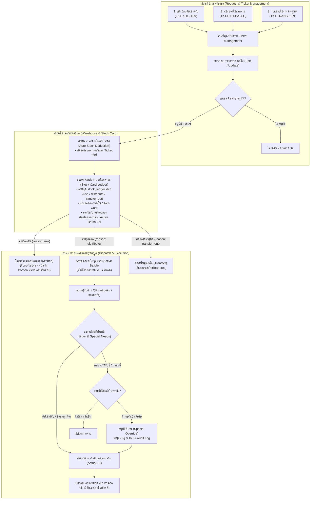
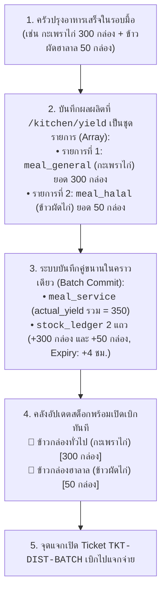
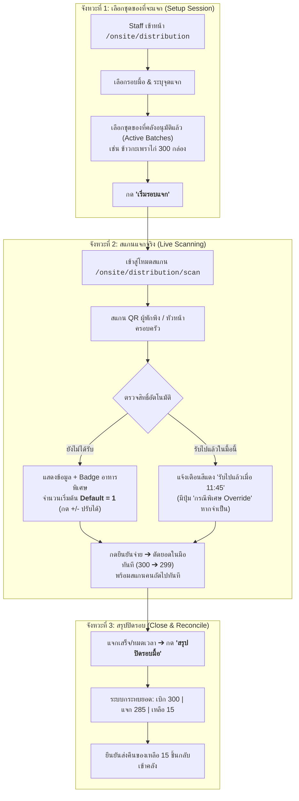
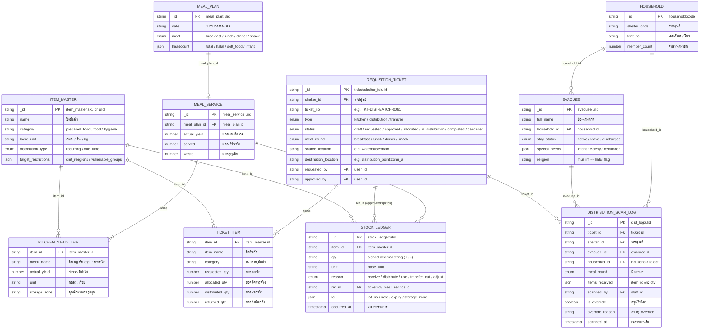
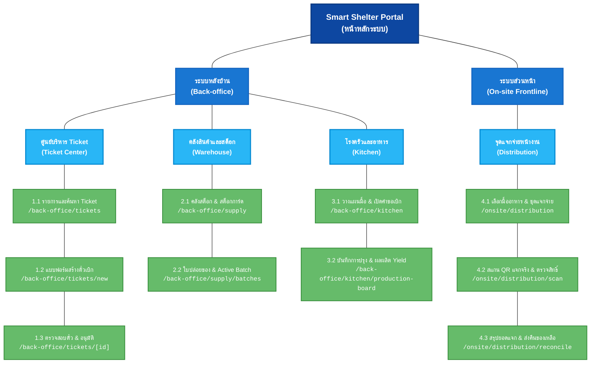

# ข้อกำหนดระบบตั๋วเบิกคลังและแจกจ่ายสิ่งของหน้างาน
## (Requisition Ticket & Frontline Distribution Specification)

> **สรุปภาพรวม (TL;DR):**  
> จัดการวงจรเบิกจ่ายพัสดุและอาหาร 3 ประเภท เชื่อมโยง **โรงครัว ➔ คลังสินค้า ➔ จุดแจกจ่ายหน้างาน** รองรับการตัดสต็อกคลังอัตโนมัติ การสแกน QR ตรวจสิทธิ์และเงื่อนไขพิเศษรายบุคคล (Default = 1 ชิ้น, ปรับจำนวนได้) พร้อมระบบกระทบยอด (Reconciliation) ปิดรอบการแจกจ่าย

---

## 1. ประเภทของตั๋วเบิกจ่าย (3 Requisition Types)

อ้างอิงสถาปัตยกรรมคลังสินค้าและเหตุผลการตัดสต็อกตาม `CR-059`:

| ประเภทตั๋ว (Type)            | ชื่อเอกสาร         | วัตถุประสงค์                      | ปลายทาง            | Stock Ledger Reason    |
| :------------------------- | :--------------- | :----------------------------- | :----------------- | :--------------------- |
| **Type 1: TKT-KITCHEN**    | ตั๋วเบิกวัตถุดิบเข้าครัว | เบิกวัตถุดิบ/เครื่องปรุงไปประกอบอาหาร | โรงครัวของศูนย์       | `reason: use`          |
| **Type 2: TKT-DIST-BATCH** | ตั๋วเบิกของไปแจกจ่าย | เบิกอาหารปรุงสุก/ของใช้ไปแจกผู้พักพิง  | จุดแจกจ่ายหน้างาน     | `reason: distribute`   |
| **Type 3: TKT-TRANSFER**   | ตั๋วโอนย้ายพัสดุ      | โอนย้ายของระหว่างคลังหรือข้ามศูนย์    | คลังปลายทาง / ศูนย์อื่น | `reason: transfer_out` |

### 1.1 การรวมศูนย์ผ่าน Ticket Dashboard (Single Table with Type Filter)
ตั๋วเบิกทั้ง 3 ประเภทถูกรวมศูนย์ไว้ที่หน้าจอหลัก **`/back-office/tickets`** หน้าเดียว เพื่อความเรียบง่ายและไม่ซับซ้อน โดยใช้ **ตารางเดียวร่วมกับแถบตัวกรองประเภท (Type Filter Pills)**:
* **แถบตัวกรองประเภท:** `[ ทั้งหมด ]` `[ 🍳 เบิกเข้าครัว ]` `[ 📦 เบิกไปแจกจ่าย ]` `[ 🚚 โอนย้ายข้ามศูนย์ ]`
* **กลไกการทำงาน:** โหลดข้อมูล Ticket มารอบเดียว แล้วใช้ State กรองข้อมูลบนตารางทันที (Client-side / Query Filter) รวดเร็ว ลื่นไหล ไม่โหลดหน้าใหม่
* **Badge Counters:** แสดงตัวเลขตั๋วที่รออนุมัติกำกับบนแต่ละปุ่มกรอง เช่น `เบิกเข้าครัว (2)` ช่วยให้คลังเห็นงานค้างได้ทันที

---

## 2. ผังกระบวนการทำงานหลัก (End-to-End Workflow)

กระบวนการแบ่งเป็น 3 ช่วงตามลำดับจากบนลงล่าง: **1. ยื่นคำขอ ➔ 2. อนุมัติและตัดสต็อกคลัง ➔ 3. ปลายทางรับไปปฏิบัติการ**



### วงจรสถานะของตั๋วเบิก (Ticket Lifecycle)
* `DRAFT` ➔ อยู่ระหว่างร่างรายการ
* `REQUESTED` ➔ ยื่นคำขอ รออนุมัติ
* `APPROVED` ➔ อนุมัติแล้ว รอจัดของ
* `ALLOCATED / DISPATCHED` ➔ คลังตัดสต็อกและส่งมอบของให้ผู้ถือตั๋ว
* `IN_DISTRIBUTION` ➔ กำลังแจกจ่ายหน้างาน (เฉพาะ Type 2)
* `COMPLETED` ➔ สรุปยอดแจกจริงและคืนของเหลือเข้าคลังเสร็จสิ้น
* `CANCELLED` ➔ ยกเลิกคำขอ

---

## 3. การเชื่อมต่อ ครัว ↔ คลัง และ Master Data (Kitchen Yield Integration)

เพื่อป้องกันปัญหา **Master Data บวม (Catalog Bloat)** จากเมนูอาหารที่เปลี่ยนทุกวันตามของบริจาค ระบบใช้แนวทาง **"Standard Archetypes + Dynamic Lot Metadata"**

### 3.1 รายการอาหารปรุงสำเร็จมาตรฐาน (Standard Meal Archetypes)
กำหนด Master Data กลางไว้ 5 รายการใน `catalog` ตามข้อจำกัดทางอาหาร (`target_restrictions`):

| รหัสสินค้า (`_id`)               | ชื่อสินค้า                      | หมวดหมู่          | หน่วย     | กลุ่มเป้าหมายที่แจกได้                      |
| :---------------------------- | :-------------------------- | :-------------- | :------- | :------------------------------------ |
| `item_master:meal_general`    | ข้าวกล่องปรุงสำเร็จ (อาหารทั่วไป)  | `prepared_food` | กล่อง     | ผู้พักพิงทั่วไปทุกคน                         |
| `item_master:meal_halal`      | ข้าวกล่องปรุงสำเร็จ (ฮาลาล)      | `prepared_food` | กล่อง     | ชาวมุสลิม (`halal`)                     |
| `item_master:meal_vegetarian` | ข้าวกล่องปรุงสำเร็จ (มังสวิรัติ/เจ)  | `prepared_food` | กล่อง     | มังสวิรัติ (`vegetarian`)                 |
| `item_master:meal_soft`       | อาหารปรุงสำเร็จ (อาหารอ่อน/โจ๊ก) | `prepared_food` | ถ้วย/กล่อง | ผู้สูงอายุ/ติดเตียง (`elderly`/`bedridden`) |
| `item_master:meal_infant`     | อาหารเสริมเด็กอ่อน/ทารก        | `prepared_food` | ถ้วย      | ทารกและเด็กเล็ก (`infant`)              |

### 3.2 กฎการบันทึก Lot และความปลอดภัยทางอาหาร (Food Safety Invariants)
1. **ชื่อเมนูจริง:** บันทึกลงในฟิลด์ `lot.note` เช่น `"ข้าวกะเพราไก่ไข่ดาว"` โดยไม่ต้องเปิด SKU ใหม่
2. **รหัสล็อต:** ออกอัตโนมัติรูปแบบ `L-YYMMDD-XXX` (CR-088) พร้อมระบุโซนพักของ (`storage_zone`)
3. **⚠️ อายุอาหารปรุงสุก (Shelf-Life) = 4 ชั่วโมง:**
   * คำนวณ `lot.expiry = เวลาปรุงเสร็จ + 4 ชม.`
   * หากเกิน 4 ชม. สต็อกจะขึ้นสถานะ **"🚨 หมดอายุ (EXPIRED)"** และ **บล็อกการสแกนแจกจ่ายทันที**

### 3.3 โฟลว์การบันทึกผลผลิตเข้าคลังแบบชุดรายการ (Batch Yield as Array)

ใน 1 รอบมื้อ ครัวมักปรุงอาหารหลายประเภทพร้อมกัน (เช่น ข้าวทั่วไป 300 กล่อง, ข้าวฮาลาล 50 กล่อง, ข้าวต้ม 20 ถ้วย) ระบบจึงรองรับการส่งผลผลิตเป็น **Array ของรายการอาหาร (`items: [...]`)** เพื่อบันทึกเข้าคลังใน Transaction เดียว:



---

## 4. การเบิกของและแจกจ่ายจริงหน้างาน (On-site Distribution)

### 4.1 ผังกระบวนการแจกจ่าย 3 จังหวะ (3-Step Distribution Flow)



### 4.2 กฎการทำงานสำคัญ (Business Rules)
1. **การตรวจจับมื้ออาหาร (Meal Period Resolution):**
   * ล็อกตาม Ticket ที่เลือกเป็นหลัก
   * หรือตรวจจับตามเวลาจริง: เช้า (`06:00–09:30`), กลางวัน (`11:00–13:30`), เย็น (`17:00–19:30`), นอกเวลานี้คือของว่าง (`snack`)
   * Staff มีสิทธิ์กดสลับมื้อได้เองบน Header หากแจกเหลื่อมเวลา
2. **การตรวจสิทธิ์และเงื่อนไขพิเศษ (Validation & Flags):**
   * โควตามาตรฐาน: 1 สิทธิ์ ต่อ 1 คน ต่อ 1 มื้อ
   * แสดง Badge แจ้งเตือนเงื่อนไขพิเศษทันทีเมื่อสแกน: ⚠️ ฮาลาล, ⚠️ อาหารเด็ก, ⚠️ แพ้อาหาร, ⚠️ ผู้ป่วยติดเตียง
   * หากสแกน QR หัวหน้าครอบครัว ระบบจะแสดงจำนวนสมาชิกในบ้านที่ Active อยู่เพื่อใช้อ้างอิง
3. **การปรับจำนวนและการรับซ้ำ:**
   * **Default Quantity = 1:** จำนวนจ่ายตั้งต้นเป็น 1 ชิ้นเสมอ
   * **Quantity Stepper (`[-] 1 [+]`):** Staff กดปรับเพิ่ม/ลดจำนวนได้หน้างานจริง (เช่น รับแทนครอบครัว)
   * **Special Override:** กรณีสแกนซ้ำแต่มีความจำเป็น (อาหารหก/มีสมาชิกเพิ่ม) Staff สามารถกดอนุมัติพร้อมบันทึกเหตุผลลง Audit Log

### 4.3 องค์ประกอบหน้าจอหลัก (Key Screen Specs)
* **หน้าเลือกชุดของ (`/onsite/distribution`):** แสดงตัวเลือกมื้ออาหาร, รายการ Ticket ที่คลังปล่อยของแล้ว (Active Batches) พร้อมจำนวนคงเหลือในมือ และปุ่มเริ่มรอบแจก
* **หน้าจอสแกนจริง (`/onsite/distribution/scan`):** โหมดกล้องสแกน QR อัตโนมัติ (พร้อมช่องค้นหาชื่อ/เต็นท์), การ์ดแสดงข้อมูลผู้พักพิงและ Badge อาหารพิเศษ, Stepper ปรับจำนวน `[-] [1] [+]`, ปุ่มยืนยันจ่ายขนาดใหญ่ และปุ่ม Override สีส้ม

---

## 5. การกระทบยอดและส่งคืนคลัง (Reconciliation & Returns)

เมื่อสิ้นสุดรอบการแจกจ่าย หัวหน้าจุดแจกต้องปิดรอบผ่านสมการกระทบยอด:

$$\text{ยอดเบิกจากคลัง (Allocated)} = \text{แจกจ่ายจริง (Distributed)} + \text{ส่งคืนคลัง (Returned)} + \text{สูญหาย/เสียหาย (Waste)}$$

* **ของเหลือสภาพดี:** ระบบสร้าง `stock_ledger` รับคืนเข้าคลัง (`reason: adjust` หรือ `return`, qty: `+Returned`)
* **ของเสีย/บูด (เกิน 4 ชม.):** บันทึกเป็นของเสีย (`waste`) ไม่รับกลับเข้าสต็อกที่ใช้ได้

---

## 6. โครงสร้างข้อมูล (Data Architecture & Schema)

### 6.1 ผังความสัมพันธ์โครงสร้างข้อมูล (Entity Relationship Diagram - ERD)

แผนภาพแสดงความเชื่อมโยงของฐานข้อมูลระหว่าง **Catalog (Master Data) ➔ คลังสินค้า (Stock Ledger) ➔ ตั๋วเบิก (Ticket) ➔ โรงครัว (Kitchen) ➔ หน้างานแจกจ่าย (Distribution) ➔ ผู้พักพิง (Evacuee)**:



---

### 6.2 โครงสร้างข้อมูล (TypeScript Interfaces)

```typescript
export type RequisitionType = 'kitchen' | 'distribution' | 'transfer';
export type TicketStatus = 'draft' | 'requested' | 'approved' | 'allocated' | 'in_distribution' | 'completed' | 'cancelled';

export interface RequisitionTicket {
  _id: string; // ticket:SH01:20260908-001
  shelter_id: string;
  ticket_no: string;
  type: RequisitionType;
  status: TicketStatus;
  meal_round?: 'breakfast' | 'lunch' | 'dinner' | 'snack';
  source_location: string; // warehouse:main
  destination_location: string; // distribution_point:zone_a
  requested_by: string; // user_id
  approved_by?: string;
  dispatched_by?: string;
  items: Array<{
    item_id: string;
    item_name: string;
    category: string;
    requested_qty: number;
    allocated_qty: number;
    distributed_qty: number;
    returned_qty: number;
  }>;
  created_at: string;
  updated_at: string;
}

export interface DistributionScanLog {
  _id: string; // dist_log:01J...
  ticket_id: string;
  shelter_id: string;
  meal_round?: string;
  evacuee_id: string;
  household_id?: string;
  items_received: Array<{ item_id: string; qty: number }>;
  scanned_by: string;
  is_override: boolean;
  override_reason?: string;
  scanned_at: string;
}

export interface KitchenYieldItem {
  item_id: 'item_master:meal_general' | 'item_master:meal_halal' | 'item_master:meal_vegetarian' | 'item_master:meal_soft' | 'item_master:meal_infant';
  menu_name: string; // เช่น "ข้าวกะเพราไก่ไข่ดาว" -> บันทึกลง stock_ledger.lot.note
  actual_yield: number; // ยอดปรุงเสร็จจริงของเมนูนี้ เช่น 300
  unit: string; // "กล่อง" | "ถ้วย"
  storage_zone?: string; // เช่น "จุดพักอาหารปรุงสุก โซนครัว"
}

export interface KitchenYieldInput {
  meal_plan_id: string;
  meal_round: 'breakfast' | 'lunch' | 'dinner' | 'snack';
  cooking_completed_at: number; // epoch ms (ระบบตั้ง lot.expiry = cooking_completed_at + 4 ชม.)
  items: KitchenYieldItem[]; // รองรับบันทึกหลายเมนูพร้อมกันใน 1 รอบมื้อ (Array)
}
```

---

## 7. แผนผังเว็บไซต์และโมดูล (Sitemap & System Modules)

โครงสร้างระบบแบ่งออกเป็น **2 โมดูลใหญ่ (Major Modules)** ครอบคลุม **4 โมดูลย่อย รวม 10 หน้าจอ**:
1. **ระบบหลังบ้าน (Back-office Module):** ครอบคลุม Ticket Center, คลังสินค้า (Warehouse) และโรงครัว (Kitchen)
2. **ระบบส่วนหน้า (On-site Frontline Module):** ครอบคลุมจุดแจกจ่ายหน้างานและการสแกน QR (Distribution)



### สรุปสารบบหน้าจอและเส้นทาง (Module & Page Directory)

| โมดูลหลัก (Major)                             | โมดูลย่อย (Sub-module)                              |  ลำดับ  | หน้าจอ (Page Name)                                         | URL Route                               | ผู้ใช้งานหลัก (Roles)                  | หน้าที่และความสามารถหลัก (Primary Functions)                                                                                        |
| ------------------------------------------- | ------------------------------------------------- | :---: | --------------------------------------------------------- | --------------------------------------- | ---------------------------------- | ------------------------------------------------------------------------------------------------------------------------------- |
| **1. ระบบหลังบ้าน**<br/>*(Back-office)*       | **1.1 ศูนย์บริหาร Ticket**<br/>*(Ticket Center)*     |   1   | **ศูนย์ควบคุมตั๋วเบิก (Ticket Dashboard)**                      | `/back-office/tickets`                  | Admin, Warehouse, Kitchen, Staff   | แดชบอร์ดแบบตารางเดียว (Single Table) พร้อมแถบตัวกรองประเภท (`ทั้งหมด`, `🍳 เบิกเข้าครัว`, `📦 เบิกไปแจก`, `🚚 โอนย้าย`) และ Badge ตัวเลขรออนุมัติ |
|                                             |                                                   |   2   | **แบบฟอร์มสร้างตั๋วเบิก (Create Ticket)**                      | `/back-office/tickets/new`              | Kitchen, Staff จุดแจก, ผู้ประสานงาน   | ฟอร์มขอเบิกพัสดุและอาหาร ระบุรายการ สิ่งของ/Lot จำนวนที่ต้องการ                                                                            |
|                                             |                                                   |   3   | **ตรวจสอบตั๋ว & อนุมัติ (Ticket Detail & Approve)**            | `/back-office/tickets/[id]`             | Warehouse Manager, Center Director | ตรวจสอบรายการ ตรวจสต็อกคงเหลือ และกด **อนุมัติ (Approve)** เพื่อตัดสต็อกคลัง                                                              |
|                                             | **1.2 คลังสินค้าและสต็อก**<br/>*(Warehouse & Ledger)* |   4   | **สต็อกการ์ด & ยอดคงเหลือ (Stock Balance & Ledger)**         | `/back-office/supply`                   | Warehouse Staff, Admin             | เช็กยอดคงเหลือตาม Master Data, บันทึกความเคลื่อนไหว `stock_ledger` ทุกเหตุผล (`use`, `distribute`, `transfer_out`)                      |
|                                             |                                                   |   5   | **ใบปล่อยของ & ชุดแจกจ่าย (Release Slips & Batches)**        | `/back-office/supply/batches`           | Warehouse Staff                    | ตรวจสอบการปล่อยของ (Release Slip) และติดตามสถานะ Active Batch สำหรับจุดแจก                                                           |
|                                             | **1.3 โรงครัวและอาหาร**<br/>*(Kitchen Operations)* |   6   | **วางแผนมื้อ & เบิกวัตถุดิบ (Kitchen Planning & Requisition)**  | `/back-office/kitchen`                  | Kitchen Lead, Dietitian            | วางแผนรอบมื้ออาหาร คำนวณวัตถุดิบ (BOM) ตาม Headcount และสร้าง Ticket เบิกวัตถุดิบ (`TKT-KITCHEN`)                                          |
|                                             |                                                   |   7   | **บันทึกผลผลิตอาหารปรุงสุก (Production Board & Yield)**        | `/back-office/kitchen/production-board` | Kitchen Staff                      | บันทึกยอดปรุงเสร็จจริง (Actual Portion Yield) รับอาหารเข้าสต็อกคลัง (Shelf-life 4 ชม.)                                                   |
| **2. ระบบส่วนหน้า**<br/>*(On-site Frontline)* | **2.1 จุดแจกจ่ายหน้างาน**<br/>*(Distribution Point)* |   8   | **เลือกมื้อ & ชุดของที่จะแจก (Distribution Setup)**             | `/onsite/distribution`                  | Distribution Staff                 | เลือก Ticket / Active Batch ที่คลังปล่อยของแล้ว เลือกรอบมื้อ (เช้า/กลางวัน/เย็น) เปิดรอบการแจก                                               |
|                                             |                                                   |   9   | **สแกน QR แจกจริง & ตรวจสิทธิ์ (Live QR Scan & Eligibility)** | `/onsite/distribution/scan`             | Distribution Staff                 | สแกน QR ผู้พักพิง/ครอบครัว ตรวจสอบโควตา (Default=1 ชิ้น, ปรับได้) แสดงธงเตือนพิเศษ และปุ่ม Override                                          |
|                                             |                                                   |  10   | **สรุปกระทบยอดปิดรอบมื้อ (Reconciliation & Return)**          | `/onsite/distribution/reconcile`        | Distribution Staff, Warehouse Lead | กระทบยอดส่งมอบ: เบิกมา (Allocated) vs แจกจริง (Actual), คำนวณของเหลือส่งคืนคลัง และปิดรอบ                                                |
