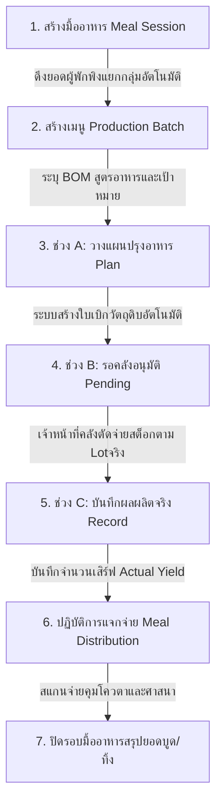

# สรุปการเปลี่ยนแปลง: ระบบคลังสินค้า พารามิเตอร์ การเบิกของ และการวิเคราะห์อาหาร (SmartShelter)

เอกสารฉบับนี้จัดทำขึ้นเพื่อสรุปการเปลี่ยนแปลง ข้อกำหนดทางเทคนิค ลอจิกทางธุรกิจ (Business Rules) และกระบวนการทำงาน (Flow) ในระบบ **SmartShelter** เฉพาะส่วนที่เกี่ยวข้องกับ **คลังสินค้า (Warehouse/Inventory), พารามิเตอร์มาตรฐาน (Parameters/SOP Ratios), การเบิกของ (Requisitions/Transfers) และการวิเคราะห์อาหาร (Food/Meal Analysis)** โดยเป็นการเปรียบเทียบสเปคใหม่ล่าสุด (`new_spec/`) กับข้อกำหนดสเปคเดิม/สเปคก่อนหน้า (`docs/`)

---

## 🍽️ ส่วนที่ 1: สรุป Flow ใหม่ (New Flow Summary)

ระบบการวางแผนวิเคราะห์อาหารและการเบิกของเพื่อปรุงอาหารได้รับการออกแบบใหม่ทั้งหมดให้เป็นกระบวนการเชื่อมโยง (End-to-End Workflow) จากฐานข้อมูลผู้พักพิงจริงไปสู่การตัดสต็อกคลังหลักและการแจกจ่ายหน้างาน เพื่อลดปัญหาข้อมูลไม่ตรงกัน

### Flow การผลิตและแจกจ่ายอาหาร: มื้อ (Meal Session) ➔ เมนู (Production Batch)


1. **สร้างมื้ออาหาร (Meal Session):** เจ้าหน้าที่ครัวสร้างมื้อขึ้นมาก่อน (เช่น มื้อเย็นประจำวันที่ 22/7/2569) ระบบจะใช้ฟังก์ชันดึงยอดประชากรผู้พักพิงจริงที่เช็คอินอยู่ในขณะนั้นแยกตามกลุ่มคุณสมบัติผู้รับ (Eligibility Tags) ทันที (เช่น ยอดรวม 8 คน แยกเป็น ปกติ 4, ฮาลาล 1, เปราะบาง 3, ทารก 0)
2. **สร้างเมนู (Production Batch):** เพิ่มเมนูอาหารภายใต้มื้อนั้น โดยบังคับระบุ **มื้อที่สังกัด** และ **กลุ่มเป้าหมาย** (เช่น ข้าวไข่เจียวเสิร์ฟกลุ่มปกติ, แกงจืดเต้าหู้เสิร์ฟกลุ่มทารก/เปราะบาง)
3. **ช่วง A (วางแผน):** เลือกสูตรอาหารมาตรฐาน (BOM) ระบบจะคำนวณวัตถุดิบและเชื้อเพลิงแก๊สที่จำเป็นอัตโนมัติตามยอดเป้าหมายคน เมื่อตรวจสอบสต็อกแล้วผู้ใช้จะกด **"สร้างใบเบิกวัตถุดิบ"** เพื่อส่งคำร้องตัดสต็อกไปยังคลังสินค้าหลัก
4. **ช่วง B (รออนุมัติ):** ระบบจะสร้างเอกสารคำร้องเบิกวัตถุดิบครัว (`TKT-KITCHEN`) โดยอัตโนมัติ ในหน้านี้เจ้าหน้าที่ครัวจะทำได้เพียงเข้าดูรายละเอียดใบเบิกและรอทางคลังอนุมัติตัดจ่ายสต็อกจริง (ตามหลัก FEFO)
5. **ช่วง C (บันทึกผลผลิตจริง):** เมื่อวัตถุดิบส่งมอบเรียบร้อย เจ้าหน้าที่ครัวบันทึกผลผลิตจริง (Actual Yield) เป็นจำนวนเสิร์ฟที่พร้อมแจกจ่าย (เช่น ปรุงได้เสร็จ 42 ที่) โดยยอดนี้จะถูกล็อคเป็นเพดานสูงสุดในการแจกจ่าย
6. **ปฏิบัติการแจกจ่ายอาหาร (Meal Distribution):** หน้าปฏิบัติการแจกจ่ายจะดึงรายการเมนูที่ปรุงสำเร็จแล้วขึ้นมา เจ้าหน้าที่ค้นหารายชื่อผู้พักพิงจากทะเบียนจริงในระบบเพื่อแจกอาหาร โดยระบบจะตรวจสอบ Eligibility และคุมโควตาเพื่อป้องกันการรับซ้ำในมื้อนั้น
7. **ปิดรอบมื้ออาหาร:** สรุปยอดผลิตจริงเทียบกับยอดแจกจ่ายจริง ยอดที่เหลือหรือชำรุด/บูดทิ้งจะถูกบันทึกเพื่อตรวจสอบความโปร่งใส

---

## 📦 ส่วนที่ 2: รายละเอียดการเปลี่ยนแปลงรายโมดูล

### 1. ระบบคลังสินค้า (Warehouse & Stock Management)

#### การเปลี่ยนแปลงข้อมูลรายการสิ่งของหลัก (Item Master / Catalog)
*เปรียบเทียบสเปคใหม่ใน new_spec/SmartShelter_สเปคระบบคลังสินค้า.md (หัวข้อ 2.1) เทียบกับสเปคเดิมใน docs/*
* **[เอาออก] การตั้งค่าหน่วยสำหรับสั่งซื้อ (Default Purchasing UOM):** ตัดออกในสเปคใหม่เพื่อให้สอดคล้องกับหลักการ **A6 — ไม่มีระบบจัดซื้อ (Purchase Order) ในระบบ** คงเหลือเฉพาะหน่วยสำหรับจัดเก็บ (Inventory) และเบิกจ่าย (Issue/Sales) *(Task #31)*
* **[เอาออก] ฟิลด์ Distribution Mode (GENERAL/CONTROLLED):** ตัดออกเนื่องจากซ้ำซ้อนกับ "ประเภทการแจกจ่าย (Distribution Type)" ในข้อมูลการแจกจ่ายสินค้า *(Task #30)*
* **[เอาออก] Checkbox "Set as Default Option":** ตัดตัวเลือกที่เป็น Template ค้างออกจากแบบฟอร์มบันทึกสินค้าหลัก, BOM และแผนผังกลุ่มสินค้า *(Task #32)*
* **[เปลี่ยน] ฟิลด์ประเภทสินค้า (Category):** กำหนดฟิลด์ `category` เป็น `enum` ประกอบด้วย `CONSUMABLE`, `DURABLE`, `EQUIPMENT` ในสกีมา `item_master` (เดิมใน CR-031 เป็น string อิสระ เช่น "food", "medicine", "hygiene")
* **[เพิ่ม] คุณสมบัติผู้รับ (Eligibility Tags):** ขยายการตั้งค่าคุณสมบัติผู้รับสินค้าจากเดิมที่มีเพียง checkbox ฮาลาลและปลอดภัยสำหรับทารก ให้เป็น Tag ครอบคลุม 3 มิติ (เพศที่ใช้ได้, ช่วงวัยที่เหมาะสม, ข้อจำกัดด้านศาสนา/อาหารเฉพาะกลุ่ม) เพื่อจับคู่อัตโนมัติกับทะเบียนผู้พักพิงตอนเบิกแจกจ่าย *(Task #15)*
* **[เพิ่ม] คุณสมบัติการจัดเก็บและสารก่อภูมิแพ้:** เพิ่มฟิลด์ข้อมูลคุณลักษณะใหม่ 3 ฟิลด์ใน `item_master` ได้แก่:
  1. **อายุการเก็บรักษา (วัน) (Shelf Life - days):** กำหนดอายุของสินค้าในการจัดเก็บ
  2. **ประเภทการจัดเก็บ (Storage Type):** กำหนดเป็น `enum` มีค่า `DRY` (แห้ง), `CHILLED` (แช่เย็น), `FROZEN` (แช่แข็ง), และ `CONTROLLED_MED` (ยาควบคุมอุณหภูมิ)
  3. **สารก่อภูมิแพ้ (Allergens):** เพิ่มฟิลด์สำหรับระบุประเภทสารก่อภูมิแพ้ของอาหาร/วัตถุดิบ
* **[เพิ่ม] ระบบคุมการแจกซ้ำสำหรับ NFI (Non-Food Items):** เพิ่มข้อมูล `distribution_type` (One-time/Recurring) และค่าเผื่อสำรองสำหรับของแจกครั้งเดียว `nfi_buffer_percent` ในข้อมูล Master เพื่อป้องกันสแกนแจกมุ้ง/เต็นท์ซ้ำซ้อน และใช้บวกเพิ่ม 5-10% ตอนคำนวณเป้าหมายเพื่อเป็นของสำรองยามเสียหาย *(Task #21)*

#### การบันทึกสต็อกคงคลังและการจัดเก็บ (Stock Ledger & Control Panel)
*เปรียบเทียบสเปคใหม่ใน new_spec/SmartShelter_สเปคระบบคลังสินค้า.md (หัวข้อ 2.2 / 2.5) เทียบกับสเปคเดิมใน docs/*
* **[เปลี่ยน] มาตรฐานเลขล็อต (Lot Number Format):** กำหนดให้เลขล็อตผูกกับศูนย์จริง (ห้ามข้ามศูนย์) และฟิลด์ `เลขล็อต` บนหน้าจอปรับยอดคลังเป็น **Read-only Auto-generate เท่านั้น** โดยรันในรูปแบบ `L-SH[index-shelter]-DDMMYYYY-XXXX` ห้ามเขียนอิสระเพื่อป้องกันรหัสล็อตชนกัน *(Task #57)*
* **[เปลี่ยน] การระบุอายุของแก๊สหุงต้มและของไม่เสื่อมสภาพ:** สำหรับล็อตสิ่งของที่ไม่มีวันหมดอายุจริง เช่น ถังแก๊ส ให้ปรับการแสดงสถานะควบคุมอายุ (Aging Control) เป็นสีเทาเขียนว่า **"ไม่มีวันหมดอายุ / N/A"** แทนการแสดงสีเขียว "ปกติ" เพื่อไม่ให้เจ้าหน้าที่สับสน *(Task #57)*

---

### 2. พารามิเตอร์มาตรฐาน (Standard Parameters & SOP Ratios)

#### พารามิเตอร์มาตรฐานอ้างอิง (Standard Parameters)
*เปรียบเทียบสเปคใหม่ใน new_spec/SmartShelter_สเปคระบบคลังสินค้า.md (หัวข้อ 2.4) เทียบกับสเปคเดิมใน docs/*
* **[เพิ่ม] การกำหนดสเปคโครงสร้าง Standard Parameters (เนื่องจากเดิมใช้ลอจิกในการคำนวณหลังบ้านแต่ไม่ได้เขียนโครงสร้างสเปคให้ชัดเจน):**
  1. **Requirement Group (กลุ่มคำนวณความต้องการ และ Item Group Maps):** กำหนดกลุ่มความต้องการพื้นฐานของผู้ลี้ภัย (เช่น พลังงานอาหาร `FOOD_ENERGY`, โปรตีน `FOOD_PROTEIN`, น้ำดื่ม) พร้อมตาราง **Item Group Maps** สำหรับจับคู่และแปลงหน่วยสินค้ารายตัวเข้ากลุ่ม โดยสเปคใหม่กำหนดสกีมาข้อมูล (`requirement_group` document) ดังนี้:
     * **โครงสร้างข้อมูลสกีมา (Schema Shape):**
       ```json
       {
         "_id": "requirement_group:{group_code}", // e.g. "requirement_group:STAPLE"
         "type": "requirement_group",
         "group_code": "string", // รหัสกลุ่มความต้องการ (เช่น "STAPLE", "FOOD_ENERGY")
         "name_th": "string", // ชื่อกลุ่มภาษาไทย (เช่น "กลุ่มแป้งและพลังงานหลัก (Staple Foods)")
         "standard_uom": "kcal | gram | litre | unit", // หน่วยคำนวณมาตรฐาน (Standard UOM)
         "is_substitutable": "boolean", // อนุญาตให้ใช้สินค้าอื่นในกลุ่มทดแทนกันได้ (Is Substitutable)
         "item_maps": [
           {
             "item_id": "string", // ID สินค้าอ้างอิงจาก item_master (เช่น ข้าวสาร หอมมะลิ)
             "conversion_factor": "number", // ตัวคูณแปลงหน่วยจริง (Base UOM) ไปเป็นหน่วยมาตรฐานกลุ่ม (เช่น 3500)
             "share_percent": "number" // สัดส่วนเมนู % (Share) ในกลุ่ม (สัดส่วนรวมกันในกลุ่มต้องได้ 100%)
           }
         ]
       }
       ```
     * **ค่าหน่วยคำนวณมาตรฐาน (Standard UOM Enum):** แคลอรี (`kcal`), กรัม (`gram`), ลิตร (`litre`), ชิ้น/ชุด (`unit`)
  2. **Food Sphere Standard (เกณฑ์อาหาร):** เพิ่มเกณฑ์ปริมาณความต้องการขั้นต่ำต่อวัน แยกตามกลุ่มเป้าหมายและหมวดความต้องการ โดยกำหนดสกีมาข้อมูล (`food_sphere_standard` document) และสิทธิ์ตัวแปรดังนี้:
     * **โครงสร้างข้อมูลสกีมา (Schema Shape):**
       ```json
       {
         "_id": "food_sphere_standard:{ulid}",
         "type": "food_sphere_standard",
         "target_segment": "ALL | INFANT_0_6M | INFANT_6_23M | CHILD_2_5Y | PREGNANT | LACTATING | ELDERLY | CHRONIC",
         "requirement_group": "WATER_TOTAL | WATER_DRINK | WATER_HYGIENE | WATER_COOKING | FOOD_ENERGY | FOOD_PROTEIN | FOOD_FAT | SOAP_BATH | SOAP_LAUNDRY | SHELTER_SPACE | LATRINE | WATER_POINT",
         "daily_demand": "qty_str", // ปริมาณที่ต้องการต่อคนต่อวัน
         "uom": "string", // หน่วยนับ (เช่น kcal, litre, gram) — Auto-fill ตามกลุ่มความต้องการ
         "effective_date": "string" // วันที่เริ่มมีผลบังคับใช้ (ISO Date: YYYY-MM-DD)
       }
       ```
     * **ค่ากลุ่มเป้าหมาย (Target Segment Enum):** ทุกคน (`ALL`), ทารก 0-6 เดือน (`INFANT_0_6M`), ทารก 6-23 เดือน (`INFANT_6_23M`), เด็กเล็ก 2-5 ปี (`CHILD_2_5Y`), หญิงตั้งครรภ์ (`PREGNANT`), หญิงให้นมบุตร (`LACTATING`), ผู้สูงอายุ (`ELDERLY`), ผู้ป่วยโรคเรื้อรัง (`CHRONIC`)
     * **ค่าหมวดความต้องการ (Requirement Group Enum):** น้ำรวมทั้งหมด (`WATER_TOTAL`), น้ำดื่มสะอาด (`WATER_DRINK`), น้ำเพื่อสุขอนามัย (`WATER_HYGIENE`), น้ำสำหรับปรุงอาหาร (`WATER_COOKING`), พลังงานอาหาร (`FOOD_ENERGY`), โปรตีน (`FOOD_PROTEIN`), ไขมัน (`FOOD_FAT`), สบู่ถูตัว (`SOAP_BATH`), สบู่เอนกประสงค์/ซักล้าง (`SOAP_LAUNDRY`), พื้นที่พักพิง (`SHELTER_SPACE`), ห้องสุขา (`LATRINE`), จุดบริการน้ำ (`WATER_POINT`)
     * **ลอจิกหน้าจอ:** แสดงปุ่ม "คืนค่าเริ่มต้น" เพื่อช่วยรีเซ็ตค่ากลับไปยังค่า SPHERE_BASELINE ส่วนกลางได้รวดเร็ว
  3. **Replenishment Policy (นโยบายการเติมสต็อก):** กำหนดตั้งค่าต่อคู่ **(ศูนย์ทั้งหมด/เจาะจงศูนย์ × Requirement Group)** ประกอบด้วยตัวแปรในการขับเคลื่อน DoC ดังนี้:
     * `Lead Time` + `Review Period` + `Safety Days` (วัน) รวมกันเป็น **"ค่ารวมเกณฑ์ปกติ" (จุดสั่งเติมมาตรฐาน)**
     * `min_doc_days` (จุดวิกฤต ซึ่งจำเป็นต้องระบุค่าน้อยกว่าค่ารวมเกณฑ์ปกติ)
     * `max_doc_days` (จุดสินค้าล้นคลัง / Overstock)
     * *หมายเหตุสถานะการทดสอบ:* ตัวฟอร์มทำงานได้ปกติแต่ระบบยังไม่มีนโยบายตั้งค่าไว้เลย (0 รายการ) แนะนำให้สร้างนโยบายอย่างน้อย 1 กลุ่ม (เช่น `FOOD_PROTEIN`) เพื่อทดสอบการคำนวณ DoC และ Stability Control ปลายทางจริง
* **[เปลี่ยน] การคำนวณกรณีไม่มีนโยบายสต็อก (Replenishment Policy):** หากรายการสินค้าใดยังไม่ได้ตั้งค่าเกณฑ์นโยบายเติมสต็อกไว้ ระบบต้องประมวลผลแสดงข้อความ **"ยังไม่ได้ตั้งค่านโยบาย"** แทนการแสดงเป้าหมายวันและจำนวนเสเบียงเป้าหมายที่ขาดเป็น Infinity (+∞) ฟอง/วัน และไม่ให้ลอจิกอัตโนมัติไปปิดสัญญาณรับบริจาคที่กระดานสาธารณะโดยพลการ *(Task #22)*

---

### 3. การเบิกของและการโอนย้าย (Requisitions & Transfers)

#### การเบิกโอนย้ายของข้ามศูนย์ (Inter-shelter Ticket Transfer)
*เปรียบเทียบสเปคใหม่ใน new_spec/SmartShelter_สเปคระบบคลังสินค้า.md (หัวข้อ 2.3) เทียบกับสเปคเดิมใน docs/*
* **[เปลี่ยน] ข้อบังคับการอนุมัติโอนออก:** ปุ่ม "อนุมัติจ่ายและนำสิ่งของออกส่ง" จะถูกล็อกจนกว่าจะเลือก Lot สต็อกจริงและกรอกจำนวนตรงตามคำขอครบถ้วนทุกบรรทัด และต้องกรอกข้อมูลผู้ขับขี่พร้อมทะเบียนรถขนส่งก่อนส่งมอบ *(บันทึกการแก้ไข V8)*
* **[เปลี่ยน] การเบิกจ่ายออกข้ามสต๊อคล็อต (Split Allocation):** เพิ่มการรองรับการแบ่งยอดจัดสรรจากหลายล็อต/หลายโซนเก็บ (Split Allocation) ในหน้าเอกสารใบเบิกโอนออก เพื่อช่วยกรณีที่ล็อตเดียวยอดไม่พอกับจำนวนที่ต้องการเบิก *(บันทึกการแก้ไข V8)*
* **[เปลี่ยน] การจัดทำล็อตปลายทางและการสืบย้อน (Traceability):** เมื่อปลายทางตรวจรับของโอนย้ายเสร็จสิ้น ระบบจะบังคับให้จัดทำ Lot ID ใหม่ด้วยรหัสของศูนย์ปลายทางเองเสมอ (ห้ามใช้รหัสล็อตจากคลังต้นทาง) โดยให้เก็บเลขล็อตฝั่งต้นทางไว้ในฟิลด์ "อ้างอิง Lot ต้นทาง" ในลักษณะ Read-only เพื่อรักษาสิทธิ์การสืบย้อนประวัติสินค้า *(บันทึกการแก้ไข V8)*

---

### 4. การวิเคราะห์อาหารและการปรุงอาหาร (Food Analysis & Kitchen Operations)

#### การจัดการแผนการผลิตอาหาร (Meal Plan & Production Setup)
*เปรียบเทียบสเปคใหม่ใน new_spec/SmartShelter_สเปคระบบคลังสินค้า.md (หัวข้อ 4) เทียบกับสเปคเดิมใน docs/*
* **[เปลี่ยน] ระบบจับคู่ใบเบิกวัตถุดิบโรงครัว:** ในหน้าสร้างเมนูอาหารใหม่ (Production Setup Board) ได้เปลี่ยนเป็นแท็บ 3 ช่วงเวลาตามหน้างานจริง (A-วางแผน, B-รออนุมัติ, C-บันทึกผลจริง) โดยในขั้นตอนช่วง A เมื่อวางแผนแล้วระบบจะสร้างเอกสารใบเบิกวัตถุดิบและผูกให้ทันทีโดยอัตโนมัติ โดยไม่อนุญาตให้เจ้าหน้าที่เลือกผูกเอกสารใบเบิกเก่าเองอีกต่อไป *(Task #42)*
* **[เปลี่ยน] การบันทึกและสิทธิ์การเข้าถึงข้อมูลตามสถานะงานครัว:** หากแผนเมนูอยู่ในสถานะเตรียมเบิก เจ้าหน้าที่จะมีสิทธิ์แก้ไขข้อมูลสัดส่วนวัตถุดิบได้เต็มที่ แต่หากมีใบเบิกที่ได้รับอนุมัติสต็อกไปแล้ว ข้อมูลการวางแผนและวัตถุดิบของช่วง A และ B จะถูกปรับเป็น Read-only ทันที เพื่อป้องกันข้อมูลสต็อกขัดแย้ง *(Task #50)*

#### การบันทึกและรายงานผลผลิต (Meal Service Record & Daily Calc)
* **[เพิ่ม] การจำลองพารามิเตอร์พลังงานถังแก๊ส (LPG Cylinder Parameters):** บันทึกอัตราระดับการสิ้นเปลืองแก๊ส (Burn Rate) และตัวคูณการทำงานของเตาครัวแยกรายถังแก๊ส โดยนำยอดคงคลังจริงของถังแก๊สมาจาก FEFO ใน Ledger ของคลังหลักโดยตรง *(Task #37)*
* **[เปลี่ยน] หน้าสแกนแจกจ่ายอาหาร (Meal Distribution):** เปลี่ยนช่องปุ่มการสแกนแจกจ่ายอาหารหน้างานเดิมที่เป็นรูปกล้องตกแต่ง ไปเป็น **"ปุ่มกดเปิด Modal"** และค้นหารายชื่อผู้รับจากทะเบียนผู้พักพิงจริงด้วยระบบ Search-select แทน เพื่อป้องกันปัญหาการประมวลผลรายชื่อขัดข้อง และจำกัดการแจกจ่ายอาหารไม่ให้เกินเพดาน Actual Yield ของอาหารเมนูนั้นๆ *(Task #58)*

---

## 🔍 ตารางเปรียบเทียบการเปลี่ยนแปลงตาม Task baseline

| Task ID เดิม | ชื่อ Task เดิม | สถานะการเปลี่ยนแปลง | รายละเอียดและคีย์หลักที่ได้รับผลกระทบ |
| :--- | :--- | :--- | :--- |
| **T-10** | Supply Item catalog | **แก้ไขรายละเอียดฟิลด์** | • ตัดหน่วยจัดซื้อ (Purchasing UOM) และ Distribution Mode ออก<br>• ขยายระบบคุณสมบัติผู้รับ (Eligibility Tags) คุมเรื่องเพศ ช่วงวัย ศาสนา/อาหาร<br>• เพิ่มฟิลด์: อายุการเก็บรักษา (วัน), ประเภทการจัดเก็บ (DRY / CHILLED / FROZEN / CONTROLLED_MED) และสารก่อภูมิแพ้ (Allergens) |
| **T-11** | Stock receive (inbound) | **ปรับพฤติกรรมความปลอดภัย** | • ล็อกช่องรหัสล็อตคลังเป็น Read-only Auto-generate ตามฟอร์แมต `L-SH[index-shelter]-DDMMYYYY-XXXX` ป้องกันชื่อล็อตชนกัน |
| **T-12** | Stock distribute (outbound) | **เพิ่มความปลอดภัยและเชื่อมโยง** | • ห้ามเบิกจ่ายซ้ำในเมนูเดิม เพื่อป้องกันยอดสต็อกสูญหายโดยไม่มีประวัติการอนุมัติคลังจริง |
| **T-13** | Inter-shelter transfer | **เพิ่มกฎควบคุมการขนส่ง** | • บังคับใส่ข้อมูลผู้ขับขี่และทะเบียนรถข้ามศูนย์ก่อนยืนยันจ่ายออก<br>• ปลายทางสร้าง Lot ท้องถิ่นใหม่พร้อมเก็บ Read-only Reference Lot ต้นทาง |
| **T-14** | Stock dashboard + threshold | **ปรับเงื่อนไขและเพิ่มพารามิเตอร์** | • ปรับหน้าความมั่นคงเสบียงให้แสดง "ยังไม่ได้ตั้งค่านโยบาย" แทน Infinity (Task #22)<br>• เพิ่มสเปคโครงสร้าง Standard Parameters (Requirement Group, Item Group Maps, Food Sphere Standard, Replenishment Policy) เพื่อใช้อ้างอิงการประมวลผลสต็อกและเกณฑ์อาหาร (Task #17 / #22) |
| **T-25** | Meal plan calculation | **จัดประเภทประชากร** | • ดึงและกรองจำนวน headcount แยกตามกลุ่มอายุและศาสนาอ้างอิงจากทะเบียนผู้พักพิงจริงในระบบ (Task #39) |
| **T-26** | Kitchen requisition | **ปรับปรุงสิทธิ์การแก้ไข** | • ปรับปรุงข้อกำหนดสิทธิ์การแก้ไขวัตถุดิบตามสถานะใบเบิกของครัว (Task #50) |
| **T-56 (ใหม่)**| LPG cylinder management | **เพิ่มระบบการจัดการแก๊ส** | • เพิ่ม Task และโมเดลข้อมูลเพื่อคำนวณสต็อกถังแก๊สและปริมาณ Burn Rate แก๊สหุงต้มสำหรับการผลิตอาหารแต่ละเมนู (Task #37) |
