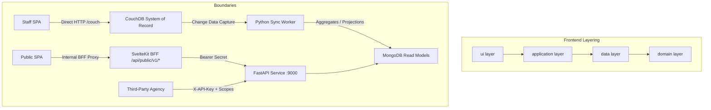

# Architecture Spine — Smart Shelter (tent)

## Design Paradigm

The Smart Shelter platform combines a **Two-Plane Data Architecture** with a **Feature-Sliced Clean Architecture (DDD)** and a **Remote-First Network Model**:

```
[ Staff Browser (SvelteKit SPA) ]
       | (Cookie AuthSession via /couch proxy)
       v
[ CouchDB SoR (Central / Edge Fallback) ]
       |
       | (Changes Feed via Sync Worker)
       v
[ MongoDB Read Models (public_*) ]
       |
       v
[ FastAPI Public Service (:9000) ]
       |
       +------------------------------------+
       | (Bearer EXTERNAL_API_SECRET)       | (X-API-Key + Scopes)
       v                                    v
[ SvelteKit BFF (/api/public/v1/*) ]   [ External 3rd-Party Agencies ]
       |
       v
[ Public SPA (Unauthenticated) ]
```

1. **Staff SoR Plane (Plane A & B)**: Direct remote-first interaction between staff client and multi-database CouchDB instances using native session cookies (`AuthSession`), complemented by SvelteKit BFF endpoints (`/api/v1/*`) for central-only administrative provisioning and file exports.
2. **Public Projection Plane (Plane C)**: Read-model projections computed asynchronously by a Python Sync Worker listening to CouchDB change feeds, stored in MongoDB collections (`public_*`), and exposed via FastAPI (`:9000`).
3. **Frontend Layering**: Strict internal layering inside each domain feature: `ui → application → data → domain`.

## Invariants & Rules



### AD-1 — Two-Plane Data Separation (Staff SoR vs Public Read Models) [ADOPTED]

- **Binds:** `plane-a-staff-sor`, `plane-c-public-plane`, `data-layer`, `security-boundary`
- **Prevents:** Public traffic loading the operational SoR, and accidental exposure of sensitive PII, medical records, or shelter operational internals to unauthenticated actors.
- **Rule:** Operational staff data is written directly to CouchDB SoR. All unauthenticated public queries and aggregated metrics must be served exclusively from MongoDB read models populated asynchronously by the Python Sync Worker via the CouchDB changes feed. Direct connections between public clients and CouchDB are prohibited.

### AD-2 — Remote-First Active Endpoint with LAN Edge Continuity [ADOPTED]

- **Binds:** `edge-continuity`, `frontend-data-layer`, `$lib/db/`
- **Prevents:** Client-side database sync merge conflicts, stale cache divergence, and split-brain dual writes.
- **Rule:** The frontend application is strictly remote-first. There is no PouchDB and no client-side offline write queue. Mutations are sent directly over HTTP to the single active endpoint:
  1. **Central CouchDB** (Default / normal path)
  2. **LAN Edge CouchDB** (Fallback when WAN/Central is unreachable)
  3. **Disconnected state** (Status-only banner; automatic retry up to 3 attempts, followed by a manual force-retry action).

### AD-3 — Feature-Sliced Layered Architecture [ADOPTED]

- **Binds:** `frontend-feature-sliced`, `frontend/src/lib/features/**`
- **Prevents:** Cross-cutting circular dependencies, domain logic leakage into presentation components, and fragile tightly-coupled feature code.
- **Rule:** Every feature module under `frontend/src/lib/features/<name>/` must strictly adhere to the four-layer structure (`ui → application → data → domain`). External features and route pages must interact with a feature exclusively through its root `index.ts` barrel file, strictly enforced by ESLint `no-restricted-imports`.

### AD-4 — Multi-Database Tenant Isolation with Centralized Operations [ADOPTED]

- **Binds:** `couchdb-topology`, `security-matrix`, `referral-workflow`
- **Prevents:** Cross-shelter data contamination, unauthorized access across disaster operational zones, and distributed inconsistency from cross-database doc mirroring.
- **Rule:** Operational shelter records reside in tenant-isolated databases `shelter_<shelter_code>`. Shared master metadata resides in `registry` and `catalog`. Cross-tenant workflows (such as evacuee referrals and central reporting) reside strictly in the `central_ops` database as the single source of truth.

### AD-5 — Scoped API Key Authentication for External Integrations [ADOPTED]

- **Binds:** `fastapi-external-endpoints`, `third-party-integrations`
- **Prevents:** Unauthorized access by third parties, role escalation, and unmetered or unverified data harvesting by external disaster response agencies.
- **Rule:** Third-party applications and partner agencies must connect to FastAPI exclusively via `/external/v1/*` endpoints using a provisioned `X-API-Key` header with validated scopes (e.g. `read:occupancy`, `read:shelters`).

### AD-6 — Secure Public BFF Gateway Pattern [ADOPTED]

- **Binds:** `public-portal-bff`, `security-boundary`
- **Prevents:** Leaking internal service secrets or FastAPI infrastructure URLs to client-side browser bundles, and exposing unauthenticated endpoints directly to the public internet.
- **Rule:** Public SPA features must invoke FastAPI endpoints via the SvelteKit BFF routes (`/api/public/v1/*`), which authenticate internally to FastAPI using `Bearer EXTERNAL_API_SECRET`. Direct browser calls to FastAPI `:9000` are blocked.

### AD-7 — Deterministic Typed ID Generation and Schema Validation [ADOPTED]

- **Binds:** `data-contract`, `all-entities`
- **Prevents:** Document ID collisions across distributed nodes, silent schema corruption, and incompatible mutations.
- **Rule:** Every CouchDB document `_id` must follow the typed format `<doc_type>:<ulid>`. Data structures must be validated at runtime on the client using Zod schemas and enforced on CouchDB using `validate_doc_update` design functions. Every persistent document must carry a monotonically incrementing `schema_v` integer.

## Consistency Conventions

| Concern | Convention |
| --- | --- |
| Document IDs | Typed ULID formatted as `<doc_type>:<ulid>` (e.g. `evacuee:01HY...`, `movement:01HY...`) |
| Timestamps | ISO-8601 UTC strings (`YYYY-MM-DDTHH:mm:ss.sssZ`) |
| Quantities | String representation for exact decimal arithmetic (e.g. `"12.500"`) avoiding floating-point drift |
| State Mutations | Optimistic locking via CouchDB `_rev`; append-only event logs for ledger, movements, and audit records |
| Error Responses | Standard envelope `{ "error": { "code": "ERROR_CODE", "message": "...", "fields": {} } }` |
| Client Reactivity | Svelte 5 Runes (`$state`, `$derived`, `$props`) + TanStack Query hooks; shared state via state classes |

## Stack

| Name | Version |
| --- | --- |
| Svelte | 5.55.7 |
| SvelteKit | 2.60.1 |
| Vite | 8.0.13 |
| TypeScript | 6.0.3 |
| Tailwind CSS | 4.3.0 |
| TanStack Query (Svelte) | 6.1.29 |
| Zod | 4.4.3 |
| Superforms | 2.30.2 |
| openapi-fetch | 0.17.0 |
| Node Adapter | 5.5.4 |
| Python | 3.12.0 |
| FastAPI | 0.141.0 |
| Pydantic | 2.11.9 |
| Beanie | 1.29.0 |
| PyMongo | 4.15.1 |
| HTTPX | 0.27.0 |
| CouchDB | 3.5.0 |
| MongoDB | 7.0.0 |
| pnpm | 11.9.0 |

## Structural Seed

```text
tent/
  backend/
    apiapp/
      modules/         # Domain modules (announcements, evacuee, public, external, api_keys)
      infrastructure/  # DB connectors & MongoDB models
      middlewares/     # Auth, scope, and error handling
  worker/
    src/worker/        # Change feed sync loops & MongoDB projection writers
  packages/
    tent-model/        # Shared Pydantic schemas across backend and worker
  frontend/
    src/
      lib/
        db/            # CouchDB HTTP access layer & event channel
        features/      # Feature-sliced DDD modules (people, operations, kitchen, etc.)
          <feature>/
            domain/    # Pure entities, Zod schemas, invariants
            data/      # Repository interface & remote HTTP adapters
            application/ # TanStack Query hooks
            ui/        # Feature Svelte 5 components
            index.ts   # Public barrel
        components/ui/ # shadcn-svelte primitives
      routes/
        (auth)/        # Login / authentication
        (protected)/   # Staff back-office views
        api/           # BFF endpoints (/api/v1/*, /api/public/v1/*)
  docs/
    data/              # Data schemas, contracts, sync specifications
    changes/           # Architecture Decision Records (CR-001..CR-064)
```

## Capability → Architecture Map

| Capability / Area | Lives in | Governed by |
| --- | --- | --- |
| Evacuee Intake & Registration | `frontend/src/lib/features/people` | AD-1, AD-2, AD-3, AD-7 |
| Shelter Operations & Zoning | `frontend/src/lib/features/operations` | AD-2, AD-4 |
| Kitchen & Meal Planning | `frontend/src/lib/features/kitchen` | AD-3, AD-7 |
| Cross-Shelter Referrals | `frontend/src/lib/features/referrals` | AD-4, AD-7 |
| Public Search & Campaigns | `frontend/src/lib/features/public-portal` | AD-1, AD-6 |
| Sync Worker Projections | `worker/src/worker/` | AD-1, AD-7 |
| Public & External APIs | `backend/apiapp/modules/` | AD-1, AD-5, AD-6 |

## Deferred

1. **Fully Automated Multi-Master Offline Mesh**: Edge-to-edge peer sync without Central CouchDB is deferred; disaster continuity relies on Central-first with local Edge LAN fallback (CR-064).
2. **Biometric Registration & Facial Verification**: Deferred to future hardware integration phases; registration currently uses National ID and QR-based ULID tokens.
3. **Automated Dynamic API Rate-Limiting for Third Parties**: Static API key verification is enforced; tiered dynamic bandwidth throttling is deferred.
