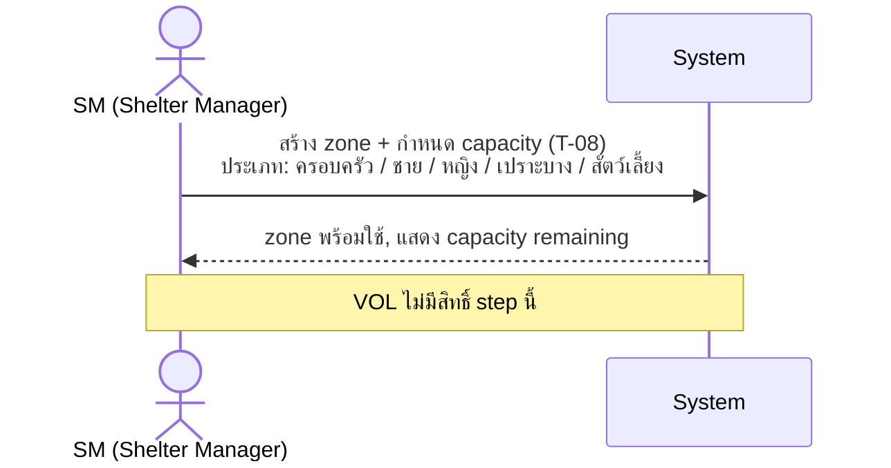
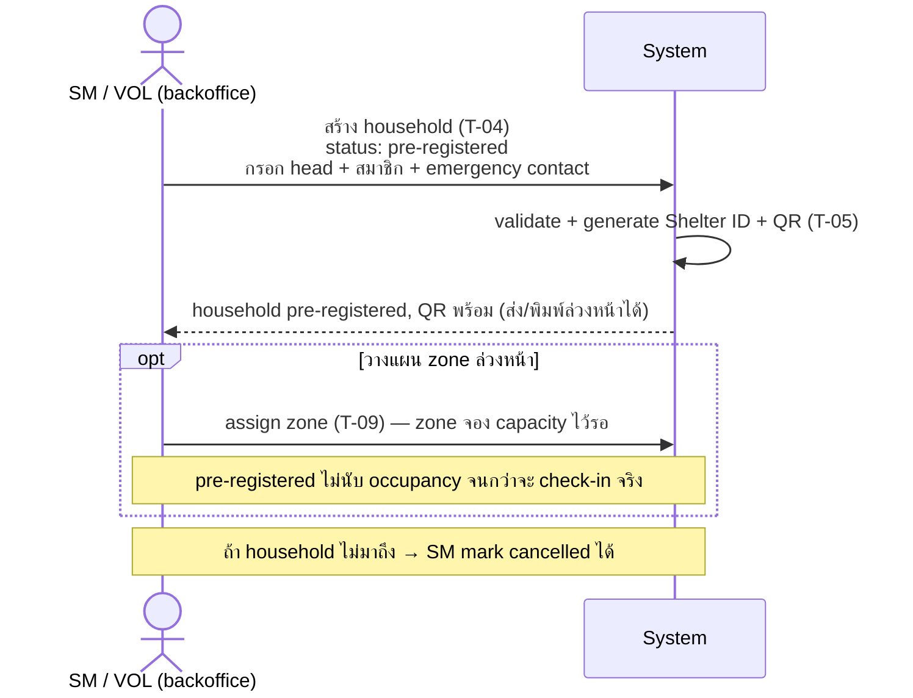
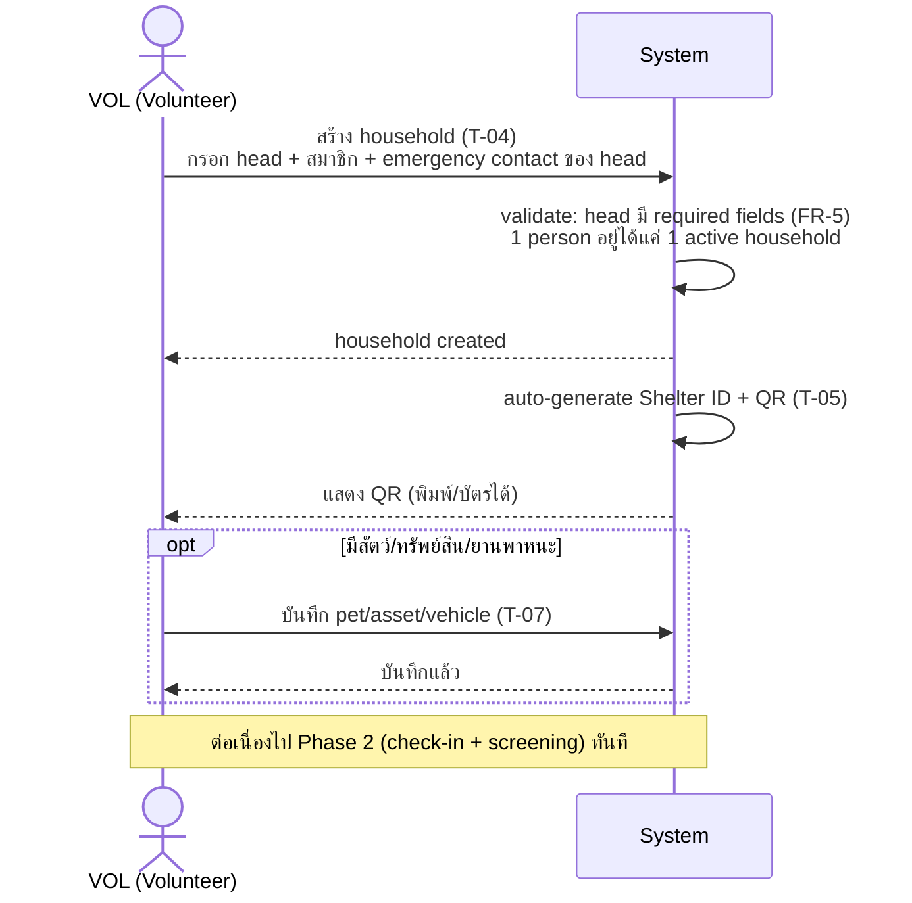
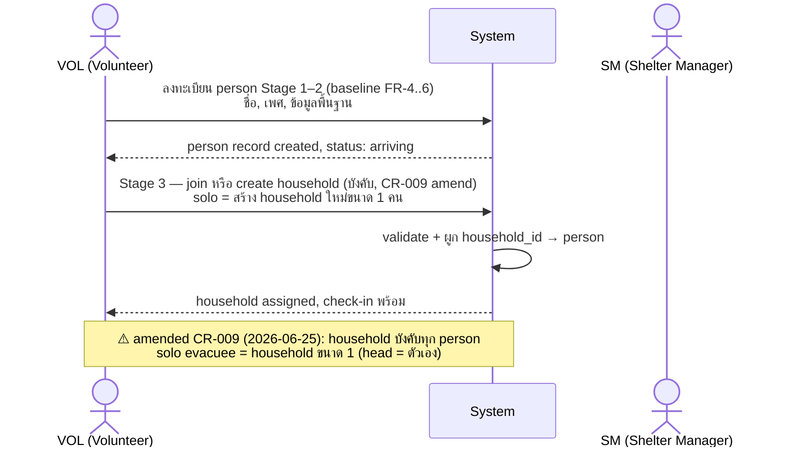
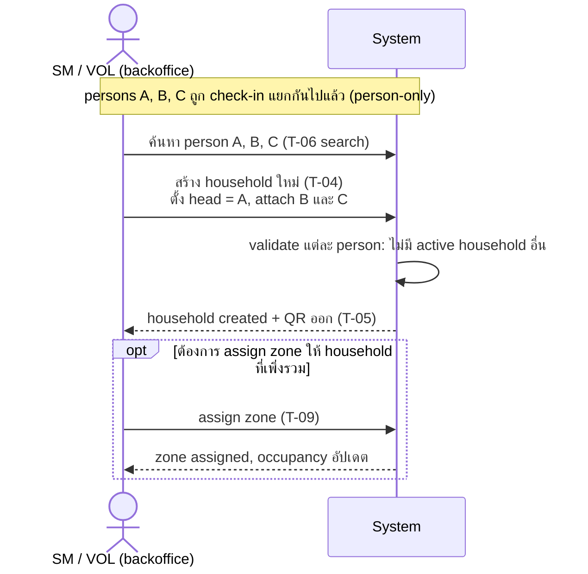
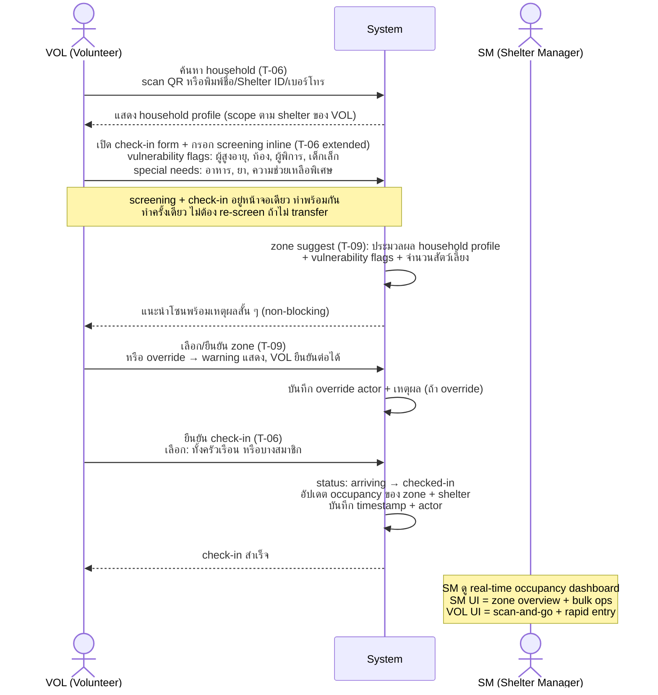
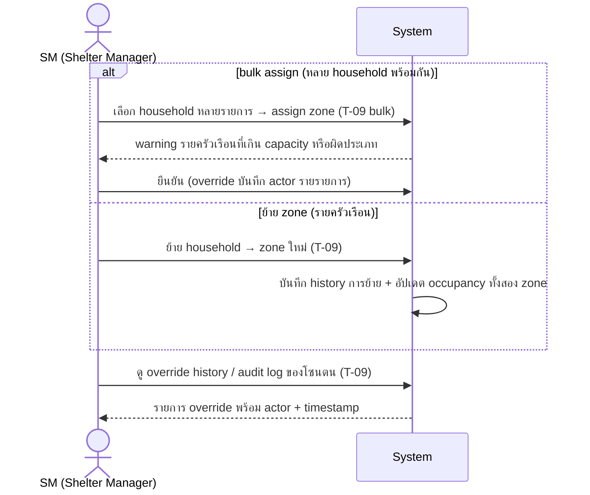
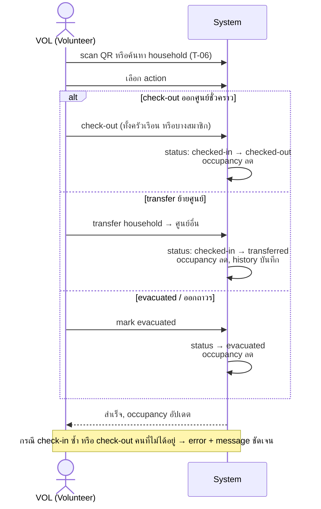

# CR-001 — 02-people.md: household gaps + permission cross-ref

## Why

Review `02-people.md` เทียบ `role-permission-matrix.md` พบ gap หลายจุดที่ยังไม่มีใน spec:

1. **Permission ไม่ปรากฏใน DoD** — implementer อ่าน task breakdown ไม่เห็น role rules; เสี่ยง implement ผิด
2. **VOL scope split T-08/T-09 ไม่ชัด** — FR-25 (zone definition) VOL=`—` แต่ FR-26 (allocation) VOL=`scope`; description ไม่แยก
3. **Household status lifecycle ขาด** — ไม่มี task/DoD ครอบ state transitions (`arriving → checked-in → transferred → evacuated → closed`) นอกจาก check-in/out ธรรมดา
4. **Screening flow ≠ check-in** — T-06 รวม check-in แต่ไม่ครอบ arrival screening (triage ก่อน check-in จริง) ซึ่งเป็น step แรกที่ VOL/SM ต้องทำ
5. **Backoffice vs frontline UI ไม่แยก** — ไม่มีเอกสารไหนระบุว่า SM ต้องการ backoffice flow (bulk ops, zone dashboard) แตกต่างจาก frontline flow ของ VOL (scan-and-go, rapid entry)
6. **Bulk zone operations ขาด** — T-09 assign ทีละ household; backoffice ต้องการ bulk assign/move ยังไม่อยู่ใน scope
7. **Household head emergency contact** — T-04 กำหนด head ได้แต่ไม่มี DoD ครอบ emergency contact / communication preference ของ head
8. **Audit/override log ดูไม่ได้จาก backoffice** — T-09 บันทึก override actor แต่ไม่มี task ครอบ "ดู audit log / override history"
9. **Pre-registration ผู้อพยพล่วงหน้า ขาดจาก spec ทั้งหมด** — ไม่มี flow สำหรับ SM/VOL สร้าง household ก่อน household มาถึงจริง (เช่น รับแจ้งจาก EOC ว่าจะมีกลุ่มคนมา) ทำให้ QR ออกล่วงหน้าได้, SM วางแผน zone ได้, VOL check-in ได้รวดเร็วขึ้นเมื่อมาถึง

## Change

### ส่วนที่แก้ได้เลย (documentation clarity — ไม่ต้องเปิด FR ใหม่)

| Item | Task | Before | After |
| --- | --- | --- | --- |
| Permission summary | T-04/T-05/T-06/T-07/T-09 DoD | ไม่มี | เพิ่มบรรทัด: `Roles: SA ✓ · SM scope · VOL scope — ดู role-permission-matrix §3` |
| Permission summary | T-08 DoD | ไม่มี | เพิ่มบรรทัด: `Roles: SA ✓ · SM scope · VOL — (zone definition = SM ขึ้นไปเท่านั้น)` |
| VOL scope split | T-08 description | ไม่ระบุ | เพิ่มประโยค: VOL ไม่มีสิทธิ์ create/edit zone — เฉพาะ SM/SA |
| VOL scope split | T-09 description | ไม่ระบุ | เพิ่มประโยค: VOL assign household เข้าโซนได้ แต่ไม่ create/edit zone |
| Household lifecycle | T-06 DoD | ครอบแค่ check-in/out | เพิ่ม: status state machine `arriving → checked-in → transferred → evacuated → closed` + transition rules |
| Head emergency contact | T-04 DoD | กำหนด head ได้ | เพิ่ม: head record ต้องมี emergency contact (phone) + communication preference |
| Override audit view | T-09 DoD | บันทึก override actor | เพิ่ม: SM สามารถดู override history ของโซนตนได้ |
| Pre-registration | T-04 DoD | สร้าง household ณ จุดรับหรือทีหลัง | เพิ่ม: SM/VOL สร้าง household สถานะ `pre-registered` ล่วงหน้าได้; QR ออกทันที; check-in (T-06) เปลี่ยน status → `checked-in` |
| Checkout destination | T-06 DoD + state machine | แยก state `transferred`/`evacuated`/`checked-out` | ยุบเป็น `checked-out` เดียว + `checkout_destination` field required: `returned_home` / `transferred_shelter` (+ ชื่อศูนย์) / `referred_facility` (+ ชื่อสถานที่) / `other` (+ หมายเหตุ) — ทุกการออกจาก shelter ใช้ action checkout เดียวกัน |

### ส่วนที่ต้องการ PM ตัดสินใจก่อน

| Item | ตัวเลือก A | ตัวเลือก B |
| --- | --- | --- |
| **Screening flow** | ✅ **Option A confirmed (2026-06-18):** extend T-06 DoD ให้ครอบ arrival screening inline — screening + check-in เกิดพร้อมกัน, ทำครั้งเดียว, zone suggest ไม่ blocking (volunteer ดูทีหลังได้) | ~~เปิด task ใหม่ T-06b + FR ใหม่แยก~~ |
| **Backoffice vs frontline UI** | ✅ **Option A confirmed (2026-06-18):** เพิ่ม note ใน T-04/T-06/T-09 ว่า SM UI ≠ VOL UI — ไม่เปิด task แยก | ~~เปิด task UI แยก~~ |
| **Bulk zone allocation** | ✅ **Option A confirmed (2026-06-18):** extend T-09 scope ให้ครอบ bulk assign/move — ไม่เปิด task ใหม่ | ~~เปิด task ใหม่ T-09b~~ |

## Flow Verification

> Sequence diagram ทั้งโมดูล People & Zoning — verify ก่อน approve CR

### Phase 0 — Setup (SM ทำครั้งเดียวต่อศูนย์)



### Phase 0.5 — Pre-registration ล่วงหน้า (SM หรือ VOL backoffice, ก่อน household มาถึง)

> Path นี้: รับแจ้งล่วงหน้าว่าจะมีกลุ่มคนมา → สร้าง household + ออก QR รอไว้



> เมื่อ household มาถึงจริง → VOL scan QR ที่ออกไว้แล้ว → Phase 2 (check-in + screening) ทันที
> status เปลี่ยน: `pre-registered → arriving → checked-in`

---

### Phase 1A — Household สร้าง ณ จุดรับ (VOL, คนมาถึงพร้อมกันทั้งครอบครัว)

> Path นี้: VOL สร้าง household + check-in ในครั้งเดียวกัน



### Phase 1B — Person-only check-in ก่อน (คนมาถึงคนเดียว หรือรีบเข้า)

> Path นี้: ไม่มี household ตอนมาถึง → check-in เป็นรายบุคคลก่อน → สร้าง household ทีหลัง



### Phase 1C — Backoffice สร้าง household หลังจาก persons check-in แยกกัน (VOL หรือ SM)

> Path นี้: หลายคนในครอบครัวเดียวกัน check-in แยก → backoffice/VOL รวมเป็น household ทีหลัง



### Phase 2 — Arrival Check-in + Screening (VOL ทำที่ประตูศูนย์)



### Phase 3 — Zone Management (backoffice, SM)



### Phase 4 — Check-out / Lifecycle transitions (VOL หรือ SM)



### Household status state machine

```
[สร้าง household]
        │
        ├─── สร้างล่วงหน้า ──→ pre-registered ──→ arriving
        │                                              │
        └─── สร้าง ณ จุดรับ ────────────────→ arriving
                                                       │
                                               check-in confirmed
                                                       │
                                                       ▼
                                                  checked-in ──→ transferred (ย้ายศูนย์)
                                                       │
                                               check-out / evacuate
                                                       │
                                                       ▼
                                             checked-out / evacuated
                                                       │
                                                    closed
```

**กฎ pre-registered:**
- QR ออกได้ทันทีที่สร้าง (ก่อนมาถึง)
- SM assign zone ล่วงหน้าได้ (T-09) — zone จอง capacity ไว้รอ
- ถ้า household ไม่มาถึงภายในเวลาที่กำหนด → SM ปิด / mark `cancelled` ได้
- `pre-registered` ไม่นับ occupancy จนกว่าจะ check-in จริง

---

## Impact

- `docs/task-breakdown/02-people.md` — DoD T-04..T-09 (documentation เท่านั้น)
- ถ้า PM เลือก option B ข้อใดข้อหนึ่ง → กระทบ effort estimate รวมของโมดูล + matrix §3
- ไม่ bump schema_v (ไม่เปลี่ยนรูปร่าง persisted doc)

## Migration

N/A — documentation-only change (จนกว่า PM จะ approve option B ที่เกี่ยวกับ task ใหม่)

## Decision log

- 2026-06-18 — proposed
- 2026-06-18 — screening flow resolved: Option A (inline, ทำครั้งเดียวตอน check-in, zone suggest non-blocking)
- 2026-06-18 — backoffice/frontline UI split resolved: Option A (note ใน task ไม่แยก task)
- 2026-06-18 — bulk zone allocation resolved: Option A (extend T-09 ไม่เปิด task ใหม่)
- 2026-06-18 — open questions ทั้งหมด resolved; รอ PM approve CR ก่อนแก้ DoD
- 2026-06-18 — pre-registration confirmed: extend T-04 ให้สร้าง household สถานะ `pre-registered` ล่วงหน้าได้; ไม่นับ occupancy จนกว่า check-in; QR ออกทันที; SM assign zone ล่วงหน้าได้
- 2026-06-18 — approved by project owner; แก้ DoD ใน 02-people.md เริ่มได้
- 2026-06-18 — done; 02-people.md อัปเดตครบทุก task
- 2026-06-18 — spec clarification (T-06): checkout = action เดียวสำหรับการออกทุกประเภท; ต้องระบุ destination (กลับบ้าน / ย้ายศูนย์ + ชื่อศูนย์ / ไปสถานที่ช่วยเหลืออื่น + ชื่อ / อื่นๆ + หมายเหตุ); ยุบ state `transferred`/`evacuated` รวมเป็น `checked-out` + `checkout_destination` field
