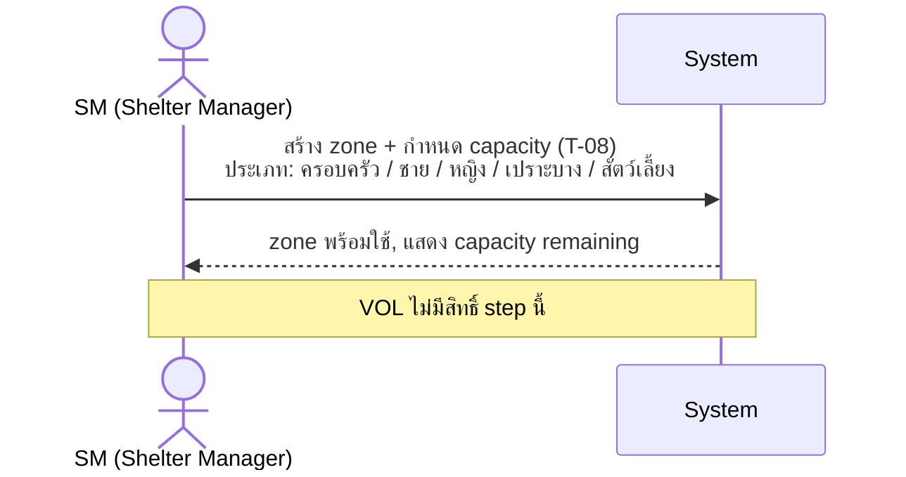
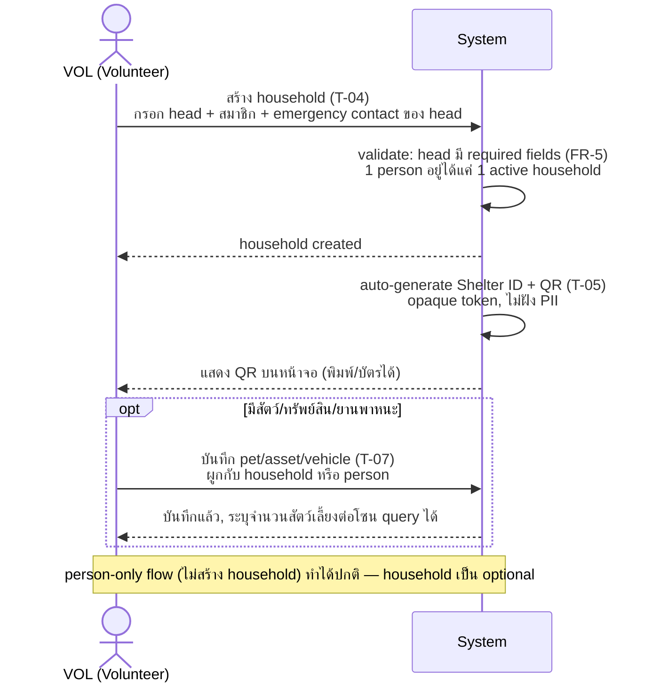
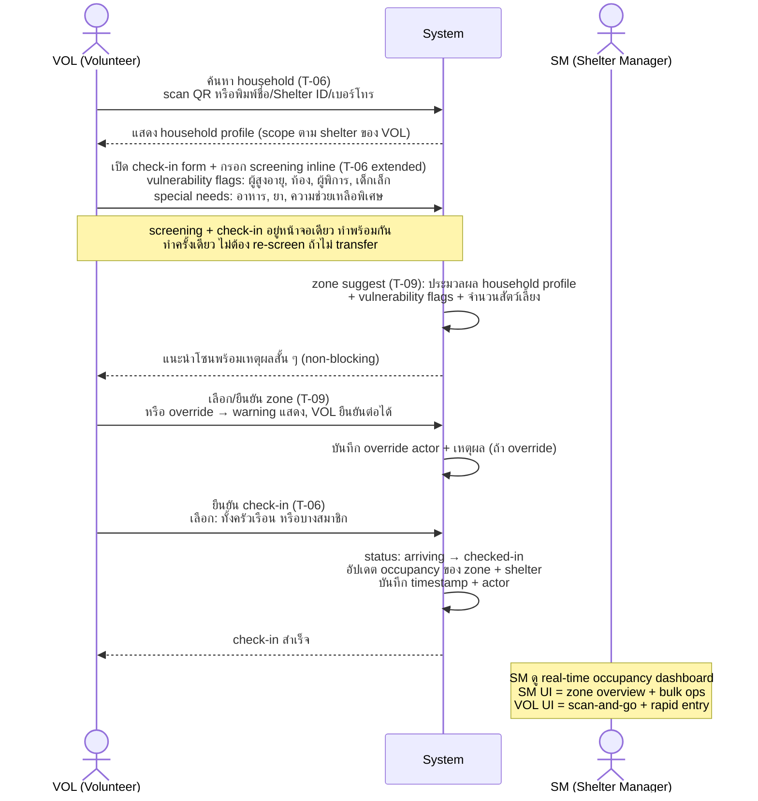
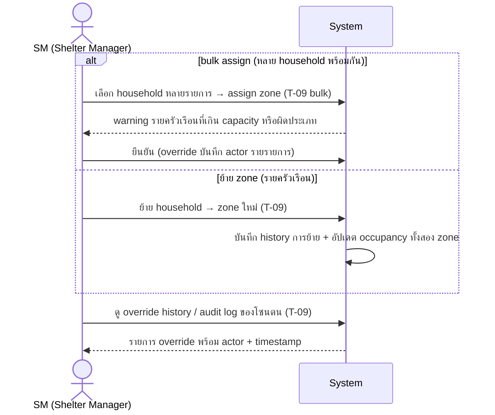
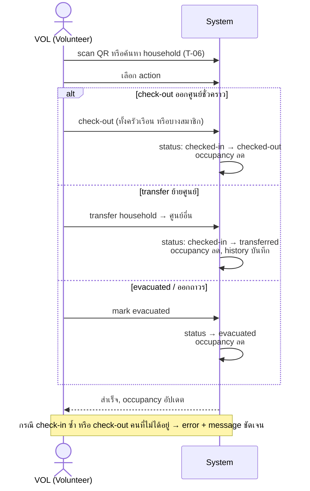

# CR-001 — 02-people.md: household gaps + permission cross-ref

## Why

Review `02-people.md` เทียบ `role-permission-matrix.md` พบ gap หลายจุดที่ยังไม่มีใน spec:

1. **Permission ไม่ปรากฏใน DoD** — implementer อ่าน task breakdown ไม่เห็น role rules; เสี่ยง implement ผิด
2. **VOL scope split T-08/T-09 ไม่ชัด** — FR-25 (zone definition) VOL=`—` แต่ FR-26 (allocation) VOL=`scope`; description ไม่แยก
3. **Household status lifecycle ขาด** — ไม่มี task/DoD ครอบ state transitions (`arriving → checked-in → transferred → evacuated → closed`) นอกจาก check-in/out ธรรมดา
4. **Screening flow ≠ check-in** — T-06 รวม check-in แต่ไม่ครอบ arrival screening (triage ก่อน check-in จริง) ซึ่งเป็น step แรกที่ VOL/SM ต้องทำ
5. **Backoffice vs frontline UI ไม่แยก** — ไม่มีเอกสารไหนระบุว่า SM ต้องการ backoffice flow (bulk ops, zone dashboard) แตกต่างจาก frontline flow ของ VOL (scan-and-go, rapid entry)
6. **Bulk zone operations ขาด** — T-09 assign ทีละ household; backoffice ต้องการ bulk assign/move ยังไม่อยู่ใน scope
7. **Household head emergency contact** — T-04 กำหนด head ได้แต่ไม่มี DoD ครอบ emergency contact / communication preference ของ head
8. **Audit/override log ดูไม่ได้จาก backoffice** — T-09 บันทึก override actor แต่ไม่มี task ครอบ "ดู audit log / override history"

## Change

### ส่วนที่แก้ได้เลย (documentation clarity — ไม่ต้องเปิด FR ใหม่)

| Item | Task | Before | After |
| --- | --- | --- | --- |
| Permission summary | T-04/T-05/T-06/T-07/T-09 DoD | ไม่มี | เพิ่มบรรทัด: `Roles: SA ✓ · SM scope · VOL scope — ดู role-permission-matrix §3` |
| Permission summary | T-08 DoD | ไม่มี | เพิ่มบรรทัด: `Roles: SA ✓ · SM scope · VOL — (zone definition = SM ขึ้นไปเท่านั้น)` |
| VOL scope split | T-08 description | ไม่ระบุ | เพิ่มประโยค: VOL ไม่มีสิทธิ์ create/edit zone — เฉพาะ SM/SA |
| VOL scope split | T-09 description | ไม่ระบุ | เพิ่มประโยค: VOL assign household เข้าโซนได้ แต่ไม่ create/edit zone |
| Household lifecycle | T-06 DoD | ครอบแค่ check-in/out | เพิ่ม: status state machine `arriving → checked-in → transferred → evacuated → closed` + transition rules |
| Head emergency contact | T-04 DoD | กำหนด head ได้ | เพิ่ม: head record ต้องมี emergency contact (phone) + communication preference |
| Override audit view | T-09 DoD | บันทึก override actor | เพิ่ม: SM สามารถดู override history ของโซนตนได้ |

### ส่วนที่ต้องการ PM ตัดสินใจก่อน

| Item | ตัวเลือก A | ตัวเลือก B |
| --- | --- | --- |
| **Screening flow** | ✅ **Option A confirmed (2026-06-18):** extend T-06 DoD ให้ครอบ arrival screening inline — screening + check-in เกิดพร้อมกัน, ทำครั้งเดียว, zone suggest ไม่ blocking (volunteer ดูทีหลังได้) | ~~เปิด task ใหม่ T-06b + FR ใหม่แยก~~ |
| **Backoffice vs frontline UI** | ✅ **Option A confirmed (2026-06-18):** เพิ่ม note ใน T-04/T-06/T-09 ว่า SM UI ≠ VOL UI — ไม่เปิด task แยก | ~~เปิด task UI แยก~~ |
| **Bulk zone allocation** | ✅ **Option A confirmed (2026-06-18):** extend T-09 scope ให้ครอบ bulk assign/move — ไม่เปิด task ใหม่ | ~~เปิด task ใหม่ T-09b~~ |

## Flow Verification

> Sequence diagram ทั้งโมดูล People & Zoning — verify ก่อน approve CR

### Phase 0 — Setup (SM ทำครั้งเดียวต่อศูนย์)



### Phase 1 — Registration (VOL หรือ SM ทำ ณ จุดรับ หรือล่วงหน้า)



### Phase 2 — Arrival Check-in + Screening (VOL ทำที่ประตูศูนย์)



### Phase 3 — Zone Management (backoffice, SM)



### Phase 4 — Check-out / Lifecycle transitions (VOL หรือ SM)



### Household status state machine

```
[สร้าง household] ──→ arriving
                            │
                    check-in confirmed
                            │
                            ▼
                       checked-in ──→ transferred (ย้ายศูนย์)
                            │
                    check-out / evacuate
                            │
                            ▼
                  checked-out / evacuated
                            │
                         closed
```

---

## Impact

- `docs/task-breakdown/02-people.md` — DoD T-04..T-09 (documentation เท่านั้น)
- ถ้า PM เลือก option B ข้อใดข้อหนึ่ง → กระทบ effort estimate รวมของโมดูล + matrix §3
- ไม่ bump schema_v (ไม่เปลี่ยนรูปร่าง persisted doc)

## Migration

N/A — documentation-only change (จนกว่า PM จะ approve option B ที่เกี่ยวกับ task ใหม่)

## Decision log

- 2026-06-18 — proposed
- 2026-06-18 — screening flow resolved: Option A (inline, ทำครั้งเดียวตอน check-in, zone suggest non-blocking)
- 2026-06-18 — backoffice/frontline UI split resolved: Option A (note ใน task ไม่แยก task)
- 2026-06-18 — bulk zone allocation resolved: Option A (extend T-09 ไม่เปิด task ใหม่)
- 2026-06-18 — open questions ทั้งหมด resolved; รอ PM approve CR ก่อนแก้ DoD
