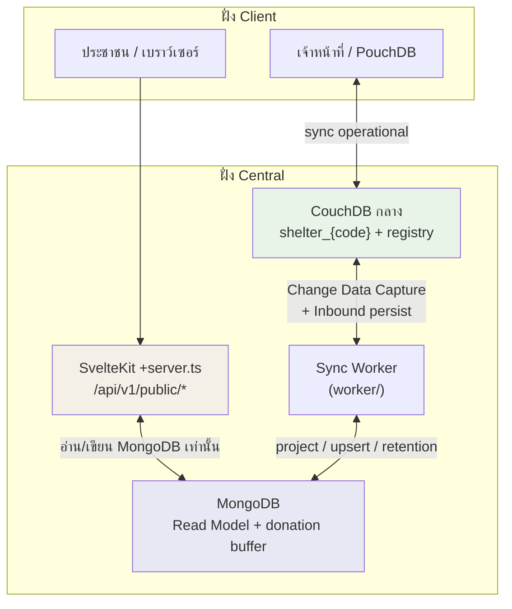
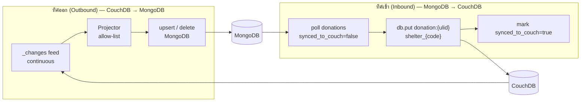
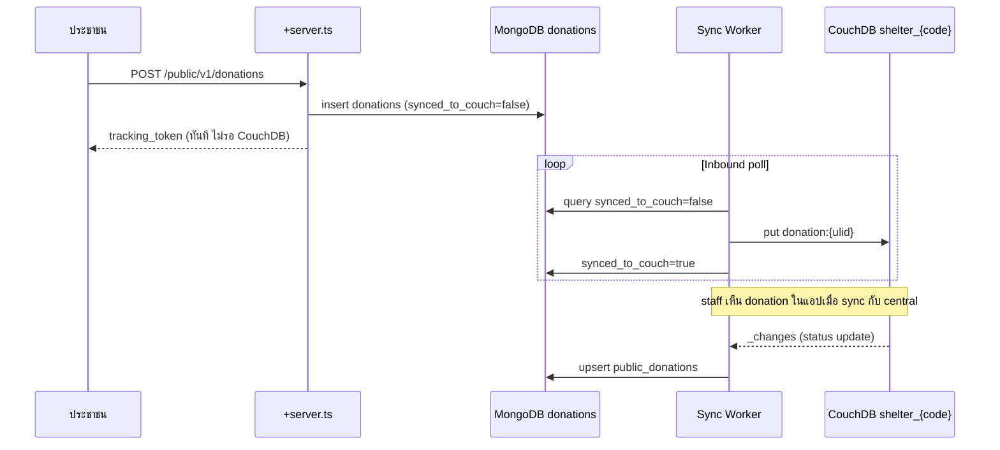

# CR-017 — Public Tier API Architecture (MongoDB Read Model + Sync Worker)

**สรุป (TL;DR):** กำหนดสถาปัตยกรรม **Public Tier ทั้งชั้น** (ค้นหาผู้อพยพข้ามศูนย์, ค้นหาศูนย์, ความต้องการบริจาค, ประกาศและติดตามการบริจาค) โดยให้ CouchDB กลางเป็นแหล่งข้อมูลหลัก (System of Record) และ MongoDB เป็น Read Model สำหรับฝั่งสาธารณะ พร้อม Sync Worker ที่จับการเปลี่ยนแปลงข้อมูล (Change Data Capture) จาก CouchDB มาฉายลง MongoDB — Public Application Programming Interface อ่าน/เขียน MongoDB เท่านั้น ไม่เข้าถึง CouchDB โดยตรง — **ยกเว้น** ฟีเจอร์รายงานความโปร่งใส (`public_transparency`, `GET /public/v1/transparency/*`) ถูกตัดออกจาก scope นี้ — เฟสแรก implement endpoint ใน SvelteKit `+server.ts` ก่อน แยก service ภายหลังเมื่อถึง timeline

---

## Why

| เหตุผล | ผลที่ได้ |
| --- | --- |
| จำกัดผลกระทบต่อระบบปฏิบัติการ | Traffic สาธารณะชน MongoDB ไม่ชน CouchDB ที่เจ้าหน้าที่และอุปกรณ์ศูนย์พึ่งพา |
| ป้องกันข้อมูลระบุตัวบุคคลรั่ว | Projector ใช้ allow-list — field ใหม่ใน CouchDB ไม่หลุดไป Mongo โดยอัตโนมัติ |
| รองรับการค้นหาข้ามศูนย์ | ค้นหาผู้อพยพและศูนย์จาก MongoDB (text index, hash เบอร์โทร) แทนการ query หลาย `shelter_{code}` บน CouchDB |
| แยกเจ้าของข้อมูลชัด | การประกาศบริจาคจากสาธารณะเขียน MongoDB ก่อน แล้ว Worker ค่อย persist เข้า CouchDB — หลัง persist แล้ว CouchDB เป็นเจ้าของ lifecycle |

อ้างอิงหลักการ sync: `docs/data/couchdb-mongodb-sync.md`

---

## Decision log

| รหัส | หัวข้อ | การตัดสินใจ | วันที่ |
| --- | --- | --- | --- |
| A | ขอบเขต (Scope) | รวม **Public Tier ทั้งชั้น** — ค้นหาผู้อพยพ, ค้นหาศูนย์, ความต้องการบริจาค, ประกาศ/ติดตามการบริจาค | 2026-07-01 |
| B | รายงานความโปร่งใส | **ตัดออก** — ไม่ implement `public_transparency` และ `GET /public/v1/transparency/*` | 2026-07-01 |
| C | ที่อยู่ Public API เฟสแรก | implement ใน `frontend/src/routes/api/v1/public/**/+server.ts` — แยก service ภายหลังเมื่อถึง timeline | 2026-07-01 |
| D | งาน Retention (ลบข้อมูลถาวร) | Loop ที่ 3 ของ Worker — ลบคู่กับ CouchDB + audit log + verify หลังลบ | 2026-07-02 |
| E | การ init โฟลเดอร์ `backend/` | **หลังจบเฟส 1** — Tech Lead (P'Net) init; Team Lead จัดการต่อ | 2026-07-02 |
| F | Definition of Done | เพิ่มตาม § Acceptance / DoD ด้านล่าง | 2026-07-01 |

### Decision A — ขอบเขต Public Tier และเจ้าของข้อมูล

Public Tier ครอบคลุม 4 กลุ่มงานหลัก:

| กลุ่มงาน | Endpoint (ตาม `api-contract.md`) | อ่าน/เขียน | แหล่งข้อมูลหลัก |
| --- | --- | --- | --- |
| ค้นหาผู้อพยพ (Family Search) | `POST /public/v1/family-search` | อ่าน | MongoDB `public_persons` (projection จาก CouchDB) |
| ค้นหาศูนย์ (Shelter Search) | `GET /public/v1/shelters` | อ่าน | MongoDB `public_shelters` (projection จาก `registry`) |
| ความต้องการบริจาค | `GET /public/v1/needs` | อ่าน | MongoDB `public_needs` (projection จาก view `needs_open` ต่อศูนย์) |
| ประกาศและติดตามบริจาค | `POST /public/v1/donations`, `GET /public/v1/donations/{tracking_token}` | เขียนแล้วอ่าน | MongoDB `donations` (buffer ก่อน persist) → CouchDB `donation:{ulid}` → MongoDB `public_donations` (mirror สถานะ) |

**กติกาเจ้าของข้อมูล (บังคับ):**

- CouchDB กลาง = แหล่งข้อมูลหลักของทุก operational document (ผู้อพยพ, lifecycle การบริจาค, สต็อก, …)
- MongoDB = projection อ่านอย่างเดียว **ยกเว้น** collection `donations` ที่เป็น buffer ชั่วคราวระหว่างประชาชนประกาศบริจาคกับ Worker persist เข้า CouchDB
- ข้อมูลการบริจาคสุดท้ายต้องอยู่ใน CouchDB `shelter_{shelter_code}` — MongoDB ไม่แทนที่ lifecycle หลัง persist
- ของบริจาคที่ประกาศ **ไม่กลายเป็นสต็อกอัตโนมัติ** — เจ้าหน้าที่คีย์ `stock_ledger` เอง (`couchdb-mongodb-sync.md` §4.2)

### Decision B — ตัดรายงานความโปร่งใส

- ไม่สร้าง collection `public_transparency`
- ไม่ implement `GET /public/v1/transparency/summary`, `/shelters`, `/donations`
- T-57/T-58 ที่อ้าง transparency metrics ใน CR-005 ต้องปรับ scope ใน `docs/task-breakdown/12-public.md` หลัง CR นี้ได้รับการอนุมัติ
- การค้นหาศูนย์ใช้ `public_shelters` จาก `registry` แทน (ชื่อ, พิกัด, สถานะ, ความจุ — **ไม่มี** occupancy aggregate / vulnerable count)

### Decision C — Public API เฟสแรกอยู่ใน SvelteKit

- เฟสแรก: endpoint ทั้งหมดอยู่ที่ `frontend/src/routes/api/v1/public/**/+server.ts`
- Node adapter ของ SvelteKit เป็นผู้เชื่อมต่อ MongoDB โดยตรง (credentials ฝั่ง server เท่านั้น)
- แยกเป็น service อิสระ (เช่น FastAPI ใน `backend/`) ภายหลังเมื่อ traffic หรือ timeline บังคับ — ไม่บล็อกเฟสแรก

### Decision D — งาน Retention คืออะไร และทำไมต้องตัดสินใจ

**คำถามเดิม (อธิบาย):** เมื่อระบบลบข้อมูลถาวรใน CouchDB ด้วยคำสั่ง `_purge` การลบนั้น **ไม่ปรากฏ** ใน feed `_changes` — Worker ที่จับการเปลี่ยนแปลงแบบ Change Data Capture จึง **ไม่รู้** ว่าข้อมูลถูกลบ ทำให้ข้อมูลเก่าค้างใน MongoDB (รวมข้อมูลระบุตัวบุคคลที่ควรหายไปแล้ว)

**งาน Retention** = กระบวนการที่ลบข้อมูลใน MongoDB **คู่กับ** การ purge ใน CouchDB เสมอ

| เหตุการณ์ | CouchDB | MongoDB (ต้องลบคู่กัน) |
| --- | --- | --- |
| ผู้อพยพถูก purge | `_purge` + tombstone | ลบ `public_persons` ของรายการนั้น |
| ข้อมูลผู้บริจาคใน donation | ลบ name/phone | ลบใน `public_donations` และ `donations` |
| ปิดศูนย์ | `status=closed` | ลบ `public_needs`, `public_shelters` ของศูนย์นั้น |

**การตัดสินใจ:** รวมงาน Retention เป็น **loop ที่ 3** ของ Sync Worker (batch job ตาม schedule) — ไม่เลื่อนออกนอก scope เพราะเกี่ยวกับความปลอดภัยข้อมูลระบุตัวบุคคล

**ข้อกำหนดเพิ่ม (ต้องลบสะอาดและตรวจสอบได้):**

1. **บันทึก audit ทุกครั้งที่ลบ** — เขียนลง MongoDB collection `_retention_audit` ก่อนหรือหลังลบ (ดู schema ด้านล่าง)
2. **ยืนยันหลังลบ (verify)** — หลัง `delete`/`deleteMany` ต้อง query ซ้ำว่า document หายจริง (`count === 0` สำหรับ `_id` ที่ระบุ) — ถ้ายังเหลือ → บันทึก `status: failed` และ retry รอบถัดไป
3. **Idempotent** — รันซ้ำได้ปลอดภัย: document หายไปแล้วถือว่าสำเร็จ ไม่ error
4. **Reconciliation (optional รายรอบ)** — สุ่มหรือครบตาม schedule เปรียบเทียบรายการที่ควรมีใน MongoDB กับสถานะใน CouchDB (เช่น evacuee ที่ purge แล้วต้องไม่มีใน `public_persons`) — ค้นพบค้าง → enqueue ลบและบันทึก audit
5. **ไม่ advance สถานะ "เสร็จ"** จนกว่า verify ผ่าน — retention job ที่ล้มเหลวต้องเห็นใน audit และถูก retry

**รูปแบบ `_retention_audit`:**

```js
{
  _id: "retention:{ulid}",
  job_run_id: "...",              // รหัสรอบ job (เดียวกันทั้งรอบ)
  trigger: "scheduled|reconcile|manual",
  target_collection: "public_persons",
  target_id: "evacuee:01H...",    // หรือ shelter_code สำหรับลบทั้งศูนย์
  couchdb_ref: { db, doc_id },    // อ้างอิงแหล่งที่ purge แล้ว
  action: "delete_one|delete_many|redact_fields",
  status: "pending|verified|failed",
  deleted_count: 1,
  verified_at: "..." | null,
  error: null | "...",
  created_at: "..."
}
```

### Decision E — การ init โฟลเดอร์ backend (หลังเฟส 1)

**เฟส 1 (scope ปัจจุบัน):** ไม่ init `backend/` — Public API อยู่ที่ SvelteKit `+server.ts` และ Sync Worker อยู่ที่ `worker/` เท่านั้น

**หลังจบเฟส 1** (เมื่อ timeline ของเฟส 1 ผ่าน หรือตัดสินใจแยก service):

- Tech Lead (P'Net) init repository `backend/` จาก `https://github.com/importstar/fastapi-beanie-simplified`
- Team Lead รับผิดชอบการจัดการโครงสร้างและ ownership ของ `backend/` ต่อทีม
- `backend/` เป็น FastAPI service แยก — ไม่รวม Sync Worker (Worker ยังอยู่ `worker/`)

---

## Architecture

### ภาพรวมระบบ



### สองทิศทางของ Sync Worker



### Flow การประกาศบริจาค (Inbound)



---

## Change Data Capture — กลไกจับการเปลี่ยนแปลง

**Change Data Capture** = การติดตาม event ที่ข้อมูลใน CouchDB เปลี่ยน (สร้าง/แก้/ลบ) แล้วส่งต่อให้ Worker ประมวลผล แทนการดึงข้อมูลทั้งก้อนหรือถามซ้ำทุกวินาที

### วิธีที่ใช้ (ตัดสินแล้ว)

| วิธี | ใช้หรือไม่ | เหตุผล |
| --- | --- | --- |
| Polling `_changes` ทุกวินาที | ไม่ใช้ | เปลือง request, latency สูง, โหลด CouchDB โดยไม่จำเป็น |
| Webhook / trigger จาก CouchDB | ไม่ใช้ | CouchDB ไม่มี webhook ในตัว |
| **Continuous `_changes` feed** | **ใช้** | มาตรฐานของ CouchDB, near-realtime, resume ได้ด้วย checkpoint |

### รูปแบบการเรียก (ต่อ database)

```http
GET /{database}/_changes?feed=continuous&include_docs=true&since={last_seq}
```

| พารามิเตอร์ | ความหมาย |
| --- | --- |
| `feed=continuous` | เปิด connection ค้าง ส่ง change ทันทีเมื่อมี |
| `include_docs=true` | รับ document เต็มใน feed (ลด round-trip) |
| `since={last_seq}` | เริ่มจากลำดับล่าสุดที่ประมวลผลแล้ว |

### Database ที่ Worker ต้องเกาะ

| Database | วัตถุประสงค์ |
| --- | --- |
| `registry` | ตรวจจับเปิด/ปิดศูนย์ → เริ่ม/หยุด listener ของ `shelter_{code}` |
| `shelter_{shelter_code}` (ทุกศูนย์ที่เปิด) | จับการเปลี่ยนแปลง operational docs → project ลง MongoDB |

### Checkpoint

- เก็บ `last_seq` ต่อ database ใน MongoDB collection `_sync_checkpoints` รูปแบบ `{ database, last_seq, updated_at }`
- อัปเดต checkpoint **หลัง** MongoDB write สำเร็จ (upsert/delete) — ไม่ advance ก่อน write
- เมื่อ connection หลุด: reconnect ด้วย `since=last_seq` จาก checkpoint — ประมวลผลซ้ำได้เพราะ upsert เป็น idempotent

### การรวมการเปลี่ยนแปลงที่ถี่ (Debounce)

- ใช้ **in-process debounce** ภายใน Worker (รวม change ของ document เดียวกันภายในช่วง ~100ms) แล้ว `bulk_write` ลง MongoDB
- **ไม่ใช้ Redis** ในเฟสแรก — ไม่จำเป็นสำหรับ throughput ปัจจุบัน

### สาม loop ของ Sync Worker

| Loop | กลไก | หน้าที่ |
| --- | --- | --- |
| 1 — Outbound | Continuous `_changes` | Projector → upsert/delete MongoDB collections |
| 2 — Inbound | Poll MongoDB `donations` ทุก 5–30 วินาที | Persist การประกาศบริจาคเข้า CouchDB |
| 3 — Retention | Batch job ตาม schedule | ลบ MongoDB คู่กับ purge → บันทึก `_retention_audit` → verify หลังลบ (§ Decision D) |

---

## MongoDB Collections

| Collection | ทิศ | ที่มา | ใช้โดย |
| --- | --- | --- | --- |
| `_sync_checkpoints` | ระบบ | Worker เขียน | resume Change Data Capture |
| `_retention_audit` | ระบบ | Retention loop เขียน | ติดตามการลบถาวร + verify |
| `public_persons` | Outbound | `evacuee` ใน `shelter_{code}` | `POST /public/v1/family-search` |
| `public_shelters` | Outbound | `shelter` ใน `registry` | `GET /public/v1/shelters` |
| `public_needs` | Outbound | view `needs_open` ต่อศูนย์ | `GET /public/v1/needs` |
| `donations` | Inbound buffer | `POST /public/v1/donations` เขียนตรง | Worker Inbound poll |
| `public_donations` | Outbound | `donation` ใน `shelter_{code}` | `GET /public/v1/donations/{tracking_token}` |

**ไม่สร้าง:** `public_transparency` (Decision B)

### รูปแบบ document หลัก (อ้างอิง `couchdb-mongodb-sync.md` §3.2 — ปรับตาม Decision B)

**`public_persons`** — หนึ่ง document ต่อผู้อพยพที่ค้นหาได้

```js
{
  _id: "evacuee:01H...",       // เท่ากับ CouchDB _id
  shelter_code: "SH001",
  first_name: "สมชาย",
  last_name_masked: "ใจ****ดี", // mask ตอน project
  phone_hash: "sha256(...)",   // ไม่เก็บเบอร์จริง
  status: "checked_in",
  updated_at: "..."
}
// ถ้า evacuee.privacy.search_excluded == true → ลบ document นี้ออกจาก MongoDB
```

**`public_shelters`** — หนึ่ง document ต่อศูนย์ (จาก registry)

```js
{
  _id: "SH001",
  shelter_code: "SH001",
  name: "...",
  status: "open|closed",
  geo: { lat, lng },
  capacity: 250,
  province, district, subdistrict,  // สำหรับ filter
  updated_at: "..."
}
```

**`public_needs`** — หนึ่ง document ต่อรายการที่ขาด (คำนวณจาก `needs_open` ต่อศูนย์)

```js
{
  _id: "SH001:item:01H...",
  shelter_code: "SH001",
  item_name, category, qty_needed, unit,
  updated_at: "..."
}
// qty_needed <= 0 → ลบ document
```

**`donations`** (buffer ก่อน persist)

```js
{
  _id: "<ULID>",
  shelter_code, donor: { name, phone },
  items_declared: [...],
  status: "declared",
  tracking_token: "<random>",
  synced_to_couch: false,
  created_at: "..."
}
```

**`public_donations`** (mirror สถานะหลัง persist)

```js
{
  _id: "donation:01H...",
  tracking_token,
  shelter_code,
  status: "declared|received|expired",
  items_declared: [...],
  received_summary: {...} | null,
  updated_at: "..."
}
```

---

## Requirements

### Sync Worker

- **FR-017-01** — Worker ต้องเปิด continuous `_changes` feed ต่อ `registry` และทุก `shelter_{shelter_code}` ที่สถานะเปิด
- **FR-017-02** — Worker ต้องเริ่ม/หยุด listener ของศูนย์ตาม `operation_status` จาก `registry` แบบ real-time
- **FR-017-03** — Projector ต้องใช้ allow-list ตายตัวต่อ `doc.type` — field ใหม่ใน CouchDB ต้องไม่หลุดไป MongoDB โดยอัตโนมัติ
- **FR-017-04** — Worker ต้องเก็บ checkpoint `last_seq` ใน `_sync_checkpoints` และอัปเดตหลัง MongoDB write สำเร็จ
- **FR-017-05** — Inbound loop ต้อง poll `donations` ที่ `synced_to_couch=false` แล้ว `put` ลง `shelter_{shelter_code}` ด้วย `_id` เดียวกัน (ULID) — retry ปลอดภัยเมื่อได้ HTTP 409
- **FR-017-06** — Retention loop ต้องลบ MongoDB คู่กับ purge ใน CouchDB ตามตาราง Decision D
- **FR-017-07** — หลังทุกการลบ Retention ต้อง verify ว่า document หายจาก collection เป้าหมายจริง — ไม่ผ่าน → `status: failed` ใน `_retention_audit` และ retry รอบถัดไป
- **FR-017-08** — ทุกการลบ Retention ต้องบันทึก `_retention_audit` (job_run_id, target, status, deleted_count, verified_at)
- **FR-017-09** — Retention ต้อง idempotent — ลบซ้ำเมื่อ document หายแล้วถือว่าสำเร็จ
- **FR-017-10** — Worker ต้องไม่ใช้ Redis ในเฟสแรก

### Public API (`+server.ts`)

- **FR-017-11** — Public endpoint ทั้งหมดต้องอ่าน/เขียน MongoDB เท่านั้น — ห้ามเรียก CouchDB จาก client หรือ route สาธารณะ
- **FR-017-12** — `POST /public/v1/family-search` อ่าน `public_persons` — response ไม่มีเบอร์โทรจริง, นามสกุลเต็ม, ข้อมูลการแพทย์
- **FR-017-13** — `GET /public/v1/shelters` อ่าน `public_shelters` — รองรับ filter จังหวัด/อำเภอ/ตำบล/สถานะ
- **FR-017-14** — `GET /public/v1/needs` อ่าน `public_needs` — aggregate ข้ามศูนย์ได้
- **FR-017-15** — `POST /public/v1/donations` เขียน `donations` buffer แล้วตอบ `tracking_token` ทันที (ไม่รอ CouchDB)
- **FR-017-16** — `GET /public/v1/donations/{tracking_token}` อ่าน `public_donations` — เฉพาะสถานะของ token นั้น
- **FR-017-17** — Response ที่ cache ได้ต้องมี `Cache-Control: public, max-age=600`
- **FR-017-18** — MongoDB ไม่พร้อม → HTTP 503 พร้อม `Cache-Control` สั้น — CouchDB operational ไม่ได้รับผลกระทบ

### Frontend

- **FR-017-19** — โค้ด Public Tier ต้องอยู่ใน `$lib/features/public-portal` — route อื่นห้าม import ข้าม layer

---

## โครงสร้างโค้ด

### เฟส 1 (scope ปัจจุบัน)

```text
Smart Shelter
├── frontend/
│   ├── src/routes/api/v1/public/
│   │   ├── family-search/+server.ts    ← POST ค้นหาผู้อพยพ
│   │   ├── shelters/+server.ts         ← GET ค้นหาศูนย์
│   │   ├── needs/+server.ts            ← GET ความต้องการบริจาค
│   │   └── donations/
│   │       ├── +server.ts              ← POST ประกาศบริจาค
│   │       └── [tracking_token]/+server.ts  ← GET ติดตามสถานะ
│   └── src/lib/features/public-portal/  ← Zod schema (ไม่มี PII) + API wrapper
├── worker/                              ← Sync Worker (Python)
│   ├── Dockerfile
│   ├── main.py                          ← 3 loops: Outbound / Inbound / Retention
│   └── requirements.txt
└── docker-compose.yml                   ← เพิ่ม worker, mongodb (ไม่มี redis เฟสแรก)
```

### หลังเฟส 1 (ยังไม่เริ่มใน scope นี้)

```text
└── backend/                             ← FastAPI (P'Net init หลังจบเฟส 1; Team Lead จัดการ)
```

**การมอบหมาย:** เฟส 1 ไม่มี `backend/` — หลังจบเฟส 1 Tech Lead (P'Net) init `backend/`; Team Lead รับ ownership ต่อ

---

## ไฟล์ที่ได้รับผลกระทบ

| ไฟล์ | การเปลี่ยนแปลง |
| --- | --- |
| `frontend/src/routes/api/v1/public/**/+server.ts` | สร้างใหม่ |
| `frontend/src/lib/features/public-portal/**` | สร้างใหม่ |
| `worker/main.py`, `worker/Dockerfile` | สร้างใหม่ / แทนที่ metrics-worker |
| `backend/` | **นอก scope เฟส 1** — init หลังจบเฟส 1 โดย Tech Lead (P'Net) |
| `docker-compose.yml` | เพิ่ม `worker`, `mongodb` |
| `docs/task-breakdown/12-public.md` | ปรับ scope หลัง approve (ตัด transparency) |
| `docs/data/couchdb-mongodb-sync.md` | อัปเดต §3.2 ตัด `public_transparency` หลัง approve |

---

## Edge cases

| กรณี | ปัญหา | วิธีรับมือ |
| --- | --- | --- |
| MongoDB ล่ม | Public API ไม่ตอบข้อมูล | HTTP 503 + Cache-Control สั้น; CouchDB operational ไม่กระทบ |
| `_changes` feed หลุด | MongoDB stale | Reconnect ด้วย `since=last_seq` จาก `_sync_checkpoints` |
| `_purge` ใน CouchDB | MongoDB ไม่เห็น event ลบ | Retention loop ลบ + verify + บันทึก `_retention_audit` |
| เปิด/ปิดศูนย์กะทันหัน | Listener ไม่ตรงสถานะ | เกาะ `registry` `_changes` → เริ่ม/หยุด listener |
| Worker crash ระหว่าง Inbound | donation ค้าง buffer | `synced_to_couch` ยัง false → poll รอบถัดไป retry; 409 = สำเร็จแล้ว |
| ศูนย์ปิด | ข้อมูล public ค้าง | Retention ลบ `public_persons`, `public_needs`, `public_shelters` + verify + audit |
| Retention ลบไม่ครบ | PII ค้างใน MongoDB | verify ไม่ผ่าน → `failed` ใน audit → retry; reconciliation รอบถัดไป |

---

## Acceptance / Definition of Done

### Sync Worker

- [ ] Continuous `_changes` ทำงานต่อ `registry` + `shelter_{code}` ที่เปิด — reconnect หลังหลุดไม่ตก change
- [ ] Checkpoint `_sync_checkpoints` อัปเดตหลัง MongoDB write สำเร็จ
- [ ] Projector unit test ต่อ `doc.type` — ยืนยัน allow-list และ masking ถูกต้อง
- [ ] Inbound: donation จาก `POST /public/v1/donations` ปรากฏใน CouchDB `shelter_{code}` ภายในเวลาที่กำหนด
- [ ] Retention: หลัง purge CouchDB ข้อมูลที่เกี่ยวข้องหายจาก MongoDB ภายในรอบ job
- [ ] Retention: ทุกการลบมี `_retention_audit` พร้อม `status: verified` — ไม่มีรายการค้าง `failed` โดยไม่ retry
- [ ] Retention: test ยืนยัน verify หลังลบ (query ซ้ำ `count === 0`) และ idempotent re-run
- [ ] ไม่มี Redis ใน `docker-compose.yml` เฟสแรก
- [ ] ไม่มี `backend/` ใน deliverable เฟส 1

### MongoDB

- [ ] Index: `public_persons` — text index (`first_name`, `last_name_masked`), `{ phone_hash }`, `{ shelter_code }`
- [ ] Index: `public_shelters` — `{ shelter_code }`, `{ province, district, subdistrict }`, `{ status }`
- [ ] Index: `public_donations` — `{ tracking_token }` (unique)
- [ ] Index: `donations` — `{ synced_to_couch }`
- [ ] Index: `_retention_audit` — `{ job_run_id }`, `{ status, created_at }`, `{ target_collection, target_id }`

### Public API

- [ ] Endpoint ครบตาม FR-017-11 ถึง FR-017-18
- [ ] ไม่มี endpoint `GET /public/v1/transparency/*`
- [ ] Rate-limit / anti-enumeration บน family-search และ donation (ตาม Public task DoD ใน `12-public.md`)
- [ ] Seed script: seed CouchDB แล้วรัน Worker หนึ่งรอบ — MongoDB มี projection สำหรับ dev/end-to-end test

### Frontend

- [ ] `$lib/features/public-portal` แยกจาก operational tier — ESLint `no-restricted-imports` ผ่าน
- [ ] UI แสดง stale indicator เมื่อ `updated_at` เก่ากว่า 30 นาที (OP-7 จาก CR-005)

### Spec cross-ref (หลัง approve)

- [ ] อัปเดต `docs/task-breakdown/12-public.md` — ตัด transparency, ผูก MongoDB read model
- [ ] อัปเดต `docs/data/couchdb-mongodb-sync.md` — ตัด `public_transparency`, เพิ่ม `public_shelters`

---

## Impact

| ชั้น | ผลกระทบ |
| --- | --- |
| CR-005 | ตัด transparency endpoints และ metrics ที่พึ่ง `public_transparency` |
| T-57 | metrics panel ที่อ่าน `GET /public/v1/transparency/summary` ต้องปรับหรือ defer |
| T-58 | Shelter Dashboard ที่พึ่ง transparency ต้องปรับให้ใช้ `GET /public/v1/shelters` แทน |
| T-41 | Family Search ผูก `public_persons` + Worker Outbound |
| T-60 | Donation public ผูก Inbound/Outbound + `donations` buffer |
| `couchdb-mongodb-sync.md` | ปรับ collections และ endpoint map |

## Migration

ไม่มี `schema_v` bump ใน CouchDB operational documents — การเปลี่ยนแปลงอยู่ที่ชั้น MongoDB projection และ Public API เท่านั้น

Seed และ dev environment: ต้องมี CouchDB sample data + Worker run หนึ่งรอบก่อนทดสอบ Public Tier

---

## สิ่งที่ต้องปรับ Spec (หลัง approve)

1. `docs/task-breakdown/12-public.md` — scope T-57/T-58 ไม่รวม transparency
2. `docs/data/couchdb-mongodb-sync.md` — ตัด `public_transparency`, เพิ่ม `public_shelters`, อัปเดต endpoint map §6
3. `docs/features/public-tier-flow-spec.html` — ตัด PUB transparency section
4. `docs/changes/_index.md` — ลงแถวเมื่อ approve (2026-07-02)

---

## Decision log (timeline)

- 2026-06-29 — proposed (ร่างแรก — scope T-58 + Redis)
- 2026-06-30 — อัปเดต edge cases
- 2026-07-01 — ขยาย scope เป็น Public Tier ทั้งชั้น; ตัด transparency; กำหนด Change Data Capture mechanism; ตัด Redis เฟสแรก; API ใน `+server.ts`; อธิบาย Retention (Decision D); เพิ่ม DoD
- 2026-07-02 — Decision D: Retention loop + `_retention_audit` + verify หลังลบ; Decision E: `backend/` เริ่มหลังจบเฟส 1 เท่านั้น
- 2026-07-02 — **approved** (project owner)
