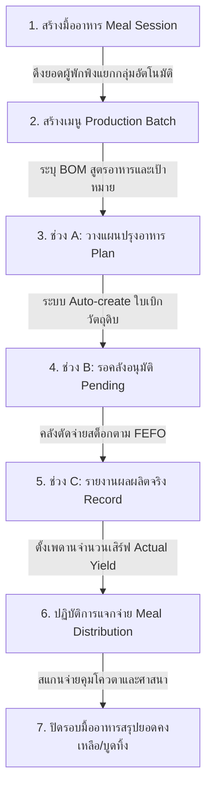

# CR-047 — Food Warehouse, Nutrition Standards & Kitchen Operations Overhaul

> **สรุป (TL;DR):** ปรับปรุงระบบคลังเสบียง มาตรฐานโภชนาการ Sphere และกระบวนการวางแผนโรงครัวแบบ 3 ช่วงเวลา (A/B/C) · รวมศูนย์การนับประชากร Unified Headcount กรอง Active/In-shelter และล็อก Base Unit หลังบันทึกครั้งแรก · กระทบ `item_master`, `requirement_group`, `food_sphere_standard`, `meal_plan`, และ UI Kitchen Operations.

---

## Why (เหตุผลและที่มา)
1. **ปัญหาคลังเสบียงเดิม:** มีการดึงหน่วยนับไปแก้สะเปะสะปะทำให้สต็อกย้อนหลังพัง, คุณสมบัติสินค้ามีเพียง Checkbox ฮาลาล/ทารก ไม่ครอบคลุมเพศ/ช่วงวัย/ศาสนาอื่น
2. **ปัญหาการคำนวณประชากรและโภชนาการ:** แต่ละหน้าจอคำนวณประชากรผู้พักพิงแยก logic กันเอง ไม่ตรงกับทะเบียนจริง และค่า DoC แสดงผลเป็น Infinity เมื่อไม่มีนโยบาย
3. **ปัญหาโรงครัวเดิม:** ฟอร์มวางแผนยัดทุกอย่างไว้ในหน้าเดียว และมีปุ่มกดตัดสต็อกลอยโดยไม่ผ่านระบบตั๋วเบิกคลังสินค้า ทำให้ไม่สามารถควบคุมและสอบย้อนประวัติการเบิกวัตถุดิบได้

---

## 📌 ภาพรวมการเปลี่ยนแปลงสำคัญ (Key Highlights)

สรุปสั้นๆ ให้เห็นภาพง่ายๆ ว่าระบบใหม่เปลี่ยนกระบวนการทำงานด้านเสบียงและโรงครัวจากเดิมอย่างไรบ้าง:

| เรื่อง (Topic) | เดิม (Before) | ใหม่ (After / สเปกใหม่) |
| :--- | :--- | :--- |
| **1. ข้อมูลเสบียงหลัก (Item Master)** | มีแค่ Checkbox ฮาลาล/ทารก เฉพาะกิจ และแก้ไขหน่วยนับได้ตลอด | **เพิ่ม Tag ครอบคลุม 3 มิติ** (เพศ, วัย, ศาสนา/อาหาร) เพื่อจับคู่อัตโนมัติ และ **ล็อก Base Unit** หลังบันทึกครั้งแรก *(ข้อ 2.1 / Task #15, #31)* |
| **2. การคำนวณประชากร & โภชนาการ** | แต่ละหน้าคำนวณคนไม่ตรงกัน และ DoC ขึ้น Infinity เมื่อไม่มีนโยบาย | **ดึง Headcount จากทะเบียนจริงที่เดียว** (กรอง Active/In-shelter) และ **แสดง "ยังไม่ได้ตั้งค่านโยบาย"** แทน $+\infty$ *(ข้อ 2.4 / Task #22, #39)* |
| **3. การวางแผนผลิตอาหารโรงครัว** | หน้าเดียวยัดทุกอย่าง และตัดสต็อกลอยไม่ผ่าน Ticket | **ปรับเป็น Wizard 3 ช่วงเวลา (A-วางแผน, B-รอคลังอนุมัติ, C-บันทึกผลจริง)** Auto-create ตั๋วเบิกคลัง (`TKT-KITCHEN`) อัตโนมัติ *(ข้อ 5.5.1 / Task #42, #50)* |

---

## 🥗 หมวดที่ 1: ข้อมูลสินค้าและสต็อกเสบียง (Item Master & Stock Control)
*เปรียบเทียบสเปกใหม่ใน SmartShelter_สเปคระบบคลังสินค้า.md (หัวข้อ 2.1 - 2.5) เทียบกับสเปคเดิมใน docs/*

* **[เอาออก] การตั้งค่าหน่วยสำหรับสั่งซื้อ (Default Purchasing UOM):** ตัดออกในสเปกใหม่เพื่อให้สอดคล้องกับหลักการ **A6 — ไม่มีระบบจัดซื้อ (Purchase Order) ในระบบ** คงเหลือเฉพาะหน่วยจัดเก็บ (Inventory) และหน่วยเบิกจ่าย (Issue/Sales) *(ข้อ 2.1 / Task #31)*
* **[เอาออก] ฟิลด์ Distribution Mode (GENERAL/CONTROLLED):** ตัดออกเนื่องจากซ้ำซ้อนกับประเภทการแจกจ่ายในข้อมูลสินค้า *(ข้อ 2.1 / Task #30)*
* **[เอาออก] Checkbox "Set as Default Option":** ตัดตัวเลือกที่เป็น Template ค้างออกจากแบบฟอร์มบันทึกสินค้าหลัก, BOM และแผนผังกลุ่มสินค้า *(ข้อ 2.1 / Task #32)*
* **[เปลี่ยน] การล็อกหน่วยนับพื้นฐาน (Base Unit Lock Rule):** ล็อกการแก้ไขหน่วยนับพื้นฐาน (Base Unit) ใน `item_master` หลังบันทึกครั้งแรกที่มีค่าจริงแล้วเท่านั้น เพื่อป้องกันข้อมูลสต็อกย้อนหลังพัง (หากบันทึกครั้งแรกเป็นค่าว่าง ยังแก้ไขได้จนกว่าจะระบุค่าจริง) *(ข้อ 2.1)*
* **[เปลี่ยน] ฟิลด์ประเภทสินค้า (Category):** กำหนดฟิลด์ `category` เป็น `enum` ประกอบด้วย `CONSUMABLE`, `DURABLE`, `EQUIPMENT` ในสกีมา `item_master` *(ข้อ 2.1)*
* **[เพิ่ม] คุณสมบัติผู้รับ (Eligibility Tags):** ขยายการตั้งค่าคุณสมบัติผู้รับสินค้าจากเดิมที่มีเพียง checkbox ฮาลาลและปลอดภัยสำหรับทารก ให้เป็น Tag ครอบคลุม 3 มิติ (เพศที่ใช้ได้, ช่วงวัยที่เหมาะสม, ข้อจำกัดด้านศาสนา/อาหารเฉพาะกลุ่ม) เพื่อจับคู่อัตโนมัติกับทะเบียนผู้พักพิงตอนเบิกแจกจ่าย *(ข้อ 2.1.1 / Task #15)*
* **[เพิ่ม] คุณสมบัติการจัดเก็บและสารก่อภูมิแพ้:** เพิ่มฟิลด์ข้อมูลคุณลักษณะใหม่ 3 ฟิลด์ใน `item_master` ได้แก่:
  1. **อายุการเก็บรักษา (วัน) (Shelf Life - days):** กำหนดอายุของสินค้าในการจัดเก็บ
  2. **ประเภทการจัดเก็บ (Storage Type):** กำหนดเป็น `enum` ได้แก่ `DRY` (แห้ง), `CHILLED` (แช่เย็น), `FROZEN` (แช่แข็ง), และ `CONTROLLED_MED` (ยาควบคุมอุณหภูมิ)
  3. **สารก่อภูมิแพ้ (Allergens):** เพิ่มฟิลด์ระบุประเภทสารก่อภูมิแพ้ของอาหาร/วัตถุดิบ *(ข้อ 2.1)*
* **[เพิ่ม] รูปแบบเลขล็อตและ Aging ถังแก๊ส:** กำหนดรูปแบบเลขล็อตเป็น `L-SH[index]-DDMMYYYY-XXXX` และตั้งค่าสถานะ Aging ของถังแก๊สหุงต้มเป็น "N/A" (ไม่มีวันหมดอายุ) แทนการขึ้นป้ายเขียว "ปกติ" *(ข้อ 2.2, 2.5 / Task #57)*
* **[เพิ่ม] การคำนวณแก๊สหุงต้มโรงครัว (Kitchen LPG Gas Usage):** *(ข้อ 2.2 / Task #37)*
  $$\text{Gas Consumption (kg)} = \text{Cooking Time (hrs)} \times \text{Burn Rate (kg/hr)} \times \text{Multiplier}$$
  * **📌 สูตรนี้ใช้ทำอะไร:** คำนวณหาปริมาณแก๊สหุงต้ม (กิโลกรัม) ที่ต้องเบิกออกคลังหลัก สำหรับนำมาใช้ปรุงอาหารในมื้อนั้นๆ
  * **🖥️ คำนวณที่หน้าจอไหน:** หน้า **Production Setup Board (Wizard ช่วง A — วางแผนเมนู)** ในส่วนแผงจัดสรรแก๊สโรงครัว
  * **💡 ตัวอย่างการคำนวณจริง:** ถ้าต้มอาหารใช้เวลา 2 ชั่วโมง, ถังแก๊สมีอัตราเผาไหม้ (Burn Rate) 1.5 kg/ชม., ตัวคูณเวลา 1.0 $\rightarrow$ ระบบจะคำนวณแก๊สที่ต้องเบิก = $2 \times 1.5 \times 1.0 = 3.0 \text{ kg}$ เพื่อส่งไปตัดสต็อกถังแก๊สในคลังหลัก

---

## 📊 หมวดที่ 2: มาตรฐานโภชนาการและการเติมสต็อก (Nutrition & Replenishment Policy)
*เปรียบเทียบสเปกใหม่ใน SmartShelter_สเปคระบบคลังสินค้า.md (หัวข้อ 2.4) เทียบกับสเปคเดิมใน docs/*

* **[เพิ่ม] Requirement Group Schema & Conversion Factor:** *(ข้อ 2.4 / Task #17)*
  $$\text{Standard Qty} = \text{Base Qty} \times \text{conversion\_factor}$$
  * **📌 สูตรนี้ใช้ทำอะไร:** แปลงน้ำหนัก/จำนวนของสินค้าจริง (เช่น ข้าวสารเป็น กก.) ให้กลายเป็นหน่วยคุณค่าสารอาหารมาตรฐาน (เช่น พลังงาน kcal)
  * **🖥️ คำนวณที่หน้าจอไหน:** หน้า **ตั้งค่าพารามิเตอร์สินค้า (Item Group Maps)** และระบบวิเคราะห์โภชนาการหลังบ้าน
  * **💡 ตัวอย่างการคำนวณจริง:** เบิกข้าวสาร 5 kg โดยมี conversion_factor = 3,500 kcal/kg $\rightarrow$ ระบบจะได้คุณค่าพลังงาน = $5 \times 3,500 = 17,500 \text{ kcal}$

  **📋 ตารางโครงสร้างข้อมูล `requirement_group`:**
  | ชื่อฟิลด์ (Field Name) | ประเภทข้อมูล (Data Type) | คำอธิบายและเงื่อนไข (Description & Constraints) | ตัวอย่างข้อมูล (Example) |
  | :--- | :---: | :--- | :--- |
  | `_id` | `String` | รหัสประจำกลุ่มความต้องการ (Primary Key) | `"req_group:FOOD_ENERGY"` |
  | `name` | `String` | ชื่อกลุ่มความต้องการสารอาหาร/เสบียง | `"พลังงานอาหาร"` |
  | `standard_uom` | `String` | หน่วยนับมาตรฐานประจำกลุ่ม | `"kcal"`, `"gram"`, `"litre"` |
  | `item_maps` | `Array[Object]` | รายการจับคู่สินค้าเข้ากับกลุ่มความต้องการ | `[...]` |
  | `item_maps[].item_id` | `String` | รหัสสินค้าประจำรายการ (อ้างอิง `item_master`) | `"item:RICE_5KG"` |
  | `item_maps[].base_uom` | `String` | หน่วยนับพื้นฐานของสินค้า (Read-only อ้างอิง `item_master`) | `"กิโลกรัม"` |
  | `item_maps[].conversion_factor` | `Number` | ตัวคูณแปลงจาก Base UOM สินค้า ไปเป็น Standard UOM | `3500` (1 กก. = 3,500 kcal) |
  | `item_maps[].share_percent` | `Number` | สัดส่วนเป้าหมายเมนู (%) ผลรวมทุกสินค้าในกลุ่มต้องได้ $100\%$ | `70` (70%) |

* **[เพิ่ม] Food Sphere Standard Schema (คำนวณความต้องการเสบียงรวมต่อวัน):** *(ข้อ 2.4 / Task #17)*
  $$\text{Total Daily Demand} = \sum_{\text{segment}} (\text{Headcount}_{\text{segment}} \times \text{daily\_demand}_{\text{segment, group}})$$
  * **📌 สูตรนี้ใช้ทำอะไร:** คำนวณความต้องการสารอาหาร/เสบียงรวมทั้งศูนย์พักพิงต่อวัน ตามมาตรฐานสากล Sphere อ้างอิงจากกลุ่มผู้พักพิงจริง
  * **🖥️ คำนวณที่หน้าจอไหน:** หน้า **Sphere Standard Analysis (วิเคราะห์ความต้องการเสบียง)**
  * **💡 ตัวอย่างการคำนวณจริง:** มีผู้พักพิงกลุ่มทั่วไป 10 คน (ต้องการ 2,100 kcal/คน/วัน) $\rightarrow$ ความต้องการรวมต่อวัน = $10 \times 2,100 = 21,000 \text{ kcal/วัน}$

  **📋 ตารางโครงสร้างข้อมูล `food_sphere_standard`:**
  | ชื่อฟิลด์ (Field Name) | ประเภทข้อมูล (Data Type) | คำอธิบายและเงื่อนไข (Description & Constraints) | ตัวอย่างข้อมูล (Example) |
  | :--- | :---: | :--- | :--- |
  | `_id` | `String` | รหัสเกณฑ์อ้างอิงมาตรฐาน (Primary Key) | `"sphere:ALL:FOOD_ENERGY"` |
  | `target_segment` | `String (Enum)` | กลุ่มเป้าหมายผู้พักพิง (`ALL`, `INFANT_0_6`, `INFANT_6_23`, `CHILD_2_5`, `PREGNANT`, `LACTATING`, `ELDERLY`) | `"ALL"` |
  | `req_group_id` | `String` | รหัสกลุ่มความต้องการสารอาหาร (อ้างอิง `requirement_group`) | `"FOOD_ENERGY"` |
  | `daily_demand` | `Number` | ปริมาณความต้องการมาตรฐานต่อคนต่อวัน | `2100` (kcal/คน/วัน) |
  | `source` | `String (Enum)` | แหล่งที่มาของเกณฑ์ (`SPHERE_BASELINE` / `SHELTER_OVERRIDE`) | `"SPHERE_BASELINE"` |

* **[เปลี่ยน] การนับประชากรรวมศูนย์ (Unified Headcount Calculation):** ทุกหน้าจอคำนวณดึงจำนวนประชากรจากฟังก์ชันกลางเดียวกัน กรองเฉพาะผู้พักพิงสถานะ `Active/In-shelter` จากทะเบียนจริง *(ข้อ 2.4 / Task #39)*

* **[เปลี่ยน] นโยบายเติมสต็อกและ DoC Alert (Replenishment Policy & Days of Coverage):** *(ข้อ 2.4 / Task #22)*
  $$\text{DoC (Days)} = \frac{\text{Current Stock Qty}}{\text{Total Daily Demand}}$$
  $$\text{Shortage Qty} = (\text{Standard Reorder Days} \times \text{Total Daily Demand}) - \text{Current Stock Qty}$$
  * **📌 สูตรนี้ใช้ทำอะไร:** คำนวณว่าเสบียงที่มีในคลังจะเลี้ยงคนได้อีกกี่วัน (**DoC**) และต้องสั่งเพิ่มอีกเท่าไหร่ถึงจะปลอดภัย (**Shortage Qty**)
  * **🖥️ คำนวณที่หน้าจอไหน:** หน้า **แผงควบคุมความมั่นคงทางเสบียง (Shelter Stability Control)** และหน้าเตือนภัยคลัง
  * **💡 ตัวอย่างการคำนวณจริง:** มีข้าวสารในคลัง 100 kg, ความต้องการใช้คือ 10 kg/วัน $\rightarrow$ คำนวณ $\text{DoC} = \frac{100}{10} = 10 \text{ วัน}$ *(หมายเหตุ: หากยังไม่ได้ตั้งค่านโยบาย ระบบจะแสดงป้าย "ยังไม่ได้ตั้งค่านโยบาย" แทนที่จะขึ้น Infinity)*

---

## 🍳 หมวดที่ 3: การวางแผนผลิตและแจกจ่ายอาหารโรงครัว (Kitchen Operations & Meal Flow)
*เปรียบเทียบสเปกใหม่ใน SmartShelter_สเปคระบบคลังสินค้า.md (หัวข้อ 5.5, 6) เทียบกับสเปคเดิมใน docs/*

### Flow การทำงานของโรงครัว (Meal Session ➔ Production Batch ➔ Distribution)

* **[เปลี่ยน] โครงสร้างมื้ออาหาร 2 ชั้น:** แบ่งโครงสร้างเป็น **มื้ออาหาร (`Meal Session`)** ➔ **เมนูที่ทำ (`Production Batch`)** เพื่อให้ติดตามได้ว่ามื้อนั้นๆ ครบทุกกลุ่มเป้าหมาย (ปกติ/ฮาลาล ฯลฯ) หรือยัง *(ข้อ 5.5 / Task #16)*
* **[เปลี่ยน] Production Setup Board (Wizard 3 ช่วงเวลา):** ออกแบบกระบวนการวางแผนปรุงอาหารใหม่เป็น 3 ช่วงเวลาตามความเป็นจริงของงานครัว *(ข้อ 5.5.1 / Task #42)*:
  * **ช่วง A — วางแผนเมนู:** เลือกสูตร (BOM) คำนวณวัตถุดิบและแก๊สตาม headcount ➔ กดปุ่ม **"สร้างใบเบิกวัตถุดิบ"** เพื่อส่งคำร้องไปคลัง
  * **ช่วง B — รอคลังอนุมัติ:** ระบบ Auto-create คำร้องเบิกวัตถุดิบครัว (`TKT-KITCHEN-XXXX`) ส่งไปคลังหลัก รอคลังอนุมัติตัดสต็อกจริงตาม FEFO
  * **ช่วง C — รายงานผลจริง:** เมื่อรับวัตถุดิบแล้ว ครัวกรอก **Actual Yield (จำนวนเสิร์ฟที่ทำได้จริง)** บันทึกกลับเข้าหน้าสรุปมื้อ
* **[เพิ่ม] Wizard State Security:** ควบคุมสิทธิ์การแก้ไขข้ามช่วง A/B/C หากคลังอนุมัติตัดสต็อกแล้ว ช่วง A/B จะกลายเป็น Read-only ทันที *(ข้อ 5.5.1 / Task #50)*
* **[เพิ่ม] เพดานการแจกอาหารคงเหลือ (Remaining Distribution Limit):** *(ข้อ 5.5 / Task #48)*
  $$\text{Remaining Servings} = \text{Actual Yield} - \text{Distributed Servings}$$
  * **📌 สูตรนี้ใช้ทำอะไร:** คำนวณหาจำนวนจาน/ถาดอาหารที่เหลืออยู่จริงในมื้อนั้น เพื่อเป็นเพดานป้องกันไม่ให้สแกนแจกเกินจำนวนอาหารที่มีอยู่จริง
  * **🖥️ คำนวณที่หน้าจอไหน:** หน้า **แจกจ่ายอาหารฝั่งหน้างาน (Meal Distribution UI บนแท็บเล็ต)**
  * **💡 ตัวอย่างการคำนวณจริง:** ครัวทำข้าวผัดเสร็จได้ 50 ที่ (Actual Yield = 50), สแกนแจกผู้พักพิงไปแล้ว 42 คน $\rightarrow$ จานคงเหลือ = $50 - 42 = 8 \text{ ที่}$ (เมื่อแจกครบ 50 ที่ ปุ่มสแกนจะปิดและขึ้นป้าย "อาหารหมดแล้ว")
* **[เปลี่ยน] Modal ค้นหารายชื่อผู้รับอาหาร (Recipient Search Modal):** หน้าสแกนแจกอาหารใช้ปุ่มกดเปิด Modal Search-select เลือกรายชื่อผู้พักพิงเพื่อตรวจ Eligibility (ศาสนา/เปราะบาง) และป้องกันการรับอาหารซ้ำมื้อ *(ข้อ 6.1 / Task #58)*

---

## 📐 ตารางรวมสูตรคำนวณทั้งหมด (Master Formulas Reference Table)

| ลำดับ | ชื่อสูตรคำนวณ (Formula Name) | สูตรคำนวณ (Mathematical Expression) | สูตรนี้ใช้ทำอะไร (Purpose & Context) | หน้าจอที่ใช้คำนวณ | อ้างอิงสเปกใหม่ |
| :---: | :--- | :--- | :--- | :--- | :---: |
| **1** | **Item Group Conversion** | $\text{Standard Qty} = \text{Base Qty} \times \text{conversion\_factor}$ | แปลงหน่วย Base UOM ของสินค้าเป็นหน่วยสารอาหารมาตรฐาน (เช่น kg $\rightarrow$ kcal) | หน้า Item Group Maps | ข้อ 2.4 (L73) |
| **2** | **Total Daily Demand** | $\text{Total Daily Demand} = \sum_{\text{segment}} (\text{Headcount} \times \text{daily\_demand})$ | คำนวณความต้องการเสบียงรวมทั้งศูนย์ต่อวัน จาก headcount ผู้พักพิงจริง | หน้า Sphere Standard Analysis | ข้อ 2.4 (L75) |
| **3** | **Standard Reorder Days** | $\text{Standard Reorder Days} = \text{Lead Time} + \text{Review Period} + \text{Safety Days}$ | คำนวณจำนวนวันปลอดภัยรวมทุกปัจจัยเวลาสำหรับตั้งจุดสั่งเติม | หน้า Replenishment Policy | ข้อ 2.4 (L80) |
| **4** | **Days of Coverage (DoC)** | $\text{DoC (Days)} = \frac{\text{Current Stock Qty}}{\text{Total Daily Demand}}$ | คำนวณว่าสต็อกที่มีจะเลี้ยงคนได้อีกกี่วัน (ถ้าไม่มีนโยบาย แสดง "ยังไม่ได้ตั้งค่านโยบาย") | หน้า Shelter Stability Control | ข้อ 2.4 (L82) |
| **5** | **Shortage Qty to Target** | $\text{Shortage Qty} = (\text{Standard Reorder Days} \times \text{Total Daily Demand}) - \text{Current Stock}$ | คำนวณจำนวนเสบียงที่ยังขาดอยู่เพื่อให้กลับสู่ระดับเกณฑ์ปลอดภัย | หน้า Shelter Stability Control | ข้อ 2.4 (L82) |
| **6** | **Kitchen LPG Gas Usage** | $\text{Gas Consumption} = \text{Cooking Time} \times \text{Burn Rate} \times \text{Multiplier}$ | คำนวณปริมาณแก๊สหุงต้ม (kg) ที่ต้องเบิกตัดคลังตามเวลาปรุงอาหารมื้อนั้น | หน้า Production Setup Wizard ช่วง A | ข้อ 2.2 (L67) |
| **7** | **Remaining Distribution Limit** | $\text{Remaining Servings} = \text{Actual Yield} - \text{Distributed Servings}$ | คำนวณจานอาหารคงเหลือในมื้อ เพื่อล็อคเพดานห้ามสแกนแจกเกินจำนวนที่ปรุงได้จริง | หน้าแจกจ่ายอาหารบนแท็บเล็ต | ข้อ 5.5 (L218) |

---

## 🔍 ตารางสรุปการเปลี่ยนแปลงตาม Task baseline

| Task ID เดิม | ชื่อ Task | สถานะในสเปกใหม่ | รายละเอียดการเปลี่ยนแปลง |
| :--- | :--- | :--- | :--- |
| **T-10** | Item Master Cleanup | **ล็อก Base Unit & ปรับ Enum** | ล็อกการแก้ไข Base Unit หลังบันทึกครั้งแรก ปรับ Category เป็น `CONSUMABLE`, `DURABLE`, `EQUIPMENT` |
| **T-15** | Eligibility Tags | **ขยายการตั้งค่า 3 มิติ** | ขยาย Tag เป็น เพศ, วัย, ศาสนา/อาหาร เพื่อจับคู่กับทะเบียนผู้พักพิงอัตโนมัติ |
| **T-16** | Meal Session Structure | **ปรับโครงสร้าง 2 ชั้น** | แบ่งโครงสร้างเป็น Meal Session ➔ Production Batch เพื่อติดตามความครบถ้วนต่อมื้อ |
| **T-17** | Requirement Group & Sphere | **กำหนดสกีมามาตรฐาน** | เพิ่ม JSON Schemas สำหรับ Requirement Group, Sphere Standard และ Conversion Factor อิง Base UOM |
| **T-22** | Replenishment Policy & DoC | **ปรับแสดงผลเตือน** | คำนวณ DoC และแสดงข้อความ `"ยังไม่ได้ตั้งค่านโยบาย"` แทน $+\infty$ เมื่อยังไม่มีการกำหนดเกณฑ์ |
| **T-37** | Kitchen LPG Parameters | **ผูกคลังหลัก & อัตราเผาไหม้** | ผูกถังแก๊สกับคลังหลักจริง ตั้งค่า Burn Rate (kg/hr) และ Multiplier ต่อถัง |
| **T-39** | Unified Headcount | **ดึงประชากรรวมศูนย์** | ดึง headcount จากฟังก์ชันกลางที่เดียว กรองเฉพาะสถานะ Active/In-shelter จากทะเบียนจริง |
| **T-42** | Production Setup Wizard | **ปรับเป็น 3 ช่วงเวลา A/B/C** | แบ่งเป็น ช่วง A (วางแผน), ช่วง B (รออนุมัติใบเบิก TKT-KITCHEN), ช่วง C (บันทึกผลผลิตจริง) |
| **T-50** | Wizard State Security | **คุมสิทธิ์แก้ไขข้ามช่วง** | ล็อกช่วง A/B เป็น Read-only ทันทีหลังคลังอนุมัติตัดสต็อกวัตถุดิบจริง |
| **T-57** | Stock Control & Aging | **ปรับปรุงแผงควบคุมสต็อก** | เลขล็อต Auto-generate รูปแบบ `L-SH...`, ถังแก๊ส Aging เป็น "N/A", ช่องจำนวนไม่ Prefill |
| **T-58** | Recipient Modal Search | **ปรับ UI สแกนแจกอาหาร** | เปลี่ยนกล่องดำรูปกล้องเป็นปุ่มกดเปิด Modal Search-select เลือกรายชื่อผู้พักพิงเพื่อตรวจ Eligibility |

---

## Impact (ผลกระทบต่อระบบ)
- **Docs:** `docs/data/schema.md` (§2.1, §2.2, §2.4, §2.5, §5.5, §6.1), `docs/task-breakdown/05-D-kitchen.md` (T-10, T-15, T-16, T-17, T-22, T-37, T-39, T-42, T-50, T-57, T-58)
- **Code:** `frontend/src/lib/features/catalog/`, `frontend/src/lib/features/kitchen/`, `frontend/src/lib/features/sop-ratios/`

---

## Migration (แผนการปรับย้ายข้อมูล)
- N/A — เป็นการปรับปรุง Business Logic และ UI Component กลาง โดยคงโครงสร้าง DB Persistence และ Zod Validation ไว้ตามสกีมาหลัก

---

## Decision Log
- 2026-07-25 — proposed (กำหนดสเปกปรับปรุงระบบคลังเสบียง พารามิเตอร์โภชนาการ และโรงครัว 3 ช่วงเวลา A/B/C)
