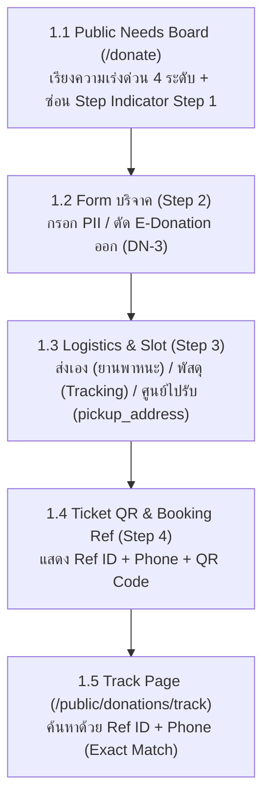
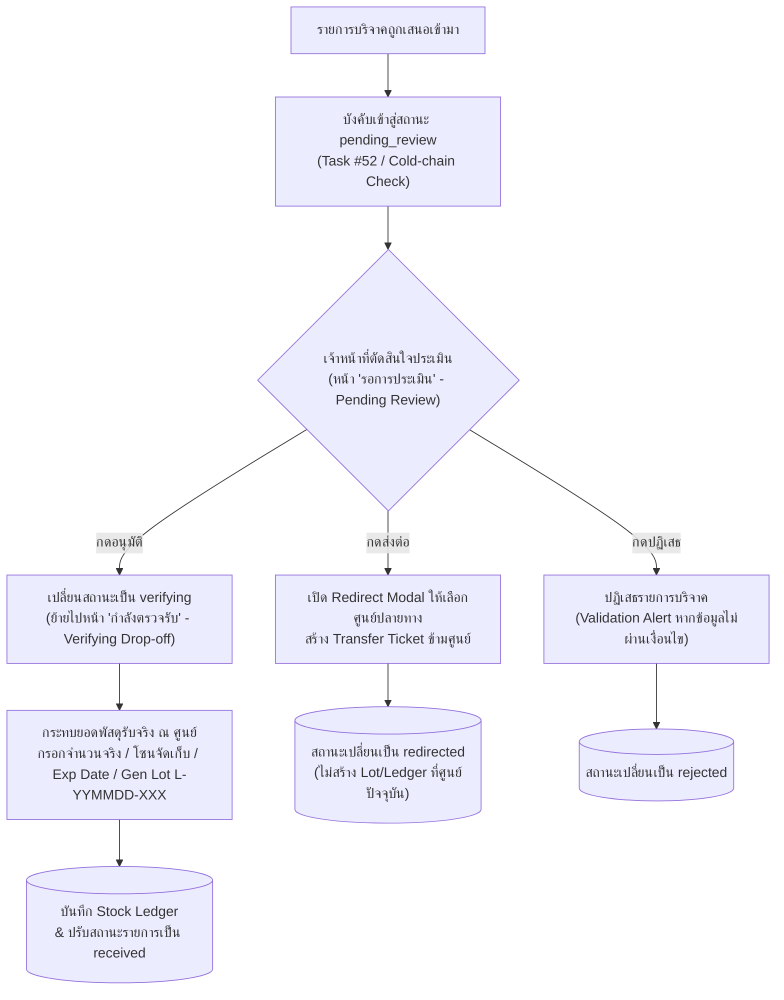
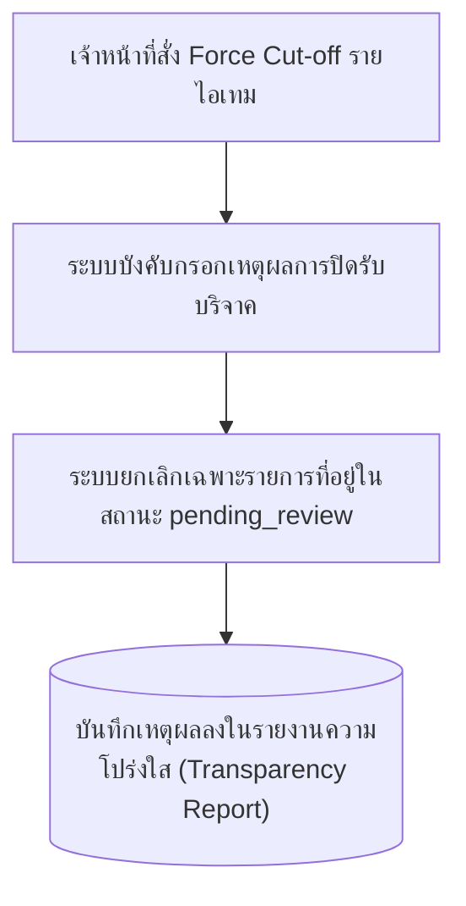

# CR-052 — ปรับปรุงข้อกำหนดระบบรับบริจาค (Donation System) ตามบันทึกการแก้ไข Design V8

> สรุป (TL;DR); เอกสารนี้บันทึกข้อกำหนดการปรับปรุง **ระบบรับบริจาค (Donation System)** ทั้งฝั่งหลังบ้าน (Donation Board / Back-office) และฝั่งประชาชน (Public Donor Website) ตามผลการตรวจสอบการใช้งานจริงในบันทึกการแก้ไข Design V8 โดยระบุองค์ประกอบของระบบ ได้แก่ หน้าจอ (Page/Route), ส่วนประกอบ UI (Component), และจุดเชื่อมต่อข้อมูล (Endpoint/API เฉพาะข้อที่มีการสื่อสารกับเครื่องแม่ข่าย) ไว้อย่างชัดเจนในแต่ละข้อข้อกำหนด

---

## Process Flowcharts

### 1. กระบวนการบริจาคและติดตามสถานะฝั่งประชาชน (Public Donor Flow)

### 2. กระบวนการประเมินและตรวจรับพัสดุฝั่งหลังบ้าน (Back-office Verification Flow)

### 3. กระบวนการปิดรับบริจาคด่วนโดยเจ้าหน้าที่ (Manual Force Cut-off Flow)

---

## Why

การทดสอบระบบรับบริจาค SmartShelter ร่วมกับผู้ใช้งานหน้างานพบปัญหาในกระบวนการประเมินและการกระทบยอดพัสดุบริจาค เช่น การเปิดให้กรอกจำนวนรับจริงก่อนพัสดุเดินทางมาถึงศูนย์ การข้ามขั้นตอนประเมินไปออกรหัสตอบรับ (QR Code) อัตโนมัติโดยไม่ได้ตรวจสอบเงื่อนไขความแช่เย็น (Cold-chain) รวมถึงความไม่ชัดเจนในฟอร์มสมัครและหน้าตรวจสอบสถานะของผู้บริจาค เจ้าของโครงการจึงกำหนดข้อกำหนดปรับปรุงระบบรับบริจาคเฉพาะส่วนนี้เพื่อยกระดับความถูกต้องและประสิทธิภาพการดำเนินงาน

---

## Change

### 1. ระบบรับบริจาคหลังบ้าน (Donation Board & Verification Back-office)

- **1.1 ระบบแสดงข้อความแจ้งเตือนเมื่ออนุมัติไม่สำเร็จ:** ระบบต้องแสดงข้อความแจ้งเตือน (Validation Alert) ระบุสาเหตุที่ชัดเจนเมื่อเจ้าหน้าที่กดปุ่มอนุมัติแล้วไม่ผ่านเงื่อนไข เช่น ข้อมูลสินค้ายังจับคู่ไม่ครบ หรือ ข้อมูลยังไม่ผ่านการประเมิน
  > - **หน้าจอ (Page/Route):** `routes/(protected)/back-office/stock-donations/+page.svelte`
  > - **ส่วนประกอบ UI (Component):** `PendingReviewDialog` (`frontend/src/lib/components/pending-review-dialog.svelte`)
  > - **จุดเชื่อมต่อข้อมูล (Endpoint):** `POST /api/back-office/donations/approve` (โครงสร้าง Response กรณีไม่ผ่าน: `{ success: false, error_code: string, message: string }`)

- **1.2 ระบบแยกหน้าจอตรวจสอบรายการบริจาคตามสถานะจริง:** 
  - ระบบต้องจัดสร้างหน้า "รอการประเมิน (Pending Review)" สำหรับการตัดสินใจอนุมัติ ปฏิเสธ หรือประสานงานส่งต่อ โดยระบบต้องไม่อนุญาตให้มีช่องกรอกจำนวนพัสดุรับจริงในหน้านี้
  - ระบบต้องจัดสร้างหน้า "กำลังตรวจรับ (Verifying Drop-off)" สำหรับการกระทบยอดพัสดุจริง ได้แก่ การกรอกจำนวนรับจริง การเลือกโซนจัดเก็บ การกรอกวันหมดอายุ และการสร้างเลขล็อต (Lot Number) พร้อมบันทึก บัญชีคลัง (Stock Ledger)
    > - **หน้าจอ (Page/Route):** `routes/(protected)/back-office/stock-donations/+page.svelte` (แท็บ Pending Review และ แท็บ Verifying Drop-off)
    > - **ส่วนประกอบ UI (Component):** `PendingReviewDialog`, `ReceiveStockForm` (`frontend/src/lib/features/operations/ui/ReceiveStockForm.svelte`)
    > - **จุดเชื่อมต่อข้อมูล (Endpoint):** `GET /api/back-office/donations/pending`, `GET /api/back-office/donations/verifying`

- **1.3 ระบบปรับปรุงพฤติกรรมการส่งต่อบริจาค (Redirect):** ระบบต้องไม่สร้างเลขล็อตหรือบัญชีคลังที่ศูนย์ปัจจุบันเมื่อกดส่งต่อ แต่ระบบต้องเปิดหน้าต่างย่อย (Modal) ให้เจ้าหน้าที่เลือกศูนย์ปลายทางและระบุหมายเหตุ เพื่อสร้างคำร้องโอนย้ายข้ามศูนย์ (Transfer Ticket) พร้อมเปลี่ยนสถานะรายการเป็น "ส่งต่อศูนย์อื่นแล้ว"
  > - **หน้าจอ (Page/Route):** `routes/(protected)/back-office/stock-donations/+page.svelte`
  > - **ส่วนประกอบ UI (Component):** `PendingReviewDialog` (โหมด Redirect Modal)
  > - **จุดเชื่อมต่อข้อมูล (Endpoint):** `POST /api/back-office/tickets`, `PATCH /api/back-office/donations/{id}`

- **1.4 ระบบบังคับประเมินรายการบริจาคทุกรายการ (Task #52):** ระบบต้องนำรายการบริจาคที่เสนอเข้ามาทั้งหมดเข้าสู่ขั้นตอน "รอการประเมิน (Pending Review)" เสมอ โดยระบบต้องยกเลิกกลไกการข้ามขั้นตอนไปออกรหัสตอบรับ (QR Code) อัตโนมัติทุกกรณี
  > - **หน้าจอ (Page/Route):** `routes/public/donations/+page.svelte`
  > - **ส่วนประกอบ UI (Component):** `DonationStore` (`frontend/src/routes/public/donations/donation.svelte.ts`)
  > - **จุดเชื่อมต่อข้อมูล (Endpoint):** `POST /api/public/v1/donations`

- **1.5 ระบบเพิ่มช่องทางค้นหารายการบริจาคทดแทนรหัสตอบรับ:** ระบบต้องเพิ่มช่องเลือกรายการ (Search-select Dropdown) ในหน้าสถานีสแกน (Scan Station) เพื่อรองรับกรณีรหัสตอบรับ (QR Code) ชำรุดหรือสูญหาย
  > - **หน้าจอ (Page/Route):** `routes/(protected)/back-office/stock-donations/+page.svelte`
  > - **ส่วนประกอบ UI (Component):** `ScanStation` (`frontend/src/routes/(protected)/back-office/stock-donations/components/scan-station.svelte`)
  > - **จุดเชื่อมต่อข้อมูล (Endpoint):** `GET /api/back-office/donations/search` (จำกัดผลลัพธ์สูงสุด limit=50 รายการ และรองรับการค้นหาแบบ partial match ด้วย Ref ID / ชื่อ / เบอร์โทรศัพท์)

- **1.6 ระบบบังคับกรอกเหตุผลการปิดรับบริจาคด่วน (Force Cut-off):** ระบบต้องบังคับเจ้าหน้าที่กรอกเหตุผลเมื่อสั่งปิดรับบริจาคด่วน และระบบต้องยกเลิกเฉพาะคำขอที่อยู่ในสถานะ "รอการประเมิน" เท่านั้น โดยระบบต้องบันทึกเหตุผลลงในรายงานความโปร่งใส
  > - **หน้าจอ (Page/Route):** `routes/(protected)/back-office/stock-donations/+page.svelte`
  > - **ส่วนประกอบ UI (Component):** `ForceCutoffModal`
  > - **จุดเชื่อมต่อข้อมูล (Endpoint):** `POST /api/back-office/campaigns/{id}/cut-off`

- **1.7 ระบบตรวจสอบเงื่อนไขสินค้าแช่เย็น (Cold-chain):** ระบบ Item Master ต้องจัดเก็บตัวบ่งชี้สินค้าแช่เย็น เพื่อให้ระบบบังคับรายการสินค้าแช่เย็นเข้าสู่ขั้นตอนรอการประเมินเสมอ
  > - **หน้าจอ (Page/Route):** `routes/(protected)/back-office/master-data/+page.svelte`
  > - **ส่วนประกอบ UI (Component):** `ItemMasterForm` (`frontend/src/lib/features/catalog/domain/catalog.ts`)
  > - **จุดเชื่อมต่อข้อมูล (Endpoint):** `POST /api/public/v1/donations`, `GET /api/back-office/catalog/items`

- **1.8 ระบบแสดงรายการสินค้าความต้องการแบบไม่ซ้ำซ้อน:** ระบบต้องกรองและแสดงรายการสินค้าความต้องการบริจาคในหน้ารายละเอียดศูนย์พักพิงโดยไม่มีรายการซ้ำ
  > - **หน้าจอ (Page/Route):** `routes/public/shelters/[code]/+page.svelte`
  > - **ส่วนประกอบ UI (Component):** `PublicDonorNeeds` (`frontend/src/lib/components/public-donor-needs.svelte`)
  > - **จุดเชื่อมต่อข้อมูล (Endpoint):** `GET /api/public/v1/needs`

- **1.9 ระบบกำหนดสถานะรับบริจาคจากประกาศที่เปิดอยู่:** ระบบต้องแสดงสถานะเปิดรับบริจาคบนหน้าเว็บประชาชนโดยอ้างอิงจากประกาศที่เปิดอยู่จริง ไม่ให้อ้างอิงจากสถานะสต็อกในคลังโดยอัตโนมัติ
  > - **หน้าจอ (Page/Route):** `routes/public/donations/+page.svelte`
  > - **ส่วนประกอบ UI (Component):** `computeNeeds()` (`frontend/src/lib/features/donations/domain/compute-needs.ts`), `PublicDonorNeeds`

- **1.10 ระบบแสดงป้ายศูนย์ผู้สร้างประกาศจริง:** ระบบต้องแสดงป้ายชื่อศูนย์อ้างอิงตามศูนย์ผู้สร้างประกาศจริง โดยระบบต้องไม่ติดป้าย EOC บนคำสั่งที่ไม่ใช่คำสั่งข้ามศูนย์จริง
  > - **หน้าจอ (Page/Route):** `routes/public/donations/+page.svelte`
  > - **ส่วนประกอบ UI (Component):** `PublicDonorNeeds`

- **1.11 ระบบเพิ่มตัวเลือกเปิดหรือปิดการรับบริจาคระดับศูนย์:** ระบบต้องจัดทำสวิตช์เปิดปิด (Toggle) เพื่อให้เจ้าหน้าที่ควบคุมการแสดงผลข้อมูลของศูนย์บนบอร์ดความต้องการสาธารณะ (Public Needs Board) โดยบันทึกฟิลด์ `shelter.feature_flags.public_donations_enabled: bool` (default `true`) ลงในเอกสาร `shelter` (`schema.md §3.1`)
  > - **หน้าจอ (Page/Route):** `routes/(protected)/back-office/shelters/[code]/+page.svelte`
  > - **ส่วนประกอบ UI (Component):** `ShelterConfigForm`
  > - **จุดเชื่อมต่อข้อมูล (Endpoint):** `PATCH /api/back-office/shelters/{code}`

---

### 2. ระบบเว็บสาธารณะสำหรับประชาชน (Public Donor Website)

- **2.1 ระบบจัดเรียงบอร์ดความต้องการตามระดับความเร่งด่วน:** ระบบต้องจัดเรียงการ์ดความต้องการเรียงลำดับจาก วิกฤต -> สำคัญ -> ปกติ -> ไม่มีควาต้องการ และระบบต้องแสดงตัวระบุขั้นตอน (Step Indicator) ตั้งแต่ขั้นตอนที่ 2 (ฟอร์มบริจาค) เป็นต้นไป
  > - **หน้าจอ (Page/Route):** `routes/public/donations/+page.svelte`
  > - **ส่วนประกอบ UI (Component):** `PublicDonorNeeds`, `PublicStepper`

- **2.2 ระบบจัดทำหน้ารายละเอียดความต้องการของศูนย์พักพิง:** ระบบต้องจัดสร้างหน้าจอใหม่เพื่อแสดงรายการความต้องการบริจาคทั้งหมดของศูนย์พักพิงที่ผู้ใช้เลือก
  > - **หน้าจอ (Page/Route):** `routes/public/shelters/[code]/needs/+page.svelte` (หรือ `/public/donations?shelter={code}`)
  > - **ส่วนประกอบ UI (Component):** `ShelterNeedsDetail`
  > - **จุดเชื่อมต่อข้อมูล (Endpoint):** `GET /api/public/v1/needs?shelter={code}`

- **2.3 ระบบกำหนดมาตรฐานระดับความเร่งด่วน:** ระบบต้องใช้คำระบุระดับความเร่งด่วนมาตรฐานเดียวกัน ได้แก่ "วิกฤต (Critical)", "สำคัญ (High)", และ "ปกติ (Normal)" ในทุกหน้าจอ ป้ายกำกับ (Badge) และตัวกรองข้อมูล (โดยขยายตัวกรองข้อมูลฝั่งประชาชนเป็น 4 ปุ่ม: ทั้งหมด / วิกฤต / สำคัญ / ปกติ)
  > - **หน้าจอ (Page/Route):** `routes/public/donations/+page.svelte`, `routes/(protected)/back-office/stock-donations/+page.svelte`
  > - **ส่วนประกอบ UI (Component):** `UrgencyBadge` (`frontend/src/lib/components/public-donor-needs.svelte`)

- **2.4 ระบบตัดฟังก์ชันขอใบเสร็จลดหย่อนภาษี:** ระบบต้องตัดฟังก์ชั่นการขอใบเสร็จหรือใบอนุโมทนาบัตรเพื่อลดหย่อนภาษี (E-Donation) ออกจากระบบบริจาคทั้งหมด
  > - **หน้าจอ (Page/Route):** `routes/public/donations/+page.svelte`
  > - **ส่วนประกอบ UI (Component):** `FormDonor` (`frontend/src/lib/components/form/form-donor.svelte`)
  > - **จุดเชื่อมต่อข้อมูล (Endpoint):** `POST /api/public/v1/donations`

- **2.5 ระบบปรับเปลี่ยนฟิลด์ข้อมูลตามเงื่อนไขการจัดส่ง (Step 3 Logistics):** 
  - ระบบต้องแสดงช่องกรอกประเภทยานพาหนะ เมื่อผู้บริจาคเลือกวิธี "นำมาส่งเอง"
  - ระบบต้องแสดงช่องกรอกหมายเลขติดตามพัสดุ (Tracking Number) เมื่อผู้บริจาคเลือกวิธี "ส่งพัสดุ"
  - ระบบต้องแสดงช่องกรอกที่อยู่และจุดนัดรับ เมื่อผู้บริจาคเลือกวิธี "ให้รถศูนย์ไปรับ" (`pickup_address`)
  - ระบบต้องล็อกช่องเลือกศูนย์รับบริจาคให้เป็นข้อมูลแบบอ่านได้อย่างเดียว (Read-only)
    > - **หน้าจอ (Page/Route):** `routes/public/donations/+page.svelte`
    > - **ส่วนประกอบ UI (Component):** `DonorTimeSelectionForm` (`frontend/src/lib/components/form/donor-time-selection-form.svelte`)
    > - **จุดเชื่อมต่อข้อมูล (Endpoint):** `POST /api/public/v1/donations`

- **2.6 ระบบติดตามสถานะการบริจาคโดยไม่ต้องเข้าสู่ระบบ:**
  - ระบบต้องจัดสร้างหน้าตรวจสอบสถานะบริจาค โดยให้ค้นหาด้วยหมายเลขอ้างอิง (Ref ID) คู่กับ หมายเลขโทรศัพท์ (Exact Match)
  - ระบบต้องรวมเมนู "บริจาค" และ "ตรวจสอบสถานะ" เป็นเมนูหลักเดียวพร้อมรายการย่อย (Dropdown)
  - ระบบต้องแสดงหมายเลขอ้างอิง หมายเลขโทรศัพท์ ปุ่มคัดลอก และปุ่มลัดไปหน้าตรวจสอบสถานะในหน้ารายละเอียดตั๋วบริจาค (Step 4)
  - ระบบต้องส่งค่าหมายเลขอ้างอิงและหมายเลขโทรศัพท์ไปเติมในหน้าตรวจสอบสถานะโดยอัตโนมัติ และระบบต้องแสดงรหัสตอบรับ (QR Code) พร้อมปุ่มดาวน์โหลดเมื่อรายการได้รับการอนุมัติ
    > - **หน้าจอ (Page/Route):** `routes/public/donations/track/+page.svelte`, `routes/public/donations/track/[token]/+page.svelte`
    > - **ส่วนประกอบ UI (Component):** `PublicNavbar` (`frontend/src/lib/components/public-navbar.svelte`), `PublicDonorSuccessTicket` (`frontend/src/lib/components/public-donor-success-ticket.svelte`), `TrackDonationForm`
    > - **จุดเชื่อมต่อข้อมูล (Endpoint):** `POST /api/public/v1/donations/track-search`, `GET /api/public/v1/donations/{tracking_token}`, `PATCH /api/public/v1/donations/{tracking_token}`

---

## Impact

- **เอกสาร:** `docs/data/schema.md` §2.3, §2.4, §2.13, §3.1, `docs/features/public-tier-donation-spec.html`
- **ระบบหลังบ้าน (Back-office):** `frontend/src/routes/(protected)/back-office/stock-donations/`, `frontend/src/lib/features/donations/`
- **ระบบเว็บสาธารณะ (Public Website):** `frontend/src/routes/public/donations/`
- **สคีมาข้อมูล (Data Schema):**
  - เพิ่มฟิลด์ `feature_flags.public_donations_enabled: bool` (default `true`) ในเอกสาร `shelter` (`schema.md §3.1`)
  - เพิ่มฟิลด์ `pickup_address` ในโครงสร้าง `logistics` ของเอกสาร `donation` (`schema_v 2`)
  - เพิ่มฟิลด์ `needs[].status` ('open'|'closed') และ `visible_on_home` ใน `donation_campaign` (`schema_v 2`)
  - ปรับเปลี่ยนรูปแบบปริมาณสิ่งของเป็น string decimal (`qty_str`) ตาม CR-038 (`schema_v 3`)

---

## Migration

1. **การเข้ากันได้แบบย้อนหลัง (Backward Compatibility):** ฟิลด์ข้อมูลใหม่ทั้งหมด (`public_donations_enabled`, `pickup_address`, `needs[].status`, `visible_on_home`) เป็นฟิลด์ทางเลือก (Optional) หากเอกสารเดิมในระบบไม่มีฟิลด์ดังกล่าว ให้ระบบกำหนดค่าเริ่มต้นเป็น `true` / `'open'` โดยไม่จำเป็นต้องทำสคริปต์แปลงข้อมูลย้อนหลัง
2. **การปรับปรุงสิทธิ์ฐานข้อมูลศูนย์พักพิง:** ทีมพัฒนาต้องปรับปรุงเอกสารการเข้าถึง (`_design/access`) บนฐานข้อมูลศูนย์พักพิงเพื่อปลดล็อกสิทธิ์การอัปเดตฟิลด์สถานะใหม่

---

## Technical Terms & Footnotes

1. **Validation Alert:** ข้อความแจ้งเตือนความถูกต้องของข้อมูลที่แสดงบนหน้าจอเมื่อผู้ใช้กรอกข้อมูลไม่ครบถ้วนตามเงื่อนไข
2. **Pending Review:** สถานะรายการที่อยู่ระหว่างรอเจ้าหน้าที่ประเมินและตัดสินใจอนุมัติหรือปฏิเสธ
3. **Verifying Drop-off:** สถานะรายการที่อยู่ระหว่างการตรวจรับพัสดุจริง ณ ศูนย์พักพิง
4. **Lot Number / เลขล็อต:** รหัสหมายเลขประจำกลุ่มสินค้าที่รับเข้ามาในคลังในรอบเดียวกัน (รูปแบบ `L-YYMMDD-XXX`)
5. **Stock Ledger / บัญชีคลัง:** บันทึกประวัติการเคลื่อนไหวของพัสดุเข้าและออกจากคลังสินค้าแบบแก้ไขย้อนหลังไม่ได้
6. **Modal:** หน้าต่างย่อยที่ซ้อนขึ้นมาบนหน้าจอหลักเพื่อแสดงข้อมูลหรือรับการกรอกข้อมูลจากผู้ใช้
7. **Transfer Ticket:** เอกสารคำร้องอิเล็กทรอนิกส์ที่ใช้กำกับการโอนย้ายพัสดุระหว่างศูนย์พักพิง
8. **QR Code / รหัสตอบรับ:** รหัสแท่งสองมิติที่ใช้สแกนผ่านกล้องเพื่ออ้างอิงข้อมูลตั๋วบริจาคหรือรหัสประจำตัว
9. **Search-select Dropdown:** รายการตัวเลือกแบบดรอปดาวน์ที่มีช่องพิมพ์ค้นหาข้อความภายในตัวเลือก
10. **Force Cut-off:** การสั่งปิดรับบริจาครายการสินค้าเฉพาะอย่างแบบเร่งด่วนโดยเจ้าหน้าที่ แม้จำนวนที่ได้รับยังไม่ครบตามเป้าหมาย
11. **Cold-chain:** ระบบการจัดเก็บและขนส่งสินค้าที่ต้องควบคุมอุณหภูมิความเย็น เช่น เนื้อสัตว์สด หรือ ยารักษาโรค
12. **EOC (Emergency Operations Center):** ศูนย์บัญชาการเหตุการณ์ฉุกเฉินซึ่งทำหน้าที่สั่งการระดับเมืองหรือระดับจังหวัด
13. **Public Needs Board:** หน้าเว็บสาธารณะที่แสดงรายการความต้องการสิ่งของบริจาคของศูนย์พักพิงต่าง ๆ
14. **Toggle:** ปุ่มสวิตช์สลับสถานะการเปิดหรือปิดการทำงานของฟีเจอร์
15. **Step Indicator:** แถบแสดงลำดับขั้นตอนการกรอกข้อมูลในฟอร์มหลายขั้นตอน
16. **Read-only:** ข้อมูลที่แสดงผลบนหน้าจอให้ผู้ใช้อ่านได้อย่างเดียว โดยไม่อนุญาตให้แก้ไขข้อความ
17. **Ref ID / Reference ID:** หมายเลขอ้างอิงประจำรายการบริจาคที่ระบบสร้างขึ้นให้อย่างไม่ซ้ำกัน
18. **Exact Match:** การค้นหาข้อมูลที่ข้อความต้องตรงกันทุกตัวอักษรโดยไม่มีข้อผิดพลาด
19. **Dropdown:** รายการตัวเลือกแบบดึงลงเมื่อผู้ใช้กดหรือนำเมาส์ไปชี้
