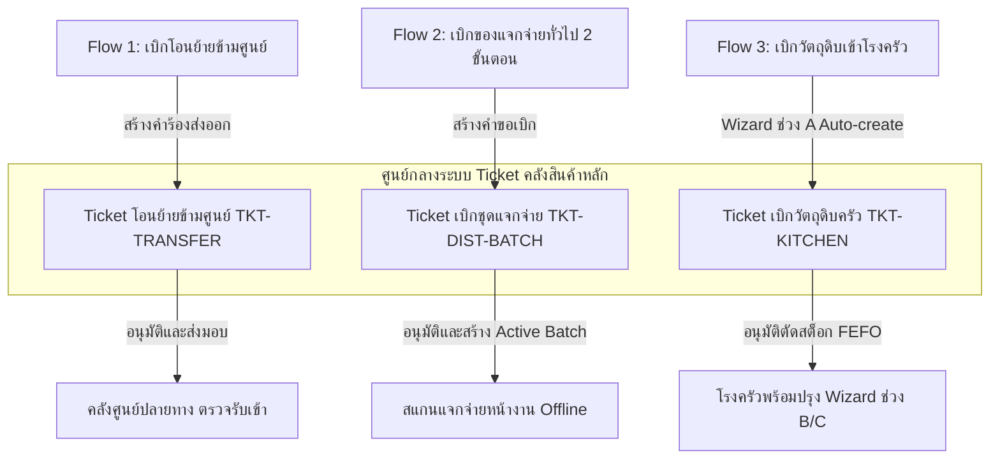

# CR-059 — Requisitions, Inter-Shelter Transfers & NFI Distribution Control

> **สรุป (TL;DR):** ปรับปรุงระบบคำร้องเบิกจ่าย การโอนย้ายสินค้าข้ามศูนย์ โมเดลการแจกจ่ายสิ่งของ NFI แบบ 2 ขั้นตอน (Active Batch) และมาตรการความปลอดภัย UI · บังคับกรอกชื่อคนขับและทะเบียนรถก่อนอนุมัติส่งมอบ และบังคับสร้าง Destination Lot ID ใหม่ปลายทาง · กระทบ `stock_ledger`, `stock_transfer`, UI Ticket Flow และสิทธิ์การเข้าถึงข้อมูลข้ามศูนย์.

---

## Why (เหตุผลและที่มา)
1. **ปัญหาการโอนย้ายเดิม:** การโอนย้ายข้ามศูนย์ไม่มีการบังคับกรอกข้อมูลยานพาหนะ/ผู้ขับขี่ และปลายทางยึดเลขล็อตต้นทาง ทำให้ประวัติและสิทธิ์สอบย้อนสินค้าของแต่ละศูนย์ปะปนกัน
2. **ปัญหาการแจกจ่ายหน้างานเดิม:** การสแกนแจกของตัดสต็อกตรงจากคลังหลักทันที หากอินเทอร์เน็ตหน้างานหลุด เจ้าหน้าที่จะไม่สามารถแจกสิ่งของให้ผู้พักพิงได้
3. **ปัญหาความปลอดภัยของ UI:** ตารางแสดงตาราง Ticket บางครั้งมีข้อมูลศูนย์อื่นรั่วไหลมาให้เห็น (Cross-shelter Leak) และการลบแถวรายการไม่มีปุ่มกู้คืน

---

## 📌 บทนำและการทำงานของระบบ Ticket (System Overview)

**ระบบ Ticket (ตั๋วคำร้องเบิกจ่ายและโอนย้าย)** คือศูนย์กลางในการควบคุมความโปร่งใสและตัดสต็อกคลังสินค้าหลักของระบบ SmartShelter ทุกรายการเบิกจ่าย เคลื่อนย้าย หรือจัดชุดแจกจ่าย **จะต้องวิ่งผ่านหน้า Ticket เพื่อให้เจ้าหน้าที่คลังตรวจสอบ อนุมัติ และเลือก Lot ตัดสต็อกจริงเสมอ (Single Source of Truth)**

โดยรายการปฏิบัติงานทั้งหมดที่วิ่งผ่านหน้า Ticket และระบบเบิกจ่ายในโมดูลนี้ แบ่งออกเป็น **3 Flow หลัก** ดังนี้:

---

## 🔄 รายละเอียดการทำงาน 3 Flow หลักผ่านระบบ Ticket

### 1. Flow ที่ 1: การโอนย้ายสินค้าข้ามศูนย์ (Inter-Shelter Ticket Transfer Flow)
*เปรียบเทียบสเปกใหม่ใน SmartShelter_สเปคระบบคลังสินค้า.md (หัวข้อ 4) เทียบกับสเปคเดิมใน docs/*

* **วัตถุประสงค์:** โอนย้ายเสบียงและสิ่งของระหว่างศูนย์พักพิง
* **การดำเนินการฝั่งเบิกออก (ศูนย์ต้นทาง):**
  * **[เปลี่ยน] การเลือก Lot สต็อกจริง:** การเลือกสินค้าต้องดึงจาก Lot ที่มีอยู่จริงในคลัง (ไม่ใช่พิมพ์ตัวเลข/ชื่อเอง) โดยระบบจะแสดงโซนจัดเก็บและวันหมดอายุแบบ Read-only อัตโนมัติ *(ข้อ 4.1 / Task #13)*
  * **[เพิ่ม] การจัดสรรเบิกข้ามล็อต (Split Allocation):** เพิ่มปุ่ม **"+ แบ่งจากอีกล็อต/โซน"** กรณีของในล็อตเดียวไม่พอ เพื่อดึงสินค้าจากหลายล็อตมาผสมให้ครบตามจำนวน *(ข้อ 4.1 / Task #13)*
  * **[เปลี่ยน] เงื่อนไขการอนุมัติส่งมอบ:** ปุ่ม "อนุมัติจ่ายและนำสิ่งของออกส่ง" บังคับกรอก **"ชื่อผู้ขับขี่"** และ **"ทะเบียนรถขนส่ง"** ก่อนส่งมอบเสมอ *(ข้อ 4.1 / Task #13)*
  * **[เปลี่ยน] การตัดสต็อกต้นทาง:** เมื่อกดอนุมัติ ระบบจะตัดสต็อกออกจาก Lot ต้นทางจริงทันที (บันทึก Ledger ขาออก) *(ข้อ 4.1 / Task #13)*
* **การดำเนินการฝั่งรับเข้า (ศูนย์ปลายทาง):**
  * **[เปลี่ยน] การจัดทำล็อตปลายทาง (Destination Lot ID):** เมื่อปลายทางตรวจรับเสร็จสิ้น ระบบจะบังคับให้สร้าง Lot ID ใหม่ด้วยรหัสศูนย์ปลายทางเองเสมอ (ห้ามใช้เลขล็อตต้นทาง) *(ข้อ 4.2 / Task #13)*
  * **[เปลี่ยน] การสืบย้อนกลับ (Traceability):** ระบบเก็บเลขล็อตต้นทางไว้ในฟิลด์ **"อ้างอิง Lot ต้นทาง"** แบบ Read-only เพื่อรักษาสิทธิ์การสืบย้อนประวัติสินค้า *(ข้อ 4.2 / Task #13)*
  * **[เปลี่ยน] การตรวจสอบวันหมดอายุจริง:** ดึงวันหมดอายุจากต้นทางมาให้อัตโนมัติ แต่ยังคงเปิดให้แก้ไขได้ตอนตรวจรับจริง กรณีวันหมดอายุของจริงไม่ตรงป้าย *(ข้อ 4.2 / Task #13)*
* **สิทธิ์และการซิงค์สถานะ:**
  * **[เพิ่ม] สิทธิ์คัดค้าน/ระงับคำสั่ง:** ฝั่งต้นทางมีปุ่ม **"คัดค้าน/ระงับคำสั่งปฏิบัติการ"** เพื่อปฏิเสธหรือระงับการโอนย้ายได้ หากสต็อกไม่พร้อมส่งมอบ *(ข้อ 4.3 / Task #13)*
  * **[เปลี่ยน] Real-time Sync:** หลังปลายทางยืนยันรับเข้าคลังสำเร็จ สถานะฝั่งต้นทางจะเปลี่ยนเป็น **"ส่งมอบสำเร็จ"** อัตโนมัติพร้อมบันทึกประวัติการดำเนินการ *(ข้อ 4.4 / Task #13)*

---

### 🏗️ การตัดสินใจทางสถาปัตยกรรม — Cross-DB Write Pattern สำหรับ Flow 1 (T-13)

> **Approved by project owner — 2026-08-22.** ยืนยันแนวทาง: ให้ `stock_transfer` ใช้ pattern เดียวกับ
> `referral` ประเภท `capacity` (การส่งต่อ/ย้ายผู้ประสบภัยข้ามศูนย์ — CR-045, CR-046) ซึ่งเป็นโค้ดที่ merge
> เข้า `develop` แล้วและผ่าน review รอบหนึ่ง

**สาเหตุ:** สถาปัตยกรรมปัจจุบันคือ **1 ศูนย์ = 1 CouchDB database** (`shelter_{shelter_code}`)
session ของเจ้าหน้าที่ศูนย์หนึ่งเขียนข้าม DB ของอีกศูนย์ไม่ได้ (`_security.roles` จำกัดสิทธิ์) ขณะที่
`stock_transfer` เดิม (`schema.md` §2.2) ถูกออกแบบให้อยู่ใน `shelter_{shelter_code}` — ทำให้ requirement
ข้อ "Real-time Sync: หลังปลายทางยืนยันรับเข้าคลังสำเร็จ สถานะฝั่งต้นทางเปลี่ยนเป็น 'ส่งมอบสำเร็จ'
อัตโนมัติ" (ข้อ 4.4 ด้านบน) ทำไม่ได้จริงด้วย session ปกติ — เป็นสาเหตุที่ branch เดิม (`team-C-T-13`,
ดู DoD ใน Notion) ค้างสถานะ "Pause" อยู่ที่ 3/6 ข้อ (ไม่ผ่าน: กันของหาย/double-count, audit trail
ครบสองฝั่ง)

**แนวทางที่อนุมัติ — ย้าย `stock_transfer` ไปอยู่ `central_ops`:**
1. **ย้าย doc type** `stock_transfer` ออกจาก `schema.md` §2.2 (`shelter_{shelter_code}`) ไปเป็นหัวข้อ
   ใหม่ใน `schema.md` §5 (`central_ops`) — mark §2.2 เดิมเป็น superseded ชี้มาที่หัวข้อใหม่ (ตาม
   `docs/change-management.md` §4 "อย่าลบ mark superseded")
2. **Write path ผ่าน server route เท่านั้น** (`src/routes/api/back-office/transfer/**`) ใช้ `adminRaw`
   (`$lib/server/couch-admin.ts`) เหมือน `referral.server-repository.ts` — client (`operations.remote.ts`)
   เลิกเขียน `stock_transfer` ตรงผ่าน `/couch` proxy แบบที่ branch เดิมทำ เปลี่ยนเป็น `fetch()` เข้า route
   ใหม่แทน (`stock_ledger`/`stock_transfer`'s own ledger entries ยังคงเขียนที่ `shelter_{code}` ของแต่ละ
   ฝั่งตามปกติ — ย้ายเฉพาะตัว `stock_transfer` doc)
3. **Mirror-write เพื่อ live-query** — คัดลอก pattern จาก `referral.remote.ts` (`sent` → mirror เข้า
   `shelter_{to}`) มาใช้กับ `dispatched` → mirror เข้า `shelter_{to_shelter}`
   - **ส่วนต่อขยายเกินจาก referral เดิม:** referral mirror ทางเดียว (ต้นทาง→ปลายทาง ตอน `sent` เท่านั้น
     ฝั่งต้นทางไม่ได้รับ push กลับตอนปลายทาง accept/reject — อาศัย refetch/invalidate เอา) แต่ CR-059
     ข้อ 4.4 ต้องการ sync **ย้อนกลับ** ไปต้นทางตอนปลายทางยืนยันรับด้วย จึงต้องเพิ่ม mirror-write อีกทาง
     ตอน `received` → เขียนกลับเข้า `shelter_{from_shelter}` ด้วย (ของใหม่ ไม่ใช่ copy ตรงจาก referral)
   - เพิ่ม `stock_transfer` เข้า type-map ของ `startOperationsLiveQuery` (`application/queries.ts`)
     เพื่อให้ `_changes` feed ของแต่ละศูนย์ที่ subscribe อยู่แล้วรับสำเนานี้ต่อ
4. **หมายเหตุความคลาดเคลื่อนของเอกสารเดิม:** `schema.md` §5.4 เขียนไว้ว่า referral "ไม่ต้อง Mirror
   เอกสารระหว่างฐานข้อมูล" แต่โค้ดจริง (`referral.remote.ts`, CR-045 §2) mirror จริงตอน `sent` — ไม่ได้
   แก้ไขจุดนี้ตอนนี้ (นอก scope ของ CR-059) แต่บันทึกไว้เผื่อสับสนตอนอ้างอิง §5.4 เป็นแบบอย่าง

**ยังไม่ตัดสินใจ (แยกจาก decision นี้):** รูปแบบฟิลด์เต็มของ `stock_transfer` หลัง CR-059 (lot-based
split allocation, driver/plate บังคับ, destination lot ID, สถานะคัดค้าน/ระงับ) — decision นี้ครอบคลุม
แค่ที่เก็บข้อมูล + cross-DB write path เท่านั้น ฟิลด์เพิ่มเติมต้องตกลง schema_v ใหม่แยกอีกรอบ

---

### 2. Flow ที่ 2: การเบิกแจกจ่ายสิ่งของทั่วไป 2 ขั้นตอน (2-Step Item Distribution Flow)
*เปรียบเทียบสเปกใหม่ใน SmartShelter_สเปคระบบคลังสินค้า.md (หัวข้อ 5) เทียบกับสเปคเดิมใน docs/*

* **วัตถุประสงค์:** เบิกสิ่งของทั่วไป (มุ้ง, เต็นท์, ผ้าห่ม, สบู่) ไปแจกผู้พักพิงหน้างานโดยรองรับการทำงานแบบ Offline
* **ขั้นตอนการทำงาน:**
  * **ขั้นที่ 1 — เบิกออกคลังหลัก (Active Batch):** หน้างานสร้างคำขอเบิก ➔ คำขอวิ่งไปหน้า Ticket สถานะ "รอคลังอนุมัติ" ➔ ฝั่งคลังอนุมัติตรวจสอบเพื่อเลือก Lot ตัดสต็อกคลังหลัก สร้างเป็น **"ชุดแจกจ่าย (Active Batch)"** *(ข้อ 5.1 / Task #12, #51, #56)*
  * **ขั้นที่ 2 — แจกจ่ายหน้างาน (On-site Distribution):** แท็บเล็ตหน้างานเลือกชุดแจกจ่าย แล้วสแกนแจกจ่ายผู้พักพิงโดยหักยอดจาก Active Batch (ไม่แตะคลังหลักอีก, รองรับการทำงาน **Offline**) *(ข้อ 5.2 / Task #12, #55)*
  * **[เปลี่ยน] UI ค้นหารายชื่อผู้รับ:** เปลี่ยนปุ่มกล้องสแกนตกแต่งเดิม เป็น **"ปุ่มกดเปิด Modal"** มีช่อง Search-select เลือกรายชื่อผู้พักพิงเพื่อตรวจโควต้าก่อนยืนยันแจก *(ข้อ 5.2 / Task #58)*
* **การกระทบยอดและการนำข้อมูล NFI ใน Item Master มาใช้หน้างาน:**
  * **[เพิ่ม] การคืนสต็อกส่วนต่างอัตโนมัติ (Reconciliation Return Qty):** *(ข้อ 5.3 / Task #12)*
    $$\text{Returned Stock Qty} = \text{Active Batch Qty} - (\text{Distributed Qty} + \text{Damaged/Lost Qty})$$
    * **📌 สูตรนี้ใช้ทำอะไร:** คำนวณหาจำนวนสิ่งของคงเหลือจริงเมื่อปิดรอบแจกจ่าย เพื่อทำเรื่องคืนสิ่งของกลับเข้าสต็อกคลังหลักให้อัตโนมัติ
    * **🖥️ คำนวณที่หน้าจอไหน:** หน้า **สรุปปิดรอบการแจกจ่าย (Reconciliation Summary Panel)**
    * **💡 ตัวอย่างการคำนวณจริง:** เบิกมุ้งมา 30 ผืน (Active Batch = 30), สแกนแจกจริง 25 ผืน, มีมุ้งชำรุด 2 ผืน $\rightarrow$ ระบบจะคำนวณมุ้งคืนคลังหลัก = $30 - (25 + 2) = 3 \text{ ผืน}$
  * **[นำมาใช้] การคุมแจกซ้ำสิ่งของ NFI (One-time Control):** ดึงฟิลด์ `distribution_type` จาก Item Master มาใช้งาน หากเป็นสินค้า **`One-time` (มุ้ง เต็นท์ ผ้าห่ม)** แล้วผู้รับเคยได้รับไปแล้ว ระบบจะเตือนและบังคับระบุเหตุผล (ของหาย/ชำรุด) ก่อนอนุญาตให้แจกซ้ำ *(ข้อ 5.3.1 / Task #21)*
  * **[นำมาใช้] การคำนวณเป้าหมายเบิก NFI (NFI Target Qty with Buffer):** *(ข้อ 5.3.1 / Task #21)*
    $$\text{NFI Target Qty} = \text{Active Headcount} \times \left( 1 + \frac{\text{NFI Buffer \%}}{100} \right)$$
    * **📌 สูตรนี้ใช้ทำอะไร:** คำนวณจำนวนสิ่งของแจกครั้งเดียว (เช่น มุ้ง) ที่ต้องเบิกออกคลังหลัก โดยบวกสำรองเผื่อเสียหายหรือมีคนมาใหม่ (5-10%)
    * **🖥️ คำนวณที่หน้าจอไหน:** หน้า **สร้างคำขอเบิกสิ่งของทั่วไป (Create Distribution Request)**
    * **💡 ตัวอย่างการคำนวณจริง:** มีผู้พักพิง 100 คน, ตั้งค่า NFI Buffer % = 10% $\rightarrow$ ระบบจะคำนวณยอดเบิกมุ้งรวม = $100 \times (1 + \frac{10}{100}) = 110 \text{ ผืน}$ (เผื่อสำรอง 10 ผืน)

---

### 3. Flow ที่ 3: การเบิกวัตถุดิบเข้าครัวกลาง (Kitchen Requisition Flow)
*เปรียบเทียบสเปกใหม่ใน SmartShelter_สเปคระบบคลังสินค้า.md (หัวข้อ 5.5 / 5.5.1) เทียบกับสเปคเดิมใน docs/*

* **วัตถุประสงค์:** เบิกวัตถุดิบเสบียงและแก๊สหุงต้มส่งให้โรงครัวประกอบอาหารตามแผนเมนู
* **ขั้นตอนการทำงาน:**
  * **ช่วง A — วางแผนเมนู (หน้างานครัว):** เลือกสูตร (BOM) ➔ ระบบคำนวณวัตถุดิบและแก๊สหุงต้มอัตโนมัติตามยอด headcount ➔ กดปุ่ม **"สร้างใบเบิกวัตถุดิบ"** ระบบจะ **Auto-create Ticket เบิกวัตถุดิบครัว (`TKT-KITCHEN-XXXX`)** ส่งตรงไปหน้า Ticket คลังหลักทันที *(ข้อ 5.5.1 / Task #42)*
  * **ช่วง B — รอคลังอนุมัติ (ฝั่งคลังสินค้า):** เจ้าหน้าที่คลังเปิด Ticket เบิกครัว ตรวจสอบและเลือก Lot วัตถุดิบจริงตาม FEFO แล้วกดอนุมัติตัดสต็อก ➔ สถานะฝั่งครัวจะเปลี่ยนเป็น **"วัตถุดิบพร้อม"** ให้ครัวดำเนินงานต่อ *(ข้อ 5.5.1 / Task #42, #50)*
  * **ช่วง C — รายงานผลจริง (หน้างานครัว):** เมื่อรับวัตถุดิบแล้ว ครัวปรุงอาหารและกรอก **Actual Yield (จำนวนเสิร์ฟที่ทำได้จริง)** เป็นเพดานในการแจกอาหาร โดยไม่ต้องแตะ Ticket อีกเลย *(ข้อ 5.5.1 / Task #48)*

---

## 🛡️ มาตรการความปลอดภัยของ UI (UI Safety Standards)

* **[เพิ่ม] ปุ่ม Undo การลบรายการ:** เพิ่มปุ่ม Undo การลบแถวรายการผ่าน Toast Notification ค้างไว้ 5 วินาที เพื่อป้องกันการกดลบพลาด *(ข้อ 4.5 / Task #13)*
* **[เปลี่ยน] การกั้นสิทธิ์ข้อมูลข้ามศูนย์ (Cross-shelter Isolation):** ตารางรายการ Ticket บังคับกรองเฉพาะศูนย์ใน Context จริงเท่านั้น เพื่อแก้ปัญหารั่วไหลของข้อมูลข้ามศูนย์ *(ข้อ 4.5 / Task #13)*
* **[เพิ่ม] Banner แสดงเส้นทางส่งมอบ:** หน้ารายละเอียด Ticket มี Banner แสดงเส้นทาง **"ต้นทาง → ปลายทาง"** เต็มรูปแบบ พร้อมระบุชัดเจนว่าศูนย์ปัจจุบันทำหน้าที่เป็นฝั่งใดของคำสั่ง *(ข้อ 4.5 / Task #13)*

---

## 📐 ตารางรวมสูตรคำนวณทั้งหมด (Master Formulas Reference Table)

| ลำดับ | ชื่อสูตรคำนวณ (Formula Name) | สูตรคำนวณ (Mathematical Expression) | สูตรนี้ใช้ทำอะไร (Purpose & Context) | หน้าจอที่ใช้คำนวณ | อ้างอิงสเปกใหม่ |
| :---: | :--- | :--- | :--- | :--- | :---: |
| **1** | **NFI Target Qty with Buffer** | $\text{NFI Target Qty} = \text{Active Headcount} \times \left( 1 + \frac{\text{NFI Buffer \%}}{100} \right)$ | คำนวณจำนวนสิ่งของแจกครั้งเดียวที่ต้องเบิก/ขอรับบริจาค โดยบวก Buffer สำรองเผื่อเสียหาย/คนใหม่ (5-10%) | หน้าสร้างคำขอเบิกสิ่งของทั่วไป | ข้อ 5.3.1 (L197) |
| **2** | **Reconciliation Return Qty** | $\text{Returned Stock Qty} = \text{Active Batch Qty} - (\text{Distributed Qty} + \text{Damaged/Lost Qty})$ | คำนวณมุ้ง/เต็นท์คงเหลือเพื่อทำเรื่องคืนกลับเข้าคลังหลักให้อัตโนมัติเมื่อปิดรอบแจกจ่าย | หน้าสรุปปิดรอบการแจกจ่าย | ข้อ 5.3 (L185) |

---

## 🔍 ตารางสรุปการเปลี่ยนแปลงตาม Task baseline

| Task ID เดิม | ชื่อ Task | สถานะในสเปกใหม่ | รายละเอียดการเปลี่ยนแปลง |
| :--- | :--- | :--- | :--- |
| **T-12** | Stock distribute (outbound) | **ปรับโมเดลการทำงาน** | เปลี่ยนเป็นโมเดล 2 ขั้นตอน (สร้าง Active Batch ก่อนแจกจริงหน้างาน) รองรับการทำงานแบบ Offline |
| **T-13** | Inter-shelter transfer | **เพิ่มกฎความปลอดภัยและการสืบย้อน** | • บังคับกรอกชื่อผู้ขับขี่และทะเบียนรถขนส่งก่อนส่งมอบ • รองรับการคัดค้าน/ระงับคำสั่งโอนย้ายสำหรับต้นทาง • ปลายทางสร้าง Lot ID ท้องถิ่นใหม่ พร้อมเก็บบันทึก Read-only Reference Lot ต้นทาง |
| **T-21** | NFI Distribution Control | **เพิ่มระบบคุมแจกซ้ำ** | แยกประเภทการแจกเป็น `One-time` vs `Recurring` บังคับใส่เหตุผลเมื่อแจกมุ้ง/เต็นท์ซ้ำ และเพิ่ม NFI Buffer % 5-10% |
| **T-56** | Purpose linked to Ticket | **ผูกโยงตั๋วอัตโนมัติ** | การเลือกวัตถุประสงค์ "โอนย้ายไปศูนย์อื่น" ในฟอร์มเบิกออก จะทำการหักยอดสต็อกและ Auto-create Ticket โอนย้ายให้อัตโนมัติ |
| **T-58** | Recipient Modal Search | **ปรับปรุง UI หน้างาน** | เปลี่ยนปุ่มสแกนรูปกล้องตกแต่งเป็นปุ่มกดเปิด Modal Search-select เลือกรายชื่อผู้พักพิงเพื่อตรวจ Eligibility |

---

## Impact (ผลกระทบต่อระบบ)
- **Docs:** `docs/data/schema.md` (§4.1, §4.2, §4.3, §4.4, §4.5, §5.1-5.4) — ตัวเลขหัวข้ออ้างอิงจาก
  spec ต้นทาง (SmartShelter_สเปคระบบคลังสินค้า.md) ไม่ตรงกับเลขหัวข้อจริงใน `schema.md` ของ repo นี้
  (`stock_transfer`/`stock_ledger` จริงคือ §2.2/§2.1); **เพิ่มเติมจาก decision 2026-08-22:**
  `docs/data/schema.md` §2.2 (mark superseded) → หัวข้อใหม่ใน §5 (`central_ops`)
- **Code:** `frontend/src/lib/features/transfers/`, `frontend/src/lib/features/inventory/`,
  `frontend/src/lib/features/distribution/` — ไม่ตรงกับโครงสร้าง repo จริง งานตัดสต็อก/ledger/transfer
  ทั้งหมดอยู่ที่ **`frontend/src/lib/features/operations/`** (domain/data/application/ui) เพิ่ม
  server route ใหม่ที่ `frontend/src/routes/api/back-office/transfer/**`
- **[CR-055](CR-055-stock-ledger-refid-invariant.md) — ripple บังคับ (ห้ามลืม):** CR-055 เคาะ Q-1 (ก) ว่า
  `stock_ledger.reason = 'distribute'` ต้องมี `ref_id = null` **เสมอ** โดยให้เหตุผลชัดว่า "จนกว่าจะมี doc
  การแจกจ่ายจริง" · CR นี้คือ CR ที่สร้าง doc นั้น ⇒ **วันที่ CR-059 ลง ต้องกลับไปแก้แถว `distribute` ใน
  ตาราง R2** ทั้งสามที่ให้ตรงกัน:
  1. `REF_PREFIX_BY_REASON` (`features/operations/domain/operations.ts`) — เปลี่ยน `distribute: null`
     เป็น prefix ของ doc ต้นเหตุ
  2. `distributeInputSchema.ref_id` — ปัจจุบันเป็น `z.null()` ตาม R8 ต้องคลายเป็น `z.string()`
  3. `docs/data/schema.md` §2.1 ตาราง `reason` → `ref_id` + บรรทัด Migration
  ถ้าไม่แก้ การเขียน ledger ของ flow แจกจ่ายจะถูก guard ของ CR-055 ปฏิเสธทั้งหมด

---

## Migration (แผนการปรับย้ายข้อมูล)
- N/A — เป็นการปรับปรุง Business Logic และ UI Component กลาง โดยคงโครงสร้าง DB Persistence และ Zod Validation ไว้ตามสกีมาหลัก

---

## Decision Log
- 2026-07-25 — proposed (กำหนดสเปกปรับปรุงระบบคำร้องเบิกจ่าย โอนย้ายข้ามศูนย์ NFI 2 ขั้นตอน และ UI Safety)
- 2026-08-15 — **บันทึก ripple สองทางกับ CR-055** (ปิดงาน CR-055) · CR-055 บังคับ invariant
  `reason` ↔ prefix ของ `ref_id` ที่ชั้น domain แล้ว และเคาะให้ `distribute` เป็น `null` เสมอ **เพราะยังไม่มี
  doc ต้นเหตุ** · CR นี้เป็นตัวสร้าง doc นั้น ⇒ เพิ่มรายการแก้ 3 จุดไว้ใน §Impact เพื่อไม่ให้หลุด ·
  ฝั่ง CR-055 มีบรรทัดชี้กลับมาที่นี่ใน Decision log ของวันเดียวกัน
- 2026-08-22 — **approved (บางส่วน)** by project owner — เฉพาะแนวทาง cross-DB write pattern ของ
  Flow 1 (T-13): ย้าย `stock_transfer` ไป `central_ops` + เขียนผ่าน server route (`adminRaw`) แบบ
  `referral` ประเภท `capacity` (CR-045/CR-046) พร้อม mirror-write สองทาง (dispatch→dest,
  receive→source ย้อนกลับ — ส่วนหลังเป็นของใหม่เกินจาก referral เดิม) รายละเอียดเต็มอยู่ในหัวข้อ
  "🏗️ การตัดสินใจทางสถาปัตยกรรม" ด้านบน — **field ละเอียดของ `stock_transfer` (lot split, driver/plate,
  dispute state) ยังไม่ approve ในรอบนี้** ต้องคุยแยกอีกรอบก่อน bump `schema_v`
- 2026-08-22 — **status → `approved`** by project owner (Chatchanok Nikrothanont) — ยืนยันว่า
  **PM  (`Fishcanwalk`) เป็น PM ของโปรเจกต์นี้** เนื้อหาส่วนที่ PM เป็นผู้เริ่มเขียนไว้ตั้งแต่
  commit ต้นฉบับ (`466d9a63`, 2026-07-29) — Why, Ticket System Overview, **Flow 1** (ข้อ 4, เนื้อหา
  ก่อนหัวข้อสถาปัตยกรรม cross-DB), **Flow 2** (2-Step Item Distribution / Active Batch, ข้อ 5),
  **Flow 3** (Kitchen Requisition, ข้อ 5.5), UI Safety Standards, Master Formulas Table, และ Task
  Summary Table — **ให้ถือเป็น approved ทั้งหมด** ในระดับ requirement/business spec โดยไม่ต้องผ่าน
  sign-off รอบเพิ่มเติมอีก
  - **ข้อยกเว้นที่ยังไม่ผ่านการอนุมัตินี้:** field ละเอียดของ `stock_transfer` (lot split, driver/plate,
    dispute state) ตามที่บันทึกไว้ใน entry ด้านบน — ยังต้องคุยแยก schema_v ต่างหาก
  - **ไม่ครอบคลุมการตัดสินใจสถาปัตยกรรมระดับ implementation:** การ approve requirement ของ Flow 2
    (offline on-site distribution) **ไม่ได้แปลว่าวิธีทำ offline ได้รับการตัดสินใจแล้ว** — ขัดกับหลัก
    remote-first/no-PouchDB ใน `CLAUDE.md` (§"Remote-first data & auth") ต้องมี architecture
    decision แยกต่างหาก (แบบเดียวกับที่ทำให้ T-13 ข้างต้น) ก่อนเริ่ม implement Flow 2
  - ขอบเขตของกฎ "ผู้เขียนเดิม = PM = approved" นี้ใช้กับ **CR-059 ฉบับนี้เท่านั้น** ยังไม่ใช่นโยบายทั่วไป
    สำหรับ CR อื่น — ต้องตกลงแยกถ้าจะขยายผล
- 2026-08-22 — T-13 write-path implementation detail (ต่อยอดจาก entry cross-DB write pattern ด้านบน)
  — แยกเป็น 2 ส่วนตามสถานะจริง:
  - **✅ decided** by project owner (Chatchanok Nikrothanont) — **`schema_v` ของ `stock_transfer` ไม่
    bump** ตอนย้าย `shelter_{shelter_code}` (§2.2) → `central_ops` (§5) เพราะเป็นการย้าย location ไม่ใช่
    เปลี่ยน field shape (`docs/change-management.md` §4 ผูก bump กับ "เปลี่ยนรูปร่างdoc" เท่านั้น) —
    ยืนยันด้วย precedent จริง: `referral` เจอเคสเดียวกัน (`shelter_{code}` → `central_ops`) แล้วไม่ bump
    schema_v เช่นกัน — §2.11 (เดิม) และ §5.4 (ปัจจุบัน) ของ `referral` ไม่มีคำว่า `schema_v` ปรากฏเลย
    ต่างจาก `stock_ledger`/`stock_transfer` เดิมที่มี annotation "schema_v N" ทุกจุดที่ field เปลี่ยนจริง
    (เปิด CR-045/CR-046 ที่ schema.md อ้างเป็นที่มาแล้วพบว่าทั้งคู่ไม่มีข้อความเรื่อง `central_ops`
    migration เลย — การย้าย DB ของ referral ไม่เคยถูกเขียนเป็น CR แยก แค่สะท้อนตรงเป็น pointer note ใน
    schema.md) — action ก่อนแก้ `schema.md` จริง: เช็ค CouchDB ว่าไม่มี `stock_transfer` doc ค้างใน
    `shelter_{code}` ใดๆ ก่อน (คาดว่าไม่มี เพราะ `team-C-T-13` ค้าง Pause ไม่เคย merge)
  - **⚠️ proposed — ยังไม่ approve, ต้องคุยกับ PM (PM) ก่อนเขียนโค้ดจริง** — ดีไซน์ write-path
    ระดับ implementation ของ T-13 (รายละเอียดเต็มอยู่ใน `~/Reports/CR-059-T12-T13-implementation-plan.md`
    §1.3):
    1. Ledger doc ใช้ **deterministic id** (`stock_ledger:{transfer_id}:{reason}:{item_id}`) แทน random
       ulid — แก้ root cause ของปัญหา double-count ที่ทำให้ `team-C-T-13` เดิมค้าง Pause
    2. Mirror-write ทิศทาง `received → shelter_from` (ของใหม่ ไม่มีใน `referral`) เป็น read-only
       snapshot ใช้ deterministic id + `putDocIdempotent`
    3. **เปลี่ยนกรอบคิด ordering จาก referral** (`dest-first vs source-first` สำหรับ evacuee) **เป็น
       critical/best-effort tier** (ledger + central status = critical อยู่ใน retry loop; mirror-write =
       best-effort ไม่ block request) — เป็นการตีความ trade-off ใหม่ที่ referral ไม่เคยใช้ ต้องให้ PM
       เห็นก่อนเพราะกระทบ data consistency ของสต็อกจริง
    4. Authorization guard ใหม่ (`transfer.authorization.ts`) + ลำดับ write 6 ขั้นต่อ transition
       (GET → guard → domain fn → ledger → central status → mirror best-effort) พร้อม self-healing mirror
       ตอน `GET`
- 2026-08-22 — **decided** (สืบเนื่องจาก entry ก่อนหน้า "T-13 write-path implementation detail") — ยกเลิก
  2 ข้อของดีไซน์ที่เคยขึ้นเป็น "⚠️ proposed" ด้านบน แทนที่ด้วยแนวทางใหม่ที่ตรวจสอบโค้ดจริงเพิ่มเติมแล้วพบว่า
  ปลอดภัยกว่าและไม่ต้องรอ PM sign-off (เพราะไม่แตะ stable core / ไม่ขยาย scope เกินสถาปัตยกรรม `central_ops`
  ที่ approve ไปแล้ว) — **ทั้งสองข้อนี้ไม่ต้องเปิดรอบ approve แยกอีก** ต่างจาก field ละเอียด (driver/plate ฯลฯ)
  ที่ยังคงต้องรอ schema_v รอบใหม่ตามเดิม:
  1. **ยกเลิก mirror-write สองทางทั้งหมด** (เดิมข้อ 3 ของ entry ก่อนหน้า) — ตรวจโค้ด `referral` จริง
     (`referral.remote.ts`, `referral.server-repository.ts`, `[id]/transition/+server.ts`) แล้วพบว่า
     **`referral` ไม่ได้ mirror-write เอกสารเข้า `shelter_{code}` เลยสักครั้ง** ทั้งที่มี comment ในโค้ด
     เขียนว่า "mirror into destination shelter DB" — comment นั้นเป็นภาษาที่ค้างมาจากก่อน migrate ไป
     `central_ops` (ดู git log `9515342a`, `e6dfe27c`) ปัจจุบัน `referral` มองเห็นข้ามศูนย์ผ่าน Mango
     `$or` query บน `central_ops` โดยตรงเท่านั้น ไม่มี doc มิเรอร์จริงที่ไหนเลย และ `startReferralsLiveQuery`
     ที่ subscribe `getShelterDb()` สำหรับ `type === 'referral'` จึงไม่เคยถูกทริกเกอร์จริงในทางปฏิบัติ
     (referral ไม่เคยเขียน type นี้ลง shelter DB) — เป็นโค้ดที่ค้างมาเฉยๆ ไม่ error แต่ก็ไม่ทำงาน
     เพิ่มเติม: เช็ค `central_ops` `_security` ตรงแล้วพบ `members`/`admins` ล็อกเฉพาะ role `_admin` เท่านั้น
     — session ปกติของศูนย์ **อ่าน `central_ops` ตรงไม่ได้เลยแม้แต่ read-only** ทำให้ทางเลือก "อ่าน
     `central_ops` changes feed ตรง" เป็นไปไม่ได้ด้วยสถาปัตยกรรมปัจจุบัน
     **สรุป: `stock_transfer` จะไม่มี mirror-write ในรอบนี้** — sync สถานะข้ามศูนย์ (CR-059 ข้อ 4.4 "ส่งมอบ
     สำเร็จ อัตโนมัติ") ใช้ refetch-on-interaction แทน (`invalidateQueries` หลัง mutation ของฝั่งตัวเอง,
     ผู้ใช้อีกฝั่งเห็นค่าล่าสุดเมื่อเปิดหน้า/refetch เอง) — เป็น gap เดียวกับที่ `referral` มีอยู่แล้วจริงในปัจจุบัน
     ไม่ใช่ regression ใหม่ที่ `stock_transfer` สร้างขึ้นเอง — ผลคือ **ไม่ต้องเพิ่ม `stock_transfer` เข้า
     type-map ของ `startOperationsLiveQuery`** ในรอบนี้ (ไม่มีอะไรให้ watch ใน shelter `_changes` feed)
  2. **เปลี่ยนกลไก retry-safety ของ ledger จาก deterministic `_id` มาเป็น state-check idempotency**
     (เดิมข้อ 1 ของ entry ก่อนหน้า) — deterministic id (`stock_ledger:{transfer_id}:{reason}:{item_id}`)
     เปลี่ยน `_id` pattern ของ `stock_ledger` ซึ่งเป็น stable core (`CLAUDE.md` "Remote-first data & auth —
     do not bypass" + common envelope §0 ของ `schema.md`) ต้อง review ก่อนแตะ — **แทนที่ด้วย**: ก่อนเขียน
     ledger entry ในแต่ละ transition ให้ query Mango `_find` หา `{type: 'stock_ledger', ref_id:
     transfer._id, reason}` ใน shelter DB ปลายทางก่อน ถ้ามีอยู่แล้วข้ามการเขียน (ถือว่าทำสำเร็จแล้วจากรอบ
     retry ก่อนหน้า) — เป็นกลไกเดียวกับที่ `referral` ใช้จริงอยู่แล้วสำหรับความปลอดภัยตอน retry ของตัวเอง
     (`completeCapacityTransfer`'s `sourceAlreadyTransferred && destActive → no-op` check) เพียงแต่ใช้ตรวจ
     สถานะข้อมูลแทนการเปลี่ยนวิธีตั้ง id — **ไม่ต้องแก้ `schema.md` เพิ่มจาก entry ก่อนหน้า** เพราะ `_id`
     pattern ของ `stock_ledger` (`stock_ledger:{ulid}`) ไม่เปลี่ยนเลย
  - รายละเอียดเต็มของเหตุผลและ implementation อยู่ใน `~/Reports/CR-059-T12-T13-implementation-plan.md`
    และ `~/Reports/CR-059-Flow1-T13-implementation-plan.md` (อัปเดตพร้อมกันกับ entry นี้)
- 2026-08-25 — เทียบโค้ดจริงใน `71fd0b35` กับ Flow 1 (§4) พบว่า field ละเอียด 5 กลุ่ม (lot metadata,
  driver/plate, dispute/suspend, delete+undo ของตาราง list, หน้ารายละเอียด Ticket) ยังไม่ implement ตรง
  กับที่บันทึกไว้ในรายการ "ยังไม่ approve ในรอบนี้" ของ entry ด้านบนและ `schema.md` §5.5 — เปิด CR ใหม่
  แยกต่างหากเพื่อขอ approve field เหล่านี้ ไม่ปนกับ decision ของ CR-059 ที่ปิดไปแล้ว: แยกเป็น 3 ไฟล์ตาม
  schema impact (กันปัญหา schema_v ชนกันถ้า approve ไม่พร้อมกัน) —
  **[CR-089](CR-089-t13-transfer-driver-dispute.md)** (lot/driver-plate/dispute, เปลี่ยน doc shape
  จริง, `stock_transfer` schema_v 2 → 3), **[CR-090](CR-090-t13-transfer-delete-undo.md)** (ลบคำร้อง +
  Undo, ไม่แตะ schema_v), **[CR-091](CR-091-t13-transfer-detail-page.md)** (หน้ารายละเอียด Ticket, ไม่แตะ
  schema_v) — ทั้งสามยังเป็น status: `proposed` (renumbered from CR-084/085/086 เดิม 2026-08-25 —
  ชนกับ CR-084/085/086 ของ `develop` ที่ merge เข้ามาพร้อมกัน ไม่เกี่ยวกัน คนละเรื่องคนละทีม)
