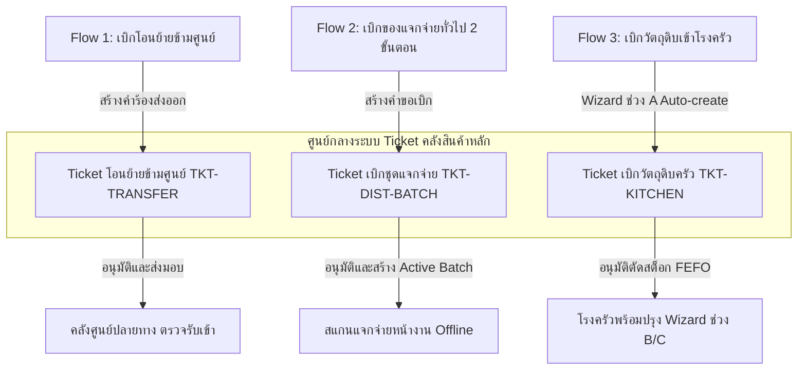

# CR-059 — Requisitions, Inter-Shelter Transfers & NFI Distribution Control

> **สรุป (TL;DR):** ปรับปรุงระบบคำร้องเบิกจ่าย การโอนย้ายสินค้าข้ามศูนย์ โมเดลการแจกจ่ายสิ่งของ NFI แบบ 2 ขั้นตอน (Active Batch) และมาตรการความปลอดภัย UI · บังคับกรอกชื่อคนขับและทะเบียนรถก่อนอนุมัติส่งมอบ และบังคับสร้าง Destination Lot ID ใหม่ปลายทาง · กระทบ `stock_ledger`, `stock_transfer`, UI Ticket Flow และสิทธิ์การเข้าถึงข้อมูลข้ามศูนย์.

---

## Why (เหตุผลและที่มา)
1. **ปัญหาการโอนย้ายเดิม:** การโอนย้ายข้ามศูนย์ไม่มีการบังคับกรอกข้อมูลยานพาหนะ/ผู้ขับขี่ และปลายทางยึดเลขล็อตต้นทาง ทำให้ประวัติและสิทธิ์สอบย้อนสินค้าของแต่ละศูนย์ปะปนกัน
2. **ปัญหาการแจกจ่ายหน้างานเดิม:** การสแกนแจกของตัดสต็อกตรงจากคลังหลักทันที หากอินเทอร์เน็ตหน้างานหลุด เจ้าหน้าที่จะไม่สามารถแจกสิ่งของให้ผู้พักพิงได้
3. **ปัญหาความปลอดภัยของ UI:** ตารางแสดงตาราง Ticket บางครั้งมีข้อมูลศูนย์อื่นรั่วไหลมาให้เห็น (Cross-shelter Leak) และการลบแถวรายการไม่มีปุ่มกู้คืน

---

## 📌 บทนำและการทำงานของระบบ Ticket (System Overview)

**ระบบ Ticket (ตั๋วคำร้องเบิกจ่ายและโอนย้าย)** คือศูนย์กลางในการควบคุมความโปร่งใสและตัดสต็อกคลังสินค้าหลักของระบบ SmartShelter ทุกรายการเบิกจ่าย เคลื่อนย้าย หรือจัดชุดแจกจ่าย **จะต้องวิ่งผ่านหน้า Ticket เพื่อให้เจ้าหน้าที่คลังตรวจสอบ อนุมัติ และเลือก Lot ตัดสต็อกจริงเสมอ (Single Source of Truth)**

โดยรายการปฏิบัติงานทั้งหมดที่วิ่งผ่านหน้า Ticket และระบบเบิกจ่ายในโมดูลนี้ แบ่งออกเป็น **3 Flow หลัก** ดังนี้:

---

## 🔄 รายละเอียดการทำงาน 3 Flow หลักผ่านระบบ Ticket

### 1. Flow ที่ 1: การโอนย้ายสินค้าข้ามศูนย์ (Inter-Shelter Ticket Transfer Flow)
*เปรียบเทียบสเปกใหม่ใน SmartShelter_สเปคระบบคลังสินค้า.md (หัวข้อ 4) เทียบกับสเปคเดิมใน docs/*

* **วัตถุประสงค์:** โอนย้ายเสบียงและสิ่งของระหว่างศูนย์พักพิง
* **การดำเนินการฝั่งเบิกออก (ศูนย์ต้นทาง):**
  * **[เปลี่ยน] การเลือก Lot สต็อกจริง:** การเลือกสินค้าต้องดึงจาก Lot ที่มีอยู่จริงในคลัง (ไม่ใช่พิมพ์ตัวเลข/ชื่อเอง) โดยระบบจะแสดงโซนจัดเก็บและวันหมดอายุแบบ Read-only อัตโนมัติ *(ข้อ 4.1 / Task #13)*
  * **[เพิ่ม] การจัดสรรเบิกข้ามล็อต (Split Allocation):** เพิ่มปุ่ม **"+ แบ่งจากอีกล็อต/โซน"** กรณีของในล็อตเดียวไม่พอ เพื่อดึงสินค้าจากหลายล็อตมาผสมให้ครบตามจำนวน *(ข้อ 4.1 / Task #13)*
  * **[เปลี่ยน] เงื่อนไขการอนุมัติส่งมอบ:** ปุ่ม "อนุมัติจ่ายและนำสิ่งของออกส่ง" บังคับกรอก **"ชื่อผู้ขับขี่"** และ **"ทะเบียนรถขนส่ง"** ก่อนส่งมอบเสมอ *(ข้อ 4.1 / Task #13)*
  * **[เปลี่ยน] การตัดสต็อกต้นทาง:** เมื่อกดอนุมัติ ระบบจะตัดสต็อกออกจาก Lot ต้นทางจริงทันที (บันทึก Ledger ขาออก) *(ข้อ 4.1 / Task #13)*
* **การดำเนินการฝั่งรับเข้า (ศูนย์ปลายทาง):**
  * **[เปลี่ยน] การจัดทำล็อตปลายทาง (Destination Lot ID):** เมื่อปลายทางตรวจรับเสร็จสิ้น ระบบจะบังคับให้สร้าง Lot ID ใหม่ด้วยรหัสศูนย์ปลายทางเองเสมอ (ห้ามใช้เลขล็อตต้นทาง) *(ข้อ 4.2 / Task #13)*
  * **[เปลี่ยน] การสืบย้อนกลับ (Traceability):** ระบบเก็บเลขล็อตต้นทางไว้ในฟิลด์ **"อ้างอิง Lot ต้นทาง"** แบบ Read-only เพื่อรักษาสิทธิ์การสืบย้อนประวัติสินค้า *(ข้อ 4.2 / Task #13)*
  * **[เปลี่ยน] การตรวจสอบวันหมดอายุจริง:** ดึงวันหมดอายุจากต้นทางมาให้อัตโนมัติ แต่ยังคงเปิดให้แก้ไขได้ตอนตรวจรับจริง กรณีวันหมดอายุของจริงไม่ตรงป้าย *(ข้อ 4.2 / Task #13)*
* **สิทธิ์และการซิงค์สถานะ:**
  * **[เพิ่ม] สิทธิ์คัดค้าน/ระงับคำสั่ง:** ฝั่งต้นทางมีปุ่ม **"คัดค้าน/ระงับคำสั่งปฏิบัติการ"** เพื่อปฏิเสธหรือระงับการโอนย้ายได้ หากสต็อกไม่พร้อมส่งมอบ *(ข้อ 4.3 / Task #13)*
  * **[เปลี่ยน] Real-time Sync:** หลังปลายทางยืนยันรับเข้าคลังสำเร็จ สถานะฝั่งต้นทางจะเปลี่ยนเป็น **"ส่งมอบสำเร็จ"** อัตโนมัติพร้อมบันทึกประวัติการดำเนินการ *(ข้อ 4.4 / Task #13)*

---

### 2. Flow ที่ 2: การเบิกแจกจ่ายสิ่งของทั่วไป 2 ขั้นตอน (2-Step Item Distribution Flow)
*เปรียบเทียบสเปกใหม่ใน SmartShelter_สเปคระบบคลังสินค้า.md (หัวข้อ 5) เทียบกับสเปคเดิมใน docs/*

* **วัตถุประสงค์:** เบิกสิ่งของทั่วไป (มุ้ง, เต็นท์, ผ้าห่ม, สบู่) ไปแจกผู้พักพิงหน้างานโดยรองรับการทำงานแบบ Offline
* **ขั้นตอนการทำงาน:**
  * **ขั้นที่ 1 — เบิกออกคลังหลัก (Active Batch):** หน้างานสร้างคำขอเบิก ➔ คำขอวิ่งไปหน้า Ticket สถานะ "รอคลังอนุมัติ" ➔ ฝั่งคลังอนุมัติตรวจสอบเพื่อเลือก Lot ตัดสต็อกคลังหลัก สร้างเป็น **"ชุดแจกจ่าย (Active Batch)"** *(ข้อ 5.1 / Task #12, #51, #56)*
  * **ขั้นที่ 2 — แจกจ่ายหน้างาน (On-site Distribution):** แท็บเล็ตหน้างานเลือกชุดแจกจ่าย แล้วสแกนแจกจ่ายผู้พักพิงโดยหักยอดจาก Active Batch (ไม่แตะคลังหลักอีก, รองรับการทำงาน **Offline**) *(ข้อ 5.2 / Task #12, #55)*
  * **[เปลี่ยน] UI ค้นหารายชื่อผู้รับ:** เปลี่ยนปุ่มกล้องสแกนตกแต่งเดิม เป็น **"ปุ่มกดเปิด Modal"** มีช่อง Search-select เลือกรายชื่อผู้พักพิงเพื่อตรวจโควต้าก่อนยืนยันแจก *(ข้อ 5.2 / Task #58)*
* **การกระทบยอดและการนำข้อมูล NFI ใน Item Master มาใช้หน้างาน:**
  * **[เพิ่ม] การคืนสต็อกส่วนต่างอัตโนมัติ (Reconciliation Return Qty):** *(ข้อ 5.3 / Task #12)*
    $$\text{Returned Stock Qty} = \text{Active Batch Qty} - (\text{Distributed Qty} + \text{Damaged/Lost Qty})$$
    * **📌 สูตรนี้ใช้ทำอะไร:** คำนวณหาจำนวนสิ่งของคงเหลือจริงเมื่อปิดรอบแจกจ่าย เพื่อทำเรื่องคืนสิ่งของกลับเข้าสต็อกคลังหลักให้อัตโนมัติ
    * **🖥️ คำนวณที่หน้าจอไหน:** หน้า **สรุปปิดรอบการแจกจ่าย (Reconciliation Summary Panel)**
    * **💡 ตัวอย่างการคำนวณจริง:** เบิกมุ้งมา 30 ผืน (Active Batch = 30), สแกนแจกจริง 25 ผืน, มีมุ้งชำรุด 2 ผืน $\rightarrow$ ระบบจะคำนวณมุ้งคืนคลังหลัก = $30 - (25 + 2) = 3 \text{ ผืน}$
  * **[นำมาใช้] การคุมแจกซ้ำสิ่งของ NFI (One-time Control):** ดึงฟิลด์ `distribution_type` จาก Item Master มาใช้งาน หากเป็นสินค้า **`One-time` (มุ้ง เต็นท์ ผ้าห่ม)** แล้วผู้รับเคยได้รับไปแล้ว ระบบจะเตือนและบังคับระบุเหตุผล (ของหาย/ชำรุด) ก่อนอนุญาตให้แจกซ้ำ *(ข้อ 5.3.1 / Task #21)*
  * **[นำมาใช้] การคำนวณเป้าหมายเบิก NFI (NFI Target Qty with Buffer):** *(ข้อ 5.3.1 / Task #21)*
    $$\text{NFI Target Qty} = \text{Active Headcount} \times \left( 1 + \frac{\text{NFI Buffer \%}}{100} \right)$$
    * **📌 สูตรนี้ใช้ทำอะไร:** คำนวณจำนวนสิ่งของแจกครั้งเดียว (เช่น มุ้ง) ที่ต้องเบิกออกคลังหลัก โดยบวกสำรองเผื่อเสียหายหรือมีคนมาใหม่ (5-10%)
    * **🖥️ คำนวณที่หน้าจอไหน:** หน้า **สร้างคำขอเบิกสิ่งของทั่วไป (Create Distribution Request)**
    * **💡 ตัวอย่างการคำนวณจริง:** มีผู้พักพิง 100 คน, ตั้งค่า NFI Buffer % = 10% $\rightarrow$ ระบบจะคำนวณยอดเบิกมุ้งรวม = $100 \times (1 + \frac{10}{100}) = 110 \text{ ผืน}$ (เผื่อสำรอง 10 ผืน)

---

### 3. Flow ที่ 3: การเบิกวัตถุดิบเข้าครัวกลาง (Kitchen Requisition Flow)
*เปรียบเทียบสเปกใหม่ใน SmartShelter_สเปคระบบคลังสินค้า.md (หัวข้อ 5.5 / 5.5.1) เทียบกับสเปคเดิมใน docs/*

* **วัตถุประสงค์:** เบิกวัตถุดิบเสบียงและแก๊สหุงต้มส่งให้โรงครัวประกอบอาหารตามแผนเมนู
* **ขั้นตอนการทำงาน:**
  * **ช่วง A — วางแผนเมนู (หน้างานครัว):** เลือกสูตร (BOM) ➔ ระบบคำนวณวัตถุดิบและแก๊สหุงต้มอัตโนมัติตามยอด headcount ➔ กดปุ่ม **"สร้างใบเบิกวัตถุดิบ"** ระบบจะ **Auto-create Ticket เบิกวัตถุดิบครัว (`TKT-KITCHEN-XXXX`)** ส่งตรงไปหน้า Ticket คลังหลักทันที *(ข้อ 5.5.1 / Task #42)*
  * **ช่วง B — รอคลังอนุมัติ (ฝั่งคลังสินค้า):** เจ้าหน้าที่คลังเปิด Ticket เบิกครัว ตรวจสอบและเลือก Lot วัตถุดิบจริงตาม FEFO แล้วกดอนุมัติตัดสต็อก ➔ สถานะฝั่งครัวจะเปลี่ยนเป็น **"วัตถุดิบพร้อม"** ให้ครัวดำเนินงานต่อ *(ข้อ 5.5.1 / Task #42, #50)*
  * **ช่วง C — รายงานผลจริง (หน้างานครัว):** เมื่อรับวัตถุดิบแล้ว ครัวปรุงอาหารและกรอก **Actual Yield (จำนวนเสิร์ฟที่ทำได้จริง)** เป็นเพดานในการแจกอาหาร โดยไม่ต้องแตะ Ticket อีกเลย *(ข้อ 5.5.1 / Task #48)*

---

## 🛡️ มาตรการความปลอดภัยของ UI (UI Safety Standards)

* **[เพิ่ม] ปุ่ม Undo การลบรายการ:** เพิ่มปุ่ม Undo การลบแถวรายการผ่าน Toast Notification ค้างไว้ 5 วินาที เพื่อป้องกันการกดลบพลาด *(ข้อ 4.5 / Task #13)*
* **[เปลี่ยน] การกั้นสิทธิ์ข้อมูลข้ามศูนย์ (Cross-shelter Isolation):** ตารางรายการ Ticket บังคับกรองเฉพาะศูนย์ใน Context จริงเท่านั้น เพื่อแก้ปัญหารั่วไหลของข้อมูลข้ามศูนย์ *(ข้อ 4.5 / Task #13)*
* **[เพิ่ม] Banner แสดงเส้นทางส่งมอบ:** หน้ารายละเอียด Ticket มี Banner แสดงเส้นทาง **"ต้นทาง → ปลายทาง"** เต็มรูปแบบ พร้อมระบุชัดเจนว่าศูนย์ปัจจุบันทำหน้าที่เป็นฝั่งใดของคำสั่ง *(ข้อ 4.5 / Task #13)*

---

## 📐 ตารางรวมสูตรคำนวณทั้งหมด (Master Formulas Reference Table)

| ลำดับ | ชื่อสูตรคำนวณ (Formula Name) | สูตรคำนวณ (Mathematical Expression) | สูตรนี้ใช้ทำอะไร (Purpose & Context) | หน้าจอที่ใช้คำนวณ | อ้างอิงสเปกใหม่ |
| :---: | :--- | :--- | :--- | :--- | :---: |
| **1** | **NFI Target Qty with Buffer** | $\text{NFI Target Qty} = \text{Active Headcount} \times \left( 1 + \frac{\text{NFI Buffer \%}}{100} \right)$ | คำนวณจำนวนสิ่งของแจกครั้งเดียวที่ต้องเบิก/ขอรับบริจาค โดยบวก Buffer สำรองเผื่อเสียหาย/คนใหม่ (5-10%) | หน้าสร้างคำขอเบิกสิ่งของทั่วไป | ข้อ 5.3.1 (L197) |
| **2** | **Reconciliation Return Qty** | $\text{Returned Stock Qty} = \text{Active Batch Qty} - (\text{Distributed Qty} + \text{Damaged/Lost Qty})$ | คำนวณมุ้ง/เต็นท์คงเหลือเพื่อทำเรื่องคืนกลับเข้าคลังหลักให้อัตโนมัติเมื่อปิดรอบแจกจ่าย | หน้าสรุปปิดรอบการแจกจ่าย | ข้อ 5.3 (L185) |

---

## 🔍 ตารางสรุปการเปลี่ยนแปลงตาม Task baseline

| Task ID เดิม | ชื่อ Task | สถานะในสเปกใหม่ | รายละเอียดการเปลี่ยนแปลง |
| :--- | :--- | :--- | :--- |
| **T-12** | Stock distribute (outbound) | **ปรับโมเดลการทำงาน** | เปลี่ยนเป็นโมเดล 2 ขั้นตอน (สร้าง Active Batch ก่อนแจกจริงหน้างาน) รองรับการทำงานแบบ Offline |
| **T-13** | Inter-shelter transfer | **เพิ่มกฎความปลอดภัยและการสืบย้อน** | • บังคับกรอกชื่อผู้ขับขี่และทะเบียนรถขนส่งก่อนส่งมอบ • รองรับการคัดค้าน/ระงับคำสั่งโอนย้ายสำหรับต้นทาง • ปลายทางสร้าง Lot ID ท้องถิ่นใหม่ พร้อมเก็บบันทึก Read-only Reference Lot ต้นทาง |
| **T-21** | NFI Distribution Control | **เพิ่มระบบคุมแจกซ้ำ** | แยกประเภทการแจกเป็น `One-time` vs `Recurring` บังคับใส่เหตุผลเมื่อแจกมุ้ง/เต็นท์ซ้ำ และเพิ่ม NFI Buffer % 5-10% |
| **T-56** | Purpose linked to Ticket | **ผูกโยงตั๋วอัตโนมัติ** | การเลือกวัตถุประสงค์ "โอนย้ายไปศูนย์อื่น" ในฟอร์มเบิกออก จะทำการหักยอดสต็อกและ Auto-create Ticket โอนย้ายให้อัตโนมัติ |
| **T-58** | Recipient Modal Search | **ปรับปรุง UI หน้างาน** | เปลี่ยนปุ่มสแกนรูปกล้องตกแต่งเป็นปุ่มกดเปิด Modal Search-select เลือกรายชื่อผู้พักพิงเพื่อตรวจ Eligibility |

---

## Impact (ผลกระทบต่อระบบ)
- **Docs:** `docs/data/schema.md` (§4.1, §4.2, §4.3, §4.4, §4.5, §5.1-5.4)
- **Code:** `frontend/src/lib/features/transfers/`, `frontend/src/lib/features/inventory/`, `frontend/src/lib/features/distribution/`

---

## Migration (แผนการปรับย้ายข้อมูล)
- N/A — เป็นการปรับปรุง Business Logic และ UI Component กลาง โดยคงโครงสร้าง DB Persistence และ Zod Validation ไว้ตามสกีมาหลัก

---

## Decision Log
- 2026-07-25 — proposed (กำหนดสเปกปรับปรุงระบบคำร้องเบิกจ่าย โอนย้ายข้ามศูนย์ NFI 2 ขั้นตอน และ UI Safety)
