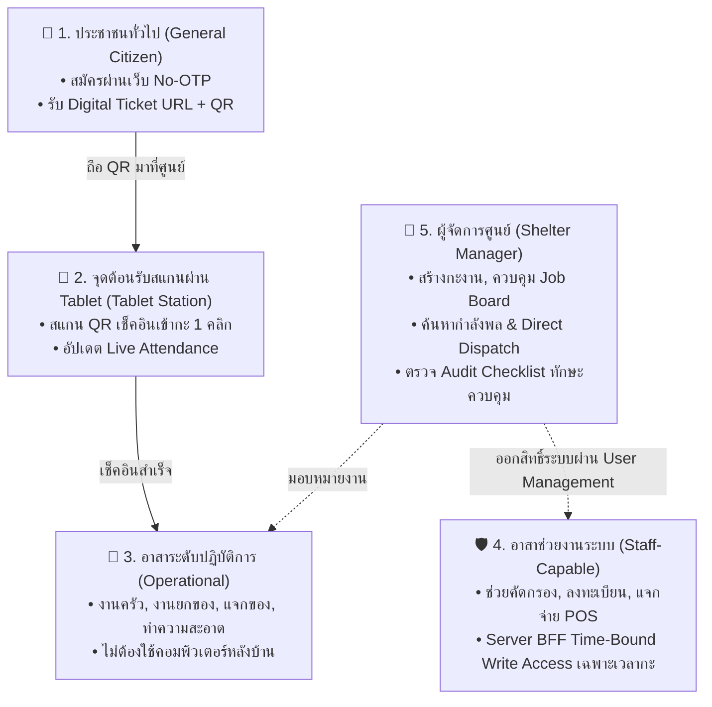
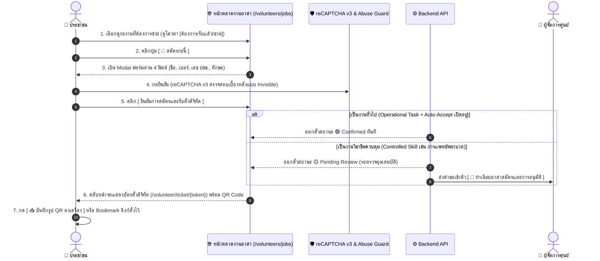
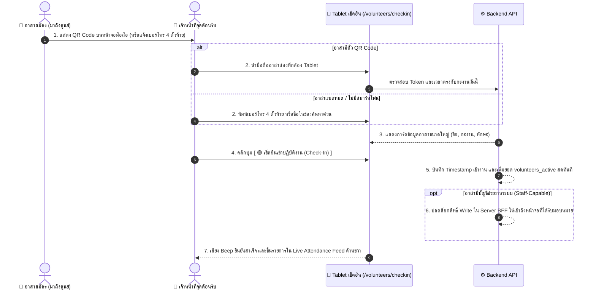
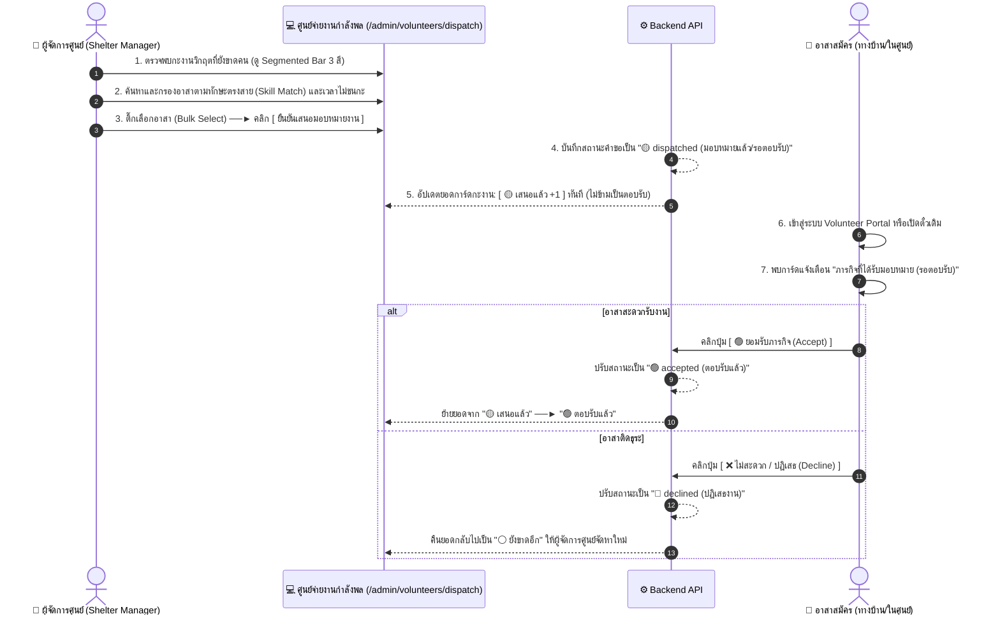
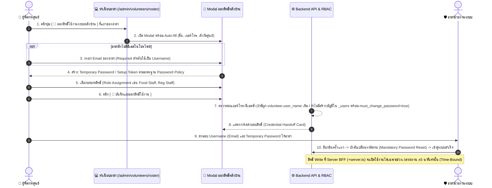

# CR-092 — ระบบบริหารจัดการจิตอาสาฉบับสมบูรณ์ V10 (SmartShelter Volunteer Management System)

## สรุป (TL;DR)

- **เปลี่ยนอะไร:** แปลงข้อกำหนด `volunteer_flow.md` (V10) เป็น CR-092 ครอบคลุมสถาปัตยกรรมจิตอาสาแบบครบวงจร:
  - **Unified Person Identity:** ผูกตัวตน 3 สถานะ (ผู้ประสบภัย/อาสา/เจ้าหน้าที่) ด้วย `national_id` / `phone_number` เป็น Single Source of Truth
  - **Zero-Friction No-SMS OTP:** สมัครงานได้ใน 30 วินาที รับ QR Code ตั๋วดิจิทัลทันที ป้องกัน Abuse ด้วย reCAPTCHA v3 (Invisible) + Rate Limiting
  - **Time-Bound Write Access:** ปลดล็อกสิทธิ์บันทึกข้อมูลเฉพาะช่วงเวลากะงาน $\pm 5$ นาที และต้องเช็คอินเข้างานแล้ว (`checked_in = true`) โดยบังคับใช้ที่ระดับ **Server BFF Middleware / Endpoints (`+server.ts`)**
  - **3-Color Quota Management:** บริหารยอดกำลังพลสด 3 สถานะสด (🟢 Confirmed / 🟡 Dispatched / ⚪ Remaining)
  - **6 หน้าจอหลัก:** Public Board, Digital Pass, Tablet Check-in Station, Roster, Dispatch Workspace, Volunteer Portal
- **เพื่อใคร/ทำไม:**
  - **ศูนย์พักพิง:** ได้รับกำลังพลสนับสนุนทันทีใน 30 วินาที โดยไม่ติดคอขวด SMS OTP ล่ม หรือปัญหาการสร้างบัญชีซ้ำซ้อน
  - **ผู้จัดการศูนย์ (SM):** ควบคุมภาพรวมกำลังพลสดและจ่ายงานได้แม่นยำ real-time
  - **ความปลอดภัยข้อมูล:** ป้องกันข้อมูลส่วนบุคคลผู้ประสบภัย (PDPA) รั่วไหลด้วยการตัดสิทธิ์ Write Access อัตโนมัติต่างเวลากะงาน
- **Dev ต้อง build:**
  - **Public App:** Public 2-Tab Job Board (`/volunteers/jobs`), Single Pass View (`/volunteer/ticket/:token`), Volunteer Portal Dashboard (`/volunteer/portal`)
  - **On-Site & Admin:** จุดสแกนเช็คอินผ่าน Tablet (`/volunteers/checkin`), Unified Roster (`/admin/volunteers/roster`), Dispatch Workspace (`/admin/volunteers/dispatch`)
  - **Security & Infrastructure:** Time-Bound Access Guard ที่ระดับ **Server BFF (`+server.ts` endpoints / hooks)**, ระบบบังคับรีเซ็ตรหัสผ่านครั้งแรก (Mandatory Password Reset on First Login) ตาม [Password Policy](../data/password-policy.md), reCAPTCHA v3 Backend Verification, Rate Limiters (3 requests / 10 mins)
- **กระทบ schema/scope:**
  - **Data Schemas:** `volunteer` (schema v1 — เพิ่ม `national_id`, `checked_in`, `current_shelter_code`, ผูก `user_name`), `job` (schema v1), `job_application` (schema v1), `shift_assignment` (schema v2). **หมายเหตุความปลอดภัย:** ไม่แก้ไข schema หรือเพิ่มฟิลด์ใน CouchDB `_users` Authentication Database โดยตรง แต่ใช้โมเดล Mapping ผ่าน Application Database (`volunteer.user_name`) และควบคุมการเข้าถึงผ่าน Server BFF (`+server.ts`)
  - **Document Specs:** `role-permission-matrix.md` (Time-Bound RBAC) และ `06-A-volunteer.md` (T-28 / T-29)

---

## 0. ปรัชญาการออกแบบ (Design Philosophy — The 5 Pillars)

> ในภาวะภัยพิบัติฉุกเฉิน ศูนย์พักพิงต้องการกำลังพลทันที แต่ระบบเดิมมีคอขวด 4 ประการ: (1) SMS OTP ล่ม (2) ขั้นตอนซ้ำซ้อน (3) สิทธิ์ข้อมูลผู้ประสบภัยหละหลวม (4) บทบาทซ้อนทับ 3 สถานะในคนเดียว — CR นี้แก้ทั้ง 4 ข้อด้วย 5 เสาหลักดังนี้:

```text
┌──────────────────────────────────────────────────────────────────────────────────────────────────────┐
│                                  SMARTSHELTER VOLUNTEER CORE                                         │
├──────────────────────┬──────────────────────┬──────────────────────┬─────────────────┬───────────────┤
│  ⚡ Zero-Friction     │  🎫 Digital Pass      │  🛡️ Time-Bound       │  📊 Single       │  👤 Unified   │
│     No-SMS OTP       │   Token-Based QR      │   Access Control     │   Source of      │   Multi-Role  │
│                      │                       │                      │   Capacity       │               │
│ สมัครได้ใน 30 วิ     │ ไม่ต้องมี User/Pass   │ ปลดล็อกสิทธิ์        │ โควตากำลังพล    │ 1 บุคคลเชื่อม │
│ ผ่านหน้าเว็บตรง      │ พก QR Code ตั๋ว       │ เฉพาะเวลากะงาน       │ 3 ระดับสด       │ 3 สถานะด้วย  │
│ ไม่ต้องรอรหัส SMS    │ ยื่นสแกนหน้างาน      │ ป้องกันข้อมูลรั่ว    │ (ยืนยัน/เสนอ/  │ เลขบัตร ปชช./ │
│                      │                       │                      │  ขาด)           │ เบอร์โทร      │
└──────────────────────┴──────────────────────┴──────────────────────┴─────────────────┴───────────────┘
```

---

## 1. ข้อกำหนดการพัฒนาระบบ (System Functional Requirements)

### FR-VOL-01: สถาปัตยกรรมตัวตนบุคคลรวมศูนย์ (Unified Multi-Role Person Identity: `D-UNIFIED-PERSON-IDENTITY`)

1. ระบบต้องใช้ **เลขประจำตัวประชาชน 13 หลัก (`national_id`)** หรือ **เบอร์โทรศัพท์ (`phone_number`)** เป็น Key หลัก (Single Source of Truth) ในการเชื่อมโยงบุคคลคนเดียวกันระหว่าง 3 สถานะ:
   - ผู้อพยพ (Evacuee)
   - จิตอาสา (Volunteer)
   - เจ้าหน้าที่ (Staff)
2. เมื่อผู้จัดการศูนย์ออกสิทธิ์ใช้งานระบบหลังบ้าน หาก `phone_number` หรือ `national_id` มีอยู่ในระบบหรือโปรไฟล์เดิม ระบบ Server BFF ต้องเชื่อมโยง (Link) โดยอัปเดตฟิลด์ `volunteer.user_name` ให้ชี้ไปยังบัญชี `_users` เดิม โดยไม่สร้าง User ใน `_users` ซ้ำซ้อน
3. ระบบต้อง บันทึกพิกัดศูนย์ที่บุคคลกำลัง On-Site ปฏิบัติงานหรือพักพิงอยู่จริงผ่าน Event การสแกน QR เช็คอินเข้ากะ หรือการลงทะเบียนหน้าด่านศูนย์พักพิง

### FR-VOL-02: การสมัครงานภาคประชาชนแบบ No-SMS OTP & Anti-Spam

1. หน้าพอร์ทัลสมัครงานอาสาสาธารณะ (`/volunteers/jobs`) ต้อง อนุญาตให้ประชาชนสมัครได้โดยไม่ต้องล็อกอิน (No-Auth) และ ไม่ต้องผ่านขั้นตอนรับรหัส SMS OTP
2. ระบบต้อง บันทึกข้อมูลใบสมัครด่วน 4 ฟิลด์หลัก: ชื่อ-นามสกุล, เบอร์โทรศัพท์, เลขประจำตัวประชาชน 13 หลัก, และทักษะ/ความสามารถ
3. ฟอร์มสมัครงานต้อง บังคับใช้ Google reCAPTCHA v3 (Invisible Score $\ge 0.5$) เบื้องหลังเพื่อป้องกัน Bot และจำกัดสิทธิ์การสมัคร (Rate Limit) ไม่เกิน 3 ครั้ง / 10 นาที ต่อ IP Address หรือเบอร์โทรศัพท์
4. ตรรกะการอนุมัติใบสมัคร:
   - กรณีงานทั่วไป (`operational` tier + เปิด auto-accept): ออกตั๋วดิจิทัลสถานะ `confirmed` ทันที
   - กรณีงานวิชาชีพควบคุม (`controlled` skill เช่น การแพทย์/พยาบาล): ออกตั๋วดิจิทัลสถานะ `pending_review` และส่งคำขอเข้าคิวรอผู้จัดการศูนย์ตรวจรับรองคุณสมบัติ

### FR-VOL-03: ตั๋วดิจิทัลและ QR Code ประจำตัว (Digital Pass & Token-Based QR)

1. เมื่อสมัครงานสำเร็จ ระบบต้อง ออกตั๋วดิจิทัล ณ Route `/volunteer/ticket/:token` (อ้างอิง Token ความยาวคงที่ ไม่เปิดเผย ID หลังบ้าน)
2. หน้าตั๋วดิจิทัลต้อง แสดงผลแบบ **Clean Single Ticket View** (ไม่แสดงรายการตั๋วอื่นต่อท้ายด้านล่าง) บรรจุรายละเอียด:
   - ชื่องาน, ศูนย์พักพิง, Token ID, วันที่สมัคร
   - Badge สถานะ (`🟢 ยืนยันแล้ว` หรือ `🟡 รอการพิจารณา`)
   - **High-Resolution QR Code** บรรจุ Signed JWT Token สำหรับให้เจ้าหน้าที่สแกนหน้างาน
   - ข้อมูลนัดหมาย (วัน-เวลากะ, จุดนัดพบ, ชื่อ-เบอร์โทรผู้สมัคร)
3. ตั๋วดิจิทัลต้อง มี 3 ปุ่ม Action หลัก: `[ 📥 บันทึกรูป QR Code ลงเครื่อง ]`, `[ 🔗 คัดลอกลิงก์ตั๋วนี้ ]`, และ `[ ❌ ขอยกเลิกการสมัครล่วงหน้า ]`
4. **การคุ้มครองข้อมูลส่วนบุคคล (Data Privacy & PII Protection):** ในหน้าตั๋วดิจิทัล ระบบต้อง **ไม่ส่งและไม่แสดงผลเลขประจำตัวประชาชน 13 หลัก (`national_id`)** ออกทาง Response/UI และต้องแสดงเบอร์โทรศัพท์แบบ Masked (เช่น `xxx-xxx-1234`) เพื่อความปลอดภัยตามมาตรฐาน PDPA

### FR-VOL-04: จุดเช็คอินรายงานตัวหน้างานผ่าน Tablet (On-Site Tablet Check-In)

1. หน้าจอเช็คอินหน้างาน (`/volunteers/checkin`) ต้อง ออกแบบด้วยธีม **Modern Clean POS Theme** (ขาว-ฟ้า) รองรับหน้าจอ Tablet พร้อมปุ่มขยายเต็มหน้าจอ `[ ⤢ Fullscreen (Tablet Mode) ]`
2. การจัดวางหน้าจอแบ่ง 2 ฝั่ง (Split Layout 40/60 บน Tablet):
   - **ฝั่งซ้าย (40% - Scanner Station):** ช่องกล้องสแกน QR Code ตั๋วมือถืออัตโนมัติผ่านกล้อง Tablet พร้อมช่องพิมพ์ค้นหาด่วน (เบอร์โทร 4 ตัวท้าย, ชื่อ, หรือ Token)
   - **ฝั่งขวา (60% - Instant Verification Card & Live Feed):** แสดงการ์ดข้อมูลอาสาขนาดใหญ่เมื่อสแกนเจอ พร้อมปุ่ม 1-Click `[ 🟢 เช็คอินเข้างาน (Check-In) ]` และ `[ 🚪 เช็คเอาต์ออกงาน (Check-Out) ]` และแสดงรายการประวัติการเช็คอินล่าสุด (Live Attendance Feed) อัปเดตสด Real-time
3. เมื่อกดปุ่มเช็คอินสำเร็จ ระบบต้อง บันทึก Timestamp เข้างาน และเพิ่มยอด `volunteers_active` สดประจำศูนย์ทันที

### FR-VOL-05: ระบบจำกัดสิทธิ์ตามเวลากะงานที่ระดับ Server BFF (Server BFF Time-Bound Shift Access Control)

1. **ระดับการบังคับใช้สิทธิ์ (Enforcement Layer):**
   - สิทธิ์การบันทึกข้อมูล (Write Access: POST, PUT, PATCH, DELETE) ของอาสาช่วยงานระบบ (Staff-Capable Volunteer) **ต้องถูกบังคับใช้ที่ระดับ Server BFF Middleware / Endpoints (`+server.ts`) เสมอ**
   - **เหตุผลทางสถาปัตยกรรม:** Client-Side PouchDB หรือ CouchDB Direct Access ไม่สามารถตรวจสอบ Context ของเวลาปัจจุบันกับสถานะการเข้ากะได้อย่างปลอดภัยและเชื่อถือได้ การส่งคำขอแก้ไขข้อมูลทั้งหมดจึงต้องกระทำผ่าน Server BFF ที่มี Time-Bound Guard เท่านั้น
2. **เงื่อนไขการเปิดสิทธิ์บันทึกข้อมูล (Write Authorization Rule):**
   $$\text{Write Access Status} = \begin{cases} \text{ENABLED (200/204)}, & (\text{now} \ge \text{shift\_start} - 5\text{m}) \land (\text{now} \le \text{shift\_end} + 5\text{m}) \land (\text{checked\_in} = \text{true}) \\ \text{READ-ONLY / 403 Forbidden}, & \text{กรณีอื่นๆ ทั้งหมด} \end{cases}$$
3. หากอยู่นอกช่วงเวลากะงาน หรือยังไม่ได้สแกนเช็คอินเข้างาน Server BFF ต้อง บล็อกคำขอแก้ไขข้อมูล (Deny Write Access) และคืนค่า HTTP status `403 Forbidden` พร้อมระบุ Error Code `ERR_OUTSIDE_SHIFT_WINDOW` และข้อความแจ้งเตือนทันที

### FR-VOL-06: ศูนย์จ่ายงานและบริหารโควตากำลังพล 3 สี (Direct Dispatch & Quota State Calculations)

1. หน้าจอศูนย์จ่ายงาน (`/admin/volunteers/dispatch`) ต้อง แสดงแถบคำนวณโควตากำลังพลแบบ Multi-State Quota Bar (3 สี):
   $$\text{Total Quota} = \text{Accepted (🟢 ตอบรับแล้ว)} + \text{Dispatched (🟡 เสนอแล้ว/รอตอบรับ)} + \text{Remaining (⚪ ยังขาด)}$$
2. การคำนวณและปรับเปลี่ยนสถานะโควตา:
   - ผู้จัดการศูนย์กด Dispatch $\rightarrow$ `Dispatched + 1`, `Remaining - 1` (สถานะคำขอ = `dispatched`)
   - อาสาสมัครกดยอมรับภารกิจ (Accept) $\rightarrow$ `Accepted + 1`, `Dispatched - 1` (สถานะคำขอ = `accepted`)
   - อาสาสมัครกดปฏิเสธภารกิจ (Decline) $\rightarrow$ `Dispatched - 1`, `Remaining + 1` (สถานะคำขอ = `declined`)
3. ตัวกรองค้นหากำลังพลต้อง รองรับการกรองทักษะตรงสาย (Skill Match) และ การป้องกันเวลาชนกะ (Time Collision Prevention) พร้อมปุ่มเลือกแบบกลุ่ม (Bulk Dispatch)

### FR-VOL-07: การออกสิทธิ์ระบบหลังบ้านและการบังคับเปลี่ยนรหัสผ่าน (Back-Office Access Provisioning & Password Security)

1. ในหน้าทำเนียบอาสา (`/admin/volunteers/roster`) เมื่อคลิกปุ่ม `[ 🔑 ออกสิทธิ์ใช้งานระบบหลังบ้าน ]` ระบบต้อง เปิด Modal พร้อม Auto-fill ข้อมูลชื่อ, เบอร์โทรศัพท์, และศูนย์พักพิงสังกัด
2. หากโปรไฟล์ยังไม่มีอีเมล ต้อง บังคับกรอก Email เพื่อใช้เป็น Username สำหรับล็อกอินหลังบ้าน
3. **การจัดการรหัสผ่านเริ่มต้นและความปลอดภัย (Initial Credential & Mandatory Password Reset):**
   - ระบบ Server BFF จะสร้าง Temporary Password ที่มีความปลอดภัยตามมาตรฐาน [Password Policy](../data/password-policy.md)
   - บัญชีที่สร้างใหม่จะถูกตั้งค่า `must_change_password: true` เพื่อ **บังคับเปลี่ยนรหัสผ่านทันทีในการเข้าสู่ระบบครั้งแรก (Mandatory First-Time Password Reset)** ก่อนได้รับสิทธิ์เข้าถึงฟังก์ชันใดๆ ของระบบ เพื่อป้องกันปัญหา Predictable Credentials
   - รหัสผ่านใหม่ที่ผู้ใช้ตั้งจะต้องผ่านเกณฑ์ความปลอดภัยครบถ้วนตาม [Password Policy](../data/password-policy.md) (ความยาว $\ge 10$ ตัวอักษร, ตัวพิมพ์ใหญ่, ตัวพิมพ์เล็ก, ตัวเลข และอักขระพิเศษ)
4. เมื่อบันทึกสำเร็จ ระบบต้อง แสดงการ์ดส่งมอบสิทธิ์ (Credential Handoff Card) สรุป Username (Email) และ Temporary Setup Credential สำหรับผู้จัดการศูนย์ส่งมอบให้อาสาใช้งาน

---

### 1.1 รายละเอียดการปรับแก้ Schema & Database Fields (Data Field Modifications)

เปรียบเทียบโครงสร้างฐานข้อมูลระหว่าง **โครงสร้างเดิม (Legacy Schema)** กับ **สิ่งที่ปรับปรุงเพิ่มใน CR-092 (New & Modified Fields)** แยกตาม Document Type:

#### 1. `volunteer` — `volunteer:{ulid}` (Schema v1)

- **โครงสร้างเดิม (Legacy Schema):**
  ```ts
  interface VolunteerDocLegacy {
    first_name: string;
    last_name: string;
    phone: string | null;
    phone_hash?: string | null;
    skills?: string[];
    tracking_token?: string | null;
    status: 'active' | 'inactive';
    user_name?: string | null;
  }
  ```
- **สิ่งที่ปรับเปลี่ยนใน CR-092:**
  - ✨ **[เพิ่มฟิลด์ใหม่] `national_id: string | null` (optional):** เลขประจำตัวประชาชน 13 หลัก เพื่อผูกตัวตน Single Source of Truth (Unified Multi-Role Person Identity)
  - ✨ **[เพิ่มฟิลด์ใหม่] `checked_in: boolean` (system, default: `false`):** ติดตามสถานะเช็คอินปฏิบัติหน้าที่สดหน้างาน
  - ✨ **[เพิ่มฟิลด์ใหม่] `current_shelter_code: string | null` (optional):** รหัสศูนย์พักพิงที่อาสากำลังปฏิบัติงานอยู่ในกะปัจจุบัน
  - 🔗 **[คงเดิมและใช้งาน] `user_name: string | null` (optional):** Foreign Key อ้างอิงไปยัง Username ในระบบ `_users` เมื่อได้รับสิทธิ์เป็น Staff-Capable Volunteer (Application Database Mapping)

---

#### 2. `shift_assignment` — `shift_assignment:{ulid}` (Schema v1 $\rightarrow$ v2)

- **โครงสร้างเดิม (Legacy Schema v1):**
  ```ts
  interface ShiftAssignmentDocV1 {
    job_id: string;
    volunteer_id: string;
    date: string;
    shift: 'morning' | 'afternoon' | 'night' | 'custom';
    station: string;
    status: 'assigned' | 'no_show' | 'cancelled';
  }
  ```
- **สิ่งที่ปรับเปลี่ยนใน CR-092 (Schema v2):**
  - ✨ **[เพิ่มฟิลด์ใหม่] `duty_window: { start_ts: string, end_ts: string }` (required):** หน้าต่างเวลากะงานจริง สำหรับระบบบังคับ Server BFF Time-Bound Shift Access Control ($\pm 5$ นาที)
  - ✨ **[เพิ่มฟิลด์ใหม่] `check_in_at: string | null` (optional):** Timestamp สแกน QR Ticket รายงานตัวเข้างานที่จุด Tablet เช็คอิน
  - ✨ **[เพิ่มฟิลด์ใหม่] `check_out_at: string | null` (optional):** Timestamp เช็คเอาท์ออกงาน
  - ✨ **[เพิ่มฟิลด์ใหม่] `check_in_by: string | null` (optional):** Username/Staff ID ของเจ้าหน้าที่ผู้กดรับรายงานตัว
  - ✨ **[เพิ่มฟิลด์ใหม่] `dispatch_status: 'dispatched' | 'accepted' | 'declined' | null` (optional):** สถานะเมื่อได้รับการเสนอจ่ายงานจาก SM ผ่าน Direct Dispatch
  - 🔄 **[ปรับปรุง Enum] `status`:** เพิ่มค่าสถานะ `standby`, `checked_in`, `completed` เพื่อรองรับ Real-time Shift Lifecycle (กลายเป็น `enum('assigned', 'standby', 'checked_in', 'completed', 'no_show', 'cancelled')`)

---

#### 3. `job` — `job:{ulid}` (Schema v1)

- **โครงสร้างเดิม (Legacy Schema):**
  ```ts
  interface JobDocLegacy {
    title: string;
    tier: 'operational' | 'staff-capable';
    quota: number;
    slots_confirmed: number;
    slots_pending: number; // 🔴 ฟิลด์เดิม (นับเฉพาะใบสมัครรออนุมัติ)
    status: 'open' | 'almost_full' | 'full' | 'closed' | 'cancelled';
  }
  ```
- **สิ่งที่ปรับเปลี่ยนใน CR-092:**
  - ✨ **[เพิ่มฟิลด์ใหม่] `slots_dispatched: number` (required, default: `0`):** ยอดอาสาสมัครที่อยู่ระหว่างเสนอจ่ายงานรอตอบรับ (🟡 Dispatched Quota)
  - 🔄 **[เปลี่ยนชื่อฟิลด์ & ปรับวิธีคำนวณ] `slots_pending` $\rightarrow$ `slots_remaining`:** เปลี่ยนมาเก็บยอดกำลังพลที่ยังขาดอยู่สด (⚪ Remaining Quota = `quota` - `slots_confirmed` - `slots_dispatched`)

---

#### 4. `job_application` — `job_application:{ulid}` (Schema v1)

- **โครงสร้างเดิม (Legacy Schema):**
  ```ts
  interface JobApplicationDocLegacy {
    job_id: string;
    volunteer_id: string | null;
    applicant: { first_name: string; last_name: string; phone: string; email: string | null; skills: string[] };
    tracking_token: string;
    status: 'pending' | 'accepted' | 'rejected' | 'cancelled'; // 🔴 Enum เดิม
  }
  ```
- **สิ่งที่ปรับเปลี่ยนใน CR-092:**
  - ✨ **[เพิ่มฟิลด์ใหม่] `applicant.national_id: string | null` (optional):** เลขบัตรประชาชน 13 หลักตอนกรอกฟอร์มสมัครด่วน No-SMS OTP
  - 🔄 **[ปรับปรุง Enum] `status`:** เปลี่ยนค่าสถานะจาก `pending/accepted/rejected` เป็น `confirmed` (อนุมัติทันที/auto-accept), `pending_review` (รอตรวจวิชาชีพควบคุม), `cancelled` (ยกเลิกตั๋ว) เพื่อให้สอดคล้องกับตั๋วดิจิทัล

---

#### 5. สถาปัตยกรรมบัญชีผู้ใช้งาน (User Account Mapping — No `_users` DB Mutation)

- **นโยบายการจัดการ CouchDB `_users` Database:**
  - ฐานข้อมูล `_users` ของ CouchDB เป็น Authentication Database ภายในระบบ ห้ามแก้ไข schema หรือเพิ่ม application metadata/foreign key (`linked_person_id`) ลงใน `_users` โดยตรง เพื่อป้องกันผลกระทบต่อ Auth provider, replication และ security rules
- **โมเดลการเชื่อมโยงข้อมูล (Application Database Mapping Model):**
  - จัดเก็บความสัมพันธ์ที่ฝั่ง Application Database ผ่านฟิลด์ `volunteer.user_name` (§2.8) ซึ่งชี้ไปยัง username ใน `_users`
  - ฝั่ง Server BFF (`+server.ts`) จะทำการ resolve ตัวตนจาก Session User $\rightarrow$ ค้นหา `volunteer` doc และ `shift_assignment` doc ใน Application Database เพื่อตรวจสอบสิทธิ์ Time-Bound RBAC และ Shelter Scope โดยโครงสร้าง `_users` ยังคงเป็นมาตรฐานตามเดิม

---

## 2. แผนภาพสถาปัตยกรรมและลำดับการทำงาน (System Workflows & Sequence Diagrams)

### 2.1 แผนภาพกลุ่มผู้ใช้งานและระดับสิทธิ์ (User Personas & System Roles)



### 2.1.1 ตาราง Role × Auth Method × System Permissions

| ระดับผู้ใช้งาน                                   | การพิสูจน์ตัวตน (Auth Method)                                                                                                                 | สิทธิ์ในระบบ (System Permissions)                                                              | ขอบเขตงานตัวอย่าง                                    |
| ------------------------------------------------ | --------------------------------------------------------------------------------------------------------------------------------------------- | ---------------------------------------------------------------------------------------------- | ---------------------------------------------------- |
| **1. ประชาชนผู้สมัคร (Public Citizen)**          | **No-Auth (ไม่ต้องล็อกอิน)** ป้องกัน Bot ด้วย reCAPTCHA v3                                                                                    | ดูตลาดงาน (Job Board) และส่งใบสมัครรับตั๋ว QR                                                  | สมัครกะงานล่วงหน้าผ่านมือถือ                         |
| **2. อาสาสมัครทั่วไป (Operational Volunteer)**   | **Digital Ticket QR Code** หรือเข้าพอร์ทัลด้วยเบอร์โทรศัพท์                                                                                   | ดูตารางงานตนเอง, เช็คอิน/เช็คเอาต์, รับสวัสดิการอาหาร                                          | ครัวกลาง, ยกของ, แจกถุงยังชีพ, สันทนาการ             |
| **3. อาสาช่วยงานระบบ (Staff-Capable Volunteer)** | **Email Username + Temporary Password** (พร้อมบังคับ Mandatory Password Reset ในการเข้าสู่ระบบครั้งแรกตาม [Password Policy](../data/password-policy.md)) | **Server BFF Time-Bound Write Access:** ปลดล็อกสิทธิ์บันทึกข้อมูลเฉพาะช่วงเวลากะงาน ±5 นาที และ `checked_in = true` | ลงทะเบียนผู้ประสบภัย, คัดกรองอาการ, บันทึกแจกของ POS |
| **4. ผู้จัดการศูนย์ (Shelter Manager)**          | **Staff Account (RBAC)** + บันทึก Audit Trail ทุก Action                                                                                      | สิทธิ์เต็มในการสร้างกะงาน, มอบหมายงาน (Dispatch), รับรองทักษะวิชาชีพ                           | ควบคุมภาพรวมกำลังพล, อนุมัติสิทธิ์ระบบหลังบ้าน       |

---

### 2.2 Flow 1: การสมัครงานจิตอาสาภาคประชาชน (Public Apply Flow — No-Auth & No-SMS OTP)



---

### 2.3 Flow 2: จุดรายงานตัวและเช็คอินหน้างาน (On-Site Reception & Check-In Flow)



---

### 2.4 Flow 3: การมอบหมายงานตรงจากผู้จัดการศูนย์ (Shelter Manager Direct Dispatch Flow)



---

### 2.5 Flow 4: การออกสิทธิ์ระบบหลังบ้าน (Back-Office Access Provisioning & Credential Handoff)



---

## 3. ข้อกำหนดรายละเอียดหน้าจอทั้งระบบ (Detailed Screen Specifications)

---

### 🖥️ หน้าจอที่ 1: ตลาดงานอาสาสมัครภาคประชาชน (Public Job Board)

- **Route:** `/volunteers/jobs` (หรือ `/volunteer`)
- **Layout:** ยุบเหลือ **2 แท็บระดับเดียว** (ตามมติ `D-VOL-PUBLIC-2TABS`):

**Tab 1: `[ 📋 ตลาดงานอาสาสมัคร (Job Board) ]`** _(Default Tab)_

| Element              | รายละเอียด                                                                  |
| -------------------- | --------------------------------------------------------------------------- |
| Header Actions       | ปุ่ม `[ 🔐 เข้าสู่ระบบจิตอาสา / ตารางงานของฉัน ➔ ]`                         |
| Toolbar              | แถบเลือกศูนย์พักพิง + ตัวกรองทักษะ + ตัวกรองสถานะ (`เปิดรับ`, `ใกล้เต็ม`)   |
| Job Card — ข้อมูล    | ชื่องาน, สังกัดศูนย์พักพิง, วันที่และเวลากะงาน                              |
| Job Card — Quota Bar | **Segmented Quota Bar 2 สี:** `ต้องการ 10 คน [ 🟢 รับแล้ว 6 \| ⚪ ว่าง 4 ]` |
| Job Card — CTA       | ปุ่มเด่น **`[ 🚀 สมัครกะนี้ ]`** → เปิด Modal ฟอร์มด่วน 4 ฟิลด์             |

**Tab 2: `[ 🎫 ค้นหาตั๋วของฉัน (Find My Ticket Pass) ]`**

| Element      | รายละเอียด                                                                   |
| ------------ | ---------------------------------------------------------------------------- |
| Search Field | ช่องค้นหาด่วน: พิมพ์เบอร์โทรศัพท์มือถือ หรือ Token เพื่อดึงตั๋ว QR Code เดิม |

---

### 🖥️ หน้าจอที่ 2: บัตรประจำตัวจิตอาสาดิจิทัล (Digital Ticket Pass)

- **Route:** `/volunteer/ticket/:token` (เช่น `/volunteer/ticket/TKT-VOL-475939`)

| Element         | รายละเอียด                                                                                             |
| --------------- | ------------------------------------------------------------------------------------------------------ |
| View Mode       | **Clean Single Ticket View** — ห้ามแสดงช่องค้นหาตั๋วใบอื่นต่อท้ายด้านล่าง                              |
| Header          | ปุ่ม `[ ← กลับไปยังกระดานงาน ]`                                                                        |
| Ticket Card (1) | ชื่องาน, สังกัดศูนย์พักพิง, รหัส Token, วันที่สมัคร                                                    |
| Ticket Card (2) | Badge สถานะ: `🟢 ยืนยันแล้ว (Confirmed)` หรือ `🟡 รอการพิจารณา (Pending Review)`                       |
| Ticket Card (3) | **QR Code ขนาดใหญ่ความละเอียดสูง** (บรรจุ JWT Token Signed สำหรับยิงสแกนหน้างาน)                       |
| Ticket Card (4) | ข้อมูลนัดหมาย: วันที่, เวลากะ, จุดนัดพบ, ชื่อ และเบอร์โทรผู้สมัครแบบ Masked (`xxx-xxx-1234`)            |
| Privacy Guard   | **PII Redaction:** ห้ามส่งฟิลด์ `national_id` ใน API Response และ Mask เบอร์โทรศัพท์ตามมาตรฐาน PDPA    |
| Actions         | `[ 📥 บันทึกรูป QR Code ลงเครื่อง ]` / `[ 🔗 คัดลอกลิงก์ตั๋วนี้ ]` / `[ ❌ ขอยกเลิกการสมัครล่วงหน้า ]` |

---

### 🖥️ หน้าจอที่ 3: จุดสแกนเช็คอินอาสาหน้างานผ่าน Tablet (On-Site Volunteer Tablet Check-In)

- **Route:** `/volunteers/checkin`
- **ธีม:** Modern Clean POS Theme (ขาว-ฟ้าสว่างตา) สำหรับ Tablet

| Zone                                | Element         | รายละเอียด                                                                 |
| ----------------------------------- | --------------- | -------------------------------------------------------------------------- |
| **Header Card**                     | Navigation      | `[ ← กลับหน้ารวม ]`                                                        |
|                                     | Title           | `จุดเช็คอินอาสาสมัครหน้างาน (Tablet Station)` + `🏥 ชื่อศูนย์`             |
|                                     | Live Counter    | `🟢 ปฏิบัติงานจริง: N คน` (Real-time)                                      |
|                                     | Action          | `[ + ลงทะเบียน Walk-in ด่วน ]` + `[ ⤢ Fullscreen (Tablet Mode) ]`          |
| **ฝั่งซ้าย (40%) Scanner Station**  | QR Scanner      | ช่องกล้องสแกน QR Code ตั๋วมือถืออัตโนมัติ (ผ่านกล้อง Tablet)               |
|                                     | Quick Search    | `[ 🔍 พิมพ์เบอร์โทร 4 ตัวท้าย, ชื่อ, หรือ Token... ]`                      |
| **ฝั่งขวา (60%) Verification Card** | Volunteer Card  | การ์ดข้อมูลอาสาขนาดใหญ่: ชื่อ, เบอร์, กะงาน, ทักษะ (แสดงเมื่อสแกนเจอ)      |
|                                     | Primary Actions | `[ 🟢 เช็คอินเข้างาน (Check-In) ]` / `[ 🚪 เช็คเอาต์ออกงาน (Check-Out) ]`  |
|                                     | Live Feed       | **Recent Check-in Live Feed** — ประวัติการเช็คอินล่าสุด อัปเดตสด Real-time |

---

### 🖥️ หน้าจอที่ 4: ทำเนียบอาสาสมัครและการอนุมัติ (Unified Volunteer Roster)

- **Route:** `/admin/volunteers/roster`

| Element                              | รายละเอียด                                                                       |
| ------------------------------------ | -------------------------------------------------------------------------------- |
| **Smart Filter Tabs**                | `[ ทั้งหมด ]` / `[ 🟡 รออนุมัติ (Pending) ]` / `[ 🟢 พร้อมปฏิบัติงาน (Active) ]` |
| **Fast Toolbar**                     | ช่องค้นหา + Dropdowns กรองศูนย์ / ทักษะ / กะงาน (2 แถว)                          |
| **Contextual Action — แถวรออนุมัติ** | ปุ่ม `[ 📋 ตรวจสอบ & อนุมัติ ]` → เปิด Audit Checklist ตรวจใบประกอบวิชาชีพ       |
| **Contextual Action — แถวผ่านแล้ว**  | ปุ่ม `[ ✏️ จัดการข้อมูล ]`                                                       |
| **RBAC Provisioning**                | ปุ่ม `[ 🔑 ออกสิทธิ์ใช้งานระบบหลังบ้าน ]` → เปิด Modal ออกสิทธิ์ (ดู Flow 4)     |

---

### 🖥️ หน้าจอที่ 5: ศูนย์จ่ายงานและค้นหากำลังพล (Volunteer Dispatch Workspace)

- **Route:** `/admin/volunteers/dispatch`

| Element                          | รายละเอียด                                                                                |
| -------------------------------- | ----------------------------------------------------------------------------------------- |
| **Multi-State Quota Bar (3 สี)** | $\text{เป้าหมาย} = [\text{🟢 ยืนยัน}] + [\text{🟡 เสนอไป/รอตอบรับ}] + [\text{⚪ ยังขาด}]$ |
| **ตัวกรองทักษะ**                 | Skill Match Filter — กรองเฉพาะอาสาที่มีทักษะตรงสาย                                        |
| **ตัวกรองเวลา**                  | Time Collision Prevention — แสดงเฉพาะอาสาที่เวลาไม่ชนกะอื่น                               |
| **Bulk Dispatch**                | ติ๊กเลือกอาสาหลายคน → `[ 🚀 ยืนยันมอบหมายงาน ]` — บันทึกสถานะ `dispatched` พร้อมกัน       |

---

### 🖥️ หน้าจอที่ 6: พอร์ทัลบริการจิตอาสา (Volunteer Portal Dashboard)

- **Route:** `/volunteer/portal`
- **การเข้าสู่ระบบ:** กรอกเบอร์โทรศัพท์ หรือสแกน Token (No-SMS OTP)

| Element               | รายละเอียด                                                                                                                          |
| --------------------- | ----------------------------------------------------------------------------------------------------------------------------------- |
| **ตารางกะงาน**        | แสดงกะงานที่ลงทะเบียนไว้ทั้งหมด พร้อมสถานะ (Standby / Active / Completed)                                                           |
| **Dispatch Card**     | การ์ดภารกิจที่ถูกเสนอมอบหมายงาน (สถานะ `dispatched`) พร้อม 2 ปุ่ม: `[ 🟢 ยอมรับภารกิจ (Accept) ]` / `[ ❌ ปฏิเสธภารกิจ (Decline) ]` |
| **Digital Role Card** | กล่อง "บัตรอาสาสมัครอัจฉริยะ" — เปิดดู QR Code ประจำตัวสำหรับเช็คอินหน้างาน                                                         |

---

## 4. พจนานุกรมสถานะในระบบ (System Status Dictionary)

| หมวด                      | สถานะ (Status Key) | ป้ายกำกับ UI (Badge)             | คำอธิบายความหมาย                                        |
| ------------------------- | ------------------ | -------------------------------- | ------------------------------------------------------- |
| **ตั๋วดิจิทัล (Ticket)**  | `confirmed`        | `🟢 ยืนยันแล้ว (Confirmed)`      | ใบสมัครได้รับการอนุมัติแล้ว มี QR Code พร้อมยื่นเช็คอิน |
|                           | `pending_review`   | `🟡 รอการพิจารณา (Pending)`      | สมัครงานควบคุม อยู่ระหว่างรอผู้จัดการศูนย์ตรวจคุณสมบัติ |
|                           | `cancelled`        | `⚪ ยกเลิกแล้ว (Cancelled)`      | ผู้สมัครขอยกเลิกตั๋ว หรือระบบยกเลิกเนื่องจากเกินเวลา    |
| **การปฏิบัติงาน (Shift)** | `standby`          | `🔵 รอสแตนด์บาย (Standby)`       | อาสามีกะงานวันนี้ แต่ยังไม่ได้รายงานตัวเช็คอิน          |
|                           | `checked_in`       | `🟢 ปฏิบัติหน้าที่อยู่ (Active)` | เช็คอินเข้ากะแล้ว กำลังปฏิบัติหน้าที่ในศูนย์            |
|                           | `completed`        | `🚪 เช็คเอาต์แล้ว (Completed)`   | เช็คเอาต์เสร็จสิ้นภารกิจประจำกะแล้ว                     |
| **การมอบหมาย (Dispatch)** | `dispatched`       | `🟡 มอบหมายแล้ว (รอตอบรับ)`      | ผู้จัดการศูนย์ส่งคำขอไปหาอาสา อยู่ระหว่างรออาสากดรับงาน |
|                           | `accepted`         | `🟢 ยอมรับภารกิจแล้ว (Approved)` | อาสากดยอมรับงานแล้ว บรรจุเข้ากะงานเรียบร้อย             |
|                           | `declined`         | `🔴 ปฏิเสธภารกิจ (Declined)`     | อาสาไม่สะดวกรับงาน คืนโควตากลับสู่ระบบ                  |

---

## 5. สรุปรายการ Route URLs ทั้งหมด (System Navigation & Routing Table)

| ฝั่งงาน       | Route URL                              | หน้าที่หลัก                                                              |
| ------------- | -------------------------------------- | ------------------------------------------------------------------------ |
| **Public**    | `/volunteers/jobs` (หรือ `/volunteer`) | กระดานรับสมัครงานจิตอาสา (Public Job Board — 2 Tabs: Jobs & Find Ticket) |
| **Public**    | `/volunteer/ticket/:token`             | ตั๋วดิจิทัลส่วนบุคคล (Digital Pass + High-Res QR Code)                   |
| **Public**    | `/volunteers/find-ticket`              | หน้าค้นหาตั๋วด้วยเบอร์โทรศัพท์                                           |
| **Volunteer** | `/volunteer/portal`                    | แดชบอร์ดจิตอาสา (ดูตารางงาน + กดยอมรับ/ปฏิเสธงาน + Digital Role Card)    |
| **Frontline** | `/volunteers/checkin`                  | จุดสแกน QR เช็คอินรายงานตัวหน้างาน (POS Fullscreen 40/60)                |
| **Admin**     | `/admin/volunteers/roster`             | ทำเนียบอาสาสมัครและการอนุมัติทักษะควบคุม + ออกสิทธิ์หลังบ้าน             |
| **Admin**     | `/admin/volunteers/dispatch`           | ศูนย์จ่ายงานและค้นหากำลังพลตามทักษะ (3-Color Quota Bar)                  |
| **Admin**     | `/admin/volunteers/settings`           | ตั้งค่า Master Data ทักษะและเงื่อนไข Controlled Skill                    |
| **Admin**     | `/admin/users`                         | ระบบจัดการสิทธิ์และออกบัญชีผู้ใช้งานระบบ (RBAC)                          |

---

## 6. เงื่อนไขการส่งมอบและการทดสอบ (Acceptance Criteria & DoD)

- [ ] **AC-VOL-01 (Unified Identity & App Mapping):** เมื่อออกสิทธิ์หลังบ้านให้อาสาที่มีเบอร์โทรตรงกับบุคคลเดิมในระบบ ระบบ Server BFF ต้องผูกความสัมพันธ์ผ่าน `volunteer.user_name` โดยไม่สร้าง User ซ้ำใน `_users` และไม่เพิ่มฟิลด์แปลกปลอมในฐานข้อมูล `_users`
- [ ] **AC-VOL-02 (No-SMS OTP):** ประชาชนสามารถส่งฟอร์มสมัครงานผ่าน `/volunteers/jobs` ได้สำเร็จโดยไม่ต้องรับรหัส SMS OTP และได้รับตั๋วดิจิทัล QR Code ทันทีภายใน 30 วินาที
- [ ] **AC-VOL-03 (Digital Pass View & PII Protection):** หน้า `/volunteer/ticket/:token` แสดง QR Code JWT แบบ Clean Single Ticket View สามารถกดบันทึกรูป QR Code หรือคัดลอกลิงก์ได้ โดยระบบต้องไม่ส่ง/ไม่แสดง `national_id` และแสดงเบอร์โทรศัพท์แบบ Masked (`xxx-xxx-1234`)
- [ ] **AC-VOL-04 (POS Check-in):** หน้า `/volunteers/checkin` รองรับทั้งการยิงสแกน QR และการพิมพ์ค้นหาเบอร์โทร 4 ตัวท้าย กดเช็คอินแล้วเพิ่มยอด `volunteers_active` สดทันที
- [ ] **AC-VOL-05 (Server BFF Time-Bound Write Guard):** ระบบ Server BFF (`+server.ts`) บังคับใช้ Time-Bound Guard โดยอนุญาตให้บัญชีอาสาสมัคร Staff-Capable ส่งคำขอ Write ได้เฉพาะช่วงกะงาน $\pm 5$ นาที และ `checked_in = true` เท่านั้น หากอยู่นอกกะหรือยังไม่เช็คอิน คำขอ Write ต้องถูก Server ปฏิเสธด้วย HTTP 403 Forbidden ทันที
- [ ] **AC-VOL-06 (3-Color Quota):** แถบโควตาแสดงยอด `Accepted`, `Dispatched`, และ `Remaining` ตรงตามสถานะ เมื่อ SM กด Dispatch ยอด Dispatched เพิ่ม +1 และเมื่ออาสากด Decline ยอด คืนกลับไปที่ Remaining +1
- [ ] **AC-VOL-07 (Credential Provisioning & Mandatory Password Reset):** การออกสิทธิ์หลังบ้านสร้าง Username เป็น Email และ Temporary Password ที่ปลอดภัย พร้อมบังคับเปลี่ยนรหัสผ่านใหม่ในการล็อกอินครั้งแรก (Mandatory Password Reset ตาม [Password Policy](../data/password-policy.md) $\ge 10$ ตัวอักษร, ตัวพิมพ์ใหญ่, ตัวพิมพ์เล็ก, ตัวเลข, สัญลักษณ์พิเศษ) ก่อนเข้าใช้งานระบบ
- [ ] **AC-VOL-08 (Public 2-Tab Layout):** หน้า `/volunteers/jobs` ยุบเหลือ 2 แท็บระดับเดียว (`ตลาดงานอาสา` และ `ค้นหาตั๋วของฉัน`) ตามมติ `D-VOL-PUBLIC-2TABS`

---

## 7. ประวัติการตัดสินใจ (Decision Log)

- **2026-08-24 — Proposed:** ถอดบทเรียนจาก UIv10 และแปลงเป็น CR-092 (renumbered จาก CR-089 เพื่อหลบ CR ID collision) สำหรับเตรียมพร้อมจัดทำ Task implementation และ Handover สู่ทีมพัฒนา
- **2026-08-25 — Revised:** ปรับปรุงตามข้อเสนอแนะด้านความปลอดภัยและสถาปัตยกรรม:
  1. ยกเลิกการแก้ไข schema `_users` โดยเปลี่ยนมาใช้ Application Database Mapping Model ผ่าน `volunteer.user_name` และ Server BFF
  2. ปรับปรุงกลไก Password Provisioning ให้มี Mandatory First-Time Password Reset ตาม [Password Policy](../data/password-policy.md) แทนการใช้เบอร์โทรศัพท์เป็น default password
  3. ระบุ Enforcement Layer สำหรับ Time-Bound Shift Access Control ให้ชัดเจนว่าบังคับใช้ที่ระดับ Server BFF Middleware / Endpoints (`+server.ts`)
  4. เพิ่มมาตรการคุ้มครองข้อมูลส่วนบุคคล (PII Protection) สำหรับหน้าตั๋วดิจิทัล `/volunteer/ticket/:token` (ห้ามส่ง `national_id`, Mask เบอร์โทรศัพท์) ตามมาตรฐาน PDPA
- **2026-09-01 — Superseded:** เจ้าของโครงการสั่ง supersede CR-092 โดยยุบรวมงานสถาปัตยกรรมและ flow เข้าสู่ [CR-104](CR-104-volunteer-backoffice-and-user-management-v10.md) (Volunteer Backoffice & User Management V10)

---

## 8. ข้อเสนอวิธี Track การเปลี่ยนแปลง (Tracking Proposal — Policy §6)

> [!IMPORTANT]
> **เรียน เจ้าของโครงการ (Project Owner):**
> ตาม Change Management Policy (§6) ห้าม AI ตัดสินใจเคาะ approved หรือเลือกช่องทาง track เองโดยไม่มีคำสั่ง โปรดพิจารณาเคาะเลือกช่องทางติดตามงานสำหรับ CR-092 ดังนี้:
>
> 1. **Option A (แนะนำ):** ติดตามผ่านไฟล์ CR Markdown ในคลังโค้ด (`docs/changes/CR-092-volunteer-management-v10-flow.md` + อัปเดต `docs/changes/_index.md`)
> 2. **Option B:** ติดตามผ่าน Notion Projects Tasks (สร้าง Card CR-092 ในตาราง Notion)
> 3. **Option C:** ติดตามผ่าน Decision Sync Note
