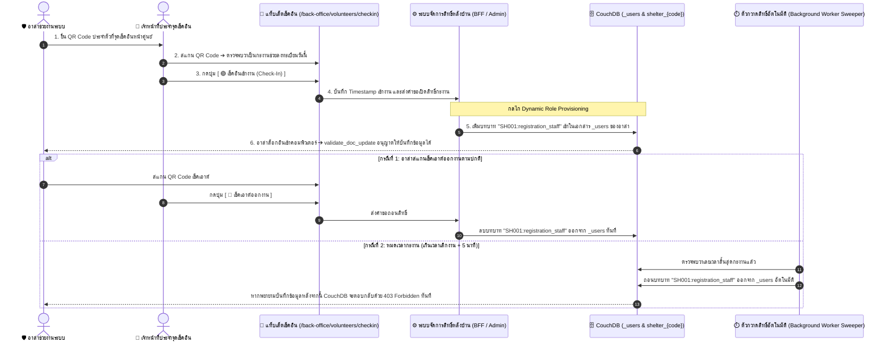
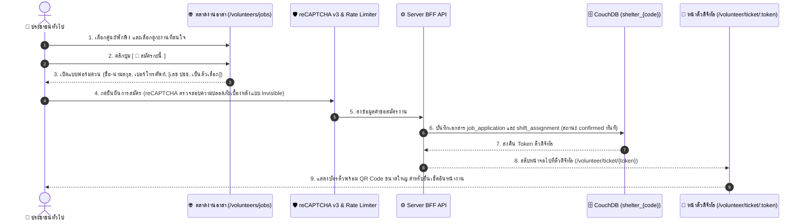

# CR-104 — Volunteer Backoffice & User Management V10 (ฉบับรวมสมบูรณ์ — Single Source of Truth)

> 🟢 **สถานะเอกสาร:** `approved` — ผ่านการอนุมัติอย่างเป็นทางการจากเจ้าของโครงการ (Project Owner) เมื่อวันที่ 1 กันยายน 2026 เพื่อใช้เป็นเอกสารแม่บทฉบับสมบูรณ์ฉบับเดียวจบ (Single Source of Truth: SSOT) สำหรับระบบบริหารจัดการงานจิตอาสาและการจัดการบัญชีผู้ใช้งาน (รวบรวมและยกระดับ CR-092, CR-096, CR-101, CR-102, CR-103)

---

## บทสรุปผู้บริหารและสาระสำคัญ (Executive Summary & TL;DR)

เอกสารฉบับนี้รวบรวมและปฏิรูปสถาปัตยกรรมระบบบริหารจัดการงานจิตอาสา (Volunteer Management System) และระบบจัดการบัญชีผู้ใช้งาน (User Management System) ให้ตรงกับสภาพความเป็นจริงหน้างานของศูนย์พักพิงในภาวะภัยพิบัติ โดยมีสาระสำคัญดังนี้:

1. **สถาปัตยกรรมระบบจิตอาสาแบบตลาดงานเท่านั้น (Job Board Model Only):**
   * **ยกเลิกระบบเสนองานตรง (Direct Dispatch) และรหัสเสียง 2 ปัจจัย (CR-096):** ตัดความซับซ้อนของการจ่ายงานออกทั้งหมด เปลี่ยนมาใช้ระบบที่อาสาสมัครเป็นฝ่ายเลือกดูงานและสมัครเป็นงานๆ ไปผ่านกระดานงาน
   * **โควตากำลังพล 2 สีเรียบง่าย:** แสดงยอดเป้าหมายแบบ `[ 🟢 รับแล้ว (Confirmed) | ⚪ ว่าง/ยังขาด (Remaining) ]`
   * **การยกเลิกด้วยมือ (Manual Cancellation):** หากอาสาไม่มาปฏิบัติงาน หรือติดภารกิจ เจ้าหน้าที่หลังบ้านสามารถกดยกเลิกหรือระบุว่าไม่มา (Mark No-Show) ด้วยมือได้ทันที โดยระบบจะคืนโควตากลับไปเป็นช่องว่างสีขาวอัตโนมัติ
   * **ยกเลิกการโอนย้ายอาสาข้ามศูนย์ (`volunteer_transfer`):** ตัดเอกสารและระบบโอนย้ายทิ้ง เนื่องจากอาสาสามารถเลือกสมัครงานในศูนย์พักพิงใดก็ได้ตามความสะดวก
2. **การสมัครงานภาคประชาชนแบบไร้แรงเสียดทาน (Zero-Friction Public Application):**
   * ประชาชนทั่วไป (Operational Volunteer) **ไม่ต้องมีบัญชีผู้ใช้งาน (No Account)** ในระบบ
   * สมัครผ่านหน้าเว็บสาธารณะ (`/volunteers/jobs`) ได้ใน 30 วินาที โดยกรอกเพียง **ชื่อ-นามสกุล และเบอร์โทรศัพท์** (เลขประจำตัวประชาชน 13 หลักเป็นตัวเลือกเสริม) โดยไม่ใช้รหัสยืนยันผ่านข้อความมือถือ (No-SMS OTP) ป้องกันสแปมด้วย reCAPTCHA v3
   * รับ **ตั๋วดิจิทัล (Digital Ticket Pass)** พร้อมคิวอาร์โค้ด (QR Code) ทันที ณ เส้นทาง `/volunteer/ticket/:token`
   * ตรวจสอบตารางงานและดึงตั๋ว QR Code ทั้งหมดได้ง่ายๆ เพียงกรอกเบอร์โทรศัพท์ตนเองในพอร์ทัลบริการจิตอาสา (`/volunteer/portal`)
3. **จุดรับรายงานตัวและเช็คอินหน้าศูนย์พักพิง (On-Site Check-in & Self Check-in Station):**
   * ประจำการ ณ เส้นทาง `/back-office/volunteers/checkin` รองรับหน้าจอแท็บเล็ตแบบจุดบริการ (POS Split Layout 40/60)
   * **รองรับการรายงานตัว 2 รูปแบบ:**
     * **Staff-Assisted Check-In:** เจ้าหน้าที่ประจำจุดสแกน QR Code หรือค้นหาด้วยเบอร์โทรเพื่อกดยืนยันเข้างาน และบันทึกชื่อผู้รับรายงานตัว (`check_in_by`) ในประวัติการทำงาน (Audit Trail)
     * **Volunteer Self Check-in:** อาสาสมัครสามารถใช้มือถือของตนเองสแกนป้ายคิวอาร์โค้ดประจำศูนย์พักพิง (Poster Wall QR Code) หรือสแกนผ่านตู้แท็บเล็ตอัตโนมัติ (Kiosk Mode) เพื่อลดคิวสะสมหน้าศูนย์
   * รองรับการรับอาสาที่เดินเข้ามาหน้างาน (Walk-in Registration) โดยคีย์ข้อมูลด่วนได้ใน 30 วินาที
4. **การควบคุมสิทธิ์ตามช่วงเวลากะงานแบบผสมผสาน (Hybrid Time-Bound Shift Access Control):**
   * สำหรับอาสาที่ต้องช่วยคีย์ข้อมูลเข้าระบบ (Staff-Capable Volunteer) เจ้าหน้าที่หลังบ้านจะเป็นผู้ออกบัญชีผู้ใช้งานให้เฉพาะรายบุคคล
   * **ควบคุมสิทธิ์ที่ฐานข้อมูล CouchDB เป็นแกนหลัก:** เมื่ออาสาสแกนเช็คอินเข้างานในเวลากะ ($\pm 5$ นาที) ระบบจะเพิ่มบทบาทชั่วคราว (Dynamic Role Provisioning) เช่น `SH001:registration_staff` เข้าในบัญชีผู้ใช้ และเมื่อเช็คเอาต์หรือหมดเวลากะงาน ตัวกวาดสิทธิ์อัตโนมัติ (Background Worker Sweeper) จะถอนบทบาทออกทันที
   * ป้องกันการส่งคำขอเขียนข้อมูลลงฐานข้อมูล CouchDB โดยตรงนอกเวลากะงานได้อย่างสมบูรณ์ (HTTP 403 Forbidden)
5. **การขยาย 10 บทบาท และบทบาทระบุศูนย์พักพิง (10 Role Taxonomy & Compound Scoped Roles):**
   * ขยายบทบาทเป็น 10 หน้าที่เฉพาะทางตามความเป็นจริงหน้างาน (รวมบทบาท `medical_staff` และ `triage_staff` สำหรับงานคัดกรองและการดูแลสุขภาพ)
   * ผู้ใช้งาน 1 คนสามารถถือครองได้หลายบทบาทในศูนย์เดียวกัน และสามารถปฏิบัติงานข้ามหลายศูนย์พักพิงได้พร้อมกัน โดยระบุบทบาทแยกรายศูนย์ เช่น `[shelter:SH001, shelter:SH002, SH001:volunteer_coordinator, SH001:facility_staff, SH002:supply_coordinator]` ป้องกันปัญหาสิทธิ์รั่วไหลข้ามศูนย์ (Privilege Bleeding)
   * **ผู้จัดการศูนย์ (`shelter_manager`):** มีอำนาจสูงสุดในการบริหารจัดการทุกบทบาทในศูนย์ของตนเอง รวมถึงงานคัดกรองและการแพทย์

---

## 1. คำศัพท์และนิยามเชิงสถาปัตยกรรม (Architecture & Domain Glossary)

เพื่อสร้างความเข้าใจที่ตรงกันและลดความสับสนจากตัวย่อทางเทคนิค เอกสารฉบับนี้กำหนดนิยามของคำศัพท์หลักไว้ดังนี้:

* **CouchDB (ฐานข้อมูลหลักของศูนย์พักพิง):** ระบบจัดการฐานข้อมูลเอกสารที่ใช้เป็นแหล่งจัดเก็บข้อมูลความจริงหลัก (Source of Record) ของแต่ละศูนย์พักพิง โดยแต่ละศูนย์จะมีฐานข้อมูลแยกขาดจากกันในชื่อ `shelter_{code}` (เช่น `shelter_sh001`)
* **MongoDB (ฐานข้อมูลข้อมูลสาธารณะ):** ฐานข้อมูลสำหรับจัดเก็บข้อมูลที่ผ่านการตัดข้อมูลส่วนบุคคล (PII Redaction) แล้ว เพื่อนำไปแสดงผลบนหน้าเว็บไซต์สาธารณะให้ประชาชนทั่วไปเปิดดูได้อย่างรวดเร็วและปลอดภัย
* **Remote-First (สถาปัตยกรรมเข้าถึงฐานข้อมูลโดยตรง):** สถาปัตยกรรมหลักของระบบ Smart Shelter ที่หน้าเว็บบราวเซอร์ของเจ้าหน้าที่ติดต่อและส่งคำขอบันทึกข้อมูลตรงไปยัง CouchDB โดยใช้คุกกี้เซสชันประจำตัว (`_session`) โดยไม่ต้องผ่านเซิร์ฟเวอร์ตัวกลางทุกครั้ง เพื่อประสิทธิภาพสูงสุดในพื้นที่ภัยพิบัติ
* **Server BFF (Backend-For-Frontend):** บริการเซิร์ฟเวอร์ตัวกลางของระบบที่ทำหน้าที่อำนวยความสะดวกเฉพาะจุด เช่น การสมัครงานจากหน้าเว็บสาธารณะ, การตรวจสอบ reCAPTCHA, และการออกสิทธิ์บัญชีผู้ใช้
* **Audit Trail (บันทึกประวัติการทำงาน):** บันทึกร่องรอยที่ระบุว่าผู้ใช้คนใด (`actor`), กระทำสิ่งใด (`action`), ต่อข้อมูลใด (`target`), ณ เวลาใด (`timestamp`), และด้วยเหตุผลใด เพื่อความโปร่งใสและตรวจสอบย้อนหลังได้
* **Operational Volunteer (อาสาสมัครทั่วไป):** อาสาสมัครที่ช่วยงานทางกายภาพ (ครัว, ยกของ, แจกของ) **ไม่ต้องมีบัญชีผู้ใช้งานในระบบ** ใช้เพียงตั๋วดิจิทัล QR Code
* **Staff-Capable Volunteer (อาสาช่วยงานระบบ):** อาสาสมัครที่ได้รับมอบหมายให้ช่วยใช้คอมพิวเตอร์คีย์ข้อมูลหลังบ้าน **ต้องมีบัญชีผู้ใช้งาน** ที่เจ้าหน้าที่เป็นผู้ออกให้ และสิทธิ์จะถูกเปิด-ปิดตามเวลากะงานจริง
* **Compound Scoped Roles (บทบาทระบุศูนย์):** โครงสร้างการบันทึกสิทธิ์ที่ประกอบด้วยรหัสศูนย์และชื่อหน้าที่ เช่น `SH001:volunteer_coordinator` เพื่อจำกัดขอบเขตอำนาจให้อยู่เฉพาะในศูนย์นั้นๆ

---

## 2. สถาปัตยกรรมความปลอดภัยและระบบควบคุมสิทธิ์ (Security & Access Spine)

### 2.1 โครงสร้างบทบาทผู้ใช้งาน 10 บทบาท (The 10-Role Taxonomy)

ระบบขยายบทบาทผู้ใช้งานให้ครอบคลุมการปฏิบัติงานจริงในศูนย์พักพิง 10 บทบาท ดังนี้:

| ลำดับ | รหัสบทบาท (RoleKey) | ชื่อบทบาท (ภาษาไทย) | ขอบเขตความรับผิดชอบหลัก |
| :---: | :--- | :--- | :--- |
| 1 | `system_admin` | ผู้ดูแลระบบส่วนกลาง | มีสิทธิ์สูงสุดระดับสากล (Global Access) เข้าถึงและจัดการได้ทุกศูนย์พักพิง, จัดการบัญชีผู้ใช้, กำหนดค่าระบบส่วนกลาง และกู้คืนข้อมูล |
| 2 | `shelter_manager` | ผู้จัดการศูนย์พักพิง | ควบคุมการปฏิบัติงานทั้งหมดภายในศูนย์ของตนเอง มีอำนาจครอบคลุมสิทธิ์ของบทบาทที่ 3 ถึง 10 ทั้งหมดในศูนย์นั้น รวมถึงข้อมูลการคัดกรองและการแพทย์ |
| 3 | `registration_staff` | เจ้าหน้าที่รับลงทะเบียน | บันทึกข้อมูลทะเบียนประวัติผู้อพยพ (Evacuees), ข้อมูลครัวเรือน, ยานพาหนะ, สัตว์เลี้ยง, การเช็คอิน-เช็คเอาต์ประจำวัน และออกบัตรประจำตัว |
| 4 | `triage_staff` | เจ้าหน้าที่คัดกรอง | คัดกรองกลุ่มเปราะบาง (ผู้สูงอายุ, ผู้พิการ, เด็ก, สตรีมีครรภ์) และคัดแยกผู้ป่วยเบื้องต้นเพื่อส่งต่อไปยังพื้นที่พักพิงที่เหมาะสม |
| 5 | `medical_staff` | เจ้าหน้าที่การแพทย์และพยาบาล | บันทึกข้อมูลสุขภาพ, ประวัติการรักษาพยาบาลเบื้องต้น, การจ่ายยา, การเฝ้าระวังโรคติดต่อ และการส่งต่อผู้ป่วยไปยังโรงพยาบาลภายนอก |
| 6 | `kitchen_staff` | เจ้าหน้าที่ครัวกลาง | วางแผนรายการอาหารประจำวัน (Meal Planning), คำนวณวัตถุดิบและแก๊สหุงต้ม, เบิกจ่ายวัตถุดิบ, และบันทึกยอดการแจกจ่ายอาหาร |
| 7 | `supply_coordinator` | ผู้ประสานงานพัสดุและคลัง | รับมอบสิ่งของบริจาค, จัดการคลังพัสดุ, ตัดจ่ายสิ่งของจำเป็น, เบิกถุงยังชีพ, และควบคุมระดับสต็อกขั้นต่ำ |
| 8 | `volunteer_coordinator` | ผู้ประสานงานจิตอาสา | สร้างประกาศภารกิจงานอาสา (`job`), ดูแลกระดานงาน, จัดสรรกะงาน, ดูแลจุดเช็คอินแท็บเล็ตหน้าศูนย์, และออกสิทธิ์ระบบให้อาสาช่วยงาน |
| 9 | `security_officer` | เจ้าหน้าที่รักษาความปลอดภัย | ควบคุมความสงบเรียบร้อย, บันทึกเหตุการณ์ความไม่ปลอดภัย (Incidents), จัดการพื้นที่หวงห้าม, และเฝ้าระวังจุดเข้า-ออกศูนย์ |
| 10 | `facility_staff` | เจ้าหน้าที่ฝ่ายอาคารสถานที่ | จัดการโซนที่พัก (Zoning), บริหารจัดการเต็นท์และพื้นที่นอน, ดูแลระบบไฟฟ้า น้ำประปา สุขาภิบาล และการซ่อมบำรุงอาคาร |

---

### 2.1.1 นโยบายการมองเห็นข้อมูลสุขภาพและโรคคัดกรอง (Health & Screening Visibility Policy)

* **ลักษณะของข้อมูลสุขภาพในศูนย์พักพิง:** ข้อมูลโรคและอาการในระบบเป็น **"ข้อมูลการคัดกรองสุขภาพเบื้องต้นระยะสั้นหน้างาน (Non-sensitive Short-Term Screening Flags)"** เช่น อาการไข้, ท้องเสีย, บาดแผล, โรคประจำตัวที่ต้องระวังเป็นพิเศษ (หอบหืด, เบาหวาน), หรือข้อจำกัดทางกายภาพ
* **การเปิดให้ทุกคนในศูนย์มองเห็น (Shelter-Wide Visibility):**
  * เจ้าหน้าที่ทุกบทบาทที่ปฏิบัติงานในศูนย์พักพิงนั้น (`shelter:{code}`) **สามารถมองเห็นข้อมูลโรคและอาการจากการคัดกรองได้ทั้งหมด** เพื่อการเตรียมความพร้อมในการปฏิบัติงานอย่างถูกต้องและปลอดภัย:
    * ฝ่ายครัวกลาง (`kitchen_staff`): จัดเตรียมอาหารเฉพาะโรค / หลีกเลี่ยงอาหารที่แพ้
    * ฝ่ายอาคารสถานที่ (`facility_staff`): จัดโซนพักให้เหมาะสม เช่น ใกล้ห้องน้ำ หรือแยกโซนผู้มีอาการไข้หวัดเพื่อลดการแพร่กระจายเชื้อ
    * ฝ่ายรักษาความปลอดภัย (`security_officer`): เข้าช่วยเหลือและเคลื่อนย้ายผู้มีข้อจำกัดทางร่างกายกรณีเกิดเหตุฉุกเฉินได้ทันท่วงที
* **สิทธิ์ในการบันทึกข้อมูลการแพทย์และคัดกรอง (Write Permission):**
  * การบันทึกและแก้ไขข้อมูลเวชระเบียนการรักษาและการคัดกรอง (`medical_record`, `triage_assessment`) สงวนไว้สำหรับผู้ถือบทบาท `medical_staff`, `triage_staff`, หรือ `shelter_manager` เท่านั้น

---

### 2.2 โครงสร้างบทบาทระบุศูนย์ใน CouchDB (Compound Scoped Roles Architecture)

เพื่อแก้ไขปัญหา **ปัญหาสิทธิ์รั่วไหลข้ามศูนย์ (Role / Privilege Bleeding)** จากเดิมที่ผูกได้เพียง 1 ศูนย์ต่อ 1 บัญชี ระบบเปลี่ยนมาใช้โครงสร้างบทบาทแบบผสมระบุศูนย์ในฟิลด์ `roles` ของเอกสารผู้ใช้ (`_users`) ดังนี้:

```json
{
  "_id": "org.couchdb.user:somchai.staff",
  "name": "somchai.staff",
  "type": "user",
  "roles": [
    "shelter:SH001",
    "shelter:SH002",
    "SH001:volunteer_coordinator",
    "SH001:facility_staff",
    "SH002:supply_coordinator"
  ],
  "personnel_type": "staff",
  "volunteer_id": "vol_01J6M78ABCDEF",
  "active": true
}
```

#### กฎการทำงานของบทบาท 2 ระดับ:
1. **ระดับเปิดเข้าสู่ฐานข้อมูล (`shelter:{code}`):** ทำหน้าที่เป็นกุญแจผ่านประตูฐานข้อมูล (Database Access Gate) ในออบเจกต์ความปลอดภัย `_security.members.roles` ของฐานข้อมูล `shelter_{code}` หากไม่มีบทบาทนี้ บราวเซอร์จะไม่สามารถเชื่อมต่อเข้าอ่านข้อมูลในฐานข้อมูลศูนย์นั้นได้เลย
2. **ระดับตรวจสอบสิทธิ์การบันทึก (`{code}:{capability}`):** ทำหน้าที่ตรวจสอบอำนาจในการสร้างหรือแก้ไขเอกสารในฟังก์ชัน `validate_doc_update` ของฐานข้อมูลนั้นๆ เช่น นายสมชายมีสิทธิ์จัดการงานอาสาและอาคารสถานที่ในศูนย์ `SH001` แต่เมื่อเปิดดูศูนย์ `SH002` จะมีสิทธิ์จัดการเฉพาะงานคลังพัสดุเท่านั้น
3. **ข้อยกเว้นสำหรับผู้ดูแลระบบส่วนกลาง (`system_admin`):** บันทึกเป็นบทบาทเดี่ยว `roles: ["system_admin"]` โดยไม่มีชื่อศูนย์นำหน้า และได้รับสิทธิ์ผ่านประตูและการตรวจสอบเอกสารในทุกศูนย์พักพิงโดยอัตโนมัติ

---

### 2.3 การตรวจสอบสิทธิ์ในระดับฐานข้อมูล CouchDB (`validate_doc_update`)

ในเอกสารออกแบบการเข้าถึง (`_design/access`) ของทุกฐานข้อมูลศูนย์พักพิง `shelter_{code}` ฟังก์ชัน `validate_doc_update` จะต้องตรวจสอบสิทธิ์แบบ Compound Roles ดังนี้:

```javascript
function (newDoc, oldDoc, userCtx, secObj) {
  // 1. อนุญาตผู้ดูแลระบบส่วนกลาง (Global System Admin) เสมอ
  if (userCtx.roles.indexOf('system_admin') !== -1 || userCtx.roles.indexOf('_admin') !== -1) {
    return;
  }

  var shelterCode = 'SH001'; // กำหนดตามรหัสศูนย์ของฐานข้อมูลนั้นๆ

  // 2. ผู้จัดการศูนย์ (Shelter Manager) มีสิทธิ์เต็มทุกการบันทึกในศูนย์ตนเอง
  if (userCtx.roles.indexOf(shelterCode + ':shelter_manager') !== -1) {
    return;
  }

  // 3. ตรวจสอบสิทธิ์เฉพาะด้านตามประเภทของเอกสาร (Document Type Isolation)
  function requireRole(roleKey) {
    if (userCtx.roles.indexOf(shelterCode + ':' + roleKey) === -1) {
      throw({ forbidden: 'ERR_PERMISSION_DENIED: ต้องการสิทธิ์ ' + shelterCode + ':' + roleKey });
    }
  }

  var docType = newDoc.type;

  if (docType === 'person' || docType === 'household') {
    requireRole('registration_staff');
  } else if (docType === 'medical_record' || docType === 'triage_assessment' || docType === 'health_screening') {
    if (userCtx.roles.indexOf(shelterCode + ':medical_staff') === -1 &&
        userCtx.roles.indexOf(shelterCode + ':triage_staff') === -1) {
      throw({ forbidden: 'ERR_PERMISSION_DENIED: สงวนสิทธิ์เฉพาะเจ้าหน้าที่การแพทย์หรือคัดกรอง' });
    }
  } else if (docType === 'meal_plan' || docType === 'meal_service') {
    requireRole('kitchen_staff');
  } else if (docType === 'inventory_item' || docType === 'stock_ledger') {
    requireRole('supply_coordinator');
  } else if (docType === 'job' || docType === 'job_application' || docType === 'shift_assignment' || docType === 'volunteer') {
    requireRole('volunteer_coordinator');
  } else if (docType === 'security_incident') {
    requireRole('security_officer');
  } else if (docType === 'zone' || docType === 'facility_asset') {
    requireRole('facility_staff');
  }
}
```

---

### 2.4 กลไกการควบคุมสิทธิ์ตามเวลากะงาน (Hybrid Time-Bound Shift Access Control)

สำหรับอาสาช่วยงานระบบ (Staff-Capable Volunteer) ที่ต้องได้รับสิทธิ์บันทึกข้อมูลชั่วคราว ระบบบังคับใช้การควบคุมสิทธิ์แบบสองชั้น:



---

## 3. วงจรการทำงานของระบบงานจิตอาสา (Volunteer System Workflows)

### 3.1 Flow 1: การประกาศภารกิจงานอาสาในระบบหลังบ้าน (Job & Daily Shifts Creation)

1. ผู้จัดการศูนย์ (`shelter_manager`) หรือผู้ประสานงานจิตอาสา (`volunteer_coordinator`) เข้าสู่ระบบหลังบ้านที่ `/back-office/volunteers`
2. คลิกปุ่ม **`[ + ประกาศภารกิจงานอาสาใหม่ ]`** เพื่อเปิดฟอร์มสร้างงาน
3. กำหนดข้อมูลภารกิจ:
   * ชื่องาน (เช่น "ผู้ช่วยจัดเตรียมวัตถุดิบและแจกจ่ายอาหารมื้อกลางวัน")
   * ระดับงาน (`tier`): `operational` (งานทั่วไป ไม่ต้องใช้บัญชี) หรือ `staff-capable` (งานช่วยระบบ ต้องมีบัญชี)
   * รายการทักษะที่ต้องการ (เลือกจาก Master List เช่น การทำอาหาร, การยกของ, ทักษะคอมพิวเตอร์)
4. **เพิ่มกะย่อยรายวัน (`shifts[]`):**
   * กำหนดวันทำงาน (`date` ในรูปแบบ `YYYY-MM-DD`)
   * เวลาเริ่มและเวลาสิ้นสุด เช่น `08:00` ถึง `12:00`
   * โควตาจำนวนคนที่ต้องการในกะนี้ เช่น ต้องการ 10 คน
   * *กฎกะข้ามเที่ยงคืน:* หากเป็นงานที่คาบเกี่ยวเที่ยงคืน ให้แยกสร้างเป็น 2 กะย่อยตามวันปฏิทิน เช่น กะที่หนึ่ง `22:00 - 23:59` ของวันแรก และกะที่สอง `00:00 - 06:00` ของวันถัดไป
5. ระบบคำนวณโควตารวมของงานโดยอัตโนมัติ:
   $$\text{Total Job Quota} = \sum_{i=1}^{n} \text{shift}_i.\text{quota}$$
6. เมื่อกดบันทึกเป็นสถานะเปิดรับ (`status: 'open'`) ตัวดึงข้อมูล (Worker Projector) จะแปลงข้อมูลภารกิจไปเก็บใน MongoDB คอลเลกชัน `public_jobs` ทันที

---

### 3.2 Flow 2: การสมัครงานภาคประชาชนแบบไร้แรงเสียดทาน (Public No-SMS Apply Flow)



* **การรักษาความปลอดภัยและความเป็นส่วนตัว (PDPA Compliance):**
  * หน้าตั๋วดิจิทัลจะ **ไม่ส่งและไม่แสดงเลขประจำตัวประชาชน 13 หลัก (`national_id`)** ออกมาทางหน้าจอเด็ดขาด
  * เบอร์โทรศัพท์จะถูกแสดงผลแบบปิดบังบางส่วน (Masked) เช่น `081-xxx-1234`
  * ประชาชนสามารถกดบันทึกรูป QR Code ลงเครื่อง หรือแชร์ลิงก์ตั๋วเก็บไว้ได้ทันที

---

### 3.3 Flow 3: การตรวจสอบตารางงานส่วนบุคคลผ่านพอร์ทัล (Self-Service Schedule Lookup)

สำหรับอาสาสมัครที่สมัครไว้หลายงาน หลายกะ หรือหลายศูนย์พักพิง:
1. เข้าไปที่หน้าพอร์ทัลบริการจิตอาสาที่ `/volunteer/portal` หรือแท็บ `[ 🎫 ค้นหาตั๋วของฉัน ]` บนหน้าตลาดงาน
2. กรอกเพียง **เบอร์โทรศัพท์ของตนเอง** (ไม่ต้องใช้รหัสผ่านและไม่ต้องรอ SMS OTP)
3. ระบบจะทำการค้นหาตารางงานทั้งหมดที่ผูกกับเบอร์โทรนี้ และแสดงผลเป็นการ์ดรายการตารางงานแบบอ่านอย่างเดียว (Read-Only Schedule Cards)
4. อาสาสามารถกดดูตั๋วดิจิทัลของแต่ละกะงาน หรือกดปุ่มยกเลิกการสมัครล่วงหน้าได้ด้วยตนเอง

---

### 3.4 Flow 4: จุดรับรายงานตัวและเช็คอินหน้าศูนย์พักพิง (On-Site Check-In & Self Check-In Station)

ระบบรองรับการรายงานตัวเข้าปฏิบัติงาน 2 รูปแบบเพื่อความยืดหยุ่นและลดความแออัดหน้าศูนย์:

#### รูปแบบที่ 1: Staff-Assisted Check-In (เจ้าหน้าที่รับรายงานตัว)
1. เจ้าหน้าที่ประจำจุดตรวจ (ผู้จัดการศูนย์, ผู้ประสานงานจิตอาสา หรือเจ้าหน้าที่ลงทะเบียน) ล็อกอินเข้าแท็บเล็ตและเปิดหน้าจอ `/back-office/volunteers/checkin`
2. **หน้าจอจัดวางแบบแบ่งส่วน (Split Layout 40/60):**
   * **ฝั่งซ้าย (40% - กล้องสแกน):** เปิดกล้องแท็บเล็ตพร้อมสแกน QR Code ตั๋วดิจิทัลของอาสาสมัครอัตโนมัติ พร้อมช่องพิมพ์ค้นหาด่วน (เบอร์โทรศัพท์ หรือชื่อ)
   * **ฝั่งขวา (60% - การ์ดยืนยันตัวตน):** แสดงการ์ดข้อมูลอาสาขนาดใหญ่เมื่อสแกนเจอ (ชื่อ, เบอร์โทร, กะงานประจำวัน, ทักษะ)
3. เจ้าหน้าที่กดปุ่ม **`[ 🟢 เช็คอินเข้างาน (Check-In) ]`** ➔ บันทึกเวลาเข้างาน `check_in_at` พร้อมบันทึกชื่อเจ้าหน้าที่ผู้รับรายงานตัวลงในฟิลด์ `check_in_by`
4. **กรณีอาสาเดินเข้ามาช่วยงานหน้าศูนย์ (Walk-in Registration):** เจ้าหน้าที่กดปุ่ม `[ + ลงทะเบียน Walk-in ด่วน ]` กรอกชื่อ-เบอร์โทร และเลือกกะงานเพื่อเช็คอินเริ่มงานได้ใน 30 วินาที

#### รูปแบบที่ 2: Volunteer Self Check-In (อาสารายงานตัวด้วยตนเอง)
* **วิธี A (Poster Wall QR Code — สแกนป้ายคิวอาร์โค้ดประจำศูนย์):**
  * ศูนย์พักพิงพิมพ์ป้าย QR Code ประจำศูนย์แปะไว้ที่ทางเข้า
  * อาสาสมัครเปิดหน้าตั๋วบนมือถือตนเอง (`/volunteer/ticket/:token`) กดปุ่ม **`[ 📷 สแกนป้ายศูนย์เพื่อเช็คอิน ]`**
  * สแกนป้ายที่ผนัง ➔ ยืนยันการมาถึงศูนย์และบันทึกเวลาเช็คอินอัตโนมัติทันที
* **วิธี B (Tablet Kiosk Mode — ตู้แท็บเล็ตสแกนอัตโนมัติ):**
  * แท็บเล็ตตั้งไว้ที่ขาตั้งหน้าศูนย์ในโหมด Kiosk
  * อาสาสมัครนำ QR Code บนมือถือตนเองมาส่องหน้ากล้องแท็บเล็ต ➔ ระบบส่งเสียง Beep และบันทึกเช็คอินสำเร็จโดยไม่ต้องรอเจ้าหน้าที่กดปุ่ม

---

### 3.5 Flow 5: การยกเลิกงานและการจัดการกรณีไม่มาปฏิบัติงาน (Cancellation & Manual No-Show)

เพื่อรักษาความเรียบง่ายตามความต้องการของเจ้าหน้าที่หน้างาน:
* **อาสายกเลิกเองล่วงหน้า:** อาสาสามารถกดปุ่ม `[ ❌ ขอยกเลิกการสมัคร ]` บนหน้าตั๋วดิจิทัลของตนเอง
* **เจ้าหน้าที่กดยกเลิกหน้างาน (Manual Cancel / Mark No-Show):**
  * หากเลยเวลากะงานแล้วอาสาไม่มาปฏิบัติงาน เจ้าหน้าที่เปิดหน้าจอทำเนียบกะงานหลังบ้าน แล้วคลิกที่แถบของอาสาคนนั้น เลือกปุ่ม **`[ ⚠️ ไม่มาปฏิบัติงาน (Mark No-Show) ]`** หรือ **`[ ❌ ยกเลิกกะงาน ]`**
  * ระบบจะเปลี่ยนสถานะในเอกสาร `shift_assignment` เป็น `no_show` หรือ `cancelled`
  * โควตากำลังพลบนกระดานงานจะคืนยอดกลับไปเป็น **⚪ ช่องว่าง (Remaining)** ทันที เพื่อให้เจ้าหน้าที่เปิดรับคนอื่นเข้ามาทดแทนได้อย่างโปร่งใส

---

## 4. ข้อกำหนดโครงสร้างข้อมูลฉบับมาตรฐาน (Canonical Data Schemas)

เปรียบเทียบการเปลี่ยนแปลงของโครงสร้างข้อมูล (Schemas) ในระบบฐานข้อมูล CouchDB:

### 4.1 `volunteer` — ทะเบียนประวัติจิตอาสา (Schema v3)

* **รูปแบบไอดี:** `volunteer:{ulid}`
* **ความรับผิดชอบ:** จัดเก็บประวัติส่วนบุคคล ทักษะ และสถานะการปฏิบัติงานในศูนย์

```typescript
interface VolunteerDocV3 {
  _id: string;                          // volunteer:{ulid}
  _rev?: string;
  type: 'volunteer';
  schema_v: 3;                          // ปรับรุ่นเป็น v3
  first_name: string;                   // บังคับ
  last_name: string;                    // บังคับ
  phone: string;                        // บังคับ (กุญแจหลักในการระบุตัวตน)
  phone_hash?: string;                  // สำหรับค้นหาแบบไม่เปิดเผยข้อมูลส่วนบุคคล
  national_id?: string | null;          // ตัวเลือกเสริม (Optional)
  personnel_type: 'volunteer' | 'staff';// แยกประเภทชัดเจน: อาสาสมัครทั่วไป หรือเจ้าหน้าที่ประจำ
  skills: string[];                     // รายการทักษะความสามารถ
  checked_in: boolean;                  // สถานะกำลังปฏิบัติงานสดหน้างาน (true/false)
  current_shelter_code?: string | null; // รหัสศูนย์ที่กำลังปฏิบัติงานอยู่ในปัจจุบัน
  user_name?: string | null;            // ชื่อผู้ใช้ใน _users (เฉพาะอาสาช่วยงานระบบ Staff-Capable)
  status: 'active' | 'inactive';
  created_at: string;
  updated_at: string;
}
```

---

### 4.2 `job` — ประกาศภารกิจงานอาสาและกะย่อยรายวัน (Schema v3)

* **รูปแบบไอดี:** `job:{ulid}`
* **ความรับผิดชอบ:** ประกาศงานภารกิจของศูนย์ พร้อมตารางกะย่อยรายวันและการคำนวณโควตา

```typescript
interface JobShiftItem {
  shift_id: string;                     // ไอดีเฉพาะของกะ เช่น sft_01J6M78...
  date: string;                         // วันที่ปฏิบัติงาน รูปแบบ YYYY-MM-DD
  start_time: string;                   // เวลาเริ่ม เช่น "08:00"
  end_time: string;                     // เวลาสิ้นสุด เช่น "12:00"
  quota: number;                        // จำนวนคนที่ต้องการในกะนี้
  slots_confirmed: number;              // จำนวนคนที่ได้ตั๋วยืนยันแล้ว
  slots_remaining: number;              // จำนวนคนที่ยังขาดอยู่ (quota - slots_confirmed)
}

interface JobDocV3 {
  _id: string;                          // job:{ulid}
  _rev?: string;
  type: 'job';
  schema_v: 3;                          // ปรับรุ่นเป็น v3
  title: string;                        // ชื่องานภารกิจ
  description?: string;                 // รายละเอียดงาน
  tier: 'operational' | 'staff-capable';// ประเภทงาน: ทั่วไป หรือ ช่วยระบบ
  required_role?: string | null;        // บทบาทที่ต้องออกให้กรณีเป็น staff-capable
  auto_accept: boolean;                 // อนุมัติตั๋วอัตโนมัติทันทีหรือไม่
  shifts: JobShiftItem[];               // รายการกะย่อยรายวัน (ตัดรอบเที่ยงคืน)
  quota: number;                        // โควตารวมทั้งภารกิจ (derive จาก sum of shifts[].quota)
  slots_confirmed: number;              // ยอดรับรวมทั้งภารกิจ (derive จาก sum of shifts[].slots_confirmed)
  slots_remaining: number;              // ยอดยังขาดรวมทั้งภารกิจ (derive จาก sum of shifts[].slots_remaining)
  status: 'draft' | 'open' | 'almost_full' | 'full' | 'paused' | 'closed' | 'cancelled';
  created_by: string;                   // ชื่อผู้ใช้เจ้าหน้าที่ผู้สร้างงาน
  shelter_code: string;
  created_at: string;
  updated_at: string;
}
```

---

### 4.3 `shift_assignment` — การมอบหมายกะงานและการเช็คอิน (Schema v3)

* **รูปแบบไอดี:** `shift_assignment:{ulid}`
* **ความรับผิดชอบ:** ติดตามการเข้าปฏิบัติหน้าที่ของอาสาสมัครในแต่ละกะงาน และประวัติการเช็คอิน

```typescript
interface ShiftAssignmentDocV3 {
  _id: string;                          // shift_assignment:{ulid}
  _rev?: string;
  type: 'shift_assignment';
  schema_v: 3;                          // ปรับรุ่นเป็น v3 (ตัด dispatched และ response_code ทิ้ง)
  job_id: string;                       // อ้างอิง job:{ulid}
  shift_id: string;                     // อ้างอิง shift_id ภายใน job.shifts[]
  volunteer_id: string;                 // อ้างอิง volunteer:{ulid}
  duty_window: {
    start_ts: string;                   // Timestamp เริ่มกะงานจริง
    end_ts: string;                     // Timestamp สิ้นสุดกะงานจริง
  };
  check_in_at?: string | null;          // เวลาที่สแกนเช็คอินเข้างาน
  check_out_at?: string | null;         // เวลาที่สแกนเช็คเอาต์ออกงาน
  check_in_by?: string | null;          // ชื่อผู้ใช้ของเจ้าหน้าที่ผู้รับรายงานตัว (หรือ 'self_service')
  status: 'assigned' | 'checked_in' | 'completed' | 'no_show' | 'cancelled';
  shelter_code: string;
  created_at: string;
  updated_at: string;
}
```

---

### 4.4 `job_application` — ใบสมัครงานจิตอาสาและตั๋วดิจิทัล (Schema v2)

* **รูปแบบไอดี:** `job_application:{ulid}`
* **ความรับผิดชอบ:** บันทึกข้อมูลการยื่นใบสมัครจากประชาชน และออกรหัสตั๋วสำหรับสร้าง QR Code

```typescript
interface JobApplicationDocV2 {
  _id: string;                          // job_application:{ulid}
  _rev?: string;
  type: 'job_application';
  schema_v: 2;                          // ปรับรุ่นเป็น v2
  job_id: string;                       // อ้างอิง job:{ulid}
  shift_ids: string[];                  // กะงานที่เลือกสมัคร
  volunteer_id?: string | null;         // ลิงก์ไปยังทะเบียนอาสา
  applicant: {
    first_name: string;
    last_name: string;
    phone: string;
    national_id?: string | null;        // ทางเลือกเสริม
    skills: string[];
  };
  tracking_token: string;               // รหัส Token สุ่มความยาวคงที่สำหรับเปิดหน้าตั๋ว
  status: 'confirmed' | 'pending_review' | 'cancelled';
  shelter_code: string;
  created_at: string;
  updated_at: string;
}
```

---

### 4.5 `_users` — บัญชีผู้ใช้งานระบบหลังบ้าน (CouchDB User Document Metadata)

* **รูปแบบไอดี:** `org.couchdb.user:{username}`
* **ความรับผิดชอบ:** บัญชีผู้ใช้งานสำหรับล็อกอินเข้าทำงานในระบบหลังบ้าน

```typescript
interface CouchUserDoc {
  _id: string;                          // org.couchdb.user:{username}
  name: string;                         // Username (แนะนำเป็น Email)
  type: 'user';
  roles: string[];                      // Compound Scoped Roles เช่น ["shelter:SH001", "SH001:registration_staff"]
  personnel_type: 'staff' | 'volunteer';// แยกชัดเจนว่าเป็นเจ้าหน้าที่ประจำ หรืออาสาช่วยงานระบบ
  volunteer_id?: string | null;         // ลิงก์สองทางไปยัง volunteer:{ulid}
  active: boolean;                      // เปิด/ปิดการเข้าใช้งานระบบ
  must_change_password?: boolean;       // บังคับเปลี่ยนรหัสผ่านในการเข้าใช้งานครั้งแรก
}
```

---

## 5. แผนผังเส้นทางหน้าจอระบบ (Routing Table & Screen Specifications)

| กลุ่มผู้ใช้ | เส้นทาง (Route URL) | สิทธิ์การเข้าถึง | วัตถุประสงค์และหน้าที่หลัก |
| :--- | :--- | :--- | :--- |
| **Public** | `/volunteers/jobs` (หรือ `/volunteer`) | ทุกคน (No-Auth) | กระดานประกาศงานจิตอาสาสาธารณะ (Job Board) พร้อมตัวกรองศูนย์และทักษะ |
| **Public** | `/volunteer/ticket/:token` | ผู้ถือ Token ตั๋ว | หน้าแสดงตั๋วดิจิทัลส่วนบุคคล (Clean Single Pass) พร้อมรูป QR Code ขนาดใหญ่ และปุ่ม Self Check-in |
| **Public** | `/volunteer/portal` | ค้นหาด้วยเบอร์โทร | พอร์ทัลจิตอาสาสำหรับตรวจสอบตารางงานทั้งหมดที่เคยลงทะเบียนไว้ (อ่านอย่างเดียว) |
| **Back-Office** | `/back-office/volunteers` | `shelter_manager`, `volunteer_coordinator` | แดชบอร์ดจัดการงานจิตอาสาหลังบ้าน (แท็บ: กระดานงาน, กะงานปฏิบัติการ, ทะเบียนอาสา) |
| **Back-Office** | `/back-office/volunteers/checkin` | `shelter_manager`, `volunteer_coordinator`, `registration_staff` | หน้าจอแท็บเล็ตจุดรับรายงานตัวและเช็คอินหน้าศูนย์ (POS Layout 40/60 + โหมด Kiosk สแกนอัตโนมัติ) |
| **Back-Office** | `/back-office/users` หรือ `/portal/system-management/users` | `system_admin`, `shelter_manager` (เฉพาะศูนย์ตน) | จัดการบัญชีผู้ใช้, กำหนด 10 บทบาทแบบระบุศูนย์, และออกสิทธิ์ให้อาสาช่วยงานระบบ |

---

## 6. เกณฑ์การส่งมอบและการทดสอบระบบ (Acceptance Criteria & DoD)

* [ ] **AC-104-01 (Job Board Only & No Dispatch):** ระบบงานจิตอาสาทำงานผ่านกระดานงานเท่านั้น ไม่มีปุ่มหรือฟังก์ชันเสนองานตรง (Direct Dispatch) และไม่มีการสร้างรหัสเสียง 2 ปัจจัย
* [ ] **AC-104-02 (2-Color Quota Bar):** แถบโควตาทั้งในหน้าสาธารณะและหลังบ้านแสดงผล 2 สีอย่างถูกต้อง: `[ 🟢 รับแล้ว | ⚪ ว่าง/ยังขาด ]` และคำนวณยอดรวมของงานจากผลรวมของกะย่อย (`job.shifts[]`) ทั้งหมดได้แม่นยำ
* [ ] **AC-104-03 (Midnight Shift Split):** กะงานที่จัดทำในระบบยึดตามวันปฏิทินเดี่ยว หากเป็นงานข้ามคืนต้องถูกบันทึกแยกเป็น 2 กะย่อยตัดรอบเวลา 00:00 น.
* [ ] **AC-104-04 (No-SMS Fast Registration):** ประชาชนทั่วไปสามารถสมัครงานผ่านหน้าเว็บได้โดยกรอกเพียงชื่อ-นามสกุล และเบอร์โทรศัพท์ (ไม่บังคับเลขบัตรประชาชน) ได้รับตั๋ว QR Code ภายใน 30 วินาที โดยไม่เสียค่าใช้จ่าย SMS OTP
* [ ] **AC-104-05 (Staff-Assisted & Self Check-In):** หน้าจอ `/back-office/volunteers/checkin` รองรับทั้งการที่เจ้าหน้าที่กดเช็คอินให้ และการทำ Self Check-in ผ่านการสแกนป้ายคิวอาร์โค้ดประจำศูนย์ (Poster Wall QR) หรือผ่านแท็บเล็ต Kiosk Mode
* [ ] **AC-104-06 (Manual Cancellation / No-Show):** เจ้าหน้าที่สามารถกดยกเลิกการมอบหมายงานหรือระบุว่าอาสาไม่มาปฏิบัติงาน (Mark No-Show) ผ่านหน้าจอหลังบ้านได้ด้วยมือ และระบบจะคืนยอดโควตาสีขาวทันที
* [ ] **AC-104-07 (Dynamic Role Provisioning & Revocation):** เมื่ออาสาช่วยงานระบบ (Staff-Capable) สแกนเช็คอินเข้างาน ระบบจะเพิ่มบทบาทชั่วคราวเข้าใน `_users.roles` และเมื่อเช็คเอาต์หรือหมดเวลากะงาน ตัวกวาดสิทธิ์ (Sweeper Daemon) จะถอนบทบาทออกทันที
* [ ] **AC-104-08 (Compound Scoped Roles Enforcement):** ฟังก์ชัน `validate_doc_update` ของ CouchDB ปฏิเสธคำขอบันทึกข้อมูลจากผู้ใช้ที่ไม่มีบทบาทตรงตามรหัสศูนย์ เช่น ผู้มีสิทธิ์ `SH001:registration_staff` ไม่สามารถเขียนข้อมูลลงในฐานข้อมูล `shelter_SH002` ได้
* [ ] **AC-104-09 (Active Workspace Selector):** เมนูดร็อปดาวน์บนแถบนำทางด้านบนแสดงเฉพาะศูนย์ที่ผู้ใช้มีสิทธิ์เข้าถึง และเมื่อเลือกศูนย์ใด ระบบจะประเมินบทบาทเฉพาะของศูนย์นั้นมาใช้งานโดยอัตโนมัติ
* [ ] **AC-104-10 (No Transfer Document):** ยืนยันการตัดเอกสารชนิด `volunteer_transfer` ออกจากฐานข้อมูลและข้อกำหนดของระบบทั้งหมด
* [ ] **AC-104-11 (Medical & Triage Permissions):** บันทึกบทบาท `medical_staff` และ `triage_staff` สำหรับงานคัดกรองและการดูแลสุขภาพ โดยให้เจ้าหน้าที่ทุกบทบาทในศูนย์สามารถอ่านข้อมูลอาการคัดกรองสุขภาพได้ เพื่อการเตรียมความพร้อมในการดูแล

---

## 7. ประวัติการตัดสินใจและการบันทึกการเปลี่ยนแปลง (Decision Log)

* **2026-08-31 — Initial Draft:** เปิดร่าง CR-104 เพื่อวางแผนรวบรวม CR-101, CR-102, และ CR-103 เข้าด้วยกัน
* **2026-09-01 — Relentless Review & Final Ratification (Grilling Session with Project Owner):**
  1. **รวบเอกสารทั้งหมดเป็นหนึ่งเดียว:** ปรับสถานะ CR-092, CR-096, CR-101, CR-102, และ CR-103 เป็น `superseded โดย CR-104`
  2. **ตัดความซับซ้อนของ Direct Dispatch:** ยกเลิกระบบเสนองานตรงและรหัสเสียง 2 ปัจจัย ยืนยันใช้โมเดลตลาดงานจิตอาสา (Job Board) เท่านั้น
  3. **ตัดระบบโอนย้ายข้ามศูนย์ (`volunteer_transfer`):** ให้อาสาสมัครสมัครงานรายกะข้ามศูนย์ได้โดยตรง ไม่ต้องมีขั้นตอนโอนย้าย
  4. **กำหนดกะย่อยตัดรอบเที่ยงคืน:** กะงานต้องอยู่ภายในวันปฏิทินเดี่ยวเพื่อความเรียบง่ายและแม่นยำในการคำนวณเวลาปฏิบัติงาน
  5. **ยืนยันการบังคับใช้ 10 บทบาทและ Compound Roles ทันที:** ยกระดับการตรวจสอบสิทธิ์ในฐานข้อมูล CouchDB (`validate_doc_update`) ให้รองรับบทบาทระบุศูนย์และครอบคลุมทั้ง 10 บทบาท (รวม `medical_staff` และ `triage_staff` สำหรับการคัดกรองและการดูแลสุขภาพ)
  6. **ผู้จัดการศูนย์ครอบคลุมอำนาจเต็ม:** ผู้จัดการศูนย์มีสิทธิ์ดูแลทุกมิติในศูนย์ตนเอง รวมถึงงานคัดกรองและการแพทย์
  7. **รองรับ Volunteer Self Check-in:** เพิ่มข้อกำหนดการรายงานตัวเข้างานด้วยตนเองผ่านป้ายคิวอาร์โค้ดประจำศูนย์ (Poster Wall QR Code) และโหมดแท็บเล็ต Kiosk อัตโนมัติ เพื่อลดความแออัดหน้าศูนย์พักพิง
