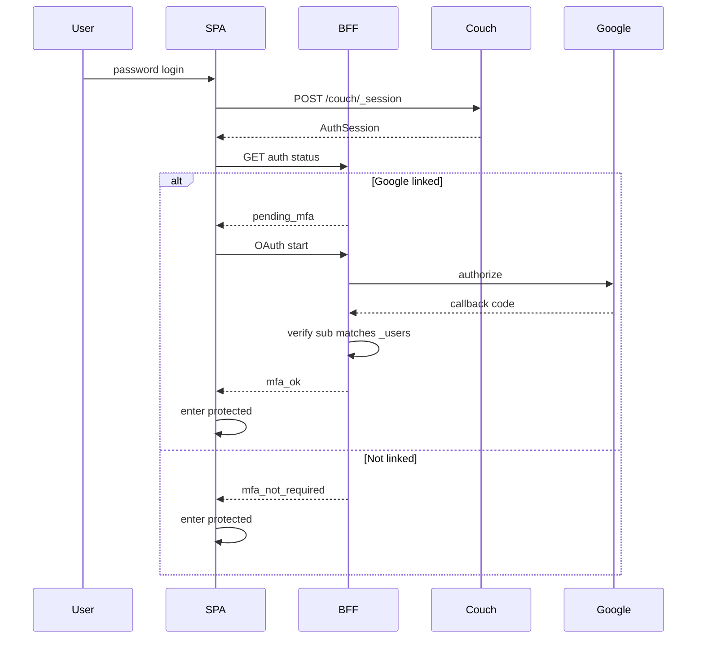

# CR-124: Staff Google step-up MFA — password + linked Google after login (Phase 1)

> **สรุป (TL;DR):**
>
> - **เปลี่ยนอะไร:** เพิ่ม Google เป็น **step-up MFA** หลัง login ด้วย username/password (CouchDB `AuthSession` คงเดิม) — user ที่ผูก Google แล้วต้องยืนยัน Google `sub` ก่อนเข้า `(protected)`; user ที่ยังไม่ผูกผ่านได้ตามเดิม
> - **เพื่อใคร/ทำไม:** ตอบนโยบาย MFA ของเซิร์ฟเวอร์โฮสต์ โดยไม่ทำ Google เป็น SSO หลัก และไม่แตะ Partner OAuth2 (`EXT-001`)
> - **Dev ต้อง build:** ฟิลด์ MFA บน `_users` · BFF OAuth start/callback/link/unlink · post-login gate (`pending_mfa`) · หน้า settings ให้ user ผูก Google · admin ดูสถานะ/unlink
> - **กระทบ schema/scope:** `docs/data/schema.md` §6 (additive บน `_users` เท่านั้น) · `docs/data/api-contract.md` §1.1 · **ไม่ bump `schema_v`** ของ shelter/ops docs · **ThaiD / SSO-without-password อยู่นอกขอบเขต**

---

## 1. Why

1. **Hosting MFA policy:** สภาพแวดล้อมที่โฮสต์ระบบต้องการปัจจัยที่สองหลังรหัสผ่านสำหรับบัญชี staff
2. **CouchDB ไม่มี OAuth/MFA native:** staff auth ปัจจุบันคือ `POST /couch/_session` + cookie `AuthSession` ([`api-contract.md`](../data/api-contract.md) §1.1) — MFA ต้องเป็นชั้นแอป/BFF บน session เดิม
3. **แยกจาก Partner OAuth2:** `EXT-001` / ADR 0002 เป็น machine `client_credentials` สำหรับ M6/M7 — ห้ามนำมาใช้หรือผสมกับ staff MFA
4. **Provisioning เดิมใช้ได้:** แอดมินสร้าง user + password อยู่แล้ว (CR-105) — ให้ user ผูก Google ทีหลัง ลดภาระตอน onboard

---

## 2. Change (before → after)

| | Before | After (Phase 1) |
| --- | --- | --- |
| Login factor 1 | username/password → `AuthSession` | เหมือนเดิม |
| Post-login gates | `must_change_password` / `has_security_question` → `/force-setup` (CR-105) | เดิม + ถ้ามี Google linked → `pending_mfa` จนกว่าจะ verify Google `sub` |
| MFA enroll | ไม่มี | User ที่ login แล้วผูก Google เองจาก settings/me (opt-in) |
| Admin create user | ใส่ password | เหมือนเดิม — **ไม่ต้อง**ใส่ Google ตอนสร้าง |
| IdP / SSO | ไม่มี | **ไม่ทำ** Google SSO (login โดยไม่ใช้ password) ใน Phase 1 |

### 2.1 Sequence (locked)

**Invariant:** `AuthSession` เกิดได้ก่อน MFA เสร็จ — แอป/BFF **ต้อง enforce `pending_mfa` จริง** (กันเข้า `(protected)` และกันเรียก service ที่ไม่ควรใช้ในสถานะค้าง MFA) ไม่ใช่แค่ซ่อนเมนูใน UI

**ลำดับ gate หลัง password (Phase 1):**  
1) CR-105 force-setup (`must_change_password` / security question) ถ้าเข้าเงื่อนไข → จบก่อน  
2) ถ้ามี Google linked และยังไม่ `mfa_ok` ในรอบ session นี้ → step-up MFA  
3) เข้าแอป

---

## 3. Requirements

### 3.1 Provisioning & enroll

- **FR-01 (Admin create unchanged):** การสร้าง/แก้ไข user ผ่าน `/api/v1/users` คง flow password เดิม — ฟอร์มสร้าง **ไม่มี** ช่องผูก Google
- **FR-02 (Self-link Google):** ผู้ใช้ที่ authenticated และผ่าน force-setup แล้ว ต้องผูกบัญชี Google ได้จากหน้า settings/me (account linking) โดยไม่ต้องให้แอดมินดำเนินการแทนใน happy path

### 3.2 `_users` storage

- **FR-03 (MFA fields on `_users`):** ขยายเอกสาร `_users` (additive) ตามตารางด้านล่าง — **ไม่** มี `schema_v` บน `_users` (เช่นเดียวกับ CR-027 / CR-105)

| Field | ชนิด | req | หมายเหตุ |
| --- | --- | --- | --- |
| `mfa` | object\|null | opt | `null` / ขาด field = ไม่ enrolled |
| `mfa.providers` | array | req เมื่อมี `mfa` | รายการ IdP ที่ผูกแล้ว |
| `mfa.providers[].type` | enum | req | Phase 1 อนุญาตเฉพาะ `"google"` |
| `mfa.providers[].subject` | str | req | Google OIDC `sub` (stable) — **ห้าม**ใช้ email เป็น identity หลัก |
| `mfa.providers[].email` | str\|null | opt | สำหรับแสดงผลเท่านั้น |
| `mfa.providers[].linked_at` | ISO ts | req | เวลาที่ผูกสำเร็จ |
| `mfa.providers[].verified_at` | ISO ts\|null | opt | เวลา verify ล่าสุด (ถ้าเก็บ) |

- **FR-03a (Uniqueness):** Google `subject` (`sub`) หนึ่งค่าผูกได้กับ `_users` เพียงหนึ่งเอกสาร — พยายาม link ทับของคนอื่น → `CONFLICT`
- **FR-03b (One Google per user in Phase 1):** แต่ละ user มี `type:"google"` ได้ไม่เกินหนึ่งรายการใน `mfa.providers`

### 3.3 Post-login step-up

- **FR-04 (Enforce when linked):** หลัง password login สำเร็จ ถ้า `_users` มี `mfa.providers` ที่ `type:"google"` → สถานะแอปเป็น `pending_mfa` จนกว่า BFF จะยืนยันว่า Google `sub` ตรงกับที่เก็บไว้ แล้วตั้ง `mfa_ok` สำหรับรอบ session นั้น
- **FR-04a (Not linked = pass-through):** ถ้ายังไม่มี Google ใน `mfa.providers` → **ไม่บังคับ** enroll ใน Phase 1 (opt-in) — เข้าแอปได้หลังผ่าน force-setup ตามเดิม
- **FR-04b (Wrong account):** callback ที่ได้ `sub` ไม่ตรงกับที่ผูกไว้ → ปฏิเสธ step-up; คง `pending_mfa`; แจ้งผู้ใช้ด้วย toast (ไม่ `console.log`)

### 3.4 BFF OAuth

- **FR-05 (Server-side OAuth):** มี BFF endpoints ภายใต้ `/api/v1/auth/oauth/google/` อย่างน้อย:
  - `start` — เริ่ม authorize (สำหรับ step-up หรือ link ตาม mode)
  - `callback` — รับ code, แลก token, อ่าน `sub`/`email`
  - การ link / unlink ที่ต้องการ session ของ user เป้าหมาย
- **FR-05a (Secrets):** `GOOGLE_OAUTH_CLIENT_ID` / `GOOGLE_OAUTH_CLIENT_SECRET` (หรือชื่อเทียบเท่าที่ล็อกตอน implement) อยู่ฝั่งเซิร์ฟเวอร์เท่านั้น — **ห้าม** `PUBLIC_*` และห้ามฝังใน SPA bundle
- **FR-05b (Redirect URI):** Authorized redirect URI ต้องชี้ BFF callback บนโดเมนโฮสต์จริง (เช่น `/api/v1/auth/oauth/google/callback`) — ค่า exact path ล็อกตอน implement ให้ตรง Google Cloud Console

### 3.5 Admin & recovery

- **FR-06 (Admin visibility + unlink):** หน้าจัดการผู้ใช้แสดงสถานะ MFA enrolled (มี Google linked หรือไม่) และแอดมินที่มีสิทธิ์จัดการ user นั้น unlink/reset การผูก Google ได้
- **FR-07 (Recovery still requires step-up):** หลัง forgot-password (security question) หรือ admin passphrase reset — ถ้า user ยังมี Google linked อยู่ ต้องผ่าน step-up MFA อีกครั้งก่อนเข้า `(protected)` (ห้ามถือว่า recovery ข้าม MFA)

### 3.6 Edge / central reachability

- **FR-08 (Central + Google required for step-up):** Phase 1 ทำ Google step-up ได้เฉพาะเมื่อ **central** และ **Google** เข้าถึงได้ — **ไม่** ประดิษฐ์ offline/edge MFA
- **FR-08a (Edge-only session):** ระหว่าง edge-only fallback ถ้า user enrolled แล้วแต่ทำ step-up ไม่ได้ → บล็อกเข้าแอปในสถานะที่ต้องการ MFA จนกว่า central จะกลับมา (ไม่ลดระดับความปลอดภัยด้วยการข้าม MFA อัตโนมัติ)

---

## 4. Out of scope (Phase 1)

- ThaiD (และ provider อื่นนอก `"google"`)
- Google SSO / login โดยไม่ใช้ password
- บังคับ enroll ทุกบัญชีหรือตาม role (Phase 1 = opt-in link; enforce เฉพาะเมื่อ linked แล้ว)
- TOTP / WebAuthn / SMS OTP เป็น MFA
- เปลี่ยน Partner OAuth2 (`EXT-001`) หรือ public-plane auth
- เปลี่ยน `_security` / `validate_doc_update` / shelter operational schemas

---

## 5. Acceptance Criteria (DoD)

- [ ] **AC-01:** สร้าง user ด้วย password แบบเดิมได้โดยไม่ต้องระบุ Google
- [ ] **AC-02:** User ที่ยังไม่ enroll login ด้วย password แล้วเข้าแอปได้ (หลัง force-setup ถ้ามี) โดยไม่ถูกบังคับไป Google
- [ ] **AC-03:** User ผูก Google จาก settings สำเร็จ และ `_users` เก็บ `type:"google"` + `subject` = Google `sub`
- [ ] **AC-04:** User ที่ enrolled แล้ว หลัง password login ถูกบังคับ step-up; จบ step-up ด้วย `sub` ที่ถูกต้องแล้วเข้า `(protected)` ได้
- [ ] **AC-05:** Step-up ด้วย Google account คนละ `sub` ถูกปฏิเสธ และยังเข้า `(protected)` ไม่ได้
- [ ] **AC-06:** Google `sub` ที่ผูกกับ user A แล้ว ห้าม link ให้ user B (`CONFLICT`)
- [ ] **AC-07:** Admin เห็นสถานะ enrolled และ unlink ได้; หลัง unlink user login ได้โดยไม่ต้อง step-up
- [ ] **AC-08:** หลัง forgot-password หรือ admin reset password ถ้ายัง linked อยู่ ต้อง step-up ก่อนเข้าแอป
- [ ] **AC-09:** Client secret ไม่ปรากฏใน `PUBLIC_*` / bundle ฝั่งเบราว์เซอร์
- [ ] **AC-10:** Unit/integration ที่ครอบคลุม link uniqueness, auth status (`pending_mfa` / `mfa_not_required` / `mfa_ok`), และ gate ordering กับ force-setup ผ่าน; `pnpm check` ไม่ error ในส่วนที่แตะ

---

## 6. Impact / Changes by file

| File / area | Change |
| --- | --- |
| `docs/data/schema.md` §6 | เพิ่มฟิลด์ `mfa` / `mfa.providers[]` บน `_users` (หลัง approve) |
| `docs/data/api-contract.md` §1.1 | เอกสาร post-login MFA gate + BFF OAuth paths (หลัง approve) |
| `frontend/src/routes/api/v1/auth/me/+server.ts` | ขยายสถานะ: `mfa_enrolled`, `mfa_pending` / เทียบเท่า |
| `frontend/src/routes/api/v1/auth/oauth/google/*` | BFF start / callback / link / unlink (ใหม่) |
| `frontend/src/lib/server/user-service.ts` | อ่าน/เขียน `mfa`, uniqueness check, admin unlink |
| `frontend/src/lib/features/login/ui/login-form.svelte` | หลัง login ตรวจ MFA status (คู่กับ force-setup) |
| `frontend/src/routes/...` (MFA challenge page) | หน้า/flow step-up เมื่อ `pending_mfa` |
| `frontend/src/lib/stores/auth.svelte.ts` | สถานะ session-level `mfa_ok` / `pending_mfa` |
| `frontend/src/lib/guards/auth.ts` | กัน `(protected)` จนกว่า MFA ผ่านเมื่อ enrolled |
| `frontend/src/lib/features/users/**` | คอลัมน์/ปุ่มสถานะ MFA + admin unlink |
| settings / me UI | ปุ่มผูก/ถอด Google สำหรับ user |
| `frontend/.env.example` | เอกสารชื่อ env ของ Google OAuth (ไม่มีค่า secret) |

**ไม่กระทบ:** Mongo public projections, sync worker, Partner API, shelter doc types, `validate_doc_update` allowlists

---

## 7. Migration

**N/A** — ฟิลด์ additive บน `_users`  
- เอกสารเดิมที่ไม่มี `mfa` = ไม่ enrolled (พฤติกรรม login เหมือนก่อน Phase 1)  
- ไม่มี `schema_v` bump บน operational docs  
- ไม่ต้อง migrate CouchDB design docs สำหรับ MFA

---

## 8. Decision log

- 2026-09-15 — proposed
- 2026-09-15 — track = CR ไฟล์ใน `docs/changes/`; scope = Phase 1 Google step-up MFA only; password = factor 1; admin สร้าง user แล้ว user ผูกเองทีหลัง; enforce เฉพาะเมื่อ linked แล้ว (opt-in enroll)
- 2026-09-15 — ThaiD deferred (out of scope); Google SSO-without-password deferred
- 2026-09-15 — layer = **stable** (auth / `_session` post-login gate)
- 2026-09-15 — แยกชัดจาก Partner OAuth2 `EXT-001` / ADR 0002
- 2026-09-15 — **approved as CR-124** โดย project owner; อัปเดต `schema.md` §6 + `api-contract.md` §1.1; จองเลขบน `develop` — implementation ตามหลัง

---

## 9. Post-approve next steps

1. Implement ตาม FR/AC ใน CR นี้ (BFF OAuth, gate, UI link/unlink)
2. เมื่อ implement ครบและผ่าน AC → ตั้ง `status: done` ในไฟล์นี้และ [`_index.md`](_index.md)
