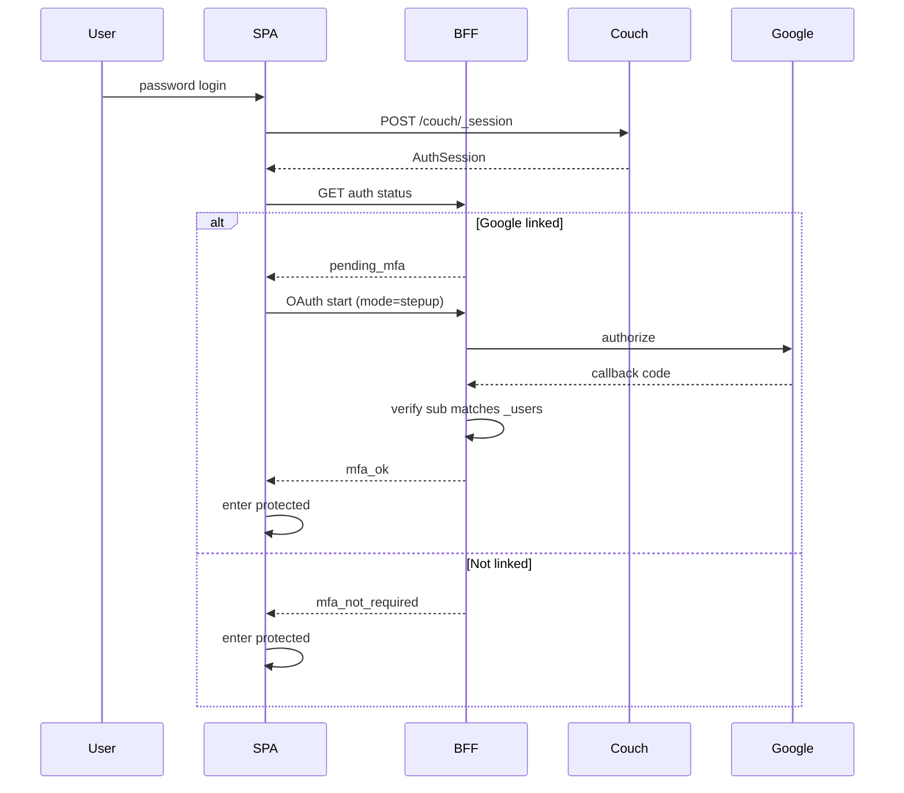
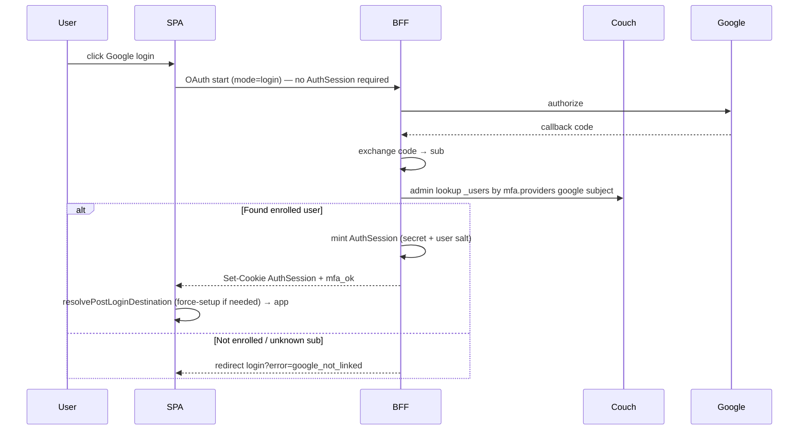

# CR-124: Staff Google MFA + SSO login for linked accounts

> **สรุป (TL;DR):**
>
> - **เปลี่ยนอะไร:** **Phase 1 (done):** Google เป็น step-up MFA หลัง password · **Phase 2:** ปุ่ม Google บนหน้า login สำหรับบัญชีที่ **ผูก Google แล้วเท่านั้น** — BFF ยืนยัน `sub` แล้ว **mint `AuthSession` cookie** + ตั้ง `mfa_ok` (ไม่ต้องใส่รหัสผ่าน)
> - **เพื่อใคร/ทำไม:** hosting MFA + ลด friction ตอน login สำหรับ staff ที่ enroll แล้ว โดยไม่ทำ Google เป็น IdP สำหรับบัญชีที่ยังไม่ผูก และไม่แตะ Partner OAuth2 (`EXT-001`)
> - **Dev ต้อง build (Phase 2):** ~~`mode=login` บน OAuth start/callback (ไม่ต้องมี session ก่อน) · lookup `_users` โดย Google `subject` · mint `AuthSession` จาก `chttpd_auth` secret + user `salt` · ปุ่ม Google บน `login-form.svelte` · จัดการ not-enrolled / wrong-account~~ **done**
> - **กระทบ schema/scope:** `api-contract.md` §1.1 (เพิ่ม Google SSO path) · **ไม่** เพิ่มฟิลด์ `_users` ใหม่ · **ไม่ bump `schema_v`** · ThaiD ยังอยู่นอกขอบเขต

**สถานะ:** Phase 1 = **done** · Phase 2 = **done** (implement 2026-09-16)

---

## 1. Why

1. **Hosting MFA policy:** สภาพแวดล้อมที่โฮสต์ระบบต้องการปัจจัยที่สองหลังรหัสผ่านสำหรับบัญชี staff
2. **CouchDB ไม่มี OAuth/MFA native:** staff auth ปัจจุบันคือ `POST /couch/_session` + cookie `AuthSession` ([`api-contract.md`](../data/api-contract.md) §1.1) — MFA และ Google login ต้องเป็นชั้นแอป/BFF
3. **แยกจาก Partner OAuth2:** `EXT-001` / ADR 0002 เป็น machine `client_credentials` สำหรับ M6/M7 — ห้ามนำมาใช้หรือผสมกับ staff MFA/SSO
4. **Provisioning เดิมใช้ได้:** แอดมินสร้าง user + password อยู่แล้ว (CR-105) — ให้ user ผูก Google ทีหลัง; Phase 2 เปิดทาง login ด้วย Google **หลัง** enroll แล้วเท่านั้น
5. **Phase 2 friction:** บัญชีที่ผูก Google แล้วไม่ต้องพิมพ์รหัสผ่านทุกครั้ง แต่บัญชีที่ยังไม่ผูก **ห้าม** ใช้ปุ่ม Google เพื่อสร้าง session

---

## 2. Change (before → after)

### 2.0 Phase overview

| | Before CR-124 | After Phase 1 | After Phase 2 |
| --- | --- | --- | --- |
| Login factor 1 | username/password → `AuthSession` | เหมือนเดิม | เหมือนเดิม **หรือ** Google login (enrolled only) |
| Post-login gates | force-setup (CR-105) | + `pending_mfa` เมื่อ linked | เหมือน Phase 1 เมื่อเข้าด้วย password; Google login ตั้ง `mfa_ok` ทันทีหลัง mint |
| MFA enroll | ไม่มี | Self-link จาก settings (opt-in) | เหมือน Phase 1 — **ยังไม่มี** enroll-via-login |
| Admin create user | password | เหมือนเดิม — ไม่ต้องใส่ Google | เหมือนเดิม |
| Google SSO | ไม่มี | **ไม่มี** | มี — เฉพาะ `mfa.providers` มี `type:"google"` |

### 2.1 Sequence — Phase 1 step-up (locked, done)

**Invariant (Phase 1):** `AuthSession` เกิดได้ก่อน MFA เสร็จ — แอป/BFF **ต้อง enforce `pending_mfa` จริง** (กันเข้า `(protected)` และกันเรียก service ที่ไม่ควรใช้ในสถานะค้าง MFA)

**ลำดับ gate หลัง password:**  
1) CR-105 force-setup ถ้าเข้าเงื่อนไข → จบก่อน  
2) ถ้ามี Google linked และยังไม่ `mfa_ok` → step-up MFA  
3) เข้าแอป

### 2.2 Sequence — Phase 2 Google login (enrolled only)

**Invariant (Phase 2):**  
- Google login **ไม่** สร้างบัญชีใหม่ และ **ไม่** enroll อัตโนมัติ  
- `AuthSession` ถูก mint เฉพาะเมื่อ `subject` ตรงกับ `_users` ที่ linked แล้ว  
- หลัง mint สำเร็จ ตั้ง `mfa_ok` ในรอบเดียวกัน (ถือว่าผ่านปัจจัย Google แล้ว — ไม่บังคับ step-up ซ้ำ)  
- ยังต้องเคารพ CR-105 force-setup ถ้า `must_change_password` / ขาด security question

---

## 3. Requirements

### 3.1 Provisioning & enroll

- **FR-01 (Admin create unchanged):** การสร้าง/แก้ไข user ผ่าน `/api/v1/users` คง flow password เดิม — ฟอร์มสร้าง **ไม่มี** ช่องผูก Google
- **FR-02 (Self-link Google):** ผู้ใช้ที่ authenticated และผ่าน force-setup แล้ว ต้องผูกบัญชี Google ได้จากหน้า settings/me (account linking) โดยไม่ต้องให้แอดมินดำเนินการแทนใน happy path

### 3.2 `_users` storage

- **FR-03 (MFA fields on `_users`):** ขยายเอกสาร `_users` (additive) ตามตารางด้านล่าง — **ไม่** มี `schema_v` บน `_users` (เช่นเดียวกับ CR-027 / CR-105)

| Field | ชนิด | req | หมายเหตุ |
| --- | --- | --- | --- |
| `mfa` | object\|null | opt | `null` / ขาด field = ไม่ enrolled |
| `mfa.providers` | array | req เมื่อมี `mfa` | รายการ IdP ที่ผูกแล้ว |
| `mfa.providers[].type` | enum | req | อนุญาตเฉพาะ `"google"` ใน CR นี้ |
| `mfa.providers[].subject` | str | req | Google OIDC `sub` (stable) — **ห้าม**ใช้ email เป็น identity หลัก |
| `mfa.providers[].email` | str\|null | opt | สำหรับแสดงผลเท่านั้น |
| `mfa.providers[].linked_at` | ISO ts | req | เวลาที่ผูกสำเร็จ |
| `mfa.providers[].verified_at` | ISO ts\|null | opt | เวลา verify ล่าสุด (ถ้าเก็บ) |

- **FR-03a (Uniqueness):** Google `subject` (`sub`) หนึ่งค่าผูกได้กับ `_users` เพียงหนึ่งเอกสาร — พยายาม link ทับของคนอื่น → `CONFLICT`
- **FR-03b (One Google per user):** แต่ละ user มี `type:"google"` ได้ไม่เกินหนึ่งรายการใน `mfa.providers`
- **FR-03c (Lookup by subject — Phase 2):** BFF ต้องหา `_users` จาก Google `subject` ได้สำหรับ mode=login (scan/`_find`/index ตามที่ implement ล็อก — ผลลัพธ์ต้องเป็น 0 หรือ 1 เอกสาร)

### 3.3 Post-login step-up (Phase 1)

- **FR-04 (Enforce when linked):** หลัง password login สำเร็จ ถ้า `_users` มี `mfa.providers` ที่ `type:"google"` → สถานะแอปเป็น `pending_mfa` จนกว่า BFF จะยืนยันว่า Google `sub` ตรงกับที่เก็บไว้ แล้วตั้ง `mfa_ok` สำหรับรอบ session นั้น
- **FR-04a (Not linked = pass-through):** ถ้ายังไม่มี Google ใน `mfa.providers` → **ไม่บังคับ** enroll (opt-in) — เข้าแอปได้หลังผ่าน force-setup ตามเดิม
- **FR-04b (Wrong account):** callback step-up ที่ได้ `sub` ไม่ตรงกับที่ผูกไว้ → ปฏิเสธ; คง `pending_mfa`; แจ้งด้วย toast

### 3.4 BFF OAuth

- **FR-05 (Server-side OAuth):** มี BFF endpoints ภายใต้ `/api/v1/auth/oauth/google/` อย่างน้อย:
  - `start` — เริ่ม authorize ตาม `mode`
  - `callback` — รับ code, แลก token, อ่าน `sub`/`email`
  - การ link / unlink ที่ต้องการ session ของ user เป้าหมาย
- **FR-05a (Secrets):** `GOOGLE_OAUTH_CLIENT_ID` / `GOOGLE_OAUTH_CLIENT_SECRET` อยู่ฝั่งเซิร์ฟเวอร์เท่านั้น — **ห้าม** `PUBLIC_*` และห้ามฝังใน SPA bundle
- **FR-05b (Redirect URI):** Authorized redirect URI ชี้ BFF callback บนโดเมนโฮสต์จริง
- **FR-05c (Modes):**
  | mode | ต้องมี AuthSession ก่อน? | ผลสำเร็จ |
  | --- | --- | --- |
  | `link` | ใช่ | เขียน `mfa.providers` + ตั้ง `mfa_ok` |
  | `stepup` | ใช่ | ตรวจ `sub` ตรง linked → ตั้ง `mfa_ok` |
  | `login` (Phase 2) | **ไม่** | lookup by `sub` → mint `AuthSession` + ตั้ง `mfa_ok` |

### 3.5 Admin & recovery

- **FR-06 (Admin visibility + unlink):** หน้าจัดการผู้ใช้แสดงสถานะ MFA enrolled และแอดมินที่มีสิทธิ์ unlink/reset การผูก Google ได้
- **FR-07 (Recovery still requires step-up):** หลัง forgot-password หรือ admin passphrase reset — ถ้ายัง linked อยู่ ต้อง step-up ก่อนเข้า `(protected)` เมื่อเข้าด้วย password
- **FR-07a (Unlink disables Google login):** หลัง unlink แล้ว ปุ่ม Google login ด้วย `sub` เดิมต้องล้มเหลว (`google_not_linked`); password login ไม่ต้อง step-up

### 3.6 Edge / central reachability

- **FR-08 (Central + Google required):** Google step-up และ Google login ทำได้เฉพาะเมื่อ **central** และ **Google** เข้าถึงได้ — **ไม่** ประดิษฐ์ offline/edge MFA หรือ edge Google SSO
- **FR-08a (Edge-only session):** ระหว่าง edge-only fallback ถ้า enrolled แล้วแต่ทำ step-up/Google login ไม่ได้ → บล็อกสถานะที่ต้องการ MFA/central จนกว่า central จะกลับมา

### 3.7 Phase 2 — Google login (enrolled only) + mint cookie

- **FR-09 (Login button):** หน้า login (`login-form.svelte`) มีปุ่ม Google ที่เริ่ม `mode=login` (เช่น `GET /api/v1/auth/oauth/google/start?mode=login`)
- **FR-09a (Not enrolled):** ถ้า `sub` ไม่ตรงกับ `_users` ใดที่มี Google linked → **ไม่** mint session; redirect กลับ `/login` พร้อม error ที่ UI แสดงด้วย toast (เช่น ต้อง login ด้วยรหัสผ่านแล้วผูก Google ใน Settings)
- **FR-09b (Mint AuthSession):** เมื่อพบ user ที่ enrolled แล้ว BFF ต้องสร้าง cookie `AuthSession` ที่ CouchDB ยอมรับ โดย:
  1. อ่าน cookie auth secret จาก CouchDB config (`chttpd_auth` / `couch_httpd_auth` — ชื่อ section ตามเวอร์ชันที่ deploy ใช้)
  2. อ่าน `salt` จากเอกสาร `_users` ของ user นั้น
  3. คำนวณ cookie ตามอัลกอริทึม Cookie Authentication ของ CouchDB:  
     `AuthSession = base64url( username + ":" + timestamp_hex + ":" + HMAC(secret||salt, username + ":" + timestamp_hex) )`  
     (hash algorithm ตาม `chttpd_auth/hash_algorithms` ของโหนด — implement ต้องตรงกับที่เซิร์ฟเวอร์ใช้ verify)
  4. `Set-Cookie` ให้เบราว์เซอร์ (path/HttpOnly/SameSite/Secure สอดคล้อง session ปกติของแอป) + ตั้ง `mfa_ok` ผูกกับ username
- **FR-09c (Secret handling):** secret ของ CouchDB อ่านได้เฉพาะฝั่งเซิร์ฟเวอร์ผ่าน admin client — **ห้าม** `PUBLIC_*` / bundle
- **FR-09d (No proxy-auth requirement):** Phase 2 **ไม่** บังคับเปิด CouchDB Proxy Authentication ทั้ง stack; mint cookie เป็นกลไกที่ล็อก
- **FR-09e (Post-login gates after Google login):** หลัง mint สำเร็จ ยังต้องผ่าน `resolvePostLoginDestination` — ถ้าติด force-setup → `/force-setup`; ไม่ติด → เข้าแอป (ไม่ส่งไป `/mfa-challenge` เพราะมี `mfa_ok` แล้ว)
- **FR-09f (Bootstrap admin):** ห้ามใช้ mode=login เพื่อเข้าสู่ระบบเป็น CouchDB bootstrap `_admin` ผ่านเส้นทางนี้ถ้าไม่ผ่านกฎ product ที่ล็อกตอน implement (default: อนุญาตเฉพาะ `_users` staff ที่มี Google linked ตาม FR-03)

---

## 4. Out of scope

- ThaiD (และ provider อื่นนอก `"google"`) — ดู draft ThaID แยกถ้ามี
- Google login สำหรับบัญชีที่ **ยังไม่** ผูก Google (ห้าม auto-provision / auto-enroll จากปุ่ม login)
- บังคับ enroll ทุกบัญชีหรือตาม role (ยังเป็น opt-in link)
- TOTP / WebAuthn / SMS OTP เป็น MFA
- เปลี่ยน Partner OAuth2 (`EXT-001`) หรือ public-plane auth
- เปลี่ยน `_security` / `validate_doc_update` / shelter operational schemas
- CouchDB Proxy Authentication เป็นกลไก SSO หลัก (ถูกตัด — ใช้ mint cookie แทน)

---

## 5. Acceptance Criteria (DoD)

### Phase 1 (done)

- [x] **AC-01:** สร้าง user ด้วย password แบบเดิมได้โดยไม่ต้องระบุ Google
- [x] **AC-02:** User ที่ยังไม่ enroll login ด้วย password แล้วเข้าแอปได้ (หลัง force-setup ถ้ามี) โดยไม่ถูกบังคับไป Google
- [x] **AC-03:** User ผูก Google จาก settings สำเร็จ และ `_users` เก็บ `type:"google"` + `subject` = Google `sub`
- [x] **AC-04:** User ที่ enrolled แล้ว หลัง password login ถูกบังคับ step-up; จบ step-up ด้วย `sub` ที่ถูกต้องแล้วเข้า `(protected)` ได้
- [x] **AC-05:** Step-up ด้วย Google account คนละ `sub` ถูกปฏิเสธ และยังเข้า `(protected)` ไม่ได้
- [x] **AC-06:** Google `sub` ที่ผูกกับ user A แล้ว ห้าม link ให้ user B (`CONFLICT`)
- [x] **AC-07:** Admin เห็นสถานะ enrolled และ unlink ได้; หลัง unlink user login ด้วย password ได้โดยไม่ต้อง step-up
- [x] **AC-08:** หลัง forgot-password หรือ admin reset password ถ้ายัง linked อยู่ ต้อง step-up ก่อนเข้าแอป
- [x] **AC-09:** Client secret ไม่ปรากฏใน `PUBLIC_*` / bundle ฝั่งเบราว์เซอร์
- [x] **AC-10:** Unit/integration ครอบคลุม link uniqueness, auth status, gate ordering กับ force-setup; `pnpm check` ผ่านในส่วนที่แตะ

### Phase 2 (done)

- [x] **AC-11:** หน้า login มีปุ่ม Google ที่เริ่ม OAuth `mode=login` โดยไม่ต้องมี `AuthSession` ก่อน
- [x] **AC-12:** บัญชีที่ผูก Google แล้ว กดปุ่ม → ได้ `AuthSession` ที่ `GET /couch/_session` รู้จักในชื่อ user นั้น + มี `mfa_ok` + เข้า `(protected)` ได้ (หลัง force-setup ถ้ามี)
- [x] **AC-13:** Google account ที่ยังไม่ถูก link กับ `_users` ใด → ไม่มี `AuthSession` ถูกตั้ง; กลับหน้า login พร้อมข้อความชัด
- [x] **AC-14:** หลัง admin/self unlink แล้ว ปุ่ม Google ด้วยบัญชีเดิมล้มเหลวตาม AC-13; password login ไม่ต้อง step-up
- [x] **AC-15:** Unit tests ครอบคลุม mint cookie (HMAC กับ secret+salt), lookup-by-subject, และ callback `mode=login` branches (enrolled / not enrolled)
- [x] **AC-16:** `docs/data/api-contract.md` §1.1 อัปเดตอธิบาย Google login + mint path; `pnpm check` / lint ที่แตะผ่าน

---

## 6. Impact / Changes by file

| File / area | Change |
| --- | --- |
| `docs/data/schema.md` §6 | Phase 1: ฟิลด์ `mfa` / `mfa.providers[]` — Phase 2: ไม่เพิ่มฟิลด์ |
| `docs/data/api-contract.md` §1.1 | Phase 1: MFA gate · Phase 2: Google SSO login (enrolled only) + mint `AuthSession` |
| `frontend/src/routes/api/v1/auth/me/+server.ts` | สถานะ `mfa_enrolled` / `pending_mfa` (Phase 1) |
| `frontend/src/routes/api/v1/auth/oauth/google/start` | Phase 2: รับ `mode=login` โดยไม่บังคับ session |
| `frontend/src/routes/api/v1/auth/oauth/google/callback` | Phase 2: lookup + mint `AuthSession` + `mfa_ok` |
| `frontend/src/lib/server/google-oauth.ts` | `GoogleOAuthMode` รวม `login`; helpers mint cookie / อ่าน secret |
| `frontend/src/lib/server/user-service.ts` | Phase 1: link/unlink · Phase 2: `findUserByGoogleSubject` |
| `frontend/src/lib/features/login/ui/login-form.svelte` | Phase 2: ปุ่ม Google + แสดง error จาก query |
| `frontend/src/routes/mfa-challenge/+page.svelte` | Phase 1 step-up UI |
| `frontend/src/lib/stores/auth.svelte.ts` / `guards/auth.ts` | session + gate (Phase 1; Phase 2 ใช้เส้นทางเดิมหลัง cookie ถูกตั้ง) |
| `frontend/src/lib/features/users/**` | admin MFA status + unlink |
| settings / me UI | ผูก/ถอด Google |
| `frontend/.env.example` | Google OAuth env (ไม่มี secret ใน repo) |

**ไม่กระทบ:** Mongo public projections, sync worker, Partner API, shelter doc types, `validate_doc_update` allowlists

---

## 7. Migration

**N/A** — ฟิลด์ additive บน `_users` (Phase 1)  
- เอกสารเดิมที่ไม่มี `mfa` = ไม่ enrolled (password login เหมือนก่อน CR-124; ปุ่ม Google login ใช้ไม่ได้จนกว่าจะ link)  
- ไม่มี `schema_v` bump บน operational docs  
- Phase 2 ไม่ต้อง migrate design docs; mint ใช้ config secret + `salt` ที่มีอยู่แล้วบน `_users`

---

## 8. Decision log

- 2026-09-15 — proposed
- 2026-09-15 — track = CR ไฟล์ใน `docs/changes/`; scope = Phase 1 Google step-up MFA only; password = factor 1; admin สร้าง user แล้ว user ผูกเองทีหลัง; enforce เฉพาะเมื่อ linked แล้ว (opt-in enroll)
- 2026-09-15 — ThaiD deferred (out of scope); Google SSO-without-password deferred (ตอนนั้น)
- 2026-09-15 — layer = **stable** (auth / `_session` post-login gate)
- 2026-09-15 — แยกชัดจาก Partner OAuth2 `EXT-001` / ADR 0002
- 2026-09-15 — **approved as CR-124** โดย project owner; อัปเดต `schema.md` §6 + `api-contract.md` §1.1
- 2026-09-16 — Phase 1 implementation → `status: done`
- 2026-09-16 — **Phase 2 scope locked โดย project owner:** (1) แก้ใน CR-124 เดิม ไม่เปิด draft ใหม่ (2) option **C** — Google login เฉพาะ enrolled (3) กลไก session = **mint `AuthSession` cookie** (ไม่ใช้ Proxy Auth) → ตั้ง `status: approved` สำหรับ Phase 2 implement
- 2026-09-16 — Phase 2 implementation → `status: done` (AC-11…AC-16)

---

## 9. Post-approve next steps

### Phase 1 — complete

1. ~~Implement BFF OAuth, gate, UI link/unlink~~
2. ~~ตั้ง `status: done`~~

### Phase 2 — complete

1. ~~อัปเดต `docs/data/api-contract.md` §1.1 ให้ครอบคลุม Google login + mint~~
2. ~~Implement `mode=login`, lookup-by-subject, mint cookie, ปุ่มบน login form, tests (AC-11…AC-16)~~
3. ~~`status: done` + [`_index.md`](_index.md) สะท้อน Phase 2 complete~~
