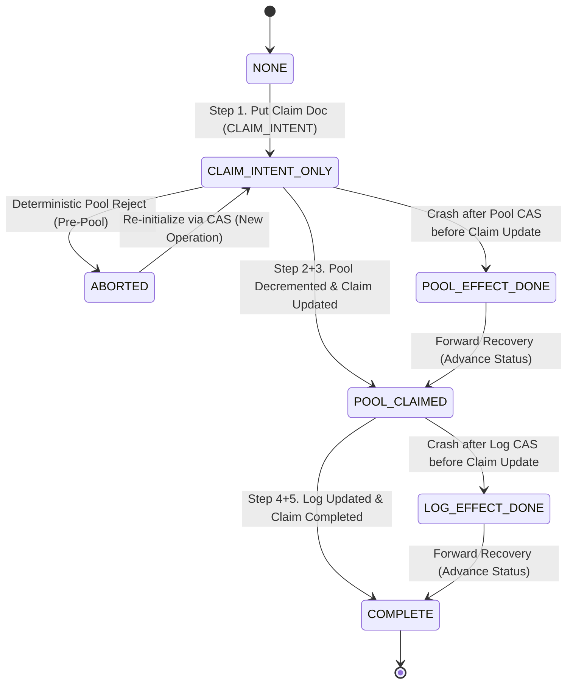

<!--
คำแนะนำการใช้งาน:
1. ตอนร่าง (proposed): ให้บันทึกไฟล์เป็น `docs/changes/draft-<slug>.md` และคง `id: draft` ไว้ (ยังไม่รันเลข CR-NNN ตาม change-management.md §3)
2. เมื่อเจ้าของโครงการ Approve:
   - ตรวจสอบหมายเลข CR ล่าสุดจาก `docs/changes/_index.md` (บน branch หลัก)
   - รันเลขถัดไป และ rename ไฟล์เป็น `docs/changes/CR-NNN-<slug>.md`
   - เปลี่ยน `id: draft` -> `id: CR-NNN`, `status: proposed` -> `status: approved`
   - เพิ่มแถวใน `docs/changes/_index.md`
-->

# CR-134: ระบบบันทึกการเคลียร์ของยืมแบบกองรวมและกลไกฟื้นฟูหลังขัดข้อง (Bulk Return Claim & Crash Recovery)

> [!NOTE]
> **สรุป (TL;DR):** แก้ปัญหา P1-02 โดยเพิ่มเอกสารประสานงานแบบ Deterministic ชนิดใหม่ **`bulk_return_claim:{distributionLogUlid}`** (`schema_v 1`) ผูกมัดสิทธิ์การเคลียร์กับรายการยืมรายตัวอย่างถาวร ป้องกันการแย่งสิทธิ์เคลียร์ซ้ำด้วย Operation ID ที่ต่างกัน · ปรับ `bulk_return_pool` สู่ **`schema_v 2`** เพิ่ม `claim_ids: string[]` บันทึก Claim Document ID เต็มรูปแบบในระดับพูล พร้อมรองรับ **In-Place Lazy Upgrade** สำหรับพูล v1 ที่เปิดใช้งานอยู่หน้างานโดยไม่ต้องรันสคริปต์ Migration · เพิ่มกลไก **Pre-flight Quota Check** ปฏิเสธคำสั่งก่อนสร้างเอกสาร และ **ABORTED Re-initialization Contract** ให้สามารถเริ่มรายการใหม่ผ่าน CAS ได้โดยไม่ล็อก Log ถาวร · แยกแยะความล้มเหลวชั่วคราว (Transient Errors) ไม่ให้กลายเป็นสถานะ `ABORTED` โดยไม่จำเป็น · บังคับความเท่ากันของยอดคืนสุดท้ายอย่างเคร่งครัด (`new_qty_returned == log.qty`) ก่อนปิดภาระยืม · ยืนยันการตรวจรับพัสดุครั้งเดียว ไม่สร้างแถว `stock_ledger` ซ้ำซ้อน

---

## 1. Why (บริบทและความจำเป็น)

### 1.1 ข้อจำกัดของโครงสร้างข้อมูลเดิม (The Current Blind Spot)
ในสถาปัตยกรรมปัจจุบันตาม [CR-121](CR-121-spec-ticket.md) และ [schema.md §2.31](../data/schema.md#231-bulk_return_pool--bulk_return_poolulid--schema_v-1-cr-121):
- `bulk_return_pool` จัดเก็บเพียงยอดรวมเชิงสถิติ (Aggregate Quota): `total_received_qty`, `claimed_qty`, และ `unclaimed_quota`
- `distribution_log` จัดเก็บข้อมูลการยืมรายบุคคล: `qty`, `qty_returned`, `clear_reason`, และ `bulk_pool_id`

เมื่อเจ้าหน้าที่ด่าน Check-out ทำการปลดภาระของยืมแบบกองรวม (Bulk Drop-off Clear via `clearLoanViaBulkPool`):
1. ระบบต้องตัดลดโควตาใน `bulk_return_pool` (CAS update)
2. ระบบต้องบันทึกปิดภาระใน `distribution_log` ให้เป็นสถานะ `returned` (`clear_reason: 'bulk_dropoff'`)

### 1.2 สภาพขัดข้องหลัง Crash (The Crash Recovery Dilemma)
เนื่องจาก CouchDB เป็นเอกสารฐานข้อมูลแบบ **No Cross-Document Transactions** (ไม่มี ACID ข้ามเอกสาร):
- หากระบบขัดข้อง (Crash, Network Timeout, Process Kill) ระหว่างขั้นตอนที่ 1 และขั้นตอนที่ 2:
  - `bulk_return_pool` ถูกตัดลดโควตาไปแล้วในฐานข้อมูล
  - แต่ `distribution_log` ยังคงมีสถานะ `active` เหมือนเดิม
- เมื่อผู้ใช้งานหรือ Client ทำการ Retry คำสั่งเดิม:
  - ระบบอ่าน `distribution_log` พบว่ายังไม่ถูกเคลียร์
  - ระบบไม่สามารถตรวจสอบได้ว่ายอด `claimed_qty` ใน Pool ที่เพิ่มขึ้นนั้น รวมยอดของ Log รายการนี้ไปแล้วหรือเกิดจากการเคลียร์ของ Log ตัวอื่นที่ทำงานพร้อมกัน
  - หากระบบตัดโควตาซ้ำ จะทำให้เกิด **Double Quota Decrement** (โควตาสูญเปล่าและพูลหมดก่อนความเป็นจริง)
  - หากระบบไม่ตัดโควตา อาจเกิด **Quota Leak** (ปลดภาระโดยไม่มีโควตารองรับจริง)

### 1.3 ความไม่ปลอดภัยของการใช้ operationUlid เพียงอย่างเดียว (Obligation Uniqueness Vulnerability)
หากสร้างเอกสาร Claim โดยใช้ Document ID อิงตาม `operationUlid` ของผู้เรียก (`bulk_return_claim:{operationUlid}`):
- `operationUlid` เป็นเพียงตัวระบุรอบการเรียกของ Client แต่ไม่ใช่ขอบเขตความเป็นเอกลักษณ์ของ "ภาระการยืม" (Loan Obligation Uniqueness)
- หากมี 2 คำสั่งที่ต่างกัน (Client A ส่ง `operationUlid: X`, Client B ส่ง `operationUlid: Y`) ร้องขอเคลียร์ Log $L$ เดียวกันในเวลาใกล้เคียงกัน:
  - เอกสาร `bulk_return_claim:X` และ `bulk_return_claim:Y` จะถูกสร้างขึ้นได้ทั้งคู่ (เพราะ ID ไม่ชนกัน)
  - ทั้งสองคำสั่งจะเข้าตัดโควตาใน `bulk_return_pool` ได้สำเร็จทั้งสองครั้ง
  - จากนั้นคำสั่งแรกจะอัปเดต Log $L$ สำเร็จ ส่วนคำสั่งที่สองจะล้มเหลว
  - **ผลลัพธ์:** พูลถูกตัดโควตาไป 2 หน่วยสำหรับของยืมเพียง 1 ชิ้น โควตาพูลสูญหายอย่างถาวร

ดังนั้น Claim Document ID จะต้องผูกเข้ากับ **`DistributionLog`** โดยตรง (`bulk_return_claim:{distributionLogUlid}`) เพื่อรับประกันว่าหนึ่งบันทึกการยืมจะมีเอกสารประสานงานเพื่อปลดภาระกองรวมได้ **ไม่เกิน 1 ฉบับอย่างเด็ดขาด**

### 1.4 ปัญหาการล็อก Log ถาวรเมื่อเกิดการยกเลิก (The ABORTED Lifecycle Lock Flaw)
หากคำสั่งแรกพยายามเคลียร์ Log $L$ ด้วยพูลที่โควตาหมด ทำให้เอกสาร Claim กลายเป็นสถานะ `ABORTED`:
- หากกำหนดให้ฟิลด์ทั้งหมดในเอกสาร Claim เป็น Immutable ตลอดกาล และสั่งห้ามใช้ Claim ID นั้นอีก Log $L$ จะถูก "ล็อกตาย" (Bricked) อย่างถาวร
- เมื่อมีพูลใหม่เปิดขึ้นในภายหลัง หรือมีของรับคืนเพิ่มเข้ามา เจ้าหน้าที่จะไม่สามารถเคลียร์ Log $L$ ได้อีกเลย เพราะ Claim ID เดิมชน HTTP 409 Conflict และถูกปฏิเสธตลอดไป
- ดังนั้นระบบต้องมีสัญญาการนำเอกสารที่ถูกยกเลิกกลับมาตั้งต้นใหม่ได้อย่างปลอดภัย (**ABORTED Re-initialization Contract**) ตราบใดที่ยังไม่เคยมีการตัดโควตาจริงเกิดขึ้น

---

## 2. Authority & Domain Invariants (ขอบเขตและหลักการความถูกต้อง)

### 2.1 สัจธรรมและแหล่งข้อมูลหลัก (Source of Truth Pillars)
ระบบต้องรักษาการแยกหน้าที่ของเอกสารไว้อย่างเคร่งครัด:
1. **Physical Inventory Truth:** `stock_ledger` (§2.1) เป็นความจริงสูงสุดของสต็อกพัสดุจริง (Append-Only)
2. **Business Handover & Loan Truth:** `distribution_log` (§2.30) เป็นความจริงสูงสุดของการยืม-คืนและการครอบครองพัสดุของบุคคล
3. **Physical Return Aggregate Quota:** `bulk_return_pool` (§2.31) เป็นโควตารวมของพัสดุที่รับคืนเข้าคลังมาแล้วในกะนั้น
4. **Claim Coordination & Crash Recovery Record:** `bulk_return_claim` (§2.32) เป็นเอกสารควบคุมกระบวนการ (Coordination Only) เพื่อประกัน Idempotency และ Crash Recovery ข้ามเอกสาร ไม่ใช่สต็อก ไม่ใช่ตั๋ว และไม่ใช่สัญญาการยืม

### 2.2 ข้อห้ามเด็ดขาด (Strict Negative Invariants)
- **ห้ามสร้าง `stock_ledger` ซ้ำตอนเคลียร์ของยืม:** การตรวจรับพัสดุกองรวมเข้าคลังได้บันทึก `stock_ledger` `reason='receive'` ไปแล้ว ณ ขั้นตอนสร้าง `bulk_return_pool` การเคลียร์ `distribution_log` ที่ด่าน Check-out เป็นเพียงการจับคู่สิทธิ์ จึง **ต้องไม่สร้างแถว `stock_ledger` เพิ่มอีกเด็ดขาด** (Stock Ledger Row Count = 0)
- **ห้ามฟื้นชีพเอกสารประวัติศาสตร์:** ห้ามนำ `distribution_request`, `distribution_batch`, `distribution_issue`, `LoanDropoffBatch`, `returns[]`, หรือ `RequisitionFulfillment` กลับมาใช้งาน
- **ขอบเขตเฉพาะทางและข้อจำกัดที่ยกยอด (Deferred Scope Boundary):** CR นี้มุ่งแก้เฉพาะกลไกความคงทนและการฟื้นฟูระหว่าง `bulk_return_pool` ↔ `distribution_log` เท่านั้น ไม่รวม UI Phase 5, Multi-tablet capacity gating, Food entitlement, หรือการออกแบบ Concurrency ระหว่าง Direct Return (คืนตรงที่เคาน์เตอร์) กับ Bulk Clear แข่งขันกันพร้อมกัน (หากมี race condition ระหว่างสอง flow นี้ ถือเป็น Deferred Limitation ที่จะจัดการในลำดับถัดไป)

---

## 3. Change (เปรียบเทียบก่อนและหลังปรับปรุง)

| มิติ | ก่อนปรับปรุง (Before) | หลังปรับปรุง (After) |
| :--- | :--- | :--- |
| **1. Identity ในการเคลียร์ของยืม** | ไม่มีเอกสารระบุตัวตนของการเคลียร์ แต่ละครั้งมีเพียงตัวเลขรวมใน Pool | ใช้ **`bulk_return_claim:{distributionLogUlid}`** ผูกกับภาระการยืม และเก็บ `operation_id: operationUlid` ในระดับ Attempt |
| **2. การแข่งขันเคลียร์ Log เดียวกันด้วยต่าง Operation ID** | เคลียร์พร้อมกัน 2 คำสั่งจะตัดโควตาพูลเบิ้ล 2 ครั้ง | คำสั่งที่สองชน CouchDB HTTP 409 Conflict บน Claim Doc ทันที และหยุดทำงาน (Fail Closed) ก่อนแตะต้องโควตาพูล |
| **3. โครงสร้างและการติดตามใน Pool** | พูลเก็บเพียงตัวเลข aggregate ไม่รู้ว่า Log ใดเคลียร์ไปแล้วบ้าง | ปรับ `bulk_return_pool` สู่ **schema_v 2** บันทึก `claim_ids: string[]` เก็บ Claim Document ID เต็มรูปแบบ |
| **4. การจัดการพูล v1 เดิมที่เปิดใช้งานอยู่** | ไม่มีนิยามที่ชัดเจน เสี่ยงต่อการปฏิเสธพูลเดิมและงานหน้าด่านหยุดชะงัก | รองรับ **In-Place Lazy Upgrade**: อัปเกรดพูล v1 เป็น v2 อัตโนมัติในจังหวะ CAS Claim แรก โดยไม่ต้องใช้สคริปต์ Migration |
| **5. กรณีพูลโควตาหมดและเคลียร์ไม่สำเร็จ** | เอกสาร Claim ค้างสถานะ ABORTED และทำให้ Log ตัวนั้นเคลียร์ไม่ได้อีกตลอดไป | มี **Pre-flight Quota Check** คัดกรองก่อนเขียน และมี **ABORTED Re-initialization Contract** ให้เปิด Claim ใหม่บนพูลอื่นได้ผ่าน CAS |
| **6. พฤติกรรมเมื่อระบบ Crash หลังอัปเดต Log สำเร็จ** | Replay ตรวจยอดค้างยืมจาก Log ซึ่งกลายเป็น 0 แล้วเกิด Assertion Mismatch | ถือ `claim.claimed_qty` เป็นยอดอ้างอิงเด็ดขาด (Immutable Authority); ตรวจพบ Log มีสถานะ `returned` และพูลตรงกัน ถือว่า Log effect สำเร็จแล้วและเลื่อนสู่ `COMPLETE` ทันที |
| **7. ข้อผิดพลาดชั่วคราว (Transient Failures)** | ไม่แยกแยะ เสี่ยงต่อการปรับสถานะเป็น `ABORTED` ทิ้งโควตาพูล | บังคับให้คงสถานะ `CLAIM_INTENT` เพื่อรองรับการ Retry; ห้าม Abort จากปัญหา Network/Timeout/CouchDB 5xx |
| **8. การตรวจสอบความเท่ากันของยอดคืนสุดท้าย** | บวกยอดโดยไม่บังคับความเท่ากันของยอดค้างยืมทั้งหมด | บังคับอย่างเข้มงวด: `new_qty_returned == log.qty` หากไม่เท่า ห้ามเปลี่ยนสถานะเป็น `returned` |
| **9. การกระทบสต็อกคลัง (`stock_ledger`)** | ไม่แตะต้องสต็อก (ถูกต้องตาม CR-121) | คงเดิม: ไม่สร้างแถวสต็อกซ้ำซ้อน (ตรวจรับเข้าคลังครั้งเดียว ณ การสร้าง Pool) |

---

## 4. Data Specification & Field Mutability Contract

### 4.1 Document Schema: `bulk_return_claim`
เอกสารประสานงานชนิดใหม่จัดเก็บในระดับศูนย์พักพิง `shelter_{shelter_code}`:

```yaml
_id: "bulk_return_claim:{distributionLogUlid}"
type: "bulk_return_claim"
schema_v: 1
shelter_code: string (req)
operation_id: ulid (req)          # Caller-owned stable operation ULID (Attempt-scoped)
distribution_log_id: string (req) # FK: distribution_log:{ulid} (suffix ตรงกับ _id)
bulk_pool_id: string (req)        # FK: bulk_return_pool:{ulid} (Attempt-scoped)
item_id: string (req)             # FK: item_master:{sku|ulid}
claimed_qty: qty_str>0 (req)      # ปริมาณที่ตัดโควตาจากพูล (Attempt-scoped Authoritative Amount)
status: enum (req)                # 'CLAIM_INTENT' | 'POOL_CLAIMED' | 'COMPLETE' | 'ABORTED'
created_at: ts (req)              # ISO-8601 UTC (เวลาสร้างระเบียนครั้งแรกสุด)
created_by: string (req)          # User ID ผู้เริ่มสร้างระเบียนครั้งแรก (Audit Context)
updated_at: ts (req)              # ISO-8601 UTC (อัปเดตทุกครั้งที่มีการเปลี่ยนสถานะหรือ re-initialize)
notes: string (opt)               # หมายเหตุบริบทหน้าด่าน
```

### 4.2 สัญญาความคงทนของฟิลด์ (Field Mutability & Scope Contract)
เพื่อรองรับกลไก **ABORTED Re-initialization** โดยไม่สูญเสียความปลอดภัย จึงจัดหมวดหมู่ฟิลด์ออกเป็น 3 กลุ่ม:

1. **Permanently Immutable Fields (ห้ามแก้ไขตลอดอายุเอกสาร):**
   - `_id`, `type`, `schema_v`, `shelter_code`, `distribution_log_id`, `item_id`, `created_at`, `created_by`
   - *คำชี้แจง:* `created_by` บันทึกตัวตนของผู้สร้างเอกสารประสานงานนี้ครั้งแรกเพื่อเป็น Audit Trail ไม่จำเป็นต้องเป็นบุคคลเดียวกับผู้ทำ Retry หรือ Re-initialize ในรอบถัดไป
2. **Attempt-Scoped Immutable Fields (คงทนตลอดรอบคำสั่ง ปรับได้เฉพาะตอน Re-initialize):**
   - `operation_id`, `bulk_pool_id`, `claimed_qty`
   - **กฎการห้ามแก้:** ฟิลด์กลุ่มนี้ **ห้ามแก้ไขเด็ดขาด** ตราบใดที่สถานะเอกสารเป็น `CLAIM_INTENT`, `POOL_CLAIMED`, หรือ `COMPLETE`
   - **ข้อยกเว้นเดียวที่อนุญาต:** อนุญาตให้เปลี่ยนค่าฟิลด์เหล่านี้ได้เฉพาะในการเปลี่ยนผ่านแบบ **`ABORTED → CLAIM_INTENT`** เพื่อเริ่มความพยายามรอบใหม่เท่านั้น
3. **Mutable Lifecycle Fields (ปรับเปลี่ยนตามลำดับขั้นการฟื้นฟู):**
   - `status`, `updated_at`, `notes`

---

### 4.3 Document Schema Evolution: `bulk_return_pool` (schema_v 1 → 2)
ตามกฎการกำกับดูแลเอกสาร `docs/change-management.md §4` การเปลี่ยนแปลงรูปร่างของเอกสารที่บันทึกถาวรแล้ว (Persisted Document Shape) ต้องปรับเพิ่ม `schema_v` เสมอ โดย **`bulk_return_pool` ปรับเป็น schema_v 2**:

```yaml
_id: "bulk_return_pool:{ulid}"
type: "bulk_return_pool"
schema_v: 2                        # Bump จาก 1 เป็น 2
shelter_code: string (req)
item_id: string (req)
stock_ledger_id: string (req)
ticket_id: string (opt)
shift_id: string (opt)
total_received_qty: qty_str>0 (req)
claimed_qty: qty_str≥0 (req)
unclaimed_quota: qty_str≥0 (req)
claim_ids: string[] (opt, req in v2) # Array ของ Claim Doc ID เต็มรูปแบบ: 'bulk_return_claim:{logUlid}'
status: enum (req)                 # 'ACTIVE' | 'EXHAUSTED' | 'CLOSED'
closed_at: ts (opt)
closed_by: string (opt)
notes: string (opt)
```

---

## 5. Active v1 → v2 Lazy Upgrade & Cutover Policy

เพื่อป้องกันปัญหาหน้าด่านหยุดชะงัก (Zero Operational Downtime) เมื่อมีการ Deploy ระบบใหม่:

1. **Historical Closed Pools:** พูลที่เป็น `schema_v: 1` และมีสถานะ `CLOSED` แล้ว จะคงสถานะและโครงสร้างเดิมไว้เป็นบันทึกประวัติศาสตร์แบบอ่านอย่างเดียว (Read-Only) ไม่มีการแก้ไขย้อนหลัง
2. **Active v1 Pools Participation:** พูลเดิมที่เป็น `schema_v: 1` แต่ยังมีสถานะเป็น `ACTIVE` และมีโควตาเหลืออยู่หน้างาน **อนุญาตให้เข้าร่วมในโปรโตคอลใหม่ได้ทันที**
3. **In-Place Atomic Upgrade via CAS:**
   - เมื่อมีการเรียก `claimQuota` ครั้งแรกต่อพูล v1 ที่กำลังใช้งาน:
   - Application จะอ่านพูลขึ้นมา ตรวจพบ `schema_v === 1`
   - ทำการเตรียมเอกสารรอบใหม่โดยกำหนด:
     - `schema_v: 2`
     - `claim_ids: [claimId]` (เริ่มต้นอาร์เรย์ใหม่)
     - `claimed_qty = addQty(current.claimed_qty, claimQty)`
     - `unclaimed_quota = subQty(current.unclaimed_quota, claimQty)`
     - `status = remaining.isZero() ? 'EXHAUSTED' : 'ACTIVE'`
   - บันทึกการเปลี่ยนแปลงกลับสู่ CouchDB ภายใน **คำสั่ง CAS เดียวกัน (`putDoc` with `_rev`)**
4. **CAS Collision Handling during Cutover:**
   - หากการ Upgrade ติด HTTP 409 Conflict: Application จะโหลดพูลเวอร์ชันล่าสุดมาตรวจสอบใหม่
   - หากพูลถูกเธรดอื่นอัปเกรดเป็น `schema_v: 2` ไปแล้ว: ตรวจสอบ `claim_ids` หากมี `claimId` นี้แล้วถือว่าสำเร็จ หากยังไม่มีให้ทำ CAS แบบ v2 ตามปกติ
   - หากพูลยังคงเป็น `schema_v: 1`: ทำการวนลูปทำ Lazy Upgrade ต่อไปจนสำเร็จ
5. **No Migration Script Required:** ไม่ต้องมีสคริปต์ Migration แยก และไม่มีการแก้พูลในอดีตโดยไม่จำเป็น

---

## 6. Claim Quantity Authority & Strict Final Quantity Invariant

### 6.1 อำนาจแห่งยอดเคลียร์ (Claim Quantity Authority)
1. **Pre-Intent Phase (ก่อนมีเอกสาร Claim หรือก่อน Re-initialize):**
   - คำนวณยอดค้างยืม: $Q_{\text{claim}} = \text{subQty}(\text{log.qty}, \text{log.qty\_returned} \mathbin{??} \text{"0"})$
   - ต้องตรวจสอบว่า $Q_{\text{claim}} > 0$
2. **Post-Intent Phase (หลังบันทึก Intent แล้ว):**
   - ค่า `claim.claimed_qty` จะกลายเป็น **Authoritative Amount เด็ดขาด** ของ Attempt นั้น
   - ห้ามคำนวณยอดใหม่จาก Log มาเทียบเคียงระหว่างการกู้คืน (Recovery)

### 6.2 กฎความเท่ากันของยอดคืนสุดท้าย (Strict Final Quantity Invariant)
ใน Step 4 ก่อนที่จะปรับปรุง `distribution_log` เป็น `status = 'returned'`:
- คำนวณยอดรับคืนสะสมใหม่:
  $$\text{newReturned} = \text{addQty}(\text{log.qty\_returned} \mathbin{??} \text{"0"}, \text{claim.claimed\_qty})$$
- **บังคับตรวจสอบความเท่ากันอย่างเด็ดขาด:**
  $$\text{newReturned} == \text{log.qty}$$
- **เงื่อนไขความผิดปกติ:**
  - หาก $\text{newReturned} > \text{log.qty}$: ขว้าง `StockIntegrityError` ทันที (ห้ามรับคืนเกินยอดที่ยืม)
  - หาก $\text{newReturned} < \text{log.qty}$: **ห้ามปรับสถานะเป็น `returned` เด็ดขาด** และขว้าง `WorkflowValidationError` (การเคลียร์แบบ Bulk Drop-off ที่ด่าน Check-out ถือเป็นการปลดภาระหนี้สินทั้งหมดที่มีอยู่ หากยอดคืนสะสมยังไม่เต็มจำนวน จะถือว่าผิดข้อกำหนดของกระบวนการนี้)

---

## 7. Recovery Lifecycle & State Machine (The 7 Distinguishable States)

ระบบแบ่งแยกสถานะการกู้คืนออกเป็น 7 ระดับที่สามารถพิสูจน์ทราบได้เด็ดขาดจากพยานหลักฐานในฐานข้อมูล (Persisted Evidence):



### ตารางแจกแจงสถานะการฟื้นฟูและการกระทำที่ปลอดภัย (Recovery State Matrix):

| สถานะการฟื้นฟู | พยานหลักฐานในฐานข้อมูล (Persisted Evidence) | ยอดอ้างอิงเด็ดขาด | การกระทำที่ปลอดภัยถัดไป (Next Safe Action) | ข้อห้ามเด็ดขาด (Forbidden Action) |
| :--- | :--- | :--- | :--- | :--- |
| **`NONE`** | - ไม่มี `bulk_return_claim:{logUlid}`<br>- `pool.claim_ids` ไม่มี Claim ID นี้<br>- `distribution_log` ยังไม่ถูกเคลียร์ | คำนวณจาก Log: `log.qty - log.qty_returned` | **Step 0b:** ทำ Pre-flight check แล้วไป **Step 1:** สร้างเอกสาร `bulk_return_claim` สถานะ `'CLAIM_INTENT'` | ห้ามตัดโควตาพูลก่อนมี Claim Doc |
| **`CLAIM_INTENT_ONLY`** | - มี `bulk_return_claim:{logUlid}` สถานะ `'CLAIM_INTENT'`<br>- `pool.claim_ids` **ไม่มี** Claim ID นี้<br>- `distribution_log` ยังไม่ถูกเคลียร์ | `claim.claimed_qty` | **Step 2:** เรียก Pool CAS หักโควตาและบันทึก Claim ID เข้า `pool.claim_ids` (หากโควตาไม่พอ ให้ปรับ Claim Doc เป็น `'ABORTED'`) | ห้ามปรับสถานะ Log ก่อนพูลตัดโควตา |
| **`POOL_EFFECT_DONE / CLAIM_INTENT_STALE`** | - มี `bulk_return_claim:{logUlid}` สถานะ `'CLAIM_INTENT'`<br>- `pool.claim_ids` **มี** Claim ID นี้แล้ว (เกิด Crash หลัง Step 2)<br>- `distribution_log` ยังไม่ถูกเคลียร์ | `claim.claimed_qty` | **Step 3:** อัปเดตสถานะ Claim Doc ให้เป็น `'POOL_CLAIMED'` แล้วเดินหน้าต่อไปยัง Step 4 | **ห้ามตัดโควตาพูลซ้ำสองเด็ดขาด** (Idempotent bypass) และ **ห้ามเปลี่ยนเป็น `ABORTED`** |
| **`POOL_CLAIMED`** | - มี `bulk_return_claim:{logUlid}` สถานะ `'POOL_CLAIMED'`<br>- `pool.claim_ids` มี Claim ID นี้แล้ว<br>- `distribution_log` ยังมีสถานะเดิม (`active`/`partially_returned`) | `claim.claimed_qty` | **Step 4:** เรียก CAS อัปเดต `distribution_log` เป็นสถานะ `returned` (`clear_reason: 'bulk_dropoff'`) | ห้ามตัดโควตาพูลซ้ำ และ **ห้ามเปลี่ยนเป็น `ABORTED`** |
| **`LOG_EFFECT_DONE / CLAIM_NOT_COMPLETE`** | - มี `bulk_return_claim:{logUlid}` สถานะ `'POOL_CLAIMED'`<br>- `pool.claim_ids` มี Claim ID นี้แล้ว<br>- `distribution_log` เป็น `returned` และ `bulk_pool_id` ตรงกัน (Crash หลัง Step 4) | `claim.claimed_qty` | **Step 5:** ตรวจสอบความสอดคล้องของ Log แล้วอัปเดต Claim Doc ให้เป็น `'COMPLETE'` | ห้ามเขียน Log ซ้ำ และ **ห้ามเปรียบเทียบกับยอดค้างยืมปัจจุบัน** |
| **`COMPLETE`** | - มี `bulk_return_claim:{logUlid}` สถานะ `'COMPLETE'`<br>- `pool.claim_ids` มี Claim ID นี้<br>- `distribution_log` เป็น `returned` สมบูรณ์ | `claim.claimed_qty` | สิ้นสุดกระบวนการ: คืนผลลัพธ์สำเร็จทันทีโดยไม่มีการเขียนฐานข้อมูลใดๆ | ห้ามแก้ไขเอกสารใดๆ เพิ่มเติม |
| **`ABORTED`** | - มี `bulk_return_claim:{logUlid}` สถานะ `'ABORTED'`<br>- `pool.claim_ids` **ต้องไม่มี** Claim ID นี้เด็ดขาด<br>- `distribution_log` คงสถานะเดิม | N/A (สำหรับคำสั่งเดิม) / คำนวณใหม่ (สำหรับคำสั่งใหม่) | - **หากเป็นการ Retry คำสั่งเดิม (`same operation_id`):** คืนสถานะ Aborted (Fail Closed)<br>- **หากเป็นคำสั่งใหม่ (`new operation_id`):** ทำ **CAS Re-initialization** รีเซ็ตเอกสารสู่ `CLAIM_INTENT` เพื่อเริ่มรอบใหม่ | ห้ามตัดโควตาพูลในคำสั่งเดิมที่ Abort ไปแล้ว |

---

## 8. Deterministic ABORT vs. Transient Failure Handling

เพื่อป้องกันการสูญเสียความสามารถในการ Retry โดยไม่ตั้งใจ:

### 8.1 ขอบเขตที่อนุญาตให้เกิดสถานะ `ABORTED` (Deterministic Pre-Pool Rejection Only)
สถานะ `ABORTED` ได้รับอนุญาตเฉพาะกรณีที่การปฏิเสธทางธุรกิจมีความแน่นอนเด็ดขาด (Deterministic Business Rejection) และเกิดขึ้น **ก่อนที่โควตาในพูลจะถูกตัดลดเท่านั้น**:
1. การทำ authoritative CAS บน `bulk_return_pool` ตรวจพบอย่างเป็นทางการว่า `unclaimed_quota < claim.claimed_qty` (โควตาในพูลไม่เพียงพอ)
2. พูลเป้าหมายมีสถานะเป็น `CLOSED` หรือ `EXHAUSTED` ไปแล้ว

### 8.2 ข้อห้ามเด็ดขาดในการใช้สถานะ `ABORTED` (Forbidden on Transient Errors)
**ห้ามปรับสถานะ Claim Doc เป็น `ABORTED` เด็ดขาดเมื่อเกิดข้อผิดพลาดชั่วคราวทางเทคนิคหรือการสื่อสาร:**
- Network Timeout / Socket Hangup / Connection Drop
- CouchDB HTTP 5xx Server Errors
- CouchDB HTTP 409 Conflict หรือ CAS Retry Exhaustion (การแย่งชิงอัปเดตพูลแพ้ชั่วคราว)
- Node Process Crash หรือ Out of Memory
- Application Exception ทั่วไป

*พฤติกรรมที่ถูกต้อง:* ในกรณีข้อผิดพลาดชั่วคราวข้างต้น ระบบต้อง **คงสถานะ Claim Doc ไว้ที่ `CLAIM_INTENT`** เพื่อให้คำสั่ง Retry ในรอบถัดไปสามารถกลับมาทำรายการต่อได้

---

## 9. Write Order & Forward Recovery Protocol

ลำดับขั้นตอนการทำงานที่สมบูรณ์ทั้ง 6 ขั้นตอน:

```text
[Client / Frontline Caller]
       │
       ▼ (Step 0a) เตรียมข้อมูล: logId, poolId, operationUlid
       │           - ดึง DistributionLog: log = get(logId)
       │           - คำนวณ outstanding = subQty(log.qty, log.qty_returned ?? '0')
       │           - กำหนด claimId = 'bulk_return_claim:' + log._id.replace('distribution_log:', '')
       │
       ▼ (Step 0b) Pre-flight Quota Check (Optimization — ไม่เขียน DB)
       │           - อ่าน pool = get(poolId)
       │           - หาก pool.status !== 'ACTIVE' หรือ pool.unclaimed_quota < outstanding:
       │           │   └── ปฏิเสธคำสั่งทันที (โยน InsufficientPoolQuotaError) โดย "ไม่สร้าง Claim Doc" (State คงเป็น NONE)
       │
       ▼ (Step 1) จัดการ Claim Coordination Document
       │   ├── ลองเขียน putDoc(claimId) [status: 'CLAIM_INTENT', operation_id: operationUlid, claimed_qty: outstanding]
       │   └── หากพบ HTTP 409 Conflict:
       │       ├── ดึงเอกสารเดิม: existing = get(claimId)
       │       ├── กรณี 1: existing.status === 'ABORTED' (รอบก่อนล้มเหลวไปแล้ว)
       │       │   └── ทำ CAS Re-initialization:
       │       │       - ตรวจสอบว่า existing._id ไม่อยู่ใน pool.claim_ids
       │       │       - อัปเดต existing: operation_id = operationUlid, bulk_pool_id = poolId, claimed_qty = outstanding, status = 'CLAIM_INTENT', updated_at = now()
       │       │       - บันทึกทับด้วย CAS (_rev); หาก conflict ให้วนลูปประเมินใหม่
       │       ├── กรณี 2: existing.operation_id === operationUlid (Retry คำสั่งเดิม)
       │       │   └── ยึด existing.claimed_qty เป็น Authoritative Amount และประเมิน State Machine
       │       └── กรณี 3: existing.operation_id !== operationUlid (คำสั่งอื่นกำลังทำรายการอยู่)
       │           └── FAIL CLOSED ทันที! (โยน ConcurrencyCollisionError)
       │
       ▼ (Step 2) CAS Mutate 'bulk_return_pool' (schema_v 2 / Lazy Upgrade)
       │   ├── ตรวจสอบว่า pool.claim_ids มี claimId อยู่แล้วหรือไม่?
       │   │   ├── มีแล้ว: [POOL_EFFECT_DONE] ข้ามการตัดโควตา (Bypass Quota Decrement)
       │   │   └── ยังไม่มี:
       │   │       ├── ตรวจสอบว่า unclaimed_quota >= claim.claimed_qty และ status === 'ACTIVE'
       │   │       ├── หากไม่พอ: ปรับ Claim Doc เป็น 'ABORTED' และโยน InsufficientPoolQuotaError (Fail Closed)
       │   │       └── หากพอ:
       │   │           - หัก unclaimed_quota, เพิ่ม claimed_qty
       │   │           - บรรจุ claimId เข้า claim_ids (หากพูลเป็น v1 ให้ bump schema_v: 2 พร้อมกัน)
       │   └── บันทึกพูลด้วย CAS (_rev)
       │
       ▼ (Step 3) ปรับปรุงสถานะ Claim Doc สู่ [status: 'POOL_CLAIMED']
       │   └── หาก Claim Doc เป็น 'POOL_CLAIMED' อยู่แล้ว ให้ข้ามขั้นตอนนี้
       │
       ▼ (Step 4) CAS Mutate 'distribution_log'
       │   ├── ตรวจสอบสถานะ Log ปัจจุบัน:
       │   │   ├── หาก status === 'returned' และ clear_reason === 'bulk_dropoff' และ bulk_pool_id === poolId:
       │   │   │   └── [LOG_EFFECT_DONE] ถือว่า Log effect สมบูรณ์แล้ว ข้ามการเขียนซ้ำ
       │   │   └── หากยังไม่ returned:
       │   │       ├── คำนวณ newReturned = addQty(log.qty_returned ?? '0', claim.claimed_qty)
       │   │       ├── ตรวจสอบอย่างเด็ดขาด: newReturned === log.qty
       │   │       │   ├── หาก > log.qty: โยน StockIntegrityError (Over-return)
       │   │       │   └── หาก < log.qty: ห้าม mark returned (Fail Closed)
       │   │       └── ปรับ status = 'returned', clear_reason = 'bulk_dropoff', bulk_pool_id = poolId, qty_returned = newReturned
       │   └── บันทึก Log ด้วย CAS (_rev)
       │
       ▼ (Step 5) ปรับปรุงสถานะ Claim Doc สู่ [status: 'COMPLETE']
       │   └── สิ้นสุดกระบวนการ คืนผลลัพธ์ { claim, pool, log }
```

---

## 10. Concurrency & Collision Proofs

1. **Same Log + Different Operation IDs:**
   - Client A (`op_id: X`) และ Client B (`op_id: Y`) ร้องขอเคลียร์ Log $L$ พร้อมกัน
   - ทั้งสองพยายามสร้าง `bulk_return_claim:{L_ulid}`
   - Client A ชนะ; Client B ติด HTTP 409 Conflict เมื่ออ่านเอกสารเดิมพบ `existing.operation_id` ($X$) $\ne$ $Y$ จึงหยุดทันที (Fail Closed) ก่อนแตะต้อง Pool Quota ขจัดปัญหา Double Pool Claim 100%
2. **Same Log + Same Operation ID (Sequential / Concurrent Replay):**
   - พบ Conflict แต่ `existing.operation_id === requested_id` ระบบจะใช้ `existing.claimed_qty` ทำ Forward Recovery ไปตามลำดับ ไม่มีการตัดโควตาซ้ำ
3. **ABORTED Claim Concurrent Re-initialization:**
   - เมื่อ Claim Doc อยู่ในสถานะ `ABORTED` และมีคำสั่งใหม่ 2 คำสั่งพยายามเข้ามา Re-initialize พร้อมกัน
   - ทั้งสองต้องแข่งขันกันผ่าน CouchDB CAS (`_rev`)
   - คำสั่งแรกที่อัปเดตสถานะเป็น `CLAIM_INTENT` สำเร็จจะได้สิทธิ์เดินหน้าต่อไป
   - คำสั่งที่สองจะติด Conflict และเมื่อดึงเอกสารมาใหม่จะพบว่าสถานะกลายเป็น `CLAIM_INTENT` ของคำสั่งแรกไปแล้ว จึงถูกบล็อก (Fail Closed) ไม่ให้แทรกแซง
4. **Different Logs + Same Pool:**
   - มี Claim Doc ID แยกตาม Log แต่ละตัว
   - แข่งขันทำ CAS บน `bulk_return_pool` เธรดที่แพ้จะดึงเอกสารล่าสุดมาคำนวณโควตาใหม่ หากโควตายังพอก็จะตัดยอดและบรรจุ Claim ID ของตนเข้า `claim_ids` ได้อย่างถูกต้อง

---

## 11. Actor Replay & Authorization Semantics

- **ความหมายของ `created_by`:** เป็นฟิลด์ Permanently Immutable ทำหน้าที่เป็น Audit Trail บันทึกเจ้าหน้าที่ผู้เปิดเอกสารประสานงานนี้ครั้งแรก
- **สิทธิ์ในการทำ Forward Recovery หรือ Re-initialization:**
  - เจ้าหน้าที่ท่านใดก็ตามที่มีบทบาทในกลุ่ม Frontline Distribution Roles (`registration_staff`, `supply_coordinator`, `shelter_manager`, `system_admin`) สามารถส่งคำสั่ง Retry หรือ Re-initialize รายการได้
  - การตรวจสอบ Semantic Replay **ต้องไม่บังคับเงื่อนไข `ctx.createdBy === existing.created_by`** โดยให้ตรวจสอบเฉพาะสิทธิ์ตาม Role ของ Context ปัจจุบันเท่านั้น

---

## 12. VDU (Validation Document Update) & Security Rules

กฎที่ต้องบังคับใช้ในระดับ CouchDB Design Document `shelter_*`:
1. **Doc Type Whitelist:** เพิ่ม `'bulk_return_claim'` ใน Whitelist ของ `shelter_*`
2. **Role Guards:** การสร้างและแก้ไขสถานะของ `bulk_return_claim` สงวนสิทธิ์เฉพาะบทบาท Frontline Distribution เท่านั้น
3. **Hard-Delete Prohibition:** ห้ามลบเอกสาร `bulk_return_claim` เด็ดขาด (`newDoc._deleted === true` ต้องถูก reject)
4. **Permanently Immutable Fields Enforcement:** ปฏิเสธการแก้ไขฟิลด์ดังต่อไปนี้ในทุกกรณี:
   - `_id`, `type`, `schema_v`, `shelter_code`, `distribution_log_id`, `item_id`, `created_at`, `created_by`
5. **State Machine & Attempt-Scoped Transition Guard:**
   - อนุญาต: `CLAIM_INTENT` → `POOL_CLAIMED`
   - อนุญาต: `POOL_CLAIMED` → `COMPLETE`
   - อนุญาต: `CLAIM_INTENT` → `ABORTED`
   - อนุญาต: **`ABORTED` → `CLAIM_INTENT`** (เฉพาะการ Re-initialization รอบใหม่ โดยอนุญาตให้เปลี่ยน `operation_id`, `bulk_pool_id`, `claimed_qty`, `updated_at`, `notes`)
   - **ข้อห้ามเด็ดขาด:** ปฏิเสธการเปลี่ยนจาก `POOL_CLAIMED` ไปเป็น `ABORTED` หรือการย้อนสถานะผิดเงื่อนไข

---

## 13. Impact & Implementation Plan

เมื่อร่างนี้ผ่านการพิจารณาและได้รับอนุมัติให้เป็น CR ทางการ แผนการนำไปพัฒนาใน Codebase มีดังนี้:

| หมวดหมู่ | รายการไฟล์ | สรุปงานที่จะต้องพัฒนา |
| :--- | :--- | :--- |
| **Domain Layer** | `frontend/src/lib/features/distribution/domain/food-supplies/bulk-return-claim.ts` (NEW) | สร้าง Zod Schema สำหรับ `bulk_return_claim` (schema_v 1), types, invariants, และ helper ตรวจสอบ Semantic Replay / Re-initialization |
| **Domain Layer** | `frontend/src/lib/features/distribution/domain/food-supplies/bulk-return-pool.ts` | ปรับปรุง `bulkReturnPoolDocSchema` เป็น `schema_v: 2` และเพิ่ม `claim_ids: z.array(z.string()).default([])` |
| **Data Layer** | `frontend/src/lib/features/distribution/data/food-supplies/bulk-return-claim.repository.ts` (NEW) | พัฒนา Claim Remote Repository รองรับ put, get, updateStatus, และ atomic re-initialization |
| **Data Layer** | `frontend/src/lib/features/distribution/data/food-supplies/bulk-return-pool.repository.ts` | ปรับปรุง `claimQuota` รองรับ `claimId`, ตรวจสอบ `claim_ids`, และทำ In-place Lazy Upgrade จาก v1 สู่ v2 |
| **Application Layer** | `frontend/src/lib/features/distribution/application/food-supplies/return-workflow.ts` | ปรับปรุง `clearLoanViaBulkPool` ให้มี Pre-flight Check, Forward Recovery 5 ขั้นตอน, Strict Final Qty Equality, และ Re-initialize เมื่อพบ ABORTED |
| **Server / VDU** | `frontend/src/lib/server/shelter-access-design.ts` | เพิ่ม VDU Whitelist และกฎ State Machine Guard สำหรับ `bulk_return_claim` และรองรับ `bulk_return_pool` schema_v 2 |
| **Documentation** | `docs/data/schema.md` | เพิ่มหัวข้อ §2.32 `bulk_return_claim` (schema_v 1) และอัปเดต §2.31 `bulk_return_pool` เป็น schema_v 2 พร้อมระบุ lazy upgrade |

---

## 14. Migration & Compatibility

- **Remote-First Strictness:** รองรับ Online Remote-First ของ Flow 2 ตาม CR-110
- **Stock Invariant Guarantee:** กระบวนการ Bulk Claim สร้างแถวใน `stock_ledger` เท่ากับ **0 แถว** สต็อกจริงถูกตรวจรับเข้าคลังไปแล้ว ณ ตอนสร้าง Pool
- **Zero Offline Migration Scripts:** ใช้ In-place Lazy CAS Upgrade สำหรับพูลที่ยัง active อยู่หน้างาน
- **Schema Versions Summary:**
  - `bulk_return_claim`: เอกสารใหม่เริ่มต้นที่ **`schema_v = 1`**
  - `bulk_return_pool`: ยกระดับเป็น **`schema_v = 2`**
  - `loan_return_reservation`: เอกสารประสานงานเริ่มต้นที่ **`schema_v = 1`**
  - `distribution_log`: คงที่ **`schema_v = 1`**
  - `requisition_ticket`: คงที่ **`schema_v = 1`**

---

## 15. Sound Loan Resolution Coordination Architecture (CR-134 R4)

เพื่อปิดช่องว่าง Concurrency และ Distributed Split-Brain ข้าม 3 ช่องทางการปลดภาระของยืม (Physical Counter Return, Bulk Gate Clearance, Non-Physical Clear/Lost/Waived):

### 15.1 Shared Coordinator Protocol (`loan_return_reservation:{distributionLogUlid}`)
- รวบรวมทุกช่องทางการปิดภาระของยืมทั้ง 3 รูปแบบ (`PHYSICAL`, `BULK`, `NON_PHYSICAL`) ให้อยู่ภายใต้เอกสารประสานงานตัวกลางตัวเดียวกัน
- ป้องกันการแย่งชิงสิทธิ์แบบข้ามช่องทาง (Inter-Flow Race Conditions) อย่างเป็นระบบภายใต้กลไก CAS Fencing ของ Central CouchDB ใน Runtime ปัจจุบัน
- ผูกมัด **Durable Semantic Intent** ระดับ Attempt-scoped เพื่อป้องกัน Semantic Replay Mismatch:
  - `PHYSICAL`: บันทึก `qty_returned` (cumulative target) และ `return_condition` (`READY` | `MAINTENANCE` | `BROKEN` ตาม canonical enum ของ `distribution_log`)
  - `BULK`: บันทึก `bulk_pool_id`, `claimed_qty`
  - `NON_PHYSICAL`: บันทึก `clear_reason` (`lost` | `waived`)
- แต่ละ `distribution_log` จะมีเอกสารจองสิทธิ์ได้ไม่เกิน 1 ฉบับเท่านั้น

### 15.2 Fencing State & Stale-Owner Protection (`RESERVED -> FENCED -> COMMITTED`)
- ก่อนที่จะดำเนินการสร้างผลข้างเคียงที่ไม่สามารถย้อนกลับได้ (Irreversible Side Effects):
  1. `PHYSICAL`: ก่อนบันทึก `stock_ledger` รับของเข้าคลัง
  2. `BULK`: ก่อนตัดลดโควตาใน `bulk_return_pool`
  3. `NON_PHYSICAL`: ก่อนบันทึก `distribution_log.recordClear`
- ผู้ครอบครองสิทธิ์ (Owner) ต้องทำการเลื่อนสถานะการจองจาก `RESERVED` ไปเป็น `FENCED` ผ่าน CAS
- **Stale-Owner Fencing:** หากคำสั่งถูกสั่งยกเลิก (Abort) หรือถูกแย่งสิทธิ์ (Takeover) ไปแล้ว การทำ Fence CAS จะล้มเหลวด้วย `ConcurrencyCollisionError` ทันที ป้องกันไม่ให้เกิด Side Effect นอกรอบ
- **Atomic Abort CAS Competition:** เมื่อเอกสารเข้าสู่สถานะ `FENCED` แล้ว จะถูกสั่ง Abort ไม่ได้อีกเด็ดขาด (`FENCED -> ABORTED` ถูกปฏิเสธทั้งระดับ Application และ CouchDB VDU) มีเพียงทางเดียวคือเดินหน้าไปสู่ `COMMITTED`

### 15.3 Central-Only Write Authority Policy (Proposed / Governance-Sensitive)
- ใน Runtime ปัจจุบันของ Frontend ยังไม่มีการเปิดใช้งานเส้นทางเขียนผ่าน CouchDB Edge สำรอง (Central-only in practice)
- เพื่อความปลอดภัยของลำดับการจองสิทธิ์ใน Runtime ปัจจุบัน ฟังก์ชัน `assertCentralWriteAuthority(endpointStore)` จึงถูกนำมาใช้เพื่อ fail-closed หาก endpoint ไม่ใช่ central หรือ writable
- **หมายเหตุด้าน Governance และสถาปัตยกรรมในอนาคต (Future Edge Policy):** นโยบายนี้เป็นข้อเสนอระดับ Implementation สำหรับ Current Runtime เท่านั้น ไม่ใช่นโยบายถาวรที่ได้รับการอนุมัติแล้ว หากในอนาคตมีการเปิดใช้งาน Edge Write Fallback สำหรับกระบวนการ Loan Resolution จะต้องมีการพิจารณาและอนุมัติกลไก Reservation Consensus ระดับ Distributed อีกครั้งก่อนเปิดใช้งาน

### 15.4 Mode-Specific Authorization (VDU Rule 16)
- บังคับใช้สิทธิ์ตามโหมดการคืนในระดับ CouchDB VDU ทุกการเปลี่ยนผ่าน (CREATE, REINITIALIZE, FENCE, COMMIT, ABORT):
  - `mode: 'PHYSICAL'`: อนุญาตเฉพาะ `warehouse_staff`, `supply_coordinator`, `shelter_manager`, `system_admin` (ปฏิเสธ `registration_staff`)
  - `mode: 'BULK'` และ `mode: 'NON_PHYSICAL'`: อนุญาตเฉพาะ `registration_staff`, `supply_coordinator`, `shelter_manager`, `system_admin` (ปฏิเสธ `warehouse_staff`)
- ฟิลด์ `created_by` เป็น Permanently Immutable และ `operation_by` ผูกกับ `userCtx.name` ของผู้ส่งคำสั่งเสมอ

### 15.5 Recovery UX & Pre-Effect Abort Authorization
- เนื่องจาก CouchDB VDU และระบบไม่มี Trusted Server Clock Authority กลไก Lease หมดอายุอิงเวลาเครื่องไคลเอนต์จึงถูกถอดออกเพื่อความรัดกุมสูงสุด โดยอาศัย CAS Fencing และ Pre-Effect Role-Based Abort แทน:
  - ในสถานะ `RESERVED`: อนุญาตให้สั่ง Abort ได้เฉพาะเจ้าของคำสั่งเดิม (`operation_by`) หรือบทบาทผู้บริหาร (`shelter_manager`, `system_admin`) เท่านั้น เพื่อป้องกันไม่ให้เกิด permanent deadlock และป้องกันเจ้าหน้าที่คนอื่นแทรกแซงโดยพลการ
  - ในสถานะ `FENCED`: ไม่อนุญาตให้สั่ง Abort โดยเด็ดขาดสำหรับทุกบทบาท ต้องกู้คืนเดินหน้า (Forward Recovery) ไปสู่ `COMMITTED` เท่านั้น
  - เจ้าหน้าที่คนอื่นที่มีสิทธิ์ในโหมดนั้นสามารถเข้ามากู้คืนเดินหน้าคำสั่งที่ค้างอยู่ในสถานะ `FENCED` ได้ (Cross-Actor Forward Recovery) โดย audit trail สุดท้ายจะบันทึก actor ผู้กู้คืนจริง
- หน้าจอ UI ทั้ง 3 Dialog (`BulkGateClearDialog`, `CounterReturnDialog`, `NonPhysicalClearDialog`):
  - ตรวจจับและบล็อกการทำรายการซ้อนข้ามโหมด (Cross-Mode Collision Protection)
  - นำค่า Durable Semantic Intent ที่บันทึกไว้กลับมาแสดงอัตโนมัติ (Async Recovery Hydration ครั้งเดียวต่อคำสั่ง) โดยไม่ให้ผู้ใช้กรอกค่าใหม่ในคำสั่งเดิม
  - ล็อกช่องกรอกข้อมูลในสถานะ `IRREVERSIBLE_FORWARD_ONLY` เพื่อให้กู้คืนเดินหน้าได้อย่างปลอดภัย
  - เปิดให้สั่ง Abort & Restart ได้เมื่ออยู่ในสถานะ `PRE_EFFECT_ABORTABLE` ตามสิทธิ์ของผู้ใช้
  - รองรับการกู้คืน Bulk เมื่อพูลเปลี่ยนสถานะเป็น `EXHAUSTED` หลังการตัดโควตาสำเร็จ โดยใช้ dedicated pool-by-id query แยกจากการเลือกพูลใหม่

---

## 16. Decision log
- 2026-09-17 — proposed: ร่างข้อกำหนดการประสานงานและฟื้นฟูการเคลียร์ของยืมแบบกองรวม (P1-02)
- 2026-09-17 — revision 1: แก้ไขข้อบกพร่องจากการ Review อิสระ (Claim ID ผูก Log, schema_v 2 บนพูล, claim.claimed_qty เป็น authoritative)
- 2026-09-17 — revision 2: แก้ไขข้อบกพร่องจากการ Re-Review:
  1. เพิ่ม Pre-flight Quota Check (Step 0b) ปฏิเสธคำสั่งก่อนเขียน Claim Doc เมื่อพูลโควตาหมด
  2. กำหนด ABORTED Re-initialization Contract ให้คำสั่งใหม่สามารถรีเซ็ต Claim Doc ผ่าน CAS ได้ ไม่ล็อก Log ถาวร
  3. แยกหมวดหมู่ฟิลด์ Permanently Immutable กับ Attempt-Scoped Immutable รองรับการ Re-initialize
  4. กำหนด In-Place Lazy CAS Upgrade สำหรับพูล active v1 สู่ v2 โดยไม่ต้องพึ่งสคริปต์ Migration
  5. แยกแยะ Transient Failures ไม่ให้กลายเป็นสถานะ ABORTED โดยไม่จำเป็น
  6. บังคับ Strict Final Quantity Equality (`newReturned === log.qty`) ก่อน mark returned
- 2026-09-17 — proposed: นำเสนอข้อกำหนดและกลไกฟื้นฟูต่อ Project Owner; technical implementation verified (P0=0, P1=0)
- 2026-09-24 — revision 3 (R4): ขยายสถาปัตยกรรม Sound Loan Resolution Coordination:
  1. บรรจุ Shared Reservation Coordinator (`loan_return_reservation`) ครอบคลุมทั้ง PHYSICAL, BULK, และ NON_PHYSICAL
  2. เพิ่มสถานะ `FENCED` ตัดวงจร TOCTOU ป้องกัน Stale-Owner Effect Write
  3. บังคับ Central-Only Write Authority Policy ป้องกัน Split-Brain บน Edge
  4. เพิ่ม Mode-Specific RBAC ใน VDU Rule 16
  5. เพิ่ม Pre-Effect Role-Based Abort และ Crash Recovery UX ใน Frontline Dialogs
- 2026-09-24 — revision 4 (R4.1 Focused Contract Convergence Repair):
  1. รวมสัญญา Runtime ของ `loan_return_reservation` ให้สอดคล้องกันทุกชั้น: เพิ่ม durable intent (`qty_returned`, `return_condition`, `bulk_pool_id`, `claimed_qty`, `clear_reason`)
  2. คงสถานะ CR-134 เป็น `status: proposed`, `decided_by: pending Project Owner` และถอนการ canonicalize §2.33 ออกจาก `docs/data/schema.md` ตามหลัก governance
  3. บังคับ Mode-Specific RBAC บนทุก Transition (CREATE, REINITIALIZE, FENCE, COMMIT, ABORT) ใน VDU Rule 16 และ Application Layer
  4. แก้ไขบั๊กการเรียงลำดับใน `getReturnOperationState` โดยให้ตรวจจับสถานะ `FENCED` เป็น `IRREVERSIBLE_FORWARD_ONLY` เสมอ ไม่ถูกบดบังด้วยสถานะ terminal ของ log
  5. ปรับปรุง Frontline Dialogs ทั้ง 3 ชุด (`CounterReturnDialog`, `BulkGateClearDialog`, `NonPhysicalClearDialog`) ให้ป้องกัน Cross-mode collision, โหลด durable intent โดยอัตโนมัติ, ล็อก input ในช่วง forward recovery, และรองรับ abort ในช่วง pre-effect
- 2026-09-24 — revision 5 (R4.2 Focused Findings Repair):
  1. ประสานคำศัพท์สภาพของคืนให้ตรงกับ Canonical Condition (`READY` | `MAINTENANCE` | `BROKEN`) ทุกชั้น (Domain, VDU, Application, UI, Tests)
  2. แก้ไข Async Recovery Hydration ใน CounterReturnDialog และ NonPhysicalClearDialog ให้ดึง persisted intent อย่างแม่นยำครั้งเดียวต่อ operation ID
  3. เพิ่มการกู้คืน Bulk Forward Recovery สำหรับพูลที่เปลี่ยนเป็น `EXHAUSTED` หลังการตัดโควตาสำเร็จ โดยไม่กระทบการเลือกพูลสำหรับรายการใหม่
  4. ถอด Lease Semantics ออกเนื่องจากขาด Trusted Wall-clock Authority โดยใช้ CAS Fencing ร่วมกับ Role-Based Pre-Effect Abort (`operation_by` เดิม หรือ `shelter_manager`/`system_admin`)
  5. ปรับ `InMemoryReservationRepository` ในชุดทดสอบให้ parse เอกสารผ่าน `loanReturnReservationDocSchema` เดียวกับ Production
  6. แก้ไข Endpoint Store writable mapping ให้ตรวจสอบสถานะ `status === 'connected'` จริง
  7. เพิ่มการทดสอบ Recovery สำหรับ UI Model helpers และ Workflow ครบทุกกรณี
