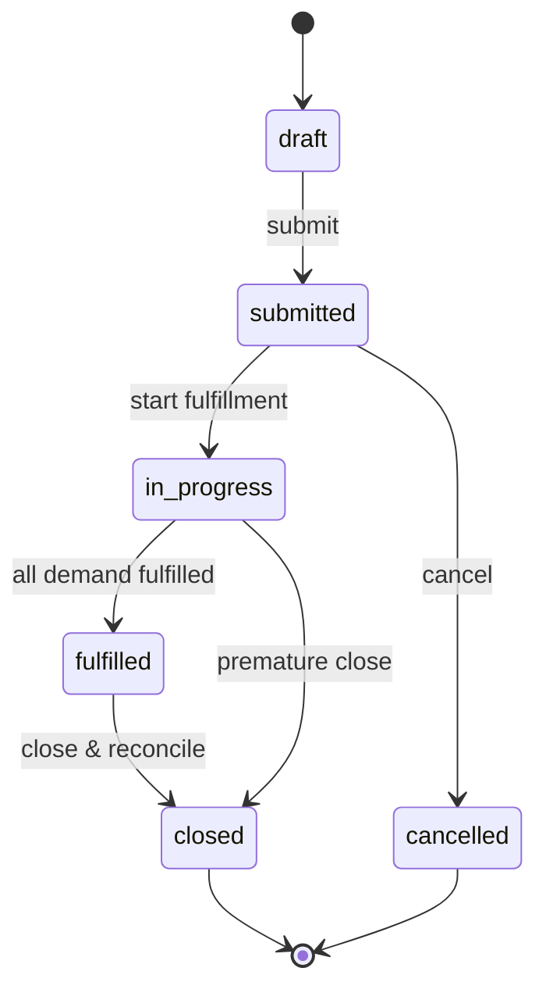
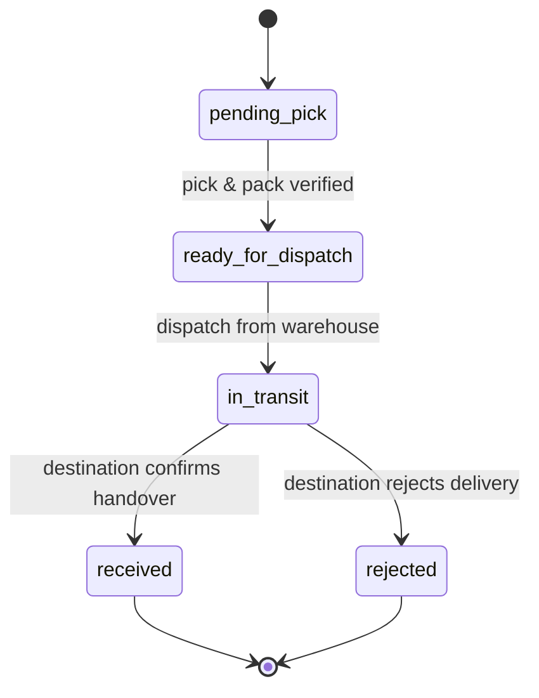
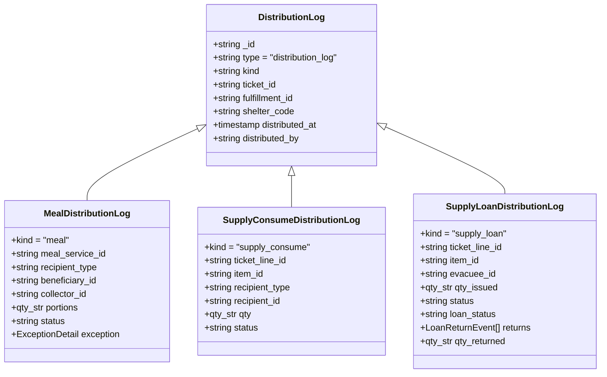

# draft-cr059-extended-tickets-fulfillment-distribution — CR-059 Extended: สถาปัตยกรรมระบบตั๋วเบิกจ่าย (Unified Tickets), การจัดส่ง (Fulfillment) และการแจกจ่ายหน้างาน (Distribution)

> [!NOTE]
> **สรุปภาพรวม (TL;DR):**
> รวมศูนย์ประสบการณ์ผู้ใช้สำหรับงานเบิกจ่าย 4 ประเภท (`kitchen`, `food`, `supplies`, `transfer`) ภายใต้ **Unified Ticket Facade** โดยใช้ **Hybrid Persistence Model**: ตั๋วภายในศูนย์ (`kitchen`, `food`, `supplies`) บันทึกเป็น `RequisitionTicket` ในฐานข้อมูลศูนย์ (`shelter_{shelter_code}`), ส่วนการโอนย้ายข้ามศูนย์ (`transfer`) ยังคงจัดเก็บบนฐานข้อมูลกลาง `central_ops` (`stock_transfer` schema_v 4) ตามเดิมโดยไม่มี shadow copy หรือ dual-write.
>
> แยกความต้องการทางธุรกิจ (Demand: `RequisitionTicket`) ออกจากการเคลื่อนย้ายพัสดุจริง (Physical Custody Journey: `RequisitionFulfillment`). การเติมของ (Replenishment) ทำผ่าน Fulfillment ใบใหม่โดยไม่ย้อนสถานะตั๋ว.
>
> การแจกจ่ายหน้างานจากตั๋วใหม่ทั้งหมด (อาหารปรุงสุก, พัสดุแจกขาด, พัสดุยืม-คืน) ดำเนินการผ่านเอกสารประวัติธุรกิจใหม่ **`DistributionLog`** (`kind: 'meal' | 'supply_consume' | 'supply_loan'`). ระบบเดิม Flow 2 (`distribution_request`, `batch`, `issue`) ยังคงอยู่ 100% สำหรับอ่านและตรวจสอบประวัติย้อนหลัง (Coexistence) แต่ไม่ใช่ execution engine สำหรับตั๋วใหม่. ไม่มีการบันทึกซ้ำสองระบบ (No Dual-Write). ปฏิบัติตาม Online-only Remote-First (CR-110) เคร่งครัด ไม่ใช้ offline queue ใด ๆ.

---

## 1. Dependencies & Traceability

| เอกสารต้นทาง | ความสัมพันธ์ | สาระสำคัญ |
| :--- | :--- | :--- |
| **CR-059** | EXTENDS | ขยายขอบเขตจาก Flow 1 (Transfer) และ Flow 2 (Distribution) เดิมสู่ระบบตั๋วและแจกจ่ายครบวงจร |
| **CR-055** | PRESERVES | ไม่ละเมิด invariant เดิมของ `stock_ledger`; ขยาย 5 reason ใหม่ผ่าน [draft-stock-ledger-reasons-cr055-amendment](draft-stock-ledger-reasons-cr055-amendment.md) |
| **CR-089 / CR-118** | PRESERVES | โอนย้ายข้ามศูนย์ (`transfer`) คงอยู่ที่ `central_ops` ตาม CR-089 และรักษาฟิลด์ล็อตย่อย (`line_id`, `source_lot`, `dest_lots[]`) ตาม CR-118 |
| **CR-109** | AMENDED BY | ปรับปรุงกติกาการแจกอาหารและกลไก concurrency guard ผ่าน [draft-meal-distribution-entitlement-cr109-amendment](draft-meal-distribution-entitlement-cr109-amendment.md) |
| **CR-110** | PRESERVES | ยึดหลักการ **Online-only Remote-First** เคร่งครัด; ตัดระบบคิวออฟไลน์และการจำลอง local database ออกทั้งหมด |
| **Private Design** | IMPLEMENTS | สรุปและยกระดับจากมติที่ผ่านการตรวจสอบใน `.private/doc/distribution/design/` (D-01 ถึง D-15) |

---

## 2. สถาปัตยกรรมระบบตั๋วรวมศูนย์ (Unified Ticket Facade)

ผู้ใช้งานหน้างานและฝ่ายบริหารมองเห็นและจัดการคำร้องเบิกจ่ายทั้ง 4 ประเภทผ่านอินเทอร์เฟซเดียว (**Unified Ticket Facade**):
1. **`kitchen`** (เบิกวัตถุดิบและแก๊สสำหรับครัวประกอบอาหาร)
2. **`food`** (เบิกอาหารปรุงสุก/อาหารกล่องพร้อมแจก)
3. **`supplies`** (เบิกพัสดุและสิ่งของบรรเทาทุกข์)
4. **`transfer`** (เบิกโอนย้ายพัสดุข้ามศูนย์พักพิง)

### โมเดลการจัดเก็บแบบไฮบริด (Hybrid Persistence Boundary)

```
+-------------------------------------------------------------------------+
|                  Unified Ticket Facade (Application Layer)              |
|        UnifiedTicketView (kitchen | food | supplies | transfer)         |
+------------------------------------+------------------------------------+
                                     |
           +-------------------------+-------------------------+
           |                                                   |
           v                                                   v
+-------------------------------+             +-------------------------------+
|  shelter_{shelter_code}       |             |  central_ops                  |
|  (Local Shelter DB)           |             |  (Multi-Tenant Central DB)    |
+-------------------------------+             +-------------------------------+
|  RequisitionTicket            |             |  StockTransfer                |
|  - kitchen                    |             |  - transfer (CR-089/118)      |
|  - food                       |             |  - schema_v: 4                |
|  - supplies                   |             |  - Atomic multi-shelter state |
|                               |             |                               |
|  RequisitionFulfillment       |             |                               |
|  DistributionLog              |             |                               |
+-------------------------------+             +-------------------------------+
```

- **ตั๋วภายในศูนย์ (`kitchen`, `food`, `supplies`):** จัดเก็บเป็นเอกสาร `RequisitionTicket` ในฐานข้อมูลของศูนย์นั้น (`shelter_{shelter_code}`) เพราะเป็นธุรกรรมภายในขอบเขต tenant เดียว
- **ตั๋วโอนย้ายข้ามศูนย์ (`transfer`):** จัดเก็บเป็นเอกสาร `stock_transfer` ในฐานข้อมูลกลาง `central_ops` (`schema_v: 4`) โดยตรง เพื่อรักษาการตรวจรับสองฝ่ายแบบ atomic ข้ามศูนย์
- **ข้อห้ามเด็ดขาด (Invariants):**
  1. ห้ามสร้าง shadow document หรือ copy ของ `stock_transfer` ลงใน `shelter_{code}`
  2. ห้ามทำ dual-write ระหว่าง local ticket และ central transfer
  3. สิทธิ์ผู้ใช้ระดับศูนย์ห้ามเขียนตรงเข้า `central_ops` ต้องผ่าน Server Admin Route ที่มีการตรวจพิสูจน์สิทธิ์ตามสถาปัตยกรรมความปลอดภัย

---

## 3. สัญญาณโดเมน RequisitionTicket (Demand Aggregate)

`RequisitionTicket` เป็นตัวแทนของ **ความต้องการทางธุรกิจ (Business Demand)**:
- **รหัสเอกสาร (`_id`):** `requisition_ticket:{ulid}`
- **ฐานข้อมูล:** `shelter_{shelter_code}`
- **เวอร์ชันสกีมา:** `schema_v: 1`
- **สถานะตั๋ว (Canonical States — 6 สถานะเท่านั้น):**
  `draft` $\rightarrow$ `submitted` $\rightarrow$ `in_progress` $\rightarrow$ `fulfilled` $\rightarrow$ `closed` (หรือ `cancelled` จาก `submitted`)
  *(ห้ามมีสถานะแฝง เช่น `approved` หรือ `in_fulfillment` ในข้อมูลที่ persist; ตั๋วในสถานะ `draft` ไม่มี persisted transition ไป `cancelled` โดยการยกเลิกกระทำได้เฉพาะหลัง `submitted`)*



### โครงสร้างรายการสินค้าในตั๋ว (`TicketItem`)
- `line_id`: รหัสประจำบรรทัด (unique ภายในตั๋ว)
- `item_id`: รหัสสินค้า (`item_master:{ulid|sku}`)
- `item_name`: ชื่อสินค้า snapshot
- `category_id`: รหัสหมวดหมู่สินค้า (เช่น `item_category:ready_meal`, `item_category:kits`)
- `requested_qty`: จำนวนที่ต้องการ (`qty_str` ตาม CR-038)
- `unit`: หน่วยนับมาตรฐาน (ตรงกับ `item_master.base_unit`)
- `distribution_mode`: โหมดการแจกจ่าย (`'consume'` | `'loan'`)
- `notes`: หมายเหตุเพิ่มเติมประจำบรรทัด (optional)

### จุดตรึงข้อมูล (Immutability Points)
เมื่อตั๋วเปลี่ยนสถานะเข้าสู่ `in_progress` (เริ่มมี fulfillment แรก):
- รายการสินค้า (`items[]`) และจำนวนที่ขอ (`requested_qty`) จะถูก**ตรึงห้ามแก้ไข (Frozen/Immutable)**
- หากหน้างานต้องการสิ่งของเพิ่มขึ้น จะต้องขอผ่านการสร้าง **Replenishment Fulfillment** หรือเปิดตั๋วใบใหม่เท่านั้น

---

## 4. สัญญาณโดเมน RequisitionFulfillment (Custody & Physical Delivery)

`RequisitionFulfillment` เป็นตัวแทนของ **การเดินทางทางกายภาพและการส่งมอบพัสดุ (Physical Custody Journey)**:
- **รหัสเอกสาร (`_id`):** `requisition_fulfillment:{ulid}`
- **ฐานข้อมูล:** `shelter_{shelter_code}`
- **เวอร์ชันสกีมา:** `schema_v: 1`
- **สถานะการจัดส่ง (Canonical States — 5 สถานะเท่านั้น):**
  `pending_pick` $\rightarrow$ `ready_for_dispatch` $\rightarrow$ `in_transit` $\rightarrow$ `received` (หรือ `rejected`)
  *(ห้ามมีสถานะแฝง เช่น `requested`, `allocated`, `dispatched`)*



### ประเภทการจัดส่งและการเติมสต็อก (Fulfillment Kinds)
- `fulfillment_kind`: `'initial'` (ส่งมอบรอบแรก) | `'replenishment'` (ส่งมอบรอบเติมสต็อก)
- `replenishes_fulfillment_id`: อ้างอิง fulfillment เดิมกรณีส่งของทดแทนความเสียหายระหว่างทาง
- **กฎการเติมสต็อก (Replenishment Rule):** การเติมของจะสร้าง `RequisitionFulfillment` ใบใหม่เสมอ โดยไม่ย้อนสถานะตั๋ว และไม่แก้ไข fulfillment ใบเดิมที่จบไปแล้ว

### กฎการอนุรักษ์ยอดพัสดุและการจัดการความเสียหายระหว่างขนส่ง (Conservation Rule)
ในการตรวจรับพัสดุปลายทาง ผลรวมต้องอนุรักษ์ตามสมการ:
$$\text{dispatched\_qty} = \text{received\_qty} + \text{damaged\_qty} + \text{lost\_qty} + \text{rejected\_qty} + \text{unresolved\_discrepancy\_qty}$$

- **การหักสต็อกคลัง (Stock Deduction):** บันทึกติดลบตอนตัดจ่ายออกจากคลังครั้งเดียว (`ticket_dispatch`, ค่าเป็นลบ เช่น `-100`)
- **ความเสียหายระหว่างทาง (Transport Damage):** บันทึกเป็นเหตุการณ์ข้อยกเว้น (`FulfillmentException`) ที่ fulfillment ปลายทาง (เช่น damaged = 5, received = 95) โดย**ห้ามบันทึกตัดสต็อกคลังซ้ำอีกเป็นอันขาด** (มิฉะนั้นจะกลายเป็น -105 ซึ่งผิดหลักอนุรักษ์)
- **การส่งของทดแทน:** หากต้องการส่งของทดแทน 5 ชิ้นที่เสียหาย ให้เปิด `RequisitionFulfillment` ใบใหม่ (`replenishment`) ซึ่งจะไปตัดสต็อกคลังรอบใหม่ `-5` อย่างถูกต้อง
- **การปฏิเสธไม่รับพัสดุ (Rejection Return):** หากพัสดุถูกปฏิเสธทั้งคันและนำกลับเข้าคลัง ให้บันทึกการรับคืนเข้าคลังด้วยเหตุผล `fulfillment_return` (ค่าเป็นบวก) โดยห้ามใช้ค่า `ticket_dispatch` เป็นบวก และห้ามใช้ `adjust`

---

## 5. สัญญาณโดเมน DistributionLog (การแจกจ่ายผู้ประสบภัยรายบุคคล)

การบันทึกประวัติการแจกจ่ายหน้างานสำหรับตั๋วใหม่ ใช้เอกสาร **`DistributionLog`** (`distribution_log:{ulid}`) ใน `shelter_{shelter_code}` โดยใช้ Discriminated Union ผ่านฟิลด์ `kind`:



### 1. `MealDistributionLog` (`kind: 'meal'`)
- ตัวแทนการแจกจ่ายอาหารปรุงสุก/กล่อง
- อ้างอิง `meal_service_id`
- แยกแยะชัดเจนระหว่าง `collector_id` (ผู้มารับแทน) และ `beneficiary_id` (ผู้มีสิทธิที่แท้จริง)
- ควบคุมสิทธิ์ด้วย `MealEntitlementGuard` (รายละเอียดใน [draft-meal-distribution-entitlement-cr109-amendment](draft-meal-distribution-entitlement-cr109-amendment.md))
- สถานะ: `'fulfilled' | 'voided'`

### 2. `SupplyConsumeDistributionLog` (`kind: 'supply_consume'`)
- ตัวแทนการแจกสิ่งของแบบแจกขาด (Consume) จากตั๋ว supplies
- อ้างอิง `ticket_id`, `fulfillment_id`, `ticket_line_id`, `item_id`
- บันทึก `recipient_type` (`evacuee` | `volunteer` | `outside`) และ `recipient_id`
- สถานะ: `'fulfilled' | 'voided'`

### 3. `SupplyLoanDistributionLog` (`kind: 'supply_loan'`)
- ตัวแทนการให้ยืมสิ่งของ/อุปกรณ์คงทน (Durable Loans) จากตั๋ว supplies
- **ข้อกำหนดผู้รับ:** ต้องมีรหัสผู้พักพิงที่ระบุตัวตนได้ (`evacuee:{ulid}`) หรือจิตอาสาลงทะเบียน **ห้ามผู้รับนิรนาม (`outside`) ยืมของเด็ดขาด**
- **สิทธิอำนาจการคืนของ (Authority):** อาเรย์ `returns[]` (`LoanReturnEvent[]`) คือ **แหล่งความจริงทางธุรกิจเดียวของการคืนของ (Single Source of Truth)**
- ฟิลด์ `qty_returned`: ถือเป็น **Derived Cache เท่านั้น** ต้องมีค่าเท่ากับ $\sum \text{returns}[].\text{returned\_qty}$ เสมอ ระบบต้องปฏิเสธค่าที่ส่งมาจากภายนอกหากไม่ตรงกับผลรวม
- สถานะเอกสารหลัก (Base Status): `'fulfilled' | 'voided'`
- สถานะสัญญายืม (Loan Status): `'active' | 'partially_returned' | 'returned' | 'waived' | 'lost' | 'voided'`

---

## 6. ตั๋วพัสดุแบบผสม (Mixed Supplies Tickets)

ตั๋วประเภท `supplies` รองรับการมีรายการสินค้าแบบแจกขาดและแบบให้ยืมอยู่ในใบเดียวกันได้:
- รายการ A: ผ้าห่ม (`distribution_mode: 'consume'`) $\rightarrow$ แจกออกเป็น `SupplyConsumeDistributionLog`
- รายการ B: รถเข็นวีลแชร์ (`distribution_mode: 'loan'`) $\rightarrow$ บันทึกยืมเป็น `SupplyLoanDistributionLog`
- รายการ C: ชุดสุขอนามัย (`distribution_mode: 'consume'`) $\rightarrow$ `SupplyConsumeDistributionLog`
- รายการ D: พัดลมตั้งโต๊ะ (`distribution_mode: 'loan'`) $\rightarrow$ `SupplyLoanDistributionLog`

**หลักการตัดสินใจ:**
- **`TicketItem.distribution_mode` คือข้อกำหนดที่มีผลทางธุรกรรมเด็ดขาด** (เช่น กรณีภัยหนาว ผ้าห่มอาจแจกขาด แต่กรณีศูนย์พักพิงระยะสั้นอาจให้ยืม) ทั้งนี้ระบบ UI หรือแคตตาล็อกอาจแสดงคำแนะนำเริ่มต้นในอนาคต แต่ไม่มีการเพิ่มฟิลด์ persisted `default_distribution_mode` ใน `ItemMaster` ขณะนี้
- ตั๋วประเภท `kitchen` และ `food` บังคับโหมด `consume` เท่านั้น

---

## 7. สิทธิอำนาจการคืนของและการรวมศูนย์คืนพัสดุ (LoanDropoffBatch)

```
[ จุดคืนของหน้างาน / ประตู / เคาน์เตอร์ ]
                  │
                  ▼
         LoanDropoffBatch (10 ชิ้น)
         - ทราบตัวผู้ยืม 7 ชิ้น ───► อัปเดต returns[] บน SupplyLoanDistributionLog 7 รายการ
         - ไม่ทราบตัวผู้ยืม 3 ชิ้น ──► บันทึก unmatched_qty = 3
                  │
                  ▼ (นำส่งเข้าคลังพัสดุจริง)
         [ คลังรับเข้าสต็อก ]
                  │
                  ▼
         StockLedger (loan_bulk_return: +10 ชิ้น) ──► เพิ่มสต็อกคลังครั้งเดียวพอ
                  │
                  ▼ (ภายหลังสืบหาตัวผู้ยืม 3 คนที่เหลือเจอ)
         อัปเดต returns[] บน SupplyLoanDistributionLog ของ 3 คนที่เหลือ
         └──► บันทึกสถานะสัญญาปลดหนี้ แต่ **ห้ามเพิ่มสต็อก StockLedger ซ้ำเป็นอันขาด**
```

- **การคืนพัสดุหน้างาน:** การรับคืนที่เคาน์เตอร์ จุดคัดกรอง หรือประตูหน้าศูนย์พักพิง **ไม่มีผลต่อ StockLedger ของคลังพัสดุ** จนกว่าพัสดุจะถูกนำส่งถึงคลังจริง
- **การคืนแบบระบุตัวตนส่งตรงเข้าคลัง:** บันทึก StockLedger ด้วยเหตุผล `loan_return` (+บวก, ref_id: `distribution_log:{ulid}`; บังคับระบุ `lot_ref` หากเป็นสินค้าที่บริหารจัดการแบบมีล็อตเพื่อคงประวัติ physical lot provenance)
- **การรวบรวมคืนพัสดุจำนวนมาก (`LoanDropoffBatch`):**
  - รหัสเอกสาร: `loan_dropoff_batch:{ulid}`
  - สถานะ: `staged` $\rightarrow$ `in_transfer` $\rightarrow$ `warehouse_received`
  - เมื่อคลังตรวจรับเข้าสต็อก: บันทึก StockLedger ด้วยเหตุผล `loan_bulk_return` (+บวก, ref_id: `loan_dropoff_batch:{ulid}`; บังคับระบุ `lot_ref` หากเป็นสินค้าที่บริหารจัดการแบบมีล็อต) **เพียงครั้งเดียวตามจำนวนที่เข้าคลังจริง**
  - หากมีรายการที่ยังระบุตัวผู้ยืมไม่ได้ในตอนแรก แล้วสามารถจับคู่ได้ในภายหลัง: ให้อัปเดตเฉพาะประวัติสัญญาบน `SupplyLoanDistributionLog.returns[]` **โดยห้ามเขียน StockLedger เพิ่มอีกเด็ดขาด**

---

## 8. การอยู่ร่วมกับระบบเดิม (Legacy Flow 2 Coexistence) และจุดตัดระบบ (Cutover)

1. **การคงอยู่ของ Flow 2 เดิม (Coexistence):**
   - เอกสารประเภท `distribution_request`, `distribution_batch`, `distribution_issue` และ coordination docs เดิม (PR #260 / #265 / #273) **คงอยู่ในระบบ 100%**
   - เอกสารประวัติเดิมทั้งหมดสามารถอ่าน ตรวจสอบ และทำรายงานสรุปย้อนหลังได้ตามปกติ
   - ห้ามทำ destructive migration หรือแปลงข้อมูลเก่าข้ามโมเดล
2. **ขอบเขตการเขียนใหม่ (Cutover Boundary):**
   - เมื่อเริ่มใช้งานระบบตั๋วใหม่ (Post-Cutover): ตั๋วเบิกจ่ายพัสดุใหม่จะสร้าง `RequisitionTicket` $\rightarrow$ `RequisitionFulfillment` $\rightarrow$ `DistributionLog`
   - Flow 2 เดิมจะไม่ใช่ execution engine ของตั๋วใหม่อีกต่อไป
   - **ห้ามทำ Dual-Write:** ธุรกรรมการแจกจ่ายใหม่ต้องเลือกลงระบบใดระบบหนึ่ง ห้ามเขียนทั้ง `distribution_issue` และ `distribution_log` พร้อมกัน
3. **การออกรายงานรวม (Unified Reporting):**
   - หน้าแดชบอร์ดหรือรายงานประวัติการแจกจ่ายรวม สามารถทำ Read Projection ในชั้น Application โดยการรวมข้อมูลจาก `distribution_issue` (เก่า) และ `distribution_log` (ใหม่) เข้าด้วยกันตอนอ่าน
   - Read Projection นี้ไม่ใช่เอกสารความจริงที่ถูก persist

---

## 9. ตารางแหล่งความจริงเดี่ยว (Single Source of Truth Matrix)

| ปริมณฑลความจริง (Concern) | แหล่งความจริงทางธุรกิจ (Business Authority) | เอกสารประสานงานเท่านั้น (Coordination Only) |
| :--- | :--- | :--- |
| **ความต้องการเบิกจ่ายในศูนย์** | `RequisitionTicket` | `supply_distribution_gate` |
| **การเดินทางและส่งมอบพัสดุจริง** | `RequisitionFulfillment` | `supply_distribution_capacity` |
| **การโอนย้ายข้ามศูนย์** | `stock_transfer` (บน `central_ops`) | — |
| **ประวัติการแจกอาหารรายบุคคล** | `MealDistributionLog` | `meal_entitlement_guard`, `meal_distribution_operation` |
| **ประวัติการแจกพัสดุใช้สิ้นเปลือง** | `SupplyConsumeDistributionLog` | `supply_distribution_idempotency`, `supply_distribution_guard` |
| **ภาระผูกพันสัญญายืมพัสดุ** | `SupplyLoanDistributionLog` | `loan_active_guard` |
| **ประวัติการคืนของของผู้ยืม** | `SupplyLoanDistributionLog.returns[]` | — |
| **หลักฐานการคุมตัวของคืนรวมถัง** | `LoanDropoffBatch` | — |
| **สต็อกคงคลังพัสดุทางกายภาพ** | `StockLedger` (CR-055 / draft-stock-ledger-reasons-cr055-amendment) | — |
| **ประวัติการแจกพัสดุเดิม (ก่อนตัดระบบ)**| `distribution_issue` (Flow 2 เดิม) | `distribution_issue_capacity`, `distribution_one_time_guard` |

---

## 10. เกณฑ์การยอมรับ (Acceptance Criteria)

- **AC-01 (Unified Ticket Facade):** ผู้ใช้สามารถดูรายการตั๋วทั้ง 4 ประเภท (`kitchen`, `food`, `supplies`, `transfer`) ได้จากหน้าจอเดียว โดยเบื้องหลังจัดเก็บลง `shelter_{code}` สำหรับ 3 ประเภทแรก และจัดเก็บลง `central_ops` สำหรับ transfer
- **AC-02 (Mixed Supplies Ticket):** ตั๋ว supplies ใบเดียวกันสามารถมีทั้งบรรทัด consume และบรรทัด loan โดยระบบสร้าง `SupplyConsumeDistributionLog` สำหรับบรรทัด consume และสร้าง `SupplyLoanDistributionLog` สำหรับบรรทัด loan ได้อย่างถูกต้อง
- **AC-03 (Demand vs Custody):** เมื่อมีการร้องขอเติมสต็อกพัสดุหน้างาน ระบบต้องสร้าง `RequisitionFulfillment` ใบใหม่ที่มี `fulfillment_kind: 'replenishment'` โดยไม่เปลี่ยนสถานะตั๋วเดิมกลับไปเป็น draft และไม่แก้ไข fulfillment เดิมที่ตรวจรับไปแล้ว
- **AC-04 (Conservation & Transport Damage):** เมื่อสินค้าเสียหายระหว่างขนส่ง ปลายทางบันทึกรับของจริงพร้อมระบุความเสียหาย ระบบต้องไม่สร้างรายการหักสต็อกคลังรอบที่สอง และผลรวมยอดต้องคงที่ตามสมการอนุรักษ์
- **AC-05 (Loan Returns SSoT):** การบันทึกคืนของบางส่วนพร้อมกันหลายจุด ต้องถูกผนวกลงใน `returns[]` ของ `SupplyLoanDistributionLog` อย่างถูกต้อง และคำนวณ `qty_returned` จากผลรวมของอาเรย์เท่านั้น
- **AC-06 (Bulk Dropoff Once-Only Stock):** เมื่อจุดรับคืนรวมนำของส่งเข้าคลังผ่าน `LoanDropoffBatch` คลังจะได้รับสต็อกบวกครั้งเดียวผ่าน `loan_bulk_return`. การจับคู่กับผู้ยืมที่เหลือในภายหลังต้องไม่เพิ่มสต็อกใน `StockLedger` อีก
- **AC-07 (Remote-First Only):** หากอุปกรณ์ออฟไลน์ การพยายามส่งตั๋ว ตรวจรับ หรือแจกจ่ายของต้องถูกบล็อกแบบ fail closed พร้อมแจ้งเตือนผู้ใช้ โดยไม่มีการเขียนคิวลง PouchDB หรือ IndexedDB
- **AC-08 (No Dual-Write):** การแจกจ่ายจากตั๋วใหม่ต้องสร้างเฉพาะ `DistributionLog` และห้ามสร้าง `distribution_issue` ควบคู่กันโดยเด็ดขาด

---

## 11. บันทึกการตัดสินใจ (Decision Log)

- **2026-09-13:** จัดทำข้อเสนอ draft-cr059-extended-tickets-fulfillment-distribution เพื่อ formalize มติสถาปัตยกรรมหลัก CR-059 Extended ที่ผ่าน Design Gate Phase 2C (P0=0, P1=0, P2=0, P3=0)
- **2026-09-13:** กำหนดให้การแจกจ่ายพัสดุของตั๋วใหม่ใช้ `DistributionLog` ร่วมกันทั้งแจกขาดและยืม-คืน เพื่อความเป็นเอกภาพของระบบแจกจ่าย และคง Flow 2 เดิมไว้รองรับข้อมูลประวัติศาสตร์ (Decision B)
