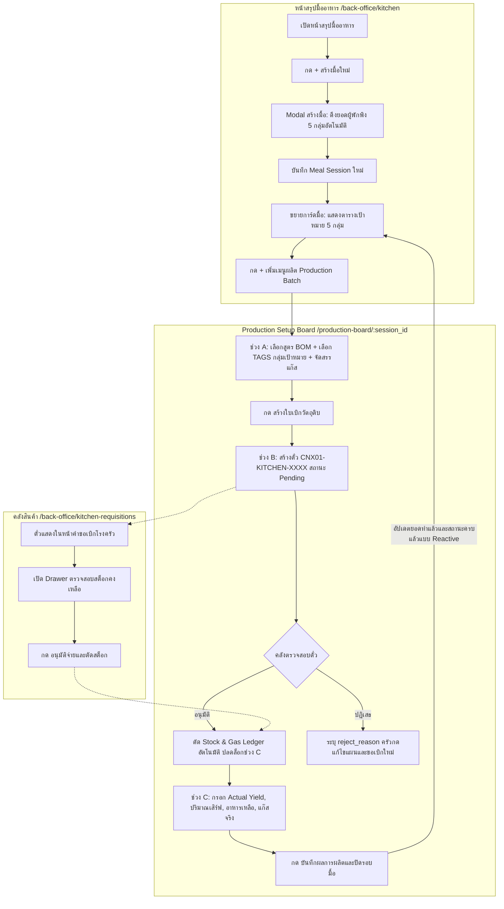

# Kitchen 2-Tier Meal Sessions, Production Setup Board (Stages A/B/C) & TKT-KITCHEN Flow 3

> **สรุป (TL;DR):** ปรับโครงสร้างระบบครัวเป็น 2 ชั้น (`meal_session` ➔ `meal_plan` / Production Batch) เพื่อติดตามเป้าหมาย 5 กลุ่มผู้พักพิง · ปรับกระบวนการสั่งผลิตอาหารเป็น Wizard 3 ขั้นตอน (A-วางแผน BOM/แก๊ส, B-รอคลังอนุมัติตั๋ว `[ShelterCode]-KITCHEN-XXXX`, C-รายงานผลผลิตจริง Actual Yield) · ประมวลผลสถานะความครบถ้วนรายกลุ่มแบบ Reactive · ระบบตั๋วเบิกคลัง State Machine พร้อม Atomic Stock/Gas Deduction และ Drawer ตรวจสอบสต็อกฝั่งคลังสินค้า · กระทบ `docs/data/schema.md` §2.5, §2.6, §2.7, §2.8 และ UI โรงครัวทั้งหมด.

---

## Why (เหตุผลและที่มา)

1. **ปัญหาการจัดการมื้ออาหารเดิม:** หน้าจอครัวเดิมมีเพียงรายการ `meal_plan` แยกเดี่ยว ไม่สามารถจัดสรรและติดตามได้ว่าในหนึ่งมื้อ (เช่น มื้อเช้า) มีการผลิตอาหารครอบคลุมผู้พักพิงทุกกลุ่มเป้าหมาย (ฮาลาล, เด็ก/ทารก, ผู้ป่วย/อาหารอ่อน, ปกติ, อาสาสมัคร) ครบถ้วนตามยอดทะเบียนจริงแล้วหรือไม่
2. **ปัญหาการตัดสต็อกวัตถุดิบและแก๊ส (CR-059 Flow 3):** เดิมการเบิกวัตถุดิบเป็นการตัดสต็อกตรงจากหน้าจอครัวทันที ข้ามกระบวนการตรวจสอบของเจ้าหน้าที่คลังสินค้า ทำให้ขาดระบบตั๋วคำขอเบิก (`[ShelterCode]-KITCHEN-XXXX`) ที่คลังต้องตรวจสอบสต็อกและอนุมัติตาม FEFO
3. **ปัญหาการบันทึกผลผลิตจริงและการควบคุมโควตา (CR-058 หมวด 3 & CR-085):** ขาดขั้นตอนรายงาน Actual Yield (จำนวนจานที่ปรุงได้จริง) หลังการปรุงอาหารเสร็จ เพื่อใช้เป็นเพดาน (Ceiling) ในการแจกจ่ายอาหารหน้างาน และขาดการคำนวณการใช้แก๊สจริงเทียบกับแผน

---

## Requirements & Design Decisions

### 1. โครงสร้างข้อมูลมื้ออาหาร 2 ชั้น (2-Tier Meal Structure)

- **FR-K01 — เอกสารระดับมื้ออาหาร (`meal_session`):**
  - ระบบรองรับการสร้างเอกสาร `meal_session` เพื่อคุมภาพรวมของแต่ละมื้อ (เช่น มื้อเช้า, มื้อกลางวัน, มื้อเย็น)
  - มีฟิลด์เก็บเป้าหมายรายกลุ่ม 5 มิติ (`target_headcount`):
    1. อาหารฮาลาล (`halal`: int)
    2. อาหารเด็ก/ทารก (`infant`: int)
    3. เปราะบาง/อาหารอ่อน (`soft_food`: int)
    4. ปกติ (`regular`: int)
    5. อาสาสมัคร (`volunteer`: int)
    6. เป้าหมายรวม (`total`: int)
  - ค่าเริ่มต้นของเป้าหมายทั้ง 5 กลุ่มดึงอัตโนมัติจากทะเบียนผู้พักพิงที่มีสถานะ `active` ในศูนย์ และยอมรับการแก้ไขปรับแต่งด้วยมือ (Manual Override) ก่อนบันทึก
- **FR-K02 — เอกสารระดับชุดการผลิต (`meal_plan` / Production Batch):**
  - `meal_plan` มีฟิลด์ `meal_session_id` เชื่อมโยงกลับไปยัง `meal_session` ต้นทาง
  - มีฟิลด์ `target_tags` (`string[]`) ระบุกลุ่มผู้รับที่เมนูนี้จัดสรรให้ (เช่น `['everyone']`, `['halal']`, `['regular']`, `['soft_food']`, `['infant']`, `['volunteer']`)
  - มีฟิลด์ `allocated_target` (int) ระบุจำนวนจาน/กล่องเป้าหมายของชุดการผลิตนี้

### 2. กระดานจัดสรรการผลิตอาหาร (Production Setup Board Wizard 3 ช่วง)

- **FR-K03 — ช่วง A: วางแผนเมนู คำนวณวัตถุดิบ (BOM) และแก๊สหุงต้ม (Plan):**
  - ผู้ใช้เลือกสูตรอาหาร (BOM Recipe) จาก Catalog หรือระบุรายการวัตถุดิบเอง
  - ระบบคำนวณปริมาณวัตถุดิบที่ต้องใช้ตามสัดส่วน `allocated_target` เทียบกับยอดคงเหลือในคลัง (`on_hand_stock`) และแสดงยอดส่วนขาด (`shortage`) พร้อมสถานะความพร้อม (`พร้อม` / `วัตถุดิบขาด`)
  - ระบบแสดงแผงจัดสรรเครื่องครัวและแก๊สหุงต้ม:
    - ให้เลือกถังแก๊ส (`gas_cylinder_type`)
    - คำนวณปริมาณการใช้แก๊ส: $\text{Gas (kg)} = \text{Cooking Time (hrs)} \times \text{Burn Rate (kg/hr)} \times \text{Multiplier}$
    - คำนวณเวลาปรุงสูงสุดที่แก๊สในถังรองรับได้
    - แสดงระดับแก๊สคงเหลือในถังปัจจุบัน ยอดที่คาดว่าจะใช้ และยอดคงเหลือสุทธิหลังปรุง
  - เมื่อตรวจสอบความถูกต้อง ผู้ใช้กดปุ่ม **"สร้างใบเบิกวัตถุดิบ"** เพื่อเปลี่ยนสถานะเป็นช่วง B
- **FR-K04 — ช่วง B: ระบบตั๋วคำขอเบิกคลังและตัดสต็อก (`[ShelterCode]-KITCHEN-XXXX` Flow 3):**
  - เมื่อกดสร้างใบเบิก ระบบสร้างเอกสาร `kitchen_requisition` ในสถานะ `status: 'pending'` พร้อมรหัสตั๋ว `ticket_no` รันลำดับต่อเนื่องผ่าน `kitchen_counter:main`
  - หน้ารอคลังอนุมัติต้องแสดงป้ายสถานะ (Banner) รอคลังตรวจสอบและตัดจ่ายวัตถุดิบจริง
  - ระบบมีตารางตรวจสอบรายการวัตถุดิบและเชื้อเพลิงในตั๋ว
  - **ฝั่งคลังสินค้า (`/back-office/kitchen-requisitions`):**
    - มีหน้าจอตรวจสอบตั๋วคำขอเบิกโรงครัว แสดงรายการตั๋วสถานะ `Pending`, `Approved`, `Rejected`
    - มี Drawer เปิดดูรายการวัตถุดิบ สต็อกคงเหลือปัจจุบัน และระดับแก๊ส
    - ปุ่ม **"อนุมัติจ่ายและตัดสต็อก (Approve & Issue)"**: เขียนรายการ `stock_ledger` (ตัดจ่ายวัตถุดิบตาม FEFO) และ `gas_ledger` (reason=`consumption`) แบบ Atomic Transaction
    - ปุ่ม **"ปฏิเสธคำขอเบิก (Reject)"**: ระบุเหตุผล (`reject_reason`) ส่งกลับให้ครัวทราบ
    - ฝั่งครัวได้รับแจ้งเตือนเหตุผล พร้อมปุ่ม **"แก้ไขแผนและขอเบิกใหม่"** (สร้างตั๋วใบใหม่ เก็บตั๋วเดิมเป็น Audit Trail)
- **FR-K05 — ช่วง C: รายงานผลผลิตจริง (Actual Yield & Service Record):**
  - ผู้ใช้กรอก **Actual Yield (จำนวนจาน/กล่องที่ปรุงได้จริง)**
  - ผู้ใช้สามารถบันทึกยอดการแจกจ่ายจริง (`served`), อาหารเหลือทิ้ง (`waste`), และแจกจ่ายนอกศูนย์ (`external: {volunteers, outside_evacuees}`)
  - ผู้ใช้สามารถบันทึกปริมาณแก๊สที่ใช้จริง (`actual_gas_used_kg`)
  - บันทึกเอกสาร `meal_service` (CR-085) ที่ผูกกับ `meal_plan_id` และ `meal_session_id`

### 3. การติดตามความคืบหน้าของมื้ออาหาร (Session Progress Tracking)

- **FR-K06 — การคำนวณยอด "ทำแล้ว" และสถานะ "ครบแล้ว/ยังไม่ครบ" รายกลุ่ม:**
  - ยอด "ทำแล้ว (จาน)" ของแต่ละกลุ่มเป้าหมายใน `meal_session` คำนวณแบบ Reactive (Read-time Derived) จากผลรวม `actual_yield` ของทุก `meal_service` ที่เชื่อมโยงกับ `meal_plan` ที่เลือก TAGS กลุ่มนั้นๆ
  - หากเลือก Tag `['everyone']` ยอดผลิตจะกระจายเพิ่มให้ทุกกลุ่มในมื้อนั้น
  - หากยอด "ทำแล้ว" $\ge$ "จำนวนเป้าหมาย" ของกลุ่มนั้น แสดงป้ายสถานะ **"ครบแล้ว"** (สีเขียว)
  - หากยอดยังไม่ถึงเป้า แสดงป้ายสถานะ **"ยังไม่ครบ"** (สีส้ม)
  - การ์ดมื้ออาหารแสดงผลสรุปรวม เช่น `1/5 กลุ่มครบ` หรือ `5/5 กลุ่มครบ` พร้อมแถบ Progress bar

---

## Schema Specifications (docs/data/schema.md)

### 1. §2.7.3 `meal_session` — `meal_session:{ulid}` · **schema_v 1**

> เอกสารระดับมื้ออาหารใหม่สำหรับควบคุมภาพรวมและเป้าหมายผู้รับ 5 กลุ่ม

| Field                       |                    ชนิด                    | req |      สถานะ      | คำอธิบายและหมายเหตุ                                           |
| :-------------------------- | :----------------------------------------: | :-: | :-------------: | :------------------------------------------------------------ |
| `_id`                       |                    str                     | req | **[เพิ่มใหม่]** | Primary key รูปแบบ `meal_session:{ulid}`                      |
| `type`                      |              `'meal_session'`              | req | **[เพิ่มใหม่]** | Discriminator doc type                                        |
| `schema_v`                  |                    `1`                     | req | **[เพิ่มใหม่]** | Schema version 1                                              |
| `name`                      |                    str                     | req | **[เพิ่มใหม่]** | ชื่อมื้ออาหาร เช่น `"มื้อเช้า 28 ส.ค. 2569"`                  |
| `date`                      |                    str                     | req | **[เพิ่มใหม่]** | วันที่จัดมื้ออาหาร `YYYY-MM-DD`                               |
| `meal`                      | enum(`breakfast`,`lunch`,`dinner`,`snack`) | req | **[เพิ่มใหม่]** | ช่วงเวลาของมื้อ                                               |
| `status`                    |   enum(`active`,`completed`,`cancelled`)   | req | **[เพิ่มใหม่]** | สถานะมื้ออาหาร (default `"active"`)                           |
| `target_headcount`          |                   object                   | req | **[เพิ่มใหม่]** | เป้าหมายผู้รับอาหารแยกตามกลุ่มคุณสมบัติ 5 กลุ่ม (ดูตารางย่อย) |
| `notes`                     |                    str                     | opt | **[เพิ่มใหม่]** | หมายเหตุเพิ่มเติมประจำมื้อ                                    |
| `created_at` / `updated_at` |                     ts                     | req | **[เพิ่มใหม่]** | เวลาสร้าง/แก้ไขเอกสาร (Envelope BaseDoc)                      |
| `created_by` / `updated_by` |                    str                     | req | **[เพิ่มใหม่]** | ผู้สร้าง/แก้ไขเอกสาร (Envelope BaseDoc)                       |

**ตารางย่อย `target_headcount`:**

| Sub-field   |    ชนิด     | req |      สถานะ      | คำอธิบายและหมายเหตุ                                     |
| :---------- | :---------: | :-: | :-------------: | :------------------------------------------------------ |
| `halal`     | int $\ge 0$ | req | **[เพิ่มใหม่]** | เป้าหมายกลุ่มอาหารฮาลาล (มุสลิม)                        |
| `infant`    | int $\ge 0$ | req | **[เพิ่มใหม่]** | เป้าหมายกลุ่มเด็ก/ทารก                                  |
| `soft_food` | int $\ge 0$ | req | **[เพิ่มใหม่]** | เป้าหมายกลุ่มเปราะบาง/อาหารอ่อน (ผู้ป่วยติดเตียง/คนชรา) |
| `regular`   | int $\ge 0$ | req | **[เพิ่มใหม่]** | เป้าหมายกลุ่มปกติทั่วไป                                 |
| `volunteer` | int $\ge 0$ | req | **[เพิ่มใหม่]** | เป้าหมายกลุ่มเจ้าหน้าที่และอาสาสมัคร                    |
| `total`     | int $\ge 0$ | req | **[เพิ่มใหม่]** | ยอดเป้าหมายรวมผู้พักพิงและผู้รับอาหารทั้งหมด            |

---

### 2. §2.7.4 `kitchen_counter` — `kitchen_counter:main` · **schema_v 1**

> Running counter doc สำหรับออกเลขตั๋วคำขอเบิกโรงครัว (`[ShelterCode]-KITCHEN-XXXX`)

| Field      |           ชนิด           | req |      สถานะ      | คำอธิบายและหมายเหตุ                                    |
| :--------- | :----------------------: | :-: | :-------------: | :----------------------------------------------------- |
| `_id`      | `'kitchen_counter:main'` | req | **[เพิ่มใหม่]** | Fixed ID                                               |
| `type`     |   `'kitchen_counter'`    | req | **[เพิ่มใหม่]** | Discriminator doc type                                 |
| `schema_v` |           `1`            | req | **[เพิ่มใหม่]** | Schema version 1                                       |
| `seq`      |       int $\ge 1$        | req | **[เพิ่มใหม่]** | Running integer sequence (atomic sequential increment) |

---

### 3. §2.5 `meal_plan` — `meal_plan:{ulid}` · **schema_v 2** (Additive)

> ปรับ `meal_plan` ทำหน้าที่เป็น Production Batch และเพิ่มฟิลด์เชื่อมโยง `meal_session`

| Field              |                    ชนิด                    | req |      สถานะ      | คำอธิบายและหมายเหตุ                                                                      |
| :----------------- | :----------------------------------------: | :-: | :-------------: | :--------------------------------------------------------------------------------------- |
| `_id`              |                    str                     | req |  **[คงเดิม]**   | `meal_plan:{ulid}`                                                                       |
| `type`             |               `'meal_plan'`                | req |  **[คงเดิม]**   | Discriminator doc type                                                                   |
| `schema_v`         |                    `2`                     | req |  **[คงเดิม]**   | คงที่ 2 (Additive fields optional)                                                       |
| `date`             |                    str                     | req |  **[คงเดิม]**   | `YYYY-MM-DD`                                                                             |
| `meal`             | enum(`breakfast`,`lunch`,`dinner`,`snack`) | req |  **[คงเดิม]**   | ช่วงเวลาของมื้อ                                                                          |
| `label`            |                    str                     | opt |  **[คงเดิม]**   | ชื่อเมนูที่ตั้งเอง (โหมด BOM/Custom)                                                     |
| `headcount`        |                   object                   | req |  **[คงเดิม]**   | ยอดประชากร `{total, halal, soft_food, infant}`                                           |
| `recipes`          |                   array                    | req |  **[คงเดิม]**   | `[{recipe_id, planned_qty, unit?}]` รายการวัตถุดิบ                                       |
| `status`           |         enum(`draft`,`confirmed`)          | req |  **[คงเดิม]**   | สถานะของแผน                                                                              |
| `override_reason`  |                 str\|null                  | opt |  **[คงเดิม]**   | เหตุผลกรณีปรับยอด headcount ต่างจากทะเบียน                                               |
| `calc_source`      |                object\|null                | opt |  **[คงเดิม]**   | Audit trail การคำนวณ SOP                                                                 |
| `gas_usage`        |                   array                    | opt |  **[คงเดิม]**   | `[{cylinder_id, consumption_kg}]` คำนวณแก๊สที่ต้องใช้ (CR-086)                           |
| `meal_session_id`  |                 str\|null                  | opt | **[เพิ่มใหม่]** | รหัสอ้างอิง `meal_session._id` ต้นทาง                                                    |
| `target_tags`      |                   [str]                    | opt | **[เพิ่มใหม่]** | กลุ่มเป้าหมายที่ผลิตให้ เช่น `['everyone']`, `['halal']`, `['regular']`, `['volunteer']` |
| `allocated_target` |                int $\ge 0$                 | opt | **[เพิ่มใหม่]** | จำนวนจาน/กล่องเป้าหมายของชุดการผลิตนี้                                                   |

---

### 4. §2.6 `kitchen_requisition` — `kitchen_requisition:{ulid}` · **schema_v 3**

> State Machine สำหรับระบบตั๋ว `[ShelterCode]-KITCHEN-XXXX` (CR-059 Flow 3)

| Field             |                 ชนิด                  | req |       สถานะ       | คำอธิบายและหมายเหตุ                                                 |
| :---------------- | :-----------------------------------: | :-: | :---------------: | :------------------------------------------------------------------ |
| `_id`             |                  str                  | req |   **[คงเดิม]**    | `kitchen_requisition:{ulid}`                                        |
| `type`            |        `'kitchen_requisition'`        | req |   **[คงเดิม]**    | Discriminator doc type                                              |
| `schema_v`        |                  `3`                  | req | **[ปรับเปลี่ยน]** | Bump จาก 2 ➔ 3 (State Machine + Ticket Lifecycle)                   |
| `ticket_no`       |                  str                  | req |  **[เพิ่มใหม่]**  | รหัสตั๋วคำขอเบิก เช่น `"CNX01-KITCHEN-0001"`                        |
| `status`          | enum(`pending`,`approved`,`rejected`) | req |  **[เพิ่มใหม่]**  | สถานะตั๋ว (default `"pending"`)                                     |
| `meal_plan_id`    |               str\|null               | opt |   **[คงเดิม]**    | รหัสอ้างอิง `meal_plan._id`                                         |
| `meal_session_id` |               str\|null               | opt |  **[เพิ่มใหม่]**  | รหัสอ้างอิง `meal_session._id`                                      |
| `items`           |                 array                 | req |   **[คงเดิม]**    | `[{item_id, qty_requested, qty_issued, unit}]` รายการวัตถุดิบ       |
| `gas_drawdown`    |                 array                 | opt |  **[เพิ่มใหม่]**  | `[{cylinder_id: str, qty_kg: qty_str}]` แก๊สเชื้อเพลิงที่ขอเบิก     |
| `ledger_ids`      |                 [str]                 | sys | **[ปรับเปลี่ยน]** | รหัส `stock_ledger` / `gas_ledger` (สร้างเมื่อ status = `approved`) |
| `requested_at`    |                  ts                   | req |  **[เพิ่มใหม่]**  | เวลาที่ส่งคำขอเบิก (ตอนสร้างช่วง A)                                 |
| `issued_at`       |                  ts                   | opt |   **[คงเดิม]**    | เวลาที่คลังจ่ายของ (legacy schema_v 2 / approved)                   |
| `approved_at`     |               ts\|null                | opt |  **[เพิ่มใหม่]**  | เวลาที่คลังอนุมัติตัดสต็อกจริง (ช่วง B)                             |
| `approved_by`     |               str\|null               | opt |  **[เพิ่มใหม่]**  | เจ้าหน้าที่คลังผู้อนุมัติตัดสต็อก                                   |
| `reject_reason`   |               str\|null               | opt |  **[เพิ่มใหม่]**  | เหตุผลการปฏิเสธคำขอเบิกจากคลังสินค้า                                |

---

### 5. §2.7 `meal_service` — `meal_service:{ulid}` · **schema_v 2** (Additive)

> บันทึกผลการบริการอาหารและผลผลิตจริง Actual Yield (CR-058 หมวด 3 & CR-085)

| Field                |                    ชนิด                    | req |      สถานะ      | คำอธิบายและหมายเหตุ                                    |
| :------------------- | :----------------------------------------: | :-: | :-------------: | :----------------------------------------------------- |
| `_id`                |                    str                     | req |  **[คงเดิม]**   | `meal_service:{ulid}`                                  |
| `type`               |              `'meal_service'`              | req |  **[คงเดิม]**   | Discriminator doc type                                 |
| `schema_v`           |                    `2`                     | req |  **[คงเดิม]**   | คงที่ 2 (Additive fields optional)                     |
| `date`               |                    str                     | req |  **[คงเดิม]**   | `YYYY-MM-DD`                                           |
| `meal`               | enum(`breakfast`,`lunch`,`dinner`,`snack`) | req |  **[คงเดิม]**   | ช่วงเวลาของมื้อ                                        |
| `meal_plan_id`       |                 str\|null                  | opt |  **[คงเดิม]**   | รหัสอ้างอิง `meal_plan._id`                            |
| `served`             |                int $\ge 0$                 | req |  **[คงเดิม]**   | จำนวนที่แจกออกไปจริง                                   |
| `waste`              |                int $\ge 0$                 | req |  **[คงเดิม]**   | จำนวนที่เหลือทิ้ง/ชำรุด                                |
| `external`           |                   object                   | req |  **[คงเดิม]**   | `{volunteers: int, outside_evacuees: int}` แจกนอกศูนย์ |
| `notes`              |                    str                     | opt |  **[คงเดิม]**   | หมายเหตุเพิ่มเติม                                      |
| `actual_yield`       |                int $\ge 0$                 | opt |  **[คงเดิม]**   | จำนวนที่ครัวปรุงได้จริง (ผลผลิต — เพิ่มใน CR-085)      |
| `meal_session_id`    |                 str\|null                  | opt | **[เพิ่มใหม่]** | รหัสอ้างอิง `meal_session._id`                         |
| `actual_gas_used_kg` |                  qty_str                   | opt | **[เพิ่มใหม่]** | ปริมาณแก๊สที่ใช้จริงในกระบวนการปรุง                    |

---

## UI Flow & Architecture

---

## Implementation & File Structure

| Component Layer                | Files                                                                                                                                                                                                                          |
| :----------------------------- | :----------------------------------------------------------------------------------------------------------------------------------------------------------------------------------------------------------------------------- |
| **Domain Models & Validation** | `src/lib/features/kitchen/domain/kitchen.ts` `src/lib/features/kitchen/domain/meal-calc.ts` `src/lib/features/kitchen/domain/gas-calc.ts`                                                                                |
| **Data Repositories & API**    | `src/lib/features/kitchen/data/kitchen.remote.ts` `src/lib/features/kitchen/data/kitchen.repository.ts`                                                                                                                     |
| **Svelte Query Hooks**         | `src/lib/features/kitchen/application/queries.ts`                                                                                                                                                                              |
| **UI Components (Kitchen)**    | `src/lib/features/kitchen/ui/MealSessionList.svelte` `src/lib/features/kitchen/ui/KitchenRequisitionList.svelte` `src/lib/features/kitchen/ui/gas-management.svelte`                                                     |
| **Page Routes**                | `src/routes/(protected)/back-office/kitchen/+page.svelte` `src/routes/(protected)/back-office/kitchen/production-board/[session_id]/+page.svelte` `src/routes/(protected)/back-office/kitchen-requisitions/+page.svelte` |
| **Navigation & Badging**       | `src/lib/components/backoffice-navbar/static.ts` `src/lib/components/backoffice-navbar.svelte`                                                                                                                              |
| **Automated Tests**            | `src/lib/features/kitchen/domain/kitchen.test.ts` `src/lib/features/kitchen/data/kitchen.remote.test.ts` `e2e/kitchen-production-requisition.test.ts`                                                                    |

---

## Acceptance Criteria (DoD) & Verification

- [x] **Meal Session Management:**
  - [x] สร้าง `meal_session` พร้อมดึงยอดผู้พักพิง 5 กลุ่มจากทะเบียนจริง (`halal`, `infant`, `soft_food`, `regular`, `volunteer`) ได้ถูกต้อง
  - [x] แสดงรายการมื้ออาหาร ค้นหา กรองสถานะ และลบมื้ออาหารที่เป็น draft ได้
- [x] **Production Setup Board (Wizard 3 ขั้น):**
  - [x] **ช่วง A:** เลือกสูตร BOM คำนวณวัตถุดิบเทียบยอดคงคลังได้ถูกต้อง จัดสรรเตา/ถังแก๊สและคำนวณปริมาณแก๊สได้
  - [x] **ช่วง B:** สร้างตั๋ว `[ShelterCode]-KITCHEN-XXXX` สถานะ `pending` สำเร็จผ่าน atomic counter `kitchen_counter:main`
  - [x] **ฝั่งคลังสินค้า:** หน้า `/back-office/kitchen-requisitions` รองรับ Drawer ตรวจสอบสต็อก, อนุมัติและตัด `stock_ledger` (FEFO) + `gas_ledger` (consumption) หรือปฏิเสธพร้อมระบุ `reject_reason`
  - [x] **ช่วง C:** กรอก `actual_yield`, `actual_gas_used_kg`, `served`, `waste`, `external` และบันทึก `meal_service` สำเร็จ
- [x] **Progress Reactive Summary:**
  - [x] ตารางกลุ่มเป้าหมายในหน้าสรุปมื้อสะท้อนยอด "ทำแล้ว (จาน)" และสถานะ "ครบแล้ว/ยังไม่ครบ" ตามข้อมูล `actual_yield` ของทุก Batch ในมื้อนั้นอย่างแม่นยำ
  - [x] รองรับ Tag `['everyone']` ขยายยอดผลิตครอบคลุมทุกกลุ่มในมื้อ
- [x] **Navbar & Alert Notification:**
  - [x] แยก Group Tab ใหม่ _"จัดการคำร้องเบิกจ่าย"_ ไว้ด้านบนของ _"คลังสิ่งของและบริจาค"_
  - [x] แสดง Badge ตัวเลขแจ้งเตือนจำนวนคำขอเบิกที่ค้างอนุมัติทั้งในแท็บย่อย และบนปุ่มหัวข้อกลุ่มเมื่อพับเก็บ
- [x] **Database & Replication Safety:**
  - [x] เพิ่ม `meal_session` และ `kitchen_counter` ลงใน whitelist ของ `_design/access`
  - [x] Backward-compatible migration guard สำหรับ `kitchen_requisition` schema_v 2 ➔ 3 (fallback เป็น `approved`)
- [x] **Quality Gate:**
  - [x] Unit & Integration tests ผ่าน 100% (170/170 tests ใน kitchen feature)
  - [x] Playwright E2E 5 scenarios (`e2e/kitchen-production-requisition.test.ts`) ผ่านครบถ้วน
  - [x] `pnpm lint` (Prettier + ESLint) 0 errors, 0 warnings
  - [x] `pnpm check` (Svelte-check) 0 errors, 0 warnings

---

## Migration

- `meal_session` และ `kitchen_counter` เป็น doc type ใหม่ (schema_v 1) ไม่มีข้อมูลเก่าต้อง migrate
- `meal_plan` และ `meal_service` เพิ่มฟิลด์ optional เชื่อมโยง ไม่ทำให้ข้อมูลเดิมผิดรูป (schema_v คงเดิม)
- `kitchen_requisition` ปรับเพิ่ม `status`, `ticket_no`, `requested_at` โดย fallback สำหรับ doc เดิม (schema_v 2) ให้อ่านเป็น `status: 'approved'` อัตโนมัติ

---

## Decision Log

- **2026-09-02 — proposed:** จัดทำ Draft CR สำหรับ CR-058 หมวด 3 และ CR-059 Flow 3 ตามผลการสัมภาษณ์ความต้องการและ UI Mockup
- **2026-09-03 — architecture decision:** กำหนดหมายเลขตั๋วคำขอเบิกเป็น `[ShelterCode]-KITCHEN-XXXX` โดยใช้ `kitchen_counter:main` ควบคุมเลขลำดับ เพื่อป้องกันการชนกันของการออกตั๋วในแต่ละศูนย์
- **2026-09-04 — ui/ux decision:** แยกหน้าจอตรวจสอบตั๋วคำขอเบิกโรงครัวเป็น route อิสระ `/back-office/kitchen-requisitions` ภายใต้ Group Tab _"จัดการคำร้องเบิกจ่าย"_ พร้อมระบบ Badge แจ้งเตือนยอดตั๋วค้าง
- **2026-09-05 — implemented & verified:** พัฒนาและตรวจสอบการทำงานเสร็จสมบูรณ์ 100% ผ่าน Unit, Integration, E2E Tests, Linting, และ Svelte Typecheck
