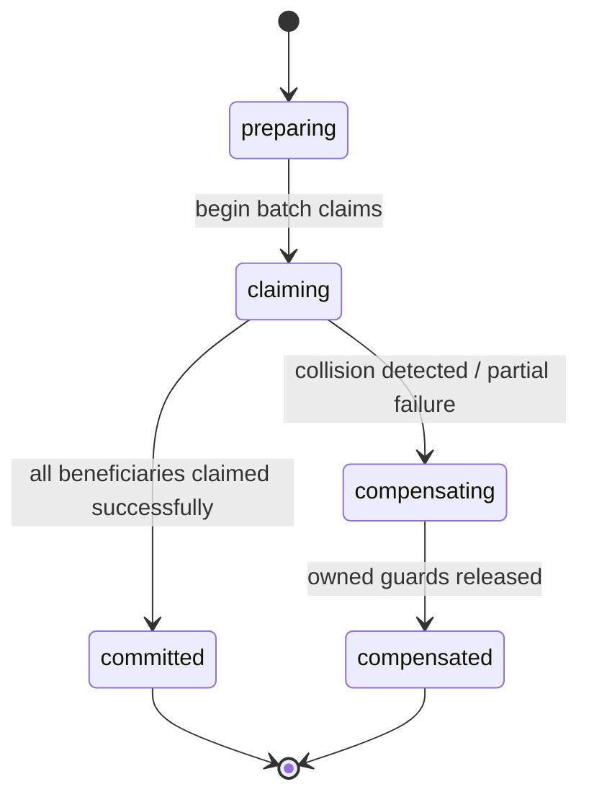

# draft-meal-distribution-entitlement-cr109-amendment — แก้ไขเพิ่มเติม CR-109: สิทธิประโยชน์อาหารรายบุคคล, การรับแทนในครัวเรือน และ Concurrency Coordination

> [!NOTE]
> **สรุป (TL;DR):**
> แก้ไขเพิ่มเติม [CR-109](CR-109-meal-distribution-onsite-scan.md) โดยยกระดับบันทึกการแจกอาหารหน้างานเข้าสู่สถาปัตยกรรม `DistributionLog` (`kind: 'meal'`), นิยามกุญแจตรวจสอบสิทธิ์อาหารปกติ (Normal Entitlement Key) เป็น **`beneficiary_id + meal_service_id`** (ตัด `recipe_id` ออกอย่างตั้งใจ — 1 คนได้ 1 สิทธิ์ต่อมื้อไม่ว่าจะเลือกเมนูใด), แยกแยะผู้รับแทน (`collector_id`) ออกจากผู้มีสิทธิ (`beneficiary_id`), รองรับการแจกซ้ำเป็นกรณีพิเศษด้วยการบันทึก Log ใหม่ที่มีการตรวจสอบสิทธิ์อนุมัติ (Audited Exception), และกำหนดเอกสารประสานงานความพร้อมกัน `MealEntitlementGuard` (CAS lifecycle `claimed` $\leftrightarrow$ `voided`, ห้าม Hard-delete) ร่วมกับ `MealDistributionOperation` ป้องกันการรับสิทธิ์ซ้อนกรณีทำรายการระดับครัวเรือนบน CouchDB

---

## 1. Why (เหตุผลและการแก้ไขข้อจำกัดเดิม)

ใน [CR-109](CR-109-meal-distribution-onsite-scan.md) ข้อกำหนด FR-MD-03 กำหนดให้ตรวจสิทธิ์ซ้ำที่ระดับ `(recipient_id, recipe_id, meal_service_id)` ซึ่งก่อให้เกิดช่องโหว่ทางธุรกิจ:
1. หากครัวปรุงอาหาร 2 ชนิดในมื้อเดียวกัน (เช่น ข้าวผัดไก่ และ ข้าวกระเพราฮาลาล) ผู้พักพิงสามารถสแกนรับข้าวผัดไก่แล้วเดินไปสแกนรับข้าวกระเพราต่อได้ในมื้อเดียวกัน เพราะ `recipe_id` ต่างกัน
2. CR-109 ยังไม่มีโมเดลรองรับการที่หัวหน้าครัวเรือนเดินมารับอาหารแทนสมาชิกทุกคนในบ้านพร้อมกัน ส่งผลให้สิทธิ์ของสมาชิกในบ้านไม่ถูกตัด
3. การตัดสิทธิ์ขาดแบบห้ามรับซ้ำเด็ดขาด ไม่สอดคล้องกับสถานการณ์ภัยพิบัติจริงที่มีกรณีอาหารหก หล่น หรือปนเปื้อน ซึ่งเจ้าหน้าที่จำเป็นต้องมีกระบวนการอนุโลมแจกซ้ำที่มีการบันทึกหลักฐานอย่างเป็นทางการ
4. CouchDB `_bulk_docs` ไม่มีความเป็น ACID แบบสมบูรณ์ หากหัวหน้าครัวเรือนขอรับอาหาร 4 คนแล้วระบบเกิดขัดข้องกึ่งกลาง จะเกิดปัญหา orphan claim ล็อกสิทธิ์ค้างไว้

---

## 2. นโยบายสิทธิ์อาหาร (Meal Entitlement Policy)

### 2.1 นิยามกุญแจสิทธิ์อาหารปกติ (Normal Entitlement Key)
กุญแจระบุตัวตนของสิทธิ์อาหารปกติถูกกำหนดอย่างเป็นทางการคือ:
$$\text{Normal Entitlement Identity} = \text{beneficiary\_id} + \text{meal\_service\_id}$$

- **การตัด `recipe_id` ออกอย่างตั้งใจ (Recipe Exclusion):** ห้ามนำ `recipe_id` หรือ `item_id` เข้ามาร่วมเป็นส่วนหนึ่งของกุญแจสิทธิ์เด็ดขาด
- **หลักการ:** ผู้ประสบภัย 1 คน มีสิทธิ์ได้รับอาหารปกติ 1 ที่ต่อ 1 รอบบริการมื้ออาหาร (`meal_service`) โดยไม่ขึ้นกับเมนูอาหารที่เลือก
- ข้อมูล `recipe_id` และ `item_id` จะถูกบันทึกไว้บน `MealDistributionLog` เพื่อเป็นหลักฐานว่าผู้รับเลือกรับเมนูใด แต่ไม่สร้างสิทธิ์ที่สอง

### 2.2 ผู้รับแทน กับ ผู้มีสิทธิที่แท้จริง (Collector vs Beneficiary)
- `collector_id`: รหัสประจำตัวของผู้ที่มายืนหน้าเคาน์เตอร์แจกจ่ายจริง
- `beneficiary_id`: รหัสประจำตัวของผู้ประสบภัยที่ถูกตัดสิทธิ์โควตาอาหาร
- **การบันทึกประวัติแบบ Normalized (ONE normalized MealDistributionLog per beneficiary):**
  สมมติ หัวหน้าครัวเรือน A มารับอาหารแทนตนเองและสมาชิกในบ้าน (A, B, C, D):
  ระบบต้องสร้าง **`MealDistributionLog` แยกเด็ดขาด 4 เอกสาร** (1 ฉบับต่อ 1 ผู้มีสิทธิ์)
  - แต่ละฉบับมี `beneficiary_id` ระบุตัวตนของสมาชิกแต่ละคน (A, B, C, D)
  - ทั้ง 4 ฉบับมี `collector_id` เป็นรหัสของ A (ผู้มารับแทน)
  - ทั้ง 4 ฉบับอ้างอิง `meal_service_id` มื้อเดียวกัน
  - แต่ละฉบับมีความสัมพันธ์ `primary_log_id` เชื่อมโยงตรงกับ `MealEntitlementGuard` ของผู้มีสิทธิ์คนนั้น
  - ธุรกรรมระดับครัวเรือนนี้ได้รับการประสานงานผ่าน **`MealDistributionOperation`** เพียง 1 ฉบับ ซึ่งเก็บ `beneficiary_ids: [A, B, C, D]` และ `log_ids: [log_A, log_B, log_C, log_D]`
  - **ห้ามบันทึกเป็น 1 เอกสารรวมที่กำกวมหรือคลุมเครือหลายสิทธิ์เด็ดขาด** เพื่อให้การตรวจสอบย้อนกลับและสถิติโภชนาการรายบุคคลถูกต้อง 100%

### 2.3 ผู้รับภายนอกแบบนิรนาม (Anonymous Outside Recipient)
- ผู้ประสบภัยภายนอกที่ยังไม่ได้ลงทะเบียน (`recipient_type: 'outside'`, `recipient_id: null`) สามารถรับอาหารปรุงสุกได้ตามนโยบายอนุเคราะห์
- ระบบไม่สามารถรับประกันการป้องกันการรับซ้ำได้ และต้องบันทึกใน Log ว่าไม่มีการตรวจสิทธิ์ซ้ำ
- ห้ามประดิษฐ์รหัสปลอม (Fake Persistent ID) และ**ห้ามผู้รับนิรนามทำเรื่องยืมพัสดุเด็ดขาด**

### 2.4 การแจกซ้ำเป็นกรณีพิเศษ (Exceptional Repeat Distribution)
- หากการสแกนปกติพบว่าได้รับสิทธิ์ไปแล้ว ระบบต้องแจ้งเตือนการรับซ้ำและบล็อกเป็นค่าเริ่มต้น (Normal Duplicate Blocked)
- อนุญาตให้แจกซ้ำได้เฉพาะกรณีที่ผ่านขั้นตอน **Audited Exception Workflow**:
  1. สร้างเอกสาร `MealDistributionLog` ใบใหม่ที่เป็น immutable เสมอ (ห้ามแก้ไขหรือเขียนทับประวัติเดิม)
  2. ระบุเหตุผลจำเป็น (`reason` เช่น `spilled`, `contaminated`, `damaged`, `operational_exception`)
  3. บันทึกรหัสเจ้าหน้าที่ผู้อนุมัติ (`override_by`) โดยต้องมีสิทธิ์ (Capability) `distribution.override_entitlement`
  4. ระบุความเชื่อมโยงกับ Log เดิม (`prior_log_id`)
  5. อนุญาตให้เกิดเหตุการณ์ exception ได้หลายครั้งหากมีเหตุผลรองรับ
  6. การแจกซ้ำเป็นกรณีพิเศษจะไม่รีเซ็ต Guard ปกติ และยังคงตรวจสอบเพดานความจุหน้างาน

---

## 3. สัญญาณโดเมน MealEntitlementGuard (Concurrency Coordinator)

เพื่อป้องกันการสแกนซ้ำข้ามเครื่องแท็บเล็ตพร้อมกัน (Race Condition) ระบบใช้เอกสารควบคุมความพร้อมกันแบบ Deterministic:
- **รหัสเอกสาร (`_id`):** `meal_entitlement_guard:{sha256(beneficiary_id + ":" + meal_service_id)}`
- **ฐานข้อมูล:** `shelter_{shelter_code}`
- **โครงสร้างฟิลด์:**
  ```json
  {
    "_id": "meal_entitlement_guard:...",
    "_rev": "1-...",
    "type": "meal_entitlement_guard",
    "beneficiary_id": "evacuee:01J...",
    "meal_service_id": "meal_service:01J...",
    "status": "claimed",
    "created_by_request_id": "req-uuid-...",
    "operation_id": "op-uuid-...",
    "primary_log_id": "distribution_log:01J...",
    "claimed_at": 1789300000000,
    "claimed_by": "user:staff1",
    "voided_at": null,
    "voided_by": null,
    "void_reason": null,
    "exception_log_ids": [],
    "claim_history": [
      {
        "claimed_at": 1789300000000,
        "claimed_by": "user:staff1",
        "operation_id": "op-uuid-...",
        "log_id": "distribution_log:01J..."
      }
    ]
  }
  ```

### กฎการเปลี่ยนสถานะและการยกเลิก (CAS Lifecycle & Anti-Permanent Lock)
1. **การเคลมปกติ (Normal Claim & Semantic Retry):**
   - หากยังไม่มี Guard: สร้างเอกสารสถานะ `claimed`
   - หากมี Guard สถานะ `claimed`: ตรวจสอบความเป็นเจ้าของเชิงความหมาย (Semantic Ownership Verification) — หาก `created_by_request_id` ตรงกับคำร้องปัจจุบันและฟิลด์ตรงกัน ให้ถือเป็น Idempotent Replay สำเร็จ; หากมาจากคำร้องอื่นให้ปฏิเสธการแจกซ้ำ (DUPLICATE_CLAIM_BLOCKED) โดย**ห้ามถือว่า HTTP 409 ทุกกรณีเป็นความสำเร็จโดยไม่ตรวจสอบ**
2. **การยกเลิกรายการ (Void Operation):**
   - เมื่อเจ้าหน้าที่ยกเลิกรายการแจกจ่าย (Undo/Void): ให้เปลี่ยนสถานะ Guard จาก `claimed` $\rightarrow$ `voided` พร้อมบันทึก `voided_at`, `voided_by`, `void_reason`
   - **ห้าม Hard-delete Guard เด็ดขาด** เพื่อรักษาประวัติการตรวจสอบย้อนกลับ
3. **การเคลมใหม่หลังการยกเลิก (CAS Reclaim):**
   - หาก Guard มีสถานะเป็น `voided` ผู้ประสบภัยสามารถกลับมารับอาหารได้ใหม่
   - ระบบจะทำ CAS Update เปลี่ยนสถานะจาก `voided` $\rightarrow$ `claimed` พร้อมบันทึกประวัติการรับลงใน `claim_history[]`
   - การทำเช่นนี้ป้องกันไม่ให้การ Void ล็อกสิทธิ์ของผู้ประสบภัยไปตลอดกาล

---

## 4. การประสานงานระดับครัวเรือน (Household Claim Coordinator: `MealDistributionOperation`)

เนื่องจากคำสั่ง `_bulk_docs` ของ CouchDB ไม่มีความเป็น ACID ข้ามหลายเอกสาร ระบบจึงใช้เอกสารประสานงานความพร้อมกันระดับ First-Class Coordination Document:
- **รหัสเอกสาร:** `meal_distribution_operation:{operation_id}` (ULID)
- **ฐานข้อมูล:** `shelter_{shelter_code}`
- **สถานะที่ Persist (Canonical Persisted States):**
  `'preparing' | 'claiming' | 'committed' | 'compensating' | 'compensated'`
  *(ห้ามใช้สถานะ `pending` หรือ `aborted` ในข้อมูลที่ persist โดยเด็ดขาด)*



### วงจรชีวิตและกระบวนการทำงาน (Lifecycle & Execution Flow)
1. **Normal Path:**
   `preparing` $\rightarrow$ `claiming` $\rightarrow$ `committed`
   - เมื่อเริ่มการแจกจ่ายระดับครัวเรือน ระบบสร้างเอกสาร operation ในสถานะ `preparing` บันทึก `beneficiary_ids: [A, B, C, D]`
   - ดำเนินการล็อก Guard แต่ละคน: เปลี่ยนสถานะ operation เป็น `claiming`
   - หากสำเร็จครบทุกคน: สร้าง `MealDistributionLog` แยก 4 ฉบับ และเปลี่ยนสถานะ operation เป็น `committed`
2. **Failure & Compensation Path:**
   `claiming` $\rightarrow$ `compensating` $\rightarrow$ `compensated`
   - หากตรวจพบการชนสิทธิ์ (HTTP 409 Conflict) เช่น สมาชิก C ถูกเคลมไปแล้วที่จุดแจกอื่น: operation เปลี่ยนสถานะเป็น `compensating`
   - **Scoped Compensation:** กลไกชดเชยจะทำการคืนสิทธิ์ (Compensate) ปลดเฉพาะ Guard ที่มี `guard.operation_id === current.operation_id` เท่านั้น (ห้ามแตะต้อง Guard ของผู้อื่นโดยเด็ดขาด)
   - เมื่อปลด Guard ที่ตนเองครอบครองเรียบร้อย operation เปลี่ยนสถานะเป็น `compensated`
   - UI แจ้งเตือนข้อขัดแย้งของสมาชิก C ชัดเจน และเปิดให้เจ้าหน้าที่เลือกลดจำนวนเพื่อทำรายการใหม่ได้

### การกู้คืนเมื่อระบบขัดข้อง (Crash Recovery Semantics)
- หากเกิดเหตุการณ์ไฟดับ เน็ตเวิร์กขาดหาย หรือเบราว์เซอร์แคราชระหว่างขั้นตอนเคลม (เช่น เคลม A และ B สำเร็จ แต่แคราชก่อนเคลม C หรือก่อนชดเชยเสร็จ):
- เมื่อไคลเอนต์ทำการ Retry ด้วย `client_request_id` เดิม:
  1. ไคลเอนต์อ่าน `meal_distribution_operation:{operation_id}` ที่มีอยู่
  2. ตรวจสอบอาเรย์ `claimed_guard_ids[]` และยืนยันความเป็นเจ้าของสิทธิ์ผ่าน `operation_id`
  3. สั่งรันกระบวนการชดเชย (Compensation) ต่อจนสำเร็จสมบูรณ์ (`compensated`) หรือดำเนินการต่อตามคำยืนยันของผู้ใช้งานหน้างาน
  4. **ไม่มีการทิ้ง Orphan Guard ล็อกสิทธิ์ค้างไว้อย่างถาวรในระบบ (Anti-Orphan Entitlement Invariant)**

---

## 5. เกณฑ์การยอมรับ (Acceptance Criteria)

- **AC-ME-01 (Single Entitlement per Meal Service):** ผู้พักพิงที่ได้รับอาหารเมนูหนึ่งแล้ว พยายามสแกนรับอาหารอีกเมนูในมื้อเดียวกัน ต้องถูกบล็อก (Hard-block ที่ระดับ beneficiary + meal_service)
- **AC-ME-02 (Collector Separation):** เมื่อหัวหน้าครัวเรือนมารับอาหารแทนสมาชิก 3 คน ระบบต้องตัดสิทธิ์ของสมาชิกทั้ง 3 คน และบันทึก collector_id เป็นหัวหน้าครัวเรือน
- **AC-ME-03 (Audited Exception):** กรณีอาหารหกหล่น เจ้าหน้าที่ที่มี capability `distribution.override_entitlement` สามารถอนุมัติแจกซ้ำได้ โดยระบบต้องสร้าง `MealDistributionLog` ใบใหม่ และบันทึกประวัติ audit ชัดเจน
- **AC-ME-04 (Void and Reclaim Safe):** การยกเลิกรายการอาหารต้องเปลี่ยน Guard เป็น `voided` (ห้ามลบเอกสาร) และเมื่อผู้พักพิงมารับใหม่ ระบบต้องสามารถ CAS reclaim กลับเป็น `claimed` ได้อย่างถูกต้อง
- **AC-ME-05 (Household Compensation):** หากการรับอาหารของครัวเรือนล้มเหลวกึ่งกลาง ระบบต้องคืนสิทธิ์เฉพาะสมาชิกที่ถูกล็อกใน operation นั้น โดยไม่กระทบสิทธิ์ของผู้อื่น
