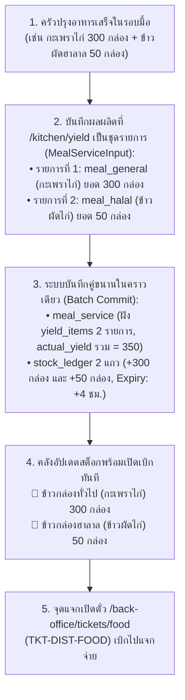
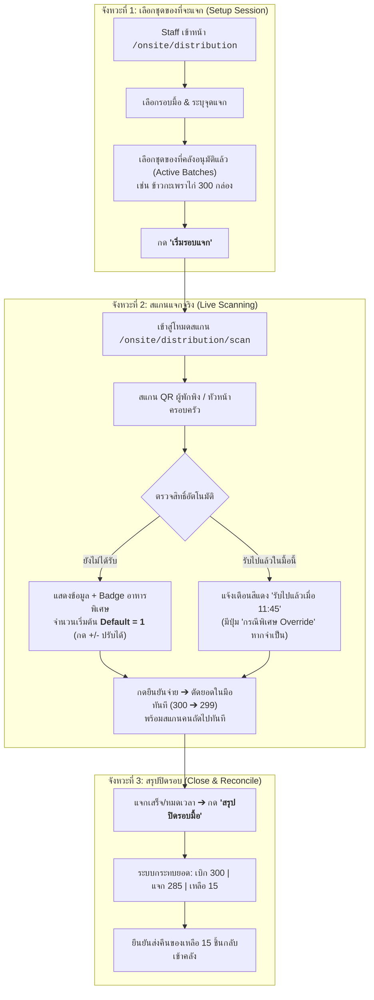
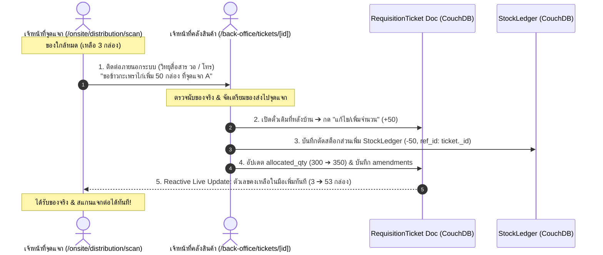
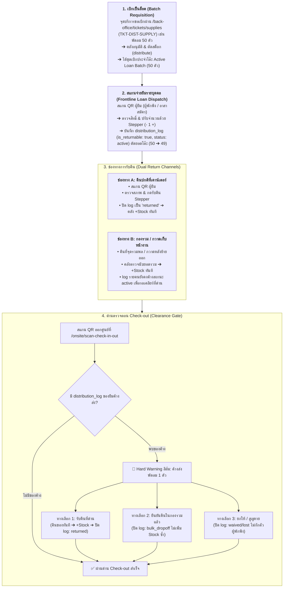

# ข้อกำหนดระบบตั๋วเบิกคลังและแจกจ่ายสิ่งของหน้างาน
## (Requisition Ticket & Frontline Distribution Specification)

> **สรุป (TL;DR):**  
> **เปลี่ยนอะไร:** รวมตั๋วเบิกจ่าย 4 ประเภทเป็น `RequisitionTicket` + รวมบันทึกแจกจ่ายและของยืมเป็น `DistributionLog` + ขยาย `ItemMaster` (`PREPARED_FOOD`) และ `MealService` (`yield_items`)  
> **เพื่อใคร/ทำไม:** ทีมโรงครัว, คลังสินค้า, และจุดแจกจ่ายหน้างาน เพื่อให้การเบิกจ่าย-ส่งมอบ-ยืมคืนไม่รั่วไหล เชื่อมโยงรอบมื้อ คุมอายุอาหาร 4 ชม. และปลดภาระของยืมตอน Check-out  
> **dev ต้อง build อะไร:** สร้าง 4 เวิร์กสเปซหลังบ้าน (`/back-office/tickets/*`), ระบบสแกนแจกจ่ายหน้างาน (`/onsite/distribution/*`), ระบบยืม-คืนพัสดุ (`/onsite/loans`, `/onsite/returns`), และด่าน Check-out Clearance  
> **กระทบ schema/scope:** เพิ่ม doc types `requisition_ticket`, `distribution_log` ใน DB `shelter_{shelter_code}` §2 (Operations), ขยาย `item_master` และ `meal_service` (backward-compatible)

---

## 1. ประเภทของตั๋วเบิกจ่าย (4 Requisition Types)

อ้างอิงสถาปัตยกรรมคลังสินค้าและเหตุผลการตัดสต็อกตาม `CR-059`:

| ประเภทตั๋ว (Type)              | ชื่อเอกสาร                     | วัตถุประสงค์                           | ปลายทาง                   | Stock Ledger Reason    |
| :--------------------------- | :--------------------------- | :---------------------------------- | :------------------------ | :--------------------- |
| **Type 1: TKT-KITCHEN**      | ตั๋วเบิกวัตถุดิบเข้าครัว             | เบิกวัตถุดิบ/เครื่องปรุง/แก๊สไปประกอบอาหาร     | โรงครัวของศูนย์              | `reason: requisition`  |
| **Type 2: TKT-DIST-FOOD**    | ตั๋วเบิกอาหารปรุงสุกไปแจกจ่าย         | เบิกข้าวกล่อง/อาหารพร้อมทานไปแจกผู้พักพิง (คุมอายุ 4 ชม.) | จุดแจกจ่ายอาหารหน้างาน       | `reason: distribute`   |
| **Type 3: TKT-DIST-SUPPLY**  | ตั๋วเบิกสิ่งของบรรเทาทุกข์และของยืม     | เบิกของใช้สิ้นเปลืองและพัสดุคงทน/ครุภัณฑ์ยืมคืน  | จุดแจกจ่ายสิ่งของ / โต๊ะยืมพัสดุ  | `reason: distribute`   |
| **Type 4: TKT-TRANSFER**     | ตั๋วโอนย้ายพัสดุข้ามศูนย์            | โอนย้ายของระหว่างคลังหรือข้ามศูนย์             | คลังปลายทาง / ศูนย์อื่น        | `reason: transfer_out` |

### 1.1 โครงสร้าง 4 หน้าจอเฉพาะทางตามประเภทที่เบิก (4 Dedicated Ticket Workspaces)
เพื่อป้องกันปัญหาความสับสนของแบบฟอร์มและฟิลด์ข้อมูลที่แตกต่างกันในทางปฏิบัติ ระบบจึงแยกการทำงานออกเป็น **4 หน้าจอเฉพาะทาง (4 Dedicated Pages)** แทนการยัดรวมในตารางเดียว:

1. **🍳 ตั๋วเบิกวัตถุดิบเข้าครัว (`/back-office/tickets/kitchen`):**
   * สำหรับทีมโรงครัวและคลังวัตถุดิบ
   * แสดงความเชื่อมโยงกับสูตรอาหาร (BOM Recipe), แผนมื้ออาหาร (`meal_plan_id`), ถังแก๊สและการคำนวณการเผาไหม้
   * รองรับการตรวจสอบสต็อกคงเหลือและการตัดสต็อกวัตถุดิบตามลำดับหมดอายุก่อน-หลัง (FEFO)
2. **🍱 ตั๋วเบิกอาหารปรุงสุกไปแจกจ่าย (`/back-office/tickets/food`):**
   * สำหรับทีมจุดแจกจ่ายอาหารและโรงครัว
   * บังคับระบุรอบมื้ออาหาร (`MealPeriod`: เช้า, กลางวัน, เย็น, ของว่าง) และแสดงเวลาปรุงเสร็จ
   * **ตัวนับเวลาถอยหลังอายุอาหาร 4 ชั่วโมง (Food Safety Countdown):** แจ้งเตือนสถานะความสดใหม่และบล็อกการจ่ายเมื่อหมดอายุ
   * สร้างชุดแจกจ่าย Active Batch สำหรับหน้าจอสแกนแจกรายมื้อ (`/onsite/distribution`)
3. **📦 ตั๋วเบิกสิ่งของบรรเทาทุกข์และของยืม (`/back-office/tickets/supplies`):**
   * สำหรับทีมบริการแจกจ่ายสิ่งของและพัสดุคงทน
   * จำแนกรายการแจกขาด (`CONSUMABLE` เช่น สบู่ ยาสีฟัน) และสิ่งของยืมคืน (`DURABLE` / `EQUIPMENT` เช่น เต็นท์ มุ้ง พัดลม วิทยุสื่อสาร)
   * แสดงยอดจัดสรรประจำโต๊ะ (Active Batch), ยอดจ่ายยืมรายคนสะสม, ยอดค้างส่ง และการแจ้งเตือนไปยังด่าน Check-out
4. **🚚 ตั๋วโอนย้ายพัสดุข้ามศูนย์ (`/back-office/tickets/transfers`):**
   * สำหรับทีมโลจิสติกส์และผู้จัดการคลังสินค้า (ตามสเปก `CR-059`)
   * บังคับระบุชื่อผู้ขับขี่, หมายเลขทะเบียนรถขนส่ง, ศูนย์ต้นทาง และศูนย์ปลายทาง
   * รองรับการจัดสรรข้ามล็อต (Split Allocation) และปุ่มคัดค้าน/ระงับคำสั่งปฏิบัติการ
* **🌐 หน้ารวมศูนย์ภาพรวม (`/back-office/tickets` - Ticket Hub & Summary):**
  * ทำหน้าที่เป็นหน้าทางเข้าหลัก (Landing Hub) แสดงแดชบอร์ดสรุปยอดคำขอเบิกทั้ง 4 ประเภท
  * แสดง Badge ตัวเลขคำขอรออนุมัติ (Pending Approval Counters) แบบเรียลไทม์ และปุ่ม Quick Navigation กระโดดไปยังหน้าจอเฉพาะทางแต่ละประเภททันที

### 1.2 การแยกพฤติกรรมตั๋วเบิกตามประเภทพัสดุ (Behavior by `type_class`)
ระบบจำแนกประเภทพัสดุในตั๋วเบิกผ่านฟิลด์ `type_class` เพื่อควบคุม Business Logic ให้ถูกต้องตามลักษณะการใช้งานจริง:
* **🍱 `PREPARED_FOOD` (อาหารปรุงสำเร็จ/อาหารพร้อมทาน — เพิ่มใหม่):**
  * **บังคับระบุมื้ออาหาร (`meal`):** ต้องระบุ เช้า / กลางวัน / เย็น / ของว่าง (`MealPeriod`)
  * **บังคับกฎควบคุมอายุอาหาร (Food Safety):** สต็อกมีอายุเพียง **4 ชั่วโมง** นับจากเวลาปรุงเสร็จ เกินกำหนดระบบจะบล็อกจ่ายทันที
  * **โหมดแจกจ่ายหน้างาน (Live QR Scan):** ส่งเข้าสู่โฟลว์สแกนแจกจ่ายจำกัดสิทธิ์ **1 คน ต่อ 1 มื้อ**
* **📦 `CONSUMABLE` (วัสดุสิ้นเปลือง/วัตถุดิบ/ของแห้ง):** ข้าวสาร น้ำมันพืช ยารักษาโรค สบู่ ยาสีฟัน — แจกตามรอบเสบียงหรือเบิกเข้าครัวประกอบอาหาร (ไม่ผูกกับกฎ 4 ชั่วโมง)
* **⛺ `DURABLE` (สิ่งของคงทน):** เต็นท์ มุ้ง ผ้าห่ม — แจกแบบครั้งเดียวต่อคน/ครัวเรือน (`one_time`) หรือติดตามการส่งคืน (`returnable`)
* **🔧 `EQUIPMENT` (ครุภัณฑ์และเครื่องมือ):** ถังแก๊ส เครื่องครัวขนาดใหญ่ — เบิกใช้งานพร้อมบันทึกสถานะทรัพย์สิน (`asset_status`) และต้องส่งคืนคลังเมื่อปิดศูนย์

---

## 2. ผังกระบวนการทำงานหลัก (End-to-End Workflow)

กระบวนการแบ่งเป็น 3 ช่วงตามลำดับจากบนลงล่าง: **1. ยื่นคำขอผ่าน 4 เวิร์กสเปซ ➔ 2. อนุมัติและตัดสต็อกคลัง ➔ 3. ปลายทางรับไปปฏิบัติการ**


### วงจรสถานะของตั๋วเบิก (Ticket Lifecycle)
* `DRAFT` ➔ อยู่ระหว่างร่างรายการ
* `REQUESTED` ➔ ยื่นคำขอ รออนุมัติ
* `APPROVED` ➔ อนุมัติแล้ว รอจัดของ
* `ALLOCATED / DISPATCHED` ➔ คลังตัดสต็อกและส่งมอบของให้ผู้ถือตั๋ว
* `IN_DISTRIBUTION` ➔ กำลังแจกจ่ายหน้างาน (เฉพาะตั๋วประเภทอาหารและสิ่งของแจกจ่าย)
  * **✨ การเติมของระหว่างแจก (In-flight Ticket Amendment):** จุดแจกไม่ต้องเปิดตั๋วใหม่หรือกดยื่นคำขอในระบบ แต่ประสานงานกับคลังภายนอกระบบ (วอ/โทร) จากนั้นคลังสินค้าจะเปิดหน้า **แก้ไขตั๋วเดิม** ที่หลังบ้านเพื่อเพิ่มจำนวน ระบบจะตัดสต็อกคลังเพิ่มตามจำนวนส่วนต่าง (`stock_ledger`) และจุดแจกจะได้รับยอดของในมือเพิ่มขึ้นทันทีแบบ Reactive
* `COMPLETED` ➔ สรุปยอดแจกจริงและคืนของเหลือเข้าคลังเสร็จสิ้น
* `CANCELLED` ➔ ยกเลิกคำขอ

---

## 3. การเชื่อมต่อ ครัว ↔ คลัง และ Master Data (Kitchen Yield Integration)

เพื่อป้องกันปัญหา **Master Data บวม (Catalog Bloat)** จากเมนูอาหารที่เปลี่ยนทุกวันตามของบริจาค ระบบใช้แนวทาง **"Standard Archetypes + Dynamic Lot Metadata"**

### 3.1 รายการอาหารปรุงสำเร็จมาตรฐาน (Standard Meal Archetypes)
กำหนด Master Data กลางไว้ 5 รายการใน `catalog` โดยขยายฟิลด์ **`type_class: 'PREPARED_FOOD'`** (อาหารปรุงสำเร็จพร้อมทาน) เพื่อแยกออกจาก `CONSUMABLE` (วัตถุดิบ/ของแห้ง) ชัดเจน ตามมาตรฐาน UPPERCASE ของ Catalog:

| รหัสสินค้า (`_id`)               | ชื่อสินค้า                      | ประเภท (`type_class`) | หน่วย     | คุณสมบัติที่รองรับใน `item_master` ปัจจุบัน | กลุ่มเป้าหมายที่แจกได้                      |
| :---------------------------- | :-------------------------- | :-------------------- | :------- | :------------------------------------ | :------------------------------------ |
| `item_master:meal_general`    | ข้าวกล่องปรุงสำเร็จ (อาหารทั่วไป)  | `PREPARED_FOOD`       | กล่อง     | `dietary: []`                         | ผู้พักพิงทั่วไปทุกคน                         |
| `item_master:meal_halal`      | ข้าวกล่องปรุงสำเร็จ (ฮาลาล)      | `PREPARED_FOOD`       | กล่อง     | `dietary: ['HALAL']`                  | ชาวมุสลิม (`halal`)                     |
| `item_master:meal_vegetarian` | ข้าวกล่องปรุงสำเร็จ (มังสวิรัติ/เจ)  | `PREPARED_FOOD`       | กล่อง     | `dietary: ['VEGAN']`                  | มังสวิรัติ (`vegetarian`)                 |
| `item_master:meal_soft`       | อาหารปรุงสำเร็จ (อาหารอ่อน/โจ๊ก) | `PREPARED_FOOD`       | ถ้วย/กล่อง | `age_group: 'ELDERLY'`                | ผู้สูงอายุ/ติดเตียง (`elderly`/`bedridden`) |
| `item_master:meal_infant`     | อาหารเสริมเด็กอ่อน/ทารก        | `PREPARED_FOOD`       | ถ้วย      | `age_group: 'INFANT'`                 | ทารกและเด็กเล็ก (`infant`)              |

*(หมายเหตุ: ตัดคอลัมน์หมวดหมู่ `category` ออกจาก Master Archetypes เนื่องจากเป็น Dynamic Choice ที่ผู้ใช้เลือกจาก `item_category` ตอนบันทึกเข้าคลัง)*

> **💡 กฎการจัดเก็บในฐานข้อมูล (Item Master Flat 1:1 Invariant):**  
> อาหารแต่ละประเภทจัดเก็บเป็น **Document แยกรายตัวแบบ 1:1 (Flat Documents)** ใน `catalog` เหมือนสินค้าทั่วไปในระบบปัจจุบัน (`$lib/features/catalog/domain/catalog.ts`) **ไม่ต้องเก็บเป็น Array รวมหรือสร้าง Schema พิเศษใน Item Master** โดยอาศัยฟิลด์มาตรฐานเดิม (`dietary`, `age_group`, `allergens`, `base_unit`) เพื่อให้การอ้างอิง `item_id` ใน `stock_ledger` และ `ticket_item` เรียบง่ายและตรงไปตรงมา

> **💡 การจำแนกด้วย `type_class = 'PREPARED_FOOD'`:**
> ช่วยให้ระบบตั๋วเบิกอาหารปรุงสุก (`TKT-DIST-FOOD`) ในหน้า `/back-office/tickets/food` และระบบคลังสต็อกการ์ด สามารถคัดกรองได้อัตโนมัติว่าไอเทมใดต้องบังคับใช้ **กฎควบคุมอายุ 4 ชั่วโมง** และเปิดโหมดสแกนแจกจ่ายรายมื้อหน้างาน โดยไม่ไปปะปนกับของบริโภคทั่วไป เช่น ข้าวสาร น้ำดื่ม หรือปลากระป๋องที่เป็น `CONSUMABLE`

### 3.2 กฎการบันทึก Lot และความปลอดภัยทางอาหาร (Food Safety Invariants)
1. **ชื่อเมนูจริง:** บันทึกลงในฟิลด์ `lot.note` เช่น `"ข้าวกะเพราไก่ไข่ดาว"` โดยไม่ต้องเปิด SKU ใหม่
2. **รหัสล็อต:** ออกอัตโนมัติรูปแบบ `L-YYMMDD-XXX` (CR-088) พร้อมระบุโซนพักของ (`storage_zone`)
3. **⚠️ อายุอาหารปรุงสุก (Shelf-Life) = 4 ชั่วโมง:**
   * คำนวณ `lot.expiry = เวลาปรุงเสร็จ + 4 ชม.`
   * หากเกิน 4 ชม. สต็อกจะขึ้นสถานะ **"🚨 หมดอายุ (EXPIRED)"** และ **บล็อกการสแกนแจกจ่ายทันที**

### 3.3 โฟลว์การบันทึกผลผลิตเข้าคลังแบบชุดรายการ (Batch Yield Integration with MealService)

ใน 1 รอบมื้อ ครัวมักปรุงอาหารหลายประเภทพร้อมกัน (เช่น ข้าวทั่วไป 300 กล่อง, ข้าวฮาลาล 50 กล่อง, ข้าวต้ม 20 ถ้วย) ระบบจึงรองรับการส่งผลผลิตเป็น **Array ของรายการอาหาร (`yield_items: [...]`)** ผ่าน `MealServiceInput` เพื่อบันทึกเข้า **`meal_service` (ฝังเป็น Embedded Array ในฟิลด์ `yield_items`)** พร้อมบันทึก `stock_ledger` ใน Transaction เดียว:



---

## 4. การเบิกของและแจกจ่ายจริงหน้างาน (On-site Distribution)

### 4.1 ผังกระบวนการแจกจ่าย 3 จังหวะ (3-Step Distribution Flow)



### 4.2 กฎการทำงานสำคัญ (Business Rules)
1. **การตรวจจับมื้ออาหาร (Meal Period Resolution):**
   * ล็อกตาม Ticket ที่เลือกเป็นหลัก
   * หรือตรวจจับตามเวลาจริง: เช้า (`06:00–09:30`), กลางวัน (`11:00–13:30`), เย็น (`17:00–19:30`), นอกเวลานี้คือของว่าง (`snack`)
   * Staff มีสิทธิ์กดสลับมื้อได้เองบน Header หากแจกเหลื่อมเวลา
2. **การตรวจสิทธิ์และเงื่อนไขพิเศษ (Validation & Flags):**
   * โควตามาตรฐาน: 1 สิทธิ์ ต่อ 1 คน ต่อ 1 มื้อ
   * แสดง Badge แจ้งเตือนเงื่อนไขพิเศษทันทีเมื่อสแกน: ⚠️ ฮาลาล, ⚠️ อาหารเด็ก, ⚠️ แพ้อาหาร, ⚠️ ผู้ป่วยติดเตียง
   * หากสแกน QR หัวหน้าครอบครัว ระบบจะแสดงจำนวนสมาชิกในบ้านที่ Active อยู่เพื่อใช้อ้างอิง
3. **การปรับจำนวนและการรับซ้ำ:**
   * **Default Quantity = 1:** จำนวนจ่ายตั้งต้นเป็น 1 ชิ้นเสมอ
   * **Quantity Stepper (`[-] 1 [+]`):** Staff กดปรับเพิ่ม/ลดจำนวนได้หน้างานจริง (เช่น รับแทนครอบครัว)
   * **Special Override:** กรณีสแกนซ้ำแต่มีความจำเป็น (อาหารหก/มีสมาชิกเพิ่ม) Staff สามารถกดอนุมัติพร้อมบันทึกเหตุผลลง Audit Log

### 4.3 องค์ประกอบหน้าจอหลัก (Key Screen Specs)
* **หน้าเลือกชุดของ (`/onsite/distribution`):** แสดงตัวเลือกมื้ออาหาร, รายการ Ticket ที่คลังปล่อยของแล้ว (Active Batches) พร้อมจำนวนคงเหลือในมือ และปุ่มเริ่มรอบแจก
* **หน้าจอสแกนจริง (`/onsite/distribution/scan`):** โหมดกล้องสแกน QR อัตโนมัติ (พร้อมช่องค้นหาชื่อ/เต็นท์), การ์ดแสดงข้อมูลผู้พักพิงและ Badge อาหารพิเศษ, Stepper ปรับจำนวน `[-] [1] [+]`, ปุ่มยืนยันจ่ายขนาดใหญ่ และปุ่ม Override สีส้ม (หน้าจอออกแบบให้เน้นการสแกนรวดเร็ว **ไม่มีปุ่มเปิดตั๋วหรือสร้างคำขอเบิกของใหม่** เพื่อไม่ให้สร้างความสับสนหน้างาน)

### 4.4 การแก้ไขตั๋วเดิมเพื่อเติมของที่จุดแจก (External Coordination & In-flight Ticket Amendment)

ในสถานการณ์จริงหน้างาน ผู้พักพิงอาจมารับของมากกว่าประมาณการ หรือของที่เบิกมาหมดก่อนปิดรอบมื้อ **ระบบออกแบบให้จุดแจกไม่ต้องเปิดตั๋วใหม่และไม่ต้องมีปุ่มยื่นคำขอในระบบจุดแจก** โดยให้เจ้าหน้าที่ติดต่อประสานงานกันภายนอกระบบ (เช่น วิทยุสื่อสาร วอ, โทรศัพท์ หรือแจ้งปากเปล่า) และให้คลังสินค้าเป็นผู้เข้าไป**แก้ไขตั๋วใบเดิมที่หลังบ้าน**:

#### 4.4.1 ขั้นตอนการปฏิบัติงาน 4 จังหวะ (The 4-Step Amendment Flow)

1. **จุดแจกประสานงานคลังภายนอกระบบ (Out-of-band Coordination):**
   * เมื่อของใกล้หมด เจ้าหน้าที่จุดแจกติดต่อคลังสินค้าผ่านช่องทางสื่อสารภายนอก (เช่น **วิทยุสื่อสาร วอ, โทรศัพท์ หรือเดินไปแจ้งที่คลัง**) โดยระบุเลขตั๋วหรือจุดแจก และจำนวนที่ต้องการเติม (เช่น ขอข้าวกะเพราไก่เพิ่ม 50 กล่อง)
   * หน้าจอจุดแจก (`/onsite/distribution/scan`) ทำหน้าที่สแกนจ่ายของที่มีอยู่ในมือต่อไปตามปกติ ไม่ต้องหยุดชะงัก
2. **คลังสินค้าเปิดแก้ไขตั๋วใบเดิมที่หลังบ้าน (Back-office Ticket Edit):**
   * เจ้าหน้าที่คลังเปิดตั๋วใบเดิมที่กำลังใช้งานอยู่ (`status: in_distribution`) ที่หน้าจอ `/back-office/tickets/[id]`
   * กดปุ่ม **"✏️ แก้ไขรายการ / เพิ่มจำนวนพัสดุ (Add/Increase Items)"**
   * ระบุจำนวนที่จ่ายเพิ่ม (`added_qty`) เช่น +50 กล่อง พร้อมระบุหมายเหตุสั้นๆ (เช่น "จุดแจก A วอแจ้งขอเพิ่ม")
3. **ระบบตัดสต็อกส่วนเพิ่มอัตโนมัติ (Delta Stock Deduction & Ledger Commit):**
   * เจ้าหน้าที่คลังกดยืนยันการแก้ไข ระบบตรวจสอบสต็อกคงเหลือในคลัง และบันทึกแถวใหม่ลงใน `stock_ledger` ทันที:
     * `item_id`: รหัสสินค้า
     * `qty`: `-added_qty` (ตัดสต็อกคลังเพิ่มตามจำนวนจริงที่เติม)
     * `reason`: `'distribute'`
     * `ref_id`: รหัสตั๋วใบเดิม (`requisition_ticket._id`)
   * ปรับยอดจัดสรรสะสมในตั๋วใบเดิม:  
     `TicketItem.allocated_qty = TicketItem.allocated_qty + added_qty`
   * บันทึกประวัติการแก้ไขลงใน Array `amendments` บนตัวตั๋วเพื่อการตรวจสอบย้อนหลัง
4. **หน้าจอจุดแจกรับรู้ยอดเพิ่มอัตโนมัติ (Reactive Live Update):**
   * หน้าจอแจกจ่าย (`/onsite/distribution/scan`) ที่ผูกอยู่กับตั๋วใบเดิมจะตรวจพบการเปลี่ยนแปลงผ่าน CouchDB Live Changes / Reactive Store ทันที
   * ยอดของคงเหลือในมือ (Remaining In-Hand) ขยายตัวเพิ่มขึ้นตามจำนวนที่คลังเติมให้ทันที (เช่น เดิมเหลือ 3 กล่อง + คลังเติมให้ 50 กล่อง ➔ ตัวเลขในมือกลายเป็น 53 กล่องทันที)
   * เจ้าหน้าที่จุดแจกนำของที่คลังส่งมาแจกจ่ายต่อได้ทันทีอย่างไร้รอยต่อ



#### 4.4.2 กฎการควบคุมและการกระทบยอด (Amendment Invariants)
1. **จุดแจกไร้ภาระการเปิดตั๋ว (Frontline Zero-Administration Invariant):**  
   หน้าจอจุดแจกจ่าย (`/onsite/distribution/scan`) มุ่งเน้นประสิทธิภาพการสแกนและลดคิวหน้างาน จะไม่มีปุ่มสร้างตั๋วหรือส่งคำขอดิจิทัล การประสานงานขอของเพิ่มใช้ช่องทางกายภาพ/วิทยุสื่อสารตามธรรมชาติของศูนย์พักพิง
2. **การคงอยู่ของตั๋วใบเดิม (Single Ticket Lifecycle Invariant):**  
   ไม่จำเป็นต้องปิดรอบแจก ไม่ต้องสร้างตั๋วใบใหม่ การเติมของทำผ่านการแก้ไขตั๋วใบเดิมที่กำลัง Active อยู่ ทำให้ยอดแจกและของเหลือตอนปิดรอบถูกกระทบยอดจบในตั๋วใบเดียว
3. **กฎ Append-only ของสต็อก (Delta Ledger Invariant):**  
   ทุกครั้งที่คลังแก้ไขเพิ่มจำนวนในตั๋วที่อนุมัติไปแล้ว ระบบต้องสร้างแถวใหม่ใน `stock_ledger` เสมอ (`qty: -added_qty`) ห้ามแก้ตัวเลขแถวเดิม เพื่อให้สต็อกการ์ดคลังถูกต้อง 100%
4. **ความปลอดภัยต่อ Concurrency:**  
   การสแกนจ่ายของจุดแจกสร้างเอกสาร `DistributionLog` แยกชิ้น จึงไม่ชนกับจังหวะที่คลังเปิดแก้ไขเอกสาร `RequisitionTicket` ที่หลังบ้าน

---

## 5. การเบิกจ่ายสิ่งของคงทนและการติดตามรับคืน (Returnable Items & Loan Lifecycle)

สำหรับสิ่งของคงทน (`type_class: 'DURABLE'`) และครุภัณฑ์/อุปกรณ์ (`type_class: 'EQUIPMENT'`) ที่ต้องนำกลับมาใช้งานซ้ำ เช่น **พัดลม, มุ้ง, เต็นท์, วีลแชร์, ปลั๊กพ่วง, วิทยุสื่อสาร, เสื้อกั๊กสะท้อนแสง** ระบบได้ออกแบบกระบวนการควบคุม 2 ชั้น (Two-Tier Accountability) เพื่อความคล่องตัวหน้างานสูงสุด โดย**ไม่ใช้ Barcode หรือ Asset Tag รายชิ้น** แต่ใช้การนับจำนวนผูกกับตัวบุคคล

### 5.1 ผังกระบวนการยืมและคืน 4 จังหวะ (The 4-Stage Loan & Return Lifecycle)



### 5.2 การควบคุม 2 ชั้น (Two-Tier Accountability)
1. **ระดับล็อต (Batch Level - คลัง ➔ จุดบริการ):**
   * จุดบริการ/โต๊ะแจกเปิดตั๋ว `TKT-DIST-SUPPLY` ที่หน้าจอ `/back-office/tickets/supplies` ขอเบิกสิ่งของคงทนเป็นล็อต (เช่น พัดลม 50 ตัว, ปลั๊กพ่วง 20 อัน)
   * เมื่อคลังอนุมัติ ระบบจะตัดสต็อกคลังทันที (`reason: distribute`) และส่งมอบของให้อยู่ในสถานะ **Active Loan Batch**
   * เมื่อสิ้นสุดวันหรือปิดจุดบริการ ของที่ยังไม่ได้แจกยืมจะถูกกระทบยอดและส่งคืนคลังตามขั้นตอนปกติ
2. **ระดับบุคคล (Loan Level - จุดบริการ ➔ ผู้พักพิง/อาสาสมัคร):**
   * เจ้าหน้าที่จ่ายของให้ผู้ยืมผ่านการสแกน QR ผู้ยืม และปรับจำนวนด้วยปุ่ม Stepper `[-] 1 [+]`
   * ระบบสร้างระเบียน **`distribution_log`** (โดยมี `is_returnable: true`, `status: 'active'`) ผูกกับรหัสผู้ยืม (`recipient_id`) และอ้างอิง `ticket_id` ต้นทาง
   * **ปราศจากบาร์โค้ด (No Barcode Tracking):** เพื่อความรวดเร็วสูงสุด ไม่ต้องเสียเวลาติดสติกเกอร์บาร์โค้ดรายชิ้นหรือยิงบาร์โค้ดหน้างาน ใช้การบันทึกจำนวน (`qty`, `qty_returned`) และสภาพของตอนคืนเท่านั้น

### 5.3 ขอบเขตการผูกผู้ยืม (Recipient Scope)
1. **ผู้พักพิงรายบุคคล (`recipient_type: 'evacuee'`):**
   * ผูกความรับผิดชอบไว้ที่ระดับ **"บุคคล (Individual)"** ที่เป็นผู้ถือ QR มาสแกนรับของ (ไม่ใช่ผูกกับเต็นท์หรือครอบครัวรวม)
   * ป้องกันปัญหาเมื่อสมาชิกในครอบครัวแยกย้ายกัน Check-out คนละเวลา หรือมีการย้ายเต็นท์
2. **อาสาสมัคร/เจ้าหน้าที่ปฏิบัติงาน (`recipient_type: 'volunteer'`):**
   * รองรับการยืมอุปกรณ์ปฏิบัติงาน เช่น **วิทยุสื่อสาร (Walkie-Talkie), เสื้อกั๊กสะท้อนแสง, ไฟฉายแรงสูง**
   * อาสาสมัครสแกน QR Digital Ticket ของตนเองเพื่อยืมอุปกรณ์เข้ากะ
   * เมื่อสิ้นสุดกะการทำงาน (Shift Check-out) ระบบจะแจ้งเตือนให้คืนอุปกรณ์ก่อนปิดกะ

### 5.4 ช่องทางการรับคืนของ 2 รูปแบบ (Dual Return Channels)
1. **ช่องทางที่ 1: คืนแบบปกติที่เคาน์เตอร์ (Routine / Warehouse Return):**
   * ผู้ยืมนำของมาคืนที่โต๊ะบริการหรือคลังสินค้าด้วยตนเอง
   * เจ้าหน้าที่สแกน QR ผู้ยืม ระบบจะดึงรายการยืมที่ค้างอยู่ (`is_returnable: true, status: 'active'`) ขึ้นมาแสดงทันที
   * เจ้าหน้าที่ตรวจสภาพสิ่งของ (`READY` พร้อมใช้ / `MAINTENANCE` ชำรุดซ่อมได้ / `BROKEN` เสียหายทิ้ง) แล้วกดปุ่มรับคืนตามจำนวน
   * ระบบปรับสถานะ `distribution_log` เป็น `returned` และบันทึก `stock_ledger` เพิ่มสต็อกกลับเข้าคลัง (`+Stock`) ทันที
2. **ช่องทางที่ 2: คืนแบบกองรวม / กวาดเก็บหน้างาน (Bulk Drop-off / Floor Sweep):**
   * ในสถานการณ์จริง ผู้พักพิงมักนำของไปวางรวมไว้ที่จุดรวมพล เต็นท์กองกลาง หรือเจ้าหน้าที่เข้ากวาดเก็บพื้นที่หลังผู้พักพิงเดินทางกลับ โดยไม่ได้สแกนชื่อรายคน
   * คลังสินค้าสามารถเปิดหน้าตรวจรับของกองรวม **`/onsite/returns`** เพื่อนับจำนวนสิ่งของสภาพดีเข้าสต็อกคลังทันที (`+Stock` ใน `stock_ledger` ด้วย `reason: return` หรือ `adjust`)
   * **กฎเหล็ก:** ระเบียน `distribution_log` ของยืมรายบุคคลจะยังคงสถานะ `active` อยู่ โดยระบบจะไม่พยายามเดาตัดชื่อมั่ว เพื่อให้ความจริงไปปรากฏและคลี่คลายที่ด่าน Check-out

### 5.5 ด่านตรวจและปลดภาระตอน Check-out (Check-out Gate Clearance)
เมื่อผู้พักพิงหรืออาสาสมัครมาทำการ Check-out ออกจากศูนย์ที่หน้าจอ **`/onsite/scan-check-in-out`**:
1. **Hard Warning Alert:** หากระบบตรวจพบ `distribution_log` ของยืม (`is_returnable: true`) ที่ยังมีสถานะ `active` หรือ `partially_returned` ระบบจะแสดงกล่องแจ้งเตือนสีส้มเด่นชัด พร้อมแสดงรายการและจำนวนที่ค้างส่ง
2. **กลไก 1-Click Resolve (ไม่กักตัวผู้พักพิง):** เพื่อความรวดเร็วและไม่สร้างคอขวดที่ประตูทางออก เจ้าหน้าที่ประจำด่านสามารถกดปุ่มเลือกแนวทางแก้ไขได้ 3 รูปแบบทันที:
   * **`[ 📦 รับคืนที่ด่าน ]`:** ผู้พักพิงถือของติดมือมาคืนที่ด่านพอดี ➔ บันทึกรับของเข้าสต็อกด่าน (`+Stock`) และปรับสถานะ `distribution_log` เป็น `returned`
   * **`[ 🤝 ยืนยันว่าคืนแล้วในกองรวม ]`:** ผู้พักพิงแจ้งว่าได้นำไปวางไว้ที่กองกลางแล้ว ➔ ปรับสถานะ `distribution_log` เป็น `returned` (บันทึก `clear_reason: 'bulk_dropoff'`) **โดยไม่เพิ่มสต็อกคลังซ้ำ** เพราะคลังได้ตรวจนับเข้าสต็อกไปแล้วจากขั้นตอน Floor Sweep
   * **`[ ⚠️ ยกให้ / สูญหาย (Waived / Lost) ]`:** กรณีสิ่งของเสียหายหนัก ไม่สามารถนำกลับมาได้ หรือสูญหายไประหว่างภัยพิบัติ ➔ ปรับสถานะเป็น `waived` (ยกเว้นให้) หรือ `lost` (สูญหาย) บันทึกหมายเหตุ และปล่อยให้ Check-out ได้ทันทีโดยไม่ถูกกักตัว


---

## 6. การกระทบยอดและส่งคืนคลัง (Reconciliation & Returns)

> **สมการกระทบยอด:**  
> **ยอดเบิกจากคลัง (Allocated)** = **แจกจ่ายจริง (Distributed)** + **ส่งคืนคลัง (Returned)** + **สูญหาย/เสียหาย (Waste)**

* **ของเหลือสภาพดี:** ระบบสร้าง `stock_ledger` รับคืนเข้าคลัง (`reason: adjust` หรือ `return`, qty: `+Returned`)
* **ของเสีย/บูด (เกิน 4 ชม.):** บันทึกเป็นของเสีย (`waste`) ไม่รับกลับเข้าสต็อกที่ใช้ได้

---

## 7. โครงสร้างข้อมูล (Data Architecture & Schema)

เพื่อให้ง่ายต่อการนำไปพัฒนาและป้องกันความสับสน ระบบได้จำแนกสถานะของแต่ละ Schema ออกเป็น 3 กลุ่มอย่างชัดเจน:
* **✨ [NEW]:** Schema ใหม่ที่ต้องสร้างขึ้นสำหรับระบบตั๋วเบิกและการแจกจ่าย
* **🔧 [EXTENDED]:** Schema เดิมในระบบที่มีการขยายฟิลด์/ความสามารถเพิ่มเติม
* **📦 [EXISTING]:** Schema เดิมที่มีอยู่แล้ว 100% ในระบบ (นำมาเชื่อมโยง/Import มาใช้ ไม่ต้องสร้างใหม่)

### สรุปสถานะ Schema ทั้งหมดในระบบ (Schema Status Matrix)

| สถานะ (Status) | ชื่อ Schema / Interface | ที่มา / ตำแหน่งในโค้ด | หน้าที่ในระบบนี้ |
| :--- | :--- | :--- | :--- |
| **✨ [NEW]** | `RequisitionTicket`<br/>`TicketItem` | `$lib/features/tickets/domain` | ตั๋วเบิกกลาง 4-in-1 และรายการพัสดุในตั๋ว (พร้อมฟิลด์ `returnable`) รองรับ 4 เวิร์กสเปซ |
| **✨ [NEW]** | `DistributionLog` | `$lib/features/distribution/domain` | **รวมศูนย์การแจกจ่ายหน้างานและการยืม-คืน** (Unified Handout & Loan Record) |
| **🔧 [EXTENDED]** | `MealService`<br/>`MealServiceInput` | `$lib/features/kitchen/domain/kitchen.ts` | บันทึกผลผลิตอาหารปรุงสุกแบบชุดรายการ (Batch Yield) เข้าคลัง (ฝัง `yield_items`) |
| **🔧 [EXTENDED]** | `ItemMaster`<br/>*(ขยาย `type_class: 'PREPARED_FOOD'`)* | `$lib/features/catalog/domain/catalog.ts` | บันทึกอาหารปรุงสำเร็จเป็น Flat 1:1 Doc ใน Catalog กลาง |
| **📦 [EXISTING]** | `StockLedger`<br/>`StockLot` | `$lib/features/operations/domain/operations.ts` | สต็อกการ์ดคลังสินค้า (ตัด/รับสต็อกอัตโนมัติผ่าน `ref_id`) |
| **📦 [EXISTING]** | `MealPlan` | `$lib/features/kitchen/domain/kitchen.ts` | แผนรอบมื้ออาหารประจำวันของศูนย์ |
| **📦 [EXISTING]** | `Evacuee` / `Household` / `Volunteer` | `$lib/features/people/domain` | ข้อมูลผู้พักพิง ครอบครัว และอาสาสมัครผู้รับของ |

---

### 7.1 ผังความสัมพันธ์โครงสร้างข้อมูล (Entity Relationship Diagram - ERD)

แผนภาพแสดงความเชื่อมโยงของฐานข้อมูล โดยเน้นการไหลของข้อมูลจาก **Catalog ➔ คลังสินค้า ➔ ตั๋วเบิก ➔ โรงครัว ➔ จุดแจกจ่ายหน้างาน (DistributionLog) ➔ ผู้รับของ**:

```mermaid
erDiagram
    %% ============================================================
    %% ความสัมพันธ์หลัก
    %% ============================================================
    ITEM_MASTER ||--o{ TICKET_ITEM : "item_id"
    ITEM_MASTER ||--o{ STOCK_LEDGER : "item_id"
    ITEM_MASTER ||--o{ DISTRIBUTION_LOG : "item_id"

    REQUISITION_TICKET ||--|{ TICKET_ITEM : "items"
    REQUISITION_TICKET ||--o{ TICKET_AMENDMENT : "amendments (delta top-up)"
    REQUISITION_TICKET ||--o{ STOCK_LEDGER : "ref_id (approve/dispatch/amend)"
    REQUISITION_TICKET ||--o{ DISTRIBUTION_LOG : "ticket_id (batch source)"

    MEAL_PLAN ||--o| MEAL_SERVICE : "meal_plan_id"
    MEAL_SERVICE ||--o{ STOCK_LEDGER : "ref_id (reason: receive)"

    HOUSEHOLD ||--o{ EVACUEE : "household_id"
    EVACUEE ||--o{ DISTRIBUTION_LOG : "recipient_id (evacuee)"
    VOLUNTEER ||--o{ DISTRIBUTION_LOG : "recipient_id (volunteer)"
    HOUSEHOLD ||--o{ DISTRIBUTION_LOG : "household_id"

    %% ============================================================
    %% 1. กลุ่ม Schema ใหม่ [NEW]
    %% ============================================================
    REQUISITION_TICKET {
        string _id PK "ticket:shelter_code:ulid"
        string shelter_code FK "รหัสศูนย์ e.g. sh001"
        string ticket_no "e.g. TKT-KITCHEN-0012 / TKT-FOOD-0045 / TKT-SUPPLY-0081 / TKT-TRANS-0003"
        enum requisition_type "kitchen / food / supplies / transfer"
        enum status "draft / requested / approved / allocated / in_distribution / completed / cancelled"
        enum meal "breakfast / lunch / dinner / snack"
        string source_location "e.g. warehouse:main"
        string destination_location "e.g. distribution_point:zone_a"
        string requested_by FK "user_id"
        string approved_by FK "user_id"
    }

    TICKET_AMENDMENT {
        string amendment_id PK "ulid"
        string item_id FK "item_master id"
        number added_qty "จำนวนที่คลังเติมเพิ่ม (+Qty)"
        timestamp amended_at "เวลาที่คลังแก้ไขตั๋ว"
        string amended_by FK "staff_id คลังสินค้า"
        string reason "หมายเหตุ เช่น แจ้งขอเพิ่มทางวอ"
    }

    TICKET_ITEM {
        string item_id FK "item_master id"
        string item_name "ชื่อสินค้า"
        string category "หมวดหมู่สินค้า"
        enum type_class "PREPARED_FOOD / CONSUMABLE / DURABLE / EQUIPMENT"
        boolean returnable "ของยืมต้องคืน (true) หรือแจกขาด (false)"
        number requested_qty "ยอดขอเบิก"
        number allocated_qty "ยอดจัดสรรจริง"
        number distributed_qty "ยอดแจกจริง"
        number returned_qty "ยอดส่งคืนคลัง"
    }

    DISTRIBUTION_LOG {
        string _id PK "dist_log:ulid"
        string ticket_id FK "ticket id (batch origin)"
        string shelter_code FK "รหัสศูนย์ e.g. sh001"
        string item_id FK "item_master id"
        number qty "จำนวนที่จ่าย/ยืม (Stepper)"
        enum recipient_type "evacuee / volunteer"
        string recipient_id FK "evacuee_id or volunteer_id"
        string household_id FK "household id opt"
        enum meal "มื้ออาหาร opt (breakfast / lunch / dinner / snack)"
        boolean is_returnable "ของยืมต้องคืน (true) หรือแจกขาด (false)"
        enum status "fulfilled / active / partially_returned / returned / lost / waived"
        number qty_returned "จำนวนที่คืนแล้ว"
        enum condition_on_return "READY / MAINTENANCE / BROKEN"
        enum clear_reason "routine / bulk_dropoff / waived / lost"
        boolean is_override "อนุมัติพิเศษ"
        string override_reason "สาเหตุ override"
        timestamp distributed_at "เวลาจ่ายของ"
        string distributed_by FK "staff_id"
        timestamp returned_at "เวลาคืนล่าสุด"
        string returned_by FK "staff_id"
    }

    %% ============================================================
    %% 2. กลุ่ม Schema ขยายต่อยอด [EXTENDED]
    %% ============================================================
    MEAL_SERVICE {
        string _id PK "meal_service:ulid"
        string meal_plan_id FK "meal_plan id"
        json yield_items "embedded array: item_id, menu_name, actual_yield, unit, storage_zone"
        number actual_yield "ยอดผลผลิตรวมทุกเมนู"
        number served "ยอดเสิร์ฟจริง"
        number waste "ยอดสูญเสีย"
    }

    ITEM_MASTER {
        string _id PK "item_master:sku or ulid"
        string name "ชื่อสินค้า / Standard Archetype"
        string category "prepared_food / food / hygiene"
        enum type_class "PREPARED_FOOD / CONSUMABLE / DURABLE / EQUIPMENT"
        string base_unit "กล่อง / ชิ้น / kg"
        enum distribution_type "recurring / one_time"
        string[] dietary "HALAL / VEGAN"
        enum age_group "ALL / INFANT / CHILD / ELDERLY"
        string allergens "ข้อความระบุการแพ้อาหาร"
        boolean returnable "ของยืมต้องคืน (มีอยู่แล้วใน catalog.ts)"
    }

    %% ============================================================
    %% 3. กลุ่ม Schema เดิมในระบบ [EXISTING - Reference Only]
    %% ============================================================
    STOCK_LEDGER {
        string _id PK "stock_ledger:ulid"
        string shelter_code FK "รหัสศูนย์ e.g. sh001"
        string item_id FK "item_master id"
        string qty "signed decimal string (+ / -)"
        string unit "base_unit"
        enum reason "receive / distribute / requisition / adjust / transfer_out / transfer_in / donation / purchase"
        string ref_id FK "ticket:id / meal_service:id"
        json lot "lot_no / note / expiry / storage_zone"
        timestamp occurred_at "เวลาทำรายการ"
    }

    MEAL_PLAN {
        string _id PK "meal_plan:ulid"
        string date "YYYY-MM-DD"
        enum meal "breakfast / lunch / dinner / snack"
        json headcount "total / halal / soft_food / infant"
    }

    EVACUEE {
        string _id PK "evacuee:ulid"
        string full_name "ชื่อ-นามสกุล"
        string household_id FK "household id"
        enum stay_status "active / leave / discharged"
        json special_needs "infant / elderly / bedridden"
        string religion "muslim -> halal flag"
    }

    HOUSEHOLD {
        string _id PK "household:code"
        string shelter_code "รหัสศูนย์"
        string tent_no "เลขเต็นท์ / โซน"
        number member_count "จำนวนสมาชิก"
    }

    VOLUNTEER {
        string _id PK "volunteer:ulid"
        string full_name "ชื่อ-นามสกุล อาสาสมัคร"
        string role "หน้าที่ / ฝ่ายปฏิบัติการ"
        string phone "เบอร์ติดต่อ"
        enum status "active_shift / off_duty"
    }
```



---

### 7.2 โครงสร้างข้อมูล (TypeScript Interfaces)

จัดเรียงตามลำดับความสำคัญจาก **Common Types ➔ Schema ใหม่ ➔ Schema ขยาย ➔ Schema เดิมที่อ้างอิง**:

```typescript
import type { BaseDoc, Timestamp } from '$lib/db/model';

// ================================================================
// หมวดที่ 1: Common Types & Enums
// ================================================================

export type TypeClass = 'PREPARED_FOOD' | 'CONSUMABLE' | 'DURABLE' | 'EQUIPMENT';
export type RequisitionType = 'kitchen' | 'food' | 'supplies' | 'transfer';
export type TicketStatus = 'draft' | 'requested' | 'approved' | 'allocated' | 'in_distribution' | 'completed' | 'cancelled';
export type MealPeriod = 'breakfast' | 'lunch' | 'dinner' | 'snack';

export type RecipientType = 'evacuee' | 'volunteer';
export type DistributionStatus = 'fulfilled' | 'active' | 'partially_returned' | 'returned' | 'lost' | 'waived';
export type ItemCondition = 'READY' | 'MAINTENANCE' | 'BROKEN';
export type LoanClearReason = 'routine' | 'bulk_dropoff' | 'waived' | 'lost';

export type LedgerReason =
  | 'receive'
  | 'distribute'
  | 'requisition'
  | 'adjust'
  | 'transfer_out'
  | 'transfer_in'
  | 'donation'
  | 'purchase';

// ================================================================
// หมวดที่ 2: ✨ Schema ใหม่ที่ต้องพัฒนา (NEW SCHEMAS)
// ================================================================

/**
 * 2.1 รายการพัสดุในตั๋วเบิก (Ticket Item Line)
 * ทำหน้าที่เป็น Reconciliation Counters คุมยอด 4 จังหวะตลอดวงจรเบิกจ่าย
 */
export interface TicketItem {
  item_id: string; // FK item_master
  item_name: string;
  category?: string; // dynamic choice จาก ItemCategory
  type_class: TypeClass; // 'PREPARED_FOOD' | 'CONSUMABLE' | 'DURABLE' | 'EQUIPMENT'
  returnable?: boolean; // ✅ ระบุชัดเจน: true = ของยืมต้องส่งคืน, false/undefined = ของแจกขาด
  requested_qty: number; // 1. ยอดขอเบิก (ตอนสร้างตั๋ว)
  allocated_qty: number; // 2. ยอดจัดสรรสะสมจริง (คลังอนุมัติและตัดสต็อกตามยอดนี้ รวมถึงที่คลังแก้ไขเพิ่มภายหลัง)
  distributed_qty: number; // 3. ยอดแจกจ่ายจริงหน้างาน (สะสมจากการสแกน)
  returned_qty: number; // 4. ยอดของเหลือส่งคืนคลัง (ตอนปิดรอบ)
}

/**
 * 2.2 ประวัติการแก้ไขเพิ่มจำนวนพัสดุในตั๋วเดิม (Ticket Amendment Audit Line)
 * บันทึกประวัติเมื่อคลังสินค้าเข้าไปแก้ไขตั๋วที่กำลังแจกอยู่เพื่อเติมของให้จุดแจก
 */
export interface TicketAmendment {
  amendment_id: string; // ulid
  item_id: string; // FK item_master
  added_qty: number; // จำนวนที่คลังบันทึกเพิ่มเข้าไป เช่น +50
  amended_at: Timestamp;
  amended_by: string; // staff user_id เจ้าหน้าที่คลังผู้แก้ไข
  reason?: string; // หมายเหตุ เช่น "จุดแจก A ประสานทางวอขอเพิ่ม 50 กล่อง"
}

/**
 * 2.3 ตั๋วเบิกจ่ายพัสดุและอาหาร (Requisition Ticket Header)
 * รวมศูนย์ตั๋ว 4 รูปแบบ (Kitchen / Food / Supplies & Loans / Transfer) ไว้ในเอกสารเดียว
 */
export interface RequisitionTicket extends BaseDoc {
  type: 'requisition_ticket'; // CouchDB document discriminator
  ticket_no: string; // e.g. TKT-KITCHEN-0012 / TKT-FOOD-0045 / TKT-SUPPLY-0081 / TKT-TRANS-0003
  requisition_type: RequisitionType; // 'kitchen' | 'food' | 'supplies' | 'transfer'
  status: TicketStatus;
  meal?: MealPeriod;
  source_location: string; // warehouse:main
  destination_location: string; // distribution_point:zone_a
  requested_by: string; // user_id
  approved_by?: string;
  dispatched_by?: string;
  items: TicketItem[];
  amendments?: TicketAmendment[]; // ✨ รายการขอเบิกของเพิ่มระหว่างแจก (In-flight Delta Top-ups)
}

/**
 * 2.4 ประวัติการแจกจ่ายและบันทึกการยืม-คืนหน้างาน (Unified Distribution & Loan Log)
 * [รวม DistributionScanLog + ItemLoan เข้าด้วยกันเป็น Document เดียว]
 * - กรณีแจกขาด (อาหาร/ของใช้): status = 'fulfilled', is_returnable = false
 * - กรณียืมของคงทน (พัดลม/มุ้ง/วอ): status = 'active' -> 'returned', is_returnable = true
 */
export interface DistributionLog extends BaseDoc {
  type: 'distribution_log'; // CouchDB document discriminator
  ticket_id: string; // FK requisition_ticket (Active Batch origin)
  item_id: string; // FK item_master
  qty: number; // จำนวนที่แจก/ยืม (บันทึกด้วย Stepper [-] 1 [+])
  recipient_type: RecipientType; // 'evacuee' | 'volunteer'
  recipient_id: string; // evacuee_id or volunteer_id
  household_id?: string;
  meal?: MealPeriod; // ระบุมื้ออาหาร (กรณี PREPARED_FOOD)
  
  // --- การควบคุมการยืม-คืน (Loan & Return Lifecycle) ---
  is_returnable: boolean; // true = ของยืมต้องส่งคืน, false = ของแจกขาด
  status: DistributionStatus; // 'fulfilled' (แจกขาด) | 'active' | 'partially_returned' | 'returned' | 'lost' | 'waived'
  qty_returned?: number; // จำนวนที่คืนแล้ว (กรณี is_returnable = true)
  condition_on_return?: ItemCondition; // READY | MAINTENANCE | BROKEN
  clear_reason?: LoanClearReason; // 'routine' | 'bulk_dropoff' | 'waived' | 'lost'
  returned_at?: Timestamp;
  returned_by?: string; // staff user_id

  // --- การตรวจสอบสิทธิ์และการจ่ายหน้างาน ---
  is_override: boolean;
  override_reason?: string;
  distributed_at: Timestamp;
  distributed_by: string; // staff user_id
  notes?: string;
}

// ================================================================
// หมวดที่ 3: 🔧 Schema เดิมที่ขยายขีดความสามารถ (EXTENDED SCHEMAS)
// ================================================================

export type StandardMealArchetypeId =
  | 'item_master:meal_general'
  | 'item_master:meal_halal'
  | 'item_master:meal_vegetarian'
  | 'item_master:meal_soft'
  | 'item_master:meal_infant'
  | (string & {});

/**
 * 3.1 รายการผลผลิตอาหารปรุงสุก (Kitchen Yield Item)
 * ฝังเป็น Embedded Array ภายใน MealService (ไม่แยก Doc ใน CouchDB)
 */
export interface KitchenYieldItem {
  item_id: StandardMealArchetypeId;
  menu_name: string; // เช่น "ข้าวกะเพราไก่ไข่ดาว" บันทึกลง stock_ledger.lot.note
  type_class: 'PREPARED_FOOD';
  actual_yield: number; // ยอดปรุงเสร็จจริงของเมนูนี้ เช่น 300
  unit: string; // "กล่อง" | "ถ้วย"
  storage_zone?: string; // จุดพักอาหารปรุงสุก โซนครัว
}

/**
 * 3.2 ผลผลิตและการเสิร์ฟอาหารรอบมื้อ (Meal Service)
 * [ขยายจาก $lib/features/kitchen/domain/kitchen.ts]: เพิ่มฟิลด์ yield_items รองรับหลายเมนู
 */
export interface MealService extends BaseDoc {
  type: 'meal_service';
  date: string;
  meal: MealPeriod;
  meal_plan_id: string | null;
  yield_items?: KitchenYieldItem[]; // ✅ ขยายเพิ่ม: ฝังรายการผลผลิตรายเมนู
  actual_yield?: number; // ผลรวมยอดปรุงเสร็จจริงของทุกเมนูในรอบมื้อนี้ (เช่น 350 กล่อง)
  served: number;
  waste: number;
  external: {
    volunteers: number;
    outside_evacuees: number;
  };
  notes?: string;
}

/**
 * 3.3 Payload บันทึกผลผลิตเข้าครัว/คลัง (Meal Service Input DTO)
 * [รวมและใช้แทน KitchenYieldInput เดิม]
 */
export interface MealServiceInput {
  meal_plan_id: string | null;
  date: string;
  meal: MealPeriod;
  cooking_completed_at: number; // epoch ms (ระบบคำนวณ lot.expiry = cooking_completed_at + 4 ชม.)
  yield_items: KitchenYieldItem[]; // รายการอาหารที่ปรุงเสร็จในรอบมื้อ
  served?: number;
  waste?: number;
  external?: {
    volunteers: number;
    outside_evacuees: number;
  };
  notes?: string;
}

// ================================================================
// หมวดที่ 4: 📦 Schema เดิมในระบบ (EXISTING - Reference Only)
// [นำมาใช้งานร่วม / Import จาก Module อื่น ไม่ต้องประกาศสร้างใหม่]
// ================================================================

/**
 * 4.1 สต็อกการ์ดคลังสินค้าและข้อมูลล็อต
 * [มีอยู่แล้วใน $lib/features/operations/domain/operations.ts (CR-055 / CR-088)]
 */
export interface StockLot {
  lot_no?: string; // L-YYMMDD-XXX
  note?: string; // ชื่อเมนูจริง / คำอธิบายล็อต
  expiry?: Timestamp; // วันหมดอายุ (อาหารปรุงเสร็จ = เวลาปรุง + 4 ชม.)
  storage_zone?: string; // โซนจัดเก็บ
}

export interface StockLedger extends BaseDoc {
  type: 'stock_ledger';
  item_id: string; // FK item_master
  qty: string; // signed decimal string: "+300", "-5"
  unit: string;
  reason: LedgerReason;
  ref_id: string | null; // FK ticket:id / meal_service:id
  lot?: StockLot;
  occurred_at: Timestamp;
}
```

---

### 7.3 สรุปการจัดระเบียบและรวมโครงสร้างข้อมูล (Schema Consolidation Invariants)

> **สรุปภาพรวม (TL;DR):**  
> ยุบรวมเอกสารที่กระจัดกระจายให้เหลือแกนหลักที่กระชับ ไม่สร้าง Document Type ซ้ำซ้อน โดยใช้ **`RequisitionTicket` กลางตัวเดียวคุม 4 เวิร์กสเปซ**, รวมการแจกขาดและการยืมคืนไว้ใน **`DistributionLog` ตัวเดียว**, และรักษาโครงสร้าง **Flat 1:1 Master Data** ร่วมกับ **Append-only Stock Ledger**

#### 📊 ตารางเปรียบเทียบการรวมโครงสร้าง (Consolidation Matrix)

| หมวดหมู่ | โครงสร้างเดิม (Before) | โครงสร้างใหม่ (After / Unified) | เหตุผลทางสถาปัตยกรรม & ผลลัพธ์ต่อ Dev |
| :--- | :--- | :--- | :--- |
| **1. ตั๋วเบิกจ่ายคลัง** | แยก `kitchen_requisition` และ `stock_transfer` คนละ Doc | รวมเป็น `RequisitionTicket` ตัวเดียว (แยก 4 เวิร์กสเปซ) | ใช้ schema เดียว จัดการง่าย ไม่ต้องเขียน repository ซ้ำซ้อน |
| **2. บันทึกแจกจ่าย/ยืม** | แยก `DistributionScanLog` และ `ItemLoan` | รวมเป็น `DistributionLog` ตัวเดียว (`is_returnable: boolean`) | Query ประวัติรายคนและด่าน Check-out จบในคำสั่งเดียว |
| **3. รายงานผลผลิตครัว** | ใช้ `KitchenYieldInput` แยกต่างหาก | รวมเข้าเป็น `MealServiceInput` (ฝัง `yield_items`) | การปรุงเสร็จคือการบันทึก `meal_service` ใน Transaction เดียว |
| **4. ข้อมูลของยืมในตั๋ว** | ต้อง Query หาจาก `ItemMaster` ว่าคืนไหม | ระบุ `returnable: boolean` บน `TicketItem` ทันที | ตั๋วเบิกเป็น Self-contained ไม่ต้อง query ย้อนกลับ |
| **5. อาหารปรุงสำเร็จ** | เสี่ยงเกิด Catalog Bloat จากเมนูเปลี่ยนทุกวัน | Flat 1:1 Archetypes 5 ตัวใน `ItemMaster` + บันทึกชื่อเมนูจริงใน `lot.note` | ไม่สร้าง SKU ใหม่ทุกวัน โครงสร้าง Master Data นิ่ง |
| **6. สต็อกการ์ดคลัง** | ตัดสต็อกลอย หรือแยก Ledger หลายที่ | ใช้ `StockLedger` (Append-only) ผูก `ref_id = ticket._id` | สอบย้อนประวัติได้ 100% สต็อกไม่รั่วไหล |
| **7. การขอของเพิ่มระหว่างแจก** | ฝั่งแจกเปิดตั๋วใหม่ หรือแก้เลขลอยๆ | ประสานงานภายนอก (วอ/โทร) ➔ คลังแก้ตั๋วเดิม (`amendments`) + บันทึก `StockLedger` | จุดแจกไม่ซับซ้อน, คลังคุมสต็อก Append-only, ตัวเลขหน้าแจกอัปเดต Reactive |

---

#### 📌 รายละเอียดกฎเหล็กแต่ละรายการ (Detailed Consolidation Rules)

##### 1. การรวมตั๋วเบิกจ่าย 4 ประเภทเป็น `RequisitionTicket` เดียว (Unified Ticket Document)
* **สิ่งที่มีการรวม:** ยุบรวมตั๋วเบิกวัตถุดิบครัว (`kitchen_requisition`), ตั๋วโอนย้าย (`stock_transfer`), ตั๋วเบิกอาหาร, และตั๋วเบิกของใช้ เข้าสู่ Document Type เดียวคือ `type: 'requisition_ticket'`
* **กฎเหล็ก (Invariant):**
  * ทุกตั๋วต้องระบุ `requisition_type`: `'kitchen' | 'food' | 'supplies' | 'transfer'`
  * ทุกตั๋วใช้โครงสร้างแถวรายการพัสดุเหมือนกันคือ `items: TicketItem[]`
* **การแบ่งหน้าจอ:** แม้ Schema จะรวมเป็นตัวเดียว แต่ UI แยกออกเป็น **4 หน้าจอเฉพาะทาง (`/back-office/tickets/*`)** เพื่อให้ฟิลด์ข้อมูลและการทำงานตรงกับหน้าที่ของแต่ละทีม

##### 2. การรวมบันทึกการแจกขาดและการยืม-คืนเป็น `DistributionLog` (Unified Handout & Loan Record)
* **สิ่งที่มีการรวม:** ยุบรวมการจ่ายอาหาร/ของใช้แจกขาด (เดิมคิดจะแยก Scan Log) และการยืมพัสดุคงทน (เดิมคิดจะแยก Item Loan) เข้าสู่ `type: 'distribution_log'`
* **กฎเหล็ก (Invariant):**
  * **กรณีแจกขาด (อาหาร/ของใช้สิ้นเปลือง):** บันทึก `is_returnable: false`, สถานะเริ่มต้นและสิ้นสุดคือ `status: 'fulfilled'`
  * **กรณียืมคืน (พัดลม/มุ้ง/วอ):** บันทึก `is_returnable: true`, สถานะเริ่มต้นคือ `status: 'active'` และเปลี่ยนเป็น `returned` / `waived` / `lost` เมื่อปิดภาระ
* **ผลลัพธ์ต่อ Dev:** ด่าน Check-out (`/onsite/scan-check-in-out`) ค้นหาของค้างส่งได้ด้วย Query เดียว: `recipient_id == X AND is_returnable == true AND status in ['active', 'partially_returned']`

##### 3. การรวม Input ผลผลิตโรงครัวเข้าสู่ `MealServiceInput` (Batch Yield DTO)
* **สิ่งที่มีการรวม:** ตัด DTO `KitchenYieldInput` ทิ้ง แล้วผนวกเข้ากับ `MealServiceInput`
* **กฎเหล็ก (Invariant):**
  * ผลผลิตอาหารปรุงสำเร็จถูกบันทึกเป็น Embedded Array ในฟิลด์ `yield_items: KitchenYieldItem[]` ภายใน Document `meal_service`
  * บันทึก `meal_service` พร้อมสร้าง `stock_ledger` รับของเข้าคลัง (Shelf-life 4 ชม.) ใน Transaction เดียวกัน

##### 4. การประทับสถานะของยืมบนแถวตั๋วเบิก (`TicketItem.returnable`)
* **สิ่งที่มีการรวม:** เพิ่มฟิลด์ `returnable?: boolean` กำกับไว้ที่ระดับแถวรายการในตั๋วเบิก
* **กฎเหล็ก (Invariant):**
  * เจ้าหน้าที่คลังและระบบจัดชุดของรู้ได้ทันทีตั้งแต่เปิดตั๋วว่าแถวใดเป็นของแจกขาด หรือแถวใดต้องเตรียมปล่อยเป็น Active Loan Batch
  * หน้าจอแจกจ่ายหน้างานดึงค่า `returnable` ไปตั้งเป็น `is_returnable` ใน `distribution_log` ได้ทันที โดยไม่ต้อง query ย้อนกลับไปเช็คที่ `ItemMaster`

##### 5. การจัดเก็บอาหารปรุงสุกแบบ Flat 1:1 ไม่สร้าง Catalog Bloat
* **สิ่งที่มีการรวม:** กำหนด Standard Meal Archetypes 5 รายการหลัก (ทั่วไป, ฮาลาล, เจ, อาหารอ่อน, อาหารเด็ก) เป็น Document แยกรายตัวใน `catalog` เหมือนสินค้าทั่วไป
* **กฎเหล็ก (Invariant):**
  * **ห้าม:** ห้ามเปิด SKU ใหม่สำหรับเมนูประจำวัน (เช่น ห้ามเปิด SKU ข้าวกะเพราไก่, SKU ข้าวผัดไข่)
  * **ห้าม:** ห้ามสร้าง Nested Object พิเศษสำหรับอาหารใน Item Master
  * **ให้ทำ:** บันทึกชื่อเมนูจริงของวันนั้นลงในฟิลด์ `lot.note` ของสต็อก เช่น `lot.note = "ข้าวกะเพราไก่ไข่ดาว"`

##### 6. การผูกสต็อกการ์ดแบบ Event Sourcing ผ่าน `ref_id` (Stock Ledger Invariant)
* **สิ่งที่มีการรวม:** ทุกการตัดจ่ายและรับเข้าสต็อกของระบบตั๋ว ใช้โครงสร้าง `StockLedger` เดิมใน `$lib/features/operations` 100%
* **กฎเหล็ก (Invariant):**
  * ทุกแถว `stock_ledger` ต้องระบุ `ref_id` ชี้ไปยัง `_id` ของตั๋วเบิก (`ticket:shelter_code:ulid`) หรือรอบมื้อ (`meal_service:ulid`) เสมอ
  * การอนุมัติตั๋วใช้ `reason`:
    * เบิกครัว ➔ `reason: 'requisition'`
    * เบิกแจก/ยืม ➔ `reason: 'distribute'`
    * เบิกโอนย้าย ➔ `reason: 'transfer_out'`
  * ห้ามแก้ไขหรือลบแถว `stock_ledger` เดิม (Append-only Event Sourcing)

##### 7. การแก้ไขตั๋วเดิมเพื่อเติมของระหว่างแจก (In-flight Ticket Amendment & Delta Invariant)
* **สิ่งที่มีการรวม:** รองรับการเติมของหน้างานผ่านการแก้ไข `RequisitionTicket` เดิมโดยคลังสินค้า (หลังจากได้รับการประสานงานภายนอกระบบ เช่น วอสื่อสารหรือโทรศัพท์) พร้อมบันทึกประวัติใน `amendments: TicketAmendment[]` โดยจุดแจกไม่ต้องเปิดตั๋วใหม่
* **กฎเหล็ก (Invariant):**
  * **Delta-Only Stock Deduction:** ทุกครั้งที่คลังบันทึกแก้ไขเพิ่มจำนวนพัสดุในตั๋วที่ปล่อยไปแล้ว ระบบต้องสร้างแถวใหม่ใน `StockLedger` ด้วยจำนวน `qty: -added_qty` และผูก `ref_id = ticket._id` **ห้ามแก้ไขตัวเลขในแถว Ledger เดิมเป็นอันขาด**
  * **Cumulative Reconciliation Formula:** ยอดจัดสรรสะสมในตั๋วต้องคำนวณตามสูตร:  
    `allocated_qty = initial_allocated_qty + sum(amendments.added_qty)`
  * **Zero-Conflict Frontline Scanning:** ระหว่างที่คลังเข้าไปแก้ไขเอกสาร `RequisitionTicket` การสแกนจ่ายของจุดแจกจะบันทึกลงในเอกสาร `DistributionLog` แยกต่างหาก จึงไม่เกิด CouchDB Document Conflict (`409 Conflict`) และทำให้หน้าจอจุดแจกอัปเดตยอดคงเหลือในมือเพิ่มขึ้นทันทีแบบ Reactive

---

## 8. แผนผังเว็บไซต์และโมดูล (Sitemap & System Modules)

โครงสร้างระบบแบ่งออกเป็น **2 โมดูลใหญ่ (Major Modules)** ครอบคลุม **5 โมดูลย่อย รวม 18 หน้าจอ**:
1. **ระบบหลังบ้าน (Back-office Module):** ครอบคลุม Ticket Center (แยก 4 หน้าเฉพาะทาง + หน้ารวมภาพรวม), คลังสินค้าและติดตามของยืม (Warehouse & Loans) และโรงครัว (Kitchen)
2. **ระบบส่วนหน้า (On-site Frontline Module):** ครอบคลุมจุดแจกจ่ายอาหาร/ของใช้ (Distribution), จุดยืม-คืนพัสดุคงทน (Loans & Returns) และด่าน Check-out Clearance

```mermaid
flowchart TD
    %% สไตล์สีตามระดับชั้น (Root = กรมท่า, Major Module = น้ำเงิน, Sub-module = ฟ้าสดใส, Pages = เขียว)
    classDef rootStyle fill:#0d47a1,stroke:#0a3880,stroke-width:2px,color:#fff,font-weight:bold,font-size:16px;
    classDef majorStyle fill:#1976d2,stroke:#1565c0,stroke-width:2px,color:#fff,font-weight:bold,font-size:14px;
    classDef subModStyle fill:#29b6f6,stroke:#0288d1,stroke-width:2px,color:#fff,font-weight:bold,font-size:13px;
    classDef pageStyle fill:#66bb6a,stroke:#388e3c,stroke-width:1.5px,color:#fff,font-size:12px;

    %% Level 0: Root
    HOME["Smart Shelter Portal<br/>(หน้าหลักระบบ)"]:::rootStyle

    %% Level 1: โมดูลใหญ่ (Major Modules)
    BACK["ระบบหลังบ้าน<br/>(Back-office)"]:::majorStyle
    FRONT["ระบบส่วนหน้า<br/>(On-site Frontline)"]:::majorStyle

    HOME --- BACK
    HOME --- FRONT

    %% Level 2: โมดูลย่อยใต้ Back-office
    SUB_TICKET["ศูนย์บริหาร Ticket<br/>(Ticket Center)"]:::subModStyle
    SUB_WH["คลังสินค้าและของยืม<br/>(Warehouse & Loans)"]:::subModStyle
    SUB_KITCHEN["โรงครัวและอาหาร<br/>(Kitchen)"]:::subModStyle

    BACK --- SUB_TICKET
    BACK --- SUB_WH
    BACK --- SUB_KITCHEN

    %% Level 2: โมดูลย่อยใต้ ระบบส่วนหน้า
    SUB_DIST["จุดแจกจ่ายหน้างาน<br/>(Distribution)"]:::subModStyle
    SUB_LOAN["ยืม-คืนและ Check-out<br/>(Loans & Clearance)"]:::subModStyle

    FRONT --- SUB_DIST
    FRONT --- SUB_LOAN

    %% Level 3: หน้าย่อยใต้ Ticket Center (4 หน้าเฉพาะทาง + หน้ารวมและฟอร์ม)
    P1_0["1.0 ศูนย์ควบคุมและสรุป Ticket<br/>/back-office/tickets"]:::pageStyle
    P1_1["1.1 ตั๋วเบิกวัตถุดิบเข้าครัว<br/>/back-office/tickets/kitchen"]:::pageStyle
    P1_2["1.2 ตั๋วเบิกอาหารปรุงสุก<br/>/back-office/tickets/food"]:::pageStyle
    P1_3["1.3 ตั๋วเบิกสิ่งของและของยืม<br/>/back-office/tickets/supplies"]:::pageStyle
    P1_4["1.4 ตั๋วโอนย้ายพัสดุข้ามศูนย์<br/>/back-office/tickets/transfers"]:::pageStyle
    P1_5["1.5 แบบฟอร์มสร้างตั๋วเบิก<br/>/back-office/tickets/new"]:::pageStyle
    P1_6["1.6 ตรวจสอบตั๋ว & อนุมัติ<br/>/back-office/tickets/:id"]:::pageStyle

    SUB_TICKET --- P1_0
    P1_0 --- P1_1
    P1_0 --- P1_2
    P1_0 --- P1_3
    P1_0 --- P1_4
    P1_0 --- P1_5
    P1_0 --- P1_6

    %% Level 3: หน้าย่อยใต้ Warehouse
    P2_1["2.1 คลังสต็อก & สต็อกการ์ด<br/>/back-office/supply"]:::pageStyle
    P2_2["2.2 ใบปล่อยของ & Active Batch<br/>/back-office/supply/batches"]:::pageStyle
    P2_3["2.3 รายการของยืมค้างส่ง & สูญหาย<br/>/back-office/supply/loans"]:::pageStyle

    SUB_WH --- P2_1
    P2_1 --- P2_2
    P2_2 --- P2_3

    %% Level 3: หน้าย่อยใต้ Kitchen
    P3_1["3.1 วางแผนมื้อ & เปิดคำขอเบิก<br/>/back-office/kitchen"]:::pageStyle
    P3_2["3.2 บันทึกการปรุง & ผลผลิต Yield<br/>/back-office/kitchen/production-board"]:::pageStyle

    SUB_KITCHEN --- P3_1
    P3_1 --- P3_2

    %% Level 3: หน้าย่อยใต้ Distribution
    P4_1["4.1 เลือกมื้ออาหาร & ชุดแจกจ่าย<br/>/onsite/distribution"]:::pageStyle
    P4_2["4.2 สแกน QR แจกจริง & ตรวจสิทธิ์<br/>/onsite/distribution/scan"]:::pageStyle
    P4_3["4.3 สรุปยอดแจก & ส่งคืนของเหลือ<br/>/onsite/distribution/reconcile"]:::pageStyle

    SUB_DIST --- P4_1
    P4_1 --- P4_2
    P4_2 --- P4_3

    %% Level 3: หน้าย่อยใต้ Loans & Clearance
    P5_1["5.1 สแกนยืมพัสดุคงทน (Stepper)<br/>/onsite/loans"]:::pageStyle
    P5_2["5.2 จุดรับคืน & กองรวมพัสดุ<br/>/onsite/returns"]:::pageStyle
    P5_3["5.3 ด่าน Check-out & ปลดภาระ<br/>/onsite/scan-check-in-out"]:::pageStyle

    SUB_LOAN --- P5_1
    P5_1 --- P5_2
    P5_2 --- P5_3
```



### สรุปสารบบหน้าจอและเส้นทาง (Module & Page Directory)

| โมดูลหลัก (Major)                             | โมดูลย่อย (Sub-module)                                 |  ลำดับ  | หน้าจอ (Page Name)                                         | URL Route                               | ผู้ใช้งานหลัก (Roles)                  | หน้าที่และความสามารถหลัก (Primary Functions)                                                                                                |
| ------------------------------------------- | ---------------------------------------------------- | :---: | --------------------------------------------------------- | --------------------------------------- | ---------------------------------- | --------------------------------------------------------------------------------------------------------------------------------------- |
| **1. ระบบหลังบ้าน**<br/>*(Back-office)*       | **1.1 ศูนย์บริหาร Ticket**<br/>*(Ticket Center)*        |   1   | **ศูนย์ควบคุมและสรุป Ticket (Ticket Hub & Summary)**          | `/back-office/tickets`                  | Admin, Warehouse, Kitchen, Staff   | แดชบอร์ดสรุปภาพรวมคำขอเบิกทั้ง 4 ประเภท, Badge ตัวเลขคำขอรออนุมัติ (Pending Counters) และปุ่ม Quick Navigation กระโดดไปแต่ละเวิร์กสเปซ  |
|                                             |                                                      |   2   | **ตั๋วเบิกวัตถุดิบเข้าครัว (Kitchen Requisitions)**            | `/back-office/tickets/kitchen`          | Kitchen Lead, Warehouse Staff      | จัดการตั๋วเบิกวัตถุดิบและแก๊สประกอบอาหาร ตรวจสอบสูตร BOM แผนมื้ออาหาร และตัดสต็อกตามหลัก FEFO (`TKT-KITCHEN`)                           |
|                                             |                                                      |   3   | **ตั๋วเบิกอาหารปรุงสุกไปแจกจ่าย (Prepared Meal Tickets)**       | `/back-office/tickets/food`             | Distribution Staff, Kitchen, Warehouse | จัดการตั๋วเบิกข้าวกล่อง/อาหารพร้อมทาน คุมรอบมื้อ (เช้า/กลางวัน/เย็น), ตัวนับเวลาถอยหลังอายุ 4 ชม. และ Active Batch (`TKT-DIST-FOOD`)    |
|                                             |                                                      |   4   | **ตั๋วเบิกสิ่งของบรรเทาทุกข์และของยืม (Supplies & Loan Tickets)** | `/back-office/tickets/supplies`         | Service Staff, Warehouse Staff     | จัดการตั๋วเบิกของใช้สิ้นเปลืองและของยืมคงทน ตรวจสอบยอดจัดสรรประจำโต๊ะและติดตามทวงคืน (`TKT-DIST-SUPPLY`)                               |
|                                             |                                                      |   5   | **ตั๋วโอนย้ายพัสดุข้ามศูนย์ (Inter-Shelter Transfers)**        | `/back-office/tickets/transfers`        | Logistics Coordinator, Warehouse Lead | จัดการตั๋วโอนย้ายข้ามศูนย์ บังคับข้อมูลผู้ขับขี่ ทะเบียนรถ และการจัดสรรข้ามล็อตตาม CR-059 (`TKT-TRANSFER`)                              |
|                                             |                                                      |   6   | **แบบฟอร์มสร้างตั๋วเบิก (Create Ticket)**                      | `/back-office/tickets/new`              | Kitchen, Staff จุดแจก, ผู้ประสานงาน   | ฟอร์มขอเบิกพัสดุและอาหาร ระบุประเภทตั๋ว รายการ สิ่งของ/Lot จำนวนที่ต้องการ                                                               |
|                                             |                                                      |   7   | **ตรวจสอบตั๋ว & อนุมัติ (Ticket Detail & Approve)**            | `/back-office/tickets/[id]`             | Warehouse Manager, Center Director | ตรวจสอบรายการ ตรวจสต็อกคงเหลือ กดอนุมัติเพื่อตัดสต็อกคลัง และแก้ไขเพิ่มจำนวนพัสดุในตั๋วเดิมเมื่อได้รับการประสานขอของเพิ่ม (In-flight Amendment) |
|                                             | **1.2 คลังสินค้าและของยืม**<br/>*(Warehouse & Loans)*    |   8   | **สต็อกการ์ด & ยอดคงเหลือ (Stock Balance & Ledger)**         | `/back-office/supply`                   | Warehouse Staff, Admin             | เช็กยอดคงเหลือตาม Master Data, บันทึกความเคลื่อนไหว `stock_ledger` ทุกเหตุผล (`requisition`, `distribute`, `transfer_out`)                              |
|                                             |                                                      |   9   | **ใบปล่อยของ & ชุดแจกจ่าย (Release Slips & Batches)**        | `/back-office/supply/batches`           | Warehouse Staff                    | ตรวจสอบการปล่อยของ (Release Slip) และติดตามสถานะ Active Batch สำหรับจุดแจก                                                                   |
|                                             |                                                      |  10   | **ติดตามของยืมค้างส่ง & สูญหาย (Loan Monitor & Loss)**         | `/back-office/supply/loans`             | Warehouse Staff, Center Director   | ตรวจสอบรายการยืมพัสดุคงทนที่ยังไม่คืน สรุปยอดสูญหาย/จำหน่าย (Lost/Waived Ledger) แยกรายศูนย์                                                          |
|                                             | **1.3 โรงครัวและอาหาร**<br/>*(Kitchen Operations)*    |  11   | **วางแผนมื้อ & เบิกวัตถุดิบ (Kitchen Planning & Requisition)**  | `/back-office/kitchen`                  | Kitchen Lead, Dietitian            | วางแผนรอบมื้ออาหาร คำนวณวัตถุดิบ (BOM) ตาม Headcount และสร้าง Ticket เบิกวัตถุดิบ (`TKT-KITCHEN`)                                                  |
|                                             |                                                      |  12   | **บันทึกผลผลิตอาหารปรุงสุก (Production Board & Yield)**        | `/back-office/kitchen/production-board` | Kitchen Staff                      | บันทึกยอดปรุงเสร็จจริง (Actual Portion Yield) รับอาหารเข้าสต็อกคลัง (Shelf-life 4 ชม.)                                                           |
| **2. ระบบส่วนหน้า**<br/>*(On-site Frontline)* | **2.1 จุดแจกจ่ายหน้างาน**<br/>*(Distribution Point)*    |  13   | **เลือกมื้อ & ชุดของที่จะแจก (Distribution Setup)**             | `/onsite/distribution`                  | Distribution Staff                 | เลือก Ticket / Active Batch ที่คลังปล่อยของแล้ว เลือกรอบมื้อ (เช้า/กลางวัน/เย็น) เปิดรอบการแจก                                                       |
|                                             |                                                      |  14   | **สแกน QR แจกจริง & ตรวจสิทธิ์ (Live QR Scan & Eligibility)** | `/onsite/distribution/scan`             | Distribution Staff                 | สแกน QR ตรวจสอบโควตา (Default=1 ชิ้น) แสดง Badge เตือนพิเศษ และปุ่ม Override (เน้นการสแกนรวดเร็ว ไม่มีปุ่มเปิดตั๋ว — ตัวเลขในมืออัปเดตอัตโนมัติเมื่อคลังแก้ตั๋วเติมของ) |
|                                             |                                                      |  15   | **สรุปกระทบยอดปิดรอบมื้อ (Reconciliation & Return)**          | `/onsite/distribution/reconcile`        | Distribution Staff, Warehouse Lead | กระทบยอดส่งมอบ: เบิกมา (Allocated) vs แจกจริง (Actual), คำนวณของเหลือส่งคืนคลัง และปิดรอบ                                                        |
|                                             | **2.2 ยืม-คืนและ Check-out**<br/>*(Loans & Clearance)* |  16   | **สแกนยืมพัสดุคงทน (Frontline Item Loan)**                   | `/onsite/loans`                         | Service Staff, Volunteer Lead      | สแกน QR ผู้พักพิง/อาสาสมัครเพื่อยืมของคงทน (พัดลม, มุ้ง, วอ) ปรับจำนวนด้วย Stepper `[-] 1 [+]` (ไม่ใช้บาร์โค้ด)                                           |
|                                             |                                                      |  17   | **จุดรับคืน & กองรวมพัสดุ (Routine & Bulk Return)**            | `/onsite/returns`                       | Warehouse Staff, Shift Lead        | รับคืนรายบุคคลพร้อมตรวจสภาพของ (`READY`/`MAINTENANCE`/`BROKEN`) และตรวจนับของคืนจากกองรวม (Bulk Drop-off / Floor Sweep) เพื่อรับเข้าสต็อกคลัง       |
|                                             |                                                      |  18   | **ด่าน Check-out & เคลียร์ของยืม (Check-out Clearance Gate)** | `/onsite/scan-check-in-out`             | Gate Staff, Registration Staff     | สแกนผู้พักพิง/อาสาสมัครออกจากศูนย์ ตรวจจับ Hard Warning ของยืมค้างส่ง พร้อมปุ่ม 1-Click Resolve 3 ทางเลือก (`รับคืนที่ด่าน`, `คืนในกองรวมแล้ว`, `ยกให้/สูญหาย`) |
