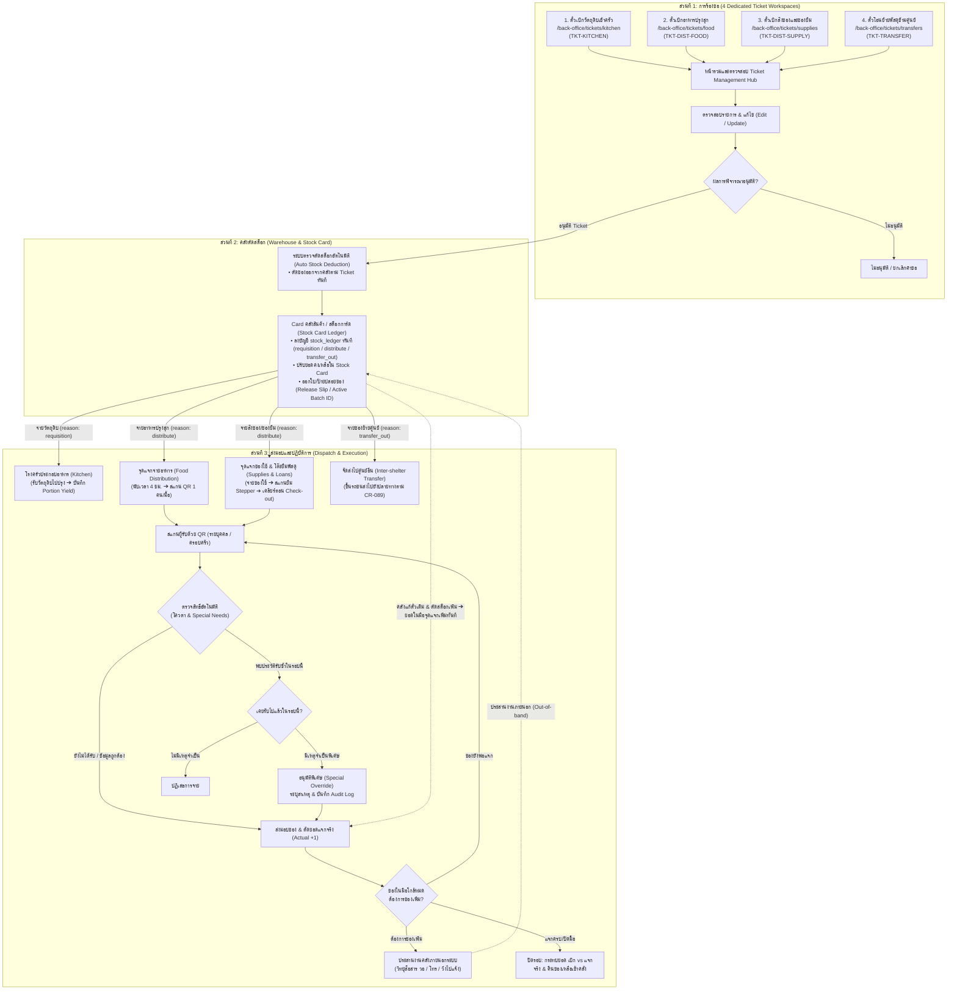
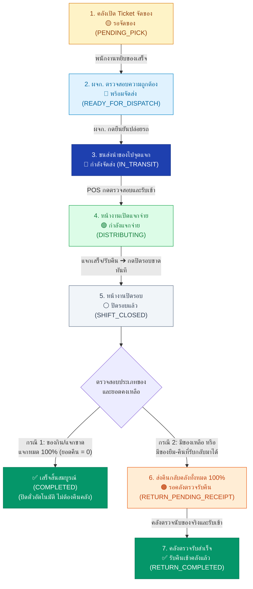
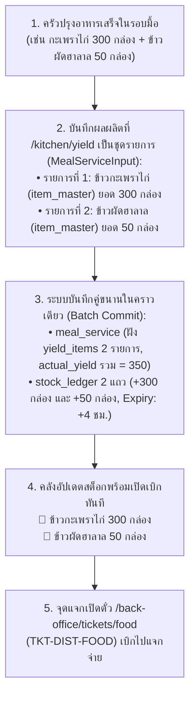
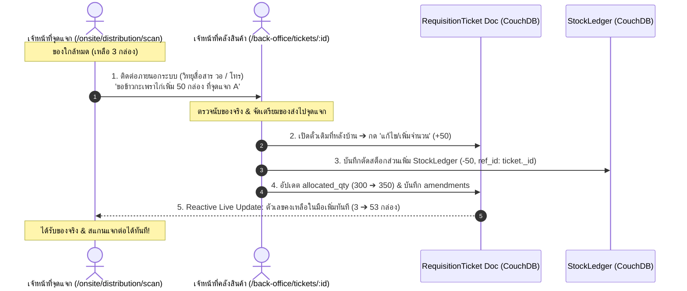
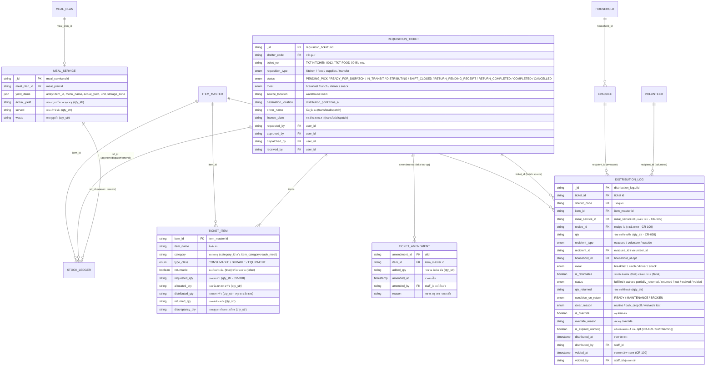

# CR-draft: ระบบตั๋วเบิกจ่ายพัสดุและอาหาร 4-in-1 (RequisitionTicket) พร้อมระบบแจกจ่ายหน้างานและติดตามของยืม (DistributionLog)

> **สรุป (TL;DR):**  
> **เปลี่ยนอะไร:** รวมตั๋วเบิกจ่าย 4 ประเภทเป็น `RequisitionTicket` + รวมบันทึกแจกจ่ายและของยืมหน้างานเป็น `DistributionLog` (ผนวก `meal_distribution` จาก CR-109 และแทนที่โมเดล 3 ชั้นจาก CR-059 Flow 2) + จัดเก็บอาหารปรุงสำเร็จเป็น `ItemMaster` รายชนิดอาหารโดยตรง ภายใต้หมวดหมู่ `item_category:ready_meal` (`type_class: 'CONSUMABLE'`) ตาม draft-seed-item-categories.md และขยาย `MealService` (`yield_items`)  
> **เพื่อใคร/ทำไม:** ฝ่ายคลัง, โรงครัว, จุดแจกจ่ายหน้างาน และด่านลงทะเบียน เพื่อสร้างความโปร่งใส 2 ทิศทาง (Bidirectional Visibility) คุมอายุอาหาร 4 ชม. ด้วย Soft Warning, เติมของระหว่างแจกแบบ Reactive, และติดตามของยืมคงทนไม่ใช้บาร์โค้ดพร้อมเคลียร์ตอน Check-out  
> **dev ต้อง build อะไร:** 4 เวิร์กสเปซหลังบ้าน (`/back-office/tickets/*`), ระบบตรวจรับ-สแกนแจกจ่าย POS (`/onsite/distribution/*`), ระบบยืม-คืนพัสดุ (`/onsite/loans`, `/onsite/returns`), และด่าน Check-out Clearance Gate  
> **กระทบ schema/scope:** เพิ่ม doc types `requisition_ticket`, `distribution_log` ใน DB `shelter_{shelter_code}` §2, จัดเก็บอาหารปรุงสำเร็จใน `item_master` และขยาย `meal_service` (backward-compatible)

---

## 1. Why & Predecessor Alignment (เหตุผลและความสอดคล้องกับ Change Records เดิม)

### 1.1 ความจำเป็นและปัญหาในระบบปัจจุบัน
1. **ปัญหาความกระจัดกระจายของตั๋วเบิกจ่ายคลัง:**
   ในระบบปัจจุบัน การขอเบิกวัตถุดิบครัวใช้ `kitchen_requisition` (`$lib/features/kitchen`) ส่วนการโอนย้ายข้ามศูนย์ใช้ `stock_transfer` (`$lib/features/operations` ตาม CR-059/CR-089) และยังไม่มีเอกสารรองรับการเบิกอาหารปรุงสุกไปจุดแจก หรือการเบิกสิ่งของบรรเทาทุกข์ ทำให้เจ้าหน้าที่คลังสินค้าไม่มีหน้ารวมศูนย์ (Unified Ticket Hub) ในการตรวจสอบ จัดสรร และตัดสต็อก
2. **การระบุชนิดอาหารปรุงสำเร็จที่แท้จริงใน Master Data (Per-Dish Item Master):**
   เพื่อให้การเบิกจ่าย การควบคุมสต็อก และการแจกจ่ายหน้างานแสดงชื่ออาหารที่ชัดเจนตรงตามความเป็นจริง เมื่อโรงครัวประกอบอาหารชนิดใดเสร็จ จะบันทึกเป็น `ItemMaster` ของอาหารชนิดนั้นโดยตรง (เช่น ข้าวกะเพราไก่, ข้าวหมกไก่, ต้มยำกุ้ง) โดยจัดหมวดหมู่อยู่ใน `item_category:ready_meal` และกำหนด `type_class: 'CONSUMABLE'` อัตโนมัติ ทำให้ผู้ปฏิบัติงานทุกฝ่ายระบุและค้นหาเมนูอาหารได้ทันที
3. **ปัญหาการบันทึกผลผลิตโรงครัวแบบหลายเมนู (Batch Yield Limitation):**
   ใน 1 รอบมื้อ โรงครัวปรุงอาหารหลายประเภทพร้อมกัน (ข้าวกล่องทั่วไป, ฮาลาล, เจ, อาหารอ่อน, อาหารเด็ก) แต่โมเดล `meal_service` ในปัจจุบัน (`CR-085`) รองรับการบันทึก `actual_yield` เป็นตัวเลขเดี่ยว ทำให้ไม่สามารถแยกประเภทอาหารเข้าสู่สต็อกคลังและส่งมอบให้จุดแจกตามความต้องการเฉพาะกลุ่มได้
4. **ปัญหาการบันทึกแจกจ่ายหน้างานซ้ำซ้อนและการคุมอายุอาหาร:**
   CR-109 เพิ่งอนุมัติ `meal_distribution` สำหรับอาหาร แต่การแจกสิ่งของบรรเทาทุกข์และของยืมยังไม่มี Schema รองรับ หากแยกหลาย doc type จะสร้างความสับสนและเป็นภาระต่อการ Query ด่าน Check-out จึงต้องรวมศูนย์เป็น `DistributionLog` ตัวเดียว ควบคุมโควตา 1 สิทธิ์/คน/มื้อ และคุมอายุอาหาร 4 ชม. ด้วย Soft Warning
5. **ปัญหาการติดตามของยืมคงทนและภาระตอน Check-out:**
   สิ่งของคงทน (พัดลม, มุ้ง, เต็นท์, วีลแชร์, วอ) เสี่ยงสูญหายหากไม่มีระบบติดตาม แต่การติดบาร์โค้ดรายชิ้นทำได้ยากหน้างานภัยพิบัติ ระบบจึงต้องใช้การนับจำนวนผูกกับตัวบุคคล และมีกลไก 1-Click Resolve ที่ด่าน Check-out เพื่อไม่กักตัวผู้พักพิง

### 1.2 ความสัมพันธ์และการสืบทอดจาก Change Records ก่อนหน้า (Predecessor Alignment & Supersedes Mapping)
เอกสารฉบับนี้ไม่ได้สร้างสถาปัตยกรรมขึ้นมาใหม่โดยพลการ แต่เกิดจากการ **รวบยอดและยกระดับ (Consolidation & Succession)** มติที่เคยได้รับอนุมัติแล้วในประวัติศาสตร์ของโครงการ:

1. **การแทนที่ CR-059 Flow 2 (Supersedes CR-059 Flow 2 — 3-Tier Distribution Model):**
   - **บริบทเดิม:** ใน CR-059 Flow 2 มีการเสนอร่างโมเดลแจกสิ่งของ NFI เป็น 3 ระดับ (`distribution_request` ➔ `distribution_batch` ➔ `distribution_issue`) โดยมีสมมติฐานว่าจะรองรับ Offline Queue บนแท็บเล็ต
   - **จุดเปลี่ยนจาก CR-110:** ต่อมา Project Owner ได้ลงมติชี้ขาดใน **CR-110 (2026-09-06) กำหนดให้สถาปัตยกรรมหน้างานยึดถือ Online-only Remote-First 100% (ไม่มี PouchDB, ไม่มี Local Write Queue)**
   - **การปรับปรุงในสเปกนี้:** เมื่อระบบทำงานแบบ Remote-First โครงสร้าง 3 ชั้นของ CR-059 จึงซับซ้อนเกินความจำเป็นและก่อให้เกิดปัญหาความซ้ำซ้อนของข้อมูล สเปกฉบับนี้จึง **Supersedes (แทนที่)** โครงสร้าง 3 ชั้นดังกล่าว โดยยุบรวมเป็น:
     - `distribution_request` + `distribution_batch` ➔ กลายเป็น `RequisitionTicket` (`requisition_type: 'supplies' | 'food'`)
     - `distribution_issue` ➔ กลายเป็น `DistributionLog` (`is_returnable: false | true`)
2. **การผนวกและสืบทอด CR-109 (Absorbs & Supersedes CR-109 — `meal_distribution`):**
   - **บริบทเดิม:** CR-109 อนุมัติเอกสาร `meal_distribution` สำหรับบันทึกการสแกนอาหารรายบุคคล
   - **การปรับปรุงในสเปกนี้:** เพื่อไม่ให้แยกฐานข้อมูลแจกของกินและของใช้เป็น 2 ระบบ สเปกนี้ได้ **ผนวกโมเดล `meal_distribution` เข้าสู่ `DistributionLog`** โดย **รักษาคุณสมบัติและมติของ Project Owner ไว้ครบถ้วน 100%**:
     - คงฟิลด์สำคัญ: `meal_service_id`, `recipe_id`, `voided_at`, `voided_by`
     - คงมติ Project Owner เรื่อง **Soft Warning 4 ชั่วโมง ไม่ใช้ Hard-block เพดานแจก**
     - คงเงื่อนไขการตรวจจับการรับซ้ำ (คนเดิม + เมนูเดิม ในมื้อเดียวกัน)
3. **การสืบทอด CR-059 Flow 1 & Flow 3 (Extends CR-059):**
   - ตั๋วประเภท `transfer` สืบทอดข้อกำหนดการบังคับกรอก `driver_name` และ `license_plate` จาก Flow 1 ของ CR-059
   - ตั๋วประเภท `kitchen` สืบทอดและปรับกระบวนการ Wizard เบิกวัตถุดิบครัวจาก Flow 3 ของ CR-059 ให้เชื่อมต่อกับ `RequisitionTicket`
4. **การปฏิบัติตาม CR-038 (Decimal Quantity Strings Compliance):**
   - ฟิลด์จำนวนทั้งหมดใน `RequisitionTicket`, `DistributionLog` และ `KitchenYieldItem` ต้องใช้ชนิดข้อมูล `string` (`qty_str`) ผ่าน `$lib/utils/qty.ts` เพื่อป้องกัน Floating Point Error ตาม CR-038 อย่างเคร่งครัด

---

## 2. Change & Overview (เปรียบเทียบก่อนและหลังปรับปรุง)

### ตารางเปรียบเทียบโครงสร้างระบบ (Before ➔ After)

| หมวดหมู่                    | โครงสร้างเดิม (Before)                                                                | โครงสร้างใหม่ (After / Unified Spec)                                                                                                    | เหตุผลทางเทคนิค & ผลลัพธ์                                                   |
| :------------------------ | :---------------------------------------------------------------------------------- | :------------------------------------------------------------------------------------------------------------------------------------ | :---------------------------------------------------------------------- |
| **1. ตั๋วเบิกจ่ายคลัง**        | แยก `kitchen_requisition` และ `stock_transfer` คนละ doc type; ไม่มีตั๋วอาหารและสิ่งของแจก | รวมเป็น `type: 'requisition_ticket'` ตัวเดียว แยกประเภทด้วย `requisition_type`                                                            | Single Repository, คลังมีแดชบอร์ดศูนย์กลางตัวเดียว                             |
| **2. หน้าจอเบิกจ่าย**        | มีเฉพาะหน้าเบิกครัว และหน้าโอนย้ายข้ามศูนย์                                                  | เพิ่ม Ticket Hub (`/back-office/tickets`) + 4 หน้าจอเฉพาะทางตามประเภทตั๋ว                                                                  | หน้าจอไม่ซับซ้อน ฟิลด์ตรงกับหน้าที่ของแต่ละฝ่าย                                     |
| **3. อาหารปรุงสำเร็จ**       | จัดเป็น `CONSUMABLE` ปะปนกับของแห้งโดยไม่มีหมวดหมู่มาตรฐาน                                  | บันทึกเป็น `item_master` รายชนิดอาหารจริง ภายใต้หมวดหมู่ `item_category:ready_meal` (`READY_MEAL`) คลาส `CONSUMABLE` ตาม draft-seed-item-categories.md | คัดกรองไอเทมที่ต้องคุมอายุ 4 ชม. ด้วย `category_id` ของหมวดหมู่ระบบ                    |
| **4. ผลผลิตโรงครัว**        | บันทึกยอดรวม `actual_yield` เดี่ยว                                                      | เพิ่ม embedded array `yield_items` ใน `MealService`                                                                                     | 1 มื้อบันทึกผลผลิตได้หลายเมนูใน 1 Transaction                                  |
| **5. บันทึกแจกจ่ายหน้างาน**   | มีเฉพาะ `meal_distribution` (CR-109) แยกของยืม                                        | รวมเป็น `type: 'distribution_log'` ตัวเดียว (`is_returnable: boolean`)                                                                   | Query ประวัติรายคนและด่าน Check-out จบในคำสั่งเดียว                            |
| **6. วงจรการจัดของ WMS**   | ตัดสต็อกลอยตอนสร้างตั๋ว                                                                  | ควบคุม 7 ขั้นตอน (WMS Outbound ➔ POS Distribution ➔ Shift Close ➔ 100% Return)                                                           | มีจุดตรวจสอบ (Gate Checks) โปร่งใสสองทิศทาง                                 |
| **7. การเติมของระหว่างแจก** | ฝั่งแจกต้องเปิดตั๋วใหม่                                                                    | คลังแก้ตั๋วเดิม (`amendments[]`) + append delta `stock_ledger`                                                                             | จุดแจกไม่ต้องเปิดตั๋วใหม่ สต็อกตัดเพิ่มถูกต้อง                                       |
| **8. การติดตามของยืม**      | ไม่มีระบบติดตามของยืมรายคน                                                              | บันทึกใน `distribution_log` นับจำนวนผูก QR บุคคล (ไม่ใช้บาร์โค้ด)                                                                               | ไม่เสียเวลาติดสติกเกอร์บาร์โค้ดหน้างาน                                          |
| **9. ด่าน Check-out**      | ตรวจสอบของยืมไม่ได้                                                                    | ตรวจจับของค้างส่ง พร้อม 1-Click Resolve 3 ทางเลือก                                                                                         | ปลดภาระรวดเร็ว ไม่กักตัวผู้พักพิง                                               |

---

### 2.1 ผังกระบวนการทำงานหลัก (End-to-End Workflow Overview)

กระบวนการแบ่งเป็น 3 ช่วงตามลำดับจากบนลงล่าง: **1. ยื่นคำขอผ่าน 4 เวิร์กสเปซ ➔ 2. อนุมัติและตัดสต็อกคลัง ➔ 3. ปลายทางรับไปปฏิบัติการ**



---

### 2.2 แผนผังวงจรสถานะ 7 ขั้นตอน (The 7-Step Lifecycle State Machine & Branching Logic)



#### ตารางสรุป 7 ขั้นตอน วงจรสถานะ และการดำเนินการ (7-Step Lifecycle Matrix)

|  ลำดับ  | เหตุการณ์ (Event)                              | ผู้ปฏิบัติงาน (Actor)   | ระบบ/หน้าจอ (System)                   | สถานะตั๋ว (Ticket Status)                           | ป้ายสี (Badge)                    | ปุ่มดำเนินการ (Action Button)         |
| :---: | :------------------------------------------- | :----------------- | :------------------------------------ | :------------------------------------------------ | :------------------------------ | :-------------------------------- |
| **1** | คลังเปิดตั๋ว ระบุรายการและจำนวนของที่จะจัด            | เจ้าหน้าที่คลัง         | WMS: `/back-office/tickets/*`         | **`🟡 รอจัดของ`**<br>`PENDING_PICK`                 | พื้นหลังเหลืองอ่อน<br>ตัวหนังสือน้ำตาล    | `[ บันทึกรายการและเริ่มจัดของ ]`       |
| **2** | พนักงานจัดของครบตามใบจัด นำให้ ผจก. ตรวจสอบ       | ผู้จัดการคลัง          | WMS: `/back-office/tickets/[id]`      | **`🔵 พร้อมจัดส่ง`**<br>`READY_FOR_DISPATCH`          | พื้นหลังฟ้าอ่อน<br>ตัวหนังสือน้ำเงิน       | `[ ✓ ตรวจสอบความถูกต้องและพร้อมส่ง ]` |
| **3** | ผจก. คลัง กดยืนยันปล่อยรถ/ขนส่งออกจากคลัง          | ผู้จัดการคลัง / ทีมขนส่ง | WMS: `/back-office/tickets/[id]`      | **`🚚 กำลังจัดส่ง`**<br>`IN_TRANSIT`                   | พื้นหลังน้ำเงินเข้ม<br>ตัวหนังสือขาว      | `[ 🚚 เริ่มดำเนินการจัดส่ง ]`            |
| **4** | หน้างาน POS เห็นตั๋วขาเข้า ตรวจนับของจริงและรับเข้าจุด | เจ้าหน้าที่/จิตอาสา POS | POS: `/onsite/distribution`           | **`🟢 กำลังแจกจ่าย`**<br>`DISTRIBUTING`               | พื้นหลังเขียวอ่อน<br>ตัวหนังสือเขียวเข้ม  | `[ 📥 ตรวจรับพัสดุเข้าจุดแจก ]`         |
| **5** | หน้างานแจกของจนครบเวลา หรือรับของยืมคืน ➔ ปิดรอบ   | เจ้าหน้าที่/จิตอาสา POS | POS: `/onsite/distribution/scan`      | **`⚪ ปิดรอบแล้ว`**<br>`SHIFT_CLOSED`                | พื้นหลังเทาอ่อน<br>ตัวหนังสือเทาเข้ม    | `[ 🔒 ยืนยันปิดรอบการแจกจ่าย ]`        |
| **6** | หน้างานสรุปของเหลือ/ยืมคืน ➔ กดส่งคืนกลับคลัง 100%    | เจ้าหน้าที่/จิตอาสา POS | POS: `/onsite/distribution/reconcile` | **`🟠 รอคลังตรวจรับคืน`**<br>`RETURN_PENDING_RECEIPT` | พื้นหลังส้มอ่อน<br>ตัวหนังสือส้มเข้ม      | `[ ↺ ส่งคืนพัสดุกลับคลังกลาง ]`         |
| **7** | คลังเห็นตั๋วส่งคืน ตรวจนับของจริงเข้าคลัง ➔ กดยืนยัน     | เจ้าหน้าที่คลัง         | WMS: `/back-office/supply`            | **`✅ รับคืนเข้าคลังแล้ว`**<br>`RETURN_COMPLETED`       | พื้นหลังเขียวมรกต<br>ตัวหนังสือเขียวเข้ม | `[ 📦 ยืนยันตรวจรับของคืนเข้าคลัง ]`     |

---

## 3. รายละเอียดเชิงเทคนิคและสถาปัตยกรรมข้อมูล (Technical Specifications)

### 3.1 การกำหนด Master Data อาหารปรุงสำเร็จตามหมวดหมู่ระบบ (`catalog.ts`)
**คง `TypeClass` เป็น 3 คลาสมาตรฐาน** (`'CONSUMABLE' | 'DURABLE' | 'EQUIPMENT'`) ตามระบบเดิม และจำแนกอาหารปรุงสำเร็จด้วยหมวดหมู่ระบบมาตรฐานตาม [`docs/changes/draft-seed-item-categories.md`](draft-seed-item-categories.md):
- **วัตถุดิบประกอบอาหาร (Food Ingredients):** จัดเก็บในหมวดหมู่ `item_category:food` (`system_key: 'FOOD'`, `default_class: 'CONSUMABLE'`) สำหรับเบิกเข้าครัว (`TKT-KITCHEN`)
- **อาหารปรุงเสร็จและเครื่องดื่ม (Ready-to-Eat Meals):** จัดเก็บในหมวดหมู่ `item_category:ready_meal` (`system_key: 'READY_MEAL'`, `default_class: 'CONSUMABLE'`) สำหรับเบิกไปแจกจ่าย (`TKT-DIST-FOOD`)

**การจัดเก็บอาหารปรุงสำเร็จเป็น `ItemMaster` รายชนิดอาหาร (Per-Dish ItemMaster):**
เมื่อโรงครัวประกอบอาหารชนิดใดเสร็จ จะบันทึกเป็น `ItemMaster` ของอาหารชนิดนั้นโดยตรง เช่น:
- `item_master:{ulid}`: `name: "ข้าวกะเพราไก่"`, `category: 'item_category:ready_meal'`, `type_class: 'CONSUMABLE'`
- `item_master:{ulid}`: `name: "ข้าวผัดไก่ (ฮาลาล)"`, `category: 'item_category:ready_meal'`, `type_class: 'CONSUMABLE'`, `dietary: ['HALAL']`
- `item_master:{ulid}`: `name: "ข้าวต้มหมูสับ (อาหารอ่อน)"`, `category: 'item_category:ready_meal'`, `type_class: 'CONSUMABLE'`, `age_group: 'ELDERLY'`

* **การเลือก/สร้างเมนู:** ในหน้าบันทึกผลผลิตโรงครัว เจ้าหน้าที่สามารถเลือกเมนูอาหารปรุงสำเร็จที่มีอยู่เดิมใน Catalog หรือพิมพ์ชื่อเมนูใหม่เพื่อสร้าง `item_master` ใหม่ได้ทันที (On-the-fly)
* **การคัดกรองควบคุมอายุ 4 ชม. (Soft Warning Filter):** ตรวจสอบจาก `item.category === 'item_category:ready_meal'` เสมอ

### 3.2 การบันทึกผลผลิตโรงครัวแบบชุดรายการ (`kitchen.ts`)
ขยาย `MealService` และ `MealServiceInput` โดยเพิ่มฟิลด์ `yield_items: KitchenYieldItem[]` บันทึกผลผลิตรายเมนู พร้อมคำนวณ `lot.expiry = cooking_completed_at + 4 ชั่วโมง` และบันทึก `stock_ledger` รับเข้าสต็อกคลังใน Transaction เดียว:



### 3.3 การแก้ไขตั๋วเดิมเพื่อเติมของระหว่างแจก (In-flight Amendment)
จุดแจกประสานงานคลังผ่านวิทยุสื่อสาร วอ หรือโทรศัพท์ คลังเปิดหน้าตั๋วเดิมที่ `/back-office/tickets/[id]` กดเพิ่มจำนวน (`added_qty`) ระบบบันทึกตัดสต็อกคลังใน `stock_ledger` แบบ Append-only (`qty: -added_qty`, `ref_id: ticket._id`) ปรับ `allocated_qty` บนตั๋ว และหน้าจอจุดแจกรับรู้ยอดคงเหลือในมือเพิ่มขึ้นทันทีผ่าน CouchDB Live Changes:



### 3.4 โครงสร้างบันทึกการแจกจ่ายและของยืมหน้างาน (`DistributionLog`)
รวมศูนย์การแจกจ่ายอาหาร/ของใช้แจกขาด และการยืมพัสดุคงทนเข้าสู่ doc type `distribution_log` ตัวเดียว (ผนวก `meal_distribution` จาก CR-109):
- **กรณีแจกขาด (อาหาร/ของใช้):** บันทึก `is_returnable: false`, สถานะเริ่มต้นและสิ้นสุดคือ `status: 'fulfilled'`
- **กรณียืมคืน (พัดลม/มุ้ง/วอ):** บันทึก `is_returnable: true`, สถานะเริ่มต้นคือ `status: 'active'` และเปลี่ยนเป็น `returned` / `waived` / `lost` เมื่อปิดภาระ
- **การยกเลิกรายการแจกจ่าย (Void):** เปลี่ยนสถานะเป็น `status: 'voided'` พร้อมบันทึก `voided_at` และ `voided_by` ไม่ลบ Document ทิ้ง

### 3.5 การบริหารพัสดุคงทนยืม-คืน และด่าน Check-out (Two-Tier Loans & Gate Clearance)
- **ไม่ใช้บาร์โค้ด (No Barcode Tracking):** บันทึกจำนวน (`qty`) ผูกกับ QR ตัวบุคคล (`recipient_id`) และอ้างอิง `ticket_id`
- **ช่องทางรับคืน 2 รูปแบบ:** คืนปกติที่เคาน์เตอร์ (`+Stock` ทันที) และคืนแบบกองรวม / กวาดเก็บพื้นที่ (`+Stock` เข้าคลังรวม แต่ log รายคนคง `active` รอเคลียร์ที่ด่าน)
- **ของยืมที่คืนไม่ทันปิดรอบ:** จุดแจกปิดรอบขาด 100% ประชาชนที่นำของมาคืนย้อนหลังให้ส่งคลังกลาง โดยคลังใช้ **"Inbound Deposit Flow"** เพื่อรับของกลับเข้าสต็อก
- **ด่าน Check-out Clearance Gate (`/onsite/scan-check-in-out`):** ตรวจจับของค้างส่ง พร้อมปุ่ม **1-Click Resolve 3 ทางเลือก** (`[ 📦 รับคืนที่ด่าน ]`, `[ 🤝 ยืนยันว่าคืนแล้วในกองรวม ]`, `[ ⚠️ ยกให้ / สูญหาย ]`) เพื่อไม่กักตัวผู้พักพิง

---

### 3.6 ผังความสัมพันธ์โครงสร้างข้อมูล (Entity Relationship Diagram - ERD)



---

### 3.7 โครงสร้างข้อมูล (TypeScript Interfaces)

```typescript
import type { BaseDoc, Timestamp } from '$lib/db/model';

// ================================================================
// หมวดที่ 1: Enums & Common Types
// ================================================================

export type TypeClass = 'CONSUMABLE' | 'DURABLE' | 'EQUIPMENT';
export type RequisitionType = 'kitchen' | 'food' | 'supplies' | 'transfer';

export type TicketStatus =
  | 'PENDING_PICK'            // 🟡 1. รอจัดของ
  | 'READY_FOR_DISPATCH'      // 🔵 2. พร้อมจัดส่ง (ผจก. ตรวจแล้ว)
  | 'IN_TRANSIT'             // 🚚 3. กำลังจัดส่ง
  | 'DISTRIBUTING'           // 🟢 4. กำลังแจกจ่าย (ส่งมอบถึงปลายทางแล้ว)
  | 'SHIFT_CLOSED'           // ⚪ 5. ปิดรอบแล้ว (ปิดขาดทันที)
  | 'RETURN_PENDING_RECEIPT' // 🟠 6. รอคลังตรวจรับคืน (ส่งคืน 100%)
  | 'RETURN_COMPLETED'       // ✅ 7. รับคืนเข้าคลังแล้ว (จบวงจร)
  | 'COMPLETED'              // ✅ เสร็จสิ้นสมบูรณ์ (แจกหมด 100% ไม่มีของคืน)
  | 'CANCELLED';             // ❌ ยกเลิกคำขอ

export type MealPeriod = 'breakfast' | 'lunch' | 'dinner' | 'snack';
export type RecipientType = 'evacuee' | 'volunteer' | 'outside';
export type DistributionStatus = 'fulfilled' | 'active' | 'partially_returned' | 'returned' | 'lost' | 'waived' | 'voided';
export type ItemCondition = 'READY' | 'MAINTENANCE' | 'BROKEN';
export type LoanClearReason = 'routine' | 'bulk_dropoff' | 'waived' | 'lost';

// ================================================================
// หมวดที่ 2: Requisition Ticket Schemas (Compliant with CR-038 qty_str)
// ================================================================

export interface TicketItem {
  item_id: string; // FK item_master
  item_name: string;
  category?: string; // category_id เช่น 'item_category:ready_meal' หรือ 'item_category:food'
  type_class: TypeClass;
  returnable?: boolean; // true = ของยืมต้องส่งคืน, false/undefined = ของแจกขาด
  requested_qty: string; // qty_str (CR-038)
  allocated_qty: string; // qty_str (รวมยอดเติมเพิ่ม)
  distributed_qty?: string; // qty_str — คำนวณ Dynamic ใน Memory ระหว่างกะ และบันทึกสรุปลงตั๋วตอนปิดรอบ (reconcile) เท่านั้น (ห้ามเขียนทับตั๋วระหว่างสแกนแจก เพื่อป้องกัน CouchDB 409 Conflict)
  returned_qty?: string; // qty_str — บันทึกตอนปิดรอบ
  discrepancy_qty?: string; // qty_str — บันทึกตอนคลังกระทบยอดส่วนต่าง
}

export interface TicketAmendment {
  amendment_id: string; // ulid
  item_id: string; // FK item_master
  added_qty: string; // qty_str ยอดเติมเพิ่ม (+Added)
  amended_at: Timestamp;
  amended_by: string; // staff user_id
  reason?: string; // หมายเหตุ เช่น "วอขอเพิ่ม 50 กล่อง"
}

export interface RequisitionTicket extends BaseDoc {
  _id: string; // pattern: 'requisition_ticket:{ulid}' (ULID 26 ตัวพิมพ์ใหญ่ตาม docs/data/schema.md)
  type: 'requisition_ticket';
  schema_v: 1;
  ticket_no: string; // e.g. TKT-KITCHEN-0012 / TKT-FOOD-0045 (Human-readable Running Code สำหรับอ้างอิงหน้างาน)
  requisition_type: RequisitionType;
  status: TicketStatus;
  meal?: MealPeriod;
  source_location: string; // warehouse:main
  destination_location: string; // kitchen / distribution_point:zone_a / shelter:sh002
  driver_name?: string; // ชื่อผู้ขับขี่ (CR-089)
  license_plate?: string; // ทะเบียนรถขนส่ง (CR-089)
  requested_by: string; // user_id ผู้เปิดตั๋ว
  approved_by?: string; // user_id ผจก. ผู้ตรวจสอบ
  dispatched_by?: string; // user_id ผู้ปล่อยของ
  received_by?: string; // user_id ปลายทางผู้รับของ
  items: TicketItem[];
  amendments?: TicketAmendment[];
  notes?: string;
}

// ================================================================
// หมวดที่ 3: Distribution Log Schema (Unified with CR-109, CR-110, CR-038)
// ================================================================

export interface DistributionLog extends BaseDoc {
  _id: string; // pattern: 'distribution_log:{ulid}' (ULID 26 ตัวพิมพ์ใหญ่ตาม docs/data/schema.md)
  type: 'distribution_log';
  schema_v: 1;
  ticket_id: string; // FK requisition_ticket (Active Batch origin)
  item_id: string; // FK item_master
  meal_service_id?: string; // FK meal_service (กรณีอาหารปรุงสุก - จาก CR-109)
  recipe_id?: string; // FK recipe (กรณีอาหารปรุงสุก - จาก CR-109)
  qty: string; // qty_str จำนวนที่แจก/ยืม (CR-038)
  recipient_type: RecipientType;
  recipient_id?: string | null; // evacuee_id / volunteer_id
  household_id?: string;
  meal?: MealPeriod;
  
  // การควบคุมของยืม
  is_returnable: boolean; // true = ของยืมต้องส่งคืน, false = ของแจกขาด
  status: DistributionStatus;
  qty_returned?: string; // qty_str
  condition_on_return?: ItemCondition;
  clear_reason?: LoanClearReason;
  returned_at?: Timestamp;
  returned_by?: string;

  // การตรวจสิทธิ์ & Void (CR-109)
  is_override: boolean;
  override_reason?: string;
  is_expired_warning?: boolean; // บันทึก true หากแจกจ่ายอาหารที่เกิน 4 ชม. (Soft Warning Audit Log ตาม AC-DST-03.2)
  distributed_at: Timestamp;
  distributed_by: string;
  voided_at?: Timestamp | null;
  voided_by?: string | null;
  notes?: string;
}

// ================================================================
// หมวดที่ 4: Kitchen Yield Integration
// ================================================================

export interface KitchenYieldItem {
  item_id: string; // ItemMaster ID ของอาหารปรุงเสร็จ
  menu_name: string; // ชื่อเมนูอาหาร (ตรงกับ ItemMaster.name)
  category: 'item_category:ready_meal' | string; // หมวดหมู่อาหารปรุงเสร็จตาม draft-seed-item-categories.md
  type_class: 'CONSUMABLE';
  actual_yield: string; // qty_str (CR-038)
  unit: string;
  storage_zone?: string;
}

export interface MealService extends BaseDoc {
  type: 'meal_service';
  date: string;
  meal: MealPeriod;
  meal_plan_id: string | null;
  yield_items?: KitchenYieldItem[];
  // หมายเหตุ Backward Compatibility: ฟิลด์ actual_yield, served, waste จัดเก็บเป็น qty_str (CR-038)
  // เอกสารเดิมที่เคยบันทึกเป็น number (int ≥ 0) ให้ Zod Schema ใช้ z.union([z.string(), z.number().transform(String)])
  // เพื่อให้อ่านเอกสารเดิมได้โดยอัตโนมัติ โดยไม่ต้อง bump schema_v ของฐานข้อมูลศูนย์
  actual_yield?: string; // qty_str
  served: string; // qty_str
  waste: string; // qty_str
  external: {
    volunteers: number;
    outside_evacuees: number;
  };
  notes?: string;
}
```

---

## 4. ข้อกำหนดการทำงาน (Requirements & Acceptance Criteria)

### หมวดที่ 1: ระบบตั๋วเบิกจ่ายคลังและผลผลิตโรงครัว (Requisitions & Kitchen Yield Module — Track A & B)

#### FR-TKT-01: โครงสร้างเอกสารตั๋วเบิกจ่ายกลาง (Unified Requisition Ticket Document)
- **คำสั่ง:** ระบบต้องบันทึกคำขอเบิกจ่ายพัสดุและอาหารทุกประเภทลงใน doc type `requisition_ticket` โดยมี `_id` ในรูปแบบ `requisition_ticket:{ulid}` และระบุ `requisition_type` (`kitchen`, `food`, `supplies`, `transfer`)
- **AC-TKT-01.1:** การสร้างตั๋วเบิกทุกประเภทต้องผ่านการตรวจสอบด้วย Zod Schema (`requisitionTicketSchema`) สำเร็จ
- **AC-TKT-01.2:** ตั๋วต้องมีสถานะเริ่มต้นเป็น `PENDING_PICK` และบันทึก `ticket_no` ในรูปแบบ `TKT-{TYPE}-{RUNNING}`
- **AC-TKT-01.3:** รายการพัสดุในตั๋ว (`items`) ต้องมี `item_id`, `item_name`, `type_class`, และ `requested_qty` ในรูปแบบ Decimal String (`qty_str` ตาม CR-038) ที่มีค่ามากกว่า 0

#### FR-TKT-02: ศูนย์กลางบริหารตั๋วและ 4 เวิร์กสเปซเฉพาะทาง (Ticket Hub & Workspaces)
- **คำสั่ง:** ระบบต้องจัดเตรียมหน้า Landing Hub (`/back-office/tickets`) สรุปภาพรวมคำขอเบิกทั้ง 4 ประเภท พร้อม Badge แสดงจำนวนคำขอค้าง และแยกหน้าจอทำงานเฉพาะทาง 4 เส้นทาง:
  - `/back-office/tickets/kitchen`
  - `/back-office/tickets/food`
  - `/back-office/tickets/supplies`
  - `/back-office/tickets/transfers`
- **AC-TKT-02.1:** หน้า `/back-office/tickets` ต้องแสดงจำนวนคำขอในสถานะ `PENDING_PICK` และ `READY_FOR_DISPATCH` แยกตามประเภทตั๋ว
- **AC-TKT-02.2:** หน้า `/back-office/tickets/food` ต้องบังคับให้ผู้ใช้เลือกรอบมื้อ (`MealPeriod`) ก่อนสร้างตั๋ว
- **AC-TKT-02.3:** หน้า `/back-office/tickets/transfers` ต้องแสดงช่องกรอกชื่อผู้ขับขี่และหมายเลขทะเบียนรถตามข้อกำหนด CR-089

#### FR-TKT-03: วงจรการจัดของและการตรวจสอบโดยผู้จัดการ (Picking & Staged Approval)
- **คำสั่ง:** ระบบต้องรองรับวงจรสถานะการจัดของ:
  - ขั้นที่ 1: พนักงานคลังกดเริ่มจัดของและระบุจำนวนที่จัดได้จริง (`allocated_qty` เป็น `qty_str`) ตั๋วมีสถานะ `PENDING_PICK`
  - ขั้นที่ 2: เมื่อจัดของครบ พนักงานส่งให้ผู้จัดการคลังตรวจสอบ ผู้จัดการคลังกดปุ่ม `[ ✓ ตรวจสอบความถูกต้องและพร้อมส่ง ]` ระบบปรับสถานะตั๋วเป็น `READY_FOR_DISPATCH` พร้อมบันทึก `approved_by`
- **AC-TKT-03.1:** เฉพาะผู้ใช้ที่มีสิทธิ์ระดับ `shelter_manager` หรือ `system_admin` เท่านั้นที่สามารถกดปุ่มตรวจสอบความถูกต้อง (`READY_FOR_DISPATCH`) ได้
- **AC-TKT-03.2:** ระบบต้องไม่อนุญาตให้เปลี่ยนสถานะเป็น `READY_FOR_DISPATCH` หากมีรายการพัสดุที่ `allocated_qty` ว่างหรือน้อยกว่าเท่ากับ 0

#### FR-TKT-04: การปล่อยรถและตัดสต็อกคลัง (Dispatch & Stock Deduction)
- **คำสั่ง:** เมื่อผู้จัดการคลังหรือฝ่ายขนส่งกดยืนยันปล่อยของ `[ 🚚 เริ่มดำเนินการจัดส่ง ]` ระบบต้อง:
  1. บันทึกตัดสต็อกจริงออกจากคลังสินค้าใน `stock_ledger` ทันทีด้วย `qty: `-${allocated_qty}`` (Signed Decimal String ตาม CR-038) และผูก `ref_id: ticket._id`
  2. กำหนด `reason` ใน `stock_ledger`:
     - เบิกครัว ➔ `reason: 'requisition'`
     - เบิกแจกอาหารหรือสิ่งของ ➔ `reason: 'distribute'`
     - โอนย้ายข้ามศูนย์ ➔ `reason: 'transfer_out'`
  3. ปรับสถานะตั๋วเป็น `IN_TRANSIT` พร้อมบันทึก `dispatched_by`
- **AC-TKT-04.1:** การตัดสต็อกใน `stock_ledger` ต้องบันทึกแยกแถวตาม `item_id` และระบุจำนวนเป็นลบตรงกับ `allocated_qty`
- **AC-TKT-04.2:** สำหรับตั๋วประเภท `transfer` ระบบต้องบล็อกการกดปล่อยของหากยังไม่ได้ระบุ `driver_name` หรือ `license_plate`

#### FR-TKT-05: การบันทึกอาหารปรุงสำเร็จเป็น ItemMaster รายชนิดอาหาร (Per-Dish ItemMaster) ในหมวดหมู่ READY_MEAL
- **คำสั่ง:** เมื่อโรงครัวประกอบอาหารชนิดใดเสร็จ จะถูกบันทึกเป็น `item_master` ของอาหารชนิดนั้นโดยตรง โดยกำหนดให้เป็น `type_class: 'CONSUMABLE'` และจัดหมวดหมู่อยู่ภายใต้ `category: 'item_category:ready_meal'` (`system_key: 'READY_MEAL'`) ตามข้อกำหนดใน [`docs/changes/draft-seed-item-categories.md`](draft-seed-item-categories.md)
- **AC-TKT-05.1:** เอกสาร `item_master` ของอาหารปรุงเสร็จแต่ละชนิดต้องจัดเก็บในฐานข้อมูล `catalog` โดยระบุ `name` เป็นชื่อเมนูอาหารจริง, `category: 'item_category:ready_meal'` และ `type_class: 'CONSUMABLE'` พร้อมระบุแท็กพิเศษ (เช่น dietary: `['HALAL']`, `['VEGAN']` หรือ age_group: `'ELDERLY'`) ได้
- **AC-TKT-05.2:** ในหน้าบันทึกผลผลิตโรงครัว เจ้าหน้าที่สามารถเลือกเมนูอาหารเดิมที่มีอยู่แล้วใน Catalog หรือสร้าง `item_master` ใหม่สำหรับเมนูนั้นได้ทันที (On-the-fly ItemMaster Creation)
- **AC-TKT-05.3:** การระบุและคัดกรองพัสดุที่ต้องควบคุมอายุ 4 ชั่วโมง (Food Safety Countdown) ให้ใช้เงื่อนไข `category === 'item_category:ready_meal'`

#### FR-TKT-06: การบันทึกผลผลิตโรงครัวแบบชุดรายการ (Batch Yield Integration)
- **คำสั่ง:** หน้าบันทึกผลผลิตโรงครัว (`/back-office/kitchen/production-board`) ต้องรองรับการส่งผลผลิตเป็น Array `yield_items` ผ่าน `MealServiceInput` โดยระบบต้องบันทึกเข้า `meal_service` และสร้าง `stock_ledger` รับเข้าสต็อกคลังใน Transaction เดียวกัน
- **AC-TKT-06.1:** เอกสาร `meal_service` ต้องเก็บข้อมูล `yield_items: KitchenYieldItem[]` และคำนวณ `actual_yield = sum(yield_items.actual_yield)` ผ่าน `$lib/utils/qty.ts`
- **AC-TKT-06.2:** ระบบต้องสร้าง `stock_ledger` รับเข้า (`qty: actual_yield`, `reason: 'receive'`, `ref_id: meal_service._id`) แยกตามแต่ละเมนูใน `yield_items`
- **AC-TKT-06.3:** ข้อมูลล็อตใน `stock_ledger.lot` ต้องมี `note: menu_name`, `lot_no`, และคำนวณ `expiry = cooking_completed_at + 4 ชั่วโมง`

---

### หมวดที่ 2: ระบบแจกจ่ายหน้างานและการปิดรอบ (Frontline Distribution & Closing Module — Track C)

#### FR-DST-01: การตรวจรับพัสดุเข้าจุดแจกหน้างาน (Frontline POS Inbound Receive)
- **คำสั่ง:** เจ้าหน้าที่ประจำจุดแจกจ่ายเปิดหน้าจอ `/onsite/distribution` เลือกดูตั๋วที่มีสถานะ `IN_TRANSIT` ตรวจนับจำนวนของจริง และกดปุ่ม `[ 📥 ตรวจรับพัสดุเข้าจุดแจก ]` ระบบปรับสถานะตั๋วเป็น `DISTRIBUTING` พร้อมบันทึก `received_by`
- **AC-DST-01.1:** ระบบต้องแสดงยอดของคงเหลือประจำจุดแจก (Remaining In-Hand) เท่ากับ `allocated_qty` ทันทีที่กดรับเข้า
- **AC-DST-01.2:** เฉพาะตั๋วในสถานะ `DISTRIBUTING` เท่านั้นที่สามารถนำไปเปิดรอบการแจกจ่ายที่หน้าจอ `/onsite/distribution/scan` ได้

#### FR-DST-02: การสแกนแจกจ่ายและการตรวจสิทธิ์รายบุคคล (Live QR Scan & Quota)
- **คำสั่ง:** หน้าจอแจกจ่ายจริง (`/onsite/distribution/scan`) ต้องรองรับการสแกน QR ผู้พักพิงหรือหัวหน้าครอบครัว ตรวจสอบโควตา 1 คน ต่อ 1 มื้อ และบันทึก `distribution_log`:
  - Default จำนวนจ่าย = `"1"` (qty_str)
  - มีปุ่ม Stepper `[-] 1 [+]` ให้เจ้าหน้าที่ปรับจำนวนตามสมาชิกครอบครัว
  - หากพบประวัติการรับไปแล้วในมื้อเดียวกัน ให้แสดงกล่องเตือนสีแดง และมีปุ่ม `[ กรณีพิเศษ Override ]` พร้อมบันทึกสาเหตุ
- **AC-DST-02.1:** ทุกการกดยืนยันจ่ายของสำเร็จ ระบบต้องสร้างเอกสาร `distribution_log` (`type: 'distribution_log'`, `_id: distribution_log:{ulid}`, `is_returnable: false`, `status: 'fulfilled'`) ทันที
- **AC-DST-02.2:** ตัวเลขคงเหลือในมือ (In-Hand) บนหน้าจอแจกจ่ายต้องคำนวณแบบ In-Memory Dynamic Store (`allocated_qty - sum(distribution_log.qty)`) โดยการสแกนหน้างานจะ **ไม่เขียนทับเอกสาร `requisition_ticket`** ในระหว่างกะ เพื่อป้องกันปัญหา CouchDB Concurrency Conflict (409) อย่างสมบูรณ์ ยอดสะสม `distributed_qty` จะถูกบันทึกสรุปลงในตั๋วเพียงครั้งเดียวเมื่อกดปิดรอบ (`SHIFT_CLOSED` / `/onsite/distribution/reconcile`)

#### FR-DST-03: การควบคุมความปลอดภัยอาหาร 4 ชม. ด้วย Soft Warning (Food Safety Countdown)
- **คำสั่ง:** หน้าจอสแกนแจกจ่ายอาหารต้องแสดงตัวนับเวลาถอยหลัง 4 ชั่วโมงนับจากเวลาปรุงเสร็จ หากอาหารเกิน 4 ชั่วโมง ระบบต้องแสดงแถบเตือนสีแดงเด่นชัด **"🚨 อาหารเกิน 4 ชม. (EXPIRED)"** แต่ **อนุโลมให้เจ้าหน้าที่กดยืนยันแจกต่อได้** (ตามมติ PO ใน CR-109) โดยบันทึก Flag ใน Audit Log
- **AC-DST-03.1:** การเกินเวลา 4 ชั่วโมงต้องไม่บล็อกปุ่มยืนยันจ่าย แต่ต้องแสดงข้อความเตือนให้เจ้าหน้าที่ประเมินความปลอดภัยหน้างาน
- **AC-DST-03.2:** ระบบต้องบันทึก `is_expired_warning: true` ใน `distribution_log` เพื่อการตรวจสอบย้อนหลัง

#### FR-DST-04: การแก้ไขตั๋วเดิมเพื่อเติมของระหว่างแจกแบบ Reactive (In-flight Amendment)
- **คำสั่ง:** เมื่อของหน้างานใกล้หมด เจ้าหน้าที่จุดแจกติดต่อคลังผ่านวิทยุสื่อสาร วอ หรือโทรศัพท์ คลังเปิดหน้า `/back-office/tickets/[id]` กดเพิ่มจำนวน (`added_qty` เป็น `qty_str`) ระบบบันทึก `stock_ledger` ตัดสต็อกคลังเพิ่ม (`qty: `-${added_qty}``, `reason: 'distribute'`) ปรับ `allocated_qty` บนตั๋ว และหน้าจอจุดแจกจ่ายอัปเดตตัวเลขในมือเพิ่มขึ้นทันทีผ่าน CouchDB Live Changes
- **AC-DST-04.1:** การสแกนจ่ายหน้างานที่บันทึกลง `distribution_log` ต้องไม่เกิดการชนกันของเอกสาร (`409 Conflict`) กับการแก้ไขตั๋ว `requisition_ticket` ของฝั่งคลัง
- **AC-DST-04.2:** ยอดคงเหลือในมือหน้าจอแจกจ่ายต้องเพิ่มขึ้นทันทีโดยไม่ต้องกด Refresh หน้าจอ

#### FR-DST-05: การปิดรอบขาดและการส่งคืนของเหลือ 100% (Strict Shift Close & 100% Return)
- **คำสั่ง:** เมื่อสิ้นสุดเวลาแจกจ่าย เจ้าหน้าที่กดปุ่ม `[ 🔒 ยืนยันปิดรอบการแจกจ่าย ]` (`SHIFT_CLOSED`) ตั๋วใบนี้ถือว่าปิดขาดทันที ไม่สามารถสแกนแจกจ่ายในตั๋วนี้ได้อีก:
  - หากแจกหมด 100% (ยอดเหลือ = 0): ปรับสถานะเป็น `COMPLETED` จบวงจรทันที
  - หากมีของเหลือ หรือมีของยืมที่เก็บกลับมาได้: หน้างานตรวจนับและกดปุ่ม `[ ↺ ส่งคืนพัสดุกลับคลังกลาง ]` ปรับสถานะเป็น `RETURN_PENDING_RECEIPT` เพื่อเคลียร์สต็อกจุดแจกเป็น 0 (Strict 100% Return - No Rollover)
- **AC-DST-05.1:** ห้ามมีการ Rollover ยกยอดของเหลือไปใช้ในกะถัดไป ของเหลือทั้งหมดต้องทำรายการส่งคืนคลัง 100%
- **AC-DST-05.2:** ตั๋วในสถานะ `RETURN_PENDING_RECEIPT` ต้องปรากฏในหน้าตรวจรับของคืนของคลังสินค้าทันที

#### FR-DST-06: การตรวจรับคืนเข้าสต็อกคลังและกระทบยอดส่วนต่าง (WMS Discrepancy Reconciliation)
- **คำสั่ง:** เจ้าหน้าที่คลังเปิดดูตั๋วสถานะ `RETURN_PENDING_RECEIPT` ที่ `/back-office/supply` ตรวจนับของจริงเทียบกับยอดที่หน้างานส่งมา หากพบยอดคลาดเคลื่อน/ของหาย ให้แก้ไขตัวเลขรับเข้าจริง และกดปุ่ม `[ 📦 ยืนยันตรวจรับของคืนเข้าคลัง ]`
- **AC-DST-06.1:** ระบบต้องบันทึก `stock_ledger` รับของสภาพดีกลับเข้าคลัง (`qty: returned_qty`, `reason: 'receive'`, `ref_id: ticket._id`, `notes: 'distribution_return'`) ตาม enum `ledgerReasonSchema`
- **AC-DST-06.2:** ส่วนต่างที่หายไปต้องบันทึกลงใน `TicketItem.discrepancy_qty` และแจ้งเตือนไปยังผู้จัดการคลัง
- **AC-DST-06.3:** ปรับสถานะตั๋วเป็น `RETURN_COMPLETED` จบวงจรการเบิกจ่ายสมบูรณ์ 100%

#### FR-DST-07: การยกเลิกรายการแจกจ่ายผิดพลาด (Void Distribution Log)
- **คำสั่ง:** หน้าจอแจกจ่ายต้องมีปุ่มยกเลิกรายการแจกจ่ายล่าสุด (Undo/Void) สำหรับกรณีสแกนผิดพลาด โดยระบบปรับสถานะเป็น `status: 'voided'` พร้อมบันทึก `voided_at` และ `voided_by` ตามข้อกำหนด CR-109 ห้ามลบ Document ออกจากฐานข้อมูล
- **AC-DST-07.1:** เอกสารที่ถูก Void ต้องไม่ถูกนำมาคำนวณในยอดสะสม `distributed_qty`
- **AC-DST-07.2:** ยอดคงเหลือในมือ (Remaining In-Hand) ของจุดแจกต้องคืนกลับมา +1 ทันทีที่กด Void สำเร็จ

---

### หมวดที่ 3: ระบบยืม-คืนพัสดุและด่าน Check-out (Returnable Loans & Check-out Clearance Gate Module — Track D)

#### FR-LON-01: การสแกนยืมพัสดุคงทนรายบุคคลโดยไม่ใช้บาร์โค้ด (Frontline Item Loan)
- **คำสั่ง:** เจ้าหน้าที่ประจำจุดบริการสิ่งของและของยืมเปิดหน้าจอ `/onsite/loans` สแกน QR ผู้พักพิงหรืออาสาสมัคร เลือกรหัสตั๋วที่คลังปล่อยของมา (`Active Loan Batch`) ปรับจำนวนด้วยปุ่ม Stepper `[-] 1 [+]` และกดยืนยันจ่ายยืม
- **AC-LON-01.1:** ระบบต้องสร้างเอกสาร `distribution_log` (`_id: distribution_log:{ulid}`, `is_returnable: true`, `status: 'active'`, `qty: qty_str`) และผูกกับ `recipient_id`
- **AC-LON-01.2:** ไม่มีการบังคับกรอกหมายเลขบาร์โค้ดหรือ Serial Number รายชิ้น ใช้การนับจำนวนผูกกับตัวบุคคลเท่านั้น
- **AC-LON-01.3:** ระบบต้องตัดยอดคงเหลือประจำโต๊ะของตั๋วใบนั้นทันที

#### FR-LON-02: ช่องทางการรับคืนพัสดุ 2 รูปแบบ (Dual Return Channels)
- **คำสั่ง:** หน้าจอรับคืนพัสดุ (`/onsite/returns`) ต้องรองรับการรับคืน 2 ช่องทาง:
  1. คืนปกติที่เคาน์เตอร์: สแกน QR ผู้ยืม ดึงรายการที่ค้างส่ง (`status: 'active'`) ตรวจสภาพ (`READY` / `MAINTENANCE` / `BROKEN`) ปรับสถานะ log เป็น `returned` และบันทึก `stock_ledger` รับเข้าสต็อกทันที (`qty: returned_qty`, `reason: 'receive'`, `ref_id: log._id`)
  2. คืนแบบกองรวม / กวาดเก็บหน้างาน (Bulk Drop-off): คลังตรวจนับยอดรวมของที่เก็บได้เข้าสต็อกคลังทันที (`reason: 'receive'`) โดยระเบียน `distribution_log` รายคนยังคงสถานะ `active` ไว้เพื่อไปคลี่คลายที่ด่าน Check-out
- **AC-LON-02.1:** การคืนปกติที่เคาน์เตอร์ต้องปิดภาระของผู้ยืมทันที (`status: 'returned'`)
- **AC-LON-02.2:** การตรวจรับคืนกองรวมต้องลงบัญชีสต็อกคลังได้ทันทีโดยไม่บังคับให้ระบุชื่อผู้คืน

#### FR-LON-03: การคืนของย้อนหลังหลังปิดรอบ (Warehouse Inbound Deposit Flow)
- **คำสั่ง:** หากมีผู้พักพิงนำสิ่งของยืมมาคืนหลังจากที่จุดแจกกดปิดรอบขาดไปแล้ว (`SHIFT_CLOSED`) เจ้าหน้าที่คลังสินค้าสามารถเปิดหน้า `/back-office/supply` เพื่อใช้ **"Flow ฝากของ/รับเข้าใหม่ (Inbound Deposit Flow)"** รับของเข้าสต็อกคลัง และค้นหาชื่อผู้พักพิงเพื่อปิดสถานะ `distribution_log` เป็น `returned` ได้
- **AC-LON-03.1:** ระบบต้องไม่อนุญาตให้เปิดตั๋วเดิมที่ปิดรอบแล้วกลับมารับของคืน
- **AC-LON-03.2:** การรับของเข้าผ่าน Inbound Deposit Flow ต้องลงบัญชี `stock_ledger` ด้วย `reason: 'receive'` หรือ `'adjust'` พร้อมผูกกับรหัสผู้คืน

#### FR-LON-04: ด่านตรวจและปลดภาระตอน Check-out (Check-out Gate Clearance)
- **คำสั่ง:** เมื่อผู้พักพิงหรืออาสาสมัครมาทำการ Check-out ออกจากศูนย์ที่ `/onsite/scan-check-in-out` หากระบบตรวจพบ `distribution_log` ของยืมที่ยังมีสถานะ `active` หรือ `partially_returned` ระบบต้องแสดงกล่องแจ้งเตือน Hard Warning สีส้มเด่นชัด พร้อมปุ่ม **1-Click Resolve 3 ทางเลือก** ที่เจ้าหน้าที่ประจำด่านสามารถกดผ่านได้ทันที:
  - **`[ 📦 รับคืนที่ด่าน ]`:** บันทึกรับของเข้าสต็อกด่าน (`qty: returned_qty`, `reason: 'receive'`) และปรับสถานะ log เป็น `returned`
  - **`[ 🤝 ยืนยันว่าคืนแล้วในกองรวม ]`:** ปรับสถานะ log เป็น `returned` (`clear_reason: 'bulk_dropoff'`) โดยไม่เพิ่มสต็อกคลังซ้ำ
  - **`[ ⚠️ ยกให้ / สูญหาย (Waived/Lost) ]`:** ปรับสถานะเป็น `waived` หรือ `lost` บันทึกหมายเหตุ และอนุญาตให้ Check-out ได้ทันทีโดยไม่กักตัวผู้พักพิง
- **AC-LON-04.1:** การกดปุ่ม 1-Click Resolve ตัวใดตัวหนึ่งต้องปิดภาระของยืม (`status != 'active'`) และปลดล็อกให้ขั้นตอน Check-out ดำเนินการต่อไปได้ทันที
- **AC-LON-04.2:** กรณีเลือก "คืนแล้วในกองรวม" ระบบต้องไม่สร้างแถวใหม่ใน `stock_ledger` เพื่อป้องกันการบันทึกสต็อกซ้ำซ้อน

---

### หมวดที่ 4: ความปลอดภัยและการกำกับดูแล (Governance & Security)

#### FR-SEC-01: การควบคุมสิทธิ์ตามบทบาท (Role-Based Access Control)
- **คำสั่ง:** การเข้าถึงและปฏิบัติการในแต่ละขั้นตอนต้องถูกควบคุมด้วย RBAC:
  - Step 1 (เปิดตั๋วจัดของ): `warehouse_staff`, `system_admin`, `shelter_manager`, `kitchen_staff`, `service_staff`
  - Step 2 (ผจก. ตรวจสอบ): เฉพาะ `shelter_manager`, `system_admin`
  - Step 3 (ปล่อยรถขนส่ง): เฉพาะ `warehouse_staff`, `shelter_manager`, `system_admin`
  - Step 4–6 (จุดแจกรับเข้า, แจกจ่าย, ปิดรอบ, ส่งคืน): `registration_staff`, `service_staff`, `volunteer`, `shelter_manager`
  - Step 7 (คลังตรวจรับคืน): เฉพาะ `warehouse_staff`, `shelter_manager`, `system_admin`
  - ด่าน Check-out Resolve: `registration_staff`, `shelter_manager`, `system_admin`
- **AC-SEC-01.1:** UI ต้องซ่อนปุ่มดำเนินการสำหรับผู้ใช้ที่ไม่มีสิทธิ์ตามบทบาทที่กำหนด
- **AC-SEC-01.2:** Endpoint Server ต้องตรวจสอบสิทธิ์และปฏิเสธคำขอด้วย HTTP 403 หากส่งคำขอข้ามบทบาท

#### FR-SEC-02: ความเข้ากันได้ย้อนหลังและการไม่กระทบข้อมูลเดิม (Backward Compatibility)
- **คำสั่ง:** การสร้าง doc types ใหม่ `requisition_ticket` และ `distribution_log` ต้องไม่ทำลายความถูกต้องของเอกสาร `kitchen_requisition`, `stock_transfer`, และ `meal_distribution` เดิมที่เคยบันทึกไว้ใน CouchDB
- **AC-SEC-02.1:** การอ่านประวัติและรายงานย้อนหลังต้องยังคงแสดงข้อมูลจากเอกสารรุ่นเดิมได้สมบูรณ์
- **AC-SEC-02.2:** โค้ด Zod Validation ของเอกสารรุ่นเดิมต้องไม่ถูกยกเลิกจนกว่าจะผ่านช่วงการ Migration อย่างเป็นทางการ

---

## 5. แผนผังสารบบหน้าจอ 18 หน้า (Sitemap & Page Directory)

| โมดูลหลัก         | โมดูลย่อย           |  ลำดับ  | หน้าจอ (Page Name)            | URL Route                               | ผู้ใช้งานหลัก (Canonical Roles)                                               | หน้าที่หลัก                                                    |
| :-------------- | :---------------- | :---: | :--------------------------- | :-------------------------------------- | :------------------------------------------------------------------------ | :--------------------------------------------------------- |
| **Back-office** | **Ticket Center** |   1   | ศูนย์ควบคุม Ticket (Ticket Hub) | `/back-office/tickets`                  | `warehouse_staff`, `shelter_manager`, `system_admin`                      | แดชบอร์ดสรุปยอดคำขอเบิก 4 ประเภทและ Badge รออนุมัติ               |
|                 |                   |   2   | ตั๋วเบิกวัตถุดิบเข้าครัว             | `/back-office/tickets/kitchen`          | `kitchen_staff`, `warehouse_staff`                                        | จัดการตั๋ววัตถุดิบครัว, ตรวจสอบ BOM, ตัดสต็อก FEFO                  |
|                 |                   |   3   | ตั๋วเบิกอาหารปรุงสุก              | `/back-office/tickets/food`             | `service_staff`, `registration_staff`, `kitchen_staff`, `shelter_manager` | จัดการตั๋วอาหารพร้อมทาน, คุมเวลา 4 ชม., จัดชุด Active Batch       |
|                 |                   |   4   | ตั๋วเบิกสิ่งของและของยืม           | `/back-office/tickets/supplies`         | `service_staff`, `warehouse_staff`, `shelter_manager`                     | จัดการตั๋วของใช้และของยืมคงทน, คุมยอดจัดสรรประจำโต๊ะ                |
|                 |                   |   5   | ตั๋วโอนย้ายพัสดุข้ามศูนย์            | `/back-office/tickets/transfers`        | `warehouse_staff`, `supply_coordinator`                                   | จัดการตั๋วโอนย้ายข้ามศูนย์, บังคับข้อมูลคนขับ/ทะเบียนรถ (CR-089)        |
|                 |                   |   6   | แบบฟอร์มสร้างตั๋วเบิก             | `/back-office/tickets/new`              | `warehouse_staff`, `kitchen_staff`, `service_staff`, `shelter_manager`    | ฟอร์มขอเบิกพัสดุและอาหาร                                       |
|                 |                   |   7   | ตรวจสอบตั๋ว & จัดของ/ส่งมอบ      | `/back-office/tickets/[id]`             | `shelter_manager`, `warehouse_staff`                                      | ตรวจของ, อนุมัติ, ปล่อยรถ, และแก้ตั๋วเติมของ (Amendment)           |
|                 | **Warehouse**     |   8   | สต็อกการ์ด & ยอดคงเหลือ         | `/back-office/supply`                   | `warehouse_staff`, `system_admin`                                         | เช็กยอดคงเหลือ, ตรวจรับของคืนเข้าคลัง (Step 7), Inbound Deposit  |
|                 |                   |   9   | ใบปล่อยของ & ชุดแจกจ่าย         | `/back-office/supply/batches`           | `warehouse_staff`                                                         | ตรวจสอบการปล่อยของและติดตามสถานะ Active Batch                |
|                 |                   |  10   | ติดตามของยืมค้างส่ง & สูญหาย      | `/back-office/supply/loans`             | `warehouse_staff`, `shelter_manager`                                      | สรุปยอดของยืมค้างส่งและรายงานของสูญหาย (Discrepancy)            |
|                 | **Kitchen**       |  11   | วางแผนมื้อ & เปิดคำขอเบิก         | `/back-office/kitchen`                  | `kitchen_staff`                                                           | วางแผนมื้ออาหารและเปิดตั๋ว `TKT-KITCHEN` อัตโนมัติ                 |
|                 |                   |  12   | บันทึกผลผลิตอาหารปรุงสุก          | `/back-office/kitchen/production-board` | `kitchen_staff`                                                           | บันทึกยอดปรุงเสร็จจริง (Batch Yield) เข้าคลัง (อายุ 4 ชม.)         |
| **Frontline**   | **Distribution**  |  13   | ตรวจรับเข้าจุด & เริ่มรอบแจก      | `/onsite/distribution`                  | `service_staff`, `registration_staff`, `volunteer`                        | ตรวจรับตั๋วขาเข้า (Step 4), เลือกมื้อและชุดของที่จะแจก               |
|                 |                   |  14   | สแกน QR แจกจริง & ตรวจสิทธิ์     | `/onsite/distribution/scan`             | `service_staff`, `registration_staff`, `volunteer`                        | สแกน QR โควตา 1 คน/มื้อ, Soft Warning 4 ชม., ปรับจำนวน Stepper |
|                 |                   |  15   | ปิดรอบขาด & สรุปส่งคืนคลัง        | `/onsite/distribution/reconcile`        | `service_staff`, `registration_staff`, `volunteer`                        | ปิดรอบขาด (Step 5), สรุปยอดคืนคลัง 100% (Step 6)               |
|                 | **Loans & Gate**  |  16   | สแกนยืมพัสดุคงทน (Stepper)      | `/onsite/loans`                         | `service_staff`, `registration_staff`, `volunteer`                        | สแกน QR ยืมของคงทน ปรับจำนวนด้วย Stepper (ไม่ใช้บาร์โค้ด)          |
|                 |                   |  17   | จุดรับคืน & กองรวมพัสดุ           | `/onsite/returns`                       | `warehouse_staff`, `service_staff`                                        | รับคืนรายบุคคลพร้อมตรวจสภาพ และตรวจนับของคืนจากกองรวม            |
|                 |                   |  18   | ด่าน Check-out & ปลดภาระ      | `/onsite/scan-check-in-out`             | `registration_staff`, `shelter_manager`                                   | ตรวจจับของยืมค้างส่ง พร้อม 1-Click Resolve 3 ทางเลือก            |

---

## 6. แผนการพัฒนาคู่ขนานและการส่งมอบ (Parallel Development & Implementation Tracks)

ระบบถูกออกแบบให้สามารถแยกงานพัฒนาออกเป็น **4 สายงานคู่ขนาน (4 Parallel Tracks)** ได้ทันทีหลังจากตกลง Core Domain Contracts (`ticket.ts`, `distribution.ts`) ร่วมกัน:

* **Track A: ข้อมูลหลักและผลผลิตโรงครัว (Master Data & Kitchen Yield):**  
  จัดกลุ่ม Master Data อาหารปรุงสุกใต้หมวดหมู่ `item_category:ready_meal` (`type_class: 'CONSUMABLE'`), รองรับการเลือกและสร้าง `item_master` อาหารปรุงสำเร็จรายชนิดอาหาร และหน้าจอโรงครัว `/back-office/kitchen/production-board` ส่ง `yield_items` รับเข้าสต็อกคลัง (+4 ชม.)
* **Track B: ศูนย์รวมตั๋วเบิกจ่ายและคลังสินค้า (Warehouse & Unified Ticket Center):**  
  สร้าง Schema `RequisitionTicket`, วงจร WMS ขาจัดสรร (Steps 1–3: `PENDING_PICK` ➔ `READY_FOR_DISPATCH` ➔ `IN_TRANSIT`), หน้า Hub `/back-office/tickets/*`, การแก้ตั๋วเติมของ In-flight Amendment, และการตรวจรับของคืนเข้าคลัง (Step 7: `RETURN_COMPLETED`)
* **Track C: ระบบแจกจ่ายหน้างานและการปิดรอบ (Frontline POS Distribution & Closing):**  
  สร้าง Schema `DistributionLog` (ผนวก `meal_distribution`), วงจรหน้างาน POS (Steps 4–6: `DISTRIBUTING` ➔ `SHIFT_CLOSED` ➔ `RETURN_PENDING_RECEIPT`), หน้าจอ `/onsite/distribution/*`, Soft Warning 4 ชม., และการปิดรอบขาด 100% (No Rollover)
* **Track D: ระบบพัสดุยืม-คืนและด่าน Check-out (Returnable Loans & Check-out Clearance Gate):**  
  ระบบสแกนยืมพัสดุคงทนแบบ Stepper รายคนไม่ใช้บาร์โค้ดที่ `/onsite/loans`, การรับคืนและตรวจสภาพที่ `/onsite/returns`, คลังรับฝากคืนย้อนหลัง (Inbound Deposit Flow), และด่าน Check-out Clearance Gate พร้อม 1-Click Resolve 3 ทางเลือกที่ `/onsite/scan-check-in-out`

---

## 7. ผลกระทบและการย้ายข้อมูล (Impact & Migration)

### 7.1 ผลกระทบต่อเอกสาร (Documentation Impact)
- `docs/data/schema.md` §2: เพิ่มหัวข้อย่อยสำหรับ `requisition_ticket` (§2.22) และ `distribution_log` (§2.23)
- `docs/data/schema.md` §4.2: รองรับการจัดเก็บอาหารปรุงสำเร็จเป็น `item_master` รายชนิดอาหาร ภายใต้หมวดหมู่ `category: 'item_category:ready_meal'` (`type_class: 'CONSUMABLE'`) ตาม draft-seed-item-categories.md
- `docs/data/schema.md` §2.7: เพิ่มฟิลด์ `yield_items` ใน `meal_service`
- `docs/task-breakdown/03-operations.md` และ `05-D-kitchen.md`: เพิ่ม Task ครอบคลุมทั้ง 4 Tracks

### 7.2 ผลกระทบต่อโค้ดและการทดสอบ (Code & Test Impact)
- ปรับปรุงและรวมศูนย์โมดูล (Consolidate & Refactor):
  - `frontend/src/lib/features/distribution/` (ปรับปรุงและรวมศูนย์จากโครงเดิมของ CR-059 Flow 2 และ mock components ของ `meal_distribution` ตาม CR-109 สู่โมดูลแจกจ่ายและของยืมแบบ Online-only Remote-First)
  - `frontend/src/lib/features/tickets/` (NEW: เพิ่มโมดูลบริหารจัดการตั๋วเบิกกลาง `domain`, `data`, `application`, `ui`)
- Server-side Security & CouchDB Access Design (`frontend/src/lib/server/shelter-access-design.ts`):
  - เพิ่ม `'requisition_ticket'` และ `'distribution_log'` ลงในอาร์เรย์ `allowed` ของ `buildValidateDocUpdate()` เพื่อให้ Client Session ของเจ้าหน้าที่ที่มีสิทธิ์สามารถบันทึกเอกสารตั๋วและบันทึกการแจกจ่ายได้
- อัปเดต Schema และ Interface ใน `catalog.ts`, `kitchen.ts`, `operations.ts`
- สร้างหน้า UI ใหม่ใต้ `/back-office/tickets/`, `/onsite/distribution/`, `/onsite/loans/`, `/onsite/returns/`
- ขยายหน้าจอ `/onsite/scan-check-in-out` สำหรับ 1-Click Resolve Dialog
- เพิ่ม Unit Tests และ E2E Tests สำหรับทั้ง 7 ขั้นตอนของ Lifecycle

### 7.3 แผนการย้ายข้อมูล (Migration Strategy)
- **ไม่ต้อง bump `schema_v` ของฐานข้อมูลศูนย์:** เนื่องจากเป็นการเพิ่ม doc types ใหม่ (`requisition_ticket`, `distribution_log`) และเพิ่ม optional fields บนเอกสารเดิม
- **ความเข้ากันได้ย้อนหลังของ `meal_service` (CR-038 Coercion):**
  - เอกสาร `meal_service` ในอดีตบันทึกฟิลด์ `actual_yield`, `served`, `waste` เป็นตัวเลข (`number`)
  - โค้ด Zod Validation ของโมเดล `mealServiceSchema` จะใช้ `z.union([z.string(), z.number().transform(String)])` เพื่อแปลงตัวเลขเดิมให้ออกมาเป็น Decimal String (`qty_str`) ตอนอ่านโดยอัตโนมัติ ทำให้เอกสารเดิมยังคงใช้งานได้สมบูรณ์โดยไม่ต้องรัน Data Migration ใน CouchDB
- **การจัดการข้อมูล `meal_distribution` เดิม (CR-109):**
  - ข้อมูล `meal_distribution` ในสภาพแวดล้อมทดสอบ/staging จะถูกแปลง (Transform) หรือ Map เข้าสู่ `distribution_log` (`is_returnable: false`, `status: 'fulfilled'`) โดยรักษาประวัติ `voided_at` และ `voided_by` ไว้อย่างสมบูรณ์
- **การจัดการข้อมูล `kitchen_requisition` เดิม (CR-059 Flow 1):**
  - เอกสาร `kitchen_requisition` ในอดีตจะคงอยู่ในฐานข้อมูลเพื่อใช้อ้างอิงประวัติย้อนหลัง (Historic Read-only) โดยไม่มีการลบทำลาย
  - ระบบงานใหม่นับจากนี้จะเปิดตั๋วเป็น `requisition_ticket` (`requisition_type: 'kitchen'`) ทั้งหมด
- **การรวม Codebase และ UI:**
  - รวม mock components และ endpoints ของ `meal_distribution` เข้าสู่ `$lib/features/distribution/` ภายใต้โมดูลแบบ DDD เดียวกัน
- **Seed Master Data:** สคริปต์ `seed.ts` Seed หมวดหมู่ระบบ `item_category:ready_meal` ตาม `draft-seed-item-categories.md` โดยไม่จำเป็นต้อง Pre-seed รายการอาหารล่วงหน้า อาหารแต่ละชนิดจะถูกสร้างเป็น `item_master` เมื่อมีการปรุงจริงหรือลงทะเบียนเมนู

---

## 8. เกณฑ์ตรวจรับงาน (Definition of Done — DoD)

- [ ] Zod schema `requisitionTicketSchema` และ `distributionLogSchema` ถูกประกาศครบถ้วนพร้อม Type Export
- [ ] วงจรสถานะ 7 ขั้นตอน (WMS Outbound ➔ POS Distribution ➔ Shift Close ➔ 100% Return ➔ Discrepancy) ทำงานถูกต้องตาม State Machine
- [ ] หน้า Ticket Hub และ 4 เวิร์กสเปซเฉพาะทางแสดงผลและตัดสต็อกคลังได้ถูกต้อง
- [ ] หน้าบันทึกผลผลิตโรงครัวบันทึก `yield_items` แบบชุดรายการและคำนวณอายุ 4 ชม. ลง `stock_ledger` ได้ใน Transaction เดียว
- [ ] หน้าจอจุดสแกนแจกจ่ายหน้างาน POS แสดงตัวนับถอยหลัง 4 ชม. พร้อม Soft Warning และบันทึก `distribution_log` ถูกต้อง
- [ ] การแก้ไขตั๋วเดิมเพื่อเติมของระหว่างแจก (In-flight Amendment) บันทึก Delta StockLedger และอัปเดตหน้าจอจุดแจกจ่ายแบบ Reactive
- [ ] การปิดรอบหน้างานปิดขาด 100% (No Rollover) และคลังกระทบยอดส่วนต่างได้ถูกต้อง
- [ ] ระบบยืมพัสดุคงทนสแกนจ่ายด้วย Stepper ผูกกับบุคคลโดยไม่ใช้บาร์โค้ด
- [ ] ด่าน Check-out Clearance Gate ตรวจจับของค้างส่งและปลดภาระด้วย 1-Click Resolve 3 ทางเลือกได้สำเร็จโดยไม่กักตัวผู้พักพิง
- [ ] ผ่านการทดสอบ Unit Tests และ End-to-End Integration Tests ครบทั้ง 18 หน้าจอ

---

## 9. บันทึกการตัดสินใจ (Decision Log)

- **2026-09-12 (Decision 1):** คง `TypeClass` เป็น 3 คลาสมาตรฐาน (`'CONSUMABLE' | 'DURABLE' | 'EQUIPMENT'`) ตามระบบเดิม โดยจำแนกอาหารปรุงเสร็จเป็น `category: 'item_category:ready_meal'` (`READY_MEAL`, `default_class: 'CONSUMABLE'`) และวัตถุดิบครัวเป็น `category: 'item_category:food'` (`FOOD`, `default_class: 'CONSUMABLE'`) ตามมติใน [`docs/changes/draft-seed-item-categories.md`](draft-seed-item-categories.md) เพื่อรักษามาตรฐาน Data Model และความเรียบง่ายของ TypeClass
- **2026-09-12 (Decision 2):** การคัดกรองพัสดุที่ต้องควบคุมอายุ 4 ชม. ด้วย Soft Warning ให้ตรวจสอบจาก `item.category === 'item_category:ready_meal'` แทนการตรวจสอบจาก `type_class`
- **2026-09-13 (Decision 3):** ยกเลิกโมเดล 5 Standard Meal Archetypes โดยเปลี่ยนเป็นบันทึกอาหารปรุงสำเร็จเป็น `ItemMaster` รายชนิดอาหารจริงโดยตรง (เช่น ข้าวกะเพราไก่, ข้าวผัดฮาลาล) ภายใต้หมวดหมู่ `category: 'item_category:ready_meal'` (`default_class: 'CONSUMABLE'`) เพื่อให้ชื่ออาหารใน Master Data, ตั๋วเบิกจ่าย, และสต็อกการ์ดตรงกับความเป็นจริงหน้างาน

