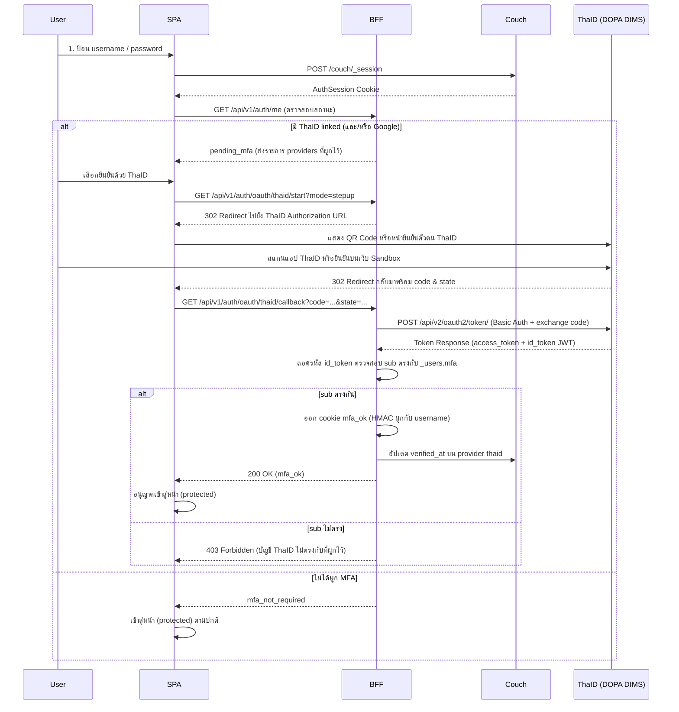

# Staff ThaID step-up MFA — password + linked ThaID (Digital ID BORA) after login

> **สรุป (TL;DR):**
>
> - **เปลี่ยนอะไร:** เพิ่ม ThaID (Digital ID กรมการปกครอง BORA) เป็น **step-up MFA** อีกหนึ่ง provider ทางเลือก (คู่กับ Google ใน CR-124) หลัง login ด้วยรหัสผ่าน — user ที่ผูก ThaID แล้วต้องยืนยันตัวตนผ่าน ThaID OIDC ก่อนเข้า `(protected)`
> - **เพื่อใคร/ทำไม:** รองรับมาตรฐานยืนยันตัวตนดิจิทัลภาครัฐและความน่าเชื่อถือระดับราชการสำหรับเจ้าหน้าที่ศูนย์พักพิง โดยไม่เปลี่ยน CouchDB `AuthSession` เป็น IdP หลัก
> - **Dev ต้อง build:** ขยาย `_users.mfa.providers[].type` ให้รองรับ `"thaid"` และ metadata (`name`, `pid_masked`) · BFF ThaID OAuth endpoints (`start`, `callback`, `unlink`) · UI challenge ให้เลือกยืนยันด้วย ThaID · UI settings ให้ผูก/ถอด ThaID · Admin ดูสถานะ/unlink
> - **กระทบ schema/scope:** `docs/data/schema.md` §6 (additive บน `_users`) · `docs/data/api-contract.md` §1.1 · **ไม่ bump `schema_v`** ของ shelter/ops docs · **ไม่ทำ ThaID SSO แบบไร้รหัสผ่าน** ในระยะนี้

---

## 1. Why

1. **มาตรฐานยืนยันตัวตนดิจิทัลภาครัฐ:** ระบบ Smart Shelter ดำเนินการร่วมกับองค์กรปกครองส่วนท้องถิ่นและหน่วยงานรัฐ การรองรับ ThaID (DOPA Digital ID) ช่วยให้การยืนยันตัวตนขั้นที่สอง (MFA) มีผลผูกพันทางกฎหมายและตรงตามระเบียบความปลอดภัยสารสนเทศภาครัฐ
2. **ขยายจากสถาปัตยกรรม CR-124:** CR-124 ออกแบบ `_users.mfa.providers` เป็น array ไว้เพื่อรองรับ multi-provider อยู่แล้ว การเพิ่ม `"thaid"` เข้าเป็น provider ชนิดที่สองจึงเข้ากับโครงสร้างเดิมได้ทันที
3. **CouchDB AuthSession คงเดิม:** ไม่เปลี่ยนกลไก session หลักของระบบ — factor 1 ยังคงเป็น username/password ผ่าน `POST /couch/_session` ตามเดิม
4. **แยกขาดจาก Partner OAuth2 (`EXT-001`):** API พันธมิตร (M6/M7) ใช้ machine client credentials ไม่เกี่ยวข้องกับ staff MFA

---

## 2. Change (before → after)

| หัวข้อ | ก่อนหน้า (CR-124) | หลังการเปลี่ยนแปลง |
| :--- | :--- | :--- |
| MFA Provider ที่รองรับ | `"google"` เท่านั้น | `"google"` และ `"thaid"` |
| ข้อมูลระบุตัวตนหลักของ Provider | Google `sub` (OIDC) | Google `sub` หรือ ThaID `sub` (OIDC subject identifier) |
| ข้อมูลแสดงผล (Display metadata) | Google `email` | Google `email` หรือ ThaID `name` (ชื่อ-นามสกุล) + `pid_masked` (เลข ปชช. บังตา) |
| MFA Challenge เมื่อผูกหลายตัว | มีได้เฉพาะ Google | ถ้าผูกทั้ง Google และ ThaID ผู้ใช้เลือกยืนยันตัวตนผ่าน provider ใด provider หนึ่งที่ตนผูกไว้ |
| การผูกบัญชี (Enroll) | ผู้ใช้ผูก Google ใน Settings | ผู้ใช้เลือกผูก Google หรือ ThaID (หรือทั้งคู่) ใน Settings |
| Admin จัดการ | ดูสถานะและ unlink Google | ดูสถานะและ unlink แยกตาม provider (Google / ThaID) |

### 2.1 ลำดับการทำงาน (Sequence Diagram)

---

## 3. Requirements

### 3.1 `_users` Storage & Data Model

- **FR-01 (Provider Type Whitelist):** ขยาย enum `mfa.providers[].type` ให้รองรับ `"thaid"` เพิ่มเติมจาก `"google"`
- **FR-02 (ThaID Provider Shape):** สำหรับ provider ชนิด `"thaid"` ข้อมูลใน `mfa.providers[]` ต้องมีฟิลด์ดังต่อไปนี้:

| Field | ชนิด | req | หมายเหตุ |
| :--- | :--- | :--- | :--- |
| `type` | enum | req | ค่าคงที่ `"thaid"` |
| `subject` | str | req | ThaID OIDC `sub` (stable identifier) — **ห้าม**ใช้เลขบัตร ปชช. ดิบเป็น subject หลัก |
| `name` | str\|null | opt | ชื่อ-นามสกุล ภาษาไทย จาก ThaID OIDC claim สำหรับแสดงผล |
| `pid_masked` | str\|null | opt | เลขประจำตัวประชาชนแบบบังตา เช่น `1-xxxx-xxxxx-12-3` สำหรับแสดงผลยืนยันตัวตน (ไม่เก็บ plain text 13 หลัก) |
| `linked_at` | ISO ts | req | วันเวลาที่ผูกบัญชีสำเร็จ |
| `verified_at` | ISO ts\|null | opt | วันเวลาที่ผ่าน step-up MFA สำเร็จล่าสุด |

- **FR-03 (Uniqueness per ThaID):** ThaID `subject` หนึ่งค่าสามารถผูกได้กับ `_users` เพียงบัญชีเดียวในระบบ — หากมีการพยายามผูกซ้ำกับบัญชีอื่น ให้ปฏิเสธด้วย `CONFLICT`
- **FR-04 (One ThaID per User):** แต่ละบัญชีผู้ใช้สามารถมี provider `type: "thaid"` ได้ไม่เกิน 1 รายการใน `mfa.providers`

### 3.2 BFF OAuth Endpoints สำหรับ ThaID

- **FR-05 (Server-side ThaID OAuth Endpoints):** สร้างชุด endpoints ภายใต้ `/api/v1/auth/oauth/thaid/`:
  - `GET /start`: เริ่มกระบวนการ OAuth2 (รองรับ `mode=link` และ `mode=stepup`), ตรวจสอบ CSRF state
  - `GET /callback`: รับ `code` และ `state`, แลกเปลี่ยน token ที่ endpoint `/api/v2/oauth2/token/` ของ ThaID, ตรวจสอบ `id_token` (JWT signature/claims), ดำเนินการ link หรือจบ step-up
  - `POST /unlink`: ถอดการผูกบัญชี ThaID สำหรับตนเอง (Self-service) หรือ Admin
- **FR-06 (BFF Configuration & Secrets):**
  - ค่า credential ประกอบด้วย `THAID_OAUTH_CLIENT_ID`, `THAID_OAUTH_CLIENT_SECRET`, `THAID_OAUTH_AUTH_URL`, `THAID_OAUTH_TOKEN_URL`, `THAID_OAUTH_REDIRECT_URI`
  - ข้อมูล secret ต้องอยู่เฉพาะฝั่ง server (`$env/dynamic/private`) ห้าม expose สู่ browser หรือ bundle ฝั่ง client เด็ดขาด
- **FR-07 (Basic Auth Token Exchange):** การส่งคำขอแลกเปลี่ยน token ไปยัง ThaID ต้องใช้ Header `Authorization: Basic base64(client_id:client_secret)` ตามข้อกำหนดของสำนักบริหารการทะเบียน (BORA)

### 3.3 Post-login Step-up & Gate Enforcement

- **FR-08 (MFA Gate Support ThaID):** หลังผู้ใช้ผ่านการ login ด้วย username/password หากใน `_users.mfa.providers` มีรายการ `"thaid"`:
  - กำหนดสถานะเป็น `pending_mfa` จนกว่าจะยืนยันตัวตนผ่าน ThaID (หรือ provider อื่นที่ผูกไว้) สำเร็จ
  - เมื่อยืนยันสำเร็จ ออก cookie `mfa_ok` ที่ sign ด้วย HMAC ผูกกับ username ตามมาตรฐาน CR-124
- **FR-09 (Multi-provider Selection):** หากผู้ใช้ผูกทั้ง Google และ ThaID:
  - หน้าจอ MFA challenge ต้องแสดงตัวเลือกให้ผู้ใช้เลือกว่าจะยืนยันผ่าน Google หรือ ThaID
  - การยืนยันตัวตนผ่าน provider ใด provider หนึ่งที่ผูกไว้ถือว่าผ่าน step-up MFA สำหรับรอบ session นั้น
- **FR-10 (Identity Mismatch Handling):** หาก callback จาก ThaID ส่ง `sub` ที่ไม่ตรงกับค่า `subject` ที่บันทึกไว้ในบัญชีผู้ใช้ ให้ปฏิเสธการเข้าสู่ระบบ คงสถานะ `pending_mfa` และแจ้งเตือนผู้ใช้

### 3.4 Self-Service Linking & Admin Management

- **FR-11 (Self-linking from Settings):** ผู้ใช้ที่เข้าสู่ระบบและผ่าน MFA แล้ว สามารถกด "ผูกบัญชี ThaID" จากหน้า Settings/Me โดยระบบจะนำทางไปยัง ThaID OAuth เพื่อยืนยันตัวตนและบันทึกการผูก
- **FR-12 (Admin Visibility & Unlink):**
  - หน้ารายชื่อและแก้ไขผู้ใช้ (`/users`) ต้องแสดงสถานะการผูก ThaID (พร้อมชื่อผู้ถือบัตรและเลขบังตา)
  - ผู้ดูแลระบบที่มีสิทธิ์ (System Admin หรือ Shelter Manager ตามขอบเขตศูนย์) สามารถสั่ง Unlink ThaID ของผู้ใช้ได้กรณีทำอุปกรณ์สูญหายหรือไม่สามารถเข้าถึง ThaID ได้
- **FR-13 (Password Reset Invariant):** การลืมรหัสผ่านหรือการรีเซ็ตรหัสผ่านโดยแอดมิน (CR-105) จะไม่ล้างการผูก ThaID โดยอัตโนมัติ — ผู้ใช้ยังคงต้องผ่าน step-up MFA หลังตั้งรหัสผ่านใหม่

### 3.5 สภาพแวดล้อม Offline / Edge Fallback

- **FR-14 (Central & WAN Dependency):** การทำ ThaID step-up MFA ต้องเชื่อมต่อกับระบบกลาง (Central) และเซิร์ฟเวอร์ ThaID ของกรมการปกครองได้
- **FR-15 (Edge Invariant):** ในสถานการณ์ภัยพิบัติที่ WAN ถูกตัดขาดและทำงานในโหมด Edge-only ผู้ใช้ที่ enroll MFA ไว้แล้วจะไม่สามารถ bypass MFA ได้โดยอัตโนมัติ (คงนโยบายความปลอดภัยเดียวกับ CR-124)

---

## 4. Out of scope

- ThaID SSO เต็มรูปแบบ (การล็อกอินเข้าระบบด้วย ThaID โดยไม่ใช้รหัสผ่าน CouchDB) — อยู่ใน Backlog ระยะถัดไป
- การดึงข้อมูลทะเบียนราษฎร์เชิงลึก (เช่น ทะเบียนบ้าน, ข้อมูลครอบครัว) — ใช้เฉพาะ scope พื้นฐานสำหรับพิสูจน์ตัวตน (`openid`, `pid`, `name`)
- การใช้ ThaID ในการลงทะเบียนผู้พักพิง (Evacuee Registration) — เอกสารฉบับนี้ครอบคลุมเฉพาะสิทธิ์การเข้าใช้งานระบบของเจ้าหน้าที่ (Staff MFA)
- การบังคับ enroll ทุกบัญชี (ยังคงเป็น opt-in หรือนโยบายระดับบริหาร)

---

## 5. Acceptance Criteria (DoD)

- [ ] **AC-01:** ขยาย type และฟังก์ชันใน `frontend/src/lib/server/user-service.ts` ให้รองรับ `type: "thaid"`, `name`, `pid_masked`
- [ ] **AC-02:** ผู้ใช้ที่ login แล้วสามารถเริ่มขั้นตอนผูก ThaID จาก Settings, ยืนยันผ่าน ThaID Sandbox, และบันทึก `mfa.providers` สำเร็จ
- [ ] **AC-03:** ThaID `subject` เดียวกันไม่สามารถผูกซ้ำกับบัญชี `_users` อื่นได้ (คืนค่า `409 CONFLICT`)
- [ ] **AC-04:** ผู้ใช้ที่มี ThaID linked เมื่อ login ด้วยรหัสผ่าน จะติดสถานะ `pending_mfa` และถูกนำทางไปยืนยันตัวตนผ่าน ThaID
- [ ] **AC-05:** เมื่อยืนยัน ThaID ด้วยบัญชีที่ตรงกัน ระบบตั้งค่า cookie `mfa_ok` และอนุญาตให้เข้าสู่หน้า `(protected)` ได้
- [ ] **AC-06:** เมื่อยืนยัน ThaID ด้วยบัญชีที่ไม่ตรงกัน ระบบปฏิเสธการเข้าสู่ระบบและแสดงข้อความแจ้งเตือนที่เหมาะสม
- [ ] **AC-07:** กรณีผู้ใช้ผูกทั้ง Google และ ThaID หน้าจอแสดงตัวเลือกทั้งสอง และสามารถเลือกยืนยันตัวตนด้วยตัวใดตัวหนึ่งได้สำเร็จ
- [ ] **AC-08:** ผู้ใช้สามารถถอดการผูก (Unlink) ThaID ของตนเองจากหน้า Settings ได้
- [ ] **AC-09:** ผู้ดูแลระบบเห็นสถานะการผูก ThaID ในหน้าจัดการผู้ใช้ และสามารถสั่ง Unlink ThaID ให้ผู้ใช้ได้
- [ ] **AC-10:** ค่า Secret ต่าง ๆ (`THAID_OAUTH_CLIENT_SECRET` ฯลฯ) ไม่รั่วไหลไปยังฝั่ง client หรือ browser bundle
- [ ] **AC-11:** มี Unit / Integration tests ครอบคลุม flow การ link, verify, unlink, และ conflict handling โดยผ่านการทดสอบครบถ้วน

---

## 6. Impact / Changes by file

| File / Component | รายละเอียดการเปลี่ยนแปลง |
| :--- | :--- |
| `docs/data/schema.md` §6 | อัปเดตตาราง schema `_users.mfa.providers` เพิ่มประเภท `"thaid"` และฟิลด์ `name`, `pid_masked` |
| `docs/data/api-contract.md` §1.1 | บันทึกรายละเอียด BFF endpoints `/api/v1/auth/oauth/thaid/*` และการรองรับ multi-provider MFA |
| `frontend/src/lib/server/user-service.ts` | ขยาย `MfaProviderType = 'google' \| 'thaid'`, เพิ่มฟังก์ชัน `linkThaidMfa`, `unlinkThaidMfa`, `touchThaidMfaVerified` |
| `frontend/src/lib/server/thaid-oauth.ts` | โมดูลใหม่สำหรับจัดการ OAuth2 flow ของ ThaID (สร้าง Auth URL, แลกเปลี่ยน token ด้วย Basic Auth, ตรวจสอบ JWT claims) |
| `frontend/src/routes/api/v1/auth/oauth/thaid/*` | Endpoints: `start/+server.ts`, `callback/+server.ts`, `unlink/+server.ts` |
| `frontend/src/lib/features/login/` | ปรับปรุงหน้า MFA Challenge ให้รองรับการเลือกยืนยันตัวตนผ่าน ThaID |
| `frontend/src/routes/(app)/settings/me/` | เพิ่มส่วนการผูก/ยกเลิกการผูกบัญชี ThaID |
| `frontend/src/lib/features/users/` | แสดงสถานะ ThaID MFA ในตารางและฟอร์มผู้ใช้ พร้อมปุ่ม Unlink ThaID |
| `frontend/.env.example` | เพิ่มตัวแปรสภาพแวดล้อมสำหรับ ThaID OAuth Sandbox / Production |

---

## 7. Migration

**N/A** — ฟิลด์ใน `_users` เป็นแบบ Additive:
- บัญชีเดิมที่ไม่มี `mfa` หรือผูกเฉพาะ Google จะทำงานได้ตามปกติ ไม่ต้องมีการ migrate ข้อมูลเดิม
- ไม่มีการ bump `schema_v` ของฐานข้อมูลศูนย์พักพิง (`shelter_*`)

---

## 8. Decision log

- 2026-09-16 — **proposed**: จัดทำร่าง CR สำหรับเพิ่ม ThaID step-up MFA โดยขยายจากโครงสร้างเดิมของ CR-124
- 2026-09-16 — **layer = stable**: จัดอยู่ในหมวดความปลอดภัยของระบบและการเข้าสู่ระบบ (Authentication & Security Gate)
- 2026-09-16 — **scope decision**: ใช้ ThaID เป็นปัจจัยที่สอง (step-up MFA) หลังผ่านรหัสผ่าน ไม่ทำ ThaID SSO แบบไร้รหัสผ่านในระยะนี้ เพื่อรักษาความสอดคล้องกับ CouchDB `AuthSession`
- 2026-09-16 — **data minimization**: ในฟิลด์แสดงผล บันทึกเพียงชื่อ-นามสกุล และเลขประจำตัวประชาชนแบบบังตา (`pid_masked`) เท่านั้น ไม่เก็บเลขประจำตัวประชาชน 13 หลักแบบเต็มในชั้น `_users.mfa` เพื่อลดความเสี่ยงด้านข้อมูลส่วนบุคคล (PDPA)
