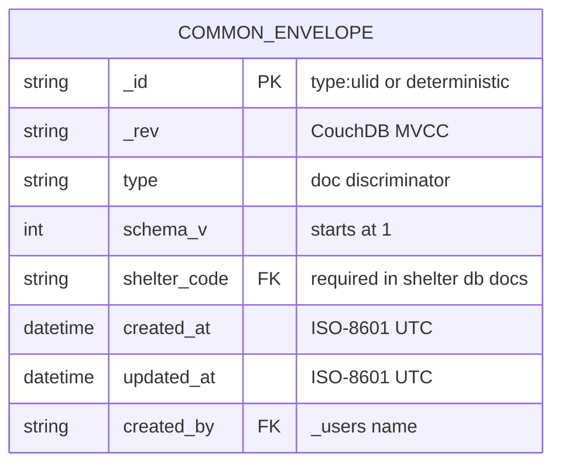
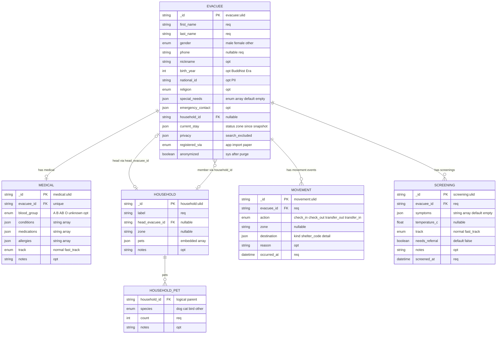
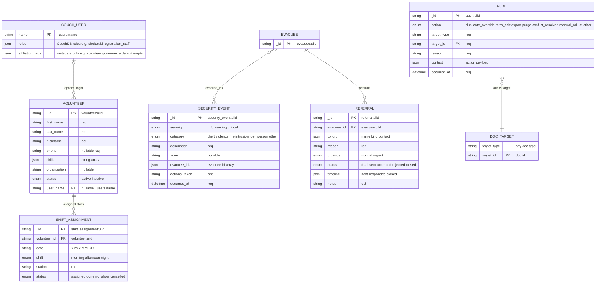
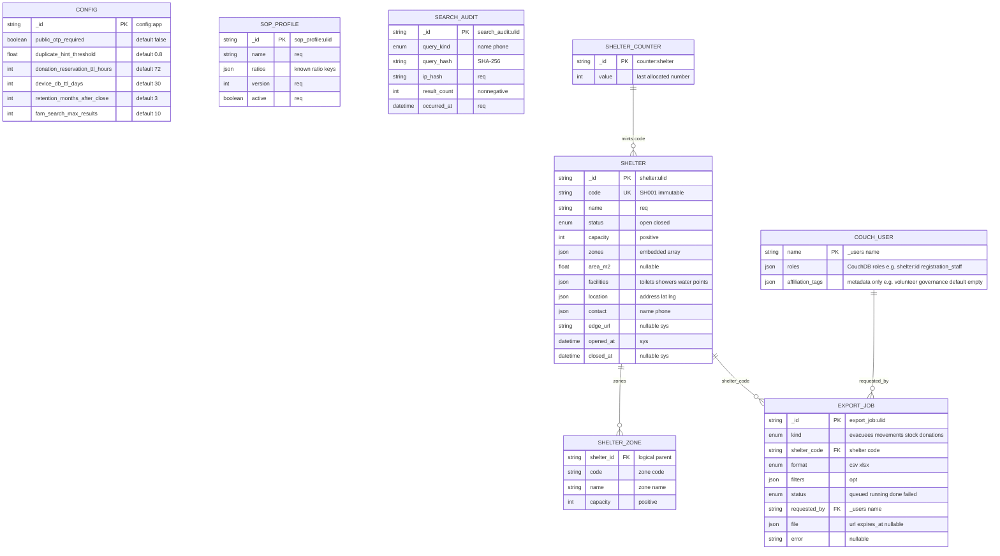

# Database ER Diagram v3 — Mermaid

เอกสารนี้ถอดความสัมพันธ์จาก [schema.md](./schema.md) เป็น Mermaid ER diagram สำหรับอ่าน dependency ของ doc type ทั้งระบบ

หมายเหตุการอ่าน:

- ระบบใช้ CouchDB/PouchDB document model ไม่ใช่ relational database จริง ดังนั้น `PK`, `FK`, `UK` ใน Mermaid คือ logical key/reference เพื่อช่วยอ่าน schema
- ทุก doc type มี common envelope จาก `schema.md §0` โดยนัย เว้นแต่ singleton/deterministic id ที่ระบุไว้ในแต่ละ type
- Entity ชื่อ `*_ITEM`, `*_NEED`, `*_RECIPE`, `*_INGREDIENT`, `SHELTER_ZONE`, `HOUSEHOLD_PET` เป็น logical child ของ embedded array/object ไม่ใช่ CouchDB doc แยก
- ความสัมพันธ์ข้าม DB เช่น `shelter_*` → `catalog` / `registry` เป็น reference by id/code และต้องบังคับด้วย validation/application logic

## Common envelope

## ภาพรวมความสัมพันธ์หลัก

```mermaid
erDiagram
    SHELTER ||--o{ SHELTER_ZONE : "zones"
    SHELTER ||--o{ SHELTER_DB_DOC : "shelter_code scope"
    SHELTER_COUNTER ||--o{ SHELTER : "mints code"

    HOUSEHOLD |o--o{ EVACUEE : "household_id"
    EVACUEE |o--o| HOUSEHOLD : "head_evacuee_id"
    EVACUEE ||--o| MEDICAL : "evacuee_id unique"
    EVACUEE ||--o{ MOVEMENT : "evacuee_id"
    EVACUEE ||--o{ SCREENING : "evacuee_id"
    EVACUEE ||--o{ REFERRAL : "evacuee_id"
    EVACUEE }o--o{ SECURITY_EVENT : "evacuee_ids"

    SUPPLY_ITEM ||--o{ STOCK_LEDGER : "item_id"
    SUPPLY_ITEM ||--o{ STOCK_TRANSFER_ITEM : "item_id"
    SUPPLY_ITEM |o--o{ DONATION_ITEM : "item_id optional"
    SUPPLY_ITEM ||--o{ DONATION_CAMPAIGN_NEED : "item_id"
    SUPPLY_ITEM ||--o{ RECIPE_INGREDIENT : "item_id"
    SUPPLY_ITEM ||--o{ REQUISITION_ITEM : "item_id"

    STOCK_TRANSFER ||--|{ STOCK_TRANSFER_ITEM : "items"
    STOCK_TRANSFER |o--o{ STOCK_LEDGER : "transfer ref_id"
    DONATION_CAMPAIGN ||--|{ DONATION_CAMPAIGN_NEED : "needs"
    DONATION_CAMPAIGN |o--o{ DONATION : "campaign_id"
    DONATION ||--o{ DONATION_ITEM : "items"
    DONATION |o--o{ STOCK_LEDGER : "donation ref_id"

    RECIPE ||--|{ RECIPE_INGREDIENT : "ingredients"
    MEAL_PLAN ||--|{ MEAL_PLAN_RECIPE : "recipes"
    RECIPE ||--o{ MEAL_PLAN_RECIPE : "recipe_id"
    MEAL_PLAN ||--o| KITCHEN_REQUISITION : "meal_plan_id"
    KITCHEN_REQUISITION ||--|{ REQUISITION_ITEM : "items"
    KITCHEN_REQUISITION ||--o{ STOCK_LEDGER : "ledger_ids"
    MEAL_PLAN ||--o| MEAL_SERVICE : "date and meal"

    VOLUNTEER ||--o{ SHIFT_ASSIGNMENT : "volunteer_id"
    AUDIT }o--|| DOC_TARGET : "target_type target_id"
    COUCH_USER |o--o{ VOLUNTEER : "user_name"
    COUCH_USER ||--o{ EXPORT_JOB : "requested_by"
```

## People — `shelter_{shelter_code}`

## Operations, inventory, donation, kitchen — `shelter_{shelter_code}` + `catalog`

```mermaid
erDiagram
    SUPPLY_ITEM {
        string _id PK "item:ulid"
        string name "req"
        enum category "food water medicine clothing hygiene bedding equipment other"
        string unit "canonical unit"
        float reorder_level "nullable"
        boolean perishable "default false"
    }

    STOCK_LEDGER {
        string _id PK "stock_ledger:ulid"
        string item_id FK "item:ulid"
        float qty "signed nonzero"
        string unit "must match item unit"
        enum reason "receive distribute requisition adjust transfer_out transfer_in donation"
        string ref_id FK "nullable source doc"
        json lot "expiry note"
        datetime occurred_at "req"
    }

    STOCK_TRANSFER {
        string _id PK "stock_transfer:ulid"
        string from_shelter FK "shelter code"
        string to_shelter FK "shelter code"
        json items "embedded array"
        enum status "requested shipped received cancelled"
        json timeline "requested shipped received"
        string notes "opt"
    }

    STOCK_TRANSFER_ITEM {
        string stock_transfer_id FK "logical parent"
        string item_id FK "item:ulid"
        float qty "positive"
        string unit "must match item unit"
    }

    DONATION {
        string _id PK "donation:ulid"
        enum channel "public walk_in"
        json donor "name phone phone_hash"
        enum kind "items money"
        json items "embedded when kind items"
        float amount_thb "positive when kind money"
        string campaign_id FK "nullable"
        enum status "declared received expired cancelled"
        string tracking_token_hash "sys"
        datetime declared_at "req"
        datetime received_at "nullable sys"
        datetime expires_at "sys"
    }

    DONATION_ITEM {
        string donation_id FK "logical parent"
        string item_id FK "nullable"
        string free_text "nullable"
        float qty "positive"
        string unit "req"
    }

    DONATION_CAMPAIGN {
        string _id PK "donation_campaign:ulid"
        string title "req"
        json needs "embedded array"
        enum status "open closed"
        datetime opens_at "opt"
        datetime closes_at "nullable"
        string notes "opt"
    }

    DONATION_CAMPAIGN_NEED {
        string campaign_id FK "logical parent"
        string item_id FK "item:ulid"
        float qty_target "positive"
        string unit "req"
    }

    RECIPE {
        string _id PK "recipe:ulid"
        string name "req"
        string serving_unit "default box"
        json ingredients "embedded array"
        json tags "halal soft_food vegetarian infant"
        boolean active "req"
    }

    RECIPE_INGREDIENT {
        string recipe_id FK "logical parent"
        string item_id FK "item:ulid"
        float qty "per serving unit"
        string unit "must match item unit"
    }

    MEAL_PLAN {
        string _id PK "meal_plan:date:meal"
        string date "YYYY-MM-DD local shelter"
        enum meal "breakfast lunch dinner snack"
        json headcount "total halal soft_food infant"
        json recipes "embedded array"
        enum status "draft confirmed"
        string override_reason "nullable"
    }

    MEAL_PLAN_RECIPE {
        string meal_plan_id FK "logical parent"
        string recipe_id FK "recipe:ulid"
        int planned_qty "positive servings"
    }

    KITCHEN_REQUISITION {
        string _id PK "kitchen_requisition:ulid"
        string meal_plan_id FK "nullable"
        json items "embedded array"
        json ledger_ids "stock_ledger ids"
        datetime issued_at "req"
    }

    REQUISITION_ITEM {
        string requisition_id FK "logical parent"
        string item_id FK "item:ulid"
        float qty_requested "positive"
        float qty_issued "nonnegative"
        string unit "must match item unit"
    }

    MEAL_SERVICE {
        string _id PK "meal_service:date:meal"
        string date "YYYY-MM-DD local shelter"
        enum meal "breakfast lunch dinner snack"
        int served "nonnegative"
        int waste "nonnegative"
        json external "volunteers outside_evacuees"
        string notes "opt"
    }

    SUPPLY_ITEM ||--o{ STOCK_LEDGER : "ledger item"
    STOCK_TRANSFER ||--|{ STOCK_TRANSFER_ITEM : "transfer lines"
    SUPPLY_ITEM ||--o{ STOCK_TRANSFER_ITEM : "transfer item"
    STOCK_TRANSFER |o--o{ STOCK_LEDGER : "transfer_out transfer_in"

    DONATION_CAMPAIGN ||--|{ DONATION_CAMPAIGN_NEED : "campaign needs"
    SUPPLY_ITEM ||--o{ DONATION_CAMPAIGN_NEED : "needed item"
    DONATION_CAMPAIGN |o--o{ DONATION : "campaign_id"
    DONATION ||--o{ DONATION_ITEM : "donated lines"
    SUPPLY_ITEM |o--o{ DONATION_ITEM : "optional catalog item"
    DONATION |o--o{ STOCK_LEDGER : "received donation"

    RECIPE ||--|{ RECIPE_INGREDIENT : "ingredients"
    SUPPLY_ITEM ||--o{ RECIPE_INGREDIENT : "ingredient item"
    MEAL_PLAN ||--|{ MEAL_PLAN_RECIPE : "planned recipes"
    RECIPE ||--o{ MEAL_PLAN_RECIPE : "used by plan"
    MEAL_PLAN ||--o| KITCHEN_REQUISITION : "requisition source"
    KITCHEN_REQUISITION ||--|{ REQUISITION_ITEM : "requested items"
    SUPPLY_ITEM ||--o{ REQUISITION_ITEM : "requested item"
    KITCHEN_REQUISITION ||--o{ STOCK_LEDGER : "issued ledgers"
    MEAL_PLAN ||--o| MEAL_SERVICE : "same date meal"
```

## Volunteer, security, referral, audit — `shelter_{shelter_code}`

## Registry, catalog support, central ops

## CouchDB views / read models

```mermaid
erDiagram
    MOVEMENT {
        string _id PK "movement:ulid"
        string evacuee_id FK
        enum action "check_in check_out transfer_out transfer_in"
        datetime occurred_at
    }

    SCREENING {
        string _id PK "screening:ulid"
        string evacuee_id FK
        datetime screened_at
    }

    STOCK_LEDGER {
        string _id PK "stock_ledger:ulid"
        string item_id FK
        float qty "signed"
        datetime occurred_at
    }

    MEAL_SERVICE {
        string _id PK "meal_service:date:meal"
        string date
        enum meal
        int served
        int waste
    }

    DONATION {
        string _id PK "donation:ulid"
        string campaign_id FK
        enum status "declared received expired cancelled"
    }

    DONATION_CAMPAIGN {
        string _id PK "donation_campaign:ulid"
        enum status "open closed"
    }

    OCCUPANCY_VIEW {
        string key "stay status"
        int count "reduce count"
    }

    LATEST_SCREENING_VIEW {
        string key "evacuee_id screened_at"
        json value "latest screening"
    }

    STOCK_BALANCE_VIEW {
        string key "item_id"
        float qty_sum "reduce sum"
    }

    MEALS_SERVED_VIEW {
        string key "date meal"
        json totals "served waste external"
    }

    NEEDS_OPEN_VIEW {
        string key "campaign item"
        float remaining_qty "campaign needs minus donation"
    }

    MOVEMENT ||--o{ OCCUPANCY_VIEW : "occupancy"
    SCREENING ||--o{ LATEST_SCREENING_VIEW : "latest_screening"
    STOCK_LEDGER ||--o{ STOCK_BALANCE_VIEW : "stock_balance"
    MEAL_SERVICE ||--o{ MEALS_SERVED_VIEW : "meals_served"
    DONATION_CAMPAIGN ||--o{ NEEDS_OPEN_VIEW : "needs_open"
    DONATION ||--o{ NEEDS_OPEN_VIEW : "needs_open"
```

