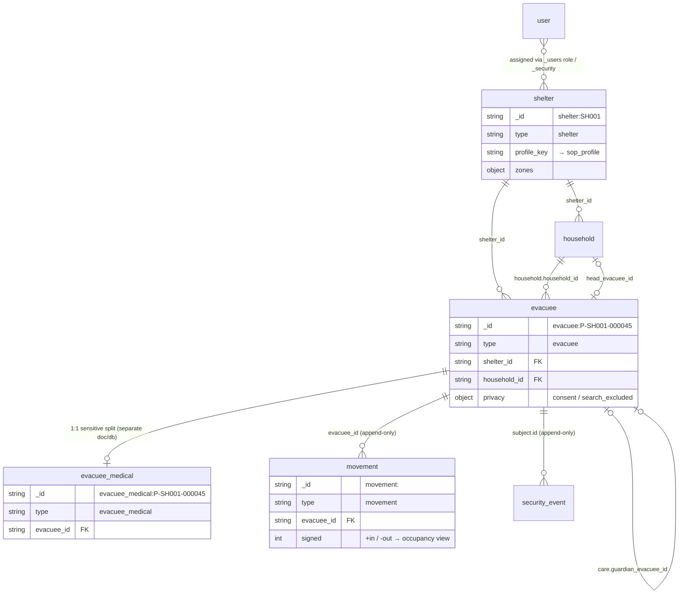
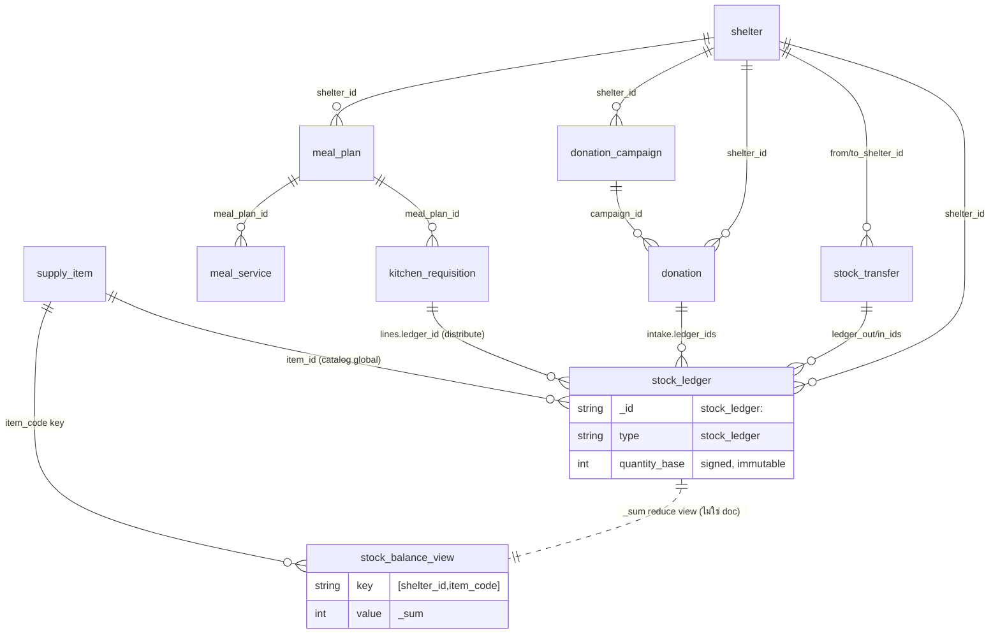
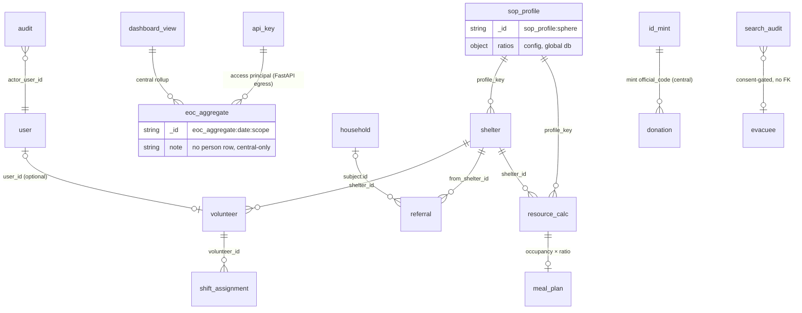
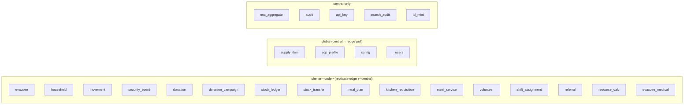

# Smart Shelter — ERD (doc-type relationships)

CouchDB ไม่มี join/FK constraint — ความสัมพันธ์เป็น **string `_id` reference** + resolve
ฝั่ง app หรือผ่าน `_design` view. ERD ข้างล่างแสดงความสัมพันธ์เชิงตรรกะระหว่าง **doc type**
(ดูฟิลด์เต็มที่ [data model](./smart-shelter-data-model.html))

> Cardinality: `||--o{` = one-to-many · `}o--o{` = many-to-many · `|o--o|` = zero/one

---

## 1. Core (people) doc types

---

## 2. Supply, donation, kitchen

---

## 3. Volunteer, SOP, resource, referral, EOC

---

## 4. Database boundary

> `evacuee_medical` อยู่ shelter db แต่ **filtered replication** — replicate ไป device/role ที่มีสิทธิ์ medical เท่านั้น (PII minimization, ดู [auth-rbac-flows](../architecture/auth-rbac-flows.html))
