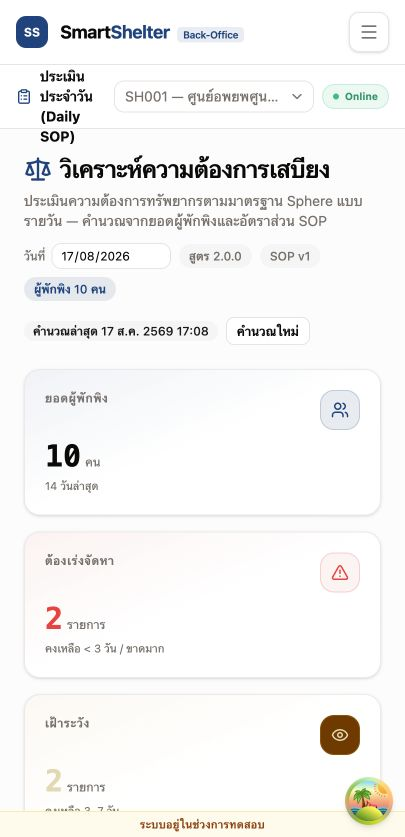

# T-31 — เครื่องมือคำนวณทรัพยากรประจำวัน: หลักฐานการสาธิต (Demo Evidence)

## 1. วัตถุประสงค์

พิสูจน์ว่าผลลัพธ์ `need` / `have` / `gap` ของเครื่องมือคำนวณตรงกับการคำนวณด้วยมือ สำหรับศูนย์พักพิง
หนึ่งแห่ง หนึ่งวันเต็ม — ตาม DoD ของ T-31: _"Demo คำนวณศูนย์ตัวอย่าง 1 วันเต็มตรงกับคำนวณมือ"_

## 2. ขอบเขตหลักฐาน

เอกสารนี้แยกหลักฐานออกเป็นสองเส้นทาง เพื่อไม่ให้ข้อมูล seed หลายวันถูกปะปนกับการสาธิต
ผ่าน UI แบบหนึ่งวัน:

1. **Seed Verification** — ตรวจ snapshot 14 วันจาก `pnpm seed` และ
   `pnpm verify:resource-calc-seed` โดยใช้ occupancy mock แบบ deterministic ของ seed
2. **Manual UI Demo** — คำนวณ on-demand หนึ่งวันด้วย occupancy 10 คน เพื่อเทียบกับการคำนวณมือ

ห้ามใช้ `pnpm seed:delete-dashboard` ก่อนเก็บหลักฐาน Seed Verification เพราะคำสั่งนี้ลบ
เอกสาร `daily_calc:*` ที่ seed สร้างไว้ด้วย

- **SOP profile**: `catalog/sop_profile:master_sphere_baseline` ("Sphere Baseline") เวอร์ชัน 1
  จำนวน 20 เกณฑ์ และต้องอ่านจากเอกสารที่ persist แล้ว
- **Daily-calc contract**: เอกสารที่ใช้ตรวจต้องเป็น `daily_calc` `schema_v: 2` ตาม CR-042
  และต้องมี `ratio_source`/override provenance; `rice_g_per_person_meal` ไม่อยู่ใน runtime
  `SOP_RATIO_KEYS`
- **ไม่ได้ตรวจสอบในการสาธิตนี้**: พฤติกรรมการคำนวณซ้ำเมื่อ occupancy หรือเกณฑ์เปลี่ยนกลางวัน
  หรือพฤติกรรมแนวโน้มหลายวัน (ครอบคลุมโดยตรงในชุดทดสอบ domain ของ T-31.9 เรื่อง
  idempotency/recalculation)

## 3. Seed Verification

### 3.1 วิธีตรวจ

ใช้ฐานข้อมูลที่ seed ใหม่ แล้วรันคำสั่งต่อไปนี้ตามลำดับ:

```bash
pnpm unseed --confirm
pnpm seed
pnpm verify:resource-calc-seed
```

ผลการตรวจล่าสุดของ branch นี้ผ่านตามเกณฑ์ต่อไปนี้:

| รายการตรวจสอบ              | ผล                                                                          |
| -------------------------- | --------------------------------------------------------------------------- |
| snapshot ต่อเนื่องย้อนหลัง | **PASS — 14 snapshots**                                                     |
| จำนวนผลลัพธ์ต่อ snapshot   | **PASS — 20 rows**                                                          |
| canonical ratio keys       | **PASS — ไม่มี `rice_g_per_person_meal`**                                   |
| schema/provenance          | **PASS — `schema_v=2`, `ratio_source=master`, override fields เป็น `null`** |
| signed stock balance       | **PASS — `item:water = 400`**                                               |
| facility source            | **PASS — water points 6, showers 8, toilets female/male 4/4**               |
| shelter source             | **PASS — `area_m2 = 800`**                                                  |
| source ที่ยังไม่รองรับ     | **PASS — `have=null` ไม่คืนค่า 0**                                          |

Seed ใช้ occupancy mock แบบ deterministic สำหรับ snapshot ย้อนหลัง 14 วัน ไม่ใช่ occupancy 10 คน
จากการสาธิตผ่าน UI; payload ล่าสุดที่อ่านกลับจาก CouchDB คือ `daily_calc:2026-08-17` โดยมี
occupancy 104 คน, `results` 20 แถว, `created_by=seed` และ `created_at=2026-08-17T09:45:49.995Z`

## 4. การคำนวณด้วยมือ

### 4.1 Manual UI Demo — occupancy 10 คน

`need` / `have` / `gap` คือผลคำนวณด้วยมือล้วน ๆ (occupancy × เกณฑ์ หรือการหารแบบปัดขึ้น) —
การคำนวณด้วยมือจริง ส่วน `status` / `data_status` คือการจัดประเภทของระบบต่อผลคำนวณนั้น
(กฎเชิงธุรกิจที่กำหนดตายตัว ไม่ใช่การคำนวณด้วยมือ) — ใส่ไว้เพื่อให้นำไปเทียบกับผลลัพธ์ที่ระบบ
บันทึกจริงใน §6 ได้ทีละแถว ไม่ใช่เพราะต้องคำนวณสองค่านี้ด้วยมือ

ลำดับแถวเรียงตาม `ordinal` จริงที่ระบบบันทึก (0–19) เพื่อให้ตารางนี้เทียบกับ JSON ใน §6 และตาราง
§4 ของรายงาน Word ได้แบบหนึ่งต่อหนึ่ง

| ordinal | kind      | key                             | สูตร         | **need** (มือ) | **have** (มือ) | status (ระบบ)     | data_status (ระบบ) |
| ------- | --------- | ------------------------------- | ------------ | -------------- | -------------- | ----------------- | ------------------ |
| 0       | multiply  | water_l_per_person_day          | 10×15        | 150            | 400            | surplus           | complete           |
| 1       | multiply  | drinking_water_l_per_person_day | 10×3         | 30             | 400            | surplus           | complete           |
| 2       | multiply  | cooking_water_l_per_person_day  | 10×6         | 60             | 400            | surplus           | complete           |
| 3       | multiply  | hygiene_water_l_per_person_day  | 10×6         | 60             | 400            | surplus           | complete           |
| 4       | multiply  | kcal_per_adult_day              | 10×2000      | 20000          | null           | insufficient_data | stock_unsynced     |
| 5       | divide    | people_per_tap                  | ceil(10/80)  | 1              | 6              | surplus           | complete           |
| 6       | divide    | people_per_handpump             | ceil(10/500) | 1              | null           | insufficient_data | stock_unsynced     |
| 7       | divide    | people_per_open_well            | ceil(10/400) | 1              | null           | insufficient_data | stock_unsynced     |
| 8       | divide    | people_per_laundry              | ceil(10/100) | 1              | null           | insufficient_data | stock_unsynced     |
| 9       | divide    | people_per_bathing              | ceil(10/50)  | 1              | 8              | surplus           | complete           |
| 10      | divide    | people_per_toilet_female        | ceil(10/20)  | 1              | 4              | surplus           | complete           |
| 11      | divide    | people_per_toilet_male          | ceil(10/35)  | 1              | 4              | surplus           | complete           |
| 12      | divide    | people_per_dining_point_adult   | ceil(10/20)  | 1              | null           | insufficient_data | stock_unsynced     |
| 13      | divide    | people_per_dining_point_child   | ceil(10/10)  | 1              | null           | insufficient_data | stock_unsynced     |
| 14      | multiply  | m2_per_person_living            | 10×3.5       | 35             | 800            | surplus           | complete           |
| 15      | multiply  | m2_per_person_living_cold       | 10×4.5       | 45             | 800            | surplus           | complete           |
| 16      | multiply  | m2_per_person_total             | 10×45        | 450            | 800            | surplus           | complete           |
| 17      | threshold | max_waterpoint_distance_m       | เพดาน        | n/a            | n/a            | constraint        | complete           |
| 18      | threshold | max_queue_minutes               | เพดาน        | n/a            | n/a            | constraint        | complete           |
| 19      | divide    | people_per_volunteer            | ceil(10/50)  | 1              | null           | insufficient_data | stock_unsynced     |

**ผลลัพธ์ที่ต้องยืนยัน: ตรงกัน 20/20 แถว** — เทียบกับ payload ของ Manual UI Demo ใน §6
หลังรัน on-demand จริง

### 4.2 Scenario 2 — การพิสูจน์เชิงตัวอย่าง (ok/gap/surplus)

ข้อมูลใน Manual UI Demo กระตุ้นสาขา `surplus` จากแหล่งที่ CR-042 map แล้ว ส่วนสคริปต์นี้ใช้พิสูจน์
สาขา `gap` และ `ok` เพิ่มเติม โดยเรียก `calculateResources()` ตัวจริงด้วยค่า `have` ที่กำหนดเอง —
ไม่ได้เชื่อมกับฐานข้อมูลใด ๆ เป็นการเรียก pure domain function ล้วน ๆ:

```
water_l_per_person_day           need=150 have=100  -> gap       (need > have)
drinking_water_l_per_person_day  need=30  have=50   -> surplus   (need < have)
cooking_water_l_per_person_day   need=60  have=60   -> ok        (need = have)
people_per_toilet_female         need=1   have=0    -> gap
people_per_tap                   need=1   have=1    -> ok
people_per_volunteer             need=1   have=2    -> surplus
```

**ผลลัพธ์: ตรงกัน 6/6 แถว** ตามสาขาที่ตั้งใจไว้ทุกแถว

## 5. การสั่งงานจริงผ่านระบบ

สั่งงานผ่านเส้นทางคำนวณตามคำสั่ง (on-demand) ของแอปเอง: เข้าสู่ระบบด้วยบัญชีที่มีสิทธิ์ระดับศูนย์
กดปุ่ม **"คำนวณใหม่"** บน `CalcStatusBadge` (T-31.7) ซึ่งเรียก `useRunCalc()` →
`DailyCalcRemoteRepository.runOnDemand()` — เส้นทางโค้ดจริงของระบบ (auth แบบ cookie-session,
อ่านผ่าน peer barrel, เขียน `daily_calc:{date}` แบบ deterministic)

กลไกการ trigger เองไม่ใช่สิ่งที่การสาธิตนี้ต้องพิสูจน์ — สิ่งที่ต้องพิสูจน์คือผลลัพธ์ที่บันทึกจริง
เท่านั้น (§6) — เอกสารนี้จึงไม่ยึดติดกับรายละเอียดการ implement แบบใดแบบหนึ่งที่อาจล้าสมัยได้
หลัง refactor

ผลลัพธ์ที่ต้องบันทึกจากการรันจริง: toast แจ้ง **"คำนวณใหม่เรียบร้อย"**, badge แสดงเวลาอัปเดตล่าสุด
และชื่อผู้รันจากเอกสาร `daily_calc` ที่สร้างใหม่ ห้ามใช้ timestamp หรือผู้รันจาก demo ครั้งก่อน

## 6. ผลลัพธ์ที่ระบบบันทึก

หลัง rerun ผ่าน UI ให้ตรวจเอกสาร `daily_calc:YYYY-MM-DD` ใน `shelter_sh001`
ที่ (`GET /couch/shelter_sh001/daily_calc%3AYYYY-MM-DD`) ต้องมี shape ตาม CR-042 ดังนี้
ตัวอย่างด้านล่างเป็น **reference payload** สำหรับตรวจ shape และค่า map เท่านั้น ไม่ใช่หลักฐาน runtime
ของการรันครั้งล่าสุด ค่า `_id`, `as_of`, `created_by`, `created_at` และ `updated_at` ต้องแทนด้วยค่า
จากเอกสารที่อ่านได้หลังรัน UI จริง:

```json
{
  "_id": "daily_calc:YYYY-MM-DD",
  "type": "daily_calc",
  "schema_v": 2,
  "shelter_code": "SH001",
  "formula_v": "2.0.0",
  "sop_profile_version": 1,
  "ratio_source": "master",
  "sop_override_id": null,
  "sop_override_version": null,
  "occupancy_snapshot": 10,
  "ratio_snapshot": {
    "water_l_per_person_day": "15",
    "drinking_water_l_per_person_day": "3",
    "cooking_water_l_per_person_day": "6",
    "hygiene_water_l_per_person_day": "6",
    "kcal_per_adult_day": "2000",
    "people_per_tap": "80",
    "people_per_handpump": "500",
    "people_per_open_well": "400",
    "people_per_laundry": "100",
    "people_per_bathing": "50",
    "people_per_toilet_female": "20",
    "people_per_toilet_male": "35",
    "people_per_dining_point_adult": "20",
    "people_per_dining_point_child": "10",
    "m2_per_person_living": "3.5",
    "m2_per_person_living_cold": "4.5",
    "m2_per_person_total": "45",
    "max_waterpoint_distance_m": "500",
    "max_queue_minutes": "30",
    "people_per_volunteer": "50"
  },
  "as_of": "<actual-as-of>",
  "stock_snapshot": {
    "water_l_per_person_day": "400",
    "drinking_water_l_per_person_day": "400",
    "cooking_water_l_per_person_day": "400",
    "hygiene_water_l_per_person_day": "400",
    "kcal_per_adult_day": null,
    "people_per_tap": "6",
    "people_per_handpump": null,
    "people_per_open_well": null,
    "people_per_laundry": null,
    "people_per_bathing": "8",
    "people_per_toilet_female": "4",
    "people_per_toilet_male": "4",
    "people_per_dining_point_adult": null,
    "people_per_dining_point_child": null,
    "m2_per_person_living": "800",
    "m2_per_person_living_cold": "800",
    "m2_per_person_total": "800",
    "max_waterpoint_distance_m": null,
    "max_queue_minutes": null,
    "people_per_volunteer": null
  },
  "created_by": "<actual-runner>",
  "created_at": "<actual-created-at>",
  "updated_at": "<actual-updated-at>",
  "results": [
    {
      "ordinal": 0,
      "key": "water_l_per_person_day",
      "kind": "multiply",
      "input_valid": true,
      "ratio": "15",
      "need": "150",
      "have": "400",
      "gap": "-250",
      "status": "surplus",
      "data_status": "complete",
      "as_of": "<actual-as-of>"
    },
    {
      "ordinal": 1,
      "key": "drinking_water_l_per_person_day",
      "kind": "multiply",
      "input_valid": true,
      "ratio": "3",
      "need": "30",
      "have": "400",
      "gap": "-370",
      "status": "surplus",
      "data_status": "complete",
      "as_of": "<actual-as-of>"
    },
    {
      "ordinal": 2,
      "key": "cooking_water_l_per_person_day",
      "kind": "multiply",
      "input_valid": true,
      "ratio": "6",
      "need": "60",
      "have": "400",
      "gap": "-340",
      "status": "surplus",
      "data_status": "complete",
      "as_of": "<actual-as-of>"
    },
    {
      "ordinal": 3,
      "key": "hygiene_water_l_per_person_day",
      "kind": "multiply",
      "input_valid": true,
      "ratio": "6",
      "need": "60",
      "have": "400",
      "gap": "-340",
      "status": "surplus",
      "data_status": "complete",
      "as_of": "<actual-as-of>"
    },
    {
      "ordinal": 4,
      "key": "kcal_per_adult_day",
      "kind": "multiply",
      "input_valid": true,
      "ratio": "2000",
      "need": "20000",
      "have": null,
      "gap": null,
      "status": "insufficient_data",
      "data_status": "stock_unsynced",
      "as_of": "<actual-as-of>"
    },
    {
      "ordinal": 5,
      "key": "people_per_tap",
      "kind": "divide",
      "input_valid": true,
      "ratio": "80",
      "need": "1",
      "have": "6",
      "gap": "-5",
      "status": "surplus",
      "data_status": "complete",
      "as_of": "<actual-as-of>"
    },
    {
      "ordinal": 6,
      "key": "people_per_handpump",
      "kind": "divide",
      "input_valid": true,
      "ratio": "500",
      "need": "1",
      "have": null,
      "gap": null,
      "status": "insufficient_data",
      "data_status": "stock_unsynced",
      "as_of": "<actual-as-of>"
    },
    {
      "ordinal": 7,
      "key": "people_per_open_well",
      "kind": "divide",
      "input_valid": true,
      "ratio": "400",
      "need": "1",
      "have": null,
      "gap": null,
      "status": "insufficient_data",
      "data_status": "stock_unsynced",
      "as_of": "<actual-as-of>"
    },
    {
      "ordinal": 8,
      "key": "people_per_laundry",
      "kind": "divide",
      "input_valid": true,
      "ratio": "100",
      "need": "1",
      "have": null,
      "gap": null,
      "status": "insufficient_data",
      "data_status": "stock_unsynced",
      "as_of": "<actual-as-of>"
    },
    {
      "ordinal": 9,
      "key": "people_per_bathing",
      "kind": "divide",
      "input_valid": true,
      "ratio": "50",
      "need": "1",
      "have": "8",
      "gap": "-7",
      "status": "surplus",
      "data_status": "complete",
      "as_of": "<actual-as-of>"
    },
    {
      "ordinal": 10,
      "key": "people_per_toilet_female",
      "kind": "divide",
      "input_valid": true,
      "ratio": "20",
      "need": "1",
      "have": "4",
      "gap": "-3",
      "status": "surplus",
      "data_status": "complete",
      "as_of": "<actual-as-of>"
    },
    {
      "ordinal": 11,
      "key": "people_per_toilet_male",
      "kind": "divide",
      "input_valid": true,
      "ratio": "35",
      "need": "1",
      "have": "4",
      "gap": "-3",
      "status": "surplus",
      "data_status": "complete",
      "as_of": "<actual-as-of>"
    },
    {
      "ordinal": 12,
      "key": "people_per_dining_point_adult",
      "kind": "divide",
      "input_valid": true,
      "ratio": "20",
      "need": "1",
      "have": null,
      "gap": null,
      "status": "insufficient_data",
      "data_status": "stock_unsynced",
      "as_of": "<actual-as-of>"
    },
    {
      "ordinal": 13,
      "key": "people_per_dining_point_child",
      "kind": "divide",
      "input_valid": true,
      "ratio": "10",
      "need": "1",
      "have": null,
      "gap": null,
      "status": "insufficient_data",
      "data_status": "stock_unsynced",
      "as_of": "<actual-as-of>"
    },
    {
      "ordinal": 14,
      "key": "m2_per_person_living",
      "kind": "multiply",
      "input_valid": true,
      "ratio": "3.5",
      "need": "35",
      "have": "800",
      "gap": "-765",
      "status": "surplus",
      "data_status": "complete",
      "as_of": "<actual-as-of>"
    },
    {
      "ordinal": 15,
      "key": "m2_per_person_living_cold",
      "kind": "multiply",
      "input_valid": true,
      "ratio": "4.5",
      "need": "45",
      "have": "800",
      "gap": "-755",
      "status": "surplus",
      "data_status": "complete",
      "as_of": "<actual-as-of>"
    },
    {
      "ordinal": 16,
      "key": "m2_per_person_total",
      "kind": "multiply",
      "input_valid": true,
      "ratio": "45",
      "need": "450",
      "have": "800",
      "gap": "-350",
      "status": "surplus",
      "data_status": "complete",
      "as_of": "<actual-as-of>"
    },
    {
      "ordinal": 17,
      "key": "max_waterpoint_distance_m",
      "kind": "threshold",
      "input_valid": true,
      "ratio": "500",
      "need": null,
      "have": null,
      "gap": null,
      "status": "constraint",
      "data_status": "complete",
      "as_of": "<actual-as-of>"
    },
    {
      "ordinal": 18,
      "key": "max_queue_minutes",
      "kind": "threshold",
      "input_valid": true,
      "ratio": "30",
      "need": null,
      "have": null,
      "gap": null,
      "status": "constraint",
      "data_status": "complete",
      "as_of": "<actual-as-of>"
    },
    {
      "ordinal": 19,
      "key": "people_per_volunteer",
      "kind": "divide",
      "input_valid": true,
      "ratio": "50",
      "need": "1",
      "have": null,
      "gap": null,
      "status": "insufficient_data",
      "data_status": "stock_unsynced",
      "as_of": "<actual-as-of>"
    }
  ]
}
```

(หลัง rerun ต้องตรวจว่าได้ 20 แถว ไม่มี key `rice_g_per_person_meal` และบันทึก payload จริงแยกจาก
reference payload นี้)

### 6.1 Actual UI evidence — 17 สิงหาคม 2569

รัน Manual UI Demo จริงที่ `/back-office/resource-dashboard` หลัง `unseed → seed →
seed:delete-dashboard` แล้วกด **คำนวณใหม่** สำเร็จ โดย toast ที่เห็นคือ
**"คำนวณใหม่เรียบร้อย"** และหน้าแสดงผู้พักพิง 10 คน ผลที่อ่านกลับจาก CouchDB ตรงกับตาราง
คำนวณมือ 20/20 แถว

| ฟิลด์                                      | ค่าจากเอกสารจริง                         |
| ------------------------------------------ | ---------------------------------------- |
| `_id`                                      | `daily_calc:2026-08-17`                  |
| `type` / `schema_v`                        | `daily_calc` / `2`                       |
| `created_by`                               | `demo-t31-manager`                       |
| `created_at` / `updated_at`                | `2026-08-17T10:08:13.879Z`               |
| `occupancy_snapshot`                       | `10`                                     |
| `ratio_source`                             | `master`                                 |
| `sop_override_id` / `sop_override_version` | `null` / `null`                          |
| `results`                                  | `20` แถว; ไม่มี `rice_g_per_person_meal` |
| `item:water` signed balance                | `400`                                    |

ไฟล์ [actual payload](T-31-manual-ui-payload-2026-08-17.json) เก็บเอกสารเต็มที่อ่านกลับจาก
CouchDB และ [ภาพหน้าจอจาก UI จริง](T-31-manual-ui-demo-2026-08-17.png) แสดงสถานะหลังคำนวณ
ล่าสุด, occupancy 10 คน และปุ่มคำนวณใหม่

## 7. ภาพหน้าจอ

`CalcStatusBadge` (T-31.7) หลังสั่งคำนวณควรแสดง toast สำเร็จและเวลาอัปเดตล่าสุด:

> **[✓] คำนวณใหม่เรียบร้อย**
> อัปเดตล่าสุด `<actual-local-time>` · โดย `<actual-runner>` [คำนวณใหม่]

หลักฐานรอบนี้ใช้ภาพและ payload จากการรันเดียวกัน: เอกสาร `daily_calc:2026-08-17`,
`created_by=demo-t31-manager` และ timestamp `2026-08-17T10:08:13.879Z` ไม่ใช้ภาพหรือ timestamp
จาก demo ครั้งก่อนแทนหลักฐานรอบนี้



## 8. ตารางสรุปการตรวจสอบ

| ข้อกำหนด                           | วิธีตรวจสอบ                                    | หลักฐาน                     | ผล                                                       |
| ---------------------------------- | ---------------------------------------------- | --------------------------- | -------------------------------------------------------- |
| Seed snapshots และ CR-042 map      | `pnpm seed` + `pnpm verify:resource-calc-seed` | §3                          | **PASS — 14 snapshots, 20 rows, map/provenance ถูกต้อง** |
| คำนวณมือ (Manual UI Demo)          | คำนวณด้วยมือ + เทียบผลจาก UI                   | §4.1 + §6.1                 | **PASS — ตรงกัน 20/20 แถว**                              |
| เอกสารที่บันทึกตรงกับ schema/ตาราง | สั่งผ่าน UI จริง + อ่านจาก CouchDB โดยตรง      | actual payload + screenshot | **PASS — `schema_v=2`, 20 rows, provenance ถูกต้อง**     |
| พิสูจน์สาขาสูตร ok/gap/surplus     | `scripts/demo/t31-scenario-2-illustrative.ts`  | §4.2                        | **PASS — ตรงกัน 6/6 แถว**                                |

ผลลัพธ์จาก Manual UI ถูกเทียบกับตารางคำนวณมือโดยตรงแล้วหลัง rerun ของ `schema_v=2` และบันทึก
วันเวลา/ผู้รันจริงไว้ใน §6.1 ห้ามใช้ payload เก่า `schema_v=1` เป็นหลักฐานปิดงาน

## 9. ข้อจำกัดที่ทราบ

CR-042 map แหล่งข้อมูลที่รองรับแล้วดังนี้: เกณฑ์น้ำ 4 ค่าใช้ signed sum ของ `item:water`,
`people_per_tap`/`people_per_bathing`/เกณฑ์ส้วมใช้ facilities ของศูนย์ และเกณฑ์พื้นที่ 3 ค่าใช้
`area_m2` ของศูนย์ ส่วน handpump, open well, laundry, dining point, kcal และ volunteer ยังไม่มี
แหล่งข้อมูลที่อนุมัติ จึงต้องเป็น `have=null` โดยตั้งใจ ไม่ใช่ `0`

ยอด `item:water` ถูกใช้ตามจำนวนที่บันทึกใน ledger โดยตรงตาม map ที่อนุมัติใน CR-042; เอกสารนี้
ไม่สมมติการแปลงหน่วยขวดเป็นลิตร หากมีการเปลี่ยนความหมายหรือเพิ่ม conversion ต้องผ่าน CR ใหม่ก่อน

## ภาคผนวก

**การเตรียมระบบ**

### Seed Verification

```bash
pnpm unseed --confirm
pnpm seed
pnpm verify:resource-calc-seed
```

### Manual UI Demo

ให้รันหลังจาก `pnpm seed` ใน environment เดียวกัน คำสั่งนี้ลบ dashboard test data และ `daily_calc`
ที่ seed สร้างไว้ด้วย จึงใช้ได้เฉพาะก่อนการสาธิต on-demand และต้องกด **คำนวณใหม่** ผ่าน UI
เพื่อสร้างเอกสารของวันนั้นใหม่:

```
pnpm seed:delete-dashboard
pnpm dev
```

รายละเอียดการเตรียมสภาพแวดล้อมแบบเต็ม (docker compose, `.env`) — ดู `docs/demo/README.md`
ถ้ามีสำหรับการตั้งค่าโปรเจกต์ทั่วไป ไม่ขอย้ำซ้ำที่นี่

**สคริปต์สาธิต** — `frontend/scripts/demo/t31-scenario-2-illustrative.ts`:

```
pnpm tsx --tsconfig .svelte-kit/tsconfig.json scripts/demo/t31-scenario-2-illustrative.ts
```
