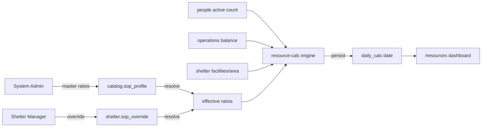
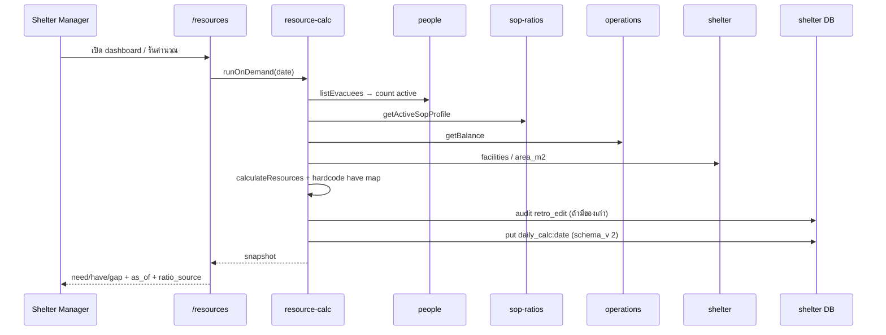

# Daily SOP — Feature Flow & Requirements

## สรุป (TL;DR)

- Module B ให้ศูนย์ **ตั้งอัตราส่วน SOP → คำนวณ need/have/gap รายวัน → ดู dashboard** เพื่อตัดสินใจขอของ / เรียกอาสา / วางแผนครัว
- Persist หลัก: `sop_profile` (catalog) · `sop_override` (shelter) · `daily_calc:{date}` (shelter, 1 doc/วัน, **schema_v 2**)
- Effective ratio = **override `active` ?? master** ([CR-006](../changes/CR-006-sop-profile-master-override.md) / [CR-018](../changes/CR-018-sop-override-invariants.md))
- Engine: occupancy (`evacuee.current_stay.status = active`) × ratio → `need`; เทียบ `have` ตาม hardcode map → `gap` ([CR-036](../changes/CR-036-daily-calc-doc-type.md) / [CR-042](../changes/CR-042-daily-sop-calc-follow-up.md))
- R3: **on-demand อย่างเดียว** · drill-down จาก snapshot fields · **ไม่** feed Meal/Volunteer/Donation จนกว่า T-32 นิ่ง

---

## 1. Purpose & scope

| | |
| --- | --- |
| **จุดประสงค์** | เปลี่ยน occupancy + stock + SOP ratio เป็นตัวเลข need/have/gap ที่ผู้บริหารศูนย์ใช้วางแผนวันต่อวัน |
| **ในขอบเขต** | T-30 config · T-31 engine + persist · T-32 dashboard `/resources` · permission ตาม matrix |
| **นอกขอบเขต** | T-42 what-if · EOC aggregate ของ calc · public transparency · rice/egg consumption (ครัว / CR-021) · gate security · scheduled auto-run · downstream feed ใน R3 |
| **Change Record** | [CR-042](../changes/CR-042-daily-sop-calc-follow-up.md) (`approved`) — ปิด follow-up จาก [CR-036](../changes/CR-036-daily-calc-doc-type.md) |
| **Route** | `/resources` (dashboard + run) · `/admin/catalog` (master SOP — SA) · UI override ใน shelter back-office ของ `sop-ratios` |
| **Code** | `features/sop-ratios/` · `features/resource-calc/` |

### 1.1 Baseline ที่ locked แล้ว

| ID | สิ่งที่เคาะแล้ว | ที่มา |
| --- | --- | --- |
| B-TIER | Master catalog + per-shelter override | CR-006, CR-015, CR-026 |
| B-RESOLVE | `active override ?? master`; ไม่มี effective → reject calc | CR-018 |
| B-KEYS | 20 canonical keys (19 handbook + `people_per_volunteer`); **ไม่มี** `rice_g_per_person_meal` | CR-021 + reference table signed-off |
| B-KIND | แต่ละ key มี `multiply` \| `divide` \| `threshold` | domain `SOP_RATIO_KIND` |
| B-OCC | Occupancy = count evacuee ที่ `current_stay.status = active` | CR-035 + CR-036 |
| B-SNAP | Persist `daily_calc:{YYYY-MM-DD}` idempotent; overwrite → `audit.retro_edit` ก่อน | CR-036 |
| B-FORMULA | `FORMULA_V` semver บนผล; `status` ⊥ `data_status` | T-31.1/31.3 code |
| **OD-1=A** | Snapshot เก็บ `ratio_source` + override id/version · schema_v 2 | CR-042 |
| **OD-2=B** | Hardcode `have` map ใน code + ตาราง CR-042 | CR-042 |
| **OD-3=A** | R3 = on-demand เท่านั้น | CR-042 |
| **OD-4=C** | เลื่อน feed Meal/Volunteer/Donation หลัง T-32 นิ่ง | CR-042 |

---

## 2. Actors

| Actor | RoleKey | หน้าที่ Module B |
| --- | --- | --- |
| **System Admin** | `system_admin` | CRUD master `sop_profile` · seed/ค่าตั้งต้น · (FR-54 later) simulation |
| **Shelter Manager** | `shelter_manager` | CRUD `sop_override` + set `active` · รัน/ดู daily calc · dashboard |
| **Warehouse / Kitchen / Reg** | `warehouse_staff` / `kitchen_staff` / `registration_staff` | **ดู** ผล calc ใน scope ศูนย์ (FR-45) — ไม่แก้ ratio / ไม่รัน (ยกเว้น matrix ระบุอย่างอื่น) |
| **Producers (peer)** | — | People = occupancy · Operations = stock balance · Shelters = facilities/area · (เมื่อพร้อม) Module A = volunteer have |

---

## 3. Domain concepts

| คำ | ความหมาย |
| --- | --- |
| **SOP ratio** | อัตราส่วนต่อหัว / ต่อ facility / เพดานคุณภาพ ตาม key ใน whitelist |
| **Master profile** | `sop_profile` ใน `catalog` — ค่าตั้งต้นข้ามศูนย์ |
| **Override** | `sop_override` ใน `shelter_*` — full-replacement ทั้งชุด 20 keys; ≤1 `active` ต่อศูนย์ |
| **Effective profile** | ผล resolve ที่ engine ใช้คำนวณ |
| **Daily calc** | snapshot ผลหนึ่งวันหนึ่งศูนย์ (`daily_calc:{date}`) |
| **need / have / gap** | ต้องการ / มีอยู่ / ส่วนต่าง (สัญญาณธุรกิจบน `status`) |
| **ratio_source** | `master` \| `override` ที่ freeze ใน snapshot |

---

## 4. Requirements

### 4.1 Config (FR-44 / T-30)

(คงตาม baseline CR-006/015/018/021 — DS-C1..C9 ในโค้ด/DoD T-30)

### 4.2 Engine (FR-45 / T-31)

| ID | Requirement |
| --- | --- |
| **DS-E1** | คำนวณ need/have/gap จาก occupancy × effective ratio เทียบ have ตาม map |
| **DS-E2** | Effective = `override active ?? master`; ไม่มี effective → reject |
| **DS-E3** | Occupancy = count `current_stay.status = active` |
| **DS-E4** | Persist `daily_calc:{date}` deterministic / idempotent |
| **DS-E5** | occupancy = 0 → need ตามสูตร ไม่ crash |
| **DS-E6** | stock/facility ขาด → `have=null` + `data_status` ไม่ใส่ 0 มั่ว |
| **DS-E7** | ไม่มี override → ใช้ master |
| **DS-E8** | Overwrite วันเดิม → `audit.retro_edit` ก่อน |
| **DS-E9** | `status` ⊥ `data_status` ตามสูตร domain |
| **DS-E10** | Snapshot freeze: `ratio_snapshot`, `occupancy_snapshot`, `stock_snapshot`, `sop_profile_version`, `ratio_source`, `sop_override_id`, `sop_override_version`, `formula_v`, `as_of` |
| **DS-E11** | รองรับ **on-demand run** จาก UI เท่านั้นใน R3 (ไม่มี scheduler) |
| **DS-E12** | Unit test สูตรครอบ multiply/divide/threshold + edge DS-E5..E7 |
| **DS-E13** | `have` ตาม hardcode map ใน [CR-042](../changes/CR-042-daily-sop-calc-follow-up.md) — ไม่ lookup ด้วยชื่อ ratio key |
| **DS-E14** | `schema_v = 2` บนทุก doc ใหม่ |

### 4.3 Dashboard (FR-46 / T-32)

| ID | Requirement |
| --- | --- |
| **DS-D1** | หน้า `/resources` แสดงผลของวันเลือกได้ (default = วันนี้ตาม timezone ที่โปรเจกต์ใช้) จาก `daily_calc` |
| **DS-D2** | สรุป gap รายหมวดอย่างน้อย: อาหาร/ของใช้/อาสา (หรือ mapping category ที่ล็อกแล้วใน domain) |
| **DS-D3** | รายการขาดเรียงตามความรุนแรง (severity) |
| **DS-D4** | Drill-down แสดง provenance: occupancy, ratio, have/stock, `as_of` |
| **DS-D5** | Drill-down ระบุว่า ratio มาจาก **master หรือ override** จาก `ratio_source` (+ override id/version เมื่อ override) — **ไม่ resolve สด** |
| **DS-D6** | จำกัด shelter scope + role ตาม §6 |
| **DS-D7** | แสดง `last-updated` / `as_of` เสมอ (NFR-18) |
| **DS-D8** | อ่านจาก `daily_calc` เป็น source หลัก — เลิกพึ่ง provisional provider |
| **DS-D9** | มีปุ่มรัน on-demand เมื่อยังไม่มี doc ของวันนั้น |

### 4.4 Cross-feature (เลื่อน — OD-4=C)

| ID | Requirement | สถานะ R3 |
| --- | --- | --- |
| **DS-X1** | Meal Plan (FR-39) อ้างอิง calc/ratio โดยไม่ fork สูตร T-31 | **เลื่อน** หลัง T-32 นิ่ง |
| **DS-X2** | Volunteer demand (FR-43) ใช้แถว `people_per_volunteer` | **เลื่อน** (สอดคล้อง CR-041 D-DEMAND) |
| **DS-X3** | Donation redirect (FR-37) ใช้ gap เป็นสัญญาณ | **เลื่อน** |

---

## 5. Persistence

### 5.1 `sop_profile` — `catalog` · schema_v 3

ดู [`docs/data/schema.md`](../data/schema.md) §4.4 — 20 keys ครบ · `version` · `active`

### 5.2 `sop_override` — `shelter_*` · schema_v 2

ดู schema.md §2.14 — `base_profile_id` · full ratios · `active`

### 5.3 `daily_calc` — `shelter_*` · schema_v 2

| Field | req | หมายเหตุ |
| --- | --- | --- |
| `formula_v` | req | string semver ของ engine |
| `sop_profile_version` | req | version ของ effective profile |
| `ratio_source` | req | `master` \| `override` |
| `sop_override_id` | req | `str\|null` — null เมื่อ master |
| `sop_override_version` | req | `int\|null` — null เมื่อ master |
| `ratio_snapshot` | req | `{str:num}` freeze |
| `occupancy_snapshot` | req | num ≥ 0 |
| `as_of` | req | ts UTC ตอน freeze input |
| `stock_snapshot` | req | `{str:num\|null}` |
| `results` | req | `ResourceCalcResult[]` |

**Invariant:** 1 doc ต่อวันต่อศูนย์ · deterministic id · ไม่ mutate in-place โดยไม่ผ่าน overwrite+audit

---

## 6. Permissions

อ้าง [`docs/prd/role-permission-matrix.md`](../prd/role-permission-matrix.md):

| Action | SA | SM | WS | KS | REG |
| --- | --- | --- | --- | --- | --- |
| SOP ratio configuration (FR-44 master) | ✓ | — | — | — | — |
| SOP override (ศูนย์ตน) | ✓* | ✓ | — | — | — |
| Daily calc run / ดู (FR-45) | ✓ | scope | scope ดู | scope ดู | scope ดู |
| Dashboard (FR-46) | ✓ | scope | — | — | — |

\* SA เป็น platform override ได้ตาม pattern โปรเจกต์ — ไม่ใช่ผู้ใช้หลักของศูนย์

---

## 7. Canonical ratio keys (20) + `have` map

แหล่ง truth: CR-021 + reference table (signed-off). **ห้าม** persist `rice_g_per_person_meal` ใน SOP ratios (ย้ายครัว).  
Map เต็มอยู่ใน [CR-042](../changes/CR-042-daily-sop-calc-follow-up.md) — สรุป:

| # | key | kind | have_source | path / id |
| --- | --- | --- | --- | --- |
| 1–4 | water / drinking / cooking / hygiene `*_l_per_person_day` | multiply | stock | `item:water` (interim SKU เดียว) |
| 5 | `kcal_per_adult_day` | multiply | none | — |
| 6 | `people_per_tap` | divide | shelter | `facilities.water_points` |
| 7–9 | handpump / open_well / laundry | divide | none | — |
| 10 | `people_per_bathing` | divide | shelter | `facilities.showers` |
| 11–12 | toilet female / male | divide | shelter | `facilities.toilets_*` |
| 13–14 | dining point adult / child | divide | none | — |
| 15–17 | `m2_per_person_*` | multiply (min) | shelter | `area_m2` |
| 18–19 | max distance / queue | threshold | none | — |
| 20 | `people_per_volunteer` | divide | volunteer | Module A barrel (หรือ null) |

> [DRIFT] โค้ด `SOP_RATIO_KEYS` ยังมี `rice_g_per_person_meal` ทั้งที่ CR-021 ถอดแล้ว — reconcile ตอน implement

---

## 8. User journeys (สั้น)

### UJ-SOP-1 — SA ตั้ง master

1. เข้า `/admin/catalog` (หรือหน้า master SOP)
2. สร้าง/แก้ `sop_profile` ทั้ง 20 keys → version ใหม่ + audit
3. Profile `active` พร้อมให้ศูนย์ที่ไม่มี override ใช้

### UJ-SOP-2 — SM override ศูนย์

1. เปิดหน้า override ของศูนย์ → สร้างชุด ratios ครบ / activate
2. รัน calc → ผลใช้ค่า override + `ratio_source=override`
3. ปิด active → รอบถัดไปกลับไป master

### UJ-SOP-3 — SM ดู dashboard วันนี้

1. เปิด `/resources`
2. (ถ้ายังไม่มี doc วันนี้) กดคำนวณ on-demand
3. ดูสรุปหมวด + รายการขาด + drill-down provenance (รวม ratio_source)
4. ใช้ตัวเลขตัดสินใจขอบริจาค / เรียกอาสา / แจ้งครัว (มือ — ยังไม่ auto-feed)

---

## 9. Decisions (ปิดแล้ว — CR-042)

| ID | มติ | ผล |
| --- | --- | --- |
| **OD-1** | **A** | `ratio_source` + override id/version · schema_v 2 |
| **OD-2** | **B** | hardcode map ใน code + ตาราง CR-042 |
| **OD-3** | **A** | on-demand only ใน R3 |
| **OD-4** | **C** | เลื่อน downstream feed |

---

## 10. Acceptance / DoD mapping

| Task | ผ่านเมื่อ |
| --- | --- |
| **T-30** | DS-C1..C9 + demo SA แก้ master / SM override แล้ว calc ต่างกัน |
| **T-31** | DS-E1..E14 + demo ศูนย์ตัวอย่าง 1 วันตรงคำนวณมือ (ภายใต้ map CR-042) |
| **T-32** | DS-D1..D9 + demo drill-down จาก snapshot fields |
| **CR-042 → `done`** | code + Zod + tests ตรง schema_v 2 และ map · DoD T-31/T-32 ผ่าน |

---

## 11. Implementation notes (ไม่ใช่ requirement ใหม่)

| หัวข้อ | หมายเหตุ |
| --- | --- |
| Feature slices | UI config อยู่ `sop-ratios`; engine+persist อยู่ `resource-calc`; cross-import ผ่าน barrel เท่านั้น |
| Provisional dashboard | `sop-ratios/data/resource-calc.provider.ts` เป็นตัวเติมก่อน T-31 — T-32 ต้องสลับไป `daily_calc` |
| Qty | Stock ฝั่ง operations เป็น `qty_str` (CR-038); snapshot `daily_calc` ปัจจุบันยังเป็น num — follow-up ถ้าต้อง align |
| Permissions UI | Dashboard SM-primary; บทบาทอื่น “ดูอย่างเดียว” ตาม matrix |

---

## 12. References

| Artifact | Path |
| --- | --- |
| Task breakdown | [`docs/task-breakdown/07-B-sop.md`](../task-breakdown/07-B-sop.md) |
| PRD R3 | [`docs/prd/phase-r3-operations.md`](../prd/phase-r3-operations.md) §4.4 |
| Schema | [`docs/data/schema.md`](../data/schema.md) §2.14 §2.15 §4.4 |
| CR master/override | [CR-006](../changes/CR-006-sop-profile-master-override.md), [CR-018](../changes/CR-018-sop-override-invariants.md), [CR-021](../changes/CR-021-sop-ratio-scope-handbook-plus-volunteer.md) |
| CR daily_calc | [CR-036](../changes/CR-036-daily-calc-doc-type.md) |
| CR follow-up (approved) | [CR-042](../changes/CR-042-daily-sop-calc-follow-up.md) |
| Ratio values | [`docs/source/handbooks/sop-ratio-reference-table.md`](../source/handbooks/sop-ratio-reference-table.md) |
| Sitemap | [`docs/sitemap.md`](../sitemap.md) §2.7 `/resources` |
| Code | `frontend/src/lib/features/resource-calc/` · `frontend/src/lib/features/sop-ratios/` |
