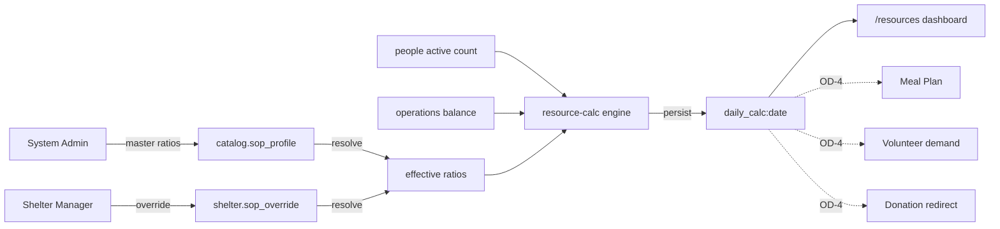
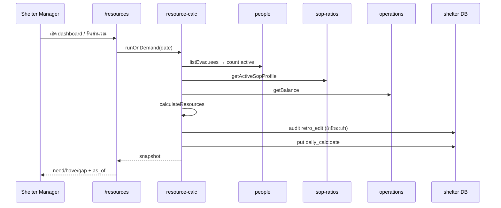

# Daily SOP — Feature Flow & Requirements

## สรุป (TL;DR)

- Module B ให้ศูนย์ **ตั้งอัตราส่วน SOP → คำนวณ need/have/gap รายวัน → ดู dashboard** เพื่อตัดสินใจขอของ / เรียกอาสา / วางแผนครัว
- Persist หลัก: `sop_profile` (catalog) · `sop_override` (shelter) · `daily_calc:{date}` (shelter, 1 doc/วัน)
- Effective ratio = **override `active` ?? master** ([CR-006](../changes/CR-006-sop-profile-master-override.md) / [CR-018](../changes/CR-018-sop-override-invariants.md))
- Engine: occupancy (`evacuee.current_stay.status = active`) × ratio → `need`; เทียบ `have` → `gap` ([CR-036](../changes/CR-036-daily-calc-doc-type.md))
- **ยังไม่เคาะ:** drill-down `ratio_source` · mapping key→stock/facility · รอบอัตโนมัติรายวัน · contract อ่านผลไป Meal Plan / Volunteer / Donation — ดู [CR-042](../changes/CR-042-daily-sop-calc-follow-up.md)

---

## 1. Purpose & scope

| | |
| --- | --- |
| **จุดประสงค์** | เปลี่ยน occupancy + stock + SOP ratio เป็นตัวเลข need/have/gap ที่ผู้บริหารศูนย์ใช้วางแผนวันต่อวัน |
| **ในขอบเขต** | T-30 config · T-31 engine + persist · T-32 dashboard `/resources` · permission ตาม matrix |
| **นอกขอบเขต** | T-42 what-if · EOC aggregate ของ calc · public transparency · rice/egg consumption (ครัว / CR-021) · gate security |
| **Change Record** | [CR-042](../changes/CR-042-daily-sop-calc-follow-up.md) (`proposed`) — ปิด follow-up จาก [CR-036](../changes/CR-036-daily-calc-doc-type.md) |
| **Route** | `/resources` (dashboard + run) · `/admin/catalog` (master SOP — SA) · UI override ใน shelter back-office ของ `sop-ratios` |
| **Code** | `features/sop-ratios/` · `features/resource-calc/` |

### 1.1 Baseline ที่ locked แล้ว

| ID | สิ่งที่เคาะแล้ว | ที่มา |
| --- | --- | --- |
| B-TIER | Master catalog + per-shelter override | CR-006, CR-015, CR-026 |
| B-RESOLVE | `active override ?? master`; ไม่มี effective → reject calc | CR-018 |
| B-KEYS | 20 canonical keys (19 handbook + `people_per_volunteer`); **ไม่มี** `rice_g_per_person_meal` | CR-021 + reference table signed-off |
| B-KIND | แต่ละ key มี `multiply` \| `divide` \| `threshold` | domain `SOP_RATIO_KIND` |
| B-OCC | Occupancy = count evacuee ที่ `current_stay.status = active` | CR-035 + CR-036 |
| B-SNAP | Persist `daily_calc:{YYYY-MM-DD}` idempotent; overwrite → `audit.retro_edit` ก่อน | CR-036 |
| B-FORMULA | `FORMULA_V` semver บนผล; `status` ⊥ `data_status` | T-31.1/31.3 code |

### 1.2 สิ่งที่ยังไม่ locked (สรุป — รายละเอียด §9)

| ID | หัวข้อ |
| --- | --- |
| **OD-1** | เก็บ `ratio_source` + override id/version ใน `daily_calc` หรือไม่ |
| **OD-2** | mapping SOP key → `have` (stock SKU / facility count / volunteer headcount) |
| **OD-3** | scheduled daily run vs on-demand อย่างเดียว |
| **OD-4** | contract ที่ Meal Plan / Volunteer demand / Donation อ่านจาก `daily_calc` |

---

## 2. Actors

| Actor | RoleKey | หน้าที่ Module B |
| --- | --- | --- |
| **System Admin** | `system_admin` | CRUD master `sop_profile` · seed/ค่าตั้งต้น · (FR-54 later) simulation |
| **Shelter Manager** | `shelter_manager` | CRUD `sop_override` + set `active` · รัน/ดู daily calc · dashboard |
| **Warehouse / Kitchen / Reg** | `warehouse_staff` / `kitchen_staff` / `registration_staff` | **ดู** ผล calc ใน scope ศูนย์ (FR-45) — ไม่แก้ ratio / ไม่รัน (ยกเว้น matrix ระบุอย่างอื่น) |
| **Producers (peer)** | — | People = occupancy · Operations = stock balance · (อนาคต) Module A = volunteer have |

---

## 3. Domain concepts

| คำ | ความหมาย |
| --- | --- |
| **SOP ratio** | อัตราส่วนต่อหัว / ต่อ facility / เพดานคุณภาพ ตาม key ใน whitelist |
| **Master profile** | `sop_profile` ใน `catalog` — ค่าตั้งต้นข้ามศูนย์ |
| **Override** | `sop_override` ใน `shelter_*` — full-replacement ทั้งชุด 20 keys; ≤1 `active` ต่อศูนย์ |
| **Effective profile** | ผล resolve ที่ engine ใช้คำนวณ |
| **Daily calc** | snapshot ผลหนึ่งวันหนึ่งศูนย์ (`daily_calc:{date}`) |
| **need / have / gap** | ต้องการ / มีอยู่ / ส่วนต่าง (สัญญาณธุรกิจบน `status`) |
| **data_status** | แกนข้อมูลพร้อมหรือไม่ (`complete` / `ratio_missing` / `stock_unsynced` / `invalid_input`) — คนละแกนกับ `status` |
| **FORMULA_V** | เวอร์ชันอัลกอริทึม (ไม่ใช่ `schema_v`) |

**ไม่ใช่ Daily SOP:** checklist ปฏิบัติการเจ้าหน้าที่แยก · security gate · meal recipe qty (ครัว) · what-if simulation (T-42)

---

## 4. Requirements (atomic)

### 4.1 Ratio configuration (FR-44 / T-30)

| ID | Requirement |
| --- | --- |
| **DS-C1** | Master `sop_profile` อยู่ใน `catalog`; CRUD ได้เฉพาะ `system_admin`; device อ่าน replica เป็น read-only |
| **DS-C2** | Override `sop_override` อยู่ใน `shelter_{code}`; CRUD + set `active` ได้โดย `shelter_manager` ของศูนย์นั้น |
| **DS-C3** | ทั้ง master และ override ต้องมี ratios **ครบ 20 keys** ตาม CR-021; key นอก whitelist = reject |
| **DS-C4** | Override = full-replacement (ไม่ merge per-key); `base_profile_id` immutable หลัง create |
| **DS-C5** | ต่อหนึ่ง `shelter_code` มี override ที่ `active=true` ได้ไม่เกิน 1 |
| **DS-C6** | ห้ามลบ master ที่ยังถูก `base_profile_id` อ้าง |
| **DS-C7** | แก้ค่าแล้วบันทึกประวัติผ่าน `audit` + `version` เพิ่มแบบ monotonic (CR-026) |
| **DS-C8** | ค่า seed ตั้งต้นตรงตารางใน [`docs/source/handbooks/sop-ratio-reference-table.md`](../source/handbooks/sop-ratio-reference-table.md) (approved 2026-07-01) |
| **DS-C9** | หลังแก้ ratio — การคำนวณรอบถัดไปต้องใช้ค่าใหม่ (ห้าม cache ค้างจน gap ผิด — NFR-18) |

### 4.2 Daily calculation engine (FR-45 / T-31)

| ID | Requirement |
| --- | --- |
| **DS-E1** | Input occupancy = จำนวน `evacuee` ที่ `current_stay.status = active` ในศูนย์ |
| **DS-E2** | Effective ratios = `getActiveSopProfile()` ตาม CR-018; ถ้าไม่มี → **ไม่เขียน** `daily_calc` (error ชัด) |
| **DS-E3** | อ่าน stock ผ่าน barrel `operations` เท่านั้น; อ่าน people / sop-ratios ผ่าน barrel ของ feature นั้นเท่านั้น |
| **DS-E4** | คำนวณทุก resource ที่ส่งเข้า engine ตาม kind: |
| | · `multiply`: `need = occupancy × ratio` |
| | · `divide`: `need = ceil(occupancy / ratio)` |
| | · `threshold`: ไม่คำนวณ gap จาก have — `need/gap` เป็นไปตามสูตร engine ปัจจุบัน; `have` informational |
| **DS-E5** | `have = null` → `status=insufficient_data` + `data_status=stock_unsynced` (ห้ามใส่ 0 มั่ว) |
| **DS-E6** | `ratio` ขาด/ไม่ valid → `data_status=ratio_missing` หรือ `invalid_input` ตาม truth table ของ `FORMULA_V` |
| **DS-E7** | `occupancy = 0` และ `have = 0` ที่ valid = `data_status=complete` (ไม่ใช่ anomaly) |
| **DS-E8** | Persist `_id = daily_calc:{YYYY-MM-DD}` · `schema_v = 1` · ฟิลด์ตาม schema.md §2.15 |
| **DS-E9** | รันวันเดิมซ้ำ = overwrite doc เดิม; **ก่อน** overwrite เขียน `audit` `action=retro_edit` เก็บ `_rev` + ผลเดิม |
| **DS-E10** | Snapshot ต้อง freeze: `ratio_snapshot`, `occupancy_snapshot`, `stock_snapshot`, `sop_profile_version`, `formula_v`, `as_of` |
| **DS-E11** | รองรับ **on-demand run** จาก UI (มีแล้วใน `runOnDemand`) |
| **DS-E12** | Unit test สูตรครอบ multiply/divide/threshold + edge DS-E5..E7 |

### 4.3 Dashboard (FR-46 / T-32)

| ID | Requirement |
| --- | --- |
| **DS-D1** | หน้า `/resources` แสดงผลของวันเลือกได้ (default = วันนี้ตาม timezone ที่โปรเจกต์ใช้) จาก `daily_calc` |
| **DS-D2** | สรุป gap รายหมวดอย่างน้อย: อาหาร/ของใช้/อาสา (หรือ mapping category ที่ล็อกแล้วใน domain) |
| **DS-D3** | รายการขาดเรียงตามความรุนแรง (severity) |
| **DS-D4** | Drill-down แสดง provenance: occupancy, ratio, have/stock, `as_of` |
| **DS-D5** | Drill-down ต้องระบุว่า ratio มาจาก **master หรือ override** — **พึ่ง OD-1**; จนกว่าเคาะ ให้แสดงว่าข้อมูลยังไม่ครบถ้า field ยังไม่มี |
| **DS-D6** | จำกัด shelter scope + role ตาม §6 |
| **DS-D7** | แสดง `last-updated` / `as_of` เสมอ (NFR-18) |
| **DS-D8** | อ่านจาก `daily_calc` เป็น source หลัก — เลิกพึ่ง provisional provider เมื่อ T-31.4 พร้อมใช้ใน UI |

### 4.4 Cross-feature (หลัง OD-4)

| ID | Requirement |
| --- | --- |
| **DS-X1** | Meal Plan (FR-39) ต้องอ้างอิง calc/ratio ได้โดยไม่ fork สูตร T-31 |
| **DS-X2** | Volunteer demand (FR-43) ใช้แถว `people_per_volunteer` (หรือ contract ที่ล็อกใน OD-4) เป็น demand input |
| **DS-X3** | Donation redirect (FR-37) อาจใช้ gap เป็นสัญญาณ “ศูนย์ขาด” — shape ตาม OD-4 |

---

## 5. Persistence

### 5.1 `sop_profile` — `catalog` · schema_v 3

ดู [`docs/data/schema.md`](../data/schema.md) §4.4 — 20 keys ครบ · `version` · `active`

### 5.2 `sop_override` — `shelter_*` · schema_v 2

ดู schema.md §2.14 — `base_profile_id` · full ratios · `active`

### 5.3 `daily_calc` — `shelter_*` · schema_v 1

| Field | req | หมายเหตุ |
| --- | --- | --- |
| `formula_v` | req | string semver ของ engine |
| `sop_profile_version` | req | version ของ effective profile |
| `ratio_snapshot` | req | `{str:num}` freeze |
| `occupancy_snapshot` | req | num ≥ 0 |
| `as_of` | req | ts UTC ตอน freeze input |
| `stock_snapshot` | req | `{str:num\|null}` |
| `results` | req | `ResourceCalcResult[]` |
| `ratio_source` | — | **ไม่ใน baseline** — ดู OD-1 |
| `sop_override_id` / `sop_override_version` | — | **ไม่ใน baseline** — ดู OD-1 |

**Invariant:** 1 doc ต่อวันต่อศูนย์ · deterministic id · ไม่ mutate in-place โดยไม่ผ่าน overwrite+audit

---

## 6. Permissions

อ้าง [`docs/prd/role-permission-matrix.md`](../prd/role-permission-matrix.md):

| Action | SA | SM | WS | KS | REG |
| --- | --- | --- | --- | --- | --- |
| SOP ratio configuration (FR-44 master) | ✓ | — | — | — | — |
| SOP override (ศูนย์ตน) | ✓* | ✓ | — | — | — |
| Daily calc run / ดู (FR-45) | ✓ | scope | scope ดู | scope ดู | scope ดู |
| Dashboard (FR-46) | ✓ | scope | — | — | — |

\* SA เป็น platform override ได้ตาม pattern โปรเจกต์ — ไม่ใช่ผู้ใช้หลักของศูนย์

---

## 7. Canonical ratio keys (20)

แหล่ง truth: CR-021 + reference table (signed-off). **ห้าม** persist `rice_g_per_person_meal` ใน SOP ratios (ย้ายครัว).

| # | key | kind | มี `have` meaning? | แหล่ง `have` (สถานะ) |
| --- | --- | --- | --- | --- |
| 1 | `water_l_per_person_day` | multiply | yes | stock SKU — **OD-2** |
| 2 | `drinking_water_l_per_person_day` | multiply | yes | stock SKU — **OD-2** |
| 3 | `cooking_water_l_per_person_day` | multiply | yes | stock SKU — **OD-2** |
| 4 | `hygiene_water_l_per_person_day` | multiply | yes | stock SKU — **OD-2** |
| 5 | `kcal_per_adult_day` | multiply | partial | อาจ derived จาก stock อาหาร / ไม่ map ตรง — **OD-2** |
| 6 | `people_per_tap` | divide | facility | นับจุดน้ำ — **OD-2** |
| 7 | `people_per_handpump` | divide | facility | **OD-2** |
| 8 | `people_per_open_well` | divide | facility | **OD-2** |
| 9 | `people_per_laundry` | divide | facility | **OD-2** |
| 10 | `people_per_bathing` | divide | facility | **OD-2** |
| 11 | `people_per_toilet_female` | divide | facility | **OD-2** |
| 12 | `people_per_toilet_male` | divide | facility | **OD-2** |
| 13 | `people_per_dining_point_adult` | divide | facility | **OD-2** |
| 14 | `people_per_dining_point_child` | divide | facility | **OD-2** |
| 15 | `m2_per_person_living` | multiply (min) | area | พื้นที่ใช้ได้ของศูนย์ — **OD-2** |
| 16 | `m2_per_person_living_cold` | multiply (min) | area | **OD-2** |
| 17 | `m2_per_person_total` | multiply (min) | area | **OD-2** |
| 18 | `max_waterpoint_distance_m` | threshold | no | `have` ไม่ใช้กับ gap |
| 19 | `max_queue_minutes` | threshold | no | `have` ไม่ใช้กับ gap |
| 20 | `people_per_volunteer` | divide | headcount | จำนวนอาสาที่พร้อม/จัดกะ — **OD-2** + Module A |

**Runtime ปัจจุบัน:** `resolveHave` lookup stock ด้วยชื่อ ratio key ตรง ๆ → key ส่วนใหญ่ได้ `null` → `stock_unsynced` (ถูกต้องตาม “ไม่ใส่ 0 มั่ว” จนกว่า OD-2 ปิด)

> [DRIFT] โค้ด `SOP_RATIO_KEYS` ยังมี `rice_g_per_person_meal` ทั้งที่ CR-021 ถอดแล้ว — ต้อง reconcile ตอน implement/cleanup (ไม่ใช่การขยาย scope ในเอกสารนี้)

---

## 8. User journeys (สั้น)

### UJ-SOP-1 — SA ตั้ง master

1. เข้า `/admin/catalog` (หรือหน้า master SOP)
2. สร้าง/แก้ `sop_profile` ทั้ง 20 keys → version ใหม่ + audit
3. Profile `active` พร้อมให้ศูนย์ที่ไม่มี override ใช้

### UJ-SOP-2 — SM override ศูนย์

1. เปิดหน้า override ของศูนย์ → สร้างชุด ratios ครบ / activate
2. รัน calc → ผลใช้ค่า override
3. ปิด active → รอบถัดไปกลับไป master

### UJ-SOP-3 — SM ดู dashboard วันนี้

1. เปิด `/resources`
2. (ถ้ายังไม่มี doc วันนี้) กดคำนวณ / หรือระบบรันตาม OD-3
3. ดูสรุปหมวด + รายการขาด + drill-down provenance
4. ใช้ตัวเลขตัดสินใจขอบริจาค / เรียกอาสา / แจ้งครัว

---

## 9. Open decisions (ต้องเคาะก่อนปิด spec = active)

| ID | คำถาม | ทางเลือก | กระทบ |
| --- | --- | --- | --- |
| **OD-1** | เพิ่ม trace ratio ใน `daily_calc`? | **A)** เพิ่ม `ratio_source: master\|override` + `sop_override_id` + `sop_override_version` (opt เมื่อ master) · **B)** คง schema_v1 — UI resolve สดตอน drill-down (เสี่ยงเลื่อนจาก snapshot) · **C)** เก็บเฉพาะ `ratio_source` ไม่เก็บ override id | schema_v bump หรือไม่ + T-32 DoD DS-D5 |
| **OD-2** | `have` mapping ต่อ 20 keys? | **A)** ตาราง map ใน catalog/master_data (SKU/facility field) · **B)** hardcode map ใน code + CR · **C)** R3 map เฉพาะ multiply+volunteer; facility/area แสดง need อย่างเดียว (`have=null` ตามเป็น) | ความถูกต้อง gap · งาน Module C/A/shelter form |
| **OD-3** | รอบอัตโนมัติรายวัน? | **A)** ปุ่ม on-demand อย่างเดียวใน R3 · **B)** client/schedule ใน SPA เมื่อ SM เปิดแอป · **C)** server/worker cron กลางคืน | DoD T-31 “ทั้ง on-demand และรอบอัตโนมัติ” |
| **OD-4** | Downstream อ่านอะไร? | **A)** อ่าน `daily_calc.results[]` ตรง · **B)** view/projection แยก · **C)** เลื่อน feed จนหลัง T-32 นิ่ง | T-25 / T-29 / T-23 |

> [NEEDS DECISION] เจ้าของโครงการต้องเลือก OD-1..OD-4 ใน [CR-042](../changes/CR-042-daily-sop-calc-follow-up.md) แล้วสั่ง `approved` — จากนั้น apply schema/DoD + ตั้งเอกสารนี้เป็น `active`

---

## 10. Acceptance / DoD mapping

| Task | ผ่านเมื่อ |
| --- | --- |
| **T-30** | DS-C1..C9 + demo SA แก้ master / SM override แล้ว calc ต่างกัน |
| **T-31** | DS-E1..E12 + demo ศูนย์ตัวอย่าง 1 วันตรงคำนวณมือ (ภายใต้ mapping ที่ล็อกใน OD-2) |
| **T-32** | DS-D1..D8 + demo drill-down (ครบเมื่อ OD-1 = A หรือเทียบเท่า) |
| **Spec นี้ = `active`** | OD-1..OD-4 เคาะแล้ว + [CR-042](../changes/CR-042-daily-sop-calc-follow-up.md) = `approved` (แล้วค่อย `done` หลัง apply) |

---

## 11. Implementation notes (ไม่ใช่ requirement ใหม่)

| หัวข้อ | หมายเหตุ |
| --- | --- |
| Feature slices | UI config อยู่ `sop-ratios`; engine+persist อยู่ `resource-calc`; cross-import ผ่าน barrel เท่านั้น |
| Provisional dashboard | `sop-ratios/data/resource-calc.provider.ts` เป็นตัวเติมก่อน T-31 — T-32 ต้องสลับไป `daily_calc` |
| Qty | Stock ฝั่ง operations เป็น `qty_str` (CR-038); snapshot `daily_calc` ปัจจุบันยังเป็น num — follow-up ถ้าต้อง align |
| Permissions UI | Dashboard SM-primary; บทบาทอื่น “ดูอย่างเดียว” ตาม matrix |

---

## 12. References

| Artifact | Path |
| --- | --- |
| Task breakdown | [`docs/task-breakdown/07-B.md`](../task-breakdown/07-B.md) |
| PRD R3 | [`docs/prd/phase-r3-operations.md`](../prd/phase-r3-operations.md) §4.4 |
| Schema | [`docs/data/schema.md`](../data/schema.md) §2.14 §2.15 §4.4 |
| CR master/override | [CR-006](../changes/CR-006-sop-profile-master-override.md), [CR-018](../changes/CR-018-sop-override-invariants.md), [CR-021](../changes/CR-021-sop-ratio-scope-handbook-plus-volunteer.md) |
| CR daily_calc | [CR-036](../changes/CR-036-daily-calc-doc-type.md) |
| CR follow-up (proposed) | [CR-042](../changes/CR-042-daily-sop-calc-follow-up.md) |
| Ratio values | [`docs/source/handbooks/sop-ratio-reference-table.md`](../source/handbooks/sop-ratio-reference-table.md) |
| Sitemap | [`docs/sitemap.md`](../sitemap.md) §2.7 `/resources` |
| Code | `frontend/src/lib/features/resource-calc/` · `frontend/src/lib/features/sop-ratios/` |
