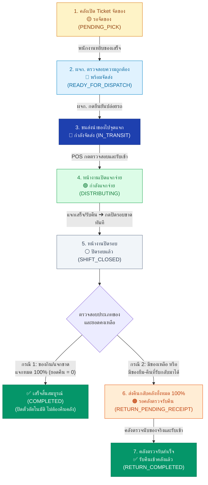
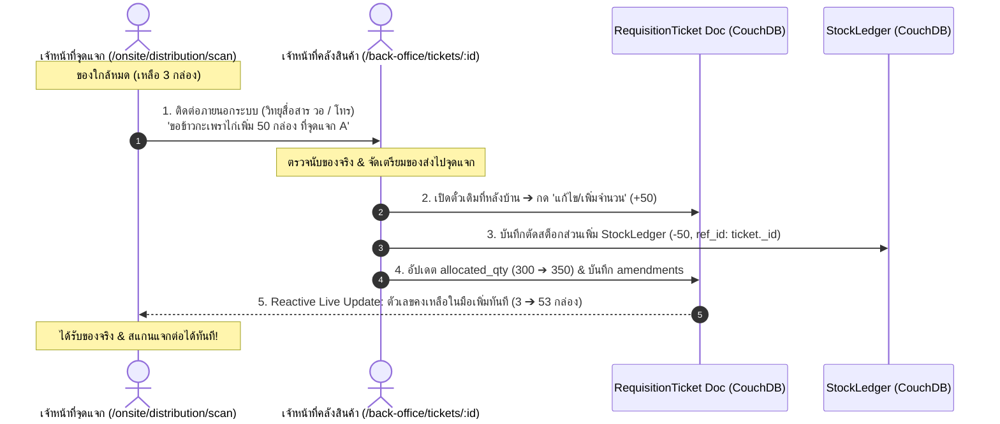
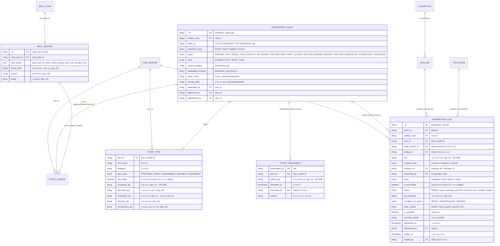

# ข้อกำหนดระบบตั๋วเบิกจ่ายพัสดุและอาหาร 4-in-1 และระบบแจกจ่ายหน้างาน
## (Requisition Ticket & Frontline Distribution Master Specification)

> **สรุป (TL;DR):**  
> **เปลี่ยนอะไร:** รวมตั๋วเบิกจ่าย 4 ประเภทเข้าเป็น `RequisitionTicket` ตัวเดียว + รวมบันทึกแจกจ่ายและของยืมหน้างานเป็น `DistributionLog` (ผนวก `meal_distribution` จาก CR-109) + ขยาย `ItemMaster` (`PREPARED_FOOD`) และ `MealService` (`yield_items`)  
> **เพื่อใคร/ทำไม:** ฝ่ายคลังสินค้า, โรงครัว, จุดแจกจ่ายหน้างาน และฝ่ายลงทะเบียน/คัดกรอง เพื่อสร้างความโปร่งใสแบบสองทิศทาง (Bidirectional Visibility) คุมอายุอาหารปรุงสุก 4 ชม. ด้วย Soft Warning, เติมของระหว่างแจกแบบ Reactive, และติดตามของยืมคงทนโดยไม่ใช้บาร์โค้ด พร้อมปลดภาระตอน Check-out  
> **dev ต้อง build อะไร:** 4 เวิร์กสเปซหลังบ้าน (`/back-office/tickets/*`), ระบบตรวจรับ-สแกนแจกจ่ายหน้างาน POS (`/onsite/distribution/*`), ระบบยืม-คืนพัสดุ (`/onsite/loans`, `/onsite/returns`), และด่าน Check-out Clearance Gate  
> **กระทบ schema/scope:** เพิ่ม doc types `requisition_ticket`, `distribution_log` ใน DB `shelter_{shelter_code}` §2 (Operations), ขยาย `item_master` และ `meal_service` (backward-compatible)

---

## 1. บทนำและสถาปัตยกรรมระบบ (System Overview & Architecture)

ในภารกิจบรรเทาสาธารณภัยอุทกภัย การไหลเวียนของสิ่งของและเสบียงอาหารจำเป็นต้องมี **จุดตรวจสอบ (Gate Checks)** และ **ความโปร่งใสแบบสองทิศทาง (Bidirectional Visibility)** ระหว่าง 2 ขั้วปฏิบัติการ:
1. **ระบบคลังพัสดุและเสบียงหลังบ้าน (Back-office WMS):** บริหารสต็อกระดับ Lot, จัดเตรียมของตามคำขอ, และควบคุมการปล่อยของ
2. **ระบบจุดแจกจ่ายหน้างาน (Frontline Distribution POS):** ตรวจรับของลงจุด, แจกจ่ายให้ผู้พักพิง, จัดการยืม-คืนพัสดุ, และปิดรอบส่งคืน

### 1.1 ประเภทตั๋วเบิกจ่าย 4 รูปแบบ (4 Requisition Types)
ระบบรวมศูนย์โครงสร้างตั๋วเบิกเข้าสู่ `RequisitionTicket` ตัวเดียว แต่จำแนกพฤติกรรมตาม `requisition_type`:

| ประเภทตั๋ว (`requisition_type`) | ชื่อเอกสาร                     | วัตถุประสงค์                           | ปลายทาง                   | Stock Ledger Reason    |
| :--------------------------- | :--------------------------- | :---------------------------------- | :------------------------ | :--------------------- |
| **`kitchen` (TKT-KITCHEN)**  | ตั๋วเบิกวัตถุดิบเข้าครัว             | เบิกวัตถุดิบ/เครื่องปรุง/แก๊สไปประกอบอาหาร     | โรงครัวของศูนย์              | `reason: requisition`  |
| **`food` (TKT-DIST-FOOD)**   | ตั๋วเบิกอาหารปรุงสุกไปแจกจ่าย         | เบิกข้าวกล่อง/อาหารพร้อมทานไปแจกผู้พักพิง (คุมอายุ 4 ชม.) | จุดแจกจ่ายอาหารหน้างาน       | `reason: distribute`   |
| **`supplies` (TKT-DIST-SUPPLY)** | ตั๋วเบิกสิ่งของบรรเทาทุกข์และของยืม     | เบิกของใช้สิ้นเปลืองและพัสดุคงทน/ครุภัณฑ์ยืมคืน  | จุดแจกจ่ายสิ่งของ / โต๊ะยืมพัสดุ  | `reason: distribute`   |
| **`transfer` (TKT-TRANSFER)**| ตั๋วโอนย้ายพัสดุข้ามศูนย์            | โอนย้ายของระหว่างคลังหรือข้ามศูนย์ตาม CR-089  | คลังปลายทาง / ศูนย์อื่น        | `reason: transfer_out` |

### 1.2 โครงสร้าง 4 หน้าจอเฉพาะทาง (4 Dedicated Workspaces)
เพื่อป้องกันความสับสนของแบบฟอร์มและฟิลด์ข้อมูลที่แตกต่างกันในทางปฏิบัติ ระบบแยก UI ออกเป็น 4 หน้าจอเฉพาะทาง:
1. **🍳 ตั๋วเบิกวัตถุดิบเข้าครัว (`/back-office/tickets/kitchen`):** เชื่อมโยงสูตรอาหาร (BOM), แผนมื้ออาหาร (`meal_plan_id`), แก๊ส LPG (CR-086), และตัดสต็อก FEFO
2. **🍱 ตั๋วเบิกอาหารปรุงสุกไปแจกจ่าย (`/back-office/tickets/food`):** ระบุรอบมื้อ (`MealPeriod`), แสดงเวลาปรุงเสร็จ, ตัวนับเวลาถอยหลัง 4 ชม. (Soft Warning), สร้างชุดแจกจ่าย Active Batch
3. **📦 ตั๋วเบิกสิ่งของบรรเทาทุกข์และของยืม (`/back-office/tickets/supplies`):** จำแนกของแจกขาด (`CONSUMABLE`) และของยืม (`DURABLE`/`EQUIPMENT`), จัดสรรประจำโต๊ะ และตั้งค่าการติดตามคืน
4. **🚚 ตั๋วโอนย้ายพัสดุข้ามศูนย์ (`/back-office/tickets/transfers`):** บังคับชื่อผู้ขับขี่, ทะเบียนรถ, ศูนย์ปลายทางตาม CR-089, รองรับการจัดสรรข้ามล็อต (Split Allocation)
* **🌐 หน้ารวมศูนย์ภาพรวม (`/back-office/tickets` - Ticket Hub):** แดชบอร์ดสรุปยอดคำขอเบิกทั้ง 4 ประเภท, Badge ตัวเลขคำขอรออนุมัติแบบเรียลไทม์ และปุ่ม Quick Navigation

### 1.3 ความสอดคล้องกับ Change Records และการสืบทอดระบบ (Predecessor Alignment & Rationale)

ข้อกำหนดฉบับนี้ไม่ได้เกิดขึ้นแบบแยกส่วน แต่เป็นการจัดระเบียบและปรับปรุงระบบการเบิกจ่ายและแจกจ่ายที่มีอยู่เดิมให้สอดคล้องกับสถาปัตยกรรมและมติที่ได้รับอนุมัติแล้ว:

1. **ยกเลิกและทดแทน CR-059 Flow 2 (Distribution 3-Tier Model):**
   - *เดิม (CR-059 Flow 2):* ออกแบบโมเดล 3 ชั้น (`distribution_request` ➔ `distribution_batch` ➔ `distribution_issue`) เพื่อรองรับคิวออฟไลน์แบบ PouchDB ท้องถิ่น
   - *เหตุผลในการปรับปรุง:* ภายใต้มติ **CR-110 (Online-only Remote-First CouchDB Architecture)** จุดแจกจ่ายหน้างานและคลังสินค้าทำงานบนระบบออนไลน์โดยตรงผ่าน CouchDB การคงโมเดล 3 ชั้นแบบเดิมทำให้เกิดเอกสารซ้ำซ้อนและขั้นตอนอนุมัติที่ล่าช้าเกินไปในสถานการณ์ฉุกเฉิน
   - *โครงสร้างใหม่:* ยุบรวมเป็นโมเดล 2 ชั้นที่คล่องตัว: **`RequisitionTicket`** (ควบคุมตั๋วต้นทาง/ชุดจัดสรร) และ **`DistributionLog`** (บันทึกประวัติการแจกจ่าย/ของยืมจริง)
2. **รวมและทดแทน CR-109 (Meal Distribution):**
   - *เดิม (CR-109):* มีเอกสาร `meal_distribution` สำหรับแจกอาหารพร้อม Soft Warning เพดานอาหาร 4 ชม. และการตรวจสอบสิทธิ์ 1 สิทธิ์/คน/มื้อ
   - *โครงสร้างใหม่:* ผนวกเอกสาร `meal_distribution` เข้าสู่ doc type กลาง **`distribution_log`** (`is_returnable: false`, `status: 'fulfilled'`) โดยยังคงรักษา Business Rules สำคัญทั้งหมดของ CR-109 ไว้ครบถ้วน: การคุมเวลาปรุงเสร็จ 4 ชั่วโมง (Soft Warning), สิทธิ์ 1 คน/มื้อ, สิทธิพิเศษ Override, และการ Void รายการแจกจ่ายโดยไม่ลบเอกสาร
3. **สืบทอด CR-059 Flow 1 & Flow 3:**
   - ยังคงรักษาความเข้ากันได้กับ Flow การเบิกวัตถุดิบเข้าครัว (Flow 1) และการโอนย้ายพัสดุข้ามศูนย์พร้อมข้อมูลขนส่ง CR-089 (Flow 3) โดยย้ายมาอยู่ภายใต้รหัสตั๋วกลาง `RequisitionTicket`
4. **ความสอดคล้องกับ CR-038 (Decimal Quantity Strings):**
   - ข้อมูลจำนวนพัสดุและผลผลิตทั้งหมด (`requested_qty`, `allocated_qty`, `qty`, `actual_yield` ฯลฯ) ถูกจัดเก็บเป็นสตริงทศนิยม (`qty_str` ตามฟอร์แมต `^-?\d+(\.\d{1,4})?$`) คำนวณผ่าน `$lib/utils/qty.ts` เพื่อป้องกันปัญหา Floating-point ในการบริหารสต็อก
5. **ความสอดคล้องกับ CouchDB Concurrency Control (CR-110):**
   - การสแกนแจกจ่ายหน้างานจะสร้างเอกสาร `distribution_log` ใหม่แบบ Append-only ไม่แก้ไขเอกสาร `requisition_ticket` บ่อยครั้งระหว่างกะ ยอดคงเหลือในมือ (In-Hand) คำนวณแบบ In-Memory Dynamic Store ป้องกัน Concurrency Conflict (409) อย่างสิ้นเชิง
   - `distributed_qty` จะถูกคำนวณและบันทึกลงตั๋วเพียงครั้งเดียวเมื่อกดปิดรอบ (`SHIFT_CLOSED` ที่ `/onsite/distribution/reconcile`)

---

## 2. วงจรสถานะ 7 ขั้นตอน (The 7-Step Lifecycle State Machine)

การทำงานของตั๋วถูกควบคุมด้วย State Machine 7 ขั้นตอนที่ประสานระหว่างคลังหลังบ้านและหน้างาน POS:

| ลำดับ | เหตุการณ์ (Event) | ผู้ปฏิบัติงาน (Actor) | ระบบ/หน้าจอ (System) | สถานะตั๋ว (Ticket Status) | ป้ายสี (Badge) | ปุ่มดำเนินการ (Action Button) |
| :---: | :--- | :--- | :--- | :--- | :--- | :--- |
| **1** | คลังเปิดตั๋ว ระบุรายการและจำนวนของที่จะจัด | เจ้าหน้าที่คลัง | WMS: `/back-office/tickets/*` | **`🟡 รอจัดของ`**<br>`PENDING_PICK` | พื้นหลังเหลืองอ่อน<br>ตัวหนังสือน้ำตาล | `[ บันทึกรายการและเริ่มจัดของ ]` |
| **2** | พนักงานจัดของครบตามใบจัด นำให้ ผจก. ตรวจสอบ | ผู้จัดการคลัง | WMS: `/back-office/tickets/[id]` | **`🔵 พร้อมจัดส่ง`**<br>`READY_FOR_DISPATCH` | พื้นหลังฟ้าอ่อน<br>ตัวหนังสือน้ำเงิน | `[ ✓ ตรวจสอบความถูกต้องและพร้อมส่ง ]` |
| **3** | ผจก. คลัง กดยืนยันปล่อยรถ/ขนส่งออกจากคลัง | ผู้จัดการคลัง / ทีมขนส่ง | WMS: `/back-office/tickets/[id]` | **`🚚 กำลังจัดส่ง`**<br>`IN_TRANSIT` | พื้นหลังน้ำเงินเข้ม<br>ตัวหนังสือขาว | `[ 🚚 เริ่มดำเนินการจัดส่ง ]` |
| **4** | หน้างาน POS เห็นตั๋วขาเข้า ตรวจนับของจริงและรับเข้าจุด | เจ้าหน้าที่/จิตอาสา POS | POS: `/onsite/distribution` | **`🟢 กำลังแจกจ่าย`**<br>`DISTRIBUTING` | พื้นหลังเขียวอ่อน<br>ตัวหนังสือเขียวเข้ม | `[ 📥 ตรวจรับพัสดุเข้าจุดแจก ]` |
| **5** | หน้างานแจกของจนครบเวลา หรือรับของยืมคืน ➔ ปิดรอบ | เจ้าหน้าที่/จิตอาสา POS | POS: `/onsite/distribution/scan` | **`⚪ ปิดรอบแล้ว`**<br>`SHIFT_CLOSED` | พื้นหลังเทาอ่อน<br>ตัวหนังสือเทาเข้ม | `[ 🔒 ยืนยันปิดรอบการแจกจ่าย ]` |
| **6** | หน้างานสรุปของเหลือ/ยืมคืน ➔ กดส่งคืนกลับคลัง 100% | เจ้าหน้าที่/จิตอาสา POS | POS: `/onsite/distribution/reconcile` | **`🟠 รอคลังตรวจรับคืน`**<br>`RETURN_PENDING_RECEIPT` | พื้นหลังส้มอ่อน<br>ตัวหนังสือส้มเข้ม | `[ ↺ ส่งคืนพัสดุกลับคลังกลาง ]` |
| **7** | คลังเห็นตั๋วส่งคืน ตรวจนับของจริงเข้าคลัง ➔ กดยืนยัน | เจ้าหน้าที่คลัง | WMS: `/back-office/supply` | **`✅ รับคืนเข้าคลังแล้ว`**<br>`RETURN_COMPLETED` | พื้นหลังเขียวมรกต<br>ตัวหนังสือเขียวเข้ม | `[ 📦 ยืนยันตรวจรับของคืนเข้าคลัง ]` |



---

## 3. การประสานงานและการเติมของระหว่างแจก (In-flight Ticket Amendment)

ในสถานการณ์จริงหน้างาน ผู้พักพิงอาจมารับของมากกว่าประมาณการ หรือของที่เบิกมาหมดก่อนปิดรอบมื้อ **ระบบออกแบบให้จุดแจกไม่ต้องเปิดตั๋วใหม่และไม่ต้องมีปุ่มยื่นคำขอในระบบจุดแจก** โดยใช้การประสานงานภายนอกระบบและคลังแก้ตั๋วเดิม:

1. **จุดแจกประสานงานคลังภายนอกระบบ (Out-of-band Coordination):**  
   ติดต่อคลังสินค้าผ่านวิทยุสื่อสาร วอ หรือโทรศัพท์ แจ้งรหัสตั๋วหรือจุดแจก และจำนวนที่ต้องการเติม (เช่น ขอข้าวกะเพราไก่เพิ่ม 50 กล่อง) หน้าจอสแกนแจกจ่าย (`/onsite/distribution/scan`) ทำงานต่อไปตามปกติ
2. **คลังสินค้าเปิดแก้ไขตั๋วใบเดิมที่หลังบ้าน (Back-office Ticket Edit):**  
   เจ้าหน้าที่คลังเปิดตั๋วใบเดิม (`status: DISTRIBUTING`) ที่ `/back-office/tickets/[id]` กดปุ่ม **"✏️ เพิ่มจำนวนพัสดุ (Add/Increase Items)"** ระบุจำนวนที่จ่ายเพิ่ม (`added_qty`) และบันทึกหมายเหตุ
3. **ระบบตัดสต็อกส่วนเพิ่มอัตโนมัติ (Delta Stock Deduction & Ledger Commit):**  
   ระบบตรวจสอบสต็อกคงเหลือในคลัง และบันทึกแถวใหม่ลงใน `stock_ledger` ทันที (`qty: -added_qty`, `reason: 'distribute'`, `ref_id: ticket._id`) ปรับยอดสะสม `TicketItem.allocated_qty` และบันทึกลง Array `amendments`
4. **หน้าจอจุดแจกรับรู้ยอดเพิ่มอัตโนมัติ (Reactive Live Update):**  
   หน้าจอจุดแจกที่ผูกอยู่กับตั๋วใบเดิมจะตรวจพบการเปลี่ยนแปลงผ่าน CouchDB Live Changes / Reactive Store ยอดคงเหลือในมือ (Remaining In-Hand) ขยายตัวเพิ่มขึ้นทันทีแบบไร้รอยต่อ



---

## 4. มาตรการความปลอดภัยทางอาหารและการแจกจ่าย (Food Safety & Live Distribution)

### 4.1 รายการอาหารปรุงสำเร็จมาตรฐาน (Standard Meal Archetypes)
ระบบกำหนด Master Data กลางไว้ 5 รายการใน `catalog` โดยใช้ **`type_class: 'PREPARED_FOOD'`** เพื่อแยกออกจาก `CONSUMABLE`:

| รหัสสินค้า (`_id`)               | ชื่อสินค้า                      | ประเภท (`type_class`) | หน่วย     | คุณสมบัติใน `item_master` | กลุ่มเป้าหมายที่แจกได้                      |
| :---------------------------- | :-------------------------- | :-------------------- | :------- | :--------------------- | :------------------------------------ |
| `item_master:meal_general`    | ข้าวกล่องปรุงสำเร็จ (อาหารทั่วไป)  | `PREPARED_FOOD`       | กล่อง     | `dietary: []`          | ผู้พักพิงทั่วไปทุกคน                         |
| `item_master:meal_halal`      | ข้าวกล่องปรุงสำเร็จ (ฮาลาล)      | `PREPARED_FOOD`       | กล่อง     | `dietary: ['HALAL']`   | ชาวมุสลิม (`halal`)                     |
| `item_master:meal_vegetarian` | ข้าวกล่องปรุงสำเร็จ (มังสวิรัติ/เจ)  | `PREPARED_FOOD`       | กล่อง     | `dietary: ['VEGAN']`   | มังสวิรัติ (`vegetarian`)                 |
| `item_master:meal_soft`       | อาหารปรุงสำเร็จ (อาหารอ่อน/โจ๊ก) | `PREPARED_FOOD`       | ถ้วย/กล่อง | `age_group: 'ELDERLY'` | ผู้สูงอายุ/ติดเตียง (`elderly`/`bedridden`) |
| `item_master:meal_infant`     | อาหารเสริมเด็กอ่อน/ทารก        | `PREPARED_FOOD`       | ถ้วย      | `age_group: 'INFANT'`  | ทารกและเด็กเล็ก (`infant`)              |

* **Flat 1:1 Invariant:** อาหารแต่ละประเภทจัดเก็บเป็น Document แยกรายตัวแบบ 1:1 ใน `catalog` ไม่สร้าง SKU ใหม่ทุกวัน
* **ชื่อเมนูจริง:** บันทึกลงในฟิลด์ `lot.note` เช่น `"ข้าวกะเพราไก่ไข่ดาว"`

### 4.2 กฎควบคุมอายุอาหาร 4 ชั่วโมง (Food Safety Countdown — Soft Warning)
* อาหารปรุงสุกมีอายุ 4 ชั่วโมงนับจากเวลาปรุงเสร็จ (`lot.expiry = cooking_completed_at + 4 ชม.`)
* **Soft Warning Policy (สอดคล้องกับมติ CR-109):** เมื่ออาหารปรุงสุกเกิน 4 ชั่วโมง ระบบจะแสดงแถบแจ้งเตือนสีแดงเด่นชัด **"🚨 อาหารเกิน 4 ชม. (EXPIRED)"** บนหน้าจอจุดแจก แต่ **อนุโลมให้เจ้าหน้าที่หน้างานกดยืนยันแจกต่อได้** หากหน้างานประเมินว่าปลอดภัย เพื่อไม่ให้ผู้ประสบภัยขาดแคลนอาหาร โดยระบบจะบันทึก Log ไว้ตรวจสอบย้อนหลัง

### 4.3 กฎการแจกจ่ายหน้างาน (Live Distribution Rules)
* **โควตามาตรฐาน:** 1 สิทธิ์ ต่อ 1 คน ต่อ 1 มื้อ (Default Quantity = `"1"` ในรูปแบบ `qty_str`) เจ้าหน้าที่สามารถกด Stepper `[-] 1 [+]` ปรับเพิ่มตามจำนวนสมาชิกในครอบครัวได้
* **การคำนวณยอดคงเหลือในมือ (Dynamic In-Hand Memory Store):** ยอดคงเหลือในมือ (Remaining In-Hand) ของจุดแจกจ่ายถูกคำนวณแบบ Reactive ในหน่วยความจำ (`allocated_qty - sum(distribution_log.qty)`) โดยการสแกนจ่ายของหน้างานจะสร้างเอกสาร `distribution_log` เท่านั้น และ **ไม่เขียนทับเอกสาร `requisition_ticket`** ในระหว่างกะ เพื่อป้องกันปัญหา CouchDB Concurrency Conflict (409) ข้อมูลยอดสะสม `distributed_qty` จะถูกสรุปและบันทึกลงในตั๋วเพียงครั้งเดียวเมื่อเจ้าหน้าที่กดปิดรอบ (`SHIFT_CLOSED` ที่ `/onsite/distribution/reconcile`)
* **การตรวจจับมื้ออาหาร:** เช้า (`06:00–09:30`), กลางวัน (`11:00–13:30`), เย็น (`17:00–19:30`), นอกเวลานี้คือของว่าง (`snack`) หรือเลือกสลับมื้อได้เองบน Header

---

## 5. การปิดรอบ คืนของเหลือ และการกระทบยอด (Closing, Return, & Reconciliation)

### 5.1 กฎการปิดรอบขาดและการคืนของ 100% (Strict Shift Close & 100% Return Policy)
* **ปิดรอบขาดทันที (Strict Close Rule):** เมื่อกดปุ่ม `[ 🔒 ยืนยันปิดรอบการแจกจ่าย ]` (`SHIFT_CLOSED`) ตั๋วใบนี้ถือว่าปิดขาดทันที ไม่สามารถสแกนจ่ายหรือรับของคืนในตั๋วนี้ได้อีก
* **ห้ามเก็บของค้างไว้ที่จุดแจก (Strict 100% Return - No Rollover):** ไม่มีระบบยกยอดข้ามกะ ของเหลือและของยืมที่เก็บกลับมาได้ทั้งหมดต้องส่งคืนคลังกลาง (`RETURN_PENDING_RECEIPT`) เพื่อเคลียร์สต็อกจุดแจกให้เป็น 0 ทุกครั้ง
* **ของยืมที่คืนไม่ทันปิดรอบ:** ประชาชนที่นำของมาคืนภายหลัง ให้ส่งไปคืนที่คลังกลาง โดยเจ้าหน้าที่คลังจะใช้ **"Flow ฝากของ/รับเข้าใหม่ (Inbound Deposit Flow)"** เพื่อรับของกลับเข้าสต็อก

### 5.2 การตรวจรับคืนและจัดการส่วนต่างที่คลังสินค้า (Discrepancy Reconciliation)
* เมื่อของส่งกลับมาถึงคลังกลาง เจ้าหน้าที่คลังตรวจนับของจริงเทียบกับยอดที่หน้างานส่งมา
* **กรณีตรวจพบยอดคลาดเคลื่อน/ของสูญหาย (Discrepancy):** คลังสามารถแก้ไขตัวเลขรับเข้าจริงตามที่นับได้ ระบบจะบันทึกส่วนต่างเป็น **"สูญหาย/คลาดเคลื่อน (Discrepancy)"** และแจ้งเตือนผู้จัดการคลังเพื่อตรวจสอบ
* เมื่อคลังกดยืนยันรับเข้า ระบบบวกสต็อกกลับเข้าคลังกลาง (`stock_ledger` ด้วย `reason: 'receive'`, `ref_id: ticket._id`, `notes: 'distribution_return'` หรือ `reason: 'adjust'` ตามข้อกำหนด `ledgerReasonSchema`) และเปลี่ยนสถานะตั๋วเป็น **`RETURN_COMPLETED`**

---

## 6. การบริหารพัสดุคงทนยืม-คืน และด่าน Check-out (Loans & Clearance Gate)

### 6.1 การควบคุม 2 ชั้นโดยไม่ใช้บาร์โค้ด (Two-Tier Accountability — No Barcode)
สำหรับสิ่งของคงทน (`DURABLE`) และครุภัณฑ์ (`EQUIPMENT`) เช่น พัดลม, มุ้ง, เต็นท์, วีลแชร์, วิทยุสื่อสาร ระบบใช้การควบคุม 2 ชั้น:
1. **ระดับล็อต (Batch Level - คลัง ➔ จุดบริการ):** คลังอนุมัติตั๋ว `TKT-DIST-SUPPLY` และตัดสต็อกคลังเป็นชุดแจกประจำโต๊ะ (Active Loan Batch)
2. **ระดับบุคคล (Loan Level - จุดบริการ ➔ ผู้พักพิง/อาสาสมัคร):** สแกน QR ผู้ยืม ปรับจำนวนด้วยปุ่ม Stepper `[-] 1 [+]` และบันทึกลง `distribution_log` (`is_returnable: true`, `status: 'active'`) **โดยไม่ใช้บาร์โค้ดหรือ Serial Number รายชิ้น** เพื่อความรวดเร็วสูงสุดหน้างาน

### 6.2 ช่องทางการรับคืน 2 รูปแบบ (Dual Return Channels)
1. **คืนปกติที่เคาน์เตอร์บริการ:** ผู้ยืมนำของมาคืน เจ้าหน้าที่สแกน QR ตรวจสภาพ (`READY` / `MAINTENANCE` / `BROKEN`) ปรับสถานะ log เป็น `returned` และบันทึกสต็อกกลับเข้าคลัง
2. **คืนแบบกองรวม / กวาดเก็บหน้างาน (Bulk Drop-off / Floor Sweep):** เจ้าหน้าที่กวาดเก็บพื้นที่หรือรับคืนที่กองกลาง คลังตรวจนับยอดรวมเข้าสต็อกคลังทันที โดย log รายคนยังคงสถานะ `active` ไว้เพื่อไปเคลียร์ที่ด่าน Check-out

### 6.3 ด่านตรวจและปลดภาระตอน Check-out (Check-out Gate Clearance)
เมื่อผู้พักพิงหรืออาสาสมัครมาทำการ Check-out ออกจากศูนย์ที่ `/onsite/scan-check-in-out`:
* **Hard Warning Alert:** หากระบบตรวจพบ `distribution_log` ของยืมที่ค้างอยู่ (`is_returnable: true`, `status in ['active', 'partially_returned']`) จะแสดงกล่องเตือนสีส้มเด่นชัด
* **1-Click Resolve (ไม่กักตัวผู้พักพิง):** เจ้าหน้าที่ประจำด่านกดเลือกแนวทางแก้ไขได้ทันที:
  * **`[ 📦 รับคืนที่ด่าน ]`:** ถือของมาคืนที่ด่านพอดี ➔ รับของเข้าสต็อกด่าน (`+Stock`) และปรับสถานะ log เป็น `returned`
  * **`[ 🤝 ยืนยันว่าคืนแล้วในกองรวม ]`:** คืนที่กองกลางแล้ว ➔ ปรับสถานะ log เป็น `returned` (`clear_reason: 'bulk_dropoff'`) ไม่เพิ่มสต็อกซ้ำ
  * **`[ ⚠️ ยกให้ / สูญหาย (Waived/Lost) ]`:** ของชำรุดเสียหายหนักหรือสูญหาย ➔ ปรับสถานะเป็น `waived` หรือ `lost` บันทึกหมายเหตุ และให้ Check-out ได้ทันที

---

## 7. โครงสร้างข้อมูลและสถาปัตยกรรม Schema (Data Architecture & Schema)

### 7.1 ผังความสัมพันธ์โครงสร้างข้อมูล (Entity Relationship Diagram - ERD)



### 7.2 โครงสร้างข้อมูล (TypeScript Interfaces)

```typescript
import type { BaseDoc, Timestamp } from '$lib/db/model';

// ================================================================
// หมวดที่ 1: Enums & Common Types
// ================================================================

export type TypeClass = 'PREPARED_FOOD' | 'CONSUMABLE' | 'DURABLE' | 'EQUIPMENT';
export type RequisitionType = 'kitchen' | 'food' | 'supplies' | 'transfer';

export type TicketStatus =
  | 'PENDING_PICK'            // 🟡 1. รอจัดของ
  | 'READY_FOR_DISPATCH'      // 🔵 2. พร้อมจัดส่ง (ผจก. ตรวจแล้ว)
  | 'IN_TRANSIT'             // 🚚 3. กำลังจัดส่ง
  | 'DISTRIBUTING'           // 🟢 4. กำลังแจกจ่าย (หน้างานรับเข้าแล้ว)
  | 'SHIFT_CLOSED'           // ⚪ 5. ปิดรอบแล้ว (ปิดขาดทันที)
  | 'RETURN_PENDING_RECEIPT' // 🟠 6. รอคลังตรวจรับคืน (ส่งคืน 100%)
  | 'RETURN_COMPLETED'       // ✅ 7. รับคืนเข้าคลังแล้ว (จบวงจร)
  | 'COMPLETED'              // ✅ เสร็จสิ้นสมบูรณ์ (แจกหมด 100% ไม่มีของคืน)
  | 'CANCELLED';             // ❌ ยกเลิกคำขอ

export type MealPeriod = 'breakfast' | 'lunch' | 'dinner' | 'snack';
export type RecipientType = 'evacuee' | 'volunteer' | 'outside';
export type DistributionStatus = 'fulfilled' | 'active' | 'partially_returned' | 'returned' | 'lost' | 'waived' | 'voided';
export type ItemCondition = 'READY' | 'MAINTENANCE' | 'BROKEN';
export type LoanClearReason = 'routine' | 'bulk_dropoff' | 'waived' | 'lost';

// ================================================================
// หมวดที่ 2: Requisition Ticket Schemas (Compliant with CR-038 qty_str)
// ================================================================

export interface TicketItem {
  item_id: string; // FK item_master
  item_name: string;
  category?: string;
  type_class: TypeClass;
  returnable?: boolean;
  requested_qty: string; // qty_str (CR-038)
  allocated_qty: string; // qty_str (รวมยอดเติมเพิ่ม)
  distributed_qty?: string; // qty_str — คำนวณ Dynamic ใน Memory ระหว่างกะ และบันทึกสรุปลงตั๋วตอนปิดรอบเท่านั้น
  returned_qty?: string; // qty_str — บันทึกตอนปิดรอบ
  discrepancy_qty?: string; // qty_str — บันทึกตอนคลังกระทบยอดส่วนต่าง
}

export interface TicketAmendment {
  amendment_id: string; // ulid
  item_id: string; // FK item_master
  added_qty: string; // qty_str ยอดเติมเพิ่ม (+Added)
  amended_at: Timestamp;
  amended_by: string; // staff user_id
  reason?: string;
}

export interface RequisitionTicket extends BaseDoc {
  type: 'requisition_ticket';
  ticket_no: string; // TKT-KITCHEN-0012 / TKT-FOOD-0045 / etc.
  requisition_type: RequisitionType;
  status: TicketStatus;
  meal?: MealPeriod;
  source_location: string; // warehouse:main
  destination_location: string; // distribution_point:zone_a
  driver_name?: string; // ข้อมูลผู้ขับขี่ (CR-089)
  license_plate?: string; // ทะเบียนรถ (CR-089)
  requested_by: string;
  approved_by?: string;
  dispatched_by?: string;
  received_by?: string;
  items: TicketItem[];
  amendments?: TicketAmendment[];
  notes?: string;
}

// ================================================================
// หมวดที่ 3: Distribution Log Schema (Unified with CR-109, CR-110, CR-038)
// ================================================================

export interface DistributionLog extends BaseDoc {
  type: 'distribution_log';
  ticket_id: string; // FK requisition_ticket
  item_id: string; // FK item_master
  meal_service_id?: string; // FK meal_service (กรณีอาหารปรุงสุก - จาก CR-109)
  recipe_id?: string; // FK recipe (กรณีอาหารปรุงสุก - จาก CR-109)
  qty: string; // qty_str จำนวนที่แจก/ยืม (CR-038)
  recipient_type: RecipientType;
  recipient_id?: string | null; // evacuee_id / volunteer_id
  household_id?: string;
  meal?: MealPeriod;
  
  // การควบคุมของยืม
  is_returnable: boolean;
  status: DistributionStatus;
  qty_returned?: string; // qty_str
  condition_on_return?: ItemCondition;
  clear_reason?: LoanClearReason;
  returned_at?: Timestamp;
  returned_by?: string;

  // การตรวจสิทธิ์ & Void
  is_override: boolean;
  override_reason?: string;
  distributed_at: Timestamp;
  distributed_by: string;
  voided_at?: Timestamp | null;
  voided_by?: string | null;
  notes?: string;
}

// ================================================================
// หมวดที่ 4: Kitchen Yield Integration
// ================================================================

export interface KitchenYieldItem {
  item_id: string; // StandardMealArchetypeId
  menu_name: string;
  type_class: 'PREPARED_FOOD';
  actual_yield: string; // qty_str (CR-038)
  unit: string;
  storage_zone?: string;
}

export interface MealService extends BaseDoc {
  type: 'meal_service';
  date: string;
  meal: MealPeriod;
  meal_plan_id: string | null;
  yield_items?: KitchenYieldItem[];
  actual_yield?: string; // qty_str
  served: string; // qty_str
  waste: string; // qty_str
  external: {
    volunteers: number;
    outside_evacuees: number;
  };
  notes?: string;
}
```

---

## 8. แผนผังสารบบหน้าจอ 18 หน้า (Sitemap & Page Directory)

| โมดูลหลัก | โมดูลย่อย | ลำดับ | หน้าจอ (Page Name) | URL Route | ผู้ใช้งานหลัก (Canonical Roles) | หน้าที่หลัก |
| :--- | :--- | :---: | :--- | :--- | :--- | :--- |
| **Back-office** | **Ticket Center** | 1 | ศูนย์ควบคุม Ticket (Ticket Hub) | `/back-office/tickets` | `warehouse_staff`, `shelter_manager`, `system_admin` | แดชบอร์ดสรุปยอดคำขอเบิก 4 ประเภทและ Badge รออนุมัติ |
| | | 2 | ตั๋วเบิกวัตถุดิบเข้าครัว | `/back-office/tickets/kitchen` | `kitchen_staff`, `warehouse_staff` | จัดการตั๋ววัตถุดิบครัว, ตรวจสอบ BOM, ตัดสต็อก FEFO |
| | | 3 | ตั๋วเบิกอาหารปรุงสุก | `/back-office/tickets/food` | `service_staff`, `registration_staff`, `kitchen_staff` | จัดการตั๋วอาหารพร้อมทาน, คุมเวลา 4 ชม., จัดชุด Active Batch |
| | | 4 | ตั๋วเบิกสิ่งของและของยืม | `/back-office/tickets/supplies` | `service_staff`, `warehouse_staff` | จัดการตั๋วของใช้และของยืมคงทน, คุมยอดจัดสรรประจำโต๊ะ |
| | | 5 | ตั๋วโอนย้ายพัสดุข้ามศูนย์ | `/back-office/tickets/transfers` | `warehouse_staff`, `supply_coordinator` | จัดการตั๋วโอนย้ายข้ามศูนย์, บังคับข้อมูลคนขับ/ทะเบียนรถ (CR-089) |
| | | 6 | แบบฟอร์มสร้างตั๋วเบิก | `/back-office/tickets/new` | `warehouse_staff`, `kitchen_staff`, `service_staff`, `shelter_manager` | ฟอร์มขอเบิกพัสดุและอาหาร |
| | | 7 | ตรวจสอบตั๋ว & จัดของ/ส่งมอบ | `/back-office/tickets/[id]` | `shelter_manager`, `warehouse_staff` | ตรวจของ, อนุมัติ, ปล่อยรถ, และแก้ตั๋วเติมของ (Amendment) |
| | **Warehouse** | 8 | สต็อกการ์ด & ยอดคงเหลือ | `/back-office/supply` | `warehouse_staff`, `system_admin` | เช็กยอดคงเหลือ, ตรวจรับของคืนเข้าคลัง (Step 7), Inbound Deposit |
| | | 9 | ใบปล่อยของ & ชุดแจกจ่าย | `/back-office/supply/batches` | `warehouse_staff` | ตรวจสอบการปล่อยของและติดตามสถานะ Active Batch |
| | | 10 | ติดตามของยืมค้างส่ง & สูญหาย | `/back-office/supply/loans` | `warehouse_staff`, `shelter_manager` | สรุปยอดของยืมค้างส่งและรายงานของสูญหาย (Discrepancy) |
| | **Kitchen** | 11 | วางแผนมื้อ & เปิดคำขอเบิก | `/back-office/kitchen` | `kitchen_staff` | วางแผนมื้ออาหารและเปิดตั๋ว `TKT-KITCHEN` อัตโนมัติ |
| | | 12 | บันทึกผลผลิตอาหารปรุงสุก | `/back-office/kitchen/production-board` | `kitchen_staff` | บันทึกยอดปรุงเสร็จจริง (Batch Yield) เข้าคลัง (อายุ 4 ชม.) |
| **Frontline** | **Distribution** | 13 | ตรวจรับเข้าจุด & เริ่มรอบแจก | `/onsite/distribution` | `service_staff`, `registration_staff`, `volunteer` | ตรวจรับตั๋วขาเข้า (Step 4), เลือกมื้อและชุดของที่จะแจก |
| | | 14 | สแกน QR แจกจริง & ตรวจสิทธิ์ | `/onsite/distribution/scan` | `service_staff`, `registration_staff`, `volunteer` | สแกน QR โควตา 1 คน/มื้อ, Soft Warning 4 ชม., ปรับจำนวน Stepper |
| | | 15 | ปิดรอบขาด & สรุปส่งคืนคลัง | `/onsite/distribution/reconcile` | `service_staff`, `registration_staff`, `volunteer` | ปิดรอบขาด (Step 5), สรุปยอดคืนคลัง 100% (Step 6) |
| | **Loans & Gate** | 16 | สแกนยืมพัสดุคงทน (Stepper) | `/onsite/loans` | `service_staff`, `registration_staff`, `volunteer` | สแกน QR ยืมของคงทน ปรับจำนวนด้วย Stepper (ไม่ใช้บาร์โค้ด) |
| | | 17 | จุดรับคืน & กองรวมพัสดุ | `/onsite/returns` | `warehouse_staff`, `service_staff` | รับคืนรายบุคคลพร้อมตรวจสภาพ และตรวจนับของคืนจากกองรวม |
| | | 18 | ด่าน Check-out & ปลดภาระ | `/onsite/scan-check-in-out` | `registration_staff`, `shelter_manager` | ตรวจจับของยืมค้างส่ง พร้อม 1-Click Resolve 3 ทางเลือก |

---

## 9. แผนการพัฒนาคู่ขนานและการส่งมอบ (Parallel Development & Implementation Tracks)

ระบบถูกออกแบบให้สามารถแยกงานพัฒนาออกเป็น **4 สายงานคู่ขนาน (4 Parallel Tracks)** ได้ทันทีหลังจากตกลง Core Domain Contracts (`ticket.ts`, `distribution.ts`) ร่วมกัน:

* **Track A: ข้อมูลหลักและผลผลิตโรงครัว (Master Data & Kitchen Yield):**  
  ขยาย `ItemMaster` (`type_class: 'PREPARED_FOOD'`), Seed Archetypes 5 รายการใน `catalog`, และหน้าจอโรงครัว `/back-office/kitchen/production-board` ส่ง `yield_items` รับเข้าสต็อกคลัง (+4 ชม.)
* **Track B: ศูนย์รวมตั๋วเบิกจ่ายและคลังสินค้า (Warehouse & Unified Ticket Center):**  
  สร้าง Schema `RequisitionTicket`, วงจร WMS ขาจัดสรร (Steps 1–3: `PENDING_PICK` ➔ `READY_FOR_DISPATCH` ➔ `IN_TRANSIT`), หน้า Hub `/back-office/tickets/*`, การแก้ตั๋วเติมของ In-flight Amendment, และการตรวจรับของคืนเข้าคลัง (Step 7: `RETURN_COMPLETED`)
* **Track C: ระบบแจกจ่ายหน้างานและการปิดรอบ (Frontline POS Distribution & Closing):**  
  สร้าง Schema `DistributionLog` (ผนวก `meal_distribution`), วงจรหน้างาน POS (Steps 4–6: `DISTRIBUTING` ➔ `SHIFT_CLOSED` ➔ `RETURN_PENDING_RECEIPT`), หน้าจอ `/onsite/distribution/*`, Soft Warning 4 ชม., และการปิดรอบขาด 100% (No Rollover)
* **Track D: ระบบพัสดุยืม-คืนและด่าน Check-out (Returnable Loans & Check-out Clearance Gate):**  
  ระบบสแกนยืมพัสดุคงทนแบบ Stepper รายคนไม่ใช้บาร์โค้ดที่ `/onsite/loans`, การรับคืนและตรวจสภาพที่ `/onsite/returns`, คลังรับฝากคืนย้อนหลัง (Inbound Deposit Flow), และด่าน Check-out Clearance Gate พร้อม 1-Click Resolve 3 ทางเลือกที่ `/onsite/scan-check-in-out`

---

## 10. ผลกระทบและการย้ายข้อมูล (Impact & Migration Strategy)

### 10.1 ผลกระทบต่อเอกสาร (Documentation Impact)
- `docs/data/schema.md` §2: เพิ่มหัวข้อย่อยสำหรับ `requisition_ticket` (§2.29) และ `distribution_log` (§2.30) พร้อมระบุการทดแทน CR-059 Flow 2 และ CR-109
- `docs/data/schema.md` §1: เพิ่ม `type_class: 'PREPARED_FOOD'` ใน `item_master`
- `docs/data/schema.md` §2.7: เพิ่มฟิลด์ `yield_items` ใน `meal_service`
- `docs/task-breakdown/03-operations.md` และ `05-D-kitchen.md`: ปรับปรุง Task ให้สอดคล้องกับ 4 เวิร์กสเปซและโมดูลแจกจ่ายใหม่

### 10.2 ผลกระทบต่อโค้ดและการรวมศูนย์ (Code & Architecture Impact)
- **การรวมศูนย์โมดูลแจกจ่าย (`frontend/src/lib/features/distribution/`):**
  - รวมศูนย์ (Consolidate & Refactor) จากโครงเดิมของ CR-059 Flow 2 (`distribution_request`, `distribution_batch`, `distribution_issue`) และ mock components ของ `meal_distribution` ตาม CR-109 สู่โมดูล `distribution` ใหม่ที่ทำงานแบบ Online-only Remote-First
  - ยุบเลิกตารางและอินเตอร์เฟซออฟไลน์ที่ไม่จำเป็น เพื่อความกระชับและป้องกันการเกิด State ชนกัน
- **โมดูลบริหารตั๋วเบิกกลาง (`frontend/src/lib/features/tickets/`):**
  - พัฒนาโครงสร้าง Domain-Driven Design (DDD) ประกอบด้วย `domain`, `data`, `application`, และ `ui` สำหรับบริหารจัดการตั๋วเบิกจ่ายกลาง 4 ประเภท
- **การตั้งค่าความปลอดภัยระดับเซิร์ฟเวอร์ (`frontend/src/lib/server/shelter-access-design.ts`):**
  - เพิ่ม `'requisition_ticket'` และ `'distribution_log'` ลงในอาร์เรย์ `allowed` ของฟังก์ชัน `buildValidateDocUpdate()` เพื่อให้ CouchDB อนุญาตให้สิทธิ์ Client Session ของเจ้าหน้าที่ศูนย์สามารถเขียนและอัปเดตเอกสารได้
- **การปฏิบัติตามมาตรฐานจำนวนตัวเลข (CR-038):**
  - ทุกโมดูลใช้ `qty_str` และคำนวณผ่าน `$lib/utils/qty.ts` (ห้ามคำนวณบวกลบคูณหารด้วย JavaScript Number ดิบ)

### 10.3 แผนการย้ายข้อมูล (Data Migration Strategy)
- **ไม่มีการ Bump `schema_v` ของฐานข้อมูลศูนย์:** เนื่องจากเป็นการเพิ่ม Document Types ใหม่ (`requisition_ticket`, `distribution_log`) และเพิ่ม Optional Fields บนเอกสารเดิม ทำให้เอกสารที่มีอยู่เดิมไม่เสียหาย
- **การจัดการข้อมูล `meal_distribution` เดิม (CR-109):**
  - ข้อมูลใน Staging/Test จะถูก Migrate แปลงเป็น `distribution_log` (`is_returnable: false`, `status: 'fulfilled'`) โดยยังคงประวัติ `voided_at` และ `voided_by` ไว้อย่างครบถ้วน
- **การจัดการข้อมูล `kitchen_requisition` เดิม (CR-059 Flow 1):**
  - เก็บเอกสารเดิมไว้ในฐานข้อมูลเพื่อเป็นประวัติย้อนหลัง (Historic Read-only) โดยระบบเปิดตั๋วใหม่จะเปลี่ยนไปใช้ `requisition_ticket` ทั้งหมด
- **Seed Master Data:** อัปเดตสคริปต์ `seed.ts` ให้สร้าง Standard Meal Archetypes 5 รายการ (`meal_general`, `meal_halal`, `meal_vegetarian`, `meal_soft`, `meal_infant`) เข้าฐานข้อมูล `catalog`
