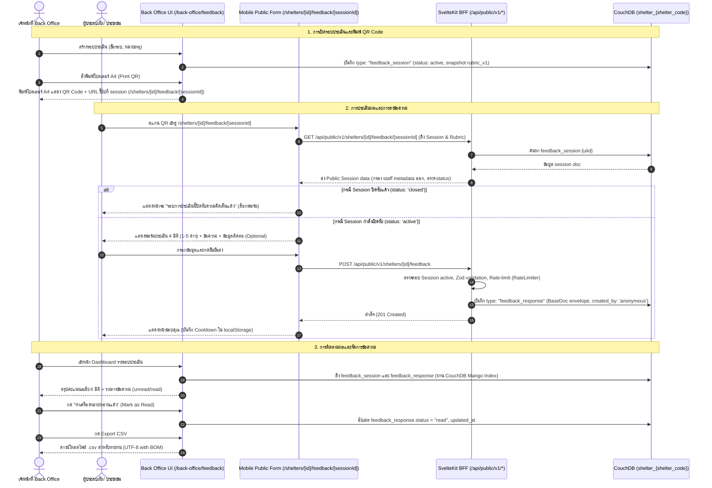

# Feature Specification: Shelter Feedback & Rubric Assessment System

> **BLUF (สรุปภาพรวม):**  
> เพิ่มระบบประเมินความพึงพอใจศูนย์พักพิงและส่งข้อความถึงเจ้าหน้าที่ประจำศูนย์ผ่านการสแกน QR Code (One QR per Session) · เพื่อให้ผู้ประสบภัยสะท้อนปัญหา/ความต้องการได้สะดวกรวดเร็ว และเจ้าหน้าที่ศูนย์ติดตามประเมินผลได้ทันท่วงที · ทีม dev ต้องพัฒนาฟังก์ชันสร้าง Session + พิมพ์โปสเตอร์ A4 QR Code ใน Back Office (`/back-office/feedback`), หน้า Public Form สำหรับมือถือ (Anonymous by default, `/shelters/[id]/feedback/[sessionId]`), BFF endpoints สำหรับดึงและบันทึกข้อมูล (`/api/public/v1/shelters/[id]/feedback`), และแดชบอร์ดสรุปผลพร้อมระบบจัดการข้อความ · กระทบ CouchDB schema เพิ่ม `type: "feedback_session"` และ `type: "feedback_response"` ในฐานข้อมูลรายศูนย์ (`shelter_{shelter_code}`), ต้องเพิ่ม doc types ใน whitelist ของ `buildValidateDocUpdate()` (`frontend/src/lib/server/shelter-access-design.ts`), และ redeploy `_design/access` บนฐานข้อมูลศูนย์.

---

## 1. ข้อมูลเอกสารและการควบคุมการเปลี่ยนแปลง (Document Control)

| รายการ              | รายละเอียด                                                                                                                                                                   |
| ------------------- | ---------------------------------------------------------------------------------------------------------------------------------------------------------------------------- |
| **Status**          | Draft for Review                                                                                                                                                             |
| **Author**          | Soravit Sukkarn                                                                                                                                                              |
| **Created**         | 2026-09-12                                                                                                                                                                   |
| **Updated**         | 2026-09-15                                                                                                                                                                   |
| **Classification**  | Volatile Feature Spec                                                                                                                                                        |
| **Authority / SoT** | **Single Source of Truth (SoT)** สำหรับ Functional Requirements (FR), Non-Functional Requirements (NFR), Acceptance Criteria (AC), Definition of Done (DoD) และ API Contract |
| **Related CR**      | [`docs/changes/draft-shelter-feedback-system.md`](../changes/draft-shelter-feedback-system.md) (สถานะ: proposed)                                                             |
| **Target Audience** | Frontend & Fullstack Developers, QA Engineers, UX/UI Designers                                                                                                               |

---

## 2. ที่มาและความต้องการทางธุรกิจ (Why & Context)

1. **ปัญหาหน้างาน:** ในสถานการณ์ภัยพิบัติ ผู้ประสบภัยในศูนย์พักพิงมักประสบปัญหาเฉพาะหน้า (เช่น สุขอนามัยในห้องน้ำ, อาหารไม่เพียงพอ, ความปลอดภัย, หรือต้องการความช่วยเหลือเร่งด่วน) แต่ไม่สะดวกแจ้งเจ้าหน้าที่โดยตรง หรือเกรงใจไม่กล้าสะท้อนความจริง
2. **ความต้องการของฝ่ายบริหาร:** ต้องการตัวชี้วัดความพึงพอใจเชิงปริมาณ (Rubric Score 1-5 ดาว) ใน 4 มิติมาตรฐานตามเกณฑ์การบริหารจัดการศูนย์พักพิง และช่องทางรับฟังความคิดเห็นเชิงคุณภาพ (Qualitative Feedback) เพื่อนำไปปรับปรุงการบริการรายวัน และส่งออกข้อมูลสรุป (Excel/CSV) ให้หน่วยงานส่วนกลาง (ปภ./จังหวัด) ได้ทันที

---

## 3. สถาปัตยกรรมและกระแสข้อมูล (Architecture & Data Flow)

ระบบใช้โครงสร้าง **Remote-First CouchDB** ร่วมกับ **SvelteKit BFF (Backend-for-Frontend)** สอดคล้องกับมาตรฐาน SmartShelter ดังนี้:



---

## 4. โครงสร้างข้อมูล (Data Contract & Schemas)

เอกสารทั้งสองประเภทจัดเก็บอยู่ในฐานข้อมูลรายศูนย์ (`shelter_{shelter_code}` เช่น `shelter_SH001`) และต้องปฏิบัติตาม `BaseDoc` Envelope ของระบบ (`docs/data/schema.md` §0):

### 4.1 `FeedbackSessionDoc` (`type: "feedback_session"`)

```typescript
export interface FeedbackRubricDimension {
  id: string; // เช่น "cleanliness", "food", "safety", "staff_service"
  title: string; // ภาษาไทย เช่น "ความสะอาดและสุขอนามัย"
  description: string; // คำอธิบายขอบเขต เช่น "ห้องน้ำ ที่ทิ้งขยะ พื้นที่ส่วนกลาง"
  min_score: number; // ค่าต่ำสุด (default: 1)
  max_score: number; // ค่าสูงสุด (default: 5)
  weight?: number; // ค่าน้ำหนักในการคำนวณคะแนนรวม (default: 1.0)
}

export interface FeedbackSessionDoc {
  _id: string; // feedback_session:{ulid}
  _rev?: string;
  type: "feedback_session";
  schema_v: 1;
  shelter_code: string; // รหัสศูนย์ เช่น "SH001" (ตาม BaseDoc envelope)
  title: string; // เช่น "การประเมินสัปดาห์ที่ 1 (รอบน้ำหลาก)"
  description?: string; // รายละเอียดเพิ่มเติมหรือบันทึกภายใน
  status: "active" | "closed";
  rubric_version: "rubric_v1";
  rubric_snapshot: {
    version: "rubric_v1";
    dimensions: FeedbackRubricDimension[];
  };
  created_at: string; // ISO 8601 UTC
  updated_at: string; // ISO 8601 UTC (อัปเดตเมื่อปิดรอบ closed)
  created_by: string; // username ของเจ้าหน้าที่ผู้สร้าง
  closed_at?: string | null;
  closed_by?: string | null;
}
```

### 4.2 `FeedbackResponseDoc` (`type: "feedback_response"`)

```typescript
export interface FeedbackResponseDoc {
  _id: string; // feedback_response:{ulid}
  _rev?: string;
  type: "feedback_response";
  schema_v: 1;
  shelter_code: string; // รหัสศูนย์พักพิง เช่น "SH001" (ตาม BaseDoc envelope)
  session_id: string; // อ้างอิง _id ของ FeedbackSessionDoc (feedback_session:{ulid})
  scores: Record<string, number>; // เช่น { cleanliness: 4, food: 5, safety: 3, staff_service: 5 }
  overall_score: number; // ค่าเฉลี่ยคำนวณระดับแถว ปัดเศษ 2 ตำแหน่ง (เช่น 4.25)
  comment?: string; // ข้อความถึงเจ้าหน้าที่ (ไม่เกิน 1,000 ตัวอักษร)
  contact_info?: string; // ข้อมูลติดต่อกลับ (เช่น "เตียง A12" หรือ "081-xxx-xxxx")
  status: "unread" | "read";
  reviewed_by?: string | null;
  reviewed_at?: string | null;
  client_meta?: {
    user_agent_short?: string;
    submitted_ip_hash?: string; // SHA-256 ของ IP เพื่อวิเคราะห์สแปมโดยไม่เก็บ IP ดิบ
  };
  created_at: string; // ISO 8601 UTC
  updated_at: string; // ISO 8601 UTC (อัปเดตเมื่อเจ้าหน้าที่ทำเครื่องหมายว่าอ่านแล้ว)
  created_by: string; // ค่า "anonymous" ที่ BFF เติมให้ตาม BaseDoc envelope
}
```

### 4.3 ชุดมิติการประเมินมาตรฐาน (`rubric_v1` Template Snapshot)

```json
{
  "version": "rubric_v1",
  "dimensions": [
    {
      "id": "cleanliness",
      "title": "ความสะอาดและสุขอนามัย",
      "description": "ความสะอาดของห้องน้ำ จุดทิ้งขยะ และพื้นที่พักอาศัยส่วนกลาง",
      "min_score": 1,
      "max_score": 5
    },
    {
      "id": "food",
      "title": "อาหารและน้ำดื่ม",
      "description": "ปริมาณ ความสะอาด ความตรงต่อเวลา และความเพียงพอของน้ำดื่ม",
      "min_score": 1,
      "max_score": 5
    },
    {
      "id": "safety",
      "title": "ความปลอดภัยและความเป็นอยู่",
      "description": "แสงสว่าง ความเป็นส่วนตัว การดูแลสิ่งของ และความสงบเรียบร้อย",
      "min_score": 1,
      "max_score": 5
    },
    {
      "id": "staff_service",
      "title": "การดูแลและบริการของเจ้าหน้าที่",
      "description": "การประสานงาน ให้ข้อมูลช่วยเหลือ ความสุภาพ และความใส่ใจ",
      "min_score": 1,
      "max_score": 5
    }
  ]
}
```

### 4.4 สูตรการคำนวณคะแนนเฉลี่ย (`overall_score`) และการปัดเศษ (Score Calculation & Decimal Precision)

เพื่อให้การคำนวณคะแนนสอดคล้องกันทั้งใน Domain Model, BFF และ UI:

1. **การคำนวณคะแนนระดับบุคคล (Per-Response `overall_score`):**
   - คำนวณจากคะแนนที่ตอบในแต่ละมิติ ถ่วงน้ำหนักด้วย `weight` ที่กำหนดใน `FeedbackRubricDimension` (หากไม่ระบุ `weight` ให้ถือว่า $w_i = 1.0$):
     $$\text{weighted\_sum} = \sum_{i=1}^{n} (\text{scores}[d_i] \times w_i)$$
     $$\text{total\_weight} = \sum_{i=1}^{n} w_i$$
     $$\text{overall\_score} = \frac{\text{weighted\_sum}}{\text{total\_weight}}$$
   - **การปัดเศษทศนิยม (Rounding Rule):** ปัดเศษทศนิยม 2 ตำแหน่งตามหลักคณิตศาสตร์มาตรฐาน (Half-up / Standard Rounding):
     ```typescript
     const overallScore =
       totalWeight > 0
         ? Math.round((weightedSum / totalWeight) * 100) / 100
         : 0;
     ```
2. **การคำนวณคะแนนสรุปบนแดชบอร์ด (Session-Level Aggregation):**
   - **กรณีมีข้อมูลคำตอบ (`total_responses > 0`):**
     - **คะแนนเฉลี่ยรวมของ Session (Session Overall Score):** ค่าเฉลี่ยเลขคณิตของ `overall_score` จากทุก response ในรอบนั้น ๆ ปัดเศษทศนิยม 2 ตำแหน่ง
     - **คะแนนเฉลี่ยรายมิติ (Dimension Average Score):** ค่าเฉลี่ยเลขคณิตของคะแนนในแต่ละมิติ แสดงผลบน Progress Bar ปัดเศษทศนิยม 1 ตำแหน่งสำหรับ UI (และ 2 ตำแหน่งเมื่อ Hover / ใน Tooltip) พร้อมคลาส `tabular-nums`
   - **กรณีไม่มีข้อมูลคำตอบ (`total_responses === 0` - Empty State Rule):**
     - ใน Data Model / Aggregate Response ให้กำหนดค่าคะแนนเฉลี่ยเป็น `null` (`overall_average: null`, รายมิติ `average: null`) **ห้ามกำหนดค่าเป็น `0` หรือ `0.00`** เพื่อป้องกันความผิดพลาดทางสถิติและป้องกันไม่ให้ระบบภายนอกหรือ UI เข้าใจผิดว่าเป็นคะแนนต่ำสุด (0 ดาว)
     - UI จะนำค่า `null` ไปแสดงผลเป็นสถานะ Empty State (`"—"` หรือ `"ยังไม่มีการประเมิน"`) ตามข้อกำหนดใน §5.1 (FR-FB-04)

### 4.5 การออกแบบดัชนีและการสืบค้น CouchDB (CouchDB Index & Query Design)

เพื่อป้องกันปัญหา Full Database Scan ในฐานข้อมูล `shelter_{shelter_code}` กำหนดให้สร้าง Mango Indexes (หรือ Map/Reduce Views) ดังนี้:

1. **Index สำหรับค้นหารอบประเมิน (`idx_feedback_sessions`):**
   - **Fields:** `["type", "created_at"]`
   - **Design Document Name:** `_design/idx_feedback_sessions`
   - **จุดประสงค์:** ค้นหารายการ session ในศูนย์พักพิง เรียงลำดับจากล่าสุดไปเก่าสุด:
     ```json
     {
       "selector": {
         "type": "feedback_session"
       },
       "sort": [{ "type": "desc" }, { "created_at": "desc" }]
     }
     ```
2. **Index สำหรับค้นหาผลการประเมินรายรอบ (`idx_feedback_responses_by_session`):**
   - **Fields:** `["type", "session_id", "created_at"]`
   - **Design Document Name:** `_design/idx_feedback_responses_by_session`
   - **จุดประสงค์:** ดึงรายการคำตอบทั้งหมดของ `session_id` นั้น ๆ สำหรับนำมา Aggregate และแสดงรายการข้อความ Feed:
     ```json
     {
       "selector": {
         "type": "feedback_response",
         "session_id": "feedback_session:01JABCD..."
       },
       "sort": [
         { "type": "desc" },
         { "session_id": "desc" },
         { "created_at": "desc" }
       ]
     }
     ```

### 4.6 การควบคุมความถูกต้องและการอนุญาตบันทึกใน CouchDB (CouchDB Whitelist & `_design/access`)

เพื่อรักษาความมั่นคงปลอดภัยและความถูกต้องของข้อมูลตามสถาปัตยกรรม Remote-First ฐานข้อมูลรายศูนย์ (`shelter_{shelter_code}`) ทุกแห่งจะมี `_design/access` ทำหน้าที่รันฟังก์ชัน `validate_doc_update` เพื่อตรวจสอบความถูกต้องของเอกสารก่อนยินยอมให้บันทึก:

1. **การเพิ่ม Allowed Types ใน `shelter-access-design.ts`:**
   - ในฟังก์ชัน `buildValidateDocUpdate()` ที่ไฟล์ [`frontend/src/lib/server/shelter-access-design.ts`](../../frontend/src/lib/server/shelter-access-design.ts) จะต้องเพิ่ม `"feedback_session"` และ `"feedback_response"` เข้าไปในรายการอาร์เรย์ `allowed` types:
     ```typescript
     var allowed = [
       "evacuee",
       "household",
       "medical",
       "screening",
       "movement",
       "image",
       "people_import_log",
       "donation",
       "donation_campaign",
       "stock_ledger",
       "donation_slot",
       "donation_redirect",
       "audit",
       "daily_calc",
       "simulation",
       "purchase",
       "referral",
       "meal_plan",
       "kitchen_requisition",
       "meal_service",
       "gas_cylinder_type",
       "gas_ledger",
       "item_category",
       "item_master",
       "recipe",
       "requirement_group",
       "food_sphere_standard",
       "replenishment_policy",
       "sop_override",
       "distribution_request",
       "distribution_batch",
       "stock_lot_reservation",
       "distribution_issue",
       "distribution_issue_idempotency",
       "distribution_issue_capacity",
       "distribution_one_time_guard",
       "distribution_issue_gate",
       "daily_sop_assessment",
       "feedback_session",
       "feedback_response", // CR: Shelter Feedback System
     ];
     ```
2. **ผลกระทบสำคัญและสาเหตุที่ต้องระบุในแผน (Critical Impact):**
   - หากไม่มีการเพิ่ม doc types ดังกล่าวในรายการ `allowed` types ฟังก์ชัน `validate_doc_update` จะปฏิเสธการบันทึกด้วยการ throw:
     ```javascript
     throw { forbidden: "doc type not allowed yet: " + newDoc.type };
     ```
     ส่งผลให้ CouchDB ตอบกลับด้วย **HTTP 403 Forbidden** ทันทีเมื่อมีการบันทึกผ่านเซสชันของเจ้าหน้าที่ทั่วไป (Non-admin) หรือการเขียนผ่าน Public write proxy
3. **การ Redeploy Design Document (`_design/access`):**
   - สำหรับฐานข้อมูลศูนย์เดิม (`shelter_*`) ที่มีอยู่ในระบบแล้ว จะต้องสั่งรันสคริปต์ redeploy design doc:
     ```bash
     pnpm redeploy:access --write --confirm
     ```
   - สำหรับศูนย์ใหม่ที่ถูกสร้างขึ้น (Provisioning ผ่าน `POST /api/back-office/shelter`) หรือการ Seed (`pnpm seed`) จะได้รับ design doc ฉบับล่าสุดที่มี whitelist นี้โดยอัตโนมัติ
4. **ชุดทดสอบเพื่อป้องกัน Regression:**
   - ต้องเพิ่ม Test cases ใน [`frontend/src/lib/server/shelter-access-design.test.ts`](../../frontend/src/lib/server/shelter-access-design.test.ts) ยืนยันว่าเอกสาร `feedback_session` และ `feedback_response` ที่มีโครงสร้างตาม `BaseDoc` envelope สามารถผ่าน `validate_doc_update` ได้สำเร็จโดยไม่ติด HTTP 403

---

## 5. ฟังก์ชันการทำงานและข้อกำหนดทางเทคนิค (Functional Requirements)

### 5.1 ระบบฝั่งเจ้าหน้าที่ (Back Office)

โมดูล Back Office ถูกติดตั้งไว้ที่ `frontend/src/routes/(protected)/back-office/feedback` โดยเชื่อมโยงศูนย์พักพิงที่กำลังทำงานอยู่ผ่าน `shelterStore` (`$lib/stores/shelter.svelte`) ส่วนกลางของระบบ:

- **FR-FB-01 [Session Creation]:** เจ้าหน้าที่ระดับ Staff/Admin ของศูนย์ สามารถสร้าง Session ใหม่ได้ โดยระบุ:
  - ชื่อรอบการประเมิน (Title) — บังคับ
  - คำอธิบาย / หมายเหตุ (Description) — ไม่บังคับ
  - ระบบจะบันทึก `rubric_snapshot` เป็น `rubric_v1` และตั้งสถานะเริ่มต้นเป็น `active`
- **FR-FB-02 [Session Lifecycle Management]:**
  - เจ้าหน้าที่สามารถกด **"ปิดรับการประเมิน" (Close Session)** เมื่อหมดรอบการประเมิน
  - ระบบจะบันทึก `closed_at`, `closed_by` และอัปเดต `updated_at`
  - หาก Session ปิดแล้ว ผู้ที่สแกน QR Code จะเห็นหน้าจอแจ้งเตือนว่า _"รอบการประเมินนี้ปิดรับความคิดเห็นแล้ว"_ และไม่อนุญาตให้ Submit ข้อมูล
- **FR-FB-03 [Printable A4 QR Poster]:**
  - ระบบต้องมีปุ่ม "พิมพ์โปสเตอร์ QR Code" (Print Poster) ในหน้า Session
  - แสดง Modal พรีวิวเอกสารขนาด A4 ที่จัด Layout สำหรับการพิมพ์โดยเฉพาะ (`@media print`):
    - หัวกระดาษ: โลโก้ SmartShelter + ชื่อศูนย์พักพิงขนาดใหญ่
    - ชื่อรอบการประเมินและวันที่
    - ภาพ QR Code คมชัดสูง (SVG หรือ High-DPI Canvas) ขนาดไม่ต่ำกว่า 15x15 cm กึ่งกลางหน้ากระดาษ เข้ารหัสเป็น Absolute URL เต็มรูปแบบ (เช่น `${origin}/shelters/[id]/feedback/[sessionId]` โดยดึง origin จาก `$page.url.origin` หรือ config) เพื่อให้แอปกล้องมือถือสแกนแล้วเปิดเบราว์เซอร์ได้ทันที
    - ข้อความแนะนำภาษาไทยขนาดใหญ่: _"สแกน QR Code ด้วยกล้องมือถือ เพื่อประเมินความพึงพอใจและส่งข้อความถึงเจ้าหน้าที่"_
    - Short URL แบบอ่านง่ายด้านล่าง QR Code (สำรองกรณีกล้องสแกนไม่ได้)
    - รองรับการสั่งพิมพ์ผ่าน Browser Print Dialog (`window.print()`)
- **FR-FB-04 [Analytics Dashboard & Empty State]:**
  - แสดงสถิติภาพรวมของ Session:
    - จำนวนผู้ตอบแบบประเมินทั้งหมด (Total Responses, ตัวเลขพร้อมคลาส `tabular-nums`)
    - คะแนนเฉลี่ยภาพรวม (Overall Average Score, เต็ม 5.0) คำนวณแบบถ่วงน้ำหนักตาม §4.4
    - แถบคะแนนเฉลี่ยแยกตาม 4 มิติ (Progress bar พร้อมตัวเลขเฉลี่ยทศนิยม 1 ตำแหน่ง ใช้คลาส `tabular-nums`)
    - กราฟหรือตารางแจกแจงระดับคะแนน (1 ถึง 5 ดาว)
  - **ข้อกำหนด Empty State (เมื่อ `total_responses === 0`):**
    - ในกรณีที่เพิ่งสร้าง Session และยังไม่มีผู้ส่งคำตอบ ระบบต้อง**ไม่แสดงคะแนนเป็น `0.00` หรือ `0.0`** (เนื่องจากเกณฑ์ Rubric มีสเกล 1–5 ดาว การแสดง 0.00 จะทำให้เกิดความเข้าใจผิดว่าศูนย์ได้คะแนนแย่มากหรือประเมินตกเกณฑ์)
    - **การ์ดคะแนนเฉลี่ยภาพรวม (Overall Score Card):** แสดงค่าเป็นเครื่องหมายยัติภังค์ยาว `—` (Em dash) พร้อม Badge หรือข้อความกำกับสถานะ _"ยังไม่มีการประเมิน"_ (No evaluations yet) โดยใช้สไตล์สี Neutral/Muted ตาม Civic Light Design System
    - **แถบคะแนนราย 4 มิติ (Dimension Progress Bars):** แถบ Progress bar แสดงค่า 0% (แถบสีเทา Neutral) และช่องตัวเลขแสดง `—` (Em dash)
    - **ส่วนแจกแจงระดับคะแนน (Score Distribution):** แสดงกล่องข้อความชี้แจงสถานะ พร้อมคำแนะนำและทางลัด Action เช่น _"ยังไม่มีข้อมูลการประเมินในรอบนี้ — พิมพ์โปสเตอร์ QR Code เพื่อเริ่มเปิดรับฟังความคิดเห็น"_ พร้อมปุ่มลัดพิมพ์โปสเตอร์ (Print Poster)
- **FR-FB-05 [Feedback Messages Feed & Triage]:**
  - แสดงรายการข้อความที่ผู้ประสบภัยส่งเข้ามา เรียงลำดับจากล่าสุดไปเก่าสุด
  - แสดงข้อมูล: วัน-เวลา, คะแนนที่ให้แต่ละมิติ, ข้อความแสดงความคิดเห็น, ข้อมูลติดต่อกลับ (ถ้ามี)
  - มี Badge แสดงสถานะ: `ยังไม่อ่าน` (Unread - สีเตือนเด่นชัด) และ `อ่านแล้ว` (Read)
  - เจ้าหน้าที่สามารถคลิกปุ่ม **"ทำเครื่องหมายว่าอ่านแล้ว" (Mark as Read)** เพื่อเปลี่ยนสถานะข้อความ (บันทึก `reviewed_by`, `reviewed_at` และ `updated_at`)
  - **Empty State:** ในกรณีที่ไม่มีข้อความส่งเข้ามา แสดง Empty State Card พร้อมข้อความ _"ยังไม่มีข้อความข้อเสนอแนะในรอบนี้"_ อย่างชัดเจน สะอาดตา ไม่ปล่อยให้เป็นพื้นที่ว่างเปล่า
- **FR-FB-06 [Data Export]:**
  - มีปุ่ม "ส่งออกข้อมูล (Export CSV/Excel)" สำหรับ Session นั้นๆ
  - ไฟล์ที่ดาวน์โหลดประกอบด้วยคอลัมน์: รหัสรายการ, วันเวลาที่ส่ง, คะแนนทั้ง 4 มิติ, คะแนนเฉลี่ย, ข้อความ, ข้อมูลติดต่อ, สถานะการเปิดอ่าน
  - ข้อมูลข้อความรองรับ UTF-8 (มี BOM) เพื่อให้อ่านภาษาไทยใน Microsoft Excel ได้ถูกต้องโดยไม่เป็นภาษาต่างดาว พร้อมทั้ง Sanitize ป้องกัน Formula Injection (หากข้อความขึ้นต้นด้วย `=`, `+`, `-`, `@` ให้เติม single quote `'` นำหน้า)
  - **มาตรฐานชื่อไฟล์ (File Naming Convention):** กำหนดชื่อไฟล์ใน Header `Content-Disposition: attachment; filename="feedback-{shelter_code}-{cleanSessionId}-{YYYYMMDD}.csv"` (โดย `{cleanSessionId}` ตัด prefix `feedback_session:` ออก และ `{YYYYMMDD}` คือวันที่ดาวน์โหลดตามเวลาท้องถิ่น) เพื่อความเป็นระเบียบในการจัดเก็บไฟล์ของเจ้าหน้าที่

---

### 5.2 ระบบฝั่งผู้ประสบภัย (Public Mobile Web Form)

- **FR-FB-10 [Public Access via URL & Session ID Normalization]:**
  - เส้นทาง URL: `/shelters/[id]/feedback/[sessionId]` (ใช้พารามิเตอร์ `[id]` สอดคล้องกับ Public Routes เดิม เพื่อป้องกัน Route Parameter Collision ใน SvelteKit)
  - รองรับการเปิดผ่าน Mobile Browser ทุกค่าย (Chrome, Safari, LINE In-App Browser) โดยไม่ต้องล็อกอิน
  - **Session ID Normalization:** ทั้งใน Page Load (`+page.ts` / `+page.server.ts`) ของหน้าสาธารณะและใน BFF ต้องรองรับทั้งรูปแบบรหัส ULID เปล่า (`01JABCD...`) และรูปแบบที่มี Prefix (`feedback_session:01JABCD...`) โดยทำการ Normalize อัตโนมัติ (เติม prefix หากไม่มี) เพื่อความยืดหยุ่นในกรณีที่ QR Code หรือ Short Link ถูกตัดทอน Prefix ออก
- **FR-FB-11 [Form Layout & UX — Civic Light Design System]:**
  - ออกแบบตาม **Civic Light Design System** (โทนสีสว่าง สะอาด ฟอนต์ `IBM Plex Sans Thai` สบายตา เข้าถึงได้ง่าย)
  - หัวกระดาษแสดงชื่อศูนย์พักพิงและชื่อรอบประเมิน
  - ส่วนที่ 1: Rubric 4 มิติ — การให้คะแนนแบบ 5 ดาว หรือปุ่มกดตัวเลข 1-5 โดยมี **Touch Target ขนาดไม่น้อยกว่า 44x44px** เพื่อความสะดวกและแม่นยำบนหน้าจอมือถือตามเกณฑ์ Accessibility และใช้คลาส `tabular-nums` แสดงตัวเลขคะแนน ทุกมิติต้องตอบ (Required)
  - ส่วนที่ 2: กล่องข้อความ "ข้อเสนอแนะหรือข้อความฝากถึงเจ้าหน้าที่" (Optional, TextArea สูงพอประมาณ, ตัวนับตัวอักษร 0/1,000)
  - ส่วนที่ 3: ช่องกรอก "ข้อมูลติดต่อกลับ (โซน/เตียง หรือเบอร์โทร)" (Optional, พร้อมคำอธิบาย: _ไม่ระบุก็ได้ แต่หากต้องการให้เจ้าหน้าที่ติดตามช่วยเหลือ กรุณาระบุ_)
- **FR-FB-12 [Validation & Feedback Submission]:**
  - ตรวจสอบความถูกต้องก่อนส่ง (ทุกมิติต้องมีคะแนนระหว่าง 1-5)
  - ส่งข้อมูลไปยัง BFF Endpoint `POST /api/public/v1/shelters/[id]/feedback`
- **FR-FB-13 [Success Screen & Cooldown]:**
  - หลังส่งสำเร็จ แสดงหน้าจอขอบคุณและไอคอนยืนยันชัดเจน
  - บันทึก Cooldown ใน Browser `localStorage` โดยใช้คีย์เฉพาะของรอบประเมิน (`feedback_cooldown:${sessionId}` ระยะเวลา 10 นาที) และปิดการใช้งานปุ่มส่ง เพื่อป้องกันการกดส่งซ้ำซ้อน

---

## 6. ข้อกำหนดด้านความมั่นคงปลอดภัยและประสิทธิภาพ (NFR & Security)

- **NFR-FB-01 [Anonymous Data Privacy]:**
  - ฟอร์มประเมินเป็นระบบนิรนามโดยกำเนิด (Anonymous by default)
  - ไม่เก็บ Cookie ระบุตัวตน ไม่เก็บประวัติส่วนบุคคล เว้นแต่ผู้ใช้งานจะเลือกกรอกในช่องติดต่อกลับเอง
  - IP Address ของผู้ส่งจะถูกแฮชเป็น `submitted_ip_hash` (One-way SHA-256 hash) สำหรับระบบ Anti-spam เท่านั้น ไม่เก็บ Raw IP ในฐานข้อมูล CouchDB
- **NFR-FB-02 [Anti-Spam & Rate Limiting]:**
  - นำ singleton `RateLimiter` ที่มีอยู่แล้วในระบบ (`frontend/src/lib/server/security/rate-limiter.ts`) มาใช้งาน:
    ```typescript
    export const feedbackIpLimiter = new RateLimiter(600000, 5); // 5 reqs / 10 min
    ```
  - ตรวจสอบ IP ผ่าน `event.getClientAddress()` ของ SvelteKit ใน BFF Endpoint
  - หากส่งเกิน 5 ครั้งใน 10 นาที ปฏิเสธ Request ด้วย HTTP 429 Too Many Requests
- **NFR-FB-03 [Role-Based Access Control (RBAC)]:**
  - สิทธิ์ในการสร้าง Session, ปิด Session, ดู Dashboard, และ Mark as Read สงวนไว้เฉพาะเจ้าหน้าที่ที่มีบทบาท:
    - `system_admin` (SA)
    - `shelter_manager` (SM)
    - `registration_staff` (RS) / เจ้าหน้าที่ประจำศูนย์นั้นๆ
  - การเข้าถึงข้ามศูนย์พักพิงต้องเป็นไปตาม Shelter Scope Isolation ที่กำหนดในระบบ
- **NFR-FB-04 [Mobile Responsiveness & Offline Graceful Degradation]:**
  - หน้า Public Form มีขนาด Payload รวมไม่เกิน 150 KB
  - หากสัญญาณอินเทอร์เน็ตขาดหายขณะกดส่ง ระบบต้องแจ้งเตือนข้อผิดพลาดชัดเจน และเก็บข้อมูลที่กรอกค้างไว้ในฟอร์ม ไม่ล้างข้อมูลทิ้ง
- **NFR-FB-05 [CouchDB Write Guard & Whitelist Enforcement]:**
  - เอกสาร `feedback_session` และ `feedback_response` ต้องผ่านการตรวจสอบความถูกต้องโดยฟังก์ชัน `validate_doc_update` ใน `_design/access` ของ CouchDB ประจำศูนย์
  - ฝั่งเซิร์ฟเวอร์ต้องคงความปลอดภัยด้วยการไม่อนุญาตให้แก้ไขข้ามศูนย์ (`newDoc.shelter_code === '${code}'`) และต้องมี `BaseDoc` envelope ครบถ้วน
  - Whitelist ใน `shelter-access-design.ts` ต้องรวมทั้ง 2 doc types และต้อง deploy `_design/access` บน CouchDB รายศูนย์ มิฉะนั้นการเขียนเอกสารจะถูกบล็อกด้วย HTTP 403

---

## 7. ข้อกำหนดของ API และการเชื่อมต่อ (API Contract)

### 7.1 `GET /api/public/v1/shelters/[id]/feedback/[sessionId]`

Endpoint บน SvelteKit BFF สำหรับโหลดข้อมูล Session และ Rubric Snapshot สำหรับเรนเดอร์ Public Mobile Form

- **Path Parameters:**
  - `id`: string — รหัสประจำศูนย์พักพิง (Shelter ID / Code เช่น `SH001`)
  - `sessionId`: string — รหัสรอบการประเมิน (รองรับทั้งรูปแบบรหัส ULID เปล่า เช่น `01JABCD...` และรูปแบบที่มี Prefix เช่น `feedback_session:01JABCD...`)
- **Parameter Normalization & Scope Check:**
  - BFF ทำการ Normalize `params.sessionId` ให้เป็นรูปแบบ `feedback_session:{ulid}` เสมอก่อนดึงข้อมูลจาก CouchDB (`shelter_{shelter_code}`) เพื่อความยืดหยุ่นในกรณีที่ URL หรือ Short Link ถูกตัดทอน Prefix
  - ตรวจสอบ Shelter Scope Isolation: assert ว่า `session.shelter_code === id` หากไม่พบหรือไม่ตรงศูนย์ ให้ตอบกลับ `404 Not Found (SESSION_NOT_FOUND)`
- **Data Privacy & Sanitization:**
  - BFF ทำการกรองข้อมูลที่ไม่จำเป็นสำหรับสาธารณะออก (ตัด `created_by`, `updated_at`, `closed_by`, internal notes ทิ้ง)
- **Responses:**
  - `200 OK` (กรณี Session กำลังเปิดรับ `status: "active"`):
    ```json
    {
      "success": true,
      "session": {
        "sessionId": "feedback_session:01JABCD...",
        "shelterCode": "SH001",
        "title": "การประเมินสัปดาห์ที่ 1 (รอบน้ำหลาก)",
        "status": "active",
        "rubricSnapshot": {
          "version": "rubric_v1",
          "dimensions": [
            {
              "id": "cleanliness",
              "title": "ความสะอาดและสุขอนามัย",
              "description": "ความสะอาดของห้องน้ำ จุดทิ้งขยะ และพื้นที่พักอาศัยส่วนกลาง",
              "minScore": 1,
              "maxScore": 5,
              "weight": 1.0
            },
            {
              "id": "food",
              "title": "อาหารและน้ำดื่ม",
              "description": "ปริมาณ ความสะอาด ความตรงต่อเวลา และความเพียงพอของน้ำดื่ม",
              "minScore": 1,
              "maxScore": 5,
              "weight": 1.0
            },
            {
              "id": "safety",
              "title": "ความปลอดภัยและความเป็นอยู่",
              "description": "แสงสว่าง ความเป็นส่วนตัว การดูแลสิ่งของ และความสงบเรียบร้อย",
              "minScore": 1,
              "maxScore": 5,
              "weight": 1.0
            },
            {
              "id": "staff_service",
              "title": "การดูแลและบริการของเจ้าหน้าที่",
              "description": "การประสานงาน ให้ข้อมูลช่วยเหลือ ความสุภาพ และความใส่ใจ",
              "minScore": 1,
              "maxScore": 5,
              "weight": 1.0
            }
          ]
        }
      }
    }
    ```
  - `200 OK` (กรณี Session ถูกปิดแล้ว `status: "closed"`):
    ```json
    {
      "success": true,
      "session": {
        "sessionId": "feedback_session:01JABCD...",
        "shelterCode": "SH001",
        "title": "การประเมินสัปดาห์ที่ 1 (รอบน้ำหลาก)",
        "status": "closed"
      }
    }
    ```
    _(หมายเหตุ: UI ฝั่ง Client จะใช้ `status: "closed"` เพื่อแสดงหน้าแจ้งเตือนว่ารอบประเมินปิดแล้ว และซ่อนฟอร์มการส่ง)_
  - `404 Not Found`:
    ```json
    {
      "success": false,
      "error": "SESSION_NOT_FOUND",
      "message": "ไม่พบรอบการประเมินที่ระบุ หรือรหัสศูนย์พักพิงไม่ถูกต้อง"
    }
    ```
  - `400 Bad Request`:
    ```json
    {
      "success": false,
      "error": "INVALID_PARAMETERS"
    }
    ```

### 7.2 `POST /api/public/v1/shelters/[id]/feedback`

Endpoint บน SvelteKit BFF สำหรับการส่งประเมินจากผู้ใช้งานสาธารณะ (Anonymous)

- **Request Body (JSON — camelCase):**
  ```json
  {
    "sessionId": "feedback_session:01JABCD...",
    "scores": {
      "cleanliness": 5,
      "food": 4,
      "safety": 4,
      "staff_service": 5
    },
    "comment": "ห้องน้ำโซน C สะอาดดีมาก แต่ช่วงค่ำไฟทางเดินมืดไปนิดครับ",
    "contactInfo": "เตียง B-14 โซนครอบครัว"
  }
  ```
- **Validation Rules (Zod):**
  - `sessionId`: string (รูปแบบ `feedback_session:{ulid}` หรือ raw ULID ที่ถูก normalize ก่อน query, ต้องเป็น active session และ `session.shelter_code === id` ป้องกันการส่งข้ามศูนย์ หากไม่ตรงให้ตอบกลับ 404 SESSION_NOT_FOUND)
  - `scores`: object key ตาม rubric snapshot, value เป็น integer ระหว่าง 1 - 5
  - `comment`: optional string, max 1,000 chars, sanitize HTML/Script tags
  - `contactInfo`: optional string, max 100 chars, sanitize HTML/Script tags
- **Responses:**
  - `201 Created`: `{ "success": true, "responseId": "feedback_response:..." }`
  - `400 Bad Request`: `{ "success": false, "error": "INVALID_INPUT", "details": ... }`
  - `404 Not Found`: `{ "success": false, "error": "SESSION_NOT_FOUND", "message": "ไม่พบรอบการประเมิน" }`
  - `409 Conflict`: `{ "success": false, "error": "SESSION_CLOSED", "message": "รอบการประเมินนี้ปิดรับแล้ว" }`
  - `429 Too Many Requests`: `{ "success": false, "error": "RATE_LIMIT_EXCEEDED", "message": "คุณส่งคำตอบเกินจำนวนที่กำหนด กรุณารอสักครู่" }`

### 7.3 หมายเหตุการแปลงชื่อฟิลด์ (Field Mapping Note: camelCase ➔ snake_case)

เพื่อรักษาแบบแผน JSON API มาตรฐาน (camelCase) ฝั่ง Web Client และความสอดคล้องกับ `BaseDoc` (snake_case) ใน CouchDB BFF มีหน้าที่แปลงฟิลด์ดังนี้:

| API Request Body (camelCase) | CouchDB `FeedbackResponseDoc` (snake_case) | หมายเหตุ                                   |
| ---------------------------- | ------------------------------------------ | ------------------------------------------ |
| `sessionId`                  | `session_id`                               | อ้างอิง `_id` ของ Session                  |
| `scores`                     | `scores`                                   | บันทึกตรงกัน                               |
| (คำนวณที่ BFF)               | `overall_score`                            | คำนวณถ่วงน้ำหนักและปัดเศษ 2 ตำแหน่ง (§4.4) |
| `comment`                    | `comment`                                  | Sanitize ตัดแท็กอันตราย                    |
| `contactInfo`                | `contact_info`                             | Sanitize ตัดแท็กอันตราย                    |
| (สร้างโดย BFF)               | `_id`                                      | `feedback_response:{ulid}`                 |
| (สร้างโดย BFF)               | `type`                                     | `"feedback_response"`                      |
| (สร้างโดย BFF)               | `schema_v`                                 | `1`                                        |
| (จาก Route param)            | `shelter_code`                             | รหัสศูนย์ เช่น `"SH001"`                   |
| (สร้างโดย BFF)               | `created_at` / `updated_at`                | ISO 8601 UTC timestamp ปัจจุบัน            |
| (กำหนดโดย BFF)               | `created_by`                               | `"anonymous"` (ตามข้อกำหนด BaseDoc)        |
| (สร้างโดย BFF)               | `status`                                   | `"unread"` (สถานะเริ่มต้น)                 |
| (จาก Request header/IP)      | `client_meta`                              | `{ user_agent_short, submitted_ip_hash }`  |

---

## 8. เกณฑ์การตรวจรับงาน (Acceptance Criteria & DoD)

### 8.1 Acceptance Criteria (AC)

- [ ] **AC-01 (Create Session):** เจ้าหน้าที่ใน Back Office (`/back-office/feedback`) สามารถกดสร้างรอบการประเมินใหม่ ระบุชื่อรอบ และบันทึกลง CouchDB สำเร็จโดยมีสถานะเป็น `active` พร้อม `BaseDoc` envelope ครบถ้วน
- [ ] **AC-02 (Print A4 Poster):** ในหน้า Session สามารถเปิดหน้าต่างพรีวิวโปสเตอร์ A4 และสั่งพิมพ์ผ่าน `window.print()` ได้ โดย QR Code คมชัดและสแกนนำทางไปยัง `/shelters/[id]/feedback/[sessionId]` ได้ถูกต้อง
- [ ] **AC-03 (Public Session Loading & Form):** เมื่อเปิดหน้าฟอร์มสาธารณะ ระบบเรียก `GET /api/public/v1/shelters/[id]/feedback/[sessionId]` และแสดงเกณฑ์ประเมิน 4 มิติตาม Rubric Snapshot ได้ครบถ้วน
- [ ] **AC-04 (Public Feedback Submission):** ผู้ใช้งานสาธารณะสามารถให้คะแนนครบ 4 มิติ กรอกข้อความ และกดยืนยันส่งผ่าน `POST /api/public/v1/shelters/[id]/feedback` ได้รับ HTTP 201 ข้อมูลบันทึกลงฐานข้อมูลศูนย์พร้อมคำนวณ `overall_score` ถูกต้อง
- [ ] **AC-05 (Session Close Enforcement):** เมื่อเจ้าหน้าที่กดปิด Session ใน Back Office แล้ว ผู้ที่เปิดหน้าฟอร์มจะเห็นข้อความแจ้งเตือนว่ารอบนี้ปิดแล้ว และหากมีการส่ง POST เข้ามา BFF จะปฏิเสธด้วย HTTP 409 Conflict
- [ ] **AC-06 (Dashboard Metrics & Empty State):** เมื่อมีผู้ส่งผลประเมิน ข้อมูลสรุปจำนวนคน, คะแนนเฉลี่ยรวม, และคะแนนแยกตาม 4 มิติ ใน Back Office แสดงผลถูกต้องตามการคำนวณถ่วงน้ำหนักและทศนิยมตาม §4.4; ในกรณีที่เพิ่งสร้าง Session และยังไม่มีผู้ตอบ (`total_responses === 0`) ระบบต้องไม่แสดงคะแนนเป็น `0.00` หรือ `0.0` แต่ต้องแสดงสถานะ Empty State เป็น `"—"` (Em dash) พร้อม Badge/ป้าย _"ยังไม่มีการประเมิน"_ เพื่อป้องกันความเข้าใจผิดว่าเป็นคะแนนต่ำวิกฤต
- [ ] **AC-07 (Comments Feed & Mark as Read):** เจ้าหน้าที่สามารถอ่านข้อความที่ฝากไว้ และกดเปลี่ยนสถานะจาก "ยังไม่อ่าน" เป็น "อ่านแล้ว" ได้ โดยระบบจะอัปเดต `status: "read"` และ `updated_at` ใน CouchDB
- [ ] **AC-08 (Anti-Abuse & Rate Limiting):** เมื่อมีการส่งข้อมูลจาก IP เดียวกันเกิน 5 ครั้งภายใน 10 นาที ระบบ BFF จะปฏิเสธด้วย HTTP 429 Too Many Requests
- [ ] **AC-09 (Client Cooldown):** หลังส่งแบบประเมินสำเร็จ หน้าเว็บจะบันทึกสถานะลงใน `localStorage` และล็อกปุ่มส่งเป็นเวลา 10 นาที เพื่อป้องกันการกดส่งซ้ำ
- [ ] **AC-10 (Mobile Accessibility & Touch Target):** ปุ่มตัวเลือกให้คะแนน 1-5 ดาว บนหน้าจอมือถือมีขนาด Touch Target ไม่ต่ำกว่า 44x44px และใช้ฟอนต์ `IBM Plex Sans Thai` พร้อม `tabular-nums` ตาม Civic Light Design System
- [ ] **AC-11 (CSV Export):** สามารถดาวน์โหลดไฟล์ CSV สรุปผลของ Session ได้ ข้อมูลภาษาไทยแสดงผลถูกต้องครบถ้วน (UTF-8 with BOM) และตั้งชื่อไฟล์ตามมาตรฐาน `feedback-{shelter_code}-{cleanSessionId}-{YYYYMMDD}.csv` ใน Header `Content-Disposition`

### 8.2 Definition of Done (DoD)

- [ ] เขียนโค้ดตามสถาปัตยกรรม Remote-First CouchDB และ DDD ตาม `CONVENTIONS.md`
- [ ] เพิ่ม `feedback_session` และ `feedback_response` ใน `allowed` types ของ `buildValidateDocUpdate()` ใน `frontend/src/lib/server/shelter-access-design.ts`
- [ ] มี Unit Tests สำหรับ CouchDB write validation ใน `frontend/src/lib/server/shelter-access-design.test.ts`
- [ ] มี Unit Tests สำหรับ Domain Logic, Overall Score Calculation (§4.4), และ Score Aggregation
- [ ] มี Unit Tests สำหรับ SvelteKit BFF Endpoints:
  - `GET /api/public/v1/shelters/[id]/feedback/[sessionId]` (Happy path, session closed, session not found)
  - `POST /api/public/v1/shelters/[id]/feedback` (Happy path, validation error, session closed, rate limit HTTP 429)
- [ ] ดำเนินการ redeploy `_design/access` บนฐานข้อมูลรายศูนย์ (`pnpm redeploy:access --write --confirm`)
- [ ] ผ่าน `pnpm check` (Type-check 0 errors)
- [ ] ผ่าน `pnpm lint` และ `pnpm format`
- [ ] ตรวจสอบความปลอดภัยตามแนวทาง OWASP (Sanitize text inputs, prevent XSS, rate-limit ผ่าน `RateLimiter`)
- [ ] บันทึกและเสนอ Change Record (CR) เข้าสู่กระบวนการ `docs/change-management.md`
