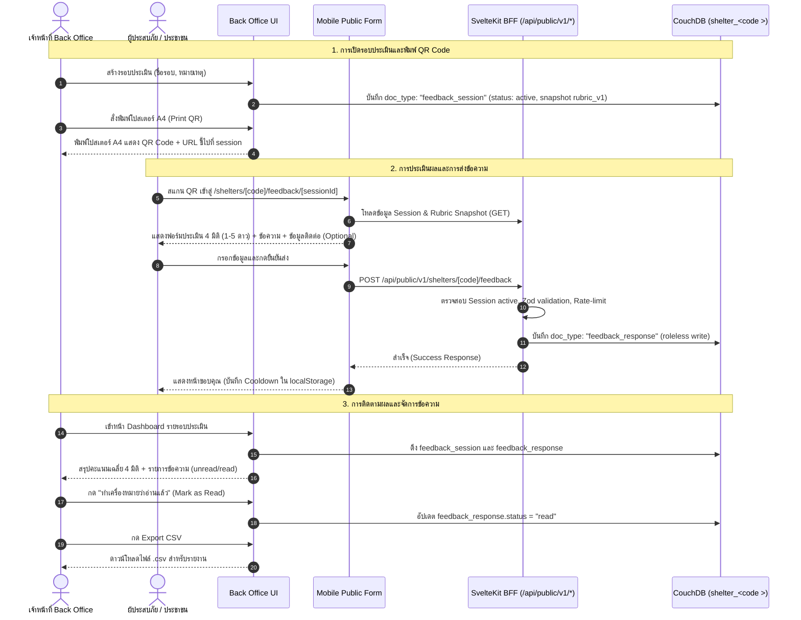

# Feature Specification: Shelter Feedback & Rubric Assessment System

> **BLUF (สรุปภาพรวม):**  
> เพิ่มระบบประเมินความพึงพอใจศูนย์พักพิงและส่งข้อความถึงเจ้าหน้าที่ประจำศูนย์ผ่านการสแกน QR Code (One QR per Session) · เพื่อให้ผู้ประสบภัยสะท้อนปัญหา/ความต้องการได้สะดวกรวดเร็ว และเจ้าหน้าที่ศูนย์ติดตามประเมินผลได้ทันท่วงที · ทีม dev ต้องพัฒนาฟังก์ชันสร้าง Session + พิมพ์โปสเตอร์ A4 QR Code ใน Back Office, หน้า Public Form สำหรับมือถือ (Anonymous by default), BFF endpoint สำหรับบันทึกข้อมูล, และแดชบอร์ดสรุปผลพร้อมระบบจัดการข้อความ · กระทบ CouchDB schema เพิ่ม `doc_type: "feedback_session"` และ `doc_type: "feedback_response"` ในฐานข้อมูลรายศูนย์ (`shelter_<code >`).

---

## 1. ข้อมูลเอกสารและการควบคุมการเปลี่ยนแปลง (Document Control)

| รายการ | รายละเอียด |
| --- | --- |
| **Status** | Draft for Review |
| **Author** | Jk (Project Owner) |
| **Created** | 2026-09-12 |
| **Updated** | 2026-09-12 |
| **Classification** | Volatile Feature Spec |
| **Related CR** | [`docs/changes/draft-shelter-feedback-system.md`](../changes/draft-shelter-feedback-system.md) |
| **Target Audience** | Frontend & Fullstack Developers, QA Engineers, UX/UI Designers |

---

## 2. ที่มาและความต้องการทางธุรกิจ (Why & Context)

1. **ปัญหาหน้างาน:** ในสถานการณ์ภัยพิบัติ ผู้ประสบภัยในศูนย์พักพิงมักประสบปัญหาเฉพาะหน้า (เช่น สุขอนามัยในห้องน้ำ, อาหารไม่เพียงพอ, ความปลอดภัย, หรือต้องการความช่วยเหลือเร่งด่วน) แต่ไม่สะดวกแจ้งเจ้าหน้าที่โดยตรง หรือเกรงใจไม่กล้าสะท้อนความจริง
2. **ความต้องการของฝ่ายบริหาร:** ต้องการตัวชี้วัดความพึงพอใจเชิงปริมาณ (Rubric Score 1-5 ดาว) ใน 4 มิติมาตรฐานตามเกณฑ์การบริหารจัดการศูนย์พักพิง และช่องทางรับฟังความคิดเห็นเชิงคุณภาพ (Qualitative Feedback) เพื่อนำไปปรับปรุงการบริการรายวัน และส่งออกข้อมูลสรุป (Excel/CSV) ให้หน่วยงานส่วนกลาง (ปภ./จังหวัด) ได้ทันที

---

## 3. สถาปัตยกรรมและกระแสข้อมูล (Architecture & Data Flow)

ระบบใช้โครงสร้าง **Remote-First CouchDB** ร่วมกับ **SvelteKit BFF (Backend-for-Frontend)** สอดคล้องกับมาตรฐาน SmartShelter ดังนี้:



---

## 4. โครงสร้างข้อมูล (Data Contract & Schemas)

เอกสารทั้งสองประเภทจัดเก็บอยู่ในฐานข้อมูลรายศูนย์ (`shelter_<code >` เช่น `shelter_sh001`):

### 4.1 `FeedbackSessionDoc` (`doc_type: "feedback_session"`)

```typescript
export interface FeedbackRubricDimension {
  id: string;              // เช่น "cleanliness", "food", "safety", "staff_service"
  title: string;           // ภาษาไทย เช่น "ความสะอาดและสุขอนามัย"
  description: string;     // คำอธิบายขอบเขต เช่น "ห้องน้ำ ที่ทิ้งขยะ พื้นที่ส่วนกลาง"
  min_score: number;       // ค่าต่ำสุด (default: 1)
  max_score: number;       // ค่าสูงสุด (default: 5)
  weight?: number;         // ค่าน้ำหนักในการคำนวณคะแนนรวม (default: 1.0)
}

export interface FeedbackSessionDoc {
  _id: string;             // feedback_session:<uuid_v4>
  _rev?: string;
  doc_type: 'feedback_session';
  schema_v: 1;
  shelter_id: string;      // รหัสศูนย์ เช่น "sh001"
  title: string;           // เช่น "การประเมินสัปดาห์ที่ 1 (รอบน้ำหลาก)"
  description?: string;    // รายละเอียดเพิ่มเติมหรือบันทึกภายใน
  status: 'active' | 'closed';
  rubric_version: 'rubric_v1';
  rubric_snapshot: {
    version: 'rubric_v1';
    dimensions: FeedbackRubricDimension[];
  };
  created_at: string;      // ISO 8601 UTC
  created_by: string;      // username ของเจ้าหน้าที่ผู้สร้าง
  closed_at?: string | null;
  closed_by?: string | null;
}
```

### 4.2 `FeedbackResponseDoc` (`doc_type: "feedback_response"`)

```typescript
export interface FeedbackResponseDoc {
  _id: string;             // feedback_response:<uuid_v4>
  _rev?: string;
  doc_type: 'feedback_response';
  schema_v: 1;
  shelter_id: string;      // รหัสศูนย์พักพิง
  session_id: string;      // อ้างอิง _id ของ FeedbackSessionDoc
  scores: Record<string, number>; // เช่น { cleanliness: 4, food: 5, safety: 3, staff_service: 5 }
  overall_score: number;   // ค่าเฉลี่ยคำนวณระดับแถว (เช่น 4.25)
  comment?: string;        // ข้อความถึงเจ้าหน้าที่ (ไม่เกิน 1,000 ตัวอักษร)
  contact_info?: string;   // ข้อมูลติดต่อกลับ (เช่น "เตียง A12" หรือ "081-xxx-xxxx")
  status: 'unread' | 'read';
  reviewed_by?: string | null;
  reviewed_at?: string | null;
  client_meta?: {
    user_agent_short?: string;
    submitted_ip_hash?: string; // SHA-256 ของ IP เพื่อวิเคราะห์สแปมโดยไม่เก็บ IP ดิบ
  };
  created_at: string;      // ISO 8601 UTC
}
```

### 4.3 ชุดมิติการประเมินมาตรฐาน (`rubric_v1` Template Snapshot)

```json
{
  "version": "rubric_v1",
  "dimensions": [
    {
      "id": "cleanliness",
      "title": "ความสะอาดและสุขอนามัย",
      "description": "ความสะอาดของห้องน้ำ จุดทิ้งขยะ และพื้นที่พักอาศัยส่วนกลาง",
      "min_score": 1,
      "max_score": 5
    },
    {
      "id": "food",
      "title": "อาหารและน้ำดื่ม",
      "description": "ปริมาณ ความสะอาด ความตรงต่อเวลา และความเพียงพอของน้ำดื่ม",
      "min_score": 1,
      "max_score": 5
    },
    {
      "id": "safety",
      "title": "ความปลอดภัยและความเป็นอยู่",
      "description": "แสงสว่าง ความเป็นส่วนตัว การดูแลสิ่งของ และความสงบเรียบร้อย",
      "min_score": 1,
      "max_score": 5
    },
    {
      "id": "staff_service",
      "title": "การดูแลและบริการของเจ้าหน้าที่",
      "description": "การประสานงาน ให้ข้อมูลช่วยเหลือ ความสุภาพ และความใส่ใจ",
      "min_score": 1,
      "max_score": 5
    }
  ]
}
```

---

## 5. ฟังก์ชันการทำงานและข้อกำหนดทางเทคนิค (Functional Requirements)

### 5.1 ระบบฝั่งเจ้าหน้าที่ (Back Office)

- **FR-FB-01 [Session Creation]:** เจ้าหน้าที่ระดับ Staff/Admin ของศูนย์ สามารถสร้าง Session ใหม่ได้ โดยระบุ:
  - ชื่อรอบการประเมิน (Title) — บังคับ
  - คำอธิบาย / หมายเหตุ (Description) — ไม่บังคับ
  - ระบบจะบันทึก `rubric_snapshot` เป็น `rubric_v1` และตั้งสถานะเริ่มต้นเป็น `active`
- **FR-FB-02 [Session Lifecycle Management]:**
  - เจ้าหน้าที่สามารถกด **"ปิดรับการประเมิน" (Close Session)** เมื่อหมดรอบการประเมิน
  - ระบบจะบันทึก `closed_at` และ `closed_by`
  - หาก Session ปิดแล้ว ผู้ที่สแกน QR Code จะเห็นหน้าจอแจ้งเตือนว่า *"รอบการประเมินนี้ปิดรับความคิดเห็นแล้ว"* และไม่อนุญาตให้ Submit ข้อมูล
- **FR-FB-03 [Printable A4 QR Poster]:**
  - ระบบต้องมีปุ่ม "พิมพ์โปสเตอร์ QR Code" (Print Poster) ในหน้า Session
  - แสดง Modal พรีวิวเอกสารขนาด A4 ที่จัด Layout สำหรับการพิมพ์โดยเฉพาะ (`@media print`):
    - หัวกระดาษ: โลโก้ SmartShelter + ชื่อศูนย์พักพิงขนาดใหญ่
    - ชื่อรอบการประเมินและวันที่
    - ภาพ QR Code คมชัดสูง (SVG หรือ High-DPI Canvas) ขนาดไม่ต่ำกว่า 15x15 cm กึ่งกลางหน้ากระดาษ
    - ข้อความแนะนำภาษาไทยขนาดใหญ่: *"สแกน QR Code ด้วยกล้องมือถือ เพื่อประเมินความพึงพอใจและส่งข้อความถึงเจ้าหน้าที่"*
    - Short URL แบบอ่านง่ายด้านล่าง QR Code (สำรองกรณีกล้องสแกนไม่ได้)
    - รองรับการสั่งพิมพ์ผ่าน Browser Print Dialog (`window.print()`)
- **FR-FB-04 [Analytics Dashboard]:**
  - แสดงสถิติภาพรวมของ Session:
    - จำนวนผู้ตอบแบบประเมินทั้งหมด (Total Responses)
    - คะแนนเฉลี่ยภาพรวม (Overall Average Score, เต็ม 5.0)
    - แถบคะแนนเฉลี่ยแยกตาม 4 มิติ (Progress bar พร้อมตัวเลขเฉลี่ยทศนิยม 1 ตำแหน่ง)
    - กราฟหรือตารางแจกแจงระดับคะแนน (1 ถึง 5 ดาว)
- **FR-FB-05 [Feedback Messages Feed & Triage]:**
  - แสดงรายการข้อความที่ผู้ประสบภัยส่งเข้ามา เรียงลำดับจากล่าสุดไปเก่าสุด
  - แสดงข้อมูล: วัน-เวลา, คะแนนที่ให้แต่ละมิติ, ข้อความแสดงความคิดเห็น, ข้อมูลติดต่อกลับ (ถ้ามี)
  - มี Badge แสดงสถานะ: `ยังไม่อ่าน` (Unread - สีเตือนเด่นชัด) และ `อ่านแล้ว` (Read)
  - เจ้าหน้าที่สามารถคลิกปุ่ม **"ทำเครื่องหมายว่าอ่านแล้ว" (Mark as Read)** เพื่อเปลี่ยนสถานะข้อความ
- **FR-FB-06 [Data Export]:**
  - มีปุ่ม "ส่งออกข้อมูล (Export CSV/Excel)" สำหรับ Session นั้นๆ
  - ไฟล์ที่ดาวน์โหลดประกอบด้วยคอลัมน์: รหัสรายการ, วันเวลาที่ส่ง, คะแนนทั้ง 4 มิติ, คะแนนเฉลี่ย, ข้อความ, ข้อมูลติดต่อ, สถานะการเปิดอ่าน
  - ข้อมูลข้อความรองรับ UTF-8 (มี BOM) เพื่อให้อ่านภาษาไทยใน Microsoft Excel ได้ถูกต้องโดยไม่เป็นภาษาต่างดาว

---

### 5.2 ระบบฝั่งผู้ประสบภัย (Public Mobile Web Form)

- **FR-FB-10 [Public Access via URL]:**
  - เส้นทาง URL: `/shelters/[shelterCode]/feedback/[sessionId]`
  - รองรับการเปิดผ่าน Mobile Browser ทุกค่าย (Chrome, Safari, LINE In-App Browser) โดยไม่ต้องล็อกอิน
- **FR-FB-11 [Form Layout & UX]:**
  - ออกแบบตาม **Civic Light Design System** (โทนสีสว่าง สะอาด ฟอนต์อ่านง่าย เข้าถึงได้)
  - หัวกระดาษแสดงชื่อศูนย์พักพิงและชื่อรอบประเมิน
  - ส่วนที่ 1: Rubric 4 มิติ — การให้คะแนนแบบ 5 ดาว (Star Rating หรือ 1-5 Number Buttons ขนาดใหญ่กดง่ายบนจอมือถือ) ทุกมิติต้องตอบ (Required)
  - ส่วนที่ 2: กล่องข้อความ "ข้อเสนอแนะหรือข้อความฝากถึงเจ้าหน้าที่" (Optional, TextArea สูงพอประมาณ, ตัวนับตัวอักษร 0/1,000)
  - ส่วนที่ 3: ช่องกรอก "ข้อมูลติดต่อกลับ (โซน/เตียง หรือเบอร์โทร)" (Optional, พร้อมคำอธิบาย: *ไม่ระบุก็ได้ แต่หากต้องการให้เจ้าหน้าที่ติดตามช่วยเหลือ กรุณาระบุ*)
- **FR-FB-12 [Validation & Feedback Submission]:**
  - ตรวจสอบความถูกต้องก่อนส่ง (ทุกมิติต้องมีคะแนนระหว่าง 1-5)
  - ส่งข้อมูลไปยัง BFF Endpoint `POST /api/public/v1/shelters/[code]/feedback`
- **FR-FB-13 [Success Screen & Cooldown]:**
  - หลังส่งสำเร็จ แสดงหน้าจอขอบคุณและไอคอนยืนยันชัดเจน
  - บันทึก Cooldown ใน Browser `localStorage` (เช่น 10 นาที) เพื่อป้องกันการกดส่งซ้ำซ้อนโดยไม่ได้ตั้งใจ

---

## 6. ข้อกำหนดด้านความมั่นคงปลอดภัยและประสิทธิภาพ (NFR & Security)

- **NFR-FB-01 [Anonymous Data Privacy]:**
  - ฟอร์มประเมินเป็นระบบนิรนามโดยกำเนิด (Anonymous by default)
  - ไม่เก็บ Cookie ระบุตัวตน ไม่เก็บประวัติส่วนบุคคล เว้นแต่ผู้ใช้งานจะเลือกกรอกในช่องติดต่อกลับเอง
  - IP Address ของผู้ส่งจะถูกแฮชเป็น `submitted_ip_hash` (One-way hash) สำหรับระบบ Anti-spam เท่านั้น ไม่เก็บ Raw IP ในฐานข้อมูล CouchDB
- **NFR-FB-02 [Anti-Spam & Rate Limiting]:**
  - SvelteKit BFF จำกัดอัตราการส่ง (Rate Limit) สูงสุด 5 ครั้ง ต่อ 1 IP ต่อ 10 นาที
  - ปฏิเสธ Request ที่มี Payload ผิดปกติ หรือส่งรัวแบบ Brute Force
- **NFR-FB-03 [Role-Based Access Control (RBAC)]:**
  - สิทธิ์ในการสร้าง Session, ปิด Session, ดู Dashboard, และ Mark as Read สงวนไว้เฉพาะเจ้าหน้าที่ที่มีบทบาท:
    - `super_admin` (SA)
    - `shelter_manager` (SM)
    - `registration_staff` (RS) / เจ้าหน้าที่ประจำศูนย์นั้นๆ
  - การเข้าถึงข้ามศูนย์พักพิงต้องเป็นไปตาม Shelter Scope Isolation ที่กำหนดในระบบ
- **NFR-FB-04 [Mobile Responsiveness & Offline Graceful Degradation]:**
  - หน้า Public Form มีขนาด Payload รวมไม่เกิน 150 KB
  - หากสัญญาณอินเทอร์เน็ตขาดหายขณะกดส่ง ระบบต้องแจ้งเตือนข้อผิดพลาดชัดเจน และเก็บข้อมูลที่กรอกค้างไว้ในฟอร์ม ไม่ล้างข้อมูลทิ้ง

---

## 7. ข้อกำหนดของ API และการเชื่อมต่อ (API Contract)

### 7.1 `POST /api/public/v1/shelters/[code]/feedback`

Endpoint บน SvelteKit BFF สำหรับการส่งประเมินจากผู้ใช้งานสาธารณะ (Anonymous)

- **Request Body (JSON):**
  ```json
  {
    "sessionId": "feedback_session:01JABCD...",
    "scores": {
      "cleanliness": 5,
      "food": 4,
      "safety": 4,
      "staff_service": 5
    },
    "comment": "ห้องน้ำโซน C สะอาดดีมาก แต่ช่วงค่ำไฟทางเดินมืดไปนิดครับ",
    "contactInfo": "เตียง B-14 โซนครอบครัว"
  }
  ```
- **Validation Rules (Zod):**
  - `sessionId`: string (UUID pattern, ต้องเป็น active session ของ shelter นั้น)
  - `scores`: object key ตาม rubric snapshot, value เป็น integer ระหว่าง 1 - 5
  - `comment`: optional string, max 1,000 chars, sanitize HTML/Script tags
  - `contactInfo`: optional string, max 100 chars, sanitize HTML/Script tags
- **Responses:**
  - `201 Created`: `{ "success": true, "responseId": "feedback_response:..." }`
  - `400 Bad Request`: `{ "success": false, "error": "INVALID_INPUT", "details": ... }`
  - `409 Conflict`: `{ "success": false, "error": "SESSION_CLOSED", "message": "รอบการประเมินนี้ปิดรับแล้ว" }`
  - `429 Too Many Requests`: `{ "success": false, "error": "RATE_LIMIT_EXCEEDED" }`

---

## 8. เกณฑ์การตรวจรับงาน (Acceptance Criteria & DoD)

### 8.1 Acceptance Criteria (AC)

- [ ] **AC-01 (Create Session):** เจ้าหน้าที่ใน Back Office สามารถกดสร้างรอบการประเมินใหม่ ระบุชื่อรอบ และบันทึกลง CouchDB สำเร็จโดยมีสถานะเป็น `active`
- [ ] **AC-02 (Print A4 Poster):** ในหน้า Session สามารถเปิดหน้าต่างพรีวิวโปสเตอร์ A4 และสั่งพิมพ์ผ่าน `window.print()` ได้ โดย QR Code คมชัดและสแกนด้วยสมาร์ทโฟนทั่วไปได้ทันที
- [ ] **AC-03 (Public Evaluation):** เมื่อสแกน QR Code ด้วยมือถือ ฟอร์มเปิดขึ้นมาถูกต้อง ให้คะแนนครบ 4 มิติ และพิมพ์ข้อความได้ เมื่อกด Submit ข้อมูลถูกบันทึกสำเร็จและขึ้นหน้าจอขอบคุณ
- [ ] **AC-04 (Session Close Enforcement):** เมื่อเจ้าหน้าที่กดปิด Session ใน Back Office แล้ว ผู้ที่พยายามเปิดฟอร์มหรือกด Submit จะถูกปฏิเสธและขึ้นข้อความแจ้งเตือนว่ารอบนี้ปิดแล้ว
- [ ] **AC-05 (Dashboard Metrics):** เมื่อมีผู้ส่งผลประเมิน ข้อมูลสรุปจำนวนคน, คะแนนเฉลี่ยรวม, และคะแนนแยกตาม 4 มิติ ใน Back Office แสดงผลถูกต้องตามการคำนวณจริง
- [ ] **AC-06 (Comments & Read Status):** เจ้าหน้าที่สามารถอ่านข้อความที่ฝากไว้ และสามารถกดเปลี่ยนสถานะจาก "ยังไม่อ่าน" เป็น "อ่านแล้ว" ได้
- [ ] **AC-07 (CSV Export):** สามารถดาวน์โหลดไฟล์ CSV สรุปผลของ Session ได้ ข้อมูลภาษาไทยแสดงผลถูกต้องครบถ้วน

### 8.2 Definition of Done (DoD)

- [ ] เขียนโค้ดตามสถาปัตยกรรม Remote-First CouchDB และ DDD ตาม `CONVENTIONS.md`
- [ ] มี Unit Tests สำหรับ Domain Logic และ Score Aggregation Calculation
- [ ] มี Unit Tests สำหรับ SvelteKit BFF Endpoint `POST /api/public/v1/shelters/[code]/feedback` (ครอบคลุมทั้ง happy path, validation error, session closed, rate limit)
- [ ] ผ่าน `pnpm check` (Type-check 0 errors)
- [ ] ผ่าน `pnpm lint` และ `pnpm format`
- [ ] ตรวจสอบความปลอดภัยตามแนวทาง OWASP (Sanitize text inputs, prevent XSS, rate-limit)
- [ ] บันทึกและเสนอ Change Record (CR) เข้าสู่กระบวนการ `docs/change-management.md`
