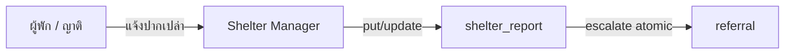
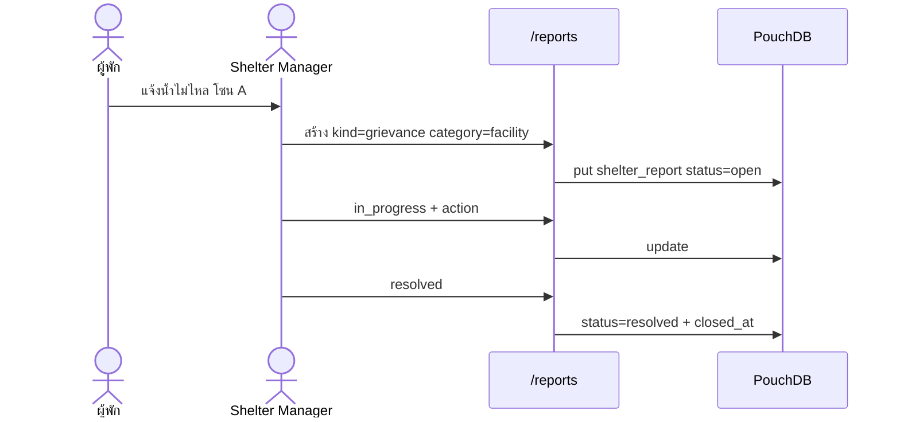
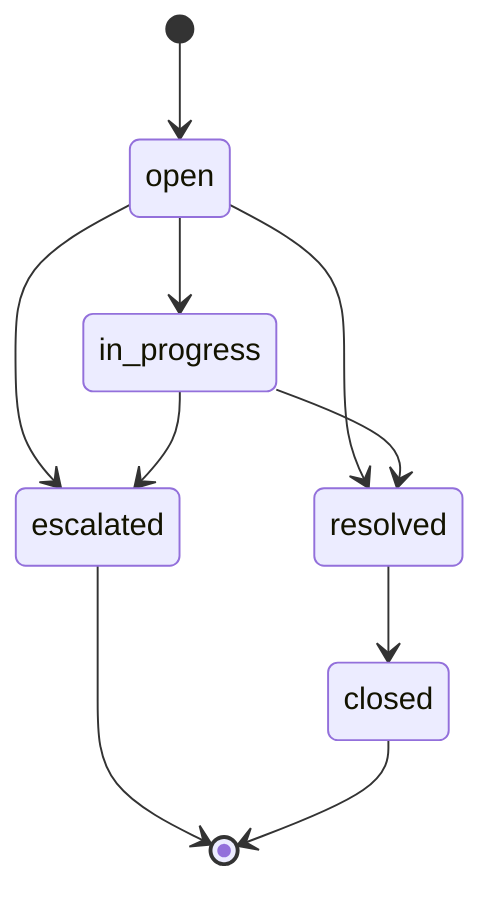
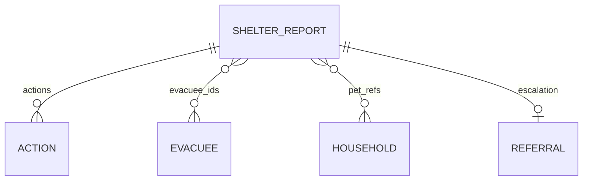

# Shelter Reports — Feature Flow & Requirements

## สรุป (TL;DR)

- Module E = **เปิดและติดตามรายงานในศูนย์** — หน่วยหลัก = **Report** · แยกประเภทด้วย **`kind`**: grievance | incident — ไม่ใช่เฝ้าประตูหรือ CCTV
- Persist: **`shelter_report:{ulid}`** (state machine) — [CR-040](../changes/CR-040-shelter-case-grievance-reframe.md)
- **Mutate R3 = `shelter_manager` เท่านั้น** (allow-list ขยายได้ภายหลัง) · `system_admin` = platform override · ไม่มี PUB intake
- Escalate = **atomic** กับสร้าง `referral` · List sort = **severity แล้ว occurred_at**
- Occupancy / check-in/out อยู่ที่ People · CR done — implement ตาม T-19/T-33

---

## 1. Purpose & scope

| | |
| --- | --- |
| **จุดประสงค์** | ให้ SM รับเรื่องในศูนย์ ติดตามจนปิด หรือ escalate ไป referral |
| **ในขอบเขต** | Intake · list/filter/sort · detail + timeline · assign · สถานะ · escalate atomic → Module F |
| **นอกขอบเขต** | Gate check-in/out · live occupancy roster · CCTV · public self-service · EOC aggregate ของรายงาน |
| **Change Record** | [CR-040](../changes/CR-040-shelter-case-grievance-reframe.md) |

### 1.1 Baseline vs หลัง CR-040

| หัวข้อ | Baseline | หลัง CR-040 |
| --- | --- | --- |
| Doc type | `security_event` append-only | **`shelter_report`** state machine |
| ประเภทเรื่อง | (ไม่ชัด) | **`kind`**: `grievance` \| `incident` |
| Monitoring present/overdue | DoD T-33 | **ตัด** — People/movement |
| Route | `/security-events` | `/reports` |
| Mutate roles | (ไม่ชัด / SM+SA wording) | **SM** + allow-list; SA override |

### 1.2 Decisions locked

| ID | คำตัดสิน |
| --- | --- |
| **D-NAME** | `shelter_report` (ไม่ใช่ `report` เปล่า · ไม่ใช่ `shelter_report_case`) |
| **D-KIND** | Field หลัก `kind` = `grievance` \| `incident` — ห้าม field ชื่อ `type` |
| **D-PUB** | ปิด — ไม่มี public/self-service |
| **D-WHO-CREATE** | R3: `shelter_manager` เท่านั้น (mutate) · allow-list scalable · SA platform override |
| **D-PET** | `pet_refs`: `{ household_id, pet_index }` |
| **D-ESCALE** | Atomic กับสร้าง `referral` |
| **D-SORT** | `severity` แล้ว `occurred_at` desc |
| **D-ROUTE** | `/reports` · feature `shelter-reports` |

---

## 2. Actors

| Actor | RoleKey | หน้าที่ |
| --- | --- | --- |
| **Shelter Manager** | `shelter_manager` | เปิดรายงาน · มอบหมาย · timeline · สถานะ · escalate |
| **System Admin** | `system_admin` | Platform override ข้ามศูนย์ (ไม่ใช่ผู้ใช้หลักของ flow ศูนย์) |
| **ผู้พัก / ญาติ** | — | แจ้งปากเปล่า — **ไม่ใช้ระบบโดยตรง** |
| **REG / KS / WS** | ตาม RoleKey | **ยังไม่มีสิทธิ์** — เพิ่มภายหลังด้วยการขยาย allow-list + CR permission |
| **Referral (Module F)** | `shelter_manager` | เจ้าของ handoff หลัง escalate |

---

## 3. Domain concepts

| คำ | ความหมาย |
| --- | --- |
| **Report** | doc `shelter_report` — หน่วยติดตามหนึ่งเรื่องต่อศูนย์ |
| **Grievance** | `kind=grievance` — ร้องเรียน / ร้องทุกข์ |
| **Incident** | `kind=incident` — เหตุที่ staff/SM บันทึก |
| **Action** | รายการใน `actions[]` (append-only ใน array) |
| **Escalate** | สร้าง `referral` สำเร็จ → ตั้ง `status=escalated` + `escalation.referral_id` |

**ไม่ใช่ shelter report:** movement · stock · screening · meal service

---

## 4. Requirements (atomic)

### 4.1 Data & persistence

| ID | Requirement |
| --- | --- |
| **SR-D1** | Doc ใน `shelter_{code}`: `type: "shelter_report"` · `_id = shelter_report:{ulid}` · envelope มาตรฐาน |
| **SR-D2** | Field บังคับตาม CR-040 §C: `kind`, `category`, `severity`, `status`, `subject`, `description`, `reporter`, `occurred_at`, `actions` |
| **SR-D3** | `kind` ∈ {`grievance`,`incident`} · `category` ∈ whitelist CR-040 — นอก list = reject |
| **SR-D4** | `status` forward-only ตามกราฟ §7 — ผิด = reject |
| **SR-D5** | `actions[]` เพิ่มได้เท่านั้น |
| **SR-D6** | `pet_refs` = `{ household_id, pet_index }` ที่ valid ใน household ของศูนย์ |
| **SR-D7** | เขียนผ่าน repository ของ feature เท่านั้น |
| **SR-D8** | เมื่อ `status=escalated` ต้องมี `escalation.referral_id` ไม่ว่าง |

### 4.2 Permissions (scalable)

| ID | Requirement |
| --- | --- |
| **SR-P1** | Mutate (สร้าง/อัปเดต/escalate) เมื่อ `role ∈ SHELTER_REPORT_MUTATE_ROLES` **และ** อยู่ใน shelter scope · R3: `['shelter_manager']` |
| **SR-P2** | `system_admin` ผ่าน platform override ได้ (ข้ามศูนย์) |
| **SR-P3** | Guard ของ `/reports/**` ใช้ allow-list เดียวกับ SR-P1 — **ห้าม hard-code เฉพาะ SM ในหลายที่**; รวมเป็น constant/ helper เดียวเพื่อขยายบทบาทภายหลัง |
| **SR-P4** | ไม่มี RoleKey ใหม่ · ไม่มี PUB create |

### 4.3 UI — list & intake

| ID | Requirement |
| --- | --- |
| **SR-U1** | List `/reports`: `subject`, `kind`, `category`, `severity`, `status`, `occurred_at`, assignee |
| **SR-U2** | Filter: อย่างน้อย `status` + `severity` + `kind` (+ `category` ถ้าทำได้ใน slice) |
| **SR-U3** | **Default sort:** severity `critical` → `warning` → `info` แล้ว `occurred_at` ใหม่→เก่า |
| **SR-U4** | ฟอร์มสร้างบังคับ: kind, category, severity, subject, description, reporter.source, occurred_at |
| **SR-U5** | Optional: zone, evacuee_ids, pet_refs, assignee_user_id |
| **SR-U6** | หลังสร้าง → detail + toast สำเร็จ |

### 4.4 UI — detail & lifecycle

| ID | Requirement |
| --- | --- |
| **SR-U7** | Detail = field หลัก + timeline `actions` เรียงเวลา |
| **SR-U8** | เพิ่ม action note (ไม่ว่าง) → append `actions` |
| **SR-U9** | ปุ่มสถานะถัดไปเฉพาะ transition ที่อนุญาต |
| **SR-U10** | เข้า `resolved`/`closed` → ตั้ง `closed_at` ถ้ายังว่าง |
| **SR-U11** | Escalate: confirm → **atomic** สร้าง referral แล้วตั้ง `escalated` + `referral_id` (SR-D8) |

### 4.5 Integration

| ID | Requirement |
| --- | --- |
| **SR-I1** | ห้ามเขียน `movement` / `evacuee.current_stay` จาก Module E |
| **SR-I2** | อ่านคน/สัตว์ผ่าน barrel `people` (household) เท่านั้น |
| **SR-I3** | Escalate ผ่าน barrel referrals — ไม่ใส่ medical detail ที่หลุดนอก shelter |
| **SR-I4** | ไม่มี public endpoint สร้างรายงาน |

### 4.6 Non-functional

| ID | Requirement |
| --- | --- |
| **SR-N1** | Changes feed → invalidate query keys — ไม่ใช้ `refetchInterval` |
| **SR-N2** | Unit tests: transition matrix · kind/category whitelist · pet_ref · escalate ต้องมี referral_id · allow-list helper |
| **SR-N3** | Demo: J1 ครบ; J3 escalate atomic เมื่อ referral พร้อม |

---

## 5. Screens

| Screen | Route | Actions หลัก |
| --- | --- | --- |
| List | `/reports` | สร้าง · เปิด detail · filter |
| Create | `/reports/new` หรือ dialog | submit |
| Detail | `/reports/[id]` | action · สถานะ · escalate · assignee |

---

## 6. User journeys

### J1 — Grievance (facility)

### J2 — Incident (violence)

SM สร้าง `kind=incident` `category=violence` + `evacuee_ids` → actions → `resolved`/`closed` หรือไป J3

### J3 — Escalate (atomic)

| ขั้น | ระบบต้อง | ผล |
| --- | --- | --- |
| 1 | SM ยืนยัน escalate | — |
| 2 | สร้าง `referral` สำเร็จ | ได้ `referral_id` |
| 3 | อัปเดตรายงาน: `escalation.referral_id` + `status=escalated` + action | SR-D8 ผ่าน |
| 4 | ถ้าข้อ 3 fail | ต้องไม่ทิ้งสถานะ `escalated` กำพร้า; recovery ตาม T-19 |
| 5 | SM ไป `/referrals` | Module F |

### J4 — Pet related

สร้าง `category=pet_related` + `pet_refs` → validate SR-D6 → ดำเนินการปกติ

---

## 7. State machine

| จาก | ไปได้ |
| --- | --- |
| `open` | `in_progress`, `resolved`, `escalated` |
| `in_progress` | `resolved`, `escalated` |
| `resolved` | `closed` (+ `closed_at`) |
| `escalated` / `closed` | terminal |

---

## 8. Data shape

Canonical field ตาราง = CR-040 §C  
Feature path หลัง approve: `features/shelter-reports/{domain,data,application,ui}`

---

## 9. Mapping → FR / tasks

| Artifact | หลัง approve |
| --- | --- |
| FR-47 | Shelter report ตาม CR-040 §A |
| T-19 | Schema + atomic escalate contract + allow-list note |
| T-33 | UI/tests/demo ตาม SR-\* |
| T-34 | รับ referral จาก escalate |

---

## 10. Acceptance / DoD (T-33)

- [ ] สร้าง grievance + incident แล้วเห็นใน list (เรียง severity ก่อน)
- [ ] Filter status + severity + kind
- [ ] Transition ผิดถูกบล็อก
- [ ] Action timeline ทำงาน
- [ ] pet_ref / evacuee ผูกได้เมื่อมีข้อมูล
- [ ] REG (และ role นอก allow-list) เข้า `/reports` ไม่ได้
- [ ] Mutate permission อยู่ที่ helper/allow-list เดียว
- [ ] Escalate สำเร็จแล้วมี `referral_id`; ไม่มี `escalated` โดยไร้ referral
- [ ] ไม่มี UI check-in/out หรือ occupancy roster ใน Module E
- [ ] Demo J1; J3 เมื่อ referral พร้อม

---

## 11. Out of scope

1. QR / ประตู / biometric  
2. Dashboard คนในศูนย์ภายใต้ `/reports`  
3. “ออกแล้วไม่กลับเกินกำหนด”  
4. CCTV / access panel  
5. Public / EOC เผยแพร่รายงาน  
6. Self-service ร้องทุกข์ของผู้พัก  

---

## 12. Decision log

- 2026-07-15 — draft คู่ CR-040 (ชื่อร่าง Shelter Report Case / `shelter_report_case`)
- 2026-07-15 — ล็อก D-PUB=off, D-WHO-CREATE=SM+allow-list (+SA override), D-PET=default, D-ESCALE=atomic, D-SORT=severity
- 2026-07-15 — sync task-breakdown 08-E + Notion T-19/T-33 ให้ตรง CR-040
- 2026-07-23 — **rename:** D-NAME=`shelter_report`, D-KIND=grievance|incident, D-ROUTE=`/reports` · requirement IDs SC-\* → SR-\* · ไฟล์นี้แทน `shelter-case-grievance-flow.md`
- 2026-07-23 — CR-040 **done** · canonical docs apply แล้ว · เริ่ม implement ได้ตาม T-19/T-33
