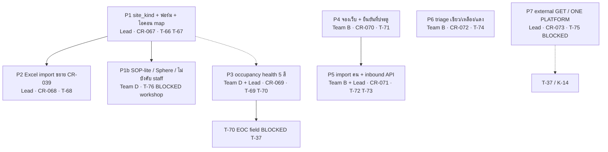

# Program — ชนิดสถานที่ · สุขภาพความจุ · ช่องจอง · คัดกรอง

## สรุป (TL;DR)

- รวม **ศูนย์อพยพ** กับ **บ้านพี่เลี้ยง** ใน doc `shelter` เดิม ด้วย field `site_kind` (`evacuation_center` | `host_house`) — ไม่สร้าง doc type ใหม่ (ตัดกับ [CR-014](../changes/CR-014-design-v5-alignment.md) slice `host_house` แยก — **superseded สำหรับเรื่องนี้**)
- บ้านพี่เลี้ยงอยู่บนหน้ารายการศูนย์เดิม + กรอง `site_kind` — **ถอด** nav/route `/portal/system-management/host-houses` (D-HOST-NAV **B′**)
- Public map ใช้ **ไอคอนคนละชุด** ตาม `site_kind`; สีหมุดตาม **occupancy health 5 สี** (derived จาก occupancy/capacity; `operation_status` override ได้ตาม D-STANDBY / D-HEALTH-VS-STATUS)
- ช่องเข้าพักใหม่: จองผ่านเว็บ (`registered_via=web`) + import คน + inbound API (`api`) — ตามสถานะด้วย QR หรือ `official_code` + เบอร์โทร (D-BOOK-TOKEN=A); ยืนยันที่ประตูด้วย QR scan ที่มีอยู่แล้ว (T-51)
- Occupancy ที่ใช้สี health / public / การจอง = **Forecast** (CR-112; supersedes D-BOOK-OCC=C ตัวเศษ) = stay ∈ {`pre_registered`,`arriving`,`active`,`room_confirmed`,`temporary_leave`}; additive `present` / `in_zone`. ไม่มี TTL; ปล่อยที่นั่งเมื่อ staff ยกเลิกชัดเจน (SA/SM/RS)
- **T-72 ล็อก:** import คนทุกแถวเริ่ม `pre_registered` (นับ occupancy ตาม D-BOOK-OCC=C; เป็น `active` ที่ประตู/staff เท่านั้น); ใคร import ได้ = **RS + SA + SM** (เจ้าของขยายจาก SM+SA)
- **ยังไม่ทำ (Wave 4 — รอบ CR ถัดไป):** รายการฟิลด์ SOP-lite, เกณฑ์คัดกรองเขียว/เหลือง/แดง, payload ONE PLATFORM / external GET, inbound plane — จอด `[NEEDS DECISION]` / blocked
- Schema bump **ยังไม่ลง** `schema.md` ในรอบ approve นี้ — bump ตอน implement ตาม Migration ของ child CR

---

## 0. Decision table — Wave 1–3 + T-72 **approved**; Wave 4 = รอบ CR ถัดไป

รายการนี้แยก **approved (Wave 1 + Wave 2 + Wave 3 + T-72, 2026-08-13 โดย IMPS)** จากข้อที่จอดรอบ CR ถัดไป. ห้าม bump `schema.md` ในรอบนี้ — bump ตอน implement ตาม Migration ของ child CR.

### Wave 1 — **approved** (2026-08-13)

| ID | หัวข้อ | ค่าที่ล็อก | กระทบ |
| --- | --- | --- | --- |
| **D-SITE-MODEL** | โมเดลบ้านพี่เลี้ยง | **A** — field `site_kind` บน `shelter` เดิม: `evacuation_center` \| `host_house`. Doc ไม่มี field อ่านเป็น `evacuation_center`. `shelter_type` คงเป็นประเภทอาคาร. **ห้าม** ใช้ `project_level=community` เป็นบ้านพี่เลี้ยง. CR-014 slice `host_house` doc type **superseded สำหรับเรื่องนี้** (GBV / thermal / house_damage ไม่ถูกแตะ) | CR-067, T-66 |
| **D-HOST-NAV** | นำทางบ้านพี่เลี้ยง | **B′** (ไม่ใช่ A และไม่ใช่ B เดิม) — **ถอด** nav/route `/portal/system-management/host-houses`. บ้านอยู่บนหน้ารายการศูนย์เดิม + กรอง `site_kind`. สร้างตาม filter: กรอง `host_house` → default `host_house`; กรอง `evacuation_center` → `evacuation_center`; แท็บ «ทั้งหมด» → ผู้ใช้ต้องเลือกชนิดก่อนบันทึก | T-66 |
| **D-HEALTH-PCT** | เกณฑ์ % สี occupancy health | เทา = ปิด (ไม่ใช่ %). ฟ้า &lt;60%. เหลือง 60–89% (90% เป็นแดง ไม่ใช่เหลือง). แดง 90–100%. แดงเข้ม &gt;100%. สูตร derived `occupancy/capacity` — **ไม่ persist**. `capacity=0` → «ไม่มีข้อมูลความจุ» ห้ามหารศูนย์. **ตัวเศษ occupancy:** Wave 1 เคยระบุ stay `active` อย่างเดียว; **Wave 3 D-BOOK-OCC=C ทับ** เป็น `active` + `pre_registered` (ดู §P3) | CR-069, T-69 |
| **D-TRACK-METHOD** | วิธี track ชุดนี้ | **CR ไฟล์ + Notion** (Policy §6 ตัวเลือก 3) | ทั้งโปรแกรม |

### Wave 2 — **approved** (2026-08-13)

| ID | หัวข้อ | ค่าที่ล็อก | กระทบ |
| --- | --- | --- | --- |
| **D-STANDBY** | `operation_status=standby` สีอะไร | **A** — เทา (เหมือน closed / ไม่เปิดรับ). **ไม่เข้าสูตร %**. สถานะเปิด = `{active, full_capacity}` (enum 4 ค่าที่มีอยู่ — ห้ามเพิ่มสถานะ). `full_capacity` เป็นสถานะเปิด; สีบังคับแดงตาม D-HEALTH-VS-STATUS | CR-069, T-69 |
| **D-HEALTH-VS-STATUS** | สี health vs staff-set `full_capacity` | **B** (เจ้าของทับคำแนะนำ A ของ John) — staff ตั้ง `full_capacity` **บังคับแดง** แม้ occupancy &lt;100%. กติการวม: `standby` หรือ `closed` → เทา; `full_capacity` → แดง; นอกนั้นตาม % (D-HEALTH-PCT). `operation_status` **override สีได้** — ไม่ใช่ ratio อย่างเดียว | CR-069, T-69 |
| **D-HEALTH-SURFACE** | แสดง health ที่ไหน | **A** — staff list/dashboard **และ** public map/card **ตอนนี้**. EOC = ฟิลด์ API ทีหลัง (T-70 blocked T-37). **ห้าม** สร้าง EOC human dashboard ในแอป (FD-14) | T-69, T-70 |

### Wave 3 — **approved** (2026-08-13)

| ID | หัวข้อ | ค่าที่ล็อก | กระทบ |
| --- | --- | --- | --- |
| **D-BOOK-OCC** | จองล่วงหน้านับ occupancy เมื่อไร | **C → superseded by CR-112 Forecast** — คีย์ public/booking `occupancy` = **Forecast** = stay ∈ {`pre_registered`,`arriving`,`active`,`room_confirmed`,`temporary_leave`}. Additive: `present` = {`active`,`room_confirmed`,`temporary_leave`}; `in_zone` = {`room_confirmed`}. กฎเดียวกันทั้ง `evacuation_center` และ `host_house`. **ไม่** แตะ kitchen/SOP คนอยู่จริง (CR-022 `active` only). Unassigned Registration Mongo **ไม่นับ** จน claim (CR-113) | CR-069, CR-070, **CR-112**, T-69, T-71 |
| **D-HOLD-TTL** | หมดอายุ hold อัตโนมัติ | **none** — ไม่มีหน้าต่างเวลา, ไม่ auto-expire, ไม่มี job auto-cancel | CR-070, T-71 |
| **D-PRE-REG-AGE** | แสดงอายุการจองบนรายการ staff | รายการ `pre_registered` ต้องแสดงเวลาที่ผ่านไปตั้งแต่ลงทะเบียน: **วัน, ชั่วโมง, นาที**. คำนวณตอนโหลดหน้า / รีเฟรชเท่านั้น — **ห้าม polling**, ห้ามนาฬิกาเดินสด | CR-070, T-71 |
| **D-HOLD-CANCEL** | ปล่อย occupancy ของ hold | ปล่อยที่นั่งจาก `pre_registered` เมื่อ staff **ยกเลิกชัดเจนเท่านั้น**. ใครยกเลิกได้: **SA, SM, และ RS** (`registration_staff`) — เจ้าของเริ่มจาก SA/SM แล้วเพิ่ม RS. ทุกครั้งต้องมี audit **ใครยกเลิก + timestamp**. **ห้าม** hard-delete เอกสารคน; เปลี่ยนสถานะให้ occupancy คำนวณใหม่ตอนรีเฟรช. สถานะ: ใช้ `cancelled` ที่มีอยู่แล้วที่ household; evacuee stay ปัจจุบันไม่มี cancel/no-show (CR-035: 6 ค่า) — **เสนอ** เพิ่ม `cancelled` บน stay หลัง approve (ชื่อเดิม ไม่สร้าง `no_show`). จนกว่า bump: occupancy นับเฉพาะ `{active, pre_registered}` | CR-070, T-71 |
| **D-REG-VIA** | ขยาย `registered_via` | คง `app` / `import` / `paper`. เพิ่ม **`web`** (จองเว็บสาธารณะ) และ **`api`** (inbound). Bump enum ตอน implement | CR-070, CR-071 |
| **D-BOOK-TOKEN** | ประชาชนตามสถานะการจองอย่างไร | **A** — ตามด้วย **QR หรือ `official_code` + เบอร์โทร** (pattern เดียวกับ donation track). ไม่มี token แยก. ไม่จำกัดที่ประตูอย่างเดียว | CR-070, T-71 |

### T-72 — **approved** (2026-08-13)

ไม่ใช่ Wave 4. Approve เฉพาะ import คน (slice A). T-73 / D-INBOUND-PLANE จอดรอบ CR ถัดไป.

| ID | หัวข้อ | ค่าที่ล็อก | กระทบ |
| --- | --- | --- | --- |
| **T-72 initial stay** | สถานะเริ่มต้นตอน import คน | **A** — ทุกแถวที่ import สำเร็จได้ `current_stay.status=pre_registered` เสมอ. นับ occupancy ตาม D-BOOK-OCC=C. เป็น `active` ผ่านประตู check-in หรือ staff เปลี่ยนสถานะเท่านั้น. **ห้าม** คอลัมน์เลือกสถานะต่อแถวในไฟล์ | CR-071, T-72 |
| **T-72 import permission** | ใคร import xlsx/csv ได้ | **RS + SA + SM** (`registration_staff` + `system_admin` + `shelter_manager`) — เจ้าของ**ขยาย**จาก proposed SM+SA. บทบาทอื่นห้าม import | CR-071, T-72 |

### Wave 4 — จอดรอบ CR ถัดไป (ไม่ approve 2026-08-13)

| ID | หัวข้อ | ตัวเลือก | กระทบ |
| --- | --- | --- | --- |
| **D-SOP-LITE** | ฟิลด์บังคับของบ้านพี่เลี้ยง vs ศูนย์ | **ห้ามเดารายการฟิลด์.** รอ SOP workshop. P1 ใช้ฟอร์มศูนย์ชุดเดิม + เลือก `site_kind` | T-76 blocked |
| **D-HOST-STAFF** | บ้านพี่เลี้ยงไม่ต้องมี user ประจำศูนย์ | **A:** SA/registration_staff ลงทะเบียนข้ามบ้านได้โดยไม่ต้องมี SM ประจำ · **B:** บังคับมี SM เหมือนศูนย์ · **C:** ประชาชนลงทะเบียนเองที่บ้าน | T-76 blocked |
| **D-SPHERE-CAP** | capacity อัตโนมัติจาก Sphere | **A (phase 2):** `capacity = floor(area_m2 / 3.5)` เมื่อ `site_kind=host_house` และมี `area_m2` · **B:** manual เสมอ · **C:** ใช้สูตรกับทั้งสองชนิด | T-76 blocked |
| **D-INBOUND-PLANE** | inbound คนจากหน่วยงาน | **A:** POST `/external/v1/...` + `X-API-Key` · **B:** BFF SA-only `/api/v1/people/inbound` · **C:** รอ partner spec แล้วค่อยเลือก plane | CR-071, T-73 **blocked payload** |
| **D-TRIAGE-RULES** | เกณฑ์เขียว / เหลือง / แดง | **ห้ามเดากฎการแพทย์.** รอเคาะ. P6 จอด | CR-072, T-74 blocked |
| **D-TRIAGE-FIELD** | เก็บ triage ที่ไหน | **A (แนะนำหลังกฎล็อก):** ขยาย `screening.track` / `medical.track` · **B:** field ใหม่ `triage_level` · **C:** แทนที่ `normal`/`fast_track` | CR-072 |
| **D-ONE-PLATFORM** | payload ONE PLATFORM + external GET ที่หน่วยงานต้องการ | **รอเขาส่ง SPEC.** ห้ามสมมติ contract. K-14 ยังเปิด | CR-073, T-75 blocked |

---

## 1. Why

ช่องว่างที่ตรวจจากโค้ดปัจจุบัน vs backlog เจ้าของโครงการ:

| ความต้องการ | สถานะโค้ด (อย่าไล่ใหม่) |
| --- | --- |
| รวมบ้านพี่เลี้ยงกับศูนย์ + tracking ชนิด + ไอคอน map คนละแบบ | doc `shelter` เดียว ไม่มี discriminator; `shelter_type` = ประเภทอาคาร (โรงเรียน/วัด); `project_level=community` ถูกใช้คลุมเครือว่าเป็นบ้านพี่เลี้ยง; `/portal/system-management/host-houses` = stub ว่าง; CR-014 เสนอ `host_house` แยก — ยัง proposed ไม่ได้ทำ. **Wave 1 ล็อก:** D-SITE-MODEL=A + D-HOST-NAV=B′ (ถอด stub; กรองบนหน้ารายการศูนย์) |
| SOP บ้านเบากว่าศูนย์; ไม่บังคับ user ประจำ; capacity จาก Sphere | SOP workshop **ยังไม่เกิด**; Sphere 3.5 m²/คน = คำแนะนำใน schema.md ไม่ได้คำนวณ `capacity` |
| Excel import ศูนย์และบ้าน | CR-039 import ศูนย์อย่างเดียว (19 คอลัมน์, ไม่มีคอลัมน์ชนิดสถานที่) |
| EOC เตือนคนล้น 5 สี | `operation_status` = staff-set 4 ค่า ไม่ derive จาก occupancy; แถบ occupancy staff = 3 สี (เขียว&lt;80 / amber≥80 / rose≥100) ไม่มีสีเกินจุ; EOC aggregate T-37/T-38/T-39 deferred; **FD-14** = API ไม่ใช่ dashboard ในแอป. **Wave 2 ล็อก:** สี health บน staff + public ตอนนี้; EOC = ฟิลด์ API ทีหลัง (T-70) |
| เชื่อม ONE PLATFORM | `/external/v1` + API keys (CR-062) = GET mirror ชั้น public; contract ONE PLATFORM **ยังไม่เซ็น (K-14)** |
| จองเข้าศูนย์ + ยืนยันที่ประตู; import คน; API inbound | ปุ่ม public «ลงทะเบียนผู้ประสบภัย» **disabled**; staff pre-register + QR scan มีแล้ว; ไม่มี public booking, ไม่มี people xlsx/csv, ไม่มี inbound POST; `registered_via`: `app`\|`import`\|`paper`. **Wave 3 ล็อก:** D-BOOK-OCC=C (จองนับ occupancy), D-HOLD-TTL=none, D-PRE-REG-AGE, D-HOLD-CANCEL (SA/SM/RS), D-REG-VIA=`web`+`api`, D-BOOK-TOKEN=A |
| คัดกรอง 3 สี | `track`: `normal`\|`fast_track` เท่านั้น |

---

## 2. Packages (ลำดับ dependency)

เส้นประ = ไม่ block การเริ่ม slice หลัก. P3 สูตร health ใช้ได้กับทุก `shelter` โดยไม่รอ `site_kind` แต่ไอคอน map รอ P1.

| Pkg | ชื่อ | CR | Tasks | Owner | พร้อมเมื่อ |
| --- | --- | --- | --- | --- | --- |
| **P1** | `site_kind` + ฟอร์ม + กรองบนหน้ารายการศูนย์ (ไม่มีหน้า `/host-houses`) | [CR-067](../changes/CR-067-shelter-site-kind.md) | T-66, T-67 | Lead แจ็ก/เด่น | **approved** — พร้อม implement |
| **P1b** | SOP-lite, ไม่บังคับ user ประจำ, Sphere auto-capacity | (จอดใน CR-067 §Phase 2) | T-76 | Team D | **รอบ CR ถัดไป** — SOP workshop + D-SOP-LITE / D-HOST-STAFF / D-SPHERE-CAP |
| **P2** | Excel import ขยาย CR-039 | [CR-068](../changes/CR-068-shelter-import-site-kind.md) | T-68 | Lead | **approved** — หลัง T-66 |
| **P3** | Occupancy health 5 สี | [CR-069](../changes/CR-069-occupancy-health-colors.md) | T-69, T-70 | Team D + Lead (EOC) | **approved** — T-69 พร้อม; T-70 รอ T-37 |
| **P4** | จองผ่านเว็บ + ยืนยันที่ประตู | [CR-070](../changes/CR-070-public-booking-gate-confirm.md) | T-71 | Team B | **in progress** — booking + self-lookup ship 2026-08-20; เหลือ multi-member household + D-PRE-REG-AGE |
| **P5** | People import xlsx/csv + inbound API | [CR-071](../changes/CR-071-people-import-inbound.md) | T-72, T-73 | Team B + Lead | T-72 **approved** (ยังรอ T-48); T-73 **รอบ CR ถัดไป** (blocked payload) |
| **P6** | Triage เขียว/เหลือง/แดง | [CR-072](../changes/CR-072-triage-green-yellow-red.md) | T-74 | Team B | **รอบ CR ถัดไป** — blocked D-TRIAGE-RULES |
| **P7** | External GET / ONE PLATFORM | [CR-073](../changes/CR-073-one-platform-external-get-blocked.md) | T-75 | Lead | **รอบ CR ถัดไป** — blocked SPEC ภายนอก (K-14) |

**Team A (Donation+Volunteer) และ Team C (Supply+Kitchen) ไม่ใช่เจ้าของหลักของโปรแกรมนี้.**

---

## 3. Functional requirements

หนึ่งข้อ = ตรวจเสร็จ/ไม่เสร็จได้. FR ที่ blocked ห้าม implement ก่อนล็อก decision.

### P1 — ชนิดสถานที่

- **FR-57** — `shelter` ต้องมี `site_kind` enum(`evacuation_center`,`host_house`) required; doc เดิมไม่มี field → อ่านเป็น `evacuation_center`
- **FR-58** — `shelter_type` คงเป็นประเภทอาคาร (master_data); **ห้าม** ใช้ `project_level=community` เป็นตัวแทนบ้านพี่เลี้ยง
- **FR-59** — ฟอร์มสร้าง/แก้ศูนย์มีตัวเลือกชนิดสถานที่ และ persist `site_kind`
- **FR-60** — รายการศูนย์กรอง/แยกตาม `site_kind` ได้
- **FR-61** — **ถอด** หน้า `/portal/system-management/host-houses` (D-HOST-NAV **B′**). บ้านพี่เลี้ยงอยู่บนหน้ารายการศูนย์เดิม กรอง `site_kind`. สร้างตาม filter: กรอง `host_house` → default `host_house`; กรอง `evacuation_center` → `evacuation_center`; แท็บ «ทั้งหมด» → ผู้ใช้ต้องเลือกชนิดก่อนบันทึก
- **FR-62** — public map ใช้ไอคอนคนละชุดสำหรับ `evacuation_center` vs `host_house` (ไม่ใช้ emoji จากสตริง `shelter_type` เป็นตัวแยกชนิด)
- **FR-63** — P1 **ห้าม** ลดชุดฟิลด์บังคับของบ้านพี่เลี้ยง และ **ห้าม** คำนวณ Sphere capacity อัตโนมัติ (อยู่ T-76)

### P2 — Import สถานที่

- **FR-64** — เทมเพลต Excel CR-039 เพิ่มคอลัมน์ชนิดสถานที่ (label ไทย → `site_kind`); แถวไม่มีค่า → default `evacuation_center`
- **FR-65** — import สร้างได้ทั้งศูนย์และบ้านพี่เลี้ยงผ่าน path เดิม (`POST /api/back-office/shelter` sequential + `shelter_import_log`)

### P3 — Occupancy health

- **FR-66** — ระบบ derive `occupancy_health` จาก occupancy (**Forecast** ต่อ CR-112: stay ∈ {`pre_registered`,`arriving`,`active`,`room_confirmed`,`temporary_leave`}) ÷ `capacity` + กฎปิดศูนย์ — **ไม่ persist เป็น source of truth** (คำนวณตอนอ่าน)
- **FR-67** — ชุดสีตามตาราง §P3 (D-HEALTH-PCT + D-STANDBY=A + D-HEALTH-VS-STATUS=B ล็อก 2026-08-13)
- **FR-68** — แสดง health บน staff list/dashboard **และ** public map/card **ตอนนี้** (D-HEALTH-SURFACE=A). EOC = ฟิลด์ API ทีหลัง (T-70)
- **FR-69** — ฟิลด์ health บน EOC aggregate API = T-70 หลัง T-37 — **ไม่สร้าง EOC human dashboard ในแอป** (FD-14 คง)

### P4 — จอง + ยืนยันที่ประตู

- **FR-70** — ประชาชนจองเข้าศูนย์/บ้านผ่านเว็บ (เปิดปุ่มที่ disabled อยู่) ได้ โดยสร้างคนสถานะ `pre_registered`; occupancy **นับทันที** (D-BOOK-OCC=C). `registered_via=web`
- **FR-71** — ที่ประตู staff ยืนยันตัวตนด้วย QR scan ที่มีอยู่ (T-51) แล้ว check-in → `active` (occupancy ไม่ +1 ซ้ำ — นับไปแล้วตอน hold)
- **FR-72** — จองเมื่อศูนย์ health = แดงเข้ม (เกินจุ) เป็น warning-only สอดคล้อง occupancy guardrail เดิม เว้นแต่มี CR แยกเรื่อง block
- **FR-77** — รายการ staff ของ `pre_registered` ต้องแสดงเวลาที่ผ่านไปตั้งแต่ลงทะเบียนเป็นวัน/ชั่วโมง/นาที; คำนวณตอนโหลด/รีเฟรชเท่านั้น — ห้าม poll ห้ามนาฬิกาเดินสด (D-PRE-REG-AGE)
- **FR-78** — ปล่อย occupancy ของ hold เมื่อ staff ยกเลิกชัดเจนเท่านั้น (D-HOLD-TTL=none). บทบาท: SA, SM, RS. Audit ทุกครั้ง: actor + timestamp. ห้าม hard-delete; เปลี่ยนสถานะเป็น `cancelled` (household มีแล้ว; stay เสนอเพิ่มชื่อเดิมหลัง approve)
- **FR-79** — ประชาชนตามสถานะจองด้วย QR หรือ `official_code` + เบอร์โทร — ไม่มี token แยก ไม่จำกัดที่ประตู (D-BOOK-TOKEN=A)

### P5 — Import คน + inbound

- **FR-73** — staff import คนจาก xlsx/csv (ขยาย T-55); `registered_via=import`; preview + error รายแถว + audit log
- **FR-80** — ทุกแถวที่ import สำเร็จได้ `current_stay.status=pre_registered` เสมอ (T-72 initial stay=**A**). นับ occupancy ตาม D-BOOK-OCC=C. เป็น `active` ผ่านประตู check-in หรือ staff เปลี่ยนสถานะเท่านั้น — **ห้าม** คอลัมน์เลือกสถานะต่อแถวในไฟล์
- **FR-81** — ใคร import ได้: `registration_staff` (RS) + `system_admin` (SA) + `shelter_manager` (SM). บทบาทอื่นห้าม (T-72 import permission — เจ้าของขยายจาก proposed SM+SA)
- **FR-74** — inbound POST จากหน่วยงานอื่น — **สัญญา field รอ partner**; ห้ามเดา payload (T-73 blocked)

### P6 — Triage

- **FR-75** — คัดกรอง 3 ระดับ เขียว/เหลือง/แดง — **กฎการแพทย์รอ D-TRIAGE-RULES**; ห้าม map มั่วจาก `fast_track`

### P7 — External / ONE PLATFORM

- **FR-76** — ขยาย `/external/v1` GET ตาม SPEC ที่หน่วยงานส่ง — **blocked**; ของที่มีอยู่ (CR-062 GET mirror) คงเดิม ห้ามเปลี่ยนสัญญาเงียบ

---

## 4. P3 — Occupancy health (D-HEALTH-PCT + Wave 2 + ตัวเศษ Wave 3)

Occupancy (คีย์ public/booking) = **Forecast** = count evacuee ที่ `current_stay.status ∈ {pre_registered, arriving, active, room_confirmed, temporary_leave}` ในศูนย์นั้น (CR-112 — supersedes D-BOOK-OCC=C ตัวเศษ Wave 3). Capacity = `shelter.capacity` (manual จนกว่า T-76). Additive: `present` / `in_zone` ตาม schema §1.1.

Kitchen/SOP คนอยู่จริง (CR-022 / T-31) ยังนับ `active` อย่างเดียว — **ไม่** รวม hold.

Health **ไม่ persist**. ประเมินตามลำดับ (status override ก่อน %):

1. `operation_status ∈ {standby, closed}` → **เทา** — **ไม่เข้าสูตร %** (D-STANDBY=A; เหมือนไม่เปิดรับ)
2. `operation_status = full_capacity` → **แดง** — บังคับ แม้ occupancy &lt;100% (D-HEALTH-VS-STATUS=B)
3. นอกนั้น (`active`) → ตาม % (D-HEALTH-PCT) เมื่อ `capacity > 0`

`ratio = occupancy / capacity` เมื่อ `capacity > 0` และถึงขั้นที่ 3. ถ้า `capacity` หายหรือ `= 0` ในขั้นที่ 3 = ไม่คำนวณ สีไม่กำหนด (แสดง "ไม่มีข้อมูลความจุ") — **ห้ามหารศูนย์**.

**เปิดอยู่** (ใช้ % หรือบังคับแดง) = `operation_status ∈ {active, full_capacity}`. Enum 4 ค่าที่มีอยู่ — ห้ามเพิ่มสถานะ.

| สี | ความหมาย | เงื่อนไข |
| --- | --- | --- |
| เทา | ปิด / ไม่เปิดรับ | `operation_status ∈ {closed, standby}` — **ไม่ใช่ %** |
| ฟ้า | ยังเปิดรับ | `active` และ `ratio < 0.60` |
| เหลือง | ใกล้เต็ม | `active` และ `0.60 ≤ ratio < 0.90` (60–89%; **90% เป็นแดง**) |
| แดง | เต็ม / เกือบเต็ม | `full_capacity` (บังคับ) **หรือ** `active` และ `0.90 ≤ ratio ≤ 1.00` |
| แดงเข้ม | เกินแล้ว | `active` และ `ratio > 1.00` |

**ไม่ใช่** การแทนที่ enum `operation_status`. Health เป็น derived view สำหรับเตือนคนล้น — แต่ `operation_status` **override สีได้** (ไม่ใช่ ratio อย่างเดียว).

ผิวที่ลง T-69 (D-HEALTH-SURFACE=A):

| ผิว | ตอนนี้ | ห้าม |
| --- | --- | --- |
| Staff shelter list / dashboard occupancy | แทนแถบ 3 สีด้วย 5 สี | — |
| Public map + การ์ดศูนย์ | สีหมุดตาม health + ไอคอนตาม `site_kind` (T-67) | ห้ามโชว์ PII |
| EOC API | T-70 เพิ่ม field derived บน aggregate (blocked T-37) | ห้ามสร้างหน้า EOC dashboard ใน SPA (FD-14) |

---

## 5. นอกขอบเขต

- รายการฟิลด์ SOP ที่บังคับ/ไม่บังคับของบ้านพี่เลี้ยง (รอ workshop)
- กฎคัดกรองการแพทย์ เขียว/เหลือง/แดง
- สัญญา ONE PLATFORM / รายการ field ที่หน่วยงานภายนอกต้องการจาก GET
- EOC human dashboard ในแอป (FD-14)
- Doc type `host_house` แยก (CR-014 slice นั้น — **superseded** โดย D-SITE-MODEL=A; สไลซ์ GBV/thermal/house_damage ไม่ถูกแตะ)
- Team A donation/volunteer และ Team C supply/kitchen ในโปรแกรมนี้
- เปลี่ยน stable core (envelope, `_session`, sync priority, layer boundary, `_id` pattern)
- Auto-block check-in เมื่อเต็ม (คง warning-only ตาม T-51 จนกว่ามี CR แยก)

---

## 6. Assignment board

เจ้าของโครงการใช้ตารางนี้จ่ายงาน. **ready** = CR ที่ผูก approved แล้ว เริ่มได้ (ยังมี dependency งาน). **blocked** = ห้ามเริ่มจนกว่า blocker หลุด (รวม Wave 4 = รอบ CR ถัดไป).

| T-id | ชื่องาน | ทีม | สถานะ | Blocker | CR |
| --- | --- | --- | --- | --- | --- |
| **T-66** | `site_kind` schema + ฟอร์ม + กรองบนหน้ารายการศูนย์ (ไม่มี stub `/host-houses`) | Lead แจ็ก/เด่น | **ready** | CR-067 approved (P1) | CR-067 |
| **T-67** | Public map ไอคอนแยกตาม `site_kind` | Lead | blocked | T-66 | CR-067 |
| **T-68** | Excel import คอลัมน์ `site_kind` (ขยาย CR-039) | Lead | blocked | T-66 | CR-068 |
| **T-69** | Domain `occupancy_health` + แสดง 5 สี staff และ public | Team D + Lead (public plane) | **ready** | CR-069 approved | CR-069 |
| **T-70** | ฟิลด์ `occupancy_health` บน EOC aggregate API | Lead | blocked | T-37, T-69 (D-HEALTH-SURFACE=A — EOC = API ทีหลัง ไม่ใช่ dashboard) | CR-069 |
| **T-71** | Public booking + ยืนยันที่ประตู (reuse T-51 scan) | Team B พีค/โฮป/ปิ๊ก | **in progress** | CR-070 approved; booking + lookup ship 2026-08-20 | CR-070 |
| **T-72** | People import xlsx/csv (ขยาย T-55) | Team B | **ready** (รอ T-48) | CR-071 slice A approved | CR-071 |
| **T-73** | Inbound POST คนจากหน่วยงาน | Team B + Lead | blocked | D-INBOUND-PLANE + partner payload spec — **รอบ CR ถัดไป** | CR-071 |
| **T-74** | Triage เขียว/เหลือง/แดง | Team B | blocked | D-TRIAGE-RULES, D-TRIAGE-FIELD — **รอบ CR ถัดไป** | CR-072 |
| **T-75** | External GET / ONE PLATFORM ตาม SPEC เขา | Lead | blocked | D-ONE-PLATFORM / K-14 — **รอบ CR ถัดไป** | CR-073 |
| **T-76** | SOP-lite + Sphere auto-capacity + ไม่บังคับ staff ประจำบ้าน | Team D | blocked | SOP workshop; D-SOP-LITE, D-HOST-STAFF, D-SPHERE-CAP — **รอบ CR ถัดไป** | CR-067 phase 2 |

รายละเอียด DoD / ไฟล์ที่แตะ / นอกขอบเขตต่อ task อยู่ในโมดูล:

- T-66, T-68 → [00-baseline.md](../task-breakdown/00-baseline.md)
- T-67 → [12-public.md](../task-breakdown/12-public.md)
- T-69, T-76 → [07-B-sop.md](../task-breakdown/07-B-sop.md)
- T-70, T-75 → [10-eoc.md](../task-breakdown/10-eoc.md)
- T-71, T-72, T-73, T-74 → [02-people.md](../task-breakdown/02-people.md)

---

## 7. CR map

| CR | บทบาท | Layer | schema_v (ตอน implement หลัง approve) |
| --- | --- | --- | --- |
| [CR-066](../changes/CR-066-site-occupancy-booking-program.md) | Program index | volatile | ไม่ bump — **approved** สไลซ์ Wave 1–3 + T-72 |
| [CR-067](../changes/CR-067-shelter-site-kind.md) | P1 `site_kind` | volatile | shelter 4→5 ตอน implement — **approved P1**; P1b รอบ CR ถัดไป |
| [CR-068](../changes/CR-068-shelter-import-site-kind.md) | P2 ขยาย CR-039 | volatile | ไม่ bump shelter (ใช้ field จาก CR-067) — **approved** |
| [CR-069](../changes/CR-069-occupancy-health-colors.md) | P3 health 5 สี | volatile | ไม่ persist; ไม่ bump — **approved** |
| [CR-070](../changes/CR-070-public-booking-gate-confirm.md) | P4 booking | volatile | evacuee `registered_via` + stay `cancelled` ตอน implement — **approved** |
| [CR-071](../changes/CR-071-people-import-inbound.md) | P5 import/inbound | volatile | ตาม D-REG-VIA ตอน implement — **approved slice A**; inbound payload รอบ CR ถัดไป |
| [CR-072](../changes/CR-072-triage-green-yellow-red.md) | P6 triage | volatile | screening/medical — **proposed**; Wave 4 รอบ CR ถัดไป |
| [CR-073](../changes/CR-073-one-platform-external-get-blocked.md) | P7 stub | volatile | ไม่มีจนกว่า SPEC เข้า — **proposed**; Wave 4 รอบ CR ถัดไป |

**schema.md ยังไม่ bump ในรอบ approve นี้.** Wave 4 ไม่ถูก mark `approved`.

---

## 8. Decision log

- 2026-08-13 — proposed (PM John จาก gap analysis ของเจ้าของโครงการ). CR ชุดยัง `proposed`.
- 2026-08-13 — **Wave 1 ล็อก** โดยเจ้าของโครงการ: D-SITE-MODEL=A · D-HOST-NAV=B′ · D-HEALTH-PCT (เทาปิด / ฟ้า&lt;60 / เหลือง 60–89 / แดง 90–100 / แดงเข้ม &gt;100) · D-TRACK-METHOD=CR ไฟล์ + Notion ([หน้า decision log](https://www.notion.so/3bb33537542a81b799d0ce49be001bd4)). **ไม่ mark CR เป็น approved. ไม่ bump schema.md.**
- D-SITE-MODEL=A เพราะโค้ดรวม `shelter` อยู่แล้ว; CR-014 `host_house` แยกยังไม่ implement และจะทำให้ import/map/occupancy แยก path — slice นั้น superseded สำหรับเรื่องนี้.
- D-HOST-NAV=B′ เพราะ stub `/host-houses` ทำให้เข้าใจผิดว่าฟีเจอร์มี และบ้านควรอยู่บนหน้ารายการศูนย์ + กรอง ไม่ใช่หน้าแยก (ไม่ใช่ A เดิม = wire stub, ไม่ใช่ B เดิม = ถอด nav อย่างเดียวโดยไม่ระบุว่าอยู่หน้าไหน).
- D-HEALTH-PCT ใช้ตัวเลขเจ้าของโครงการ; 90% เป็นแดง (ไม่ใช่เหลือง). สูตร derived ไม่ persist. `capacity=0` ไม่หารศูนย์.
- 2026-08-13 — **Wave 2 ล็อก** โดยเจ้าของโครงการ: D-STANDBY=A · D-HEALTH-VS-STATUS=**B** (ทับคำแนะนำ A ของ John) · D-HEALTH-SURFACE=A. กติการวมสี: `standby`/`closed` → เทา (ไม่เข้า %); `full_capacity` → แดง; นอกนั้นตาม D-HEALTH-PCT. ผิว T-69 = staff + public ตอนนี้; T-70 EOC API ทีหลัง; ห้าม dashboard EOC ในแอป (FD-14).
- 2026-09-06 — **CR-112 approved**: D-BOOK-OCC occupancy numerator → **Forecast** triple (`occupancy`/`present`/`in_zone`); pair **CR-113** Unassigned Registration Mongo.
- 2026-08-13 — **T-72 ล็อก** โดยเจ้าของโครงการ (ไม่ใช่ Wave 4): **T-72 initial stay=A** (ทุกแถว `pre_registered`; นับ occupancy ตาม D-BOOK-OCC=C; เป็น `active` ที่ประตู/staff เท่านั้น — ห้ามเลือกต่อแถวในไฟล์) · **T-72 import permission=RS+SA+SM** (เจ้าของขยายจาก proposed SM+SA). T-72 ไม่รอ stay/permission แล้ว — รอ approve CR-071 + T-48. **ไม่ mark CR เป็น approved. ไม่ bump schema.md.**
- 2026-08-13 — **approved** โดยเจ้าของโครงการ (IMPS): Wave 1–3 + T-72. Wave 4 **จอดรอบ CR ถัดไป** (D-SOP-LITE, D-HOST-STAFF, D-SPHERE-CAP, D-INBOUND-PLANE, D-TRIAGE-RULES, D-TRIAGE-FIELD, D-ONE-PLATFORM). CR-072 / CR-073 คง `proposed`. **ไม่ bump schema.md ในรอบนี้.**
- Wave 4 จอดรอบ CR ถัดไป: ห้ามเดา SOP / triage / ONE PLATFORM.
