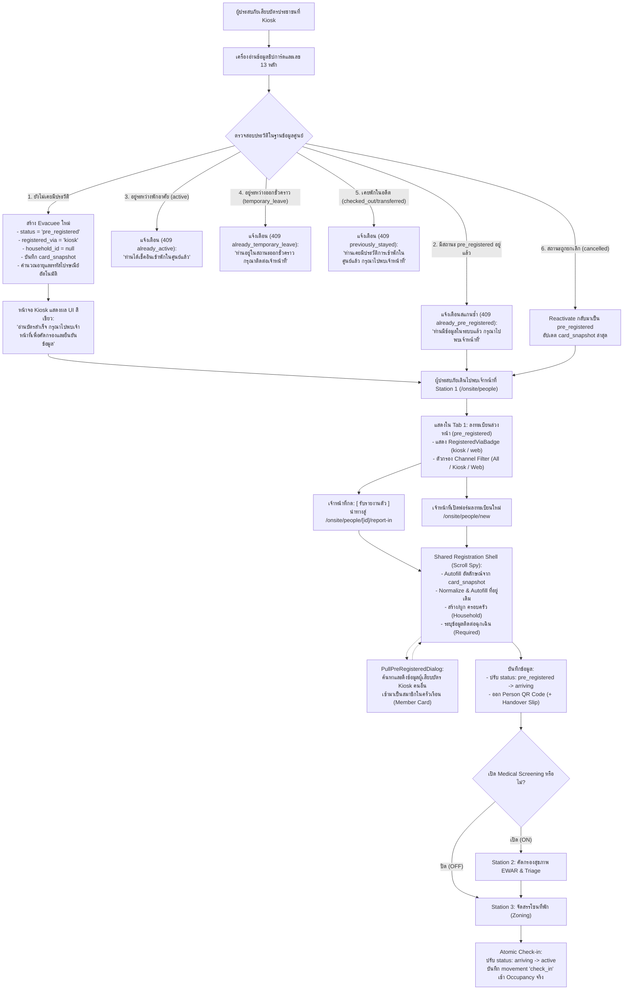

# สเปคระบบอ่านบัตรประชาชนและการลงทะเบียนผู้ประสบภัย (Smart Card Reader & Fast-Track Registration)

**สรุป (BLUF):**  
บันทึกข้อมูลชิปบัตรประชาชนสร้าง entity `evacuee` โดยตรง กำหนดสถานะ `current_stay.status = 'pre_registered'`, ระบุ `registered_via: 'kiosk'`, และแนบ `card_snapshot` พร้อมคำนวณอายุและรหัสไปรษณีย์อัตโนมัติ · ข้อมูลไหลเข้าสู่คิว Station 1 (`/onsite/people`) ในแท็บ "รอรับรายงานตัว" (`pre_registered`) พร้อมป้ายและตัวกรองช่องทาง (`RegisteredViaBadge` แยก `kiosk` / `web` / `staff`) · เจ้าหน้าที่กด "รับรายงานตัว" (`/onsite/people/[id]/report-in`) เพื่อตรวจสอบข้อมูลที่ Autofill และ Normalize ที่อยู่เดิมจาก `card_snapshot` หรือใช้ `PullPreRegisteredDialog` เพื่อดึงข้อมูลผู้ลงทะเบียนจากตู้ Kiosk มารวมเป็นสมาชิกในครัวเรือนเดียวกันได้ทันที · บันทึกรับรายงานตัวปรับสถานะเป็น `arriving` และออก Person QR ส่งต่อไป Station 2 (คัดกรองสุขภาพ) และ Station 3 (จัดโซน/Check-in สู่ `active`) ตาม ADR-0001

---

## 1. วัตถุประสงค์และภาพรวม (Objectives & Scope)

เพื่อลดเวลาการบันทึกข้อมูลหน้างาน ณ จุดรับเข้าศูนย์พักพิง (Onsite Reception Desk) จากเดิม 3–5 นาที ให้เหลือเพียง 30–60 วินาที โดยผสานข้อมูลทางการจากชิปบัตรประชาชนเข้ากับสถาปัตยกรรมคัดกรอง 3 สถานี (Decoupled 3-Station Pipeline ตาม [ADR-0001](../adr/0001-decoupled-registration-and-medical-screening-flow.md))

### ข้อกำหนดสำคัญ (Core Invariants):

1. **Direct Pre-registration:** ผู้ประสบภัยที่เสียบบัตร ณ ตู้ Kiosk จะได้รับสถานะ `pre_registered` ทันที และมีฟิลด์ `registered_via: 'kiosk'` เพื่อแยกแยะจากช่องทางออนไลน์ (`'web'`)
2. **Channel Visibility & Filtering:** หน้าจอรับรายงานตัว Station 1 แยกแยะช่องทางที่มาด้วย Badge และตัวกรอง (`all`, `kiosk`, `web`, `staff`) เพื่อให้เจ้าหน้าที่จัดคิวและตรวจสอบแหล่งที่มาได้รวดเร็ว
3. **Household Clustering via Pull Dialog:** รองรับการจัดตั้งครัวเรือนหน้างาน กรณีสมาชิกครอบครัวแยกกันเสียบบัตรที่ตู้ Kiosk หรือจองออนไลน์ สามารถดึงข้อมูลสมาชิกเข้ามารวมเป็นครัวเรือนเดียวกันผ่าน `PullPreRegisteredDialog` ได้ทันทีโดยไม่ต้องเสียบบัตรซ้ำ
4. **Editable & Normalized Autofill:** ข้อมูลทุกช่องที่ Autofill จาก `card_snapshot` จะต้องตัดคำนำหน้า (เช่น ตำบล/อำเภอ/จังหวัด) เพื่อให้แมปกับ Dropdown ของ Master Data ได้แม่นยำ และอนุญาตให้เจ้าหน้าที่ตรวจสอบแก้ไขได้อิสระ
5. **Decoupled Pipeline Handshake:** การเสียบบัตรที่ Kiosk ทำหน้าที่เก็บข้อมูลอัตลักษณ์และที่อยู่เท่านั้น **ไม่มีการจัดเตียง/โซน และไม่มีการคัดกรองโรคที่ Kiosk หรือ Station 1** การตรวจโรคเป็นหน้าที่ของ Station 2 และการ Check-in เข้าพักจริงเป็นหน้าที่ของ Station 3 เท่านั้น
6. **Data Privacy & Resource Hygiene:** ข้อมูลรูปถ่ายและตัวอย่างบัตรบน Client ต้องมีการจัดการ Memory Management (`URL.revokeObjectURL`) อย่างเคร่งครัด และไม่เปิดเผยข้อมูลผู้มีสถานะ `pre_registered` สู่ Public Directory

---

## 2. แผนผังการทำงานของระบบ (End-to-End System Flow)

---

## 3. ข้อกำหนดเชิงหน้าที่และเกณฑ์การยอมรับ (Functional Requirements & Acceptance Criteria)

### 3.1 Kiosk Card Scanner & Inbound API

- **FR-CARD-01 (Inbound Gateway):** เมื่อเสียบบัตรประชาชน เครื่องอ่านส่ง payload มายัง `POST /api/v1/scanner/draft` พร้อม Header ยืนยันตัวตน `X-Device-Id` และ `X-Device-Secret`
- **FR-CARD-02 (New Evacuee Creation):** หากเลขประจำตัวประชาชน 13 หลักยังไม่เคยมีในฐานข้อมูลศูนย์พักพิง ให้สร้าง doc `evacuee` ใหม่โดยกำหนด:
  - `_id`: `"evacuee:{ulid}"`
  - `schema_v`: `10`
  - `current_stay.status`: `"pre_registered"`
  - `current_stay.zone`: `null`
  - `registered_via`: `"kiosk"`
  - `person_id`: `{ cardType: 'national_id', number: card.citizen_id }`
  - `first_name`, `last_name`, `gender`, `birth_year`, `age`: แมปจากชิปบัตร โดยคำนวณ `age` จากปีเกิด พ.ศ. อัตโนมัติ
  - `household_id`: `null` (รอผูกครัวเรือนที่ Station 1)
  - `card_snapshot`: เก็บ snapshot ข้อมูลบัตร, ที่อยู่ตามทะเบียนบ้าน, รูปถ่าย (`photo_base64`), พร้อมรหัสไปรษณีย์ (`postal_code`) ที่ค้นหาอัตโนมัติผ่านพจนานุกรมตำบล/อำเภอ/จังหวัด (`thailand-location`)
- **FR-CARD-03 (Re-scan & Status Handling):** การประมวลผลกรณีเลข 13 หลักมีประวัติเดิมในศูนย์:
  - `pre_registered`: ตอบกลับสถานะ `already_pre_registered` (HTTP 409) ไม่ overwrite doc ซ้ำ
  - `active`: ตอบกลับสถานะ `already_active` (HTTP 409)
  - `temporary_leave`: ตอบกลับสถานะ `already_temporary_leave` (HTTP 409)
  - `checked_out` หรือ `transferred`: ตอบกลับสถานะ `previously_stayed` (HTTP 409) แจ้งเตือนให้เจ้าหน้าที่เปิดรับเข้าพักใหม่
  - `deceased`: ปฏิเสธการทำรายการ `deceased_record` (HTTP 409)
  - `cancelled`: Reactivate doc เดิมกลับมาเป็น `pre_registered` พร้อมอัปเดต `card_snapshot` และ `updated_at` ใหม่ (HTTP 200)
- **FR-CARD-04 (Kiosk Response UI):**
  - เสียบบัตรสำเร็จ (New Walk-in / Reactivate): แสดง UI สีเขียว — *"อ่านบัตรสำเร็จ กรุณาไปพบเจ้าหน้าที่เพื่อคัดกรองและยืนยันข้อมูล"*
  - มีประวัติเดิม / สแกนซ้ำ: แสดง UI สีเหลือง (Amber) หรือข้อความสถานะตามเงื่อนไขใน FR-CARD-03
  - อ่านบัตรไม่สำเร็จ: แสดง UI สีแดง — แสดงคำแนะนำการหงายชิปสีทองขึ้นและเสียบให้สุด

### 3.2 Station 1 Onsite Intake Flow (`/onsite/people`)

- **FR-STAFF-01 (Queue Visibility & Channel Filtering):**
  - ผู้ที่ลงทะเบียนผ่าน Kiosk จะปรากฏใน **Tab 1: "รายชื่อผู้ลงทะเบียนล่วงหน้า รอรับรายงานตัว"** (`activeTab = 'pre_registered'`) ควบคู่กับผู้ที่จองผ่านหน้าเว็บออนไลน์ (`web`)
  - แสดงคอมโพเนนต์ `RegisteredViaBadge` กำกับทุกรายการ (`kiosk` สีฟ้าไอคอนเครื่องอ่านบัตร / `web` สีม่วงไอคอนลูกโลก / `staff` สีเขียว)
  - มีแถบตัวกรอง Channel (`all`, `kiosk`, `web`, `staff`) พร้อมตัวเลข badge counter แสดงจำนวนผู้รอรายงานตัวแยกตามช่องทาง
- **FR-STAFF-02 (Omnibox Search):** เจ้าหน้าที่สามารถค้นหาผู้เสียบบัตรได้ด้วยเลข 13 หลัก, ชื่อ-นามสกุล, หรือสแกน QR Code จาก Unified Search Omnibox
- **FR-STAFF-03 (Report-in Action):** เมื่อกดปุ่ม `[ รับรายงานตัว ]` ให้เปิดเส้นทาง `/onsite/people/[id]/report-in` เพื่อเข้าสู่ Shared Registration Shell (Scroll Spy)
- **FR-STAFF-04 (Autofill, Address Normalization & Photo Preview):**
  - กรณีผู้ประสบภัยจาก Kiosk ยังไม่มีครัวเรือน (`household_id === null`) ให้ฟังก์ชัน `householdToUnifiedInput` ดึงที่อยู่จาก `card_snapshot` มาใส่ในฟอร์มครัวเรือนอัตโนมัติ:
    - `address_no`: เลขที่บ้าน
    - `village_no`: หมู่ที่ + ซอย + ถนน
    - `subdistrict`, `district`, `province`: ตัดคำนำหน้า เช่น "ตำบล", "อำเภอ", "จังหวัด" ออกอัตโนมัติ เพื่อให้แมปกับตัวเลือกใน Dropdown Master Data ได้ตรงตัว
    - `postal_code`: รหัสไปรษณีย์จากการค้นหาอัตโนมัติ
  - รูปถ่าย: แสดงตัวอย่างรูปถ่ายจาก `card_snapshot.photo_base64` หรือ photo URL ทันที
  - เจ้าหน้าที่สามารถแก้ไขข้อมูลตัวสะกดและที่อยู่จริงได้อิสระ
  - บังคับระบุข้อมูลผู้ติดต่อฉุกเฉิน (`emergency_contact`) และการจัดตั้งหรือเข้าร่วมครัวเรือน (`household_id`)
- **FR-STAFF-05 (Station 1 Completion):** เมื่อบันทึกรายงานตัวสำเร็จ:
  - ปรับสถานะ `current_stay.status` จาก `'pre_registered'` $\rightarrow$ `'arriving'`
  - ออก **Person QR Code** ประจำตัวผู้ประสบภัย
  - หากเปิด flag `enable_medical_screening` ให้ออก Handover Slip และส่งคิวไป Station 2
  - หากปิด flag ให้ส่งคิวไป Station 3 เพื่อจัดโซนที่พักโดยตรง
- **FR-STAFF-06 (Household Member Pull Dialog):**
  - ในหน้า Unified Registration Form และการ์ดสมาชิก (`unified-registration-member-card.svelte`) มีปุ่ม **"ดึงข้อมูลผู้ลงทะเบียนล่วงหน้า / Kiosk"** เพื่อเปิด `PullPreRegisteredDialog`
  - ให้เจ้าหน้าที่สามารถค้นหารายชื่อผู้ที่เสียบบัตรไว้ที่ตู้ Kiosk หรือจองออนไลน์ และดึงข้อมูลเข้ามาเป็นสมาชิกในครัวเรือน (Household Member) เดียวกันได้
  - ข้อมูลที่ถูกนำเข้าประกอบด้วย: ชื่อ-นามสกุล, เลขบัตรประชาชน, วันเดือนปีเกิด, เพศ, เบอร์โทรศัพท์, ข้อมูลติดต่อฉุกเฉิน, รูปถ่ายจากบัตร (`photo_base64`), ความต้องการพิเศษ (`special_needs`), และกลุ่มเปราะบาง (`vulnerable_groups`)
  - สมาชิกที่ถูกดึงเข้ามาจะได้รับการตั้งค่า `reporting_in: true` เพื่อปรับสถานะเป็น `arriving` พร้อมกันเมื่อกดบันทึกรับรายงานตัว

### 3.3 การจัดการหน่วยความจำและทรัพยากร (Resource & Memory Lifecycle)

- **NFR-MEM-01 (Object URL Lifecycle Management):** การสร้าง Object URL จาก Blob (เช่น การแสดงผลรูปถ่ายที่อัปโหลดหน้างานหรือดึงจาก Smart Card) ต้องจัดเก็บ reference และเรียกใช้งาน `URL.revokeObjectURL()` เมื่อคอมโพเนนต์ถูก Unmount หรือเมื่อผู้ใช้งานเปลี่ยนรูปใหม่ เพื่อป้องกันปัญหาสะสมหน่วยความจำ (Memory Leak) บนเครื่องแท็บเล็ตและอุปกรณ์หน้างานที่เปิดให้บริการตลอด 24 ชั่วโมง

---

## 4. การลงทะเบียนอุปกรณ์เครื่องสแกน (Device Hardware Registry)

- **FR-DEVICE-01:** ตู้ Kiosk ทุกเครื่องต้องลงทะเบียนเป็นเอกสาร `scanner_device` ใน DB `registry` ตรงกลาง
- **FR-DEVICE-02:** ประกอบด้วย: `device_id`, `name`, `shelter_code`, `station_name`, `secret_hash`, `status`, `last_seen_at`
- **FR-DEVICE-03:** Inbound API (`POST /api/v1/scanner/draft`) ตรวจสอบความถูกต้องของ `X-Device-Id` และ `X-Device-Secret` กับ DB `registry` ก่อนอนุญาตให้บันทึกข้อมูลเข้าสู่ DB ศูนย์พักพิง (`shelter_{shelter_code}`) พร้อมบันทึก Heartbeat `last_seen_at` อัตโนมัติ

---

## 5. นโยบายความปลอดภัยและข้อมูลสถิติ (PDPA & Governance)

1. **Occupancy Metrics:**
   - สถานะ `pre_registered` จาก Kiosk จะถูกนับรวมใน **Forecast Occupancy** (ยอดพยากรณ์ความต้องการเตียง) เช่นเดียวกับการจองออนไลน์
   - จะ**ไม่ถูกนับ**ใน **Present Occupancy** (ยอดผู้เข้าพักจริง) หรือการคำนวณโควตาอาหารของครัว จนกว่าจะผ่าน Station 3 ทำ Check-in เป็นสถานะ `active`
2. **Public Directory Exclusion:**
   - รายชื่อผู้มีสถานะ `pre_registered` จะไม่แสดงในระบบค้นหาญาติสาธารณะ (Public Directory / Public Portal) เพื่อคุ้มครองข้อมูลส่วนบุคคล
3. **Data Protection:**
   - ข้อมูลรูปถ่ายหน้าบัตร (`photo_base64`) และที่อยู่ฉบับเต็มถูกจัดเก็บในฐานข้อมูลศูนย์พักพิงที่จำกัดสิทธิ์ (RBAC) และไม่ส่ง `national_id_hash` หรือเลขบัตรตัวเต็มออกสู่ภายนอก

