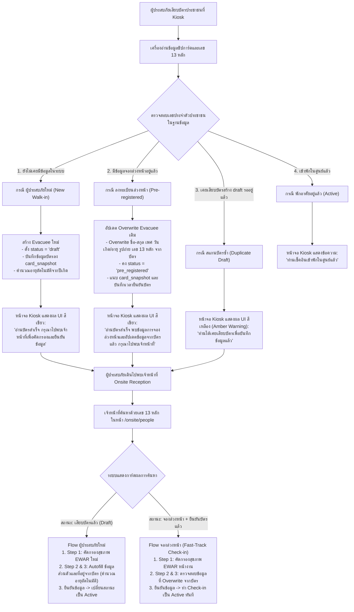

# สเปคระบบอ่านบัตรประชาชนและการลงทะเบียนผู้ประสบภัย (Smart Card Reader & Evacuee Registration)

**สรุป (BLUF):**  
ย้ายการเก็บข้อมูลชิปบัตรประชาชนจากการสร้าง doc `scanner_draft` มาสร้าง entity `evacuee` โดยตรง กำหนดสถานะ `current_stay.status = 'draft'` (สำหรับผู้ประสบภัยใหม่) หรือแนบ `card_snapshot` เข้า doc เดิม (สำหรับผู้ที่ `pre_registered` ล่วงหน้า) · หน้าจอเจ้าหน้าที่ Onsite (`/onsite/people`) ใช้ช่องค้นหาเดิมตรวจพบสถานะ _"เสียบบัตรแล้ว"_ แล้วเข้าสู่กระบวนการคัดกรองสุขภาพ (Step 1 EWAR) ตั้งแต่ต้นทุกกรณี · Autofill ข้อมูลบุคคล (Step 2) และที่อยู่ตามบัตร (Step 3) เพื่อให้เจ้าหน้าที่ถามยืนยันและแก้ไขได้อิสระ · ไม่นับยอดสถานะ `draft` ใน Occupancy และไม่แสดงใน Public Portal

---

## 1. วัตถุประสงค์และภาพรวม (Objectives & Scope)

เพื่อลดเวลาการบันทึกข้อมูลหน้างาน ณ จุดรับเข้าศูนย์พักพิง (Onsite Reception Desk) จากเดิม 3–5 นาที ให้เหลือเพียง 30–60 วินาที โดยยังคงความถูกต้องตามมาตรฐานระบาดวิทยา (EWAR/Triage) และสุขอนามัยศูนย์พักพิง

### ข้อกำหนดสำคัญ (Core Invariants):

1. **Editable & Manual Override:** ข้อมูลทุกช่องที่ Autofill จากบัตรประชาชนจะต้องไม่ถูกล็อกตาย เจ้าหน้าที่และผู้ประสบภัยสามารถแก้ไขตัวสะกดหรือปรับเปลี่ยนที่อยู่จริงได้ตลอดเวลา
2. **Mandatory Onsite Screening:** ผู้ประสบภัยทุกราย (ทั้งผู้ประสบภัยใหม่และผู้ที่จองล่วงหน้า) **ต้องผ่านการประเมินอาการเจ็บป่วย (Step 1: EWAR & Screening) หน้างานใหม่ตั้งแต่ต้น**
3. **Data Privacy & Search-First (Task #187):** ไม่มีหน้ารวมรายชื่อผู้เสียบบัตรเปิดค้างไว้ เจ้าหน้าที่ค้นหาเฉพาะรายบุคคลด้วยเลขประจำตัวประชาชน 13 หลัก หรือชื่อ-นามสกุล

---

## 2. แผนผังการทำงานของระบบ (End-to-End System Flow)

---

## 3. ตารางความต้องการเชิงหน้าที่ (Functional Requirements & Acceptance Criteria)

### 3.1 Kiosk Card Scanner & Inbound API

- **FR-CARD-01:** เมื่อเสียบบัตรประชาชน เครื่องอ่านจะส่ง payload มายัง `POST /api/v1/scanner/draft`
- **FR-CARD-02:** หาก CID 13 หลักยังไม่เคยมีในฐานข้อมูลศูนย์ ให้สร้าง doc `evacuee` ใหม่ โดยกำหนด:
  - `_id`: `"evacuee:{ulid}"`
  - `current_stay.status`: `"draft"`
  - `person_id`: `{ cardType: 'national_id', number: card.citizen_id }`
  - `first_name`, `last_name`, `gender`, `birth_year`, `age`: Map จากชิปบัตร (คำนวณ `age = currentBEYear() - birth_year` อัตโนมัติเสมอ)
  - `card_snapshot`: เก็บ snapshot ข้อมูลบัตรและที่อยู่ตามทะเบียนบ้าน พร้อม **คำนวณและบันทึกรหัสไปรษณีย์ (`postal_code`) อัตโนมัติ** ผ่านพจนานุกรมตำบล/อำเภอ/จังหวัดของระบบ (`thailand-location`)
  - `household_id`: `null`
- **FR-CARD-03 (Pre-registered Overwrite):** หาก CID 13 หลักมีสถานะเป็น `pre_registered` อยู่แล้ว:
  - คงสถานะ `pre_registered` ไว้
  - **Overwrite** ข้อมูลส่วนตัวใน doc `evacuee` ด้วยข้อมูลทางการจากบัตรประชาชน (ชื่อ-นามสกุล, เพศ, ปีเกิด, อายุ, รูปถ่ายหน้าบัตร, เลขประจำตัวประชาชน)
  - อัปเดตแนบ `card_snapshot` เข้า doc เดิม และประทับเวลา `card_verified_at`
- **FR-CARD-04 (Duplicate Draft Warning):** หาก CID 13 หลักมีรายการสถานะ `draft` รออยู่แล้ว:
  - ตอบกลับสถานะ `duplicate_draft`
  - หน้าจอ Kiosk แสดงผล **UI สีเหลือง (Amber Warning)** พร้อมข้อความ: _"ท่านได้เคยเสียบบัตรเพื่อบันทึกข้อมูลแล้ว"_ และแจ้งให้ถอดบัตรออกไปพบเจ้าหน้าที่
- **FR-CARD-05:** ข้อความตอบสนองหน้าจอ Kiosk:
  - ผู้ประสบภัยใหม่: _"อ่านบัตรสำเร็จ กรุณาไปพบเจ้าหน้าที่เพื่อคัดกรองและยืนยันข้อมูล"_ (UI สีเขียว)
  - ผู้จองล่วงหน้า: _"อ่านบัตรสำเร็จ พบข้อมูลการจองล่วงหน้าและอัปเดตข้อมูลจากบัตรแล้ว กรุณาไปพบเจ้าหน้าที่เพื่อคัดกรอง"_ (UI สีเขียว)
  - ผู้สแกนซ้ำ: _"ท่านได้เคยเสียบบัตรเพื่อบันทึกข้อมูลแล้ว"_ (UI สีเหลือง Amber)
  - ผู้เข้าพักแล้ว: _"ท่านได้เช็คอินเข้าพักในศูนย์แล้ว"_

### 3.2 Staff Onsite Search & Registration Flow (`/onsite/people`)

- **FR-STAFF-01:** ช่องค้นหาในหน้า `/onsite/people` เมื่อพิมพ์ค้นหาด้วยเลขบัตร 13 หลัก / เบอร์โทร / ชื่อ-นามสกุล หากพบเอกสารที่มีสถานะ `draft` ให้แสดงป้ายกำกับ `[ 🪪 เสียบบัตรแล้ว (รอคัดกรอง) ]` ในโทนสีเหลือง/อำพัน พร้อมปุ่ม Action: `[ ดำเนินการคัดกรองและลงทะเบียน (Step 1) ]`
- **FR-STAFF-02 (Step 1 - Screening):** เมื่อเปิดฟอร์มลงทะเบียน ระบบต้องเริ่มที่ Step 1 คัดกรองสุขภาพ (EWAR Symptoms & Medical Triage) เสมอ
- **FR-STAFF-03 (Step 2 - Personal Info):** Autofill ข้อมูลจาก `card_snapshot` (คำนำหน้า, ชื่อ, นามสกุล, เลข 13 หลัก, เพศ, วันเกิด/อายุ, รูปถ่าย) และคำนวณอายุจากปีเกิด พ.ศ. อัตโนมัติ โดยเจ้าหน้าที่ซักถามเพิ่มเติมเฉพาะ เบอร์โทรศัพท์, ศาสนา, โรคประจำตัว, ประวัติแพ้ยา/อาหาร, และกลุ่มเปราะบาง
- **FR-STAFF-04 (Step 3 - Household & Address):**
  - Autofill ข้อมูลที่อยู่ตามทะเบียนบ้านจาก `card_snapshot` ลงในฟอร์มที่อยู่อัตโนมัติไปก่อน (รวมถึง **รหัสไปรษณีย์ `postal_code`** ที่ระบบดึงมาจาก `card_snapshot` หรือ map อัตโนมัติจากตำบล/อำเภอ/จังหวัด)
  - แสดงป้ายแจ้งเตือนให้เจ้าหน้าที่สอบถามยืนยันกับผู้ประสบภัยว่า "ปัจจุบันพักอาศัยอยู่ที่นี่จริงหรือไม่"
  - เจ้าหน้าที่สามารถคลิกแก้ไข (Manual Override) ได้อิสระ
  - ระบบทำการค้นหาและจับคู่ครอบครัวเดิมอัตโนมัติ (Automated Family Matching)
- **FR-STAFF-05 (Completion & Invariants):** เมื่อเจ้าหน้าที่บันทึกฟอร์มเสร็จสิ้น:
  - อัปเดตสถานะ `evacuee` จาก `draft` $\rightarrow$ `active`
  - สร้างหรือผูก `household_id` (CR-076: onsite ต้องมี household เสมอ)
  - บันทึก `movement` แอ็กชัน `check_in`
  - ออกบัตรผ่าน Digital Pass / Wristband

### 3.3 การลงทะเบียนและจัดการเครื่องสแกน (Device Hardware Registry)

- **FR-DEVICE-01:** เครื่องอ่านบัตร Kiosk ทุกเครื่องต้องลงทะเบียนเป็นเอกสาร `scanner_device` ใน DB `registry` ตรงกลาง
- **FR-DEVICE-02:** ประกอบด้วยข้อมูล: `device_id`, `name`, `shelter_code`, `station_name`, `secret_hash`, `status`
- **FR-DEVICE-03:** Inbound API (`POST /api/v1/scanner/draft`) ตรวจสอบความถูกต้องของ `X-Device-Id` และ `X-Device-Secret` กับ DB `registry` ก่อนอนุญาตให้บันทึกข้อมูลเข้าสู่ฐานข้อมูลศูนย์พักพิง (`shelter_{shelter_code}`)

> ❓ **Architecture Open Question (Registry vs Shelter DB):**
> - **การออกแบบปัจจุบัน (Current Design):** จัดเก็บ `scanner_device` ไว้ใน DB `registry` ตรงกลาง เพื่อให้ Inbound Gateway สามารถตรวจพิสูจน์ตัวตนเครื่องอ่านบัตร (Authentication & Shelter Routing) ได้รวดเร็วใน 1 query โดยตัว Kiosk ไม่ต้องแนบ `shelter_code` มาใน Header
> - **แนวทางวิเคราะห์เพื่อตัดสินใจในอนาคต (Tradeoffs):**
>   - *กรณีคงไว้ที่ `registry`:* บริหารจัดการ Hardware Asset และ Heartbeat ได้จากส่วนกลาง ป้องกัน Device ID ซ้ำซ้อน เหมาะกับโมเดล Remote-First Cloud
>   - *กรณีย้ายลง `shelter_{shelter_code}`:* ให้สิทธิ์ผู้จัดการศูนย์พักพิง (`shelter_manager`) เพิ่ม/ลบเครื่องได้เอง และรองรับ Disaster Edge Node (Offline แยกศูนย์) ได้ดียิ่งขึ้น โดยจะต้องปรับ Kiosk Client ให้ส่ง Header `X-Shelter-Code` แนบมาด้วย

---

## 4. มาตรฐานความปลอดภัยและการคุ้มครองข้อมูล (PDPA & Data Governance)

1. **Isolation from Occupancy Views:** สถานะ `draft` จะต้องไม่ถูกนับรวมในผลรวมยอดผู้เข้าพัก (Active Occupancy) หรือยอดจอง (Pre-registered Quota) ในหน้า Dashboard และสถิติศูนย์พักพิง
2. **Isolation from Public Tier:** สถานะ `draft` จะต้องถูกกรองออก ไม่แสดงใน Public Directory / Search ทุกกรณี
3. **Draft Retention & Expiry (24 Hours):** เอกสารสถานะ `draft` ที่ไม่มีการมายืนยันตัวตนกับเจ้าหน้าที่ภายใน 24 ชั่วโมง จะถูกซ่อนจากผลการค้นหา และมี Batch / Purge job ดำเนินการล้างข้อมูลตามนโยบาย PDPA

