# Volunteer Job Board — Feature Flow & User Journeys

## สรุป (TL;DR)

- เพิ่ม flow **Job Board** ต่อศูนย์: ประกาศงาน → อาสาสมัคร → จัดกะ → ปรับงานได้ตลอดโดย **Shelter Manager**
- ขยาย Module A (FR-42/43, T-28/T-29) จาก "ลงทะเบียน + มอบหมายกะ" เป็น **"ตลาดงาน + กะตั้งค่าได้ + ปรับงานได้เสมอ"**
- **เจ้าของ Job Board = SM เท่านั้น** · SA ไม่ทำ job ops · (ถ้าเปิด) หัวหน้างานช่วยภายใต้ SM
- อาสามี **อย่างน้อย 2 ชั้น:** *operational* / *staff-capable* — วิธีมอบสิทธิ์ตามกะยังเปิดที่ **D-DUTY-ACCESS**
- **Track ตัวตนบน login:** แยกว่า user เป็น **อาสา (volunteer)** หรือ **staff ประจำ** ได้ชัดเจนผ่าน `_users.affiliation_tags` (CR-002) — **ไม่**ใช้ RoleKey เป็นตัวบอก (เคาะ **D-AFFIL**)
- เอกสารนี้เป็น **draft for review** ผูก **[CR-041](../changes/CR-041-module-a-volunteer-job-board.md)** (`proposed`) — ยังไม่ bump schema / ยังไม่แก้ PRD·`06-A` จนกว่า CR approved

---

## 1. Purpose & scope

| | |
| --- | --- |
| **จุดประสงค์** | ให้ทีมและ stakeholder มีภาพ flow / journey / ข้อตัดสินใจเดียวกันก่อนลงมือออกแบบ schema และ UI |
| **ในขอบเขตรอบคุยนี้** | Job board ต่อ shelter · สมัครอาสาเข้าระบบ · กะตั้งค่าได้ต่อ job · ปรับแต่ง job ได้ตลอด · roles ที่เกี่ยวข้อง |
| **นอกขอบเขตรอบนี้** | schema field ละเอียด, API contract, UI wireframe, effort estimate, Change Record |
| **Baseline ที่อิง** | [Module A](../task-breakdown/06-A.md) T-28/T-29 · [R3 FR-42/43](../prd/phase-r3-operations.md) · [role matrix](../prd/role-permission-matrix.md) · schema `volunteer` / `shift_assignment` |

### 1.1 สิ่งที่มีใน baseline แล้ว vs สิ่งที่เสนอเพิ่ม

| หัวข้อ | Baseline (ปัจจุบันใน docs) | เสนอในเอกสารนี้ (คุย) |
| --- | --- | --- |
| โปรไฟล์อาสา + skills + availability | FR-42 / T-28 · doc `volunteer:{ulid}` | คงไว้; ผูกกับ job application |
| มอบหมายกะ | FR-43 / T-29 · `shift_assignment` (`morning`/`afternoon`/`night` + `station`) | ขยายเป็น **กะตั้งค่าได้ต่อ job** |
| เจ้าของงานอาสา / Job Board | `shelter_manager` (ไม่มี VC role) | **ยืนยัน:** SM เป็นผู้จัดการ job ทั้งศูนย์ · SA ไม่ทำ job ops · ถามเฉพาะว่าจะมี **หัวหน้างาน** ช่วยภายใต้ SM หรือไม่ |
| ประกาศงานให้สมัคร (job board) | ยังไม่มี entity แยก | **เพิ่ม** job posting + application (เขียนโดย SM) |
| Demand จาก SOP | FR-45 → FR-43 (สร้าง demand ให้จับคู่) | Job อาจถูกสร้างจาก demand หรือมือ (decision) |
| Public nav อาสา | CR-005 **defer** `/volunteer*` บน public portal | ต้องตัดสินว่าสมัครผ่าน public / login / ทั้งคู่ |
| สิทธิ์ตามหน้าที่/กะ | Job/กะ ≠ permission; สิทธิ์มาจาก RoleKey เท่านั้น | แยกชั้นอาสา + เปิด **D-DUTY-ACCESS** |
| แยก volunteer vs staff ประจำบน login | `_users.affiliation_tags` (CR-002) มีแล้ว แต่ยังไม่บังคับใช้ใน Module A UI | **D-AFFIL เคาะแล้ว:** ต้อง track ชัดบน user |

---

## 2. Actors & responsibilities

> **คำเตือน RBAC:** คำว่า *Volunteer* ในเอกสารนี้คือ **domain/profile** (`volunteer:{ulid}` หรือ `affiliation_tags: ["volunteer"]`) — **ไม่ใช่** `RoleKey`. ห้ามใช้ `"volunteer"` ใน permission check (CR-002).

### 2.0 สองชั้นของอาสา (สำคัญก่อนอ่าน journey)

Job Board จัดคนเข้างาน — **ไม่ได้ให้สิทธิ์ระบบโดยอัตโนมัติ**. แยกประเภทก่อนออกแบบ UX/RBAC:

| ชั้น | ตัวอย่างงาน | ใช้ระบบวันปฏิบัติ | สิ่งที่ต้องการจากระบบ | เทียบ RoleKey ปัจจุบัน |
| --- | --- | --- | --- | --- |
| **Operational volunteer** | หั่นผัก / ขนของ / ประตู / แจกอาหาร | น้อยหรือแทบไม่ใช้ | โปรไฟล์ · สมัคร job · ดูตารางกะ · (opt) เช็คอินกะ | **ไม่ต้องมี** RoleKey — schedule พอ |
| **Staff-capable volunteer** | รับสมัครผู้อพยพ · (อาจ) ครัวเบิกของ / คลัง | ใช้ flow ของหน้าที่นั้น | login + สิทธิ์เขียนตามหน้าที่ (+ อาจจำกัดตามกะ — ดู D-DUTY-ACCESS) | ต้องถือ RoleKey ที่ตรงงาน เช่น `registration_staff` |

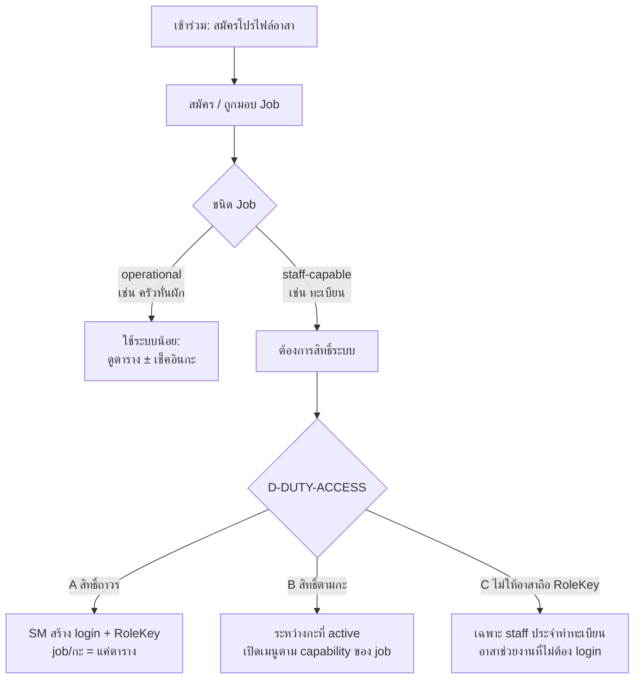
```mermaid
flowchart TB
  JOIN[เข้าร่วม: สมัครโปรไฟล์อาสา] --> APPLY[สมัคร / ถูกมอบ Job]
  APPLY --> TIER{ชนิด Job}
  TIER -->|operational<br/>เช่น ครัวหั่นผัก| OP[ใช้ระบบน้อย:<br/>ดูตาราง ± เช็คอินกะ]
  TIER -->|staff-capable<br/>เช่น ทะเบียน| SC[ต้องการสิทธิ์ระบบ]
  SC --> DUTY{D-DUTY-ACCESS}
  DUTY -->|A สิทธิ์ถาวร| R1[SM สร้าง login + RoleKey<br/>job/กะ = แค่ตาราง]
  DUTY -->|B สิทธิ์ตามกะ| R2[ระหว่างกะที่ active<br/>เปิดเมนูตาม capability ของ job]
  DUTY -->|C ไม่ให้อาสาถือ RoleKey| R3[เฉพาะ staff ประจำทำทะเบียน<br/>อาสาช่วยงานที่ไม่ต้อง login]
```

> **Baseline วันนี้:** การถูก assign กะ "ทะเบียน" **ยังไม่เปิด** registration flow ให้ — ต้องมี `registration_staff` (หรือ SM) บน login user. การผูกสิทธิ์กับกะ = การเปลี่ยน RBAC ที่ต้องเคาะก่อน (และมี CR ถ้า approve)

### 2.0b Track ตัวตน: Volunteer vs Staff ประจำ (confirmed — D-AFFIL)

**ความต้องการ:** user ในระบบต้อง **แยกได้ชัด** ว่าเป็นอาสาสมัครหรือ staff ประจำของศูนย์/ระบบ — โดยไม่สับสนกับ RoleKey หน้าที่งาน

| ชั้นข้อมูล | เก็บที่ | ใช้ทำอะไร | ไม่ใช้ทำอะไร |
| --- | --- | --- | --- |
| **หน้าที่ / สิทธิ์** | `_users.roles[]` → RoleKey (`registration_staff`, `kitchen_staff`, …) | เปิด/ปิดเมนูและ write path | บอกว่าเป็นอาสาหรือพนักงานประจำ |
| **สังกัด / ชนิดคน** | `_users.affiliation_tags[]` | **track** ว่าเป็นอาสา (`volunteer`) หรือไม่; filter/รายชื่อ/รายงาน | ให้สิทธิ์, เปลี่ยน shelter scope, bypass guard |
| **โปรไฟล์อาสา (domain)** | `volunteer:{ulid}` (+ `user_name` ชี้ login ถ้ามี) | skills, availability, job/กะ | เป็น permission |

**กติกาแปลความ (confirmed):**

| สถานะบน login `_users` | แปลในผลิตภัณฑ์ | ตัวอย่าง |
| --- | --- | --- |
| มี RoleKey + **ไม่มี** tag `volunteer` | **Staff ประจำ** | พนักงานทะเบียนรับเงินเดือน / เจ้าหน้าที่ศูนย์ |
| มี RoleKey + **มี** tag `volunteer` | **อาสาที่ถือสิทธิ์ระบบ** (staff-capable volunteer) | อาสาช่วยทะเบียน — สิทธิ์เท่า REG แต่ติดป้ายอาสา |
| มี tag `volunteer` (± login ดูตาราง) **ไม่มี** RoleKey เขียน | **อาสา operational** (หรืออาสาที่มีบัญชีดูตารางอย่างเดียว) | หั่นผัก มีบัญชีดูกะ |
| มี `volunteer:{ulid}` **ไม่มี** `_users` | อาสาในระบบแต่ยังไม่มี login | สมัครโปรไฟล์อย่างเดียว |

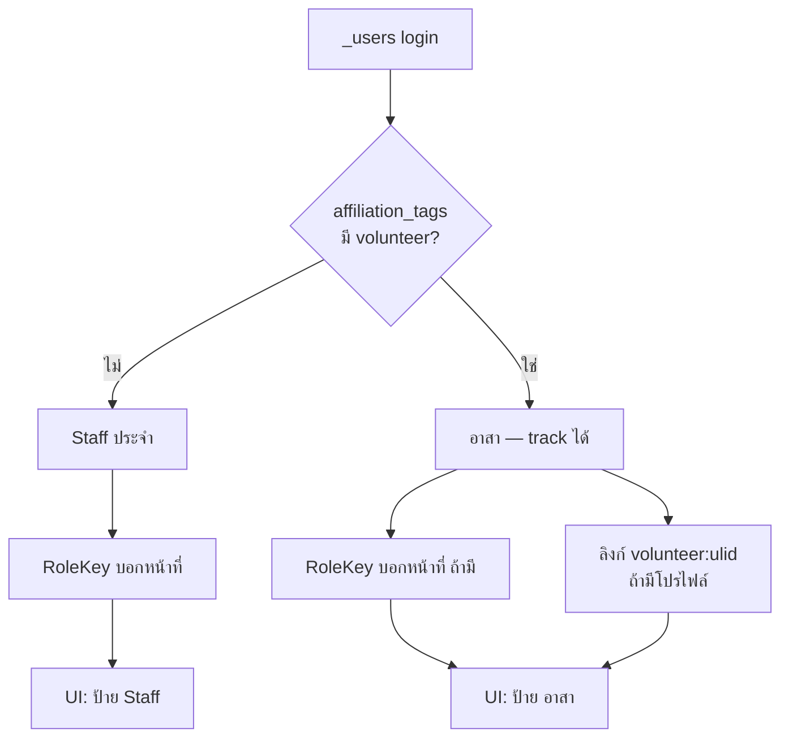
```mermaid
flowchart TB
  U[_users login] --> Q{affiliation_tags<br/>มี volunteer?}
  Q -->|ไม่| STAFF[Staff ประจำ]
  Q -->|ใช่| VOL[อาสา — track ได้]
  STAFF --> R1[RoleKey บอกหน้าที่]
  VOL --> R2[RoleKey บอกหน้าที่ ถ้ามี]
  VOL --> P[ลิงก์ volunteer:ulid<br/>ถ้ามีโปรไฟล์]
  R1 --> UI[UI: ป้าย Staff]
  R2 --> UI2[UI: ป้าย อาสา]
  P --> UI2
```

**กฎที่ต้องทำใน Module A / user admin (หลังเคาะลง implement):**

| ID | กฎ |
| --- | --- |
| R-AFFIL-1 | เมื่อ SM สร้าง login ให้อาสา (หรือผูก `volunteer.user_name`) ระบบต้องตั้ง `affiliation_tags` ให้มี `"volunteer"` — **ห้าม**เดาจาก RoleKey อัตโนมัติถ้าสร้าง staff ประจำ |
| R-AFFIL-2 | เมื่อ SM สร้าง staff ประจำ ห้ามใส่ `"volunteer"` โดยปริยาย; ช่องชนิดคนต้องเลือกชัด **Staff ประจำ** vs **อาสา** |
| R-AFFIL-3 | รายชื่อ user / สมาชิกกะ / audit แสดงป้าย **อาสา** หรือ **Staff** จาก tag (ไม่จากชื่อ role) |
| R-AFFIL-4 | Filter ได้: เฉพาะอาสา / เฉพาะ staff ประจำ / ทั้งหมด ในขอบเขตศูนย์ |
| R-AFFIL-5 | `affiliation_tags` ยังคง **metadata only** ตาม CR-002 — guard ห้ามอ่าน tag แทน RoleKey |

> ไม่ต้องสร้าง RoleKey ใหม่ชื่อ `volunteer` และไม่ต้อง field ซ้ำอีกชุดถ้าใช้ `affiliation_tags` ตามสัญญา CR-002 — งานที่ขาดคือ **บังคับใส่ + แสดงใน UI** ให้ครบตาม R-AFFIL-1..4

### 2.1 หลักการเจ้าของงาน (confirmed)

| ชั้นงาน | ผู้รับผิดชอบ | ไม่ใช่หน้าที่ของ |
| --- | --- | --- |
| **Job ops ของศูนย์** — สร้าง/แก้/พัก/ปิด job · ตั้งกะ · อนุมัติสมัคร · มอบหมาย/ถอน · ดูคนขาด | **Shelter Manager** (และหัวหน้างานถ้าเปิด ภายใต้การมอบของ SM) | **System Admin** |
| **Platform config** — skill master list ทั้งระบบ · preset template กะมาตรฐาน (ถ้ามี) · break-glass ข้ามศูนย์เมื่อระบบล่ม | System Admin | ไม่แทน SM จัดการ board ปกติ |

> **กฎ:** SA **ไม่มี journey จัดการ job ของศูนย์**. มีสิทธิ์ platform-wide ตาม matrix แต่ UI/flow ของ Module A ต้องออกแบบให้ **SM เป็นผู้ใช้หลักของ Job Board** — ไม่พึ่ง SA เป็นคนคอยดูแลประกาศหรือจัดกะ

| Actor | ตัวในระบบ | หน้าที่ใน flow นี้ | หมายเหตุ |
| --- | --- | --- | --- |
| **อาสา — operational** | domain profile ± login ดูตาราง | สมัครโปรไฟล์ · สมัคร job · ดูกะ · มาทำงานหน้างาน | **ไม่**ได้สิทธิ์เขียนระบบจาก job |
| **อาสา — staff-capable** | domain profile + (ถ้าเคาะ) login + RoleKey | เหมือน operational + ใช้ flow ตามหน้าที่ (เช่น `/people/register`) | สิทธิ์มาจาก RoleKey / grant ตาม D-DUTY-ACCESS — **ไม่**จาก tag `volunteer` |
| **Shelter Manager (SM)** | `shelter_manager` | Job Board ops ทั้งศูนย์ · อนุมัติสมัคร · มอบหมายกะ · (ถ้า staff-capable) ออก/ถอน login+role · (ถ้ามี) มอบ job ให้หัวหน้างาน | **เจ้าของ Job Board ของศูนย์** (confirmed) |
| **หัวหน้างาน / Job Lead** | **[NEEDS DECISION]** | ถ้ามี: ดูแล job เฉพาะที่ SM มอบ · ปรับกะ · เช็คเข้างาน · เสนอรายชื่อ | สิทธิ์มาจาก SM ไม่ใช่จาก SA; **ไม่**แทนการออก RoleKey เองถ้าไม่ได้รับมอบ |
| **Staff ประจำ (KS/WS/REG)** | RoleKey ภายใน | ทำงานระบบตาม role; อาจเป็นคนเดียวกับอาสา staff-capable | SM ⊇ ตาม matrix · `affiliation_tags` ไม่ให้สิทธิ์ |
| **System Admin (SA)** | `system_admin` | skill master / preset template ทั้งแพลตฟอร์มเท่านั้น | **นอกขอบเขต job ops** — ไม่สร้าง/แก้/อนุมัติ job ของศูนย์ใน flow ปกติ |
| **SOP / Resource Calc** | ระบบ (Module B) | คำนวณ `volunteers_needed` → ป้อน demand ให้ **SM** | input ของ job ไม่ใช่ actor คน |

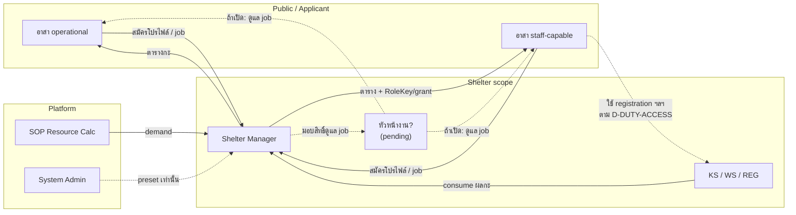
```mermaid
flowchart LR
  subgraph public["Public / Applicant"]
    VOL_OP["อาสา operational"]
    VOL_SC["อาสา staff-capable"]
  end
  subgraph shelter["Shelter scope"]
    SM["Shelter Manager"]
    JL["หัวหน้างาน?<br/>(pending)"]
    STAFF["KS / WS / REG"]
  end
  subgraph platform["Platform"]
    SA["System Admin"]
    SOP["SOP Resource Calc"]
  end
  VOL_OP -->|สมัครโปรไฟล์ / job| SM
  VOL_SC -->|สมัครโปรไฟล์ / job| SM
  SM -->|ตารางกะ| VOL_OP
  SM -->|ตาราง + RoleKey/grant| VOL_SC
  JL -.->|ถ้าเปิด: ดูแล job| VOL_OP
  JL -.->|ถ้าเปิด: ดูแล job| VOL_SC
  SM -.->|มอบสิทธิ์ดูแล job| JL
  SOP -->|demand| SM
  SA -.->|preset เท่านั้น| SM
  STAFF -->|consume ผลกะ| SM
  VOL_SC -.->|ใช้ registration ฯลฯ<br/>ตาม D-DUTY-ACCESS| STAFF
```

---

## 3. Domain concepts (ภาษาคุย — ยังไม่ใช่ schema)

| Concept | ความหมายสั้น | เทียบ baseline |
| --- | --- | --- |
| **Volunteer profile** | คนอาสา 1 คน: ติดต่อ, skills, availability, สถานะ | = `volunteer` |
| **Job (posting)** | ตำแหน่งงานที่ศูนย์ประกาศ เช่น "ครัวกลาง", "ประตูหน้า", "ทะเบียน" | ใกล้ `station` แต่เป็น **entity ที่ประกาศ/สมัครได้** · ควรระบุ tier/capability (operational vs staff-capable) |
| **Job application** | การสมัครของอาสาเข้า job หนึ่ง ๆ (รออนุมัติ / รับ / ปฏิเสธ) | **ใหม่** |
| **Duty access** | กลไกให้สิทธิ์เขียนระบบตามหน้าที่/กะ | **ใหม่ / pending** — ดู D-DUTY-ACCESS; baseline ยังไม่มี |
| **Shift template** | รูปแบบกะของ job (ชื่อ, เวลาเริ่ม-จบ, ความจุ, ทักษะที่ต้อง) | ขยายจาก enum ตายตัว `morning/afternoon/night` |
| **Shift slot / instance** | กะจริงในวันหนึ่งของ job | ส่วนหนึ่งของ `shift_assignment` หรือแยก entity (decision) |
| **Assignment** | การผูกอาสาเข้า slot | = `shift_assignment` (อาจต้องลิงก์ `job_id`) |
| **Demand** | จำนวนคน/ทักษะที่ต้องการจาก SOP | FR-45 → FR-43 |

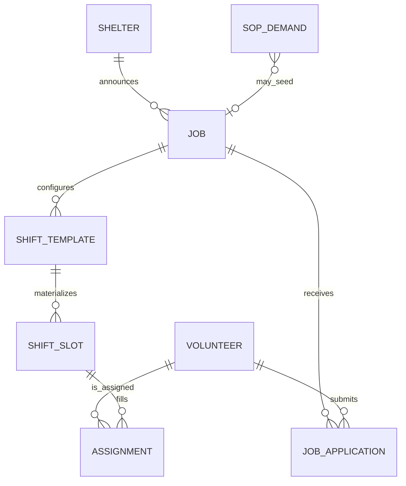
```mermaid
erDiagram
  SHELTER ||--o{ JOB : announces
  JOB ||--o{ SHIFT_TEMPLATE : configures
  JOB ||--o{ JOB_APPLICATION : receives
  VOLUNTEER ||--o{ JOB_APPLICATION : submits
  SHIFT_TEMPLATE ||--o{ SHIFT_SLOT : materializes
  VOLUNTEER ||--o{ ASSIGNMENT : is_assigned
  SHIFT_SLOT ||--o{ ASSIGNMENT : fills
  SOP_DEMAND }o--o| JOB : may_seed
```

---

## 4. End-to-end feature flow

### 4.1 ภาพรวมระบบ

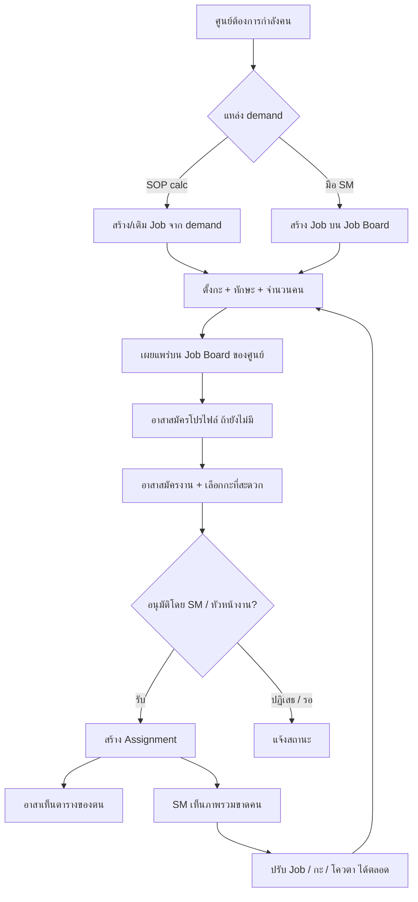
```mermaid
flowchart TB
  A[ศูนย์ต้องการกำลังคน] --> B{แหล่ง demand}
  B -->|SOP calc| C[สร้าง/เติม Job จาก demand]
  B -->|มือ SM| D[สร้าง Job บน Job Board]
  C --> E[ตั้งกะ + ทักษะ + จำนวนคน]
  D --> E
  E --> F[เผยแพร่บน Job Board ของศูนย์]
  F --> G[อาสาสมัครโปรไฟล์ ถ้ายังไม่มี]
  G --> H[อาสาสมัครงาน + เลือกกะที่สะดวก]
  H --> I{อนุมัติโดย SM / หัวหน้างาน?}
  I -->|รับ| J[สร้าง Assignment]
  I -->|ปฏิเสธ / รอ| K[แจ้งสถานะ]
  J --> L[อาสาเห็นตารางของตน]
  J --> M[SM เห็นภาพรวมขาดคน]
  M --> N[ปรับ Job / กะ / โควตา ได้ตลอด]
  N --> E
```

### 4.2 State machine — Job

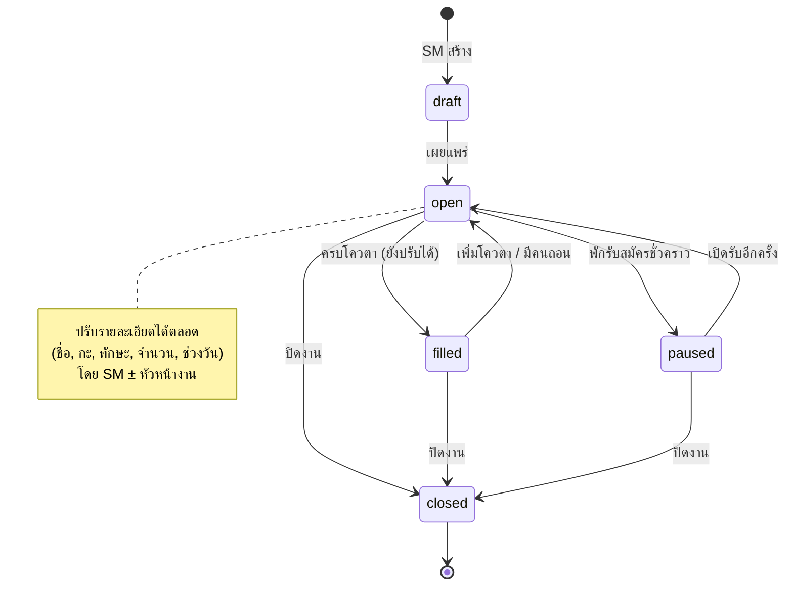
```mermaid
stateDiagram-v2
  [*] --> draft: SM สร้าง
  draft --> open: เผยแพร่
  open --> paused: พักรับสมัครชั่วคราว
  paused --> open: เปิดรับอีกครั้ง
  open --> filled: ครบโควตา (ยังปรับได้)
  filled --> open: เพิ่มโควตา / มีคนถอน
  open --> closed: ปิดงาน
  filled --> closed: ปิดงาน
  paused --> closed: ปิดงาน
  closed --> [*]
  note right of open
    ปรับรายละเอียดได้ตลอด
    (ชื่อ, กะ, ทักษะ, จำนวน, ช่วงวัน)
    โดย SM ± หัวหน้างาน
  end note
```

### 4.3 State machine — Application

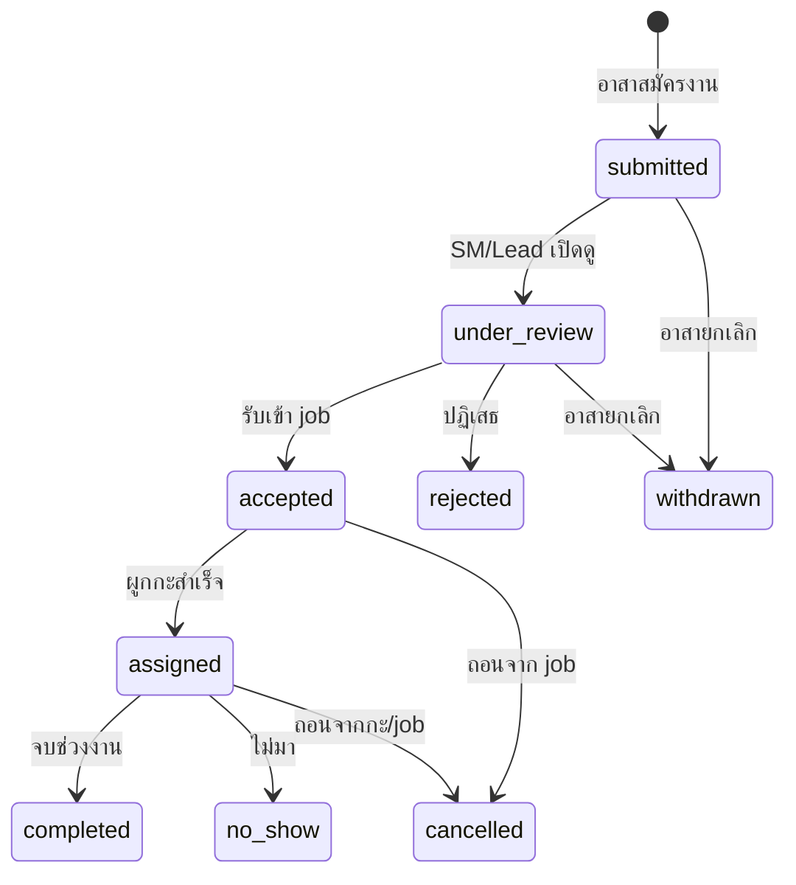
```mermaid
stateDiagram-v2
  [*] --> submitted: อาสาสมัครงาน
  submitted --> under_review: SM/Lead เปิดดู
  under_review --> accepted: รับเข้า job
  under_review --> rejected: ปฏิเสธ
  submitted --> withdrawn: อาสายกเลิก
  under_review --> withdrawn: อาสายกเลิก
  accepted --> assigned: ผูกกะสำเร็จ
  accepted --> cancelled: ถอนจาก job
  assigned --> completed: จบช่วงงาน
  assigned --> no_show: ไม่มา
  assigned --> cancelled: ถอนจากกะ/job
```

### 4.4 State machine — Shift assignment

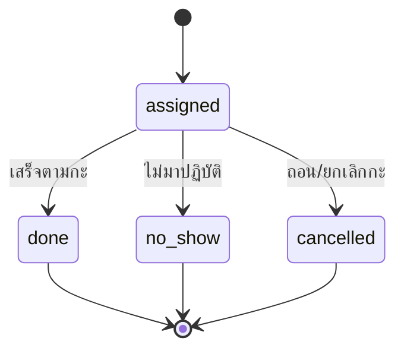
```mermaid
stateDiagram-v2
  [*] --> assigned
  assigned --> done: เสร็จตามกะ
  assigned --> no_show: ไม่มาปฏิบัติ
  assigned --> cancelled: ถอน/ยกเลิกกะ
  done --> [*]
  no_show --> [*]
  cancelled --> [*]
```

---

## 5. User journeys ราย role

### 5.0 UJ-JOIN — Journey เข้าร่วมเป็นอาสา (ทุกประเภท)

**Goal:** จากนอกระบบ → มี `volunteer` profile → ได้ (หรือรอบน) job/กะ  
**ครอบคลุม:** คนที่ยังไม่รู้ว่าจะไปชั้น operational หรือ staff-capable

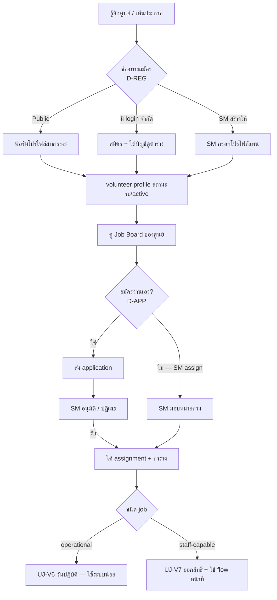
```mermaid
flowchart TB
  A[รู้จักศูนย์ / เห็นประกาศ] --> B{ช่องทางสมัคร<br/>D-REG}
  B -->|Public| C[ฟอร์มโปรไฟล์สาธารณะ]
  B -->|มี login จำกัด| D[สมัคร + ได้บัญชีดูตาราง]
  B -->|SM สร้างให้| E[SM กรอกโปรไฟล์แทน]
  C --> F[volunteer profile สถานะรอ/active]
  D --> F
  E --> F
  F --> G[ดู Job Board ของศูนย์]
  G --> H{สมัครงานเอง?<br/>D-APP}
  H -->|ใช่| I[ส่ง application]
  H -->|ไม่ — SM assign| J[SM มอบหมายตรง]
  I --> K[SM อนุมัติ / ปฏิเสธ]
  K -->|รับ| L[ได้ assignment + ตาราง]
  J --> L
  L --> M{ชนิด job}
  M -->|operational| N[UJ-V6 วันปฏิบัติ — ใช้ระบบน้อย]
  M -->|staff-capable| O[UJ-V7 ออกสิทธิ์ + ใช้ flow หน้าที่]
```

| ขั้น | ผลที่ต้องมี |
| --- | --- |
| สมัครโปรไฟล์ | มี `volunteer:{ulid}` (skills, availability, ติดต่อ) |
| เข้า job | มี application และ/หรือ assignment |
| แยกชั้น | job (หรือ capability ของ job) บอกว่ารอบถัดไปเป็น UJ-V6 หรือ UJ-V7 |

**Acceptance (คุย):** คนนอกศูนย์เริ่มจากศูนย์ว่างจนเห็นตารางกะของตนได้ · ยังไม่ต้องถือ RoleKey ถ้า job เป็น operational

---

### 5.1 UJ-V1 — อาสาสมัครเข้าสู่ระบบครั้งแรกแล้วสมัครงาน (operational ตัวอย่าง)

**Persona:** มานี อายุ 28 ทักษะครัว · อยากช่วยศูนย์ใกล้บ้าน  
**Goal:** มีโปรไฟล์ในระบบ และได้ที่บนกะครัว (ชั้น **operational**)  
**ต่อเนื่องจาก:** UJ-JOIN → แยกไป UJ-V6 ในวันปฏิบัติ

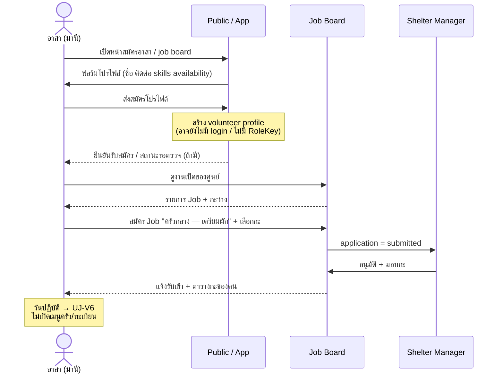
```mermaid
sequenceDiagram
  actor V as อาสา (มานี)
  participant P as Public / App
  participant JB as Job Board
  participant SM as Shelter Manager

  V->>P: เปิดหน้าสมัครอาสา / job board
  P->>V: ฟอร์มโปรไฟล์ (ชื่อ ติดต่อ skills availability)
  V->>P: ส่งสมัครโปรไฟล์
  Note over P: สร้าง volunteer profile<br/>(อาจยังไม่มี login / ไม่มี RoleKey)
  P-->>V: ยืนยันรับสมัคร / สถานะรอตรวจ (ถ้ามี)
  V->>JB: ดูงานเปิดของศูนย์
  JB-->>V: รายการ Job + กะว่าง
  V->>JB: สมัคร Job "ครัวกลาง — เตรียมผัก" + เลือกกะ
  JB->>SM: application = submitted
  SM->>JB: อนุมัติ + มอบกะ
  JB-->>V: แจ้งรับเข้า + ตารางกะของตน
  Note over V: วันปฏิบัติ → UJ-V6<br/>ไม่เปิดเมนูครัว/ทะเบียน
```

| ขั้น | Actor | ระบบทำอะไร | ผลที่เห็น |
| --- | --- | --- | --- |
| 1 | อาสา | กรอกโปรไฟล์ + skills + availability | มี `volunteer` profile |
| 2 | อาสา | เลือกศูนย์ / ดู job ที่ `open` | เห็นโควตาและกะว่าง |
| 3 | อาสา | สมัคร job + กะที่สะดวก | application `submitted` |
| 4 | SM | อนุมัติ + assign | assignment + ตารางฝั่งอาสา |
| 5 | อาสา | ดู/อัปเดต availability ของตน | ไม่ชนกะเดิม (validation) |

**Acceptance (คุย):** อาสาสมัครครบจนเห็นตารางได้ในหนึ่ง session · PII ถูก mask จาก public/EOC ตาม NFR-20 · **ไม่**ได้ RoleKey จากขั้นตอนนี้

---

### 5.2 UJ-V2 — Shelter Manager เปิด Job Board และเติมคนให้ครบกะ

**Persona:** สมชาย SM ศูนย์เทศบาล · occupancy สูง · SOP บอกต้องการอาสาครัว 6 คน/มื้อ  
**Goal:** มี job + กะที่ตั้งค่าได้ และเห็นว่าขาดกี่คน

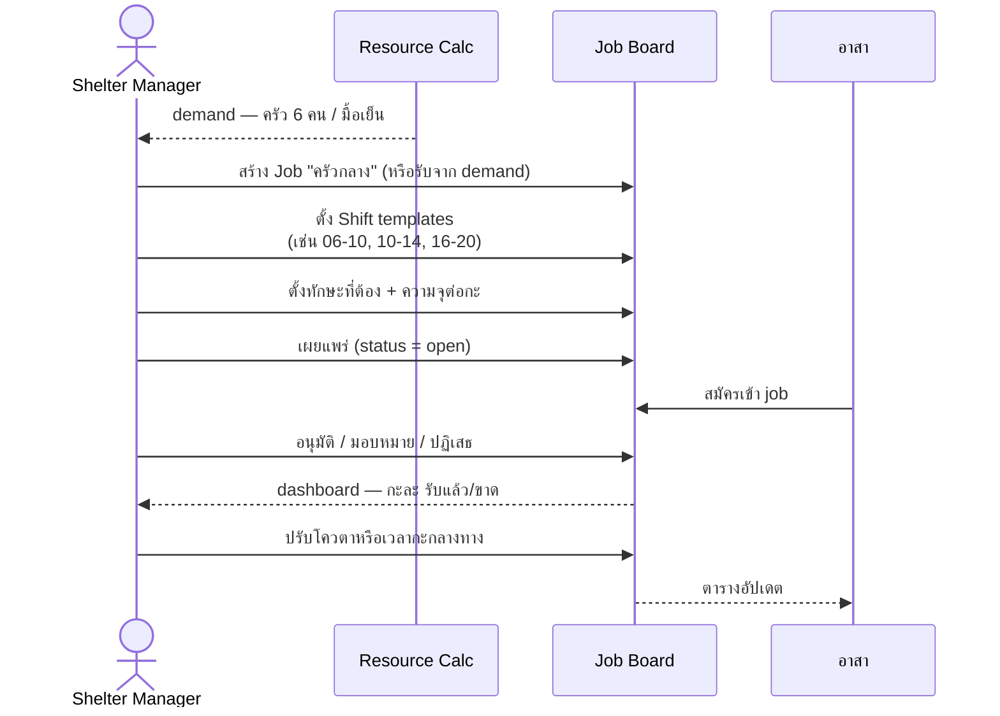
```mermaid
sequenceDiagram
  actor SM as Shelter Manager
  participant SOP as Resource Calc
  participant JB as Job Board
  participant V as อาสา

  SOP-->>SM: demand — ครัว 6 คน / มื้อเย็น
  SM->>JB: สร้าง Job "ครัวกลาง" (หรือรับจาก demand)
  SM->>JB: ตั้ง Shift templates<br/>(เช่น 06-10, 10-14, 16-20)
  SM->>JB: ตั้งทักษะที่ต้อง + ความจุต่อกะ
  SM->>JB: เผยแพร่ (status = open)
  V->>JB: สมัครเข้า job
  SM->>JB: อนุมัติ / มอบหมาย / ปฏิเสธ
  JB-->>SM: dashboard — กะละ รับแล้ว/ขาด
  SM->>JB: ปรับโควตาหรือเวลากะกลางทาง
  JB-->>V: ตารางอัปเดต
```

| ขั้น | Actor | ระบบทำอะไร | ผลที่เห็น |
| --- | --- | --- | --- |
| 1 | SM (±SOP) | สร้าง job จากมือหรือ demand | job `draft`→`open` |
| 2 | SM | ตั้งกะแบบกำหนดเวลาเองต่อ job | ไม่ถูกจำกัดแค่ morning/afternoon/night |
| 3 | SM | เปิดรับ + ดู applications | คิวจนมีคนครบ |
| 4 | SM | assign / ถอน / ปรับโควตา | history + ไม่ซ้อนเวลา |
| 5 | SM | ปิดหรือพัก job | หยุดรับสมัคร แต่ประวัติคงอยู่ |

**Acceptance (คุย):** SM เห็น "ต้องการ N / ได้ M / ขาด K" ต่อกะ · ปรับ job แล้วอาสาที่ได้รับมอบหมายถูกแจ้งผล

---

### 5.3 UJ-V3 — ปรับ Job กลางทาง (always adjustable)

**Persona:** สมชายพบว่ามื้อเย็นต้องการอาสาเพิ่ม และเลื่อนเวลาครัว  
**Goal:** แก้ job/กะโดยไม่ต้องสร้าง entity ใหม่ทุกครั้ง

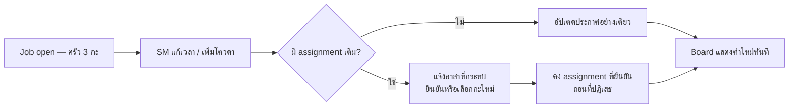
```mermaid
flowchart LR
  A[Job open — ครัว 3 กะ] --> B[SM แก้เวลา / เพิ่มโควตา]
  B --> C{มี assignment เดิม?}
  C -->|ใช่| D[แจ้งอาสาที่กระทบ<br/>ยืนยันหรือเลือกกะใหม่]
  C -->|ไม่| E[อัปเดตประกาศอย่างเดียว]
  D --> F[คง assignment ที่ยืนยัน<br/>ถอนที่ปฏิเสธ]
  E --> G[Board แสดงค่าใหม่ทันที]
  F --> G
```

**กฎที่เสนอให้คุย (ยังไม่เคาะ):**

| ID | กฎ | เหตุผลสั้น |
| --- | --- | --- |
| R-ADJ-1 | Job ที่ `open`/`filled`/`paused` **แก้ metadata ได้เสมอ** โดย SM | ตาม requirement ข้อ 4 |
| R-ADJ-2 | การเปลี่ยนเวลา/ยกเลิกกะที่คนครองอยู่ต้องมี **confirm + notify** | กันอาสาไม่รู้ว่ากะเลื่อน |
| R-ADJ-3 | การลดโควตาต่ำกว่าจำนวนที่รับแล้ว = บังคับเลือกคนที่จะถอน หรือห้ามลดจนกว่าจะถอน | กันข้อมูลขัดแย้ง |
| R-ADJ-4 | Audit ว่าใครแก้อะไรเมื่อไร | governance / UAT |

---

### 5.4 UJ-V4 — หัวหน้างาน (ถ้าเปิด role/tag นี้)

> **[NEEDS DECISION: D-LEAD]** ดู §7

**Persona (สมมติ):** วิภา เป็นอาสาอาวุโสที่ SM มอบให้ดูแล job "ประตูหน้า"  
**Goal:** จัดการกะของ job ตนโดยไม่ต้องให้ SM ทุกครั้ง

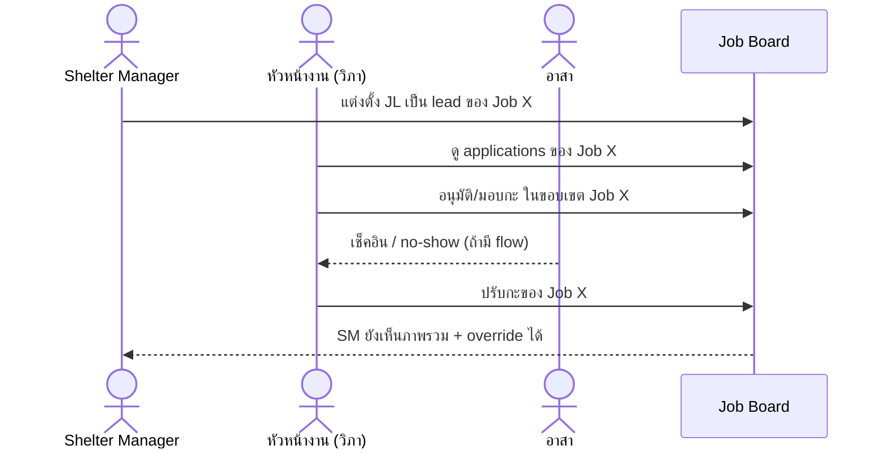
```mermaid
sequenceDiagram
  actor SM as Shelter Manager
  actor JL as หัวหน้างาน (วิภา)
  actor V as อาสา
  participant JB as Job Board

  SM->>JB: แต่งตั้ง JL เป็น lead ของ Job X
  JL->>JB: ดู applications ของ Job X
  JL->>JB: อนุมัติ/มอบกะ ในขอบเขต Job X
  V-->>JL: เช็คอิน / no-show (ถ้ามี flow)
  JL->>JB: ปรับกะของ Job X
  JB-->>SM: SM ยังเห็นภาพรวม + override ได้
```

| สิ่งที่ JL ทำได้ (ข้อเสนอคุย) | สิ่งที่ JL ทำไม่ได้ |
| --- | --- |
| อนุมัติสมัครใน job ที่ถูกมอบ | สร้าง job ใหม่ของศูนย์ (เฉพาะ SM) |
| ตั้ง/แก้กะของ job ตน | เปลี่ยน lead คนอื่น |
| บันทึก done / no_show | เห็น PII อาสาข้ามศูนย์ / ข้าม job |
| เสนอ demand เพิ่มไปยัง SM | ปิดศูนย์ / ตั้งค่า SA |

---

### 5.5 UJ-V5 — System Admin ตั้งค่า platform (ไม่ใช่ผู้จัดการ job)

> SA **ไม่**มีขั้นตอนสร้าง/แก้/อนุมัติ job ของศูนย์ ใน journey นี้ SA จัดเฉพาะ master ที่ SM นำไปใช้

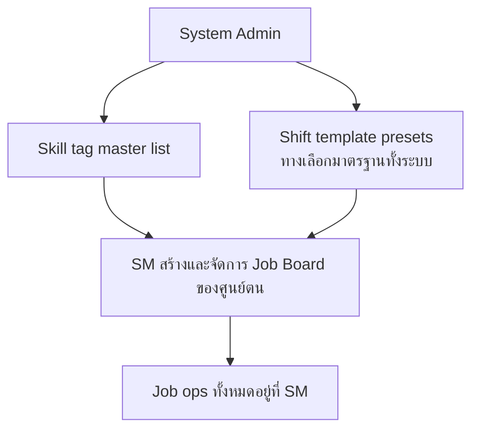
```mermaid
flowchart TB
  SA[System Admin] --> S1[Skill tag master list]
  SA --> S2[Shift template presets<br/>ทางเลือกมาตรฐานทั้งระบบ]
  S1 --> SM[SM สร้างและจัดการ Job Board ของศูนย์ตน]
  S2 --> SM
  SM --> JOBS[Job ops ทั้งหมดอยู่ที่ SM]
```

| SA ทำได้ | SA ไม่ทำใน flow ปกติ |
| --- | --- |
| ดูแล skill master / preset กะทั้งแพลตฟอร์ม | สร้าง/แก้/ปิด job ของศูนย์ |
| Break-glass ข้ามศูนย์เมื่อระบบล่ม (ตาม SA global) | อนุมัติ application หรือจัดกะแทน SM |
| | เป็น "คนคอยดูแล" Job Board ประจำ |

---

### 5.6a UJ-AFFIL — SM แยก / กรอง อาสา vs staff ประจำ

**Persona:** สมชาย SM · ศูนย์มีทั้งพนักงานทะเบียนประจำและอาสาช่วยทะเบียนที่ถือ role เดียวกัน  
**Goal:** เห็นและกรองได้ว่าใครเป็นอาสา ใครเป็น staff จริง

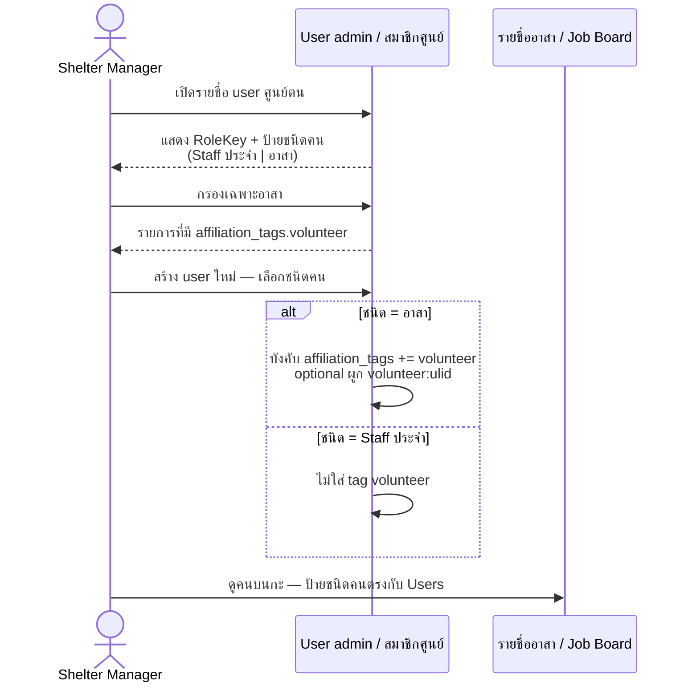
```mermaid
sequenceDiagram
  actor SM as Shelter Manager
  participant Users as User admin / สมาชิกศูนย์
  participant Vol as รายชื่ออาสา / Job Board

  SM->>Users: เปิดรายชื่อ user ศูนย์ตน
  Users-->>SM: แสดง RoleKey + ป้ายชนิดคน<br/>(Staff ประจำ | อาสา)
  SM->>Users: กรองเฉพาะอาสา
  Users-->>SM: รายการที่มี affiliation_tags.volunteer
  SM->>Users: สร้าง user ใหม่ — เลือกชนิดคน
  alt ชนิด = อาสา
    Users->>Users: บังคับ affiliation_tags += volunteer<br/>optional ผูก volunteer:ulid
  else ชนิด = Staff ประจำ
    Users->>Users: ไม่ใส่ tag volunteer
  end
  SM->>Vol: ดูคนบนกะ — ป้ายชนิดคนตรงกับ Users
```

| ขั้น | ระบบทำอะไร | ผลที่เห็น |
| --- | --- | --- |
| 1 | อ่าน `roles` + `affiliation_tags` | คอลัมน์/ป้ายชนิดคนแยกจากหน้าที่ |
| 2 | Filter ตาม tag | รายชื่ออาสาหรือ staff ประจำอย่างเดียว |
| 3 | สร้าง/แก้ user | ฟอร์มบังคับเลือกชนิดคน (R-AFFIL-1/2) |
| 4 | ผูกโปรไฟล์อาสา | `volunteer.user_name` ↔ login (ถ้ามี) |

**Acceptance (คุย):** คนที่ถือ `registration_staff` สองคน — หนึ่งมี tag อาสา หนึ่งไม่มี — แยกใน UI ได้ทุกจอรายชื่อที่เกี่ยวข้อง · การเปลี่ยนป้ายไม่เปลี่ยนสิทธิ์จนกว่าจะแก้ RoleKey

---

### 5.6 UJ-V6 — วันปฏิบัติ operational (ตัวอย่าง: อาสาหั่นผัก / เตรียมครัว)

**Persona:** มานี ถูกมอบกะ "ครัวกลาง — เตรียมผัก" 06:00–10:00  
**Goal:** รู้ว่าต้องมาเมื่อไหร่ แล้วไปทำงานหน้างาน — **ไม่พึ่งแอประหว่างหั่นผัก**  
**ชั้น:** operational

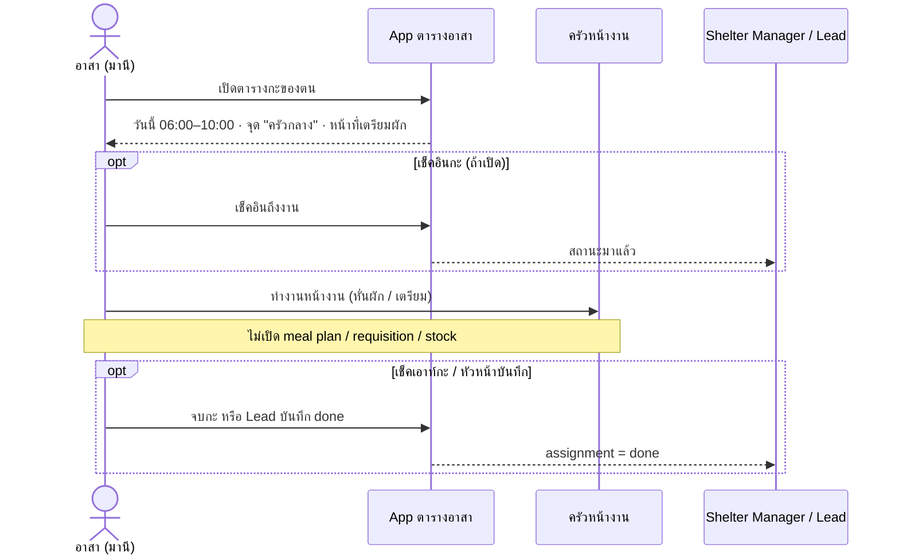
```mermaid
sequenceDiagram
  actor V as อาสา (มานี)
  participant App as App ตารางอาสา
  participant Kit as ครัวหน้างาน
  participant SM as Shelter Manager / Lead

  V->>App: เปิดตารางกะของตน
  App-->>V: วันนี้ 06:00–10:00 · จุด "ครัวกลาง" · หน้าที่เตรียมผัก
  opt เช็คอินกะ (ถ้าเปิด)
    V->>App: เช็คอินถึงงาน
    App-->>SM: สถานะมาแล้ว
  end
  V->>Kit: ทำงานหน้างาน (หั่นผัก / เตรียม)
  Note over V,Kit: ไม่เปิด meal plan / requisition / stock
  opt เช็คเอาท์กะ / หัวหน้าบันทึก
    V->>App: จบกะ หรือ Lead บันทึก done
    App-->>SM: assignment = done
  end
```

| ขั้น | ใช้ระบบ? | หมายเหตุ |
| --- | --- | --- |
| ดูกะล่วงหน้า / วันงาน | ใช่ (เบา) | ตาราง + จุดงาน + ช่วงเวลา |
| เช็คอิน/เช็คเอาท์กะ | optional | ไม่ใช่ registration/kitchen write |
| หั่นผัก / เตรียมของ | **ไม่** | อยู่นอกขอบเขตแอป |
| เบิกวัตถุดิบ / แผนมื้อ | **ไม่** | เป็นของ `kitchen_staff` / SM |

**Acceptance (คุย):** operational volunteer ทำงานครบกะได้โดยไม่ต้องมี RoleKey · UI ไม่หลอกว่ามีเมนูครัว/ทะเบียน

---

### 5.7 UJ-V7 — อาสา staff-capable รับสมัครผู้อพยพ (สิทธิ์ตามหน้าที่)

**Persona:** ปริยา มีทักษะทะเบียน · ได้ job "จุดรับสมัคร" กะ 08:00–12:00  
**Goal:** ใช้ registration flow ตามหน้าที่ในช่วงที่ได้รับมอบหมาย  
**ชั้น:** staff-capable · **ขึ้นกับ D-DUTY-ACCESS**

> **ช่องว่าง baseline:** การ assign กะทะเบียนอย่างเดียว **ยังไม่เปิด** `/people/register`. ต้องมีกลไกออกสิทธิ์ตามทางเลือกด้านล่าง

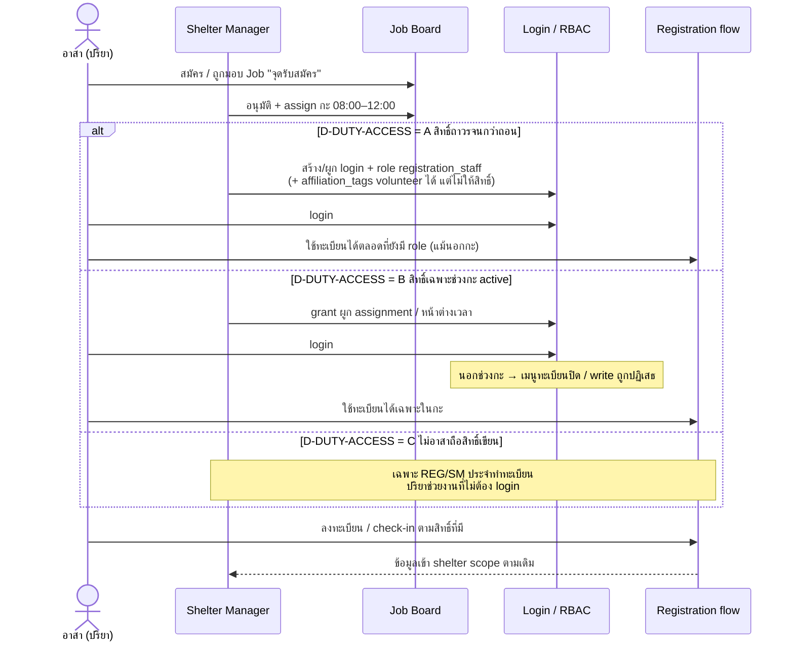
```mermaid
sequenceDiagram
  actor V as อาสา (ปริยา)
  participant SM as Shelter Manager
  participant JB as Job Board
  participant Auth as Login / RBAC
  participant Reg as Registration flow

  V->>JB: สมัคร / ถูกมอบ Job "จุดรับสมัคร"
  SM->>JB: อนุมัติ + assign กะ 08:00–12:00
  alt D-DUTY-ACCESS = A สิทธิ์ถาวรจนกว่าถอน
    SM->>Auth: สร้าง/ผูก login + role registration_staff<br/>(+ affiliation_tags volunteer ได้ แต่ไม่ให้สิทธิ์)
    V->>Auth: login
    V->>Reg: ใช้ทะเบียนได้ตลอดที่ยังมี role (แม้นอกกะ)
  else D-DUTY-ACCESS = B สิทธิ์เฉพาะช่วงกะ active
    SM->>Auth: grant ผูก assignment / หน้าต่างเวลา
    V->>Auth: login
    Note over Auth: นอกช่วงกะ → เมนูทะเบียนปิด / write ถูกปฏิเสธ
    V->>Reg: ใช้ทะเบียนได้เฉพาะในกะ
  else D-DUTY-ACCESS = C ไม่อาสาถือสิทธิ์เขียน
    Note over SM,Reg: เฉพาะ REG/SM ประจำทำทะเบียน<br/>ปริยาช่วยงานที่ไม่ต้อง login
  end
  V->>Reg: ลงทะเบียน / check-in ตามสิทธิ์ที่มี
  Reg-->>SM: ข้อมูลเข้า shelter scope ตามเดิม
```

| ทางเลือก D-DUTY-ACCESS | พฤติกรรมที่อาสาเห็น | ข้อดี | ข้อเสีย / ความเสี่ยง |
| --- | --- | --- | --- |
| **A — RoleKey ถาวร** | ได้เมนูทะเบียนเหมือน staff จนกว่า SM ถอน role | สอดคล้อง matrix ปัจจุบัน; implement ง่าย | สิทธิ์กว้างกว่ากะ; ต้อง discipline ถอนเมื่อเลิกช่วย |
| **B — สิทธิ์ตามกะ/เวลา** | ในกะ: ใช้ registration ได้ · นอกกะ: ดูตารางอย่างเดียว | ตรง intuition "หน้าที่ + เวลา" | RBAC ใหม่ (time-bound); กระทบ guard, sync, offline; ใกล้ stable core |
| **C — ไม่ให้อาสาเขียน** | ไม่มีทะเบียนบนบัญชีอาสา | lean สุด; ไม่แตะ matrix | ไม่ตอบเคสอาสาช่วยทะเบียนด้วยบัญชีตัวเอง |

**กฎที่เสนอคู่ทุกทางเลือก (ถ้าเลือก A หรือ B):**

| ID | กฎ |
| --- | --- |
| R-DUTY-1 | Job ที่ต้องการสิทธิ์เขียนต้องประกาศ **required RoleKey / capability** (เช่น `registration_staff`) ตอนสร้าง job |
| R-DUTY-2 | SM เป็นคนออก/ถอนสิทธิ์ (หรือยืนยัน grant) — ไม่ auto จากแค่กดสมัคร job |
| R-DUTY-3 | เมื่อออก login ให้อาสา ต้องตั้ง `affiliation_tags` มี `"volunteer"` ตาม **D-AFFIL** — **ห้าม**ใช้ tag แทน permission |
| R-DUTY-4 | นอก shelter scope ของ session = ปฏิเสธเหมือน staff คนอื่น |
| R-DUTY-5 | (เฉพาะ B) นอกหน้าต่างกะของ assignment ที่ active = อ่านตารางได้ แต่ write ตาม capability ของ job = ปฏิเสธ |

**Acceptance (คุย):**  
- เลือก A หรือ B แล้วมี path ให้ปริยาทำ registration ในศูนย์ตนได้  
- เลือก C แล้วเอกสาร/UI ไม่สัญญาว่าอาสาใช้ทะเบียนได้  
- ไม่ว่าเลือกอะไร ห้ามใช้คำว่า role `volunteer` เป็น permission check  
- ในรายชื่อ user / กะ ต้องเห็นป้ายว่าปริยาเป็น **อาสา** ไม่ปนกับ staff ประจำที่ถือ `registration_staff` เหมือนกัน

---

### 5.8 Journey map รวม (swimlane)

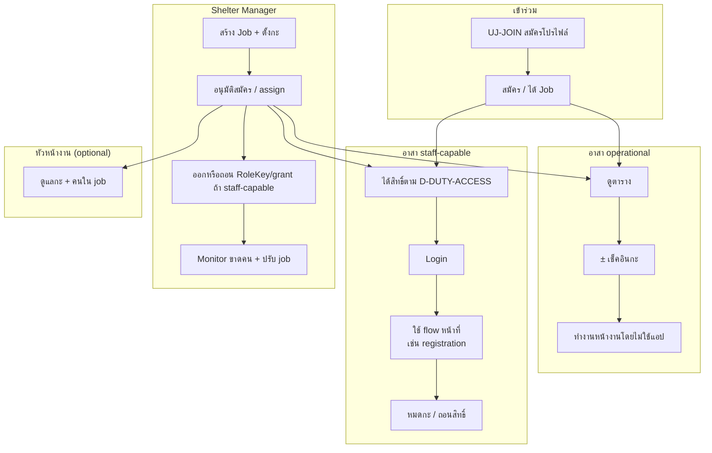
```mermaid
flowchart TB
  subgraph JOIN["เข้าร่วม"]
    J1[UJ-JOIN สมัครโปรไฟล์] --> J2[สมัคร / ได้ Job]
  end
  subgraph VOL_OP["อาสา operational"]
    O1[ดูตาราง] --> O2[± เช็คอินกะ]
    O2 --> O3[ทำงานหน้างานโดยไม่ใช้แอป]
  end
  subgraph VOL_SC["อาสา staff-capable"]
    C1[ได้สิทธิ์ตาม D-DUTY-ACCESS] --> C2[Login]
    C2 --> C3[ใช้ flow หน้าที่<br/>เช่น registration]
    C3 --> C4[หมดกะ / ถอนสิทธิ์]
  end
  subgraph SM_LANE["Shelter Manager"]
    S1[สร้าง Job + ตั้งกะ] --> S2[อนุมัติสมัคร / assign]
    S2 --> S3[ออกหรือถอน RoleKey/grant ถ้า staff-capable]
    S3 --> S4[Monitor ขาดคน + ปรับ job]
  end
  subgraph LEAD["หัวหน้างาน (optional)"]
    L1[ดูแลกะ + คนใน job]
  end
  J2 --> O1
  J2 --> C1
  S2 --> O1
  S2 --> C1
  S2 --> L1
```

---

## 6. Capability checklist (สำหรับคุย scope)

ใช้เป็นรายการยืนยันในห้องประชุม — ติ๊กว่าต้องมีใน R3 หรือเลื่อน

| ID | Capability | ผูก FR/Task เดิม | เสนอ | ต้องมีทันที? |
| --- | --- | --- | --- | --- |
| C-01 | สมัครโปรไฟล์อาสา + skills + availability | FR-42 / T-28 | คง | ☐ |
| C-02 | Job Board ต่อ shelter (สร้าง/เปิด/ปิด/พัก) | — (ขยาย FR-43) | **ใหม่** | ☐ |
| C-03 | อาสาสมัครเข้า job (application workflow) | — | **ใหม่** | ☐ |
| C-04 | กะตั้งค่าได้ต่อ job (เวลา + ความจุ + ทักษะ) | ขยาย T-29 / `shift_assignment` | **ขยาย** | ☐ |
| C-05 | Skill match suggest รายชื่อ | FR-43 | คง | ☐ |
| C-06 | Assign / ถอน + ไม่ซ้อนเวลา | FR-43 | คง | ☐ |
| C-07 | ปรับ job ได้ตลอด + notify ผู้กระทบ | requirement ข้อ 4 | **ใหม่** | ☐ |
| C-08 | Dashboard ขาดคนต่อกะ | T-29 DoD | คง | ☐ |
| C-09 | Demand จาก SOP เติม/สร้าง job | FR-45→43 | คง/ผูก | ☐ |
| C-10 | หัวหน้างานต่อ job | ไม่มีใน matrix | **optional** | ☐ |
| C-11 | อาสา login ดูตารางตัวเอง | `user_name` บน volunteer | คง/ชัดเจน | ☐ |
| C-12 | Public portal หน้า `/volunteer*` | CR-005 defer | เปิดหรือยัง | ☐ |
| C-13 | แยก job operational vs staff-capable (+ ประกาศ required RoleKey) | — | **ใหม่ (D-TIER)** | ☐ |
| C-14 | ออกสิทธิ์ให้อาสาใช้ registration/flow อื่น | role matrix | **ใหม่ (D-DUTY-ACCESS)** | ☐ |
| C-15 | เช็คอิน/เช็คเอาท์กะ (เบา) สำหรับ operational | — | optional | ☐ |
| C-16 | Track + แสดงป้ายอาสา vs staff ประจำบน user / กะ | CR-002 `affiliation_tags` | **ต้องมี (D-AFFIL)** | ☐ |
| C-17 | ฟอร์มสร้าง user บังคับเลือกชนิดคน + ตั้ง tag ให้ถูก | FR-34 / user admin | **ต้องมี (D-AFFIL)** | ☐ |
| C-18 | Filter รายชื่อตามชนิดคน | — | **ต้องมี (D-AFFIL)** | ☐ |

---

## 7. Open decisions (ต้องเคาะในที่ประชุม)

| ID | คำถาม | ทางเลือก | กระทบ |
| --- | --- | --- | --- |
| **D-OWNER** | ใครจัดการ Job Board ของศูนย์? | ✅ **เคาะแล้ว:** **SM** เป็นเจ้าของ job ops ทั้งศูนย์ · SA ไม่ดูแลประกาศ/กะ/อนุมัติใน flow ปกติ (เหลือแค่ platform master) | permission matrix Module A, UI primary user = SM |
| **D-AFFIL** | แยก track ว่า user เป็นอาสาหรือ staff ประจำอย่างไร? | ✅ **เคาะแล้ว:** ใช้ `_users.affiliation_tags` มี `"volunteer"` = อาสา; ไม่มี tag นี้ (+ มี RoleKey) = staff ประจำ · แสดงป้าย/กรองใน UI · **ไม่**สร้าง RoleKey `volunteer` · tag ไม่ให้สิทธิ์ (CR-002) | user admin UI, รายชื่อกะ, รายงาน; ไม่ bump schema ถ้าใช้ field เดิม |
| **D-TIER** | แยกอาสา operational vs staff-capable ในผลิตภัณฑ์ไหม? | A) แยกชัด (job มี capability tier) · B) ไม่แยก — ทุกอาสาแค่ schedule; สิทธิ์ออกแยกมือ · C) เฉพาะ operational ใน R3 เลื่อน staff-capable | UX, job schema, training |
| **D-DUTY-ACCESS** | อาสาที่งานต้องการระบบ (เช่น ทะเบียน) ได้สิทธิ์อย่างไร? | A) SM ออก **RoleKey ถาวร** (`registration_staff` ฯลฯ) คู่กับโปรไฟล์อาสา · B) **สิทธิ์ตามกะ/เวลา** ของ assignment · C) **ไม่อนุญาต** — เฉพาะ staff ประจำใช้ flow เขียน | **RBAC / อาจใกล้ stable core**; role matrix; guards; UJ-V7 |
| **D-LEAD** | ต้องมีหัวหน้างานไหม? | A) ไม่มี — SM ทำทั้งหมด · B) เป็น `affiliation_tags` / job-scoped grant ไม่ใช่ RoleKey · C) RoleKey ใหม่ (ต้าน lean matrix) — สิทธิ์มาจาก **SM** ไม่ใช่ SA | RBAC, UI, audit |
| **D-REG** | อาสาสมัครโปรไฟล์ผ่านช่องทางใด? | A) Public ไม่ login · B) สมัครแล้วได้ login จำกัด (ดูตาราง) · C) เฉพาะ SM สร้างให้ | Public surface, auth, CR-005, UJ-JOIN |
| **D-SHIFT** | โมเดลกะ | A) คง enum 3 กะ + ตั้งชื่อ station เป็น job · B) เวลาเริ่ม-จบอิสระต่อ job · C) template มาตรฐาน + override ต่อ job | schema `shift_assignment` bump |
| **D-APP** | การเข้า job | A) สมัครแล้วรออนุมัติ · B) auto-accept ถ้า skill match · C) SM assign อย่างเดียว (ไม่มี self-apply) | UX อาสา vs ภาระ SM |
| **D-DEMAND** | SOP → Job | A) auto-สร้าง draft job · B) แสดง demand ให้ SM กดสร้าง · C) แยกคนละจอ ไม่ผูก auto | Module B integration |
| **D-MULTI** | อาสาอยู่หลายศูนย์ได้ไหม? | A) โปรไฟล์กลางสมัครหลายศูนย์ · B) 1 โปรไฟล์ต่อศูนย์ | data model, PII |
| **D-PUBLIC** | เปิด nav อาสาบน public portal เมื่อใด? | A) พร้อม Module A · B) หลัง gate · C) เฉพาะ deep link | CR-005 |

> **ข้อเสนอแนะเพื่อคุย (ไม่ใช่มติ):** R3 เริ่มด้วย **D-TIER = A หรือ B** + **D-DUTY-ACCESS = A หรือ C** ก่อน — เลื่อน B (time-bound) ถ้าทีมยังไม่พร้อมแตะ RBAC ลึก; intuition "สิทธิ์เฉพาะในกะ" = เฟสถัดไปเมื่อ A ใช้จริงแล้วเจ็บจุด

### คำถามเสริมจาก R3 PRD (ยังเปิดอยู่)

- Volunteer ลงทะเบียนเองผ่าน public หรือผ่าน Coordinator/SM เท่านั้น? → รวมเข้า **D-REG**

---

## 8. Alignment กับ docs ปัจจุบัน (อย่าให้ drift)

| Doc | สถานะความสอดคล้องหลังคุย |
| --- | --- |
| `docs/task-breakdown/06-A.md` | อาจขยาย DoD T-28/T-29 หรือแยก task ย่อยเมื่อเคาะ C-02..C-07 |
| `docs/prd/phase-r3-operations.md` FR-42/43 | อาจขยาย consequences: job board + configurable shifts |
| `docs/prd/role-permission-matrix.md` | แก้ถ้า D-LEAD = C หรือ D-DUTY-ACCESS = B; D-AFFIL สอดคล้อง CR-002 อยู่แล้ว (metadata only) |
| `docs/data/schema.md` §6 `_users` | ใช้ `affiliation_tags` ตามสัญญาเดิม — **ไม่ต้อง field ใหม่** สำหรับ D-AFFIL พื้นฐาน |
| `docs/data/schema.md` §2.8–2.9 | น่าจะต้องมี `job` / `job_application` และขยาย `shift_assignment` — **หลังเคาะเท่านั้น + CR** |
| Public portal (CR-005) | ผูก D-PUBLIC / D-REG |
| Intake registration flows | ผูก UJ-V7 / D-DUTY-ACCESS เมื่อ staff-capable ใช้ `/people/*` |

> เอกสารนี้ผูก **[CR-041](../changes/CR-041-module-a-volunteer-job-board.md)** (`proposed`). ตาม [change-management](../change-management.md) การเคาะที่กระทบ field/workflow/role ต้อง approved ใน CR ก่อนลงมือแก้ canonical docs

---

## 9. Proposed discussion agenda (60–90 นาที)

1. ยืนยันวิสัยทัศน์ + **D-OWNER / D-AFFIL ปิดแล้ว** — 5 นาที  
2. เดิน **UJ-JOIN → UJ-V1/V6** vs **UJ-V7** + **UJ-AFFIL** (ป้ายอาสา/staff) — 20 นาที  
3. เคาะ **D-TIER + D-DUTY-ACCESS** (แนะนำเลื่อน time-bound ถ้ายังไม่พร้อม) — 20 นาที  
4. เคาะ **D-LEAD, D-REG, D-SHIFT, D-APP** — 15 นาที  
5. ติ๊ก capability checklist §6 (โดยเฉพาะ C-13..C-18) — 10 นาที  
6. นัดรอบปรับเอกสาร + ใครเขียน CR — 5 นาที  

---

## 10. Next steps หลังประชุม

1. ปิด open decisions ใน [CR-041](../changes/CR-041-module-a-volunteer-job-board.md) (§ Open decisions)  
2. PO ตั้ง CR-041 เป็น `approved`  
3. Apply canonical: schema · FR-42/43 · `06-A.md` · sitemap · matrix (ถ้าต้อง) · ตั้ง feature flow เป็น `active`  
4. แตก/ขยาย task แล้วค่อย implement  

---

## Appendix A — Glossary (ภาษาคุย)

| ศัพท์ | ความหมายในเอกสารนี้ |
| --- | --- |
| Job Board | หน้ารวมประกาศงานอาสาของหนึ่งศูนย์ |
| Job / Posting | ตำแหน่งงานหนึ่งรายการบน board |
| Application | คำสมัครของอาสาเข้า job |
| Shift template | นิยามกะ (ชื่อ/เวลา/ความจุ) ของ job |
| Assignment | การผูกคนเข้ากะในวันหนึ่ง |
| Demand | ความต้องการกำลังคนจาก SOP หรือจาก SM |
| Lead / หัวหน้างาน | คนที่ถูกมอบให้ดูแล job หนึ่ง (pending decision) |
| Operational volunteer | อาสาที่งานหลักอยู่นอกแอป (ครัวหน้างาน ฯลฯ) — ใช้ระบบแค่ตาราง/กะ |
| Staff-capable volunteer | อาสาที่งานต้องการ flow เขียนในระบบ (เช่น ทะเบียน) — ต้องมี RoleKey หรือ grant ตาม D-DUTY-ACCESS |
| Duty access | กลไกให้สิทธิ์ตามหน้าที่/กะ — **ยังไม่เคาะ** (D-DUTY-ACCESS) |
| Affiliation / ชนิดคน | การ track ว่าเป็นอาสาหรือ staff ประจำบน `_users.affiliation_tags` (D-AFFIL เคาะแล้ว) |
| Staff ประจำ | login ที่มี RoleKey และ**ไม่มี** `affiliation_tags` ค่า `volunteer` |

## Appendix B — Non-goals รอบคุยนี้

- Payroll / ค่าตอบแทนอาสา  
- Matching อัตโนมัติเต็มรูปแบบโดยไม่มีคนยืนยัน (ยกเว้นถ้าเลือก D-APP = B)  
- Mobile native app แยก  
- Cross-province volunteer marketplace  
- เปลี่ยน lean role model ทั้งระบบ (ยกเว้น D-LEAD = C หรือ D-DUTY-ACCESS = B บังคับหลังเคาะ)  
- ให้ `affiliation_tags: ["volunteer"]` เป็น permission (ห้าม — CR-002)  
- สร้าง RoleKey ชื่อ `volunteer` ซ้ำเพื่อใช้แยกชนิดคน (ใช้ tag แทน — D-AFFIL)
