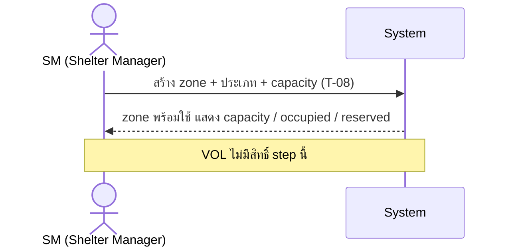
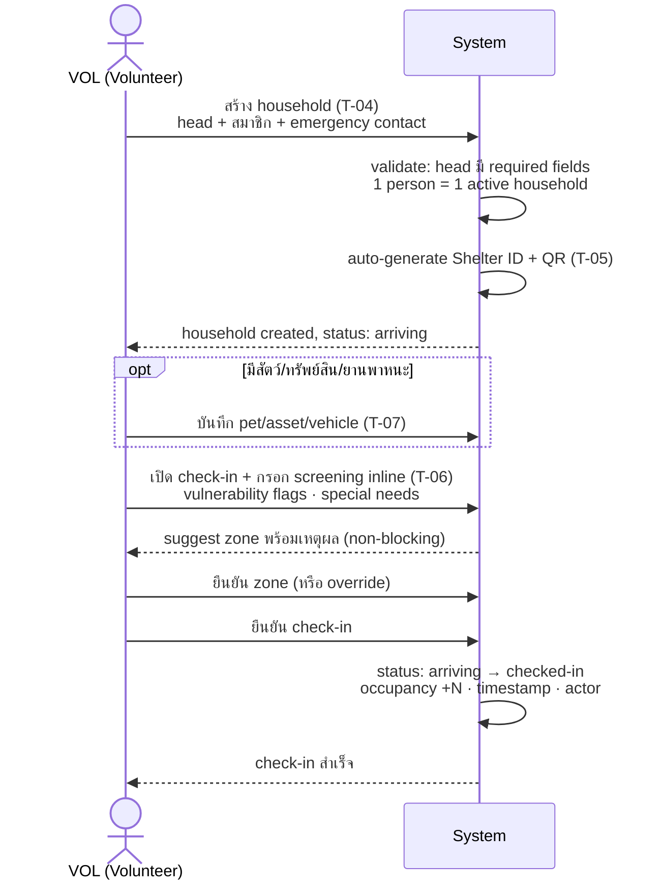
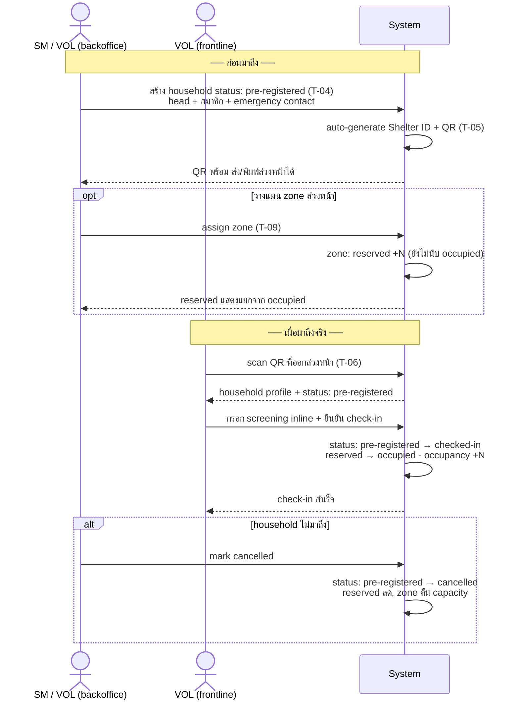
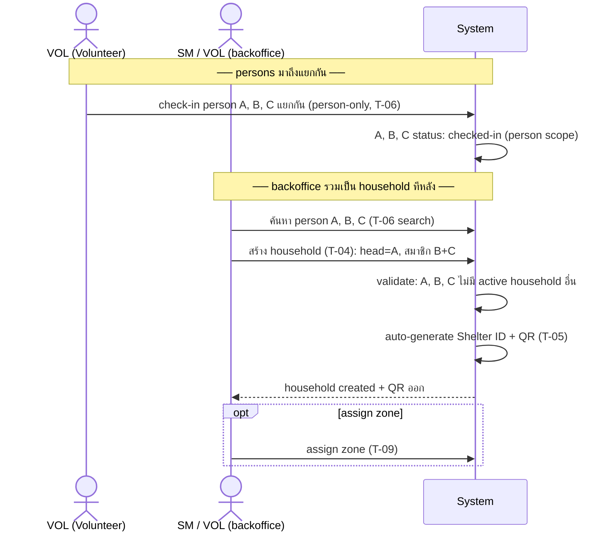
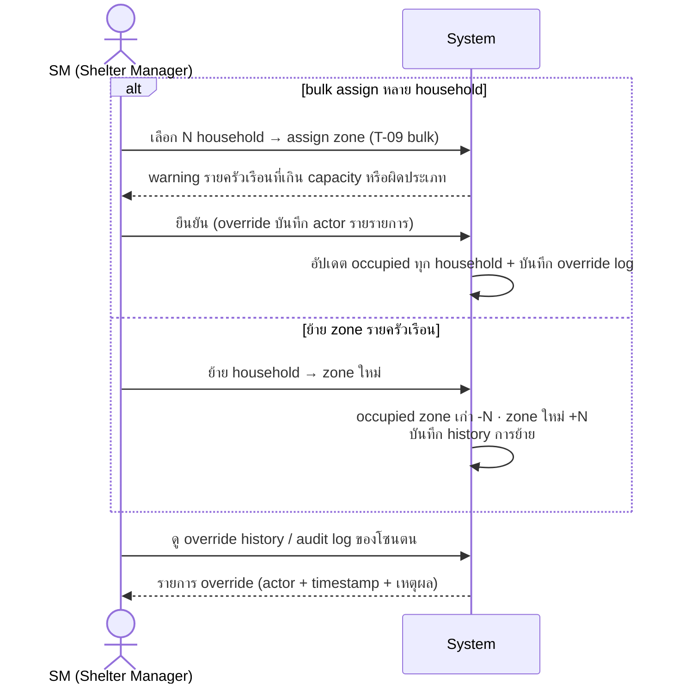
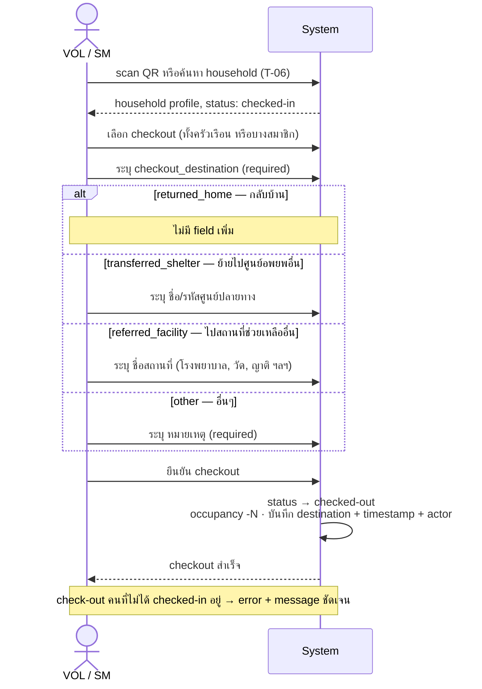

# Household & Zoning

> People & Search — household, member, shelter ID/QR, check-in/out, pet/asset, zone allocation

- **Team owner:** Team B — พีค, โฮป, ปิ๊ก (People/Household; ดู [Squad Roster](../prd/squad-roster.md))
- **Phase:** R2
- **Design input (บริษัท):** P-01 (ส่งมอบแล้ว)
- **Target ส่งมอบ:** ภายในสิงหาคม 2026

## Features / Tasks

| ID | Feature / Task | FR | Phase | Stage | Scope | Raw MD | AI× | Adj MD | Depends |
| --- | --- | --- | --- | --- | --- | --- | --- | --- | --- |
| T-04 | Household create + attach members + head | FR-21 | R2 | prod | ส.ค. | 6 | ÷1.6 | 4 | T-02 |
| T-05 | Household Shelter ID/QR generation | FR-22 | R2 | prod | ส.ค. | 4 | ÷1.6 | 2.5 | T-04 |
| T-06 | Household search + household check-in/out | FR-23 | R2 | prod | ส.ค. | 6 | ÷1.6 | 4 | T-05 |
| T-07 | Pet / asset / vehicle records | FR-24 | R2 | prod | ส.ค. | 3 | ÷1.6 | 2 | T-04 |
| T-08 | Zone definition + capacity | FR-25 | R2 | prod | ส.ค. | 4 | ÷1.6 | 2.5 | T-02 |
| T-09 | Zone allocation + suggest (warning-only) | FR-26 | R2 | prod | ส.ค. | 5 | ÷1.4 | 3.5 | T-08 |
| | **รวมทั้งโมดูล** | | | | | **28** | | **18.5** | |

## Task Details

> DoD ทุก prod task ยึด [Standard DoD](_index.md#standard-dod): **UI + data/write path + validation + permission + test + demo ของ slice** — รายการด้านล่างคือเกณฑ์เฉพาะของ task นั้นเพิ่มจากมาตรฐานกลาง

---

### T-04 — Household create + attach members + head (FR-21)

**Roles:** `SA ✓ · SM scope · VOL scope` — ดู [role-permission-matrix §3](../prd/role-permission-matrix.md#3-action-matrix--r2)

**Description:** สร้าง "ครัวเรือน" เป็น **optional grouping** เหนือ person record ของ baseline registration (FR-4..6) — ผูก person ตั้งแต่ 1 คนขึ้นไปเข้าครัวเรือน กำหนด/เปลี่ยนหัวหน้าครัวเรือน (head) ได้ โดย person-only flow ต้องทำงานได้โดยไม่บังคับสร้างครัวเรือน (PRD FR-21) — การจัดการและตั้งค่า Household จะแยกมาอยู่ใน **Stage 3 (จัดการตั้งค่าหัวหน้าครอบครัว)** อย่างชัดเจน เพื่อลดความสับสนกับฟอร์มข้อมูลบุคคลใน Stage 2 (ดู [CR-009](../changes/CR-009-register-household-flow.md))

รองรับ **3 creation path**:

| Path | ใคร | เมื่อไร | Status เริ่มต้น |
| --- | --- | --- | --- |
| **A — สร้าง ณ จุดรับ** | VOL | household มาถึงพร้อมกัน | `arriving` |
| **B — Pre-registration ล่วงหน้า** | SM หรือ VOL (backoffice) | รับแจ้งล่วงหน้าว่าจะมา | `pre-registered` |
| **C — Post-arrival grouping** | SM หรือ VOL | persons check-in แยกกันไปแล้ว | สร้าง household แล้ว attach persons ที่มี status `checked-in` อยู่แล้ว |

**Flow — Path A (สร้าง ณ จุดรับ) — ทำในขั้นตอน Stage 3:**
1. VOL ตรวจสอบและจัดการ household โดยแบ่งเป็น 2 ทางเลือก (2 Box):
   - **A.1 ค้นหาบ้านเดิม (Search Existing):** ค้นหาสถานที่/บ้านเลขที่จากระบบ (AutoComplete) หากพบ ให้เลือกเพื่อผูกบุคคลที่ลงทะเบียนนี้เป็น **"ลูกบ้าน" (Member)**
   - **A.2 สร้างบ้านใหม่ (Create New):** หากไม่พบ ให้กรอกฟอร์มที่อยู่ใหม่ และระบบจะผูกบุคคลนี้เป็น **"หัวหน้าบ้าน" (Head)** อัตโนมัติ (พร้อมกรอก emergency contact)
2. ระบบ validate → ออก Shelter ID + QR (T-05) ทันที (เฉพาะกรณีสร้างบ้านใหม่)
3. ดำเนินต่อที่ check-in (T-06)

**Flow — Path B (Pre-registration):**
1. SM/VOL สร้าง household สถานะ `pre-registered`
2. QR ออกทันที → สามารถส่ง/พิมพ์ล่วงหน้าได้
3. SM assign zone ล่วงหน้าได้ (T-09) — zone จอง capacity แต่ **ยังไม่นับ occupancy**
4. เมื่อ household มาถึง → VOL scan QR → check-in (T-06) → status เปลี่ยน `pre-registered → arriving → checked-in`
5. ถ้า household ไม่มาถึง → SM mark `cancelled` ได้

**Flow — Path C (Post-arrival grouping):**
1. SM/VOL ค้นหา persons ที่ check-in แยกไปแล้ว
2. สร้าง household ใหม่ → ตั้ง head → attach persons
3. ระบบ validate แต่ละ person ว่าไม่มี active household อื่น
4. ออก Shelter ID + QR ใหม่

**Definition of Done:**
- API + UI ของระบบลงทะเบียน (Stage 3) มีการแบ่งแยก flow ค้นหาที่อยู่เดิม (รับบทลูกบ้าน) และสร้างที่อยู่ใหม่ (รับบทหัวหน้าบ้าน) อย่างชัดเจน
- ระบบสามารถ assign role สมาชิก (ลูกบ้าน/หัวหน้าบ้าน) ให้ตรงตามเงื่อนไขทางเลือกโดยอัตโนมัติ
- API + UI สร้าง/แก้ไข household, เพิ่ม-ถอดสมาชิก, ตั้งและเปลี่ยน head ได้ (head ต้องเป็น person ที่มี required fields ตาม FR-5)
- รองรับทั้ง 3 creation path: สร้าง ณ จุดรับ (`arriving`), pre-registration (`pre-registered`), post-arrival grouping
- Head record ต้องมี emergency contact (phone) + communication preference
- สมาชิก 1 คนอยู่ได้ 1 active household เท่านั้น (validation + error message ชัดเจน)
- `pre-registered` household ไม่นับ occupancy จนกว่าจะ check-in จริง (T-06)
- SM mark `cancelled` สำหรับ `pre-registered` household ที่ไม่มาถึงได้
- Person-only registration (FR-4 baseline) ทำงานได้โดยไม่ต้องสร้าง household — household เป็น optional ไม่ใช่ขั้นบังคับ
- ลบ/ย้ายสมาชิกแล้วข้อมูล person record ไม่เสียหาย (additive ต่อ base schema T-02)
- เขียนลง CouchDB ตาม schema T-02 พร้อม audit metadata (ใคร/เมื่อไร)
- Unit + integration test ผ่าน, demo flow ลงทะเบียนครอบครัว 1 ครัวเรือนได้จริง (ครอบ path A + B)

---

### T-05 — Household Shelter ID/QR generation (FR-22)

**Roles:** `SA ✓ · SM scope · VOL scope` — ดู [role-permission-matrix §3](../prd/role-permission-matrix.md#3-action-matrix--r2)

**Description:** ออก Shelter ID + QR Code **ระดับครัวเรือน เพิ่มจาก Person ID/QR ระดับบุคคล** (PRD FR-22) ใช้ check-in/out ทั้งครัวเรือน, รับของแจก และค้นหา QR ออก**ทันทีที่สร้าง household** ไม่ว่าจะเป็น status `pre-registered` หรือ `arriving`

**Definition of Done:**
- รหัส unique ต่อ household, แยก namespace จาก Person ID ชัดเจน — ทั้งสอง ID ใช้ค้นหา/check-in ได้
- QR ออกทันทีเมื่อ household ถูกสร้าง (รวมถึง `pre-registered` — ส่ง/พิมพ์ล่วงหน้าได้)
- แสดง QR บนหน้าจอมือถือ + รองรับพิมพ์เป็นบัตร/สลิปได้
- QR ไม่ฝัง PII/sensitive data (ใช้ opaque token/รหัสอ้างอิง — ต่อ NFR-6) และ scan เปิดผ่าน permission check
- Test ครอบ collision, ออกซ้ำ (re-issue กรณีบัตรหาย) และ demo scan ด้วยกล้องจริง

---

### T-06 — Household search + household check-in/out (FR-23)

**Roles:** `SA ✓ · SM scope · VOL scope` — ดู [role-permission-matrix §3](../prd/role-permission-matrix.md#3-action-matrix--r2)

**UI note:** SM UI = zone overview + occupancy dashboard + bulk view; VOL UI = scan-and-go + rapid entry form (ต่างกันในการแสดงผล ไม่ใช่ permission)

**Description:** ค้นหาครัวเรือน (ชื่อสมาชิก, Shelter ID, เบอร์โทร) และทำ check-in/check-out ระดับครัวเรือนทั้งชุดหรือรายสมาชิก รวม **arrival screening inline** ที่ทำพร้อมกับ check-in ครั้งเดียว ยอด occupancy ที่ได้เป็น input ของ zone (T-09), resource calc (T-31) และ dashboard

**Check-in flow (ทุก path):**
1. VOL scan QR หรือพิมพ์ค้น → ระบบแสดง household profile
2. VOL กรอก **screening form inline** (ทำพร้อมกัน ครั้งเดียว):
   - Vulnerability flags: ผู้สูงอายุ, ท้อง, ผู้พิการ, เด็กเล็ก
   - Special needs: อาหารพิเศษ, ยา, ความช่วยเหลือพิเศษ
3. ระบบ suggest zone (T-09) — **non-blocking**, VOL ดำเนินต่อได้โดยไม่รอ zone confirm
4. VOL เลือก/ยืนยัน zone หรือ override (บันทึก actor)
5. VOL ยืนยัน check-in → ระบบอัปเดต status + occupancy + timestamp

**Household status lifecycle:**

```
pre-registered  ──(check-in)──→  arriving  ──(confirm)──→  checked-in
                                                                │
                                                           (checkout)
                                                                │
                                                          checked-out
                                                    [checkout_destination ระบุ]
                                                                │
                                                             closed
```

**กฎ status transitions:**
- `pre-registered` → ไม่นับ occupancy; QR ใช้งานได้; zone จองล่วงหน้าได้
- `arriving` → ระหว่าง screening/check-in กำลังดำเนินการ
- `checked-in` → นับ occupancy; เริ่มนับตั้งแต่ timestamp check-in
- `checked-out` → occupancy ลด; **ต้องระบุ `checkout_destination` เสมอ** (ดูด้านล่าง)
- `cancelled` → `pre-registered` ที่ถูก SM ยกเลิก; ไม่นับ occupancy

**`checkout_destination` (required ทุกครั้งที่ checkout):**

| ตัวเลือก | Field ที่ต้องกรอกเพิ่ม |
| --- | --- |
| `returned_home` — กลับบ้าน | — |
| `transferred_shelter` — ย้ายไปศูนย์อพยพอื่น | ชื่อ/รหัสศูนย์ปลายทาง |
| `referred_facility` — ไปสถานที่ช่วยเหลืออื่น (โรงพยาบาล, วัด, ญาติ ฯลฯ) | ชื่อสถานที่ |
| `other` — อื่นๆ | หมายเหตุ (required) |

> การออกจาก shelter **ทุกประเภท** ใช้ action checkout เดียวกัน — ความต่างอยู่ที่ `checkout_destination` ไม่ใช่ state แยก

**Definition of Done:**
- ค้นหาได้ทั้งจาก scan QR (T-05) และพิมพ์ค้น ผลลัพธ์จำกัดใน shelter scope ของผู้ใช้
- Check-in flow รวม screening inline ในหน้าจอเดียว: vulnerability flags + special needs กรอกพร้อม check-in ทำครั้งเดียว
- รองรับ check-in จาก status `pre-registered` (scan QR ที่ออกล่วงหน้า) และ `arriving` (สร้าง ณ จุดรับ)
- Check-in/out ทั้งครัวเรือนหรือเลือกบางสมาชิกได้ สถานะ + timestamp บันทึกครบ
- Lifecycle transitions ครบทุก path: `pre-registered → checked-in`, `checked-in → checked-out`, `pre-registered → cancelled`
- Checkout ทุกประเภทใช้ action เดียวกัน — `checkout_destination` required เสมอ (4 ตัวเลือก: `returned_home`, `transferred_shelter` + ชื่อศูนย์, `referred_facility` + ชื่อสถานที่, `other` + หมายเหตุ)
- ยอด occupancy ของศูนย์อัปเดตถูกต้องหลังทุก movement (`pre-registered` ไม่นับ, `checked-in` นับ)
- Zone suggestion ทำงาน non-blocking — VOL confirm check-in ได้โดยไม่รอ zone
- Test ครอบกรณี check-in ซ้ำ, check-out คนที่ไม่ได้อยู่, scan QR ของ `pre-registered` household, checkout ทุก destination type, และ demo flow เข้า-ออกครบวงจร

---

### T-07 — Pet / asset / vehicle records (FR-24)

**Roles:** `SA ✓ · SM scope · VOL scope` — ดู [role-permission-matrix §3](../prd/role-permission-matrix.md#3-action-matrix--r2)

**Description:** บันทึกสัตว์เลี้ยง (ประเภท, จำนวน, กรง), ทรัพย์สิน และยานพาหนะที่นำติดตัวมา ผูกกับ **person หรือ household** (source ส่วนที่ 1 ข้อ 3 — Assets & Pets) ข้อมูลสัตว์เลี้ยงเป็น input การจัดโซนสัตว์เลี้ยง (T-09) และ safety monitoring (T-33)

**Definition of Done:**
- CRUD pet/asset/vehicle ผูก person หรือ household พร้อมประเภทตามรายการที่ design (P-01) กำหนด — บันทึกได้โดยไม่ block registration flow
- จำนวนสัตว์เลี้ยงต่อโซน query ได้ (รองรับ zone allocation)
- แสดงในหน้า household profile และ test + demo ผ่าน

---

### T-08 — Zone definition + capacity (FR-25)

**Roles:** `SA ✓ · SM scope · VOL —` (zone definition เป็น SM ขึ้นไปเท่านั้น) — ดู [role-permission-matrix §3](../prd/role-permission-matrix.md#3-action-matrix--r2)

**Description:** ผู้ดูแลศูนย์นิยามโซนที่พักของศูนย์ (โซนครอบครัว, ชาย/หญิง, กลุ่มเปราะบาง, สัตว์เลี้ยง) พร้อม capacity ต่อโซน เป็นโครงให้ T-09 จัดสรร **VOL ไม่มีสิทธิ์ create/edit zone** — เฉพาะ SM และ SA เท่านั้น

**Definition of Done:**
- CRUD โซน + ประเภทโซน + capacity ต่อโซน ภายใน shelter scope (ประเภทขยายเพิ่มได้)
- แก้ capacity แล้วยอดคงเหลือ (capacity − occupied) คำนวณใหม่ถูกต้อง
- `pre-registered` household ที่ assign zone ไว้ล่วงหน้านับเป็น "reserved" แยกจาก "occupied" จนกว่าจะ check-in จริง
- ผลรวม zone capacity ไม่จำเป็นต้องเท่ากับ shelter capacity — ระบบเตือนเมื่อไม่สอดคล้อง (PRD FR-25)
- โซนที่ปิดไม่รับ allocation ใหม่ และไม่ลบประวัติการเข้าพักเดิม
- UI แสดง capacity / occupied / reserved แยกกันชัดเจน
- Test + demo สร้างผังโซนของศูนย์ตัวอย่างครบ

---

### T-09 — Zone allocation + suggest (warning-only) (FR-26)

**Roles:** `SA ✓ · SM scope · VOL scope` (assign ได้ แต่ VOL ไม่ create/edit zone — ดู T-08) — ดู [role-permission-matrix §3](../prd/role-permission-matrix.md#3-action-matrix--r2)

**UI note:** SM UI = bulk allocation table + override history dashboard; VOL UI = single-household assign พร้อม zone suggestion card (ต่างกันในการแสดงผล ไม่ใช่ permission)

**Description:** จัดสรรครัวเรือนเข้าโซน พร้อมระบบแนะนำโซนอัตโนมัติจากลักษณะครัวเรือน (กลุ่มเปราะบาง, มีสัตว์เลี้ยง, เพศ, screening flags จาก T-06) — เกิน capacity หรือผิดประเภทเป็น **warning เท่านั้น ไม่ block** เพราะหน้างานจริงต้องยืดหยุ่น รองรับ **bulk assignment** สำหรับ SM (backoffice)

**Allocation flows:**

- **Single assign (VOL/SM):** เลือก household → ระบบ suggest zone พร้อมเหตุผล → ยืนยัน/override
- **Bulk assign (SM backoffice):** เลือกหลาย household → assign zone เดียวกัน → warning รายครัวเรือนที่เกิน capacity หรือผิดประเภท → SM ยืนยัน (override บันทึก actor รายรายการ)
- **Pre-registration zone reservation:** `pre-registered` household assign zone ได้ล่วงหน้า — นับเป็น "reserved" ไม่ใช่ "occupied" จนกว่าจะ check-in จริง

**Definition of Done:**
- Assign/ย้าย household เข้าโซนได้ (single และ bulk) ระบบ suggest โซนที่เหมาะสมพร้อมเหตุผลสั้นๆ (อิง vulnerability flags + screening data + จำนวนสัตว์เลี้ยง)
- Bulk assign: SM เลือกหลาย household พร้อมกันได้ warning แสดงรายครัวเรือน บันทึก override actor รายรายการ
- เกิน capacity / ผิดประเภทโซน → แสดง warning ชัดเจนแต่ user ยืนยันทำต่อได้ (override บันทึก actor)
- `pre-registered` zone reservation แสดงเป็น "reserved" แยกจาก "occupied" ใน capacity display
- ยอด occupied ต่อโซนตรงกับความจริงเสมอหลังย้าย และเก็บ history การย้ายโซน
- SM ดู override history + audit log ของโซนตนได้ (actor + timestamp + เหตุผล)
- Test ครอบ suggest logic + override path + bulk path + pre-registration reservation, demo จัดสรรครัวเรือนเปราะบาง + มีสัตว์เลี้ยง

---

## Flow Diagrams

### Setup — Zone definition (T-08, SM only)



---

### Path A — สร้าง Household ณ จุดรับ แล้ว Check-in ทันที (T-04 → T-05 → T-06)



---

### Path B — Pre-registration ล่วงหน้า แล้ว Check-in ตอนมาถึง (T-04 → T-05 → T-09 → T-06)



---

### Path C — Person-only check-in ก่อน แล้วรวม Household ทีหลัง (T-06 → T-04 → T-09)



---

### Zone Management — Bulk ops + Override audit (T-09, SM backoffice)



---

### Check-out (T-06) — ทุกการออกจาก shelter ใช้ flow เดียวกัน



---

## Effort by phase (Adj MD)

| Phase | Raw MD | Adj MD |
| --- | --- | --- |
| R2 | 28 | 18.5 |
| **รวม** | **28** | **18.5** |

## Dependencies

**Cross-module dependency (ขึ้นกับโมดูลอื่น):**

- `T-02` (Data-model expansion (household, zone, supply, ledger, donation) — additive) — module **Platform/Core**
