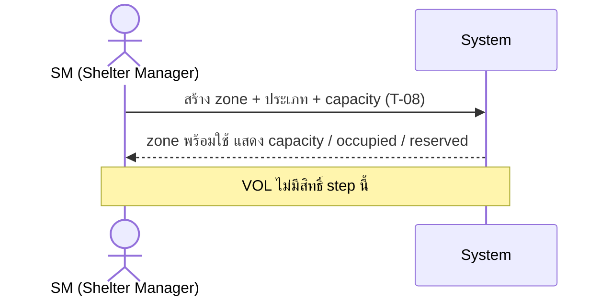
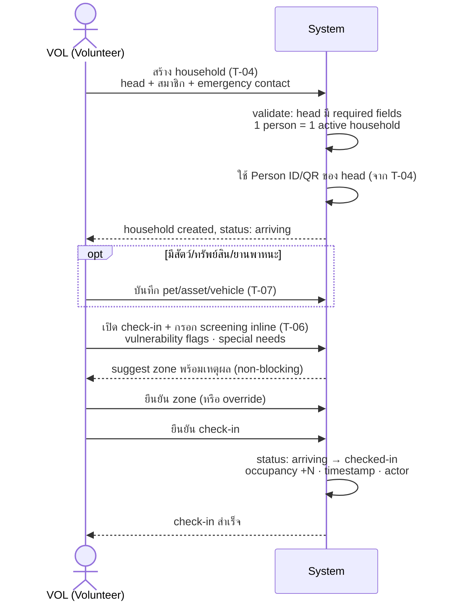
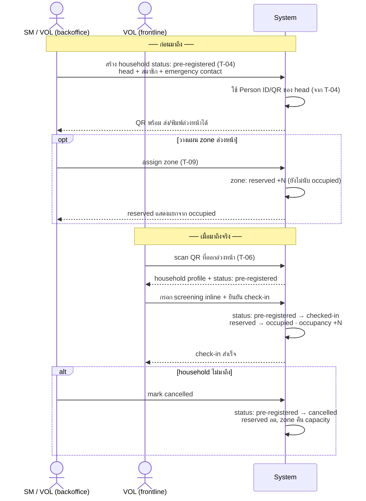
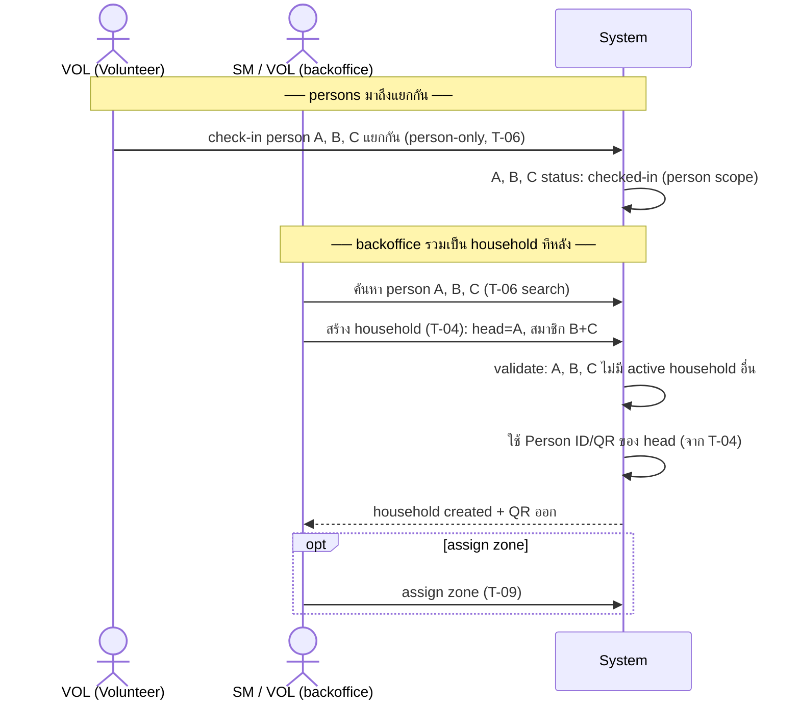
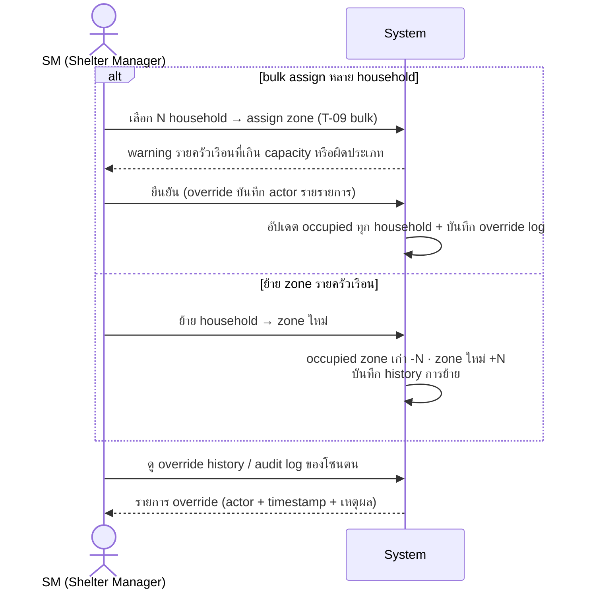
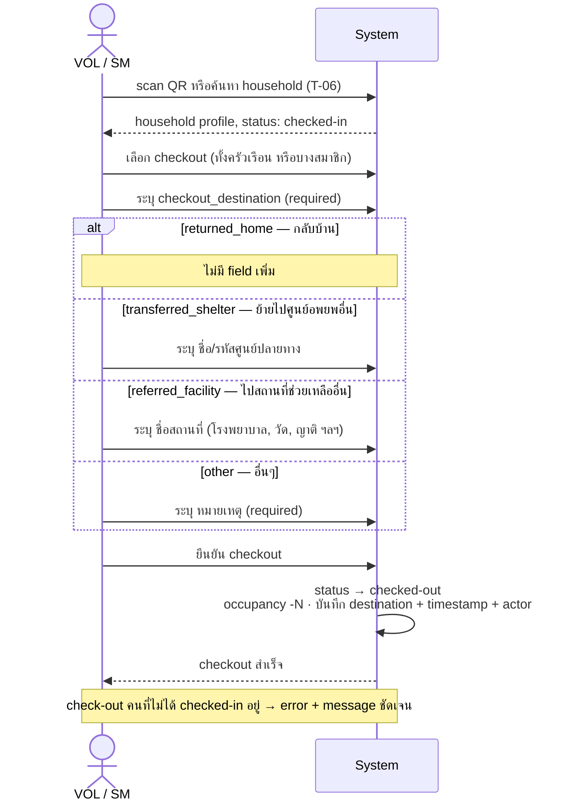

# Household & Zoning

> People & Search — household, member, check-in/out, pet/asset, zone allocation

- **Team owner:** Team B — พีค, โฮป, ปิ๊ก (People/Household; ดู [Squad Roster](../prd/squad-roster.md))
- **Phase:** R2
- **Design input (บริษัท):** P-01 (ส่งมอบแล้ว)
- **Target ส่งมอบ:** ภายในสิงหาคม 2026

## Features / Tasks

| ID   | Status | Feature / Task                                                | FR                   | Phase | Stage | Scope    | Raw MD | AI×   | Adj MD | Depends              |
| ---- | ------ | ------------------------------------------------------------- | -------------------- | ----- | ----- | -------- | ------ | ----- | ------ | -------------------- |
| T-04 | 🔄     | Household create + attach members + head                      | FR-21                | R2    | prod  | ส.ค.     | 6      | ÷1.6  | 4      | T-02                 |
| T-06 | 🔄     | Household search + household check-in/out                     | FR-23                | R2    | prod  | ส.ค.     | 6      | ÷1.6  | 4      | T-04                 |
| T-07 | 🔄     | Pet / asset / vehicle records                                 | FR-24                | R2    | prod  | ส.ค.     | 3      | ÷1.6  | 2      | T-04                 |
| T-08 | 🔄     | Zone definition + capacity                                    | FR-25                | R2    | prod  | ส.ค.     | 4      | ÷1.6  | 2.5    | T-02                 |
| T-09 | 🔄     | Zone allocation + suggest (warning-only)                      | FR-26                | R2    | prod  | ส.ค.     | 5      | ÷1.4  | 3.5    | T-08                 |
| T-71 | ⬜     | Public booking + ยืนยันที่ประตู (reuse T-51 scan) — CR-070 P4 | FR-70..72, FR-77..79 | R3    | prod  | in-scope | 8      | ÷1.4  | 5.5    | T-48,T-50,T-51       |
| T-72 | ⬜     | People import xlsx/csv (ขยาย T-55) — CR-071 P5                | FR-73, FR-80, FR-81  | R3    | prod  | in-scope | 6      | ÷1.25 | 5      | T-48                 |
| T-73 | ⬜     | Inbound POST คนจากหน่วยงาน — CR-071 P5 **blocked payload**    | FR-74                | R3    | prod  | blocked  | 6      | ÷1.25 | 5      | T-71, partner spec   |
| T-74 | ⬜     | Triage เขียว/เหลือง/แดง — CR-072 P6 **blocked กฎ**            | FR-75                | R3    | prod  | blocked  | 5      | ÷1.4  | 3.5    | T-49, D-TRIAGE-RULES |
|      |        | **รวมทั้งโมดูล**                                              |                      |       |       |          | **24** |       | **16** |                      |

## Task Details

> DoD ทุก prod task ยึด [Standard DoD](_index.md#standard-dod): **UI + data/write path + validation + permission + test + demo ของ slice** — รายการด้านล่างคือเกณฑ์เฉพาะของ task นั้นเพิ่มจากมาตรฐานกลาง

---

### T-04 — Household create + attach members + head (FR-21)

**Roles:** `SA ✓ · SM scope · VOL scope` — ดู [role-permission-matrix §3](../prd/role-permission-matrix.md#3-action-matrix--r2)

**Description:** สร้าง "ครัวเรือน" เป็น **required grouping** เหนือ person record ของ onsite registration (FR-4..6) — ทุก person ต้องเลือกครัวเรือนเดิมหรือสร้างครัวเรือนใหม่ตั้งแต่ 1 คนขึ้นไป และกำหนด/เปลี่ยนหัวหน้าครัวเรือน (head) ได้ ผู้ที่มาเพียงคนเดียวต้องสร้างครัวเรือน 1 คนโดยมีตนเองเป็น head การจัดการ Household อยู่ใน **Stage 3 (จัดการตั้งค่าหัวหน้าครอบครัว)** แยกจากฟอร์มข้อมูลบุคคลใน Stage 2 (ดู [CR-009](../changes/CR-009-register-household-flow.md), [CR-076](../changes/CR-076-onsite-registration-household-required.md))

รองรับ **3 creation path**:

| Path                              | ใคร                      | เมื่อไร                       | Status เริ่มต้น                                                        |
| --------------------------------- | ------------------------ | ----------------------------- | ---------------------------------------------------------------------- |
| **A — สร้าง ณ จุดรับ**            | VOL                      | household มาถึงพร้อมกัน       | `arriving`                                                             |
| **B — Pre-registration ล่วงหน้า** | SM หรือ VOL (backoffice) | รับแจ้งล่วงหน้าว่าจะมา        | `pre-registered`                                                       |
| **C — Post-arrival grouping**     | SM หรือ VOL              | persons check-in แยกกันไปแล้ว | สร้าง household แล้ว attach persons ที่มี status `checked-in` อยู่แล้ว |

**Flow — Path A (สร้าง ณ จุดรับ) — ทำในขั้นตอน Stage 3:**

1. VOL ตรวจสอบและจัดการ household โดยแบ่งเป็น 2 ทางเลือก (2 Box):
   - **A.1 ค้นหาบ้านเดิม (Search Existing):** ค้นหาสถานที่/บ้านเลขที่จากระบบ (AutoComplete) หากพบ ให้เลือกเพื่อผูกบุคคลที่ลงทะเบียนนี้เป็น **"ลูกบ้าน" (Member)**
   - **A.2 สร้างบ้านใหม่ (Create New):** หากไม่พบ ให้กรอกฟอร์มที่อยู่ใหม่ และระบบจะผูกบุคคลนี้เป็น **"หัวหน้าบ้าน" (Head)** อัตโนมัติ (พร้อมกรอก emergency contact)
2. ระบบ validate (ใช้ Person ID/QR ของหัวหน้าครัวเรือน head ที่ออกไปแล้วตอนลงทะเบียน — ไม่ออก QR ระดับ household แยก)
3. บันทึกสัตว์เลี้ยง/ทรัพย์สิน/ยานพาหนะที่ระดับ household (T-07) ก่อนดำเนินต่อที่ check-in (T-06)

**Flow — Path B (Pre-registration):**

1. SM/VOL สร้าง household สถานะ `pre-registered`
2. Person ID/QR ของ head พร้อมใช้งาน → สามารถส่ง/พิมพ์ล่วงหน้าได้
3. SM assign zone ล่วงหน้าได้ (T-09) — zone จอง capacity แต่ **ยังไม่นับ occupancy**
4. เมื่อ household มาถึง → VOL scan QR → check-in (T-06) → status เปลี่ยน `pre-registered → arriving → checked-in`
5. ถ้า household ไม่มาถึง → SM mark `cancelled` ได้

**Flow — Path C (Post-arrival grouping):**

1. SM/VOL ค้นหา persons ที่ check-in แยกไปแล้ว
2. สร้าง household ใหม่ → ตั้ง head → attach persons
3. ระบบ validate แต่ละ person ว่าไม่มี active household อื่น
4. ใช้ Person ID/QR ของ head

**Definition of Done:**

- API + UI ของระบบลงทะเบียน (Stage 3) มีการแบ่งแยก flow ค้นหาที่อยู่เดิม (รับบทลูกบ้าน) และสร้างที่อยู่ใหม่ (รับบทหัวหน้าบ้าน) อย่างชัดเจน
- ระบบสามารถ assign role สมาชิก (ลูกบ้าน/หัวหน้าบ้าน) ให้ตรงตามเงื่อนไขทางเลือกโดยอัตโนมัติ
- API + UI สร้าง/แก้ไข household, เพิ่ม-ถอดสมาชิก, ตั้งและเปลี่ยน head ได้ (head ต้องเป็น person ที่มี required fields ตาม FR-5)
- รองรับทั้ง 3 creation path: สร้าง ณ จุดรับ (`arriving`), pre-registration (`pre-registered`), post-arrival grouping
- Head record ต้องมี emergency contact (phone) + communication preference
- สมาชิก 1 คนอยู่ได้ 1 active household เท่านั้น (validation + error message ชัดเจน)
- `pre-registered` household ไม่นับ occupancy จนกว่าจะ check-in จริง (T-06)
- SM mark `cancelled` สำหรับ `pre-registered` household ที่ไม่มาถึงได้
- ทุก person ต้องมี household เสมอ — Stage 3 บังคับ join หรือ create (CR-009 amend); solo evacuee = household ขนาด 1 คน (head_evacuee_id = ตัวเอง)
- Onsite registration ต้องผ่าน Stage 3 → T-07 → จัดโซนตามลำดับเสมอ; ไม่มี action ข้าม household หรือข้าม T-07
- ลบ/ย้ายสมาชิกแล้วข้อมูล person record ไม่เสียหาย (additive ต่อ base schema T-02)
- เขียนลง CouchDB ตาม schema T-02 พร้อม audit metadata (ใคร/เมื่อไร)
- Unit + integration test ผ่าน, demo flow ลงทะเบียนครอบครัว 1 ครัวเรือนได้จริง (ครอบ path A + B)

> **Program override (2026-08-13, D-BOOK-OCC=C):** สำหรับ occupancy coloring/counts ของโปรแกรม site-occupancy-booking ต่อไปนี้ `pre_registered` **นับ** occupancy (ศูนย์และบ้านพี่เลี้ยงกฎเดียวกัน). กติกา T-04/T-06 ด้านบน (`pre-registered` ไม่นับ) ยังเป็นประวัติ household reserved/zone — **ถูกทับ** สำหรับตัวเลข occupancy ที่ใช้สี health / public / การจอง. Kitchen/SOP คนอยู่จริง (CR-022 `active` only) ไม่ถูกแตะใน Wave 3. ดู [program spec §0](../features/site-occupancy-booking-program.md).

---

### T-05 — Household Shelter ID/QR generation (FR-22) `[REMOVED — ดู CR-047]`

_(ตัดออกจาก Scope ตาม CR-047 — เปลี่ยนไปใช้ Person ID/QR ของหัวหน้าครัวเรือน head แทน)_

---

### T-06 — Household search + household check-in/out (FR-23)

**Roles:** `SA ✓ · SM scope · VOL scope` — ดู [role-permission-matrix §3](../prd/role-permission-matrix.md#3-action-matrix--r2)

**UI note:** SM UI = zone overview + occupancy dashboard + bulk view; VOL UI = scan-and-go + rapid entry form (ต่างกันในการแสดงผล ไม่ใช่ permission)

**Description:** ค้นหาครัวเรือน (ชื่อสมาชิก, Shelter ID, เบอร์โทร) และทำ check-in/check-out ระดับครัวเรือนทั้งชุดหรือรายสมาชิก รวม **arrival screening inline** ที่ทำพร้อมกับ check-in ครั้งเดียว ยอด occupancy ที่ได้เป็น input ของ zone (T-09), resource calc (T-31) และ dashboard

**Check-in flow (ทุก path):**

1. VOL scan QR หรือพิมพ์ค้น → ระบบแสดง household profile
2. VOL กรอก **screening form inline** (ทำพร้อมกัน ครั้งเดียว):
   - Vulnerability flags: ผู้สูงอายุ, ท้อง, ผู้พิการ, เด็กเล็ก
   - Special needs: อาหารพิเศษ, ยา, ความช่วยเหลือพิเศษ
3. ระบบ suggest zone (T-09) — **non-blocking**, VOL ดำเนินต่อได้โดยไม่รอ zone confirm
4. VOL เลือก/ยืนยัน zone หรือ override (บันทึก actor)
5. VOL ยืนยัน check-in → ระบบอัปเดต status + occupancy + timestamp

**Household status lifecycle:**

```
pre-registered  ──(check-in)──→  arriving  ──(confirm)──→  checked-in
                                                                │
                                                           (checkout)
                                                                │
                                                          checked-out
                                                    [checkout_destination ระบุ]
                                                                │
                                                             closed
```

**กฎ status transitions:**

- `pre-registered` → ไม่นับ occupancy; QR ใช้งานได้; zone จองล่วงหน้าได้
- `arriving` → ระหว่าง screening/check-in กำลังดำเนินการ
- `checked-in` → นับ occupancy; เริ่มนับตั้งแต่ timestamp check-in
- `checked-out` → occupancy ลด; **ต้องระบุ `checkout_destination` เสมอ** (ดูด้านล่าง)
- `cancelled` → `pre-registered` ที่ถูก SM ยกเลิก; ไม่นับ occupancy

> **Program override (2026-08-13, D-BOOK-OCC=C / D-HOLD-CANCEL):** occupancy coloring/counts ของโปรแกรมนี้ นับ stay `active` + `pre_registered`. ปล่อยที่นั่งเมื่อ staff (SA/SM/RS) ยกเลิกชัดเจนเท่านั้น — ไม่มี TTL. กติกา T-06 ด้านบนยังเป็นประวัติ household; ดู [program spec §0](../features/site-occupancy-booking-program.md). ห้าม rewrite CR-029/CR-035 นอกจาก pointer.

**`checkout_destination` (required ทุกครั้งที่ checkout):**

| ตัวเลือก                                                                | Field ที่ต้องกรอกเพิ่ม |
| ----------------------------------------------------------------------- | ---------------------- |
| `returned_home` — กลับบ้าน                                              | —                      |
| `transferred_shelter` — ย้ายไปศูนย์อพยพอื่น                             | ชื่อ/รหัสศูนย์ปลายทาง  |
| `referred_facility` — ไปสถานที่ช่วยเหลืออื่น (โรงพยาบาล, วัด, ญาติ ฯลฯ) | ชื่อสถานที่            |
| `other` — อื่นๆ                                                         | หมายเหตุ (required)    |

> การออกจาก shelter **ทุกประเภท** ใช้ action checkout เดียวกัน — ความต่างอยู่ที่ `checkout_destination` ไม่ใช่ state แยก

**Definition of Done:**

- ค้นหาได้ทั้งจาก scan Person QR ของสมาชิก (ปกติคือ head) และพิมพ์ค้น ผลลัพธ์จำกัดใน shelter scope ของผู้ใช้
- Check-in flow รวม screening inline ในหน้าจอเดียว: vulnerability flags + special needs กรอกพร้อม check-in ทำครั้งเดียว
- รองรับ check-in จาก status `pre-registered` (scan QR ที่ออกล่วงหน้า) และ `arriving` (สร้าง ณ จุดรับ)
- Check-in/out ทั้งครัวเรือนหรือเลือกบางสมาชิกได้ สถานะ + timestamp บันทึกครบ
- Lifecycle transitions ครบทุก path: `pre-registered → checked-in`, `checked-in → checked-out`, `pre-registered → cancelled`
- Checkout ทุกประเภทใช้ action เดียวกัน — `checkout_destination` required เสมอ (4 ตัวเลือก: `returned_home`, `transferred_shelter` + ชื่อศูนย์, `referred_facility` + ชื่อสถานที่, `other` + หมายเหตุ)
- ยอด occupancy ของศูนย์อัปเดตถูกต้องหลังทุก movement (`pre-registered` ไม่นับ, `checked-in` นับ — **ถูกทับโดย D-BOOK-OCC=C สำหรับสี health / public / การจอง**; ดู override ด้านบน)
- Zone suggestion ทำงาน non-blocking — VOL confirm check-in ได้โดยไม่รอ zone
- Test ครอบกรณี check-in ซ้ำ, check-out คนที่ไม่ได้อยู่, scan QR ของ `pre-registered` household, checkout ทุก destination type, และ demo flow เข้า-ออกครบวงจร

---

### T-07 — Pet / asset / vehicle records (FR-24)

**Roles:** `SA ✓ · SM scope · VOL scope` — ดู [role-permission-matrix §3](../prd/role-permission-matrix.md#3-action-matrix--r2)

**Description:** บันทึกสัตว์เลี้ยง (ประเภท, จำนวน, กรง), ทรัพย์สิน และยานพาหนะที่นำติดตัวมาไว้ที่ **household** (source ส่วนที่ 1 ข้อ 3 — Assets & Pets) ข้อมูลสัตว์เลี้ยงเป็น input การจัดโซนสัตว์เลี้ยง (T-09) และ related `pet_refs` ของ shelter report (T-33 / CR-040)

**Definition of Done:**

- CRUD pet/asset/vehicle ผูก household พร้อมประเภทตามรายการที่ design (P-01) กำหนด
- Onsite registration ต้องแสดงขั้นตอนนี้หลังเลือก/สร้าง household และก่อนจัดโซนเสมอ; ผู้ใช้ส่งข้อมูลว่างได้เมื่อไม่มีรายการ
- จำนวนสัตว์เลี้ยงต่อโซน query ได้ (รองรับ zone allocation)
- แสดงในหน้า household profile และ test + demo ผ่าน

---

### T-08 — Zone definition + capacity (FR-25)

**Roles:** `SA ✓ · SM scope · VOL —` (zone definition เป็น SM ขึ้นไปเท่านั้น) — ดู [role-permission-matrix §3](../prd/role-permission-matrix.md#3-action-matrix--r2)

**Description:** ผู้ดูแลศูนย์นิยามโซนที่พักของศูนย์ (โซนครอบครัว, ชาย/หญิง, กลุ่มเปราะบาง, สัตว์เลี้ยง) พร้อม capacity ต่อโซน เป็นโครงให้ T-09 จัดสรร **VOL ไม่มีสิทธิ์ create/edit zone** — เฉพาะ SM และ SA เท่านั้น

**Definition of Done:**

- CRUD โซน + ประเภทโซน + capacity ต่อโซน ภายใน shelter scope (ประเภทขยายเพิ่มได้)
- แก้ capacity แล้วยอดคงเหลือ (capacity − occupied) คำนวณใหม่ถูกต้อง
- `pre-registered` household ที่ assign zone ไว้ล่วงหน้านับเป็น "reserved" แยกจาก "occupied" จนกว่าจะ check-in จริง
- ผลรวม zone capacity ไม่จำเป็นต้องเท่ากับ shelter capacity — ระบบเตือนเมื่อไม่สอดคล้อง (PRD FR-25)
- โซนที่ปิดไม่รับ allocation ใหม่ และไม่ลบประวัติการเข้าพักเดิม
- UI แสดง capacity / occupied / reserved แยกกันชัดเจน
- Test + demo สร้างผังโซนของศูนย์ตัวอย่างครบ

---

### T-09 — Zone allocation + suggest (warning-only) (FR-26)

**Roles:** `SA ✓ · SM scope · VOL scope` (assign ได้ แต่ VOL ไม่ create/edit zone — ดู T-08) — ดู [role-permission-matrix §3](../prd/role-permission-matrix.md#3-action-matrix--r2)

**UI note:** SM UI = bulk allocation table + override history dashboard; VOL UI = single-household assign พร้อม zone suggestion card (ต่างกันในการแสดงผล ไม่ใช่ permission)

**Description:** จัดสรรครัวเรือนเข้าโซน พร้อมระบบแนะนำโซนอัตโนมัติจากลักษณะครัวเรือน (กลุ่มเปราะบาง, มีสัตว์เลี้ยง, เพศ, screening flags จาก T-06) — เกิน capacity หรือผิดประเภทเป็น **warning เท่านั้น ไม่ block** เพราะหน้างานจริงต้องยืดหยุ่น รองรับ **bulk assignment** สำหรับ SM (backoffice)

**Allocation flows:**

- **Single assign (VOL/SM):** เลือก household → ระบบ suggest zone พร้อมเหตุผล → ยืนยัน/override
- **Bulk assign (SM backoffice):** เลือกหลาย household → assign zone เดียวกัน → warning รายครัวเรือนที่เกิน capacity หรือผิดประเภท → SM ยืนยัน (override บันทึก actor รายรายการ)
- **Pre-registration zone reservation:** `pre-registered` household assign zone ได้ล่วงหน้า — นับเป็น "reserved" ไม่ใช่ "occupied" จนกว่าจะ check-in จริง

**Definition of Done:**

- Assign/ย้าย household เข้าโซนได้ (single และ bulk) ระบบ suggest โซนที่เหมาะสมพร้อมเหตุผลสั้นๆ (อิง vulnerability flags + screening data + จำนวนสัตว์เลี้ยง)
- Bulk assign: SM เลือกหลาย household พร้อมกันได้ warning แสดงรายครัวเรือน บันทึก override actor รายรายการ
- เกิน capacity / ผิดประเภทโซน → แสดง warning ชัดเจนแต่ user ยืนยันทำต่อได้ (override บันทึก actor)
- `pre-registered` zone reservation แสดงเป็น "reserved" แยกจาก "occupied" ใน capacity display
- ยอด occupied ต่อโซนตรงกับความจริงเสมอหลังย้าย และเก็บ history การย้ายโซน
- SM ดู override history + audit log ของโซนตนได้ (actor + timestamp + เหตุผล)
- Test ครอบ suggest logic + override path + bulk path + pre-registration reservation, demo จัดสรรครัวเรือนเปราะบาง + มีสัตว์เลี้ยง

---

### T-71 — Public booking + ยืนยันที่ประตู (CR-070 P4)

**Status:** ⬜ ready — CR-070 **approved** 2026-08-13 (Wave 3)
**Owner:** Team B (พีค, โฮป, ปิ๊ก); Lead รีวิว public BFF
**Depends:** T-48, T-50, T-51 (scan มีแล้ว); [CR-070](../changes/CR-070-public-booking-gate-confirm.md)
**Program:** P4

**Description:** เปิดช่องจองผ่านเว็บ — สร้าง `evacuee` (+ household) สถานะ `pre_registered`; occupancy **นับทันที** (D-BOOK-OCC=C); ออก QR ตาม T-50; ประชาชนตามสถานะด้วย QR หรือ `official_code` + เบอร์โทร (D-BOOK-TOKEN=A); ที่ประตู scan ตาม T-51 แล้ว check-in → `active` (ไม่ +1 occupancy ซ้ำ). ไม่มี TTL; ปล่อยที่นั่งเมื่อ SA/SM/RS ยกเลิกชัดเจน (D-HOLD-CANCEL). รายการ staff แสดงอายุการจองวัน/ชม./นาที ตอนโหลด/รีเฟรช (D-PRE-REG-AGE). **ไม่สร้าง doc type booking ใหม่.** ปุ่ม public «ลงทะเบียนผู้ประสบภัย» ที่ disabled อยู่เป็นจุดเข้า. `registered_via=web`.

**Files likely touched:** public portal register/booking route; BFF สร้างคนแบบ no-session (pattern donation public + CR-063); `features/people`; check-in UI แสดงว่ามาจากการจอง; รายการ pre-reg + ยกเลิก; `registered_via` (proposed `web`)

**Definition of Done:**

- UI: ฟอร์มจอง public เลือกสถานที่ที่ยังเปิดรับ; ออก QR/รหัส; ตามสถานะด้วย QR หรือรหัส+เบอร์; หน้าประตู scan แล้ว check-in ได้โดยไม่ลงทะเบียนใหม่
- UI staff: รายการ `pre_registered` แสดง elapsed วัน/ชม./นาที คำนวณตอนโหลด/รีเฟรช — ห้าม poll ห้ามนาฬิกาเดินสด
- Write path: BFF เขียน CouchDB — ห้ามเบราว์เซอร์ถือ admin secret; คนได้ `pre_registered`; occupancy +1 ตอนจอง
- ยกเลิก: SA/SM/RS เปลี่ยนสถานะ `cancelled` (ห้าม hard-delete); audit actor+timestamp; occupancy ลดตอนรีเฟรช; ไม่มี job auto-cancel
- Validation: ขั้นต่ำ T-48; ศูนย์ `closed` จองไม่ได้; แดงเข้ม = warning ไม่ block (จนกว่า CR แยก)
- Permission: public = CAPTCHA/rate-limit ตาม Public DoD; ประตู = role T-51; ยกเลิก hold = SA/SM/RS
- Test: จอง→occupancy +1; scan ไม่ +1 ซ้ำ; ไม่มา+ยกเลิก occupancy ลด; RS ยกเลิกได้; role อื่นยกเลิกไม่ได้; scan ซ้ำ; no PII บน ticket สาธารณะ
- Demo: จองเว็บ → พิมพ์ QR → staff scan check-in; ตามสถานะด้วยรหัส+เบอร์

**Out of scope:** xlsx คน (T-72); inbound API (T-73); triage 3 สี (T-74); donation `/donate`; auto-expire

---

### T-72 — People import xlsx/csv (CR-071 P5)

**Status:** ⬜ ready — CR-071 slice A **approved** 2026-08-13 (T-72 stay=A + permission RS+SA+SM); ยังรอ T-48
**Owner:** Team B
**Depends:** T-48; แนะนำหลัง T-71 เพื่อล็อกช่องทาง; [CR-071](../changes/CR-071-people-import-inbound.md)
**Program:** P5 slice A

**Description:** Staff อัปโหลด xlsx และ csv → preview รายแถว → commit สร้าง evacuee; `registered_via=import`. คอลัมน์ขั้นต่ำ = T-48 required + `shelter_code`. ห้ามเพิ่ม field schema ใหม่. ทุกแถวสำเร็จได้ `current_stay.status=pre_registered` เสมอ (T-72 initial stay=**A**) — นับ occupancy ตาม D-BOOK-OCC=C; เป็น `active` ผ่านประตู check-in หรือ staff เปลี่ยนสถานะเท่านั้น; **ห้าม** คอลัมน์เลือกสถานะต่อแถวในไฟล์.

**Files likely touched:** `routes/(protected)/.../import` หรือขยาย sitemap `/import`; feature slice people-import (pattern CR-039); import log doc type (หลัง approve ถ้าไม่ reuse)

**Definition of Done:**

- UI: dropzone xlsx+csv, preview error รายช่อง, สรุปสำเร็จ/ล้มเหลว, ประวัติ log
- Write path: sequential/batched put evacuee ในศูนย์ที่ระบุ; partial success ไม่ rollback; ทุกแถวสำเร็จเป็น `pre_registered`
- Validation: Zod evacuee รายแถว; ไฟล์ว่าง/header ผิด = หยุดทั้งไฟล์พร้อมข้อความ; ห้ามคอลัมน์เลือก stay status ต่อแถว
- Permission: **RS + SA + SM** (`registration_staff` + `system_admin` + `shelter_manager`) — เจ้าของขยายจาก proposed SM+SA; บทบาทอื่นห้าม
- Test: csv+xlsx, แถวผสมถูก/ผิด, shelter_code ไม่มี, ทุกแถวสำเร็จเป็น `pre_registered`, RS/SA/SM ผ่าน / บทบาทอื่นถูกปฏิเสธ
- Demo: ไฟล์ 10 แถว
- **ขยาย/แทนที่** ช่องคนของ T-55 — ห้ามมีสอง importer คนละสูตร

**Out of scope:** inbound POST (T-73); เดาคอลัมน์หน่วยงานภายนอก; SOP-lite fields; เลือก `active` ต่อแถวในไฟล์

---

### T-73 — Inbound POST คนจากหน่วยงาน (CR-071 P5) — BLOCKED

**Status:** ⬜ blocked — D-INBOUND-PLANE + partner payload spec — **Wave 4 รอบ CR ถัดไป**
**Owner:** Team B + Lead pair
**Depends:** T-71 (ช่องทางคน); partner SPEC; [CR-071](../changes/CR-071-people-import-inbound.md) slice B
**Program:** P5 slice B

**Description:** รับรายชื่อจากหน่วยงานผ่าน API. **ห้ามเดา JSON.** เมื่อ SPEC เข้า: amend CR-071 แล้วค่อยออกแบบ path (external X-API-Key vs BFF SA).

**Files likely touched (หลัง unblock):** FastAPI `/external/v1/...` หรือ BFF `/api/v1/people/inbound`; OpenAPI; tests auth

**Definition of Done:** ยังไม่มีจนกว่า SPEC. หลังล็อก: OpenAPI ตรงสัญญา, 401/403, audit key, ไม่รับ field นอกสัญญา, demo หน่วยงาน 1 ราย

**Out of scope:** สมมติ payload ONE PLATFORM (T-75 คนละสัญญา)

---

### T-74 — Triage เขียว / เหลือง / แดง (CR-072 P6) — BLOCKED

**Status:** ⬜ blocked — D-TRIAGE-RULES + D-TRIAGE-FIELD — **Wave 4 รอบ CR ถัดไป**
**Owner:** Team B
**Depends:** T-49; [CR-072](../changes/CR-072-triage-green-yellow-red.md)
**Program:** P6

**Description:** คัดกรอง 3 สี. ปัจจุบัน `track` = `normal`|`fast_track`. **ห้าม map มั่ว** และห้ามเดากฎการแพทย์.

**Files likely touched (หลัง unblock):** `features/people` screening UI + domain; schema screening/medical

**Definition of Done:** ยังไม่มีจนกว่ากฎล็อก. หลังล็อก: UI บังคับเลือกสี, persist append-only, ไม่โชว์ medical บน public, test ทุกแยกกฎ, demo 3 เคส

**Out of scope:** เขียน clinical protocol ใน task นี้

---

## Flow Diagrams

### Setup — Zone definition (T-08, SM only)


```mermaid
sequenceDiagram
    actor SM as SM (Shelter Manager)
    participant SYS as System

    SM->>SYS: สร้าง zone + ประเภท + capacity (T-08)
    SYS-->>SM: zone พร้อมใช้ แสดง capacity / occupied / reserved
    note over SM,SYS: VOL ไม่มีสิทธิ์ step นี้
```

---

### Path A — สร้าง Household ณ จุดรับ แล้ว Check-in ทันที (T-04 → T-06)


```mermaid
sequenceDiagram
    actor VOL as VOL (Volunteer)
    participant SYS as System

    VOL->>SYS: สร้าง household (T-04)<br/>head + สมาชิก + emergency contact
    SYS->>SYS: validate: head มี required fields<br/>1 person = 1 active household
    SYS->>SYS: ใช้ Person ID/QR ของ head (จาก T-04)
    SYS-->>VOL: household created, status: arriving

    opt มีสัตว์/ทรัพย์สิน/ยานพาหนะ
        VOL->>SYS: บันทึก pet/asset/vehicle (T-07)
    end

    VOL->>SYS: เปิด check-in + กรอก screening inline (T-06)<br/>vulnerability flags · special needs
    SYS-->>VOL: suggest zone พร้อมเหตุผล (non-blocking)
    VOL->>SYS: ยืนยัน zone (หรือ override)
    VOL->>SYS: ยืนยัน check-in
    SYS->>SYS: status: arriving → checked-in<br/>occupancy +N · timestamp · actor
    SYS-->>VOL: check-in สำเร็จ
```

---

### Path B — Pre-registration ล่วงหน้า แล้ว Check-in ตอนมาถึง (T-04 → T-09 → T-06)


```mermaid
sequenceDiagram
    actor SM as SM / VOL (backoffice)
    actor VOL as VOL (frontline)
    participant SYS as System

    note over SM,SYS: ── ก่อนมาถึง ──
    SM->>SYS: สร้าง household status: pre-registered (T-04)<br/>head + สมาชิก + emergency contact
    SYS->>SYS: ใช้ Person ID/QR ของ head (จาก T-04)
    SYS-->>SM: QR พร้อม ส่ง/พิมพ์ล่วงหน้าได้

    opt วางแผน zone ล่วงหน้า
        SM->>SYS: assign zone (T-09)
        SYS->>SYS: zone: reserved +N (ยังไม่นับ occupied)
        SYS-->>SM: reserved แสดงแยกจาก occupied
    end

    note over VOL,SYS: ── เมื่อมาถึงจริง ──
    VOL->>SYS: scan QR ที่ออกล่วงหน้า (T-06)
    SYS-->>VOL: household profile + status: pre-registered
    VOL->>SYS: กรอก screening inline + ยืนยัน check-in
    SYS->>SYS: status: pre-registered → checked-in<br/>reserved → occupied · occupancy +N
    SYS-->>VOL: check-in สำเร็จ

    alt household ไม่มาถึง
        SM->>SYS: mark cancelled
        SYS->>SYS: status: pre-registered → cancelled<br/>reserved ลด, zone คืน capacity
    end
```

---

### Path C — Person-only check-in ก่อน แล้วรวม Household ทีหลัง (T-06 → T-04 → T-09)


```mermaid
sequenceDiagram
    actor VOL as VOL (Volunteer)
    actor SM as SM / VOL (backoffice)
    participant SYS as System

    note over VOL,SYS: ── persons มาถึงแยกกัน ──
    VOL->>SYS: check-in person A, B, C แยกกัน (person-only, T-06)
    SYS->>SYS: A, B, C status: checked-in (person scope)

    note over SM,SYS: ── backoffice รวมเป็น household ทีหลัง ──
    SM->>SYS: ค้นหา person A, B, C (T-06 search)
    SM->>SYS: สร้าง household (T-04): head=A, สมาชิก B+C
    SYS->>SYS: validate: A, B, C ไม่มี active household อื่น
    SYS->>SYS: ใช้ Person ID/QR ของ head (จาก T-04)
    SYS-->>SM: household created + QR ออก

    opt assign zone
        SM->>SYS: assign zone (T-09)
    end
```

---

### Zone Management — Bulk ops + Override audit (T-09, SM backoffice)


```mermaid
sequenceDiagram
    actor SM as SM (Shelter Manager)
    participant SYS as System

    alt bulk assign หลาย household
        SM->>SYS: เลือก N household → assign zone (T-09 bulk)
        SYS-->>SM: warning รายครัวเรือนที่เกิน capacity หรือผิดประเภท
        SM->>SYS: ยืนยัน (override บันทึก actor รายรายการ)
        SYS->>SYS: อัปเดต occupied ทุก household + บันทึก override log
    else ย้าย zone รายครัวเรือน
        SM->>SYS: ย้าย household → zone ใหม่
        SYS->>SYS: occupied zone เก่า -N · zone ใหม่ +N<br/>บันทึก history การย้าย
    end

    SM->>SYS: ดู override history / audit log ของโซนตน
    SYS-->>SM: รายการ override (actor + timestamp + เหตุผล)
```

---

### Check-out (T-06) — ทุกการออกจาก shelter ใช้ flow เดียวกัน


```mermaid
sequenceDiagram
    actor VOL as VOL / SM
    participant SYS as System

    VOL->>SYS: scan QR หรือค้นหา household (T-06)
    SYS-->>VOL: household profile, status: checked-in

    VOL->>SYS: เลือก checkout (ทั้งครัวเรือน หรือบางสมาชิก)
    VOL->>SYS: ระบุ checkout_destination (required)

    alt returned_home — กลับบ้าน
        note over VOL,SYS: ไม่มี field เพิ่ม
    else transferred_shelter — ย้ายไปศูนย์อพยพอื่น
        VOL->>SYS: ระบุ ชื่อ/รหัสศูนย์ปลายทาง
    else referred_facility — ไปสถานที่ช่วยเหลืออื่น
        VOL->>SYS: ระบุ ชื่อสถานที่ (โรงพยาบาล, วัด, ญาติ ฯลฯ)
    else other — อื่นๆ
        VOL->>SYS: ระบุ หมายเหตุ (required)
    end

    VOL->>SYS: ยืนยัน checkout
    SYS->>SYS: status → checked-out<br/>occupancy -N · บันทึก destination + timestamp + actor
    SYS-->>VOL: checkout สำเร็จ

    note over VOL,SYS: check-out คนที่ไม่ได้ checked-in อยู่ → error + message ชัดเจน
```

---

## Effort by phase (Adj MD)

| Phase   | Raw MD | Adj MD |
| ------- | ------ | ------ |
| R2      | 24     | 16     |
| **รวม** | **24** | **16** |

## Dependencies

**Cross-module dependency (ขึ้นกับโมดูลอื่น):**

- `T-02` (Data-model expansion (household, zone, supply, ledger, donation) — additive) — module **Platform/Core**
