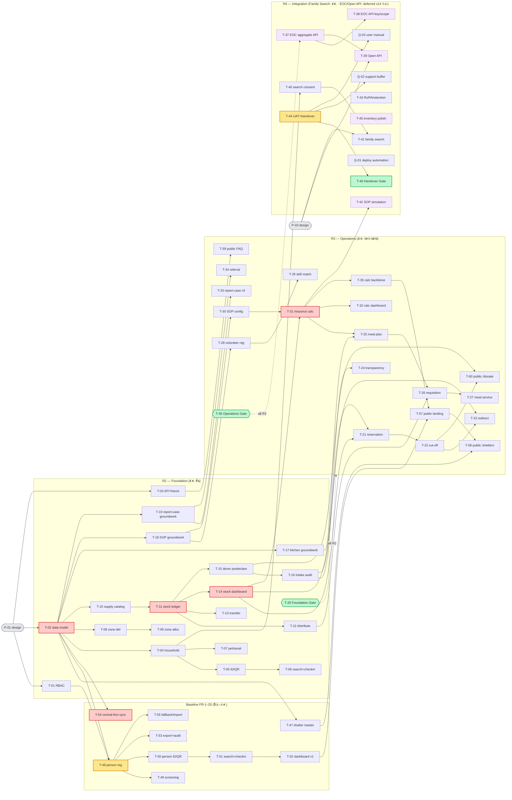
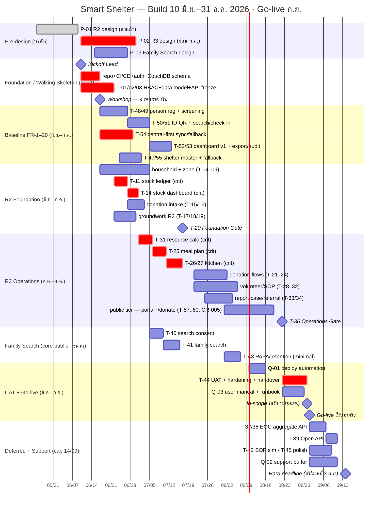

# Dependencies & Timeline

อะไร block อะไร + timeline (มิ.ย.–ส.ค. 2026, go-live ก.ย.). อ้าง [task module breakdown](_index.md).

## 0. Schedule Decision (ข้อสรุป 2026-06-09)

ทีม = **2 Lead + 4 teams × 3** (greenfield — มีเพียง CouchDB PoC, ยังไม่เริ่ม development).

| วันที่ | event |
| --- | --- |
| **10/06/2026** | Kickoff Lead + foundation เริ่มทันที (walking skeleton) |
| **17/06/2026** | Workshop ทีม → 4 teams เริ่มงาน |
| **31/08/2026** | In-scope เสร็จ (R2 + R3 + Family Search + governance) — เป้าหมายส่งมอบ |
| **ก.ย. 2026 (สัปดาห์ 1)** | Go-live ใช้งานจริง |
| **14/09/2026 (สัปดาห์ที่ 2 ก.ย.)** | **Hard deadline งาน feature** — deferred tail ต้องจบในกรอบนี้ ไม่มีงาน feature ใหม่เลยกว่านี้ |
| **หลัง 14/09 → ครบโครงการ 12 เดือน** | รับ feedback + แก้ไข (maintenance/bug-fix) จนสิ้นสุดโครงการ [ASSUMPTION ~มิ.ย. 2027 — ยืนยันกับสัญญา] |

**Scope สำหรับ go-live ก.ย.**

- **In-scope (จบ ส.ค.):** **Baseline FR-1–20 (T-47..T-55, ดู [00-baseline](00-baseline.md))** + R2 Foundation + R3 Operations + **Family Search (T-40/41)** core public feature + **Public Portal (T-57/58/59) + public `/donate` (T-60)** ตาม CR-005 + **T-43 RoPA/retention (minimal)** เพราะ public tier (family search/portal/donate) เปิด public = PII/data exposure จริง
- **Deferred (หลัง go-live, cap 14/09/2026):** EOC aggregate API (T-37/38), Open API (T-39), SOP simulation (T-42), inventory polish (T-45)

**Walking skeleton — Lead 2 คนต้องส่งก่อน 17/06** (greenfield risk): repo + branch/PR convention + CI/CD, auth/RBAC skeleton (T-01), Central CouchDB base schema + Central-first remote write / conflict design (T-02 ตั้งต้น; LAN Edge เป็น outage fallback เท่านั้น), 1 vertical slice end-to-end ให้ทีม copy pattern, seed data. ใช้ `docs/architecture/` + `docs/data/` เป็น input อย่า redesign จากศูนย์. **Remote-first CouchDB (active endpoint เดียว, Central→Edge failover, failback, conflict, RBAC) = tech risk #1 → Lead B เป็นเจ้าของ T-02 + T-54; deny PouchDB/local-first ([CR-033](../changes/CR-033-remote-first-architecture-program-index.md))**.

**เงื่อนไขฝั่งบริษัท (เน็ท):** P-02 (R3 design) ต้องเสร็จก่อน ก.ค. (ทีมแตะ R3 ~ต้น ก.ค.). P-03 ดึงเฉพาะ **ส่วน Family Search** มา design ล่วงหน้า; EOC/Open API design ยัง defer.

## 1. คอขวด (hub — block หลายตัว)

| Task | Module | Block กี่ตัว | block อะไร |
| --- | --- | --- | --- |
| **P-01** design (บริษัท) | pre | 3 | T-01/02/03 (ทั้ง R2 foundation) — ส่งแล้ว ไม่ block |
| **T-02** data model | Core | 9 | T-04, T-08, T-10, T-17, T-18, T-19 + baseline T-47/48/54 — fan-out ใหญ่สุด |
| **T-48** person registration | Baseline | 4 | T-49, T-50, T-53, T-55 (และ flow check-in T-51→T-52 ผ่าน T-50) |
| **T-11** stock ledger | C | 4 | T-12, T-13, T-14, T-15 |
| **T-14** stock dashboard | C | 3 | T-21 (donation reservation), T-23, T-31 |
| **T-31** resource calc engine | B | 4 | T-25 (meal plan), T-32, T-35, T-42 — cross-module hub |
| **T-44** UAT + handover | Core | 3 | T-46, Q-02, Q-03 |
| **all R3 เสร็จ** | gate | — | T-37 (EOC) — **deferred post-go-live**, ไม่อยู่บนเส้นวิกฤต ส.ค. แล้ว |

**เส้นวิกฤต (longest internal, scope ส.ค.):** `T-02 → T-11 → T-14 → T-31 → T-25 → T-26 → T-27` → (R3 gate) → `T-44`.
ตัด `T-37 → T-39` (EOC/Open API) ออกจากเส้นวิกฤต → **deferred post-go-live** → critical path สั้นลง ~11 WD.
**Family Search (T-04 → T-40 → T-41)** เป็น branch ขนานออกจาก household — **ไม่ทำให้เส้นวิกฤตยาวขึ้น** ใช้ capacity Team 1.
**Baseline (T-47..T-55)** รันขนานช่วง มิ.ย.–ก.ค. — ไม่อยู่บนเส้นวิกฤต stock chain แต่ **ต้องจบใน Foundation Gate (17 ก.ค.)** เพราะ flow หน้างาน (register→screen→check-in) เป็น precondition ของ occupancy data ที่ R3 ใช้; **T-54 Central-first offline sync/failback = tech risk #1** เริ่มทันทีหลัง skeleton.
Pre-production (P-0x) ส่งแล้ว/ดึงมาขนาน → **ไม่ใช่ external lead-time block** (เว้น P-02 ต้องเสร็จก่อน ก.ค.).

## 2. Dependency Graph

> สีแดง = เส้นวิกฤต · สีส้ม = hub · เขียว = gate · เทา dashed = design (บริษัท) · ม่วง dashed = **deferred post-go-live**.
> `G2/G3 -. all .->` = ต้องปิดทั้ง phase ก่อนข้าม (integration gate). **Foundation Gate (T-20) ครอบ Baseline (T-47..55) ด้วย.**
> Family Search (T-40/41) + T-43 = **เก็บใน scope ส.ค.** (core public feature + PII compliance) แม้อยู่ subgraph R4.
> **Public tier (CR-005):** T-57/58/59 (Public Portal, [12-public](12-public.md)) + T-60 (public `/donate`, [04-donation](04-donation.md)) = R3 — อ่าน aggregate read-model (T-35) เท่านั้น, metric กั้นหลัง kill-switch flag, no person-level; ไม่อยู่บนเส้นวิกฤต stock chain แต่ผูก PII/data-governance review (T-43) + redaction whitelist (T-01).

## 3. Timeline (Gantt)

> **เส้นวิกฤต (in-scope, จบ ส.ค.):** walking skeleton (T-01/02/03) → T-11 → T-14 → T-31 → T-25 → T-26/27 → (R3 gate) → T-44 UAT → ส่งมอบ 31 ส.ค.
> **Baseline (T-47..55)** รันขนาน มิ.ย.–ก.ค. ต้องจบใน Foundation Gate; T-54 remote-first Central→Edge failover/failback = tech risk #1 ([CR-033](../changes/CR-033-remote-first-architecture-program-index.md)).
> Family Search (T-40/41) = branch ขนานออกจาก household — core public feature, อยู่ใน scope. T-43 (minimal) บังคับเพราะ public PII.
> **Greenfield:** 10–17 มิ.ย. Lead ส่ง walking skeleton ก่อนทีม 12 คนเข้า; remote-first CouchDB, Edge fallback, failback และ conflict = technical risk อันดับ 1 (deny PouchDB).
> **Deferred** (EOC / Open API / SOP sim / polish) = หลัง go-live, **hard deadline งาน feature 14/09/2026** (สัปดาห์ที่ 2 ก.ย.) — หลังจากนั้นเป็น maintenance/feedback จนครบโครงการ 12 เดือน. P-02 ต้องเสร็จก่อน ก.ค. มิฉะนั้นทีมรอ design.
> วันใน gantt = ประมาณการ sequencing บนเส้นวิกฤต — งานราย module รันขนาน (4 teams × 3 + Lead pair, part-time academic).
