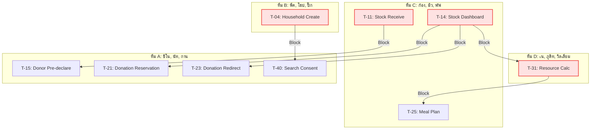

# โครงสร้างและการแบ่งโมดูลให้ 4 ทีม (Team Planning & Balancing)

การคำนวณสถิติรวมของโมดูลทั้งหมดที่ต้องนำมาจัดสรร (โมดูล 02-09 และ 11):
- **จำนวนโมดูลทั้งหมด**: 9 โมดูล
- **จำนวน Task ทั้งหมด**: 34 Tasks
- **ปริมาณแรงงานปรับปรุงสุทธิ (Total Adj MD) รวม**: 121.5 Adj MD
- **ค่าเฉลี่ยเป้าหมายต่อทีม**: **8.5 Tasks** และ **30.375 Adj MD** ต่อทีม

---

## 1. โครงสร้างทีมพัฒนา (Team Roster)

| บทบาท / ทีม | ชื่อเล่น | ชื่อ-นามสกุล | สาขา | ชั้นปี |
| :--- | :--- | :--- | :---: | :---: |
| **Lead** | แจ็ก | สรวิศ สุขการณ์ | CoE | 3 |
| | เด่น | สุธินันท์ รองพล | AIE | 4 |
| **ทีม A** | ชิโน | ทนุธรรม ศุภผล | COE | 3 |
| | นัท | อาณัส อาเก๊ะ | AIE | 2 |
| | กาน | คุณานนต์ หนูแสง | AIE | 4 |
| **ทีม B** | พีค | สักก์ธนัชญ์ ประดิษฐอุกฤษฎ์ | COE | 3 |
| | โฮป | พัฒนชัย พันธุ์เกตุ | COE | 3 |
| | ปิ๊ก | สิรวิชญ์ น้อยผา | AIE | 4 |
| **ทีม C** | ก้อง | กรธัช สุขสวัสดิ์ | COE | 3 |
| | มิว | คีตศิลป์ คงสี | AIE | 4 |
| | พัฟ | ฉัตรชนก นิโครธานนท์ | AIE | 2 |
| **ทีม D** | เน | เนติวุฒิ เกตุกำพล | COE | 4 |
| | ภูดิท | ภูดิท ชูจันทร์ | COE | 2 |
| | วิลเลียม | อภิชาติ จะหย่อ | COE | 2 |

---

## 2. ตารางจัดสรรงานรายทีม (เน้นความเชื่อมโยงระบบย่อย)

การจัดกลุ่มแบบนี้คำนึงถึงฟังก์ชันงานที่มีความคาบเกี่ยวหรือต้องเชื่อมโยงฐานข้อมูล (Schema) ชุดเดียวกัน เพื่อลดการเสียเวลาประสานงานข้ามทีม (Communication Overhead)

### ตารางสรุปปริมาณงานรายทีม

| ทีม | สมาชิก | โมดูลที่รับผิดชอบ | จำนวน Tasks | Adj MD สุทธิ |
| :---: | :--- | :--- | :---: | :---: |
| **ทีม A** | ชิโน, นัท, กาน | 04 (Donation) + 11 (Family Search) | **8** | **27.5** |
| **ทีม B** | พีค, โฮป, ปิ๊ก | 02 (Household) + 08 (Security) + 09 (Referral) | **9** | **31.5** |
| **ทีม C** | ก้อง, มิว, พัฟ | 03 (Supply) + 05 (Kitchen & Food) | **10** | **35.0** |
| **ทีม D** | เน, ภูดิท, วิลเลียม | 06 (Volunteer) + 07 (SOP & Resource Calc) | **7** | **27.5** |
| **รวม** | | | **34** | **121.5** |

### เหตุผลและบทวิเคราะห์รายทีม
1. **ทีม A (ชิโน, นัท, กาน) — 27.5 MD / 8 Tasks**:
   - ดูแลระบบรับของบริจาค [04-donation.md](04-donation.md) และหน้าสืบค้นครอบครัวสำหรับบุคคลภายนอก [11-famsearch.md](11-famsearch.md)
   - *จุดเด่น*: เป็นโมดูลที่เน้นระบบหน้าบ้านสำหรับบุคคลภายนอก (Public-Facing & Guest-Facing) โดยมีข้อกำหนดเรื่องความปลอดภัยที่ไม่มีระบบ Login (No-auth) จึงต้องใช้กลไกจำพวก OTP, CAPTCHA, Rate-limiting ป้องกันสแปมร่วมกัน รวมถึงการจัดการนโยบายส่วนบุคคล (PDPA/Consent & Anti-enumeration)
2. **ทีม B (พีค, โฮป, ปิ๊ก) — 31.5 MD / 9 Tasks**: 
   - ดูแลระบบลงทะเบียนผู้อพยพ [02-people.md](02-people.md) ระบบความปลอดภัยเข้าออก [08-E.md](08-E.md) และระบบการย้ายตัว/ส่งตัว [09-F.md](09-F.md)
   - *จุดเด่น*: จัดการข้อมูลระดับบุคคล (Person/Household Data-centric) ทั้งการจัดโซนพักอาศัย การลงบันทึกเช็คอินความปลอดภัย และการย้ายศูนย์ลี้ภัย ข้อมูลไหลต่อเนื่องอยู่ในกลุ่มสกีมาเดียวกันทั้งหมด
3. **ทีม C (ก้อง, มิว, พัฟ) — 35.0 MD / 10 Tasks**:
   - ดูแลคลังพัสดุสิ่งของ [03-C.md](03-C.md) และระบบอาหาร/โรงครัว [05-D.md](05-D.md)
   - *จุดเด่น*: โรงครัวต้องมีการร้องขอเบิกจ่ายพัสดุและอาหารสดตัดยอดสต็อกคลัง (Kitchen Requisition) การให้ทีมเดียวกันทำทั้งสองส่วนทำให้พัฒนาและเชื่อมต่อฟังก์ชันตัดยอดคลังได้ทันที ไม่ต้องมีการเจรจาสัญญาส่งรับข้ามทีม
   - *ข้อสังเกต*: โหลดงาน MD สูงที่สุดในกลุ่ม แต่เป็นโดเมนคลังสินค้า (Inventory-focused) ที่มี Logic คล้ายคลึงกันทำให้พัฒนาต่อยอดได้รวดเร็ว
4. **ทีม D (เน, ภูดิท, วิลเลียม) — 27.5 MD / 7 Tasks**:
   - ดูแลระบบจัดการอาสาสมัคร [06-A.md](06-A.md) และระบบคำนวณทรัพยากรตามเกณฑ์มาตรฐาน [07-B.md](07-B.md)
   - *จุดเด่น*: ระบบจัดเวรสเตชันทำงานของอาสาสมัครต้องการทราบความต้องการและสัดส่วนกำลังพลจากเครื่องคำนวณตามมาตรฐาน SOP เพื่อการจัดคู่ทักษะ (Skill Match) ทำให้ทำงานสอดรับกันอย่างดี

---

## 3. การวิเคราะห์จุดติดขัดระหว่างทีม (Cross-Team Task Blocking Analysis)

จากการตรวจสอบเงื่อนไขความเข้าขากันของงาน พบความเชื่อมโยงข้ามทีมที่อาจทำให้เกิดการติดขัด (Blocking) หากไม่มีการประสานงานล่วงหน้า:

### 1. จุดติดขัดระหว่าง ทีม B ➔ ทีม A (ประชากร ➔ การยินยอมค้นหาครอบครัว)
*   **จุดเชื่อมต่อ**: `T-04 (Household create)` ➔ `T-40 (Search consent)`
*   **คำอธิบาย**: ระบบสืบค้นข้อมูลครอบครัว (T-40) ของ **ทีม A** จะต้องทำการบันทึกสถานะยินยอมค้นหา (Consent/Opt-out) โดยผูกโยงเข้ากับโครงสร้างฐานข้อมูลครอบครัว (Household) ของ **ทีม B**
*   **ผลกระทบ (Blocking)**: ทีม A จะไม่สามารถเขียนระบบบันทึกและตรวจสอบค่า Consent ได้สมบูรณ์ หากทีม B ยังไม่ได้ข้อสรุปสกีมาฐานข้อมูลของ T-04

### 2. จุดติดขัดระหว่าง ทีม C ➔ ทีม A (คลังสิ่งของ ➔ การบริจาคพัสดุ)
*   **จุดเชื่อมต่อ**: 
    - `T-11 (Stock receive)` ➔ `T-15 (Donor pre-declaration)`
    - `T-14 (Stock dashboard)` ➔ `T-21 (Donation reservation)` และ `T-23 (Smart redirect)`
*   **คำอธิบาย**: 
    - แบบฟอร์มแสดงของบริจาคและตัดรับเข้าคงคลัง (T-15) ของ **ทีม A** ต้องการทราบสกีมาโครงสร้างการเขียนบัญชีคลังสินค้า (Stock Ledger - T-11) ของ **ทีม C**
    - ระบบจองโควตาและเบี่ยงเบนเส้นทางการบริจาคอัจฉริยะ (T-21 / T-23) ของ **ทีม A** จำเป็นต้องอ่านปริมาณสิ่งของจริงและค่าความขาดแคลนจากหน้าแดชบอร์ดหลัก (T-14) ของ **ทีม C**
*   **ผลกระทบ (Blocking)**: ทีม A ต้องรอให้ทีม C วางรากฐานโครงสร้าง Database ของ Ledger (T-11) และบอร์ดสต็อกคงคลัง (T-14) จึงจะเชื่อมระบบได้สมบูรณ์

### 3. จุดเชื่อมโยงแบบไป-กลับระหว่าง ทีม C ⇄ ทีม D (คลังสินค้า ⇄ การคำนวณทรัพยากร/อาหาร)
*   **จุดเชื่อมต่อ**: 
    - [เฟส R2] `T-14 (Stock dashboard - ทีม C)` ➔ `T-31 (Resource calc - ทีม D)`
    - [เฟส R3] `T-31 (Resource calc - ทีม D)` ➔ `T-25 (Meal plan - ทีม C)`
*   **คำอธิบาย**:
    - ระบบประเมินจุดวิกฤตของขาดกลาง (T-31) ของ **ทีม D** จำเป็นต้องดึงยอดสรุปจากคลังสินค้า (T-14) ของ **ทีม C**
    - ระบบจัดสรรสัดส่วนแผนอาหารประจำวัน (T-25) ของ **ทีม C** ต้องการยอดวิเคราะห์จำนวนผู้ประสบภัยและโภชนาการที่คิดจากระบบ SOP กลาง (T-31) ของ **ทีม D**
*   **ผลกระทบ (Blocking)**: เกิด Dependency สองทิศทางสลับเฟสกัน ทำให้ทั้งสองทีมต้องสื่อสารประสานงาน Schema API อย่างใกล้ชิดเพื่อป้องกันการทำงานสะดุด

---

## 4. ข้อเสนอแนะและมาตรการบรรเทาปัญหา (Mitigation Strategies)

1.  **การทำ API Mocking & Schema Freeze ล่วงหน้า**:
    หลังการทำ Workshop (17 มิ.ย.) ให้ Lead ทั้งสองคน (แจ็ก และ เด่น) นั่งสรุปโมเดลโครงสร้างข้อมูล (Schema) ระหว่างทีม และทำการ "แช่แข็ง" (Freeze Contract) ทันที จากนั้นให้แต่ละทีมสร้าง Mock API ขึ้นมาจำลอง เพื่อให้สามารถเขียนโค้ดและทดสอบขนานกันไปได้ทันทีโดยไม่ต้องรอให้อีกทีมเขียนโค้ดจริงเสร็จ
2.  **ลำดับสัปดาห์แรกในการเร่งปลดล็อก (Priority Tasks)**:
    - **ทีม B** ต้องรีบออกแบบสกีมาและโครงสร้างหลักของ `T-04 (Household)` ให้เสร็จสิ้นภายในสัปดาห์แรก เพื่อส่งต่อให้ **ทีม A** เริ่มทำระบบ Consent
    - **ทีม C** ต้องเร่งโครงสร้าง `T-11 (Stock Ledger)` เพื่อให้ **ทีม A** ทราบประเภทฟิลด์สิ่งของที่จะแสดงในแบบฟอร์มการรับบริจาค
3.  **การใช้ค่าคงที่จำลองชั่วคราว (Hardcode Mocking)**:
    ในระหว่างที่ **ทีม D** ยังพัฒนาเครื่องมือคำนวณกลาง (T-31) ไม่เสร็จสมบูรณ์ ให้ **ทีม C** ใช้วิธีป้อนค่าอัตราส่วนอาหาร (SOP Ratio) แบบจำลอง (Hardcode) ไว้ในฟังก์ชัน `T-25` ก่อน เพื่อให้สามารถพัฒนาและทดสอบระบบตัดจ่ายวัตถุดิบครัว (T-26) ไปพลางๆ ได้