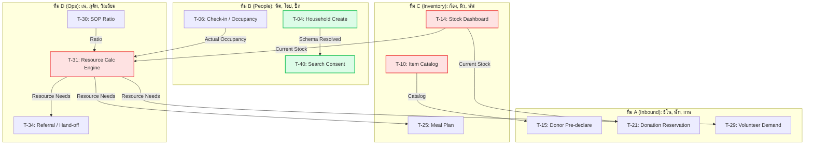

# โครงสร้างและการแบ่งโมดูลให้ 4 ทีม (Team Planning & Balancing)

การคำนวณสถิติรวมของโมดูลทั้งหมดที่ต้องนำมาจัดสรร (โมดูล 02-09 และ 11):
- **จำนวนโมดูลทั้งหมด**: 9 โมดูล
- **จำนวน Task ทั้งหมด**: 34 Tasks
- **ปริมาณแรงงานปรับปรุงสุทธิ (Total Adj MD) รวม**: 121.5 Adj MD
- **ค่าเฉลี่ยเป้าหมายต่อทีม**: **8.5 Tasks** และ **30.375 Adj MD** ต่อทีม

---

## 1. โครงสร้างทีมพัฒนา (Team Roster)

| บทบาท / ทีม | ชื่อเล่น | ชื่อ-นามสกุล | สาขา | ชั้นปี |
| :--- | :--- | :--- | :---: | :---: |
| **Lead** | แจ็ก | สรวิศ สุขการณ์ | CoE | 3 |
| | เด่น | สุธินันท์ รองพล | AIE | 4 |
| **ทีม A** | ชิโน | ทนุธรรม ศุภผล | COE | 3 |
| | นัท | อาณัส อาเก๊ะ | AIE | 2 |
| | กาน | คุณานนต์ หนูแสง | AIE | 4 |
| **ทีม B** | พีค | สักก์ธนัชญ์ ประดิษฐอุกฤษฎ์ | COE | 3 |
| | โฮป | พัฒนชัย พันธุ์เกตุ | COE | 3 |
| | ปิ๊ก | สิรวิชญ์ น้อยผา | AIE | 4 |
| **ทีม C** | ก้อง | กรธัช สุขสวัสดิ์ | COE | 3 |
| | มิว | คีตศิลป์ คงสี | AIE | 4 |
| | พัฟ | ฉัตรชนก นิโครธานนท์ | AIE | 2 |
| **ทีม D** | เน | เนติวุฒิ เกตุกำพล | COE | 4 |
| | ภูดิท | ภูดิท ชูจันทร์ | COE | 2 |
| | วิลเลียม | อภิชาติ จะหย่อ | COE | 2 |

---

## 2. ตารางจัดสรรงานรายทีม (เน้นความสอดคล้องระดับโดเมน Thematic & Schema-Cohesive)

การจัดกลุ่มแบบใหม่นี้มุ่งเน้นการรวมโมดูลที่มีความเชื่อมโยงระดับโครงสร้างฐานข้อมูล (Schema) เข้าไว้ด้วยกันให้มากที่สุด เพื่อลดคอขวดในการทำงานข้ามทีม โดยจัดให้อยู่ในรูปแบบธีมงาน (Thematic) ที่ชัดเจน

### ตารางสรุปปริมาณงานรายทีม

| ทีม | สมาชิก | โมดูลที่รับผิดชอบ | จำนวน Tasks | Adj MD สุทธิ |
| :---: | :--- | :--- | :---: | :---: |
| **ทีม A** | ชิโน, นัท, กาน | 04 (Donation) + 06 (Volunteer) | **8** | **27.5** |
| **ทีม B** | พีค, โฮป, ปิ๊ก | 02 (Household) + 11 (Family Search) + 08 (Security) | **10** | **35.0** |
| **ทีม C** | ก้อง, มิว, พัฟ | 03 (Supply) + 05 (Kitchen & Food) | **10** | **35.0** |
| **ทีม D** | เน, ภูดิท, วิลเลียม | 07 (SOP & Resource Calc) + 09 (Referral) | **6** | **24.0** |
| **รวม** | | | **34** | **121.5** |

### เหตุผลและบทวิเคราะห์รายทีม
1. **ทีม A (ชิโน, นัท, กาน) — 27.5 MD / 8 Tasks**:
   - ดูแลระบบรับของบริจาค [04-donation.md](04-donation.md) และระบบจัดการอาสาสมัคร [06-A.md](06-A.md)
   - *จุดเด่น (Public Inbound)*: เป็นทีมที่เน้นระบบหน้าบ้านสำหรับคนนอก (Public-Facing) ดูแลทรัพยากรขาเข้าจากภายนอกศูนย์ทั้งหมด ทั้งในรูปแบบสิ่งของ (บริจาค) และแรงงาน (อาสาสมัคร)
2. **ทีม B (พีค, โฮป, ปิ๊ก) — 35.0 MD / 10 Tasks**: 
   - ดูแลระบบลงทะเบียนผู้อพยพ [02-people.md](02-people.md), หน้าสืบค้นครอบครัว [11-famsearch.md](11-famsearch.md), และ shelter report cases [08-E.md](08-E.md) (CR-040)
   - *จุดเด่น (Resident Lifecycle & Cases)*: คุมโดเมน "บุคคล" ตั้งแต่ลงทะเบียน สแกน QR เข้าออกศูนย์ สืบค้นชื่อ (Consent) และเคสร้องเรียน/เหตุการณ์ในศูนย์ — รวม schema คนไว้ทีมเดียว
3. **ทีม C (ก้อง, มิว, พัฟ) — 35.0 MD / 10 Tasks**:
   - ดูแลคลังพัสดุสิ่งของ [03-C.md](03-C.md) และระบบอาหาร/โรงครัว [05-D.md](05-D.md)
   - *จุดเด่น (Inventory & Consumption)*: ควบคุมของในคลังและการเบิกจ่ายวัตถุดิบเพื่อทำอาหาร การให้ทีมเดียวกันทำสองส่วนนี้ช่วยให้ฟังก์ชันโรงครัวเบิกของตัดคลังทำงานเชื่อมกันได้ลื่นไหล ไม่ต้องรอ API ข้ามทีม
4. **ทีม D (เน, ภูดิท, วิลเลียม) — 24.0 MD / 6 Tasks**:
   - ดูแลระบบคำนวณทรัพยากรตามมาตรฐาน [07-B.md](07-B.md) และการส่งตัว/ย้ายศูนย์ [09-F.md](09-F.md)
   - *จุดเด่น (Operations & Monitoring)*: ทำหน้าที่ควบคุม Hub ประเมินสถานการณ์กลางรายวัน (Resource Calc) แม้มีจำนวน Task น้อยกว่าทีมอื่น แต่มีความซับซ้อนในการคำนวณสูงมาก (ต้องดึงข้อมูลจากทุกทีม) และเกี่ยวโยงกับการตัดสินใจโอนย้ายคนข้ามศูนย์ (Referral) โดยตรง
   - *หมายเหตุ*: ทีมนี้ได้รับ MD น้อยที่สุด หากทำงานของตนเสร็จอาจจะได้โยกย้ายไปทำงานกับทีมอื่น

---

## 3. วิเคราะห์ความเสี่ยงของทีม
### 3.1. ความเชี่ยวชาญด้าน Architectue Stack
- เนื่องจากสมาชิกหลายคนในทีมไม่มีประสบการณ์ใน svelte, svelte kit, javascript และ typescript โดยเฉพาะ typescript ซึ่งอาจจะงงในช่วงแรก ทำให้มี learning curve สูง ดังนั้นมีโอกาสทีจะใช้เวลาทำแต่ละ task มากกว่า adj. MD ที่ประเมิน   
- คนอื่นๆที่เขียนเป็นมี แจ็ก (ไม่ได้เขียนนานแล้ว) พีค ก้อง ชิโน 
- CouchDB และ PouchDB เป็น tools ที่ไม่เคยใช้อาจจะเวลาคลาดเคลื่อนเพิ่มไปจาก Adj. MD

### 3.2. ความเสี่ยงด้าน Tech Knowhow
- ใน task ที่มีการทำ OTP, Rate limit, Captcha นั้น ไม่เคยมีประสบการณ์การทำ ดังนั้น จะขอความช่วยเหลือจากพี่ๆที่บอ ในส่วนนี้
- ใน task ที่อ้างอิงความรู้พื้นฐานเช่น SOP Calculation ขอให้ส่งเอกสารที่เกี่ยวข้อง เพื่อเป็นแหล่งอ้างอิงให้ทีมงานทำความเข้าใจ

### 3.3. ปัจจัยส่วนตัว
- **สมาชิก AiE ปี 2** (พัฟ, นัท)
    - ค่อนข้างมีความเสี่ยงในการบริหารเวลา จากเทอมที่แล้วๆ เทอม 1 จะมีความเข้มข้นในการเรียนมาก อาจจะมีอุปสรรคในการบริหารเวลาทำงาน
    - ไม่เคยเขียน javascript typescript react คิดว่ามี learning period เยอะกว่าคนอื่น
- **สมาชิก CoE ปี 2** (วิลเลี่ยม, ภูดิท)
    - ความเสี่ยงด้านการบริหารเวลาเรียนต่ำ เนื่องจากเทอมนี้โมดูลหลักไม่ได้หนักมาก
    - มีประสบการณ์เขียน react จากการเรียน webdev ซึ่งพอนำมาใช้กับการเขียน svelte ได้ น่าจะเรียนรู้ได้ไว
- **สมาชิก CoE ปี 3** (ก้อง, โฮป, พีค, ชิโน, แจ็ค)
    - มีความเสี่ยงปานกลาง เนื่องจากโมดูลหลักที่เรียนยังมีความเข้มข้นอยู่ และมีเทอมโปรเจ็คที่ทำในระยะยาว 
    - มีประสบการณ์ผ่านหลายโปรเจ็ค และเคยผ่าน stack svelte (ยกเว้นโฮป) จึงคิดว่าให้จะทำงานได้คล่องกว่าคนอื่นในทีม
- **สมาชิก CoE และ AiE ปี 4** (กาน, ปิ๊ก, เด่น, มิว, เน)
    - เนื่องจากอยู่ปี 4 แล้ว โมดูลเลือกที่เรียนจึงมีความเข้มข้นน้อยลง และมีประสบการณ์หลายโปรเจค สามารถวางใจรับผิดชอบได้
    - AiE ไม่เคยผ่าน stack นี้เช่นเดียวกับปี 2 อาจจะใช้เวลานาน
    - CoE เคยผ่านการเขียน react จากวิชา webdev
    - หลังจากเทอม 2 มีสหกิจทำให้ต้องวางมือจากโปรเจค

## 4. การวิเคราะห์จุดติดขัดระหว่างทีม (Cross-Team Task Blocking Analysis)

หลังจากการปรับกลุ่มเป็นแบบ Thematic & Schema-Cohesive ทำให้ปัญหาบล็อกงานในระดับฐานข้อมูลลดลงอย่างมาก จะเหลือเพียง Data/API Dependency เป็นหลัก:

### 1. ปัญหาคอขวดที่ได้รับการแก้ไขแล้ว (Resolved Internal Dependencies)
*   **ประชากร ➔ การยินยอมค้นหาครอบครัว**: `T-04` และ `T-40` อยู่ในทีม B เดียวกันแล้ว ทีม B สามารถออกแบบโครงสร้าง Schema รวดเดียวจบได้เลย
*   **คำนวณ ➔ การส่งตัว**: `T-31` และ `T-34` อยู่ในทีม D ทีมสามารถอ่านค่าพื้นที่ล้นจาก Engine ตัวเองไปผูกสร้างใบส่งตัวได้ทันที

### 2. จุดติดขัดระหว่าง ทีม C ➔ ทีม A (แคตตาล็อกและคลัง ➔ การรับบริจาค)
*   **จุดเชื่อมต่อ**: 
    - `T-10 (Supply Item catalog)` ➔ `T-15 (Donor pre-declaration)`
    - `T-14 (Stock dashboard)` ➔ `T-21 (Donation reservation)`
*   **คำอธิบาย**: 
    - แบบฟอร์มให้ผู้บริจาคระบุสิ่งของ (T-15) ของ **ทีม A** ต้องการอ้างอิงจากฐานข้อมูลแคตตาล็อกสิ่งของมาตรฐาน (T-10) จาก **ทีม C**
*   **ผลกระทบ (Blocking)**: หากทีม C ไม่วางรากฐาน T-10 และ T-14 ทีม A ต้องทำงานแบบฮาร์ดโค้ดข้ามการเชื่อมโยงระบบจริง

### 3. จุดรวมข้อมูลศูนย์กลางที่ ทีม D (การประเมินทรัพยากรกลาง T-31)
*   **จุดเชื่อมต่อ (ขาเข้า)**: `T-06 (ทีม B)` + `T-14 (ทีม C)` + `T-30 (ทีม D)` ➔ `T-31 (ทีม D)`
*   **จุดเชื่อมต่อ (ขาออก)**: `T-31 (ทีม D)` ➔ `T-25 (ทีม C)` และ `T-29 (ทีม A)`
*   **คำอธิบาย**:
    - Engine ประเมินทรัพยากรกลางรายวัน (T-31) เป็น **Hub ของ Critical Path** ซึ่งต้องรับ Input ถึง 3 ส่วน: ยอดคนในศูนย์จริง (ทีม B), ยอดของในคลัง (ทีม C)
    - ผลการคำนวณจะถูกกระจายไปให้ **ทีม C** จัดสัดส่วนแผนอาหารประจำวัน (T-25) และให้ **ทีม A** เรียกระดมอาสาสมัคร (T-29)
*   **ผลกระทบ (Blocking)**: เป็น Dependency ทาง Data ขนาดใหญ่ที่ยังคงอยู่ หากทีม B และ C ส่งข้อมูลผ่าน API มาไม่พร้อม Engine จะคำนวณไม่ได้ ฉุดให้โรงครัวและการเรียกอาสาล่าช้าตามไปด้วย

---

## 5. ข้อเสนอแนะและมาตรการบรรเทาปัญหา (Mitigation Strategies)

1.  **API Mocking & Contract Freeze (สัปดาห์แรก)**:
    - ในขณะที่ปัญหา Schema ถูกแก้ด้วยโครงสร้างทีมไปส่วนใหญ่แล้ว แต่การส่ง Data หากันยังสำคัญ ให้ Lead พาสมาชิกทีม A, B, C, และ D กำหนดโครงสร้าง JSON Payload สำหรับ: แคตตาล็อกสิ่งของ (T-10), ตัวเลขคนในศูนย์ (T-06), ตัวเลขคลัง (T-14) และผลลัพธ์ของ Calc Engine (T-31) 
    - การ "แช่แข็ง" Mock API พวกนี้จะปลดล็อกให้ทำงานขนานกันได้ทั้ง 4 ทีม 100%
2.  **ลำดับความสำคัญของงาน (Task Prioritization)**:
    - **ทีม C**: ต้องหยิบ `T-10 (Item Catalog)` มาทำให้เสร็จเป็นอันดับแรก เพราะเป็นต้นน้ำของฝั่ง Supply และ Donation ทั้งหมด
    - **ทีม B**: ควรรีบทำ Endpoint สรุปประชากรเข้าออก `T-06` เพื่อปลดล็อกให้ทีม D สามารถเริ่มทดสอบการคำนวณ T-31 ได้
3.  **การใช้ค่าสมมติของ Engine (Hardcode Mocking)**:
    - ระหว่างที่ **ทีม D** เขียน Engine `T-31` อยู่ ให้ **ทีม C** นำค่าจำลองมาใช้เขียนระบบแผนอาหาร `T-25` และให้ **ทีม A** นำค่าจำลองมาใช้คำนวณเป้าอาสาสมัคร `T-29` คู่ขนานกันไปเลย
4.  **การโยกย้ายงานระหว่างทีม (Cross-Team Support)**:
    - กรณีเกิดทีมใดทำงานของตนเสร็จก่อนภายใน sprint นั้น ๆ แล้วเกิด blocking งานที่ไม่สามารถทำต่อได้ จะส่งให้ทีมนั้นไปช่วยทีมอื่นที่ยังติด blocking 
    - ทั้งนี้การทำงานระหว่างให้ยึดตามความรับผิดชอบของทีมหลักที่ได้รับมอบหมาย
    - โดยเฉพาะ ทีม D เนื่องจากมี MD น้อยสุด หากทำงานของตนเสร็จอาจจะได้โยกย้ายไปทำงานกับทีมอื่น
5.  **Pre-sprint tasks**
    - ก่อนเริ่มงานให้สมาชิกในทีมอ่าน task module description และ dods **อย่างละเอียด**
    - ให้แต่ละทีมวิเคราะห์ว่าตนเองจะสามารถทำงานตามกำหนดได้หรือไม่ (พิจราณาปัจจัยส่วนตัวด้วย) 
    - หากไม่สามารถทำได้ให้ปรึกษา MD เพื่อปรับแผนก่อนเริ่มงาน
