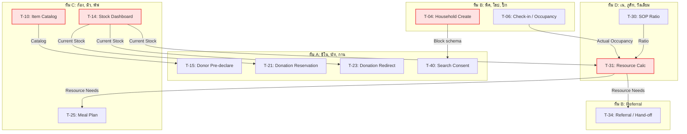

# โครงสร้างและการแบ่งโมดูลให้ 4 ทีม (Team Planning & Balancing)

การคำนวณสถิติรวมของโมดูลทั้งหมดที่ต้องนำมาจัดสรร (โมดูล 02-09 และ 11):
- **จำนวนโมดูลทั้งหมด**: 9 โมดูล
- **จำนวน Task ทั้งหมด**: 34 Tasks
- **ปริมาณแรงงานปรับปรุงสุทธิ (Total Adj MD) รวม**: 121.5 Adj MD
- **ค่าเฉลี่ยเป้าหมายต่อทีม**: **8.5 Tasks** และ **30.375 Adj MD** ต่อทีม

---

## 1. โครงสร้างทีมพัฒนา (Team Roster)

| บทบาท / ทีม | ชื่อเล่น | ชื่อ-นามสกุล | สาขา | ชั้นปี |
| :--- | :--- | :--- | :---: | :---: |
| **Lead** | แจ็ก | สรวิศ สุขการณ์ | CoE | 3 |
| | เด่น | สุธินันท์ รองพล | AIE | 4 |
| **ทีม A** | ชิโน | ทนุธรรม ศุภผล | COE | 3 |
| | นัท | อาณัส อาเก๊ะ | AIE | 2 |
| | กาน | คุณานนต์ หนูแสง | AIE | 4 |
| **ทีม B** | พีค | สักก์ธนัชญ์ ประดิษฐอุกฤษฎ์ | COE | 3 |
| | โฮป | พัฒนชัย พันธุ์เกตุ | COE | 3 |
| | ปิ๊ก | สิรวิชญ์ น้อยผา | AIE | 4 |
| **ทีม C** | ก้อง | กรธัช สุขสวัสดิ์ | COE | 3 |
| | มิว | คีตศิลป์ คงสี | AIE | 4 |
| | พัฟ | ฉัตรชนก นิโครธานนท์ | AIE | 2 |
| **ทีม D** | เน | เนติวุฒิ เกตุกำพล | COE | 4 |
| | ภูดิท | ภูดิท ชูจันทร์ | COE | 2 |
| | วิลเลียม | อภิชาติ จะหย่อ | COE | 2 |

---

## 2. ตารางจัดสรรงานรายทีม (เน้นความเชื่อมโยงระบบย่อย)

การจัดกลุ่มแบบนี้คำนึงถึงฟังก์ชันงานที่มีความคาบเกี่ยวหรือต้องเชื่อมโยงฐานข้อมูล (Schema) ชุดเดียวกัน เพื่อลดการเสียเวลาประสานงานข้ามทีม (Communication Overhead)

### ตารางสรุปปริมาณงานรายทีม

| ทีม | สมาชิก | โมดูลที่รับผิดชอบ | จำนวน Tasks | Adj MD สุทธิ |
| :---: | :--- | :--- | :---: | :---: |
| **ทีม A** | ชิโน, นัท, กาน | 04 (Donation) + 11 (Family Search) | **8** | **27.5** |
| **ทีม B** | พีค, โฮป, ปิ๊ก | 02 (Household) + 08 (Security) + 09 (Referral) | **9** | **31.5** |
| **ทีม C** | ก้อง, มิว, พัฟ | 03 (Supply) + 05 (Kitchen & Food) | **10** | **35.0** |
| **ทีม D** | เน, ภูดิท, วิลเลียม | 06 (Volunteer) + 07 (SOP & Resource Calc) | **7** | **27.5** |
| **รวม** | | | **34** | **121.5** |

### เหตุผลและบทวิเคราะห์รายทีม
1. **ทีม A (ชิโน, นัท, กาน) — 27.5 MD / 8 Tasks**:
   - ดูแลระบบรับของบริจาค [04-donation.md](04-donation.md) และหน้าสืบค้นครอบครัวสำหรับบุคคลภายนอก [11-famsearch.md](11-famsearch.md)
   - *จุดเด่น*: เป็นโมดูลที่เน้นระบบหน้าบ้านสำหรับบุคคลภายนอก (Public-Facing & Guest-Facing) โดยมีข้อกำหนดเรื่องความปลอดภัยที่ไม่มีระบบ Login (No-auth) จึงต้องใช้กลไกจำพวก OTP, CAPTCHA, Rate-limiting ป้องกันสแปมร่วมกัน รวมถึงการจัดการนโยบายส่วนบุคคล (PDPA/Consent & Anti-enumeration)
2. **ทีม B (พีค, โฮป, ปิ๊ก) — 31.5 MD / 9 Tasks**: 
   - ดูแลระบบลงทะเบียนผู้อพยพ [02-people.md](02-people.md) ระบบความปลอดภัยเข้าออก [08-E.md](08-E.md) และระบบการย้ายตัว/ส่งตัว [09-F.md](09-F.md)
   - *จุดเด่น*: จัดการข้อมูลระดับบุคคล (Person/Household Data-centric) ทั้งการจัดโซนพักอาศัย การลงบันทึกเช็คอินความปลอดภัย และการย้ายศูนย์ลี้ภัย ข้อมูลไหลต่อเนื่องอยู่ในกลุ่มสกีมาเดียวกันทั้งหมด
3. **ทีม C (ก้อง, มิว, พัฟ) — 35.0 MD / 10 Tasks**:
   - ดูแลคลังพัสดุสิ่งของ [03-C.md](03-C.md) และระบบอาหาร/โรงครัว [05-D.md](05-D.md)
   - *จุดเด่น*: โรงครัวต้องมีการร้องขอเบิกจ่ายพัสดุและอาหารสดตัดยอดสต็อกคลัง (Kitchen Requisition) การให้ทีมเดียวกันทำทั้งสองส่วนทำให้พัฒนาและเชื่อมต่อฟังก์ชันตัดยอดคลังได้ทันที ไม่ต้องมีการเจรจาสัญญาส่งรับข้ามทีม
   - *ข้อสังเกต*: โหลดงาน MD สูงที่สุดในกลุ่ม แต่เป็นโดเมนคลังสินค้า (Inventory-focused) ที่มี Logic คล้ายคลึงกันทำให้พัฒนาต่อยอดได้รวดเร็ว
4. **ทีม D (เน, ภูดิท, วิลเลียม) — 27.5 MD / 7 Tasks**:
   - ดูแลระบบจัดการอาสาสมัคร [06-A.md](06-A.md) และระบบคำนวณทรัพยากรตามเกณฑ์มาตรฐาน [07-B.md](07-B.md)
   - *จุดเด่น*: ระบบจัดเวรสเตชันทำงานของอาสาสมัครต้องการทราบความต้องการและสัดส่วนกำลังพลจากเครื่องคำนวณตามมาตรฐาน SOP เพื่อการจัดคู่ทักษะ (Skill Match) ทำให้ทำงานสอดรับกันอย่างดี

---

## 3. การวิเคราะห์จุดติดขัดระหว่างทีม (Cross-Team Task Blocking Analysis)

จากการตรวจสอบเงื่อนไขความเข้าขากันของงานในเอกสาร Task Breakdown ล่าสุด พบจุดเชื่อมโยงข้ามทีมที่สำคัญซึ่งอาจทำให้เกิดการติดขัด (Blocking) หากไม่มีการประสานงานล่วงหน้า:

### 1. จุดติดขัดระหว่าง ทีม B ➔ ทีม A (ประชากร ➔ การยินยอมค้นหาครอบครัว)
*   **จุดเชื่อมต่อ**: `T-04 (Household create)` ➔ `T-40 (Search consent)`
*   **คำอธิบาย**: ระบบสืบค้นข้อมูลครอบครัวสำหรับคนนอก (T-40) ของ **ทีม A** จะต้องทำการบันทึกสถานะยินยอมค้นหา (Consent/Opt-out) โดยผูกโครงสร้างกับฐานข้อมูลประชากร (Household) ของ **ทีม B**
*   **ผลกระทบ (Blocking)**: ทีม A จะไม่สามารถออกแบบระบบจัดการ Consent ได้สมบูรณ์ หากทีม B ยังไม่ได้ข้อสรุปว่า Schema ฐานข้อมูลครัวเรือนใน T-04 จะมีหน้าตาเป็นอย่างไร

### 2. จุดติดขัดระหว่าง ทีม C ➔ ทีม A (แคตตาล็อกและคลัง ➔ การรับบริจาค)
*   **จุดเชื่อมต่อ**: 
    - `T-10 (Supply Item catalog)` ➔ `T-15 (Donor pre-declaration)`
    - `T-14 (Stock dashboard)` ➔ `T-21 (Donation reservation)` และ `T-23 (Smart redirect)`
*   **คำอธิบาย**: 
    - แบบฟอร์มให้ผู้บริจาคระบุสิ่งของ (T-15) ของ **ทีม A** ต้องการอ้างอิงจากฐานข้อมูลแคตตาล็อกสิ่งของมาตรฐาน (T-10) จาก **ทีม C**
    - ระบบจองโควตาบริจาคและเบี่ยงเบนเส้นทางอัจฉริยะ (T-21 / T-23) ของ **ทีม A** จำเป็นต้องอ่านยอดของคงเหลือและความขาดแคลนจากแดชบอร์ดหลัก (T-14) ของ **ทีม C** เพื่อดูว่าศูนย์รับของประเภทนั้นเต็มหรือยัง
*   **ผลกระทบ (Blocking)**: หากทีม C ไม่วางรากฐาน T-10 และ T-14 ทีม A ต้องทำงานแบบฮาร์ดโค้ด และจะไม่สามารถพัฒนาเงื่อนไขการตัดโควตาหรือปฏิเสธการบริจาคได้จริง

### 3. จุดรวมข้อมูลศูนย์กลางที่ ทีม D (การประเมินทรัพยากรกลาง T-31)
*   **จุดเชื่อมต่อ**: 
    - `T-06 (Household check-in - ทีม B)` + `T-14 (Stock dashboard - ทีม C)` + `T-30 (SOP Ratio - ทีม D)` ➔ `T-31 (Resource calc engine - ทีม D)`
    - `T-31 (Resource calc engine - ทีม D)` ➔ `T-25 (Meal plan - ทีม C)` และ `T-34 (Referral - ทีม B)`
*   **คำอธิบาย**:
    - Engine ประเมินทรัพยากรกลางรายวัน (T-31) ถือเป็น **Hub ของ Critical Path** ซึ่งต้องรับ Input ถึง 3 ส่วน: ยอดคนในศูนย์จริงจาก **ทีม B**, ยอดของในคลังจาก **ทีม C**, และอัตราส่วน SOP จาก **ทีม D** เอง
    - ผลการคำนวณ "ต้องการเท่าไร มีเท่าไร ขาดเท่าไร" จะถูกส่งไปให้ **ทีม C** ใช้จัดสัดส่วนแผนอาหารประจำวัน (T-25) และให้ **ทีม B** นำไปใช้อ้างอิงในการเขียนคำร้องขอส่งต่อ/ขอทรัพยากรเพิ่มข้ามศูนย์ (T-34)
*   **ผลกระทบ (Blocking)**: เกิด Dependency ขนาดใหญ่แบบหลายทิศทาง หากข้อมูล Input จากทีม B และ C ไม่พร้อม Engine T-31 จะคำนวณผลลัพธ์ไม่ได้ ซึ่งจะไปฉุดให้ระบบโรงครัวและระบบส่งต่อ (Referral) ล่าช้าตามไปด้วย

---

## 4. ข้อเสนอแนะและมาตรการบรรเทาปัญหา (Mitigation Strategies)

1.  **API Mocking & Contract Freeze (ควรทำทันทีในสัปดาห์แรก)**:
    - ให้ Lead พาสมาชิกทีม B, C, และ D มากำหนดโครงสร้าง JSON Payload (Schema) ร่วมกันสำหรับส่วนประกอบสำคัญ ได้แก่: ข้อมูลประชากรตั้งต้น (T-04), แคตตาล็อกสิ่งของ (T-10), ตัวเลขคนในศูนย์ (T-06), และตัวเลขของคงคลัง (T-14)
    - ให้ทำการ "แช่แข็ง" (Freeze Contract) ข้อตกลงนี้เป็น API Mocking ขึ้นมา เพื่อให้ทีมที่ต้องรอบริโภคข้อมูล (ทีม A และ D) สามารถเขียนโค้ดและทดสอบล่วงหน้าได้ทันที ไม่ต้องรอกัน
2.  **ปรับลำดับความสำคัญของงาน (Task Prioritization)**:
    - **ทีม B**: ควรเร่งออกแบบ Data Structure หลักของ `T-04 (Household)` ให้เสร็จก่อน เพื่อปลดล็อกทีม A และเป็นรากฐานต่อไปยัง `T-06` 
    - **ทีม C**: ควรหยิบ `T-10 (Item Catalog)` มาทำเป็น Task แรก ๆ เพราะเป็นพื้นฐานสำคัญที่สุดของระบบสิ่งของทั้งหมด รวมถึงระบบบริจาคฝั่งหน้าบ้าน
3.  **การใช้ค่าสมมติไปพลางก่อน (Hardcode Mocking)**:
    - ในช่วงที่ `T-31` ยังเขียน Engine ไม่เสร็จ: **ทีม C** สามารถใช้ชุดข้อมูลสมมติว่าของขาดเท่าไรไปทดลองเขียนฟังก์ชันจัดอาหาร `T-25 (Meal Plan)` ได้ และ **ทีม B** ก็สามารถใช้ค่าสมมติว่าพื้นที่เต็มเพื่อพัฒนา Flow การส่งต่อผู้ลี้ภัย `T-34 (Referral)` ขนานกันไปได้เลย