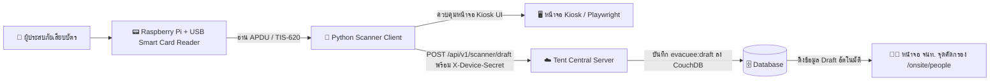

# 💳 Smart Card Scanner Client สำหรับ SmartShelter (Tent)

คู่มือการติดตั้งและตั้งค่าโปรแกรม **Scanner Client** บนบอร์ด **Raspberry Pi** (หรือคอมพิวเตอร์ Linux/Ubuntu/Debian) แบบละเอียดตั้งแต่เริ่มต้น (From Scratch) เพื่อทำหน้าที่เป็น **ตู้ Kiosk เสียบบัตรประชาชนอัตโนมัติ** ณ จุดลงทะเบียนศูนย์พักพิง

---

## 📋 สารบัญ
1. [ภาพรวมสถาปัตยกรรม (Architecture)](#-ภาพรวมสถาปัตยกรรม-architecture)
2. [อุปกรณ์ฮาร์ดแวร์ที่แนะนำ (Hardware Requirements)](#-อุปกรณ์ฮาร์ดแวร์ที่แนะนำ-hardware-requirements)
3. [ขั้นตอนการติดตั้งตั้งแต่เริ่มต้น (Step-by-Step Installation)](#-ขั้นตอนการติดตั้งตั้งแต่เริ่มต้น-step-by-step-installation)
   - [Step 1: การเตรียมความพร้อมก่อนเริ่มต้น (Pre-Preparation & SSH Remote Access)](#step-1-การเตรียมความพร้อมก่อนเริ่มต้น-pre-preparation--ssh-remote-access)
   - [Step 2: ติดตั้ง System Packages & Smart Card Driver](#step-2-ติดตั้ง-system-packages--smart-card-driver)
   - [Step 3: ทดสอบการทำงานของเครื่องอ่านบัตร (Hardware Check)](#step-3-ทดสอบการทำงานของเครื่องอ่านบัตร-hardware-check)
   - [Step 4: Clone โปรเจกต์ & สร้าง Python Virtual Environment](#step-4-clone-โปรเจกต์--สร้าง-python-virtual-environment)
   - [Step 5: ติดตั้ง Playwright & Browser Dependencies](#step-5-ติดตั้ง-playwright--browser-dependencies)
   - [Step 6: ตั้งค่า Configuration (.env)](#step-6-ตั้งค่า-configuration-env)
   - [Step 7: ทดสอบรันระบบ](#step-7-ทดสอบรันระบบ)
4. [การตั้งค่าให้รันอัตโนมัติเมื่อเปิดเครื่อง (Autostart on Boot)](#-การตั้งค่าให้รันอัตโนมัติเมื่อเปิดเครื่อง-autostart-on-boot)
5. [การตั้งค่าจอแสดงผลแนวตั้งและการป้องกันจอดับ (Display Optimization)](#-การตั้งค่าจอแสดงผลแนวตั้งและการป้องกันจอดับ-display-optimization)
6. [การแก้ไขปัญหาที่พบบ่อย (Troubleshooting & FAQ)](#-การแก้ไขปัญหาที่พบบ่อย-troubleshooting--faq)

---

## 🏛️ ภาพรวมสถาปัตยกรรม (Architecture)



1. **Kiosk UI**: แสดงหน้าจอแนะนำผู้ประสบภัยแบบ Interactive (`/kiosk/scanner/waiting` $\rightarrow$ `reading` $\rightarrow$ `remove-card`)
2. **Card Engine**: ดึงข้อมูลเลขบัตร 13 หลัก, ชื่อ-นามสกุล (ไทย/อังกฤษ), วันเกิด, เพศ, ที่อยู่ตามทะเบียนบ้าน และรูปถ่ายใบหน้าความละเอียดสูง
3. **Inbound Draft Sync**: ส่งข้อมูลไปยัง Tent Server พร้อมยืนยันตัวตนด้วย `X-Device-Id` และ `X-Device-Secret`
4. **Staff Intake**: เจ้าหน้าที่ค้นหาชื่อหรือเลขบัตร จะพบป้าย `[ 🪪 เสียบบัตรแล้ว (รอคัดกรอง) ]` พร้อม Autofill ข้อมูลและรหัสไปรษณีย์เข้าฟอร์มลงทะเบียนทันที

---

## 🔌 อุปกรณ์ฮาร์ดแวร์ที่แนะนำ (Hardware Requirements)

1. **บอร์ดคอมพิวเตอร์**:
   - Raspberry Pi 4 Model B (แนะนำ RAM 2GB / 4GB ขึ้นไป) หรือ Raspberry Pi 5
   - แนะนำระบบปฏิบัติการ: **Raspberry Pi OS (64-bit) Bookworm with Desktop**
2. **MicroSD Card**: ขนาด 16GB ขึ้นไป (Class 10 / A2 ขึ้นไป เพื่อความเร็วในการบูต)
3. **USB Smart Card Reader**: เครื่องอ่านบัตรที่รองรับมาตรฐาน USB CCID และ PC/SC เช่น:
   - Identiv SCR3310 / uTrust 2700R
   - ACS ACR39U / ACR38U
   - Zoweetek / Rocketek หรือเครื่องอ่านบัตรประชาชนมาตรฐานทั่วไป
4. **จอแสดงผล (Display)**:
   - จอ HDMI หรือ DSI Touchscreen (แนะนำความละเอียด 1080x1920 แนวตั้ง หรือ 1920x1080 แนวนอน)
5. **แหล่งจ่ายไฟ (Power Supply)**: อะแดปเตอร์มาตรฐาน Type-C 5V 3A (สำหรับ RPi 4) หรือ 5V 5A (สำหรับ RPi 5)

---

## 🚀 ขั้นตอนการติดตั้งตั้งแต่เริ่มต้น (Step-by-Step Installation)

### Step 1: การเตรียมความพร้อมก่อนเริ่มต้น (Pre-Preparation & SSH Remote Access)

#### 1.1 เขียนระบบปฏิบัติการ (Flash OS)
1. ดาวน์โหลดและเปิดโปรแกรม [Raspberry Pi Imager](https://www.raspberrypi.com/software/) บนคอมพิวเตอร์ของคุณ
2. เลือก **OS**: `Raspberry Pi OS (64-bit)` (Debian Bookworm with Desktop)
3. กดรูปเฟือง (⚙️) หรือ Edit Settings เพื่อตั้งค่าล่วงหน้า:
   - กำหนด **Hostname** (เช่น `kiosk-pi`)
   - กำหนด **Username** และ **Password** (เช่น user: `pi`, pass: `yourpassword`)
   - ตั้งค่า **Wi-Fi SSID/Password** และ **Timezone** (`Asia/Bangkok`)
   - ติ๊กถูกเลือก **Enable SSH** (เลือก Use password authentication)
4. กด Write เพื่อเขียนระบบลงใน MicroSD Card แล้วนำไปเสียบเข้า Raspberry Pi เปิดเครื่องและเชื่อมต่อเครือข่าย

#### 1.2 วิธีเปิดใช้งาน SSH บนตัวเครื่อง Kiosk (เลือกวิธีใดวิธีหนึ่ง)
หากไม่ได้เปิด SSH ไว้ตั้งแต่ตอน Flash หรือต้องการเปิดใช้งานบนเครื่องโดยตรง:

- **วิธีที่ 1: สั่งผ่าน Terminal (เร็วที่สุด):**
  ```bash
  sudo systemctl enable --now ssh
  ```
- **วิธีที่ 2: ผ่านเมนูตั้งค่า `raspi-config`:**
  ```bash
  sudo raspi-config
  # เลือก 3. Interface Options -> I2. SSH -> เลือก <Yes> -> <Finish>
  ```
- **วิธีที่ 3: เปิดล่วงหน้าผ่านไฟล์บน MicroSD Card (Headless):**
  เสียบ MicroSD Card เข้าคอมพิวเตอร์ เปิดไดรฟ์ `boot` (หรือ `bootfs`) แล้วสร้างไฟล์เปล่าชื่อ `ssh` (ไม่มีนามสกุลไฟล์) วางไว้ที่ Root ของไดรฟ์ จากนั้นนำการ์ดไปเปิดเครื่อง

#### 1.3 วิธีดู IP Address และ Remote เข้าเครื่อง
1. ตรวจสอบ IP Address ของ Raspberry Pi:
   ```bash
   hostname -I
   ```
   *(จะได้ IP เช่น `192.168.1.105`)*
2. รีโมตจากคอมพิวเตอร์เครื่องอื่นผ่าน Terminal หรือ VS Code Remote SSH:
   ```bash
   ssh pi@192.168.1.105
   ```

#### 1.4 ทริกการสลับหน้าจอ Terminal ขณะโปรแกรม Kiosk รันเต็มจอ
หากต้องการสลับออกมาสั่งงาน Command Line ขณะที่หน้าจอ Kiosk เปิดค้างอยู่:
- กด **`Ctrl + Alt + T`** เพื่อเปิดหน้าต่าง Terminal
- กด **`Ctrl + Alt + F2`** เพื่อสลับเข้าหน้าจอ TTY Console (กด **`Ctrl + Alt + F1`** หรือ **`F7`** เพื่อกลับหน้าจอกราฟิก)
- กด **`Alt + F4`** เพื่อปิดโปรแกรม Kiosk ชั่วคราว

#### 1.5 อัปเดตแพ็กเกจระบบให้เป็นเวอร์ชันล่าสุด
```bash
sudo apt update && sudo apt full-upgrade -y
```

---

### Step 2: ติดตั้ง System Packages & Smart Card Driver

ติดตั้งไลบรารีพื้นฐานสำหรับการคอมไพล์ C-Extensions, ตัวจัดการ Smart Card (`pcscd`), และแพ็กเกจที่จำเป็นสำหรับ Python:

```bash
sudo apt install -y \
  pcscd \
  pcsc-tools \
  libpcsclite-dev \
  libpcsclite1 \
  libccid \
  python3 \
  python3-pip \
  python3-venv \
  python3-dev \
  build-essential \
  swig \
  libjpeg-dev \
  zlib1g-dev \
  chromium-browser \
  git \
  curl
```

> **คำอธิบายแพ็กเกจสำคัญ:**
> - `pcscd` & `libccid`: Daemon ควบคุมเครื่องอ่านสมาร์ตการ์ดผ่านไดรเวอร์มาตรฐาน CCID
> - `libpcsclite-dev` & `swig`: Header และ Wrapper Compiler สำหรับคอมไพล์ไลบรารี `pyscard` ใน Python (จำเป็นอย่างยิ่งบน ARM)
> - `libjpeg-dev` & `zlib1g-dev`: สำหรับไลบรารี `Pillow` ในการถอดรหัสรูปถ่ายหน้าบัตรประชาชน
> - `chromium-browser`: เว็บบราวเซอร์หลักของระบบที่คอมไพล์มาสำหรับชิป ARM ของ Raspberry Pi

เปิดใช้งานและรัน Service `pcscd`:
```bash
sudo systemctl enable --now pcscd
```

ตรวจสอบว่า service ทำงานปกติ:
```bash
sudo systemctl status pcscd
```

---

### Step 3: ทดสอบการทำงานของเครื่องอ่านบัตร (Hardware Check)

1. เสียบสาย USB เครื่องอ่านบัตรเข้ากับพอร์ต USB ของ Raspberry Pi
2. ตรวจสอบว่าระบบมองเห็นอุปกรณ์ USB:
   ```bash
   lsusb
   ```
   *(จะพบชื่อผู้ผลิตเครื่องอ่านบัตร เช่น `Realtek Corp.`, `Identiv`, หรือ `Advanced Card Systems`)*

3. ทดสอบการตรวจจับบัตรด้วยคำสั่ง `pcsc_scan`:
   ```bash
   pcsc_scan
   ```
4. **ทดลองเสียบบัตรประชาชนไทยเข้าไปในเครื่องอ่าน**:
   - ระบบจะตรวจพบการ์ดและแสดงค่า ATR (Answer To Reset)
   - หากขึ้นข้อความระบุว่าพบ `Thai National ID Card` แสดงว่าฮาร์ดแวร์และไดรเวอร์ทำงานสมบูรณ์ 100%
   - กด `Ctrl + C` เพื่อออกจากโปรแกรมทดสอบ

---

### Step 4: Clone โปรเจกต์ & สร้าง Python Virtual Environment

1. ย้ายไปยังโฟลเดอร์ Home และดาวน์โหลดโค้ดโปรเจกต์:
   ```bash
   cd /home/pi
   git clone https://github.com/your-org/tent.git
   cd tent/scanner_client
   ```

2. สร้างและเปิดใช้งาน Python Virtual Environment (venv):
   ```bash
   python3 -m venv .venv
   source .venv/bin/activate
   ```

3. อัปเกรดเครื่องมือจัดการแพ็กเกจ Python:
   ```bash
   pip install --upgrade pip setuptools wheel
   ```

4. ติดตั้ง Python Dependencies จากไฟล์ `requirements.txt`:
   ```bash
   pip install -r requirements.txt
   ```

---

### Step 5: ติดตั้ง Playwright & Browser Dependencies

เนื่องจาก Raspberry Pi ทำงานบนสถาปัตยกรรม **ARM64 (aarch64)** วิธีที่เสถียรและเร็วที่สุดคือการใช้ **System Chromium** ที่ติดตั้งผ่าน `apt` หรือติดตั้งเบราว์เซอร์ของ Playwright:

#### วิธีที่ 1 (แนะนำสำหรับ Raspberry Pi): ใช้ System Chromium
ระบบได้ติดตั้ง `chromium-browser` มาใน Step 2 แล้ว สามารถระบุ Path ใน `.env` ได้ทันที:
```env
BROWSER_EXECUTABLE_PATH=/usr/bin/chromium-browser
```

#### วิธีที่ 2: ติดตั้ง Chromium Bundled ของ Playwright
```bash
playwright install chromium
playwright install-deps chromium
```

---

### Step 6: ตั้งค่า Configuration (.env)

คัดลอกไฟล์ตัวอย่าง `.env.example` มาสร้างเป็น `.env`:
```bash
cp .env.example .env
nano .env
```

แก้ไขข้อมูลการตั้งค่าให้ตรงกับการใช้งาน:
```env
# URL ของ Tent Server (IP Address ของเครื่องเซิร์ฟเวอร์หลัก)
TENT_BASE_URL=http://192.168.1.100:5173

# Device ID และ Secret ที่ได้รับจากระบบ (หรือสร้างผ่าน seed:scanner)
DEVICE_ID=kiosk-test
DEVICE_SECRET=kisok-test-secret

# กำหนด Path ของ Browser ในระบบ
BROWSER_EXECUTABLE_PATH=/usr/bin/chromium-browser

# โหมดการแสดงผล (false = Kiosk Mode เต็มจอไม่มีแถบเครื่องมือ, true = หน้าต่างสำหรับทดสอบ)
DEBUG=false

# ขนาดหน้าจอแนวตั้ง (กรณีรันแบบ Windowed)
WINDOW_WIDTH=1080
WINDOW_HEIGHT=1920

# ความถี่ในการตรวจสอบสถานะบัตร (วินาที)
POLL_INTERVAL=0.5
```
*(กด `Ctrl + O` แล้ว `Enter` เพื่อบันทึก และ `Ctrl + X` เพื่อออก)*

---

### Step 7: ทดสอบรันระบบ

#### 1. ทดสอบอ่านข้อมูลบัตรผ่าน Terminal (CLI Smoke Test):
```bash
source .venv/bin/activate
python test_card.py
```
เมื่อเสียบบัตรประชาชน ระบบจะแสดงข้อมูลชื่อ, เลข 13 หลัก, ที่อยู่ และบันทึกรูปถ่ายหน้าบัตรเป็นไฟล์ `test_photo.jpg`

#### 2. ทดสอบรันระบบเต็มรูปแบบ (Playwright Kiosk + Inbound Sync):
```bash
python main.py
```
- ระบบจะเปิดหน้าจอ Kiosk แสดงแอนิเมชันรอนำบัตรประชาชนมาเสียบ
- เมื่อเสียบบัตร หน้าจอจะเปลี่ยนเป็นข้อความกำลังอ่านข้อมูล พร้อมส่งข้อมูลเข้า Tent Server
- เมื่ออ่านเสร็จ หน้าจอจะแจ้งเตือนให้นำบัตรออก และส่งเสียง/แสดงสีสถานะ
- ถอดบัตรออก หน้าจอจะวนกลับมารอผู้ประสบภัยคนต่อไปอัตโนมัติ

---

## 🔄 การตั้งค่าให้รันอัตโนมัติเมื่อเปิดเครื่อง (Autostart on Boot)

เพื่อให้ Raspberry Pi ทำงานเป็น Kiosk Standalone เปิดเครื่องแล้วเข้าโปรแกรมสแกนบัตรทันที:

### Step 1: ให้สิทธิ์รันสคริปต์ `start_kiosk.sh`
ในโฟลเดอร์ `scanner_client` มีสคริปต์ `start_kiosk.sh` ที่ช่วยจัดการ Environment Variables, Display และ Log ไว้ให้แล้ว:
```bash
cd ~/tent/scanner_client
chmod +x start_kiosk.sh
```

### Step 2: เลือกวิธีตั้งค่า Autostart (แนะนำวิธีที่ 1 หรือ 2)

#### วิธีที่ 1: ผ่าน Desktop Autostart (`.desktop`)
1. สร้างโฟลเดอร์ autostart ใน Home directory ของคุณ:
   ```bash
   mkdir -p ~/.config/autostart
   ```
2. สร้างไฟล์ `.desktop`:
   ```bash
   nano ~/.config/autostart/scanner-kiosk.desktop
   ```
3. ใส่ข้อความคอนฟิกต่อไปนี้ *(แทนที่ `/home/kiosk` ด้วย path บัญชีผู้ใช้ของคุณ)*:
   ```ini
   [Desktop Entry]
   Type=Application
   Name=SmartShelter Kiosk
   Comment=Start SmartShelter Card Scanner Kiosk
   Exec=/home/kiosk/tent/scanner_client/start_kiosk.sh
   Terminal=false
   X-GNOME-Autostart-enabled=true
   ```
4. บันทึกไฟล์ (`Ctrl+O` $\rightarrow$ `Enter` $\rightarrow$ `Ctrl+X`)

---

#### วิธีที่ 2: สำหรับ Raspberry Pi OS Bookworm (Wayland / Wayfire)
หากใช้ระบบปฏิบัติการ Bookworm เวอร์ชันล่าสุดที่เป็น Wayland สามารถเพิ่มคำสั่งในตัวจัดการหน้าต่างโดยตรง:
1. เปิดไฟล์ตั้งค่า Wayfire:
   ```bash
   nano ~/.config/wayfire.ini
   ```
2. เลื่อนลงไปที่หมวด `[autostart]` (หากไม่มีให้พิมพ์เพิ่มล่างสุด):
   ```ini
   [autostart]
   kiosk = /home/kiosk/tent/scanner_client/start_kiosk.sh
   ```
*(กรณีเป็น Labwc รุ่นล่าสุด ให้ใส่ `/home/kiosk/tent/scanner_client/start_kiosk.sh &` ใน `~/.config/labwc/autostart`)*

---

### 🔍 วิธีตรวจสอบ Log เมื่อ Autostart ไม่ทำงาน
หากบูตเครื่องใหม่แล้วโปรแกรมไม่เปิดขึ้นมา ให้เปิดดู Log ความผิดพลาดได้ที่:
```bash
cat /tmp/kiosk_autostart.log
```

---

## 🖥️ การตั้งค่าจอแสดงผลแนวตั้งและการป้องกันจอดับ (Display Optimization)

### 1. ป้องกันหน้าจอดับ (Disable Screen Blanking / Sleep)
1. เปิดเมนูตั้งค่า Raspberry Pi:
   ```bash
   sudo raspi-config
   ```
2. ไปที่ **Display Options** $\rightarrow$ **Screen Blanking** $\rightarrow$ เลือก **No** (Disable)
3. เลือก **Finish** และ Reboot เครื่อง

### 2. ตั้งค่าการหมุนหน้าจอเป็นแนวตั้ง (Portrait Mode)
- **บน Raspberry Pi OS (Wayland / Wayfire):**
  ไปที่เมนู **Raspberry Pi Menu** $\rightarrow$ **Preferences** $\rightarrow$ **Screen Configuration** $\rightarrow$ คลิกขวาที่หน้าจอ $\rightarrow$ **Orientation** $\rightarrow$ เลือก `Right (90°)` หรือ `Left (270°)` $\rightarrow$ กด Apply
- **ผ่านไฟล์ `/boot/firmware/cmdline.txt` (สำหรับ HDMI Display):**
  เพิ่มค่า `video=HDMI-A-1:1080x1920M@60,rotate=90` ต่อท้ายบรรทัด

---

## ❓ การแก้ไขปัญหาที่พบบ่อย (Troubleshooting & FAQ)

| ปัญหา | สาเหตุที่เป็นไปได้ | แนวทางแก้ไข |
| :--- | :--- | :--- |
| **`ImportError: No module named smartcard`** หรือ `pyscard` build ล้มเหลว | ขาดตัวคอมไพล์ C หรือ header ของ PC/SC | รัน `sudo apt install -y swig libpcsclite-dev build-essential` แล้วสั่ง `pip install --no-cache-dir pyscard` ใหม่ |
| **`No readers found` / `SCardListReaders failed`** | Service `pcscd` ยังไม่เริ่มทำงาน หรือพอร์ต USB จ่ายไฟไม่พอ | ตรวจสอบด้วย `sudo systemctl status pcscd` หากหยุดทำงานให้รัน `sudo systemctl restart pcscd` และเสียบสาย USB ให้แน่น |
| **`Reader is busy` / `Sharing violation`** | มีโปรเซสอื่นแย่งจองเครื่องอ่านบัตร | ปิดโปรแกรมหรือคำสั่ง `pcsc_scan` หรือ Python script อื่นที่รันค้างอยู่ |
| **Playwright Browser Crash บน ARM** | ขาด shared libraries ของ Chromium | ใช้ System Chromium โดยกำหนด `BROWSER_EXECUTABLE_PATH=/usr/bin/chromium-browser` ใน `.env` |
| **`Missing X server or $DISPLAY`** เมื่อรันผ่าน SSH | เซสชัน SSH ไม่ได้รับค่าตัวแปรการแสดงผลกราฟิก | สั่งรันด้วย `DISPLAY=:0 python main.py` (หรือ `WAYLAND_DISPLAY=wayland-0 DISPLAY=:0 python main.py`) หรือตั้งค่า `HEADLESS=true` ใน `.env` หากต้องการทดสอบโดยไม่เปิดหน้าต่าง UI |
| **Server ตอบกลับ 401 Unauthorized** | `DEVICE_ID` หรือ `DEVICE_SECRET` ไม่ตรงกับที่ลงทะเบียนใน Tent Central Server | ตรวจสอบค่าใน `.env` หรือรันสคริปต์ `pnpm seed:scanner` บนเซิร์ฟเวอร์เพื่อสร้างอุปกรณ์ `kiosk-test` |
| **อ่านบัตรแล้วรูปถ่ายไม่ขึ้น** | ขาดไลบรารีประมวลผลรูปภาพ `libjpeg` | รัน `sudo apt install -y libjpeg-dev zlib1g-dev` แล้วติดตั้ง `Pillow` ใหม่: `pip install --upgrade --force-reinstall pillow` |
