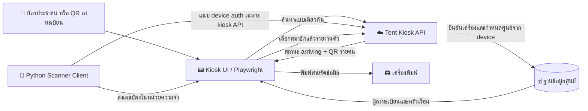

# 💳 Smart Card Scanner Client สำหรับ SmartShelter (Tent)

คู่มือการติดตั้งและตั้งค่าโปรแกรม **Scanner Client** บนบอร์ด **Raspberry Pi** (หรือคอมพิวเตอร์ Linux/Ubuntu/Debian) แบบละเอียดตั้งแต่เริ่มต้น (From Scratch) เพื่อทำหน้าที่เป็น **ตู้ Kiosk เสียบบัตรประชาชนอัตโนมัติ** ณ จุดลงทะเบียนศูนย์พักพิง

---

## 📋 สารบัญ

1. [ภาพรวมสถาปัตยกรรม (Architecture)](#-ภาพรวมสถาปัตยกรรม-architecture)
2. [อุปกรณ์ฮาร์ดแวร์ที่แนะนำ (Hardware Requirements)](#-อุปกรณ์ฮาร์ดแวร์ที่แนะนำ-hardware-requirements)
3. [ขั้นตอนการติดตั้งตั้งแต่เริ่มต้น (Step-by-Step Installation)](#-ขั้นตอนการติดตั้งตั้งแต่เริ่มต้น-step-by-step-installation)
   - [Step 1: การเตรียมความพร้อมก่อนเริ่มต้น (Pre-Preparation & SSH Remote Access)](#step-1-การเตรียมความพร้อมก่อนเริ่มต้น-pre-preparation--ssh-remote-access)
   - [Step 2: ติดตั้ง System Packages & Smart Card Driver](#step-2-ติดตั้ง-system-packages--smart-card-driver)
   - [Step 3: ทดสอบการทำงานของเครื่องอ่านบัตร (Hardware Check)](#step-3-ทดสอบการทำงานของเครื่องอ่านบัตร-hardware-check)
   - [Step 4: Clone โปรเจกต์ & สร้าง Python Virtual Environment](#step-4-clone-โปรเจกต์--สร้าง-python-virtual-environment)
   - [Step 5: ติดตั้ง Playwright & Browser Dependencies](#step-5-ติดตั้ง-playwright--browser-dependencies)
   - [Step 6: ตั้งค่า Configuration (.env)](#step-6-ตั้งค่า-configuration-env)
   - [Step 7: ทดสอบรันระบบ](#step-7-ทดสอบรันระบบ)
4. [การตั้งค่าให้รันอัตโนมัติเมื่อเปิดเครื่อง (Autostart on Boot)](#-การตั้งค่าให้รันอัตโนมัติเมื่อเปิดเครื่อง-autostart-on-boot)
5. [การตั้งค่าจอแสดงผลแนวตั้งและการป้องกันจอดับ (Display Optimization)](#-การตั้งค่าจอแสดงผลแนวตั้งและการป้องกันจอดับ-display-optimization)
6. [เครื่องพิมพ์ Label XP-365B (USB Label Printer)](#-เครื่องพิมพ์-label-xp-365b-usb-label-printer)
7. [การแก้ไขปัญหาที่พบบ่อย (Troubleshooting & FAQ)](#-การแก้ไขปัญหาที่พบบ่อย-troubleshooting--faq)

---

## 🏛️ ภาพรวมสถาปัตยกรรม (Architecture)



1. **Kiosk UI**: QR และบัตรเข้าสู่หน้าแสดงผู้ลงทะเบียนและสมาชิกครัวเรือนชุดเดียวกัน
2. **Card Engine**: อ่านเลขประจำตัวประชาชน 13 หลักเพื่อค้นหาเท่านั้น; ชื่อ ที่อยู่ และรูปจากบัตรไม่ถูกส่งเข้า API
3. **Kiosk API**: Python Client แนบ `X-Device-Id` และ `X-Device-Secret` เฉพาะคำขอ same-origin ไปยัง `/api/v1/scanner/kiosk/lookup` และ `/check-in`; server ตรวจ device และใช้ศูนย์ที่ผูกกับ device
4. **Check-in**: เจ้าหน้าที่เลือกสมาชิกที่มาถึง ระบบเปลี่ยนเฉพาะผู้ที่เลือกจาก `pre_registered` เป็น `arriving` และสร้าง QR แบบไม่มีข้อมูลส่วนบุคคล
5. **Wristband**: พิมพ์ label 1 ดวงต่อคนออกเครื่องพิมพ์ label ทันที (ไม่มี print dialog) และสั่งพิมพ์ซ้ำจากผลเดิมโดยไม่ส่ง check-in ซ้ำ — ดู [เครื่องพิมพ์ Label XP-365B](#-เครื่องพิมพ์-label-xp-365b-usb-label-printer)

ค่า `shelter_code` ใน URL เป็นข้อมูลแสดงผลเท่านั้น; server ใช้ shelter ที่ผูกกับ device หลังตรวจ `X-Device-Id`/`X-Device-Secret` ทุกคำขอ

Legacy `POST /api/v1/scanner/draft` ถูกปิดเพื่อไม่ให้ scanner สร้าง pre-registration จากการอ่านบัตรอีกต่อไป

### การยืนยันตัวตนเครื่อง Kiosk

อุปกรณ์ทุกเครื่องต้องได้รับ `DEVICE_ID` และ Scanner Key จาก System Management ก่อนใช้งาน:

1. ผู้ดูแลระบบที่มีสิทธิ์ `system_admin` เปิดเมนูจัดการเครื่องสแกนและสร้างอุปกรณ์ใหม่
2. คัดลอก `.env` snippet จากหน้าต่างที่แสดงหลังสร้างทันที — Scanner Key จะแสดงเป็น plaintext เพียงครั้งเดียว
3. บันทึกลง `scanner_client/.env` บนเครื่อง Kiosk แล้วจำกัดสิทธิ์ไฟล์เป็น `0600`
4. ตอนเริ่มโปรแกรม Scanner Client จะโหลด `.env` (process environment มีสิทธิ์ override), ตรวจ HTTPS/placeholder และเรียก
   `POST /api/v1/scanner/bootstrap` ก่อนเปิด Playwright หรือเริ่มเครื่องอ่านบัตร; credential จะไม่อยู่ใน URL หรือ JavaScript
5. เฉพาะ bootstrap ที่สำเร็จเท่านั้นจึงเปิดหน้า `/kiosk`

ห้ามกรอก Device ID หรือ Scanner Key บนหน้าจอที่ประชาชนใช้งาน และห้ามใส่ Scanner Key ใน URL, browser storage หรือ log

---

## 🔌 อุปกรณ์ฮาร์ดแวร์ที่แนะนำ (Hardware Requirements)

1. **บอร์ดคอมพิวเตอร์**:
   - Raspberry Pi 4 Model B (แนะนำ RAM 2GB / 4GB ขึ้นไป) หรือ Raspberry Pi 5
   - แนะนำระบบปฏิบัติการ: **Raspberry Pi OS (64-bit) Bookworm with Desktop**
2. **MicroSD Card**: ขนาด 16GB ขึ้นไป (Class 10 / A2 ขึ้นไป เพื่อความเร็วในการบูต)
3. **USB Smart Card Reader**: เครื่องอ่านบัตรที่รองรับมาตรฐาน USB CCID และ PC/SC เช่น:
   - Identiv SCR3310 / uTrust 2700R
   - ACS ACR39U / ACR38U
   - Zoweetek / Rocketek หรือเครื่องอ่านบัตรประชาชนมาตรฐานทั่วไป
4. **จอแสดงผล (Display)**:
   - จอ HDMI หรือ DSI Touchscreen (แนะนำความละเอียด 1080x1920 แนวตั้ง หรือ 1920x1080 แนวนอน)
5. **แหล่งจ่ายไฟ (Power Supply)**: อะแดปเตอร์มาตรฐาน Type-C 5V 3A (สำหรับ RPi 4) หรือ 5V 5A (สำหรับ RPi 5)
6. **เครื่องพิมพ์ Label**: **Xprinter XP-365B** (USB, direct thermal, label mode) + ม้วน label ความร้อนแบบมีช่องว่างระหว่างดวง (ค่าตั้งต้น 60×40 mm, gap 2 mm) — ดู [เครื่องพิมพ์ Label XP-365B](#-เครื่องพิมพ์-label-xp-365b-usb-label-printer)

---

## 🚀 ขั้นตอนการติดตั้งตั้งแต่เริ่มต้น (Step-by-Step Installation)

### Step 1: การเตรียมความพร้อมก่อนเริ่มต้น (Pre-Preparation & SSH Remote Access)

#### 1.1 เขียนระบบปฏิบัติการ (Flash OS)

1. ดาวน์โหลดและเปิดโปรแกรม [Raspberry Pi Imager](https://www.raspberrypi.com/software/) บนคอมพิวเตอร์ของคุณ
2. เลือก **OS**: `Raspberry Pi OS (64-bit)` (Debian Bookworm with Desktop)
3. กดรูปเฟือง (⚙️) หรือ Edit Settings เพื่อตั้งค่าล่วงหน้า:
   - กำหนด **Hostname** (เช่น `kiosk-pi`)
   - กำหนด **Username** และ **Password** (เช่น user: `pi`, pass: `yourpassword`)
   - ตั้งค่า **Wi-Fi SSID/Password** และ **Timezone** (`Asia/Bangkok`)
   - ติ๊กถูกเลือก **Enable SSH** (เลือก Use password authentication)
4. กด Write เพื่อเขียนระบบลงใน MicroSD Card แล้วนำไปเสียบเข้า Raspberry Pi เปิดเครื่องและเชื่อมต่อเครือข่าย

#### 1.2 วิธีเปิดใช้งาน SSH บนตัวเครื่อง Kiosk (เลือกวิธีใดวิธีหนึ่ง)

หากไม่ได้เปิด SSH ไว้ตั้งแต่ตอน Flash หรือต้องการเปิดใช้งานบนเครื่องโดยตรง:

- **วิธีที่ 1: สั่งผ่าน Terminal (เร็วที่สุด):**
  ```bash
  sudo systemctl enable --now ssh
  ```
- **วิธีที่ 2: ผ่านเมนูตั้งค่า `raspi-config`:**
  ```bash
  sudo raspi-config
  # เลือก 3. Interface Options -> I2. SSH -> เลือก <Yes> -> <Finish>
  ```
- **วิธีที่ 3: เปิดล่วงหน้าผ่านไฟล์บน MicroSD Card (Headless):**
  เสียบ MicroSD Card เข้าคอมพิวเตอร์ เปิดไดรฟ์ `boot` (หรือ `bootfs`) แล้วสร้างไฟล์เปล่าชื่อ `ssh` (ไม่มีนามสกุลไฟล์) วางไว้ที่ Root ของไดรฟ์ จากนั้นนำการ์ดไปเปิดเครื่อง

#### 1.3 วิธีดู IP Address และ Remote เข้าเครื่อง

1. ตรวจสอบ IP Address ของ Raspberry Pi:
   ```bash
   hostname -I
   ```
   _(จะได้ IP เช่น `192.168.1.105`)_
2. รีโมตจากคอมพิวเตอร์เครื่องอื่นผ่าน Terminal หรือ VS Code Remote SSH:
   ```bash
   ssh pi@192.168.1.105
   ```

#### 1.4 ทริกการสลับหน้าจอ Terminal ขณะโปรแกรม Kiosk รันเต็มจอ

หากต้องการสลับออกมาสั่งงาน Command Line ขณะที่หน้าจอ Kiosk เปิดค้างอยู่:

- กด **`Ctrl + Alt + T`** เพื่อเปิดหน้าต่าง Terminal
- กด **`Ctrl + Alt + F2`** เพื่อสลับเข้าหน้าจอ TTY Console (กด **`Ctrl + Alt + F1`** หรือ **`F7`** เพื่อกลับหน้าจอกราฟิก)
- กด **`Alt + F4`** เพื่อปิดโปรแกรม Kiosk ชั่วคราว

#### 1.5 อัปเดตแพ็กเกจระบบให้เป็นเวอร์ชันล่าสุด

```bash
sudo apt update && sudo apt full-upgrade -y
```

---

### Step 2: ติดตั้ง System Packages & Smart Card Driver

ติดตั้งไลบรารีพื้นฐานสำหรับการคอมไพล์ C-Extensions, ตัวจัดการ Smart Card (`pcscd`), และแพ็กเกจที่จำเป็นสำหรับ Python:

```bash
sudo apt install -y \
  pcscd \
  pcsc-tools \
  libpcsclite-dev \
  libpcsclite1 \
  libccid \
  python3 \
  python3-pip \
  python3-venv \
  python3-dev \
  build-essential \
  swig \
  libjpeg-dev \
  zlib1g-dev \
  chromium \
  git \
  curl
```

> **คำอธิบายแพ็กเกจสำคัญ:**
>
> - `pcscd` & `libccid`: Daemon ควบคุมเครื่องอ่านสมาร์ตการ์ดผ่านไดรเวอร์มาตรฐาน CCID
> - `libpcsclite-dev` & `swig`: Header และ Wrapper Compiler สำหรับคอมไพล์ไลบรารี `pyscard` ใน Python (จำเป็นอย่างยิ่งบน ARM)
> - `libjpeg-dev` & `zlib1g-dev`: สำหรับไลบรารี `Pillow` ในการถอดรหัสรูปถ่ายหน้าบัตรประชาชน
> - `chromium`: เว็บบราวเซอร์หลักของระบบที่ติดตั้งไว้ที่ `/usr/bin/chromium`

เปิดใช้งานและรัน Service `pcscd`:

```bash
sudo systemctl enable --now pcscd
```

ตรวจสอบว่า service ทำงานปกติ:

```bash
sudo systemctl status pcscd
```

---

### Step 3: ทดสอบการทำงานของเครื่องอ่านบัตร (Hardware Check)

1. เสียบสาย USB เครื่องอ่านบัตรเข้ากับพอร์ต USB ของ Raspberry Pi
2. ตรวจสอบว่าระบบมองเห็นอุปกรณ์ USB:

   ```bash
   lsusb
   ```

   _(จะพบชื่อผู้ผลิตเครื่องอ่านบัตร เช่น `Realtek Corp.`, `Identiv`, หรือ `Advanced Card Systems`)_

3. ทดสอบการตรวจจับบัตรด้วยคำสั่ง `pcsc_scan`:
   ```bash
   pcsc_scan
   ```
4. **ทดลองเสียบบัตรประชาชนไทยเข้าไปในเครื่องอ่าน**:
   - ระบบจะตรวจพบการ์ดและแสดงค่า ATR (Answer To Reset)
   - หากขึ้นข้อความระบุว่าพบ `Thai National ID Card` แสดงว่าฮาร์ดแวร์และไดรเวอร์ทำงานสมบูรณ์ 100%
   - กด `Ctrl + C` เพื่อออกจากโปรแกรมทดสอบ

---

### Step 4: Clone โปรเจกต์ & สร้าง Python Virtual Environment

1. ย้ายไปยังโฟลเดอร์ Home และดาวน์โหลดโค้ดโปรเจกต์:

   ```bash
   cd /home/pi
   git clone https://github.com/your-org/tent.git
   cd tent/scanner_client
   ```

2. สร้างและเปิดใช้งาน Python Virtual Environment (venv):

   ```bash
   python3 -m venv .venv
   source .venv/bin/activate
   ```

3. อัปเกรดเครื่องมือจัดการแพ็กเกจ Python:

   ```bash
   pip install --upgrade pip setuptools wheel
   ```

4. ติดตั้ง Python Dependencies จากไฟล์ `requirements.txt`:
   ```bash
   pip install -r requirements.txt
   ```

---

### Step 5: ติดตั้ง Playwright & Browser Dependencies

เนื่องจาก Raspberry Pi ทำงานบนสถาปัตยกรรม **ARM64 (aarch64)** วิธีที่เสถียรและเร็วที่สุดคือการใช้ **System Chromium** ที่ติดตั้งผ่าน `apt` หรือติดตั้งเบราว์เซอร์ของ Playwright:

#### วิธีที่ 1 (แนะนำสำหรับ Raspberry Pi): ใช้ System Chromium

ระบบได้ติดตั้ง `chromium` มาใน Step 2 แล้ว สามารถระบุ Path ใน `.env` ได้ทันที:

```env
BROWSER_EXECUTABLE_PATH=/usr/bin/chromium
```

#### วิธีที่ 2: ติดตั้ง Chromium Bundled ของ Playwright

```bash
playwright install chromium
playwright install-deps chromium
```

---

### Step 6: ตั้งค่า Configuration (.env)

คัดลอกไฟล์ตัวอย่าง `.env.example` มาสร้างเป็น `.env`:

```bash
cp .env.example .env
nano .env
```

แก้ไขข้อมูลการตั้งค่าให้ตรงกับการใช้งาน โดยคัดลอกค่าจริงจาก System Management เท่านั้น:

```env
# URL ของ Tent Server (ใช้ HTTPS เมื่อไม่ใช่ loopback development)
TENT_BASE_URL=https://tent.example.go.th

# ค่าที่แสดงครั้งเดียวจาก System Management scanner-create flow
DEVICE_ID=kiosk-sh001-01
DEVICE_SECRET=sk_scan_<one-time-generated-secret>

# กำหนด Path ของ Browser ในระบบ
BROWSER_EXECUTABLE_PATH=/usr/bin/chromium

# โหมดการแสดงผล (false = Kiosk Mode เต็มจอไม่มีแถบเครื่องมือ, true = หน้าต่างสำหรับทดสอบ)
DEBUG=false

# ขนาดหน้าจอแนวตั้ง (กรณีรันแบบ Windowed)
WINDOW_WIDTH=1080
WINDOW_HEIGHT=1920

# ความถี่ในการตรวจสอบสถานะบัตร (วินาที)
POLL_INTERVAL=0.5
```

จากนั้นล็อกสิทธิ์ไฟล์ credential:

```bash
chmod 600 .env
```

อย่า commit หรือส่งไฟล์นี้ให้ผู้อื่น และอย่าใช้ค่าใน `.env.example` เป็น credential จริง

---

### Step 7: ทดสอบรันระบบ

#### 1. ทดสอบอ่านข้อมูลบัตรผ่าน Terminal (CLI Smoke Test):

```bash
source .venv/bin/activate
python test_card.py
```

เมื่อเสียบบัตรประชาชน ระบบจะแสดงข้อมูลชื่อ, เลข 13 หลัก, ที่อยู่ และบันทึกรูปถ่ายหน้าบัตรเป็นไฟล์ `test_photo.jpg`

#### 2. เปิด Kiosk และทดสอบการลงทะเบียน (Playwright Kiosk):

```bash
python main.py
```

- หลังยืนยันอุปกรณ์กับ `POST /api/v1/scanner/bootstrap` สำเร็จ หน้าจอจะเปิด Kiosk ของศูนย์ที่ผูกกับเครื่อง
- ผู้ประสบภัยเลือกได้ทั้ง QR ลงทะเบียน, บัตรประชาชน หรือเบอร์โทรศัพท์ที่ใช้ลงทะเบียนล่วงหน้า — ช่องทางเบอร์โทรแสดงเฉพาะเมื่อเปิด「รับรายงานตัวด้วยเบอร์โทรที่ Kiosk」ในหน้าตั้งค่าศูนย์ (Backoffice → ศูนย์พักพิง → แก้ไข หรือ System Management → ศูนย์พักพิง → แก้ไข) หมวด「คุณสมบัติการปฏิบัติการ (Feature Flags)
- สำหรับ phone gate: แตะ **เบอร์โทรศัพท์**, กรอกเบอร์ แล้วแตะค้นหา; หากพบ 2–5 ครัวเรือนให้เลือกครัวเรือนที่ถูกต้องก่อน ถ้าพบมากกว่า 5 รายการ ให้ติดต่อเจ้าหน้าที่ประจำศูนย์
- ตรวจรายชื่อสมาชิกที่มาถึงและเลือกผู้ที่ต้องการรายงานตัว จากนั้นยืนยันเพื่อเปลี่ยนสถานะและแสดง QR สำหรับพิมพ์สายรัดข้อมือ; ครัวเรือนที่มีสมาชิกเกิน 20 คนจะยืนยันเป็นชุด ชุดละไม่เกิน 20 คน
- ชื่อใน phone flow ถูกปิดบางส่วนเพื่อความเป็นส่วนตัว รวมถึงนามสกุลบนสายรัดข้อมือ; รายการที่เจ้าของเลือกไม่ให้ค้นหาจะไม่ปรากฏในผลค้นหา
- เบอร์ที่กรอกใช้ค้นหารายการจองในศูนย์ของอุปกรณ์เท่านั้น ไม่อยู่ใน URL หรือ browser storage; เมื่อออกจากหน้า/หมดเวลา ระบบล้างช่องกรอก
- เครื่อง Client แนบ `X-Device-Id` และ `X-Device-Secret` ให้เฉพาะคำขอ `POST` same-origin ไปยัง `/api/v1/scanner/kiosk/lookup` และ `/check-in`; browser ไม่ได้รับค่า secret

การทดสอบ `python test_card.py` ในหัวข้อก่อนหน้านี้เป็นการตรวจฮาร์ดแวร์ในเครื่องและแสดงข้อมูลบัตร/บันทึกรูปถ่ายในเครื่องทดสอบเท่านั้น ไม่ใช่ flow ของ Kiosk สำหรับผู้ใช้งานจริง

---

## 🔄 การตั้งค่าให้รันอัตโนมัติเมื่อเปิดเครื่อง (Autostart on Boot)

เพื่อให้ Raspberry Pi ทำงานเป็น Kiosk Standalone เปิดเครื่องแล้วเข้าโปรแกรมสแกนบัตรทันที โดยแสดงผล**เต็มหน้าจอ (Fullscreen Kiosk)** และเริ่มบริการอ่านบัตรโดยอัตโนมัติ

---

### วิธีที่ 1 (แนะนำที่สุด): ติดตั้งด้วยคำสั่งเดียวผ่าน `setup_autostart.sh`

โปรเจกต์มีสคริปต์ `setup_autostart.sh` ที่ช่วยตรวจจับตำแหน่งไดเรกทอรีอัตโนมัติ (ไม่ต้องแก้ไข path ผู้ใช้เอง) และกำหนดค่า Autostart ให้รองรับทั้ง **Labwc** (Raspberry Pi OS Bookworm รุ่นล่าสุด), **Wayfire** และ **XDG Desktop Autostart (`.desktop`)** พร้อมทั้งเปิดใช้งาน service `pcscd`:

1. ย้ายเข้าสู่โฟลเดอร์ `scanner_client`:

   ```bash
   cd ~/tent/scanner_client
   ```

2. รันสคริปต์ติดตั้ง Autostart:

   ```bash
   ./setup_autostart.sh
   ```

   _สคริปต์จะทำการ:_
   - ตรวจจับโฟลเดอร์ปัจจุบันและตั้งสิทธิ์ executable ให้กับ `start_kiosk.sh`
   - สร้างไฟล์ `~/.config/autostart/smart-shelter-kiosk.desktop`
   - เพิ่มคำสั่งรันเข้าไปใน `~/.config/labwc/autostart` (สำหรับระบบที่ใช้ Labwc)
   - สั่งเปิด `pcscd.socket` เพื่อเตรียมพร้อมให้อ่าน Smart Card ทันทีเมื่อเปิดเครื่อง

3. ตรวจสอบสถานะการติดตั้งได้ตลอดเวลาด้วย:

   ```bash
   ./setup_autostart.sh --status
   ```

4. หากต้องการปิด Autostart ชั่วคราว (เช่น ต้องการใช้หน้าจอ Desktop ทั่วไปเพื่อบำรุงรักษา):
   ```bash
   ./setup_autostart.sh --disable
   ```

---

### วิธีที่ 2 (แบบ Manual): ตั้งค่าด้วยตนเอง

#### 2.1 ผ่าน Desktop Autostart (`.desktop`)

1. สร้างโฟลเดอร์ autostart ใน Home directory ของคุณ:
   ```bash
   mkdir -p ~/.config/autostart
   ```
2. คัดลอก template หรือสร้างไฟล์ `.desktop`:
   ```bash
   nano ~/.config/autostart/smart-shelter-kiosk.desktop
   ```
3. กำหนดค่าต่อไปนี้ _(แทนที่ `/path/to/tent/scanner_client` ด้วย path จริงในเครื่องของคุณ)_:
   ```ini
   [Desktop Entry]
   Type=Application
   Name=SmartShelter Kiosk
   Comment=Start SmartShelter Card Scanner Kiosk in Fullscreen
   Exec=sh -c 'cd /path/to/tent/scanner_client && exec ./start_kiosk.sh'
   Terminal=false
   Hidden=false
   X-GNOME-Autostart-enabled=true
   X-GNOME-Autostart-Delay=5
   Categories=Utility;
   ```

#### 2.2 สำหรับ Raspberry Pi OS Bookworm (Labwc / Wayland)

หากใช้ Raspberry Pi OS Bookworm ตัวล่าสุดที่ใช้ Labwc เป็น Window Manager:

1. สร้างหรือแก้ไขไฟล์ `~/.config/labwc/autostart`:
   ```bash
   mkdir -p ~/.config/labwc
   nano ~/.config/labwc/autostart
   ```
2. เพิ่มคำสั่งรัน Kiosk ต่อท้าย:
   ```bash
   sh -c 'cd /path/to/tent/scanner_client && exec ./start_kiosk.sh' &
   ```
3. กำหนดสิทธิ์ให้รันได้: `chmod +x ~/.config/labwc/autostart`

---

### 🖥️ คุณสมบัติการแสดงผลแบบเต็มจอ (Fullscreen Kiosk Mode)

- **Chromium Wayland Native:** ระบบส่ง Flag `--ozone-platform-hint=auto` เพื่อให้ Chromium รันแบบ Wayland แท้บน Labwc / Wayfire ไม่ติดปัญหา Window Border หรือ Taskbar บัง
- **Kiosk Enforced:** เมื่อโปรแกรมรันผ่าน `start_kiosk.sh` ระบบจะบังคับ `DEBUG=false` ให้เป็น Kiosk เต็มจออัตโนมัติ โดยไม่ถูกจำกัดขนาด Window Size
- **Auto Reconnect / Retry:** หากเปิดเครื่องแล้วระบบเครือข่าย (Wi-Fi หรือ LAN) ยังเชื่อมต่อไม่เสร็จ ตัวไคลเอนต์จะมี Retry loop คอยตรวจสอบและโหลดหน้าจอ `/kiosk` ทุก 3 วินาที ไม่ปล่อยให้ค้างที่หน้าจอ Error ของ Chromium
- **สลับโหมดทดสอบ (Windowed Debug):** หากต้องการเปิดเป็นหน้าต่างเพื่อ Debug สามารถสั่งผ่าน Terminal:
  ```bash
  DEBUG=true ./start_kiosk.sh
  ```

---

### 🔍 วิธีตรวจสอบ Log เมื่อ Autostart ไม่ทำงาน

หากบูตเครื่องใหม่แล้วโปรแกรมไม่เปิดขึ้นมา หรือค้างหน้าจอ สามารถตรวจสอบบันทึกการทำงานได้ที่:

```bash
cat /tmp/kiosk_autostart.log
```

หรือดูบันทึกแบบ Real-time:

```bash
tail -f /tmp/kiosk_autostart.log
```

---

## 🖥️ การตั้งค่าจอแสดงผลแนวตั้งและการป้องกันจอดับ (Display Optimization)

### 1. ป้องกันหน้าจอดับ (Disable Screen Blanking / Sleep)

1. เปิดเมนูตั้งค่า Raspberry Pi:
   ```bash
   sudo raspi-config
   ```
2. ไปที่ **Display Options** $\rightarrow$ **Screen Blanking** $\rightarrow$ เลือก **No** (Disable)
3. เลือก **Finish** และ Reboot เครื่อง

### 2. ตั้งค่าการหมุนหน้าจอเป็นแนวตั้ง (Portrait Mode)

- **บน Raspberry Pi OS (Wayland / Wayfire):**
  ไปที่เมนู **Raspberry Pi Menu** $\rightarrow$ **Preferences** $\rightarrow$ **Screen Configuration** $\rightarrow$ คลิกขวาที่หน้าจอ $\rightarrow$ **Orientation** $\rightarrow$ เลือก `Right (90°)` หรือ `Left (270°)` $\rightarrow$ กด Apply
- **ผ่านไฟล์ `/boot/firmware/cmdline.txt` (สำหรับ HDMI Display):**
  เพิ่มค่า `video=HDMI-A-1:1080x1920M@60,rotate=90` ต่อท้ายบรรทัด

---

## 🖨️ เครื่องพิมพ์ Label XP-365B (USB Label Printer)

ปุ่ม **"พิมพ์ QR Code"** บนหน้าผลรายงานตัวพิมพ์ label ออก **Xprinter XP-365B** ทันที 1 ดวงต่อคน โดยไม่มีหน้าต่าง print dialog:

```text
ปุ่ม "พิมพ์ QR Code" → Chromium (--kiosk-printing) → CUPS queue "tent_xprinter" → driver Xprinter (TSPL) → USB → XP-365B
```

- Scanner Client เปิด Chromium พร้อม `--kiosk-printing` เองในโหมด Kiosk (ควบคุมด้วย `KIOSK_SILENT_PRINT` ใน `.env`)
- Driver ของ Xprinter **จำเป็น** — ติดตั้งครั้งเดียวต่อเครื่อง (ไม่ใช่โปรแกรมที่รันค้าง; CUPS เรียกใช้เฉพาะตอนพิมพ์)
- ขนาด label ถูกกำหนดที่ `KIOSK_LABEL_MM` ใน `frontend/src/lib/features/kiosk/domain/print-label.ts` — queue ของเครื่องพิมพ์ **ต้องตั้งขนาดเท่ากัน** ไม่เช่นนั้นจะพิมพ์คร่อมหรือได้ label ว่าง

### 1. ติดตั้งครั้งแรก

ทำหลังติดตั้ง Scanner Client ตาม Step 1–6 แล้ว

1. **ต่อเครื่อง + ใส่ม้วน label:** ต่อ XP-365B เข้าพอร์ต USB ของ Pi แล้วเปิดเครื่อง → ใส่ม้วนให้ **ด้านเคลือบความร้อนหันขึ้นหาหัวพิมพ์** (ขูดด้วยเล็บต้องเกิดรอยดำ) → ปิดฝาจนล็อก
2. **ตรวจโหมด + calibrate:** พิมพ์ self-test (กดปุ่ม FEED ค้างขณะเปิดเครื่อง) → ต้องอยู่ **label mode** → calibrate gap sensor ตามคู่มือที่มากับเครื่อง → กด FEED 1 ครั้งต้องป้อนออก 1 ดวงพอดีรอยฉีก
3. **เตรียมไฟล์ driver:** ดาวน์โหลด `printer-driver-xprinter_3.13.55_all.deb` จาก [xprintertech.com](https://www.xprintertech.com/drivers-2.html) (ไฟล์ไม่อยู่ใน repo) แล้วคัดลอกไปที่ Pi และตรวจ checksum:
   ```bash
   sha256sum ~/printer-driver-xprinter_3.13.55_all.deb
   # ต้องได้ 2dc1d5d182ca7176c509ca07ce40040494d0c5c64eb646d2aa2dfee4c123e9ca
   ```
4. **ติดตั้งและตั้งค่า:**
   ```bash
   cd ~/tent/scanner_client
   ./setup_printer.sh ~/printer-driver-xprinter_3.13.55_all.deb --test
   ```
   - ม้วนไม่ใช่ 60×40 mm → ใส่ `--label <กว้าง>x<สูง>` (mm, กว้างไม่เกิน 82) และแก้ `KIOSK_LABEL_MM` ให้ตรงกัน
   - gap ไม่ใช่ 2 mm → ใส่ `--gap <mm>`
   - `--test` พิมพ์ label ทดสอบ 1 ดวง (รันผ่าน SSH ได้) — ต้องออก 1 ดวงพอดี QR สแกนได้
5. **ตั้งค่า `.env`:**
   ```env
   PRINTER_NAME=tent_xprinter
   BROWSER_EXECUTABLE_PATH=/usr/bin/chromium
   ```
   ไม่ต้องตั้ง `KIOSK_SILENT_PRINT` (โหมด Kiosk เปิด silent print ให้อยู่แล้ว)
6. **ทดสอบผ่าน Chromium (จาก terminal บนหน้าจอ Pi ไม่ใช่ SSH):**
   ```bash
   ./test_label_print.sh --cleanup
   ```
   ต้องออก label ทดสอบ 2 ดวงพอดีโดยไม่มี print dialog
7. **ตรวจสถานะ:** `./setup_printer.sh --status` → ทุกข้อต้องเป็น ✅
8. **Reboot** → Kiosk เปิดเอง → รายงานตัวผู้ทดสอบ → กด "พิมพ์ QR Code" → label ออกโดยไม่มี dialog

`setup_printer.sh` ทำให้อัตโนมัติ: ติดตั้ง CUPS + driver, เลือก filter ให้ตรงสถาปัตยกรรม, **ห่อ filter ให้ลบภาพ label ออกจาก `/tmp` หลังทุกงานพิมพ์**, ลบ cron `mvimg.sh` + `/var/log/prnlog` ที่ driver ติดตั้งมา (เก็บภาพชื่อผู้อพยพ), สร้าง queue `tent_xprinter` ขนาด label เป็น default และลบ queue `XP-365B` ที่ driver สร้างเอง, ปิดการเข้าถึง CUPS จากเครื่องอื่น, ติดตั้ง Chromium policy (ไม่มี header/footer, ปิด "Save as PDF")

> ⚠️ `setup_printer.sh` รันได้เฉพาะบน Raspberry Pi (แก้ค่าเครื่องพิมพ์ทั้งระบบ) — บนเครื่อง dev ใช้ `./test_label_print.sh --configure` แทน

### 2. ใช้งานประจำวัน (เจ้าหน้าที่หน้า Kiosk)

| สถานการณ์                          | ทำอย่างไร                                                                                   |
| :--------------------------------- | :------------------------------------------------------------------------------------------ |
| รายงานตัวสำเร็จ                    | กด **"พิมพ์ QR Code"** → ฉีก label ตามรอยทีละดวง → ติดสายรัดข้อมือให้ตรงคน (ดูชื่อบน label) |
| label ออกไม่ครบ / ต้องการพิมพ์ใหม่ | กด "พิมพ์ QR Code" ซ้ำบนหน้าผลเดิม — ไม่บันทึก check-in ซ้ำ                                 |
| กดแล้วไม่มี label ออก              | ตรวจไฟเครื่อง / ฝา / สาย USB → แก้แล้วกดพิมพ์ซ้ำ; ยังไม่ออก → แจ้งผู้ดูแล                   |
| label หมด                          | เปิดฝา → ใส่ม้วนใหม่ (ด้านเคลือบขึ้น) → ปิดฝา → กด FEED 1 ครั้ง → กด "พิมพ์ QR Code" ซ้ำ    |
| พิมพ์คร่อมรอยฉีก / มีดวงว่างแทรก   | กด FEED 1 ครั้งให้เครื่องจับ gap ใหม่ → พิมพ์ซ้ำ; ยังเป็นอยู่ → แจ้งผู้ดูแลให้ calibrate    |
| QR จาง / สแกนไม่ติด                | แจ้งผู้ดูแลให้เพิ่มความเข้ม                                                                 |

หน้าจอ Kiosk ยังไม่แสดงสถานะเครื่องพิมพ์ — ยืนยันผลด้วยการดู label ที่ออกมา

### 3. บำรุงรักษา

| เหตุการณ์                     | ขั้นตอน                                                                                                                                                                     |
| :---------------------------- | :-------------------------------------------------------------------------------------------------------------------------------------------------------------------------- |
| อัปเกรด / ติดตั้ง `.deb` ใหม่ | รัน `./setup_printer.sh <deb ใหม่>` ซ้ำ **ทุกครั้ง** — ตัวติดตั้งของ driver เขียนทับ wrapper และสร้าง cron + queue `XP-365B` กลับมา                                         |
| เปลี่ยนขนาดม้วน label         | (1) แก้ `KIOSK_LABEL_MM` + deploy frontend (2) รัน `./setup_printer.sh --label <W>x<H> --gap <N>` บน **ทุก** Pi (3) `./test_label_print.sh` — (1) กับ (2) ต้องเสร็จพร้อมกัน |
| เปลี่ยนเครื่องพิมพ์ตัวใหม่    | รัน `./setup_printer.sh` ซ้ำ (หา URI ใหม่ให้เอง)                                                                                                                            |
| QR จาง                        | `sudo lpadmin -p tent_xprinter -o Darkness=12` (สูงสุด 15) · ช้าลงให้คมขึ้น `-o PrintSpeed=2`                                                                               |

### 4. แก้ปัญหาเครื่องพิมพ์

| อาการ                                | ตรวจ / แก้                                                                                                                                         |
| :----------------------------------- | :------------------------------------------------------------------------------------------------------------------------------------------------- |
| ดูสถานะรวม                           | `./setup_printer.sh --status`                                                                                                                      |
| ไม่พบเครื่องบน USB                   | `lsusb` ต้องเห็น `1fc9:2016` (ชื่ออาจขึ้นเป็น "NXP Semiconductors Printer-80") · `lpinfo -v \| grep usb` · เปลี่ยนสาย/พอร์ต                        |
| กดพิมพ์แล้วไม่ออก / job ค้าง         | `lpstat -p tent_xprinter -o` · `cancel -a tent_xprinter` · `sudo cupsenable tent_xprinter`                                                         |
| label ว่างทั้งดวง (ไม่มีสี)          | ใส่ม้วนกลับด้าน หรือไม่ใช่กระดาษความร้อน (ขูดด้วยเล็บต้องเกิดรอยดำ) · ฝาปิดไม่สนิท                                                                 |
| พิมพ์คร่อม label / มี label ว่างแทรก | calibrate gap ใหม่ · ตรวจ `PageSize` ใน `--status` ให้เท่ากับ `KIOSK_LABEL_MM` · รัน setup ด้วย `--label`/`--gap` ให้ตรงม้วน                       |
| ยังมี print dialog ขึ้น              | ตรวจว่า Kiosk รันด้วย `/usr/bin/chromium` (`ps aux \| grep kiosk-printing`) และไม่ได้ตั้ง `KIOSK_SILENT_PRINT=false`                               |
| Filter error                         | `sudo cupsctl --debug-logging` → `sudo tail -f /var/log/cups/error_log` → รัน `./setup_printer.sh` ซ้ำ → ปิดด้วย `sudo cupsctl --no-debug-logging` |

---

## ❓ การแก้ไขปัญหาที่พบบ่อย (Troubleshooting & FAQ)

| ปัญหา                                                                     | สาเหตุที่เป็นไปได้                                          | แนวทางแก้ไข                                                                                                                                                                     |
| :------------------------------------------------------------------------ | :---------------------------------------------------------- | :------------------------------------------------------------------------------------------------------------------------------------------------------------------------------ |
| **`ImportError: No module named smartcard`** หรือ `pyscard` build ล้มเหลว | ขาดตัวคอมไพล์ C หรือ header ของ PC/SC                       | รัน `sudo apt install -y swig libpcsclite-dev build-essential` แล้วสั่ง `pip install --no-cache-dir pyscard` ใหม่                                                               |
| **`No readers found` / `SCardListReaders failed`**                        | Service `pcscd` ยังไม่เริ่มทำงาน หรือพอร์ต USB จ่ายไฟไม่พอ  | ตรวจสอบด้วย `sudo systemctl status pcscd` หากหยุดทำงานให้รัน `sudo systemctl restart pcscd` และเสียบสาย USB ให้แน่น                                                             |
| **`Reader is busy` / `Sharing violation`**                                | มีโปรเซสอื่นแย่งจองเครื่องอ่านบัตร                          | ปิดโปรแกรมหรือคำสั่ง `pcsc_scan` หรือ Python script อื่นที่รันค้างอยู่                                                                                                          |
| **Playwright Browser Crash บน ARM**                                       | ขาด shared libraries ของ Chromium                           | ใช้ System Chromium โดยกำหนด `BROWSER_EXECUTABLE_PATH=/usr/bin/chromium-browser` ใน `.env`                                                                                      |
| **`Missing X server or $DISPLAY`** เมื่อรันผ่าน SSH                       | เซสชัน SSH ไม่ได้รับค่าตัวแปรการแสดงผลกราฟิก                | สั่งรันด้วย `DISPLAY=:0 python main.py` (หรือ `WAYLAND_DISPLAY=wayland-0 DISPLAY=:0 python main.py`) หรือตั้งค่า `HEADLESS=true` ใน `.env` หากต้องการทดสอบโดยไม่เปิดหน้าต่าง UI |
| **Bootstrap ตอบกลับ 401 Unauthorized**                                    | `DEVICE_ID` หรือ Scanner Key ไม่ตรง/อุปกรณ์ inactive        | ตรวจสอบค่าที่คัดลอกจาก System Management และตรวจว่า device ยัง active อยู่                                                                                                      |
| **Bootstrap ตอบกลับ 503 หรือเชื่อมต่อไม่ได้**                             | Tent Server หรือ CouchDB credential service ยังไม่พร้อม     | ตรวจสอบเครือข่ายและสถานะ service; client จะ retry แบบจำกัดจำนวนครั้งและ backoff ก่อนหยุด                                                                                        |
| **โปรแกรมหยุดทันทีด้วย configuration/authentication failure**             | ค่าใน `.env` หาย, เป็น placeholder หรือไม่ผ่าน HTTPS policy | ตรวจสอบ `TENT_BASE_URL`, `DEVICE_ID`, `DEVICE_SECRET` และสิทธิ์ไฟล์ด้วย `chmod 600 .env`                                                                                        |
| **อ่านบัตรแล้วรูปถ่ายไม่ขึ้น**                                            | ขาดไลบรารีประมวลผลรูปภาพ `libjpeg`                          | รัน `sudo apt install -y libjpeg-dev zlib1g-dev` แล้วติดตั้ง `Pillow` ใหม่: `pip install --upgrade --force-reinstall pillow`                                                    |
