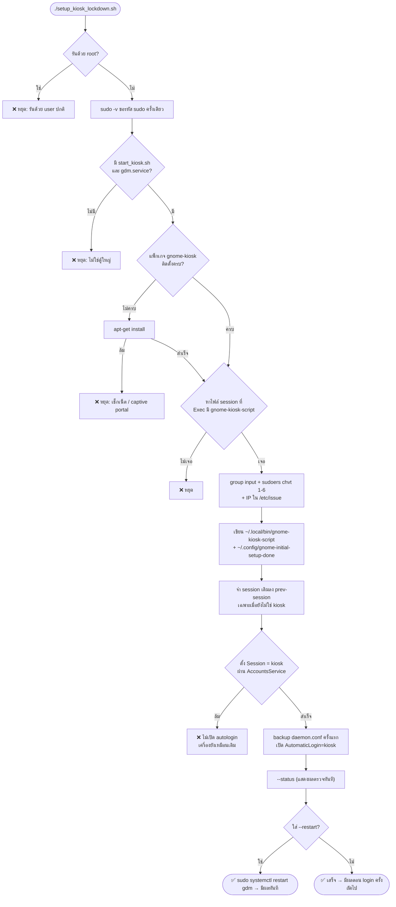
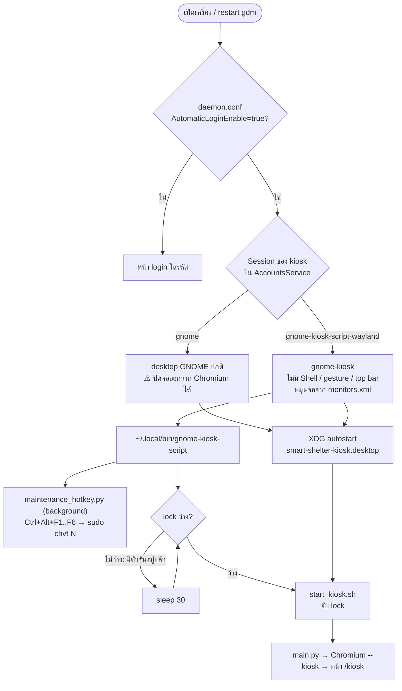
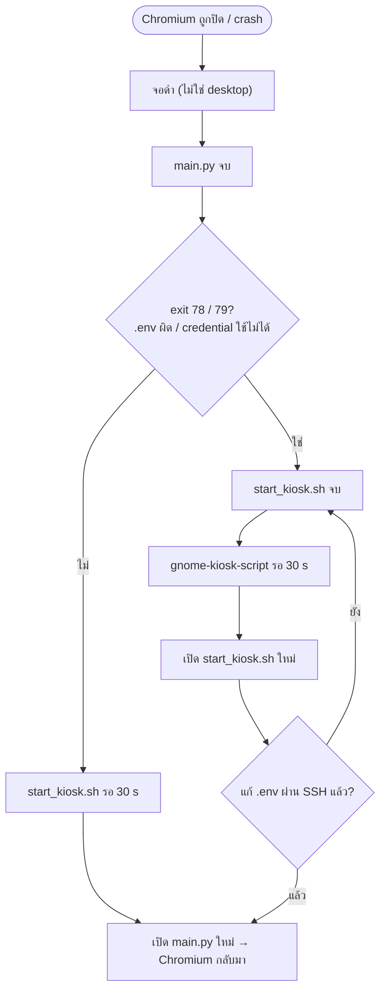
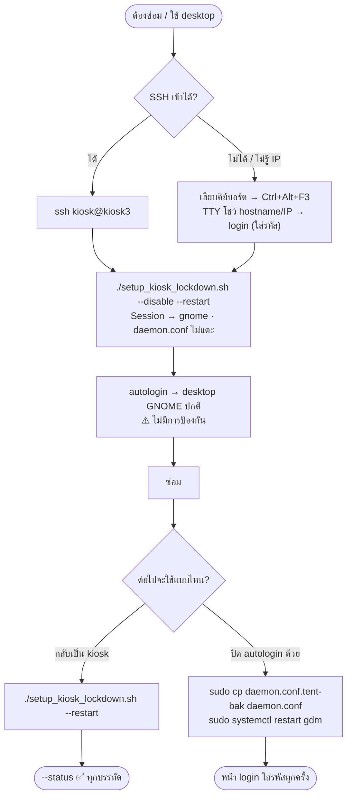

# 🔒 อธิบาย `setup_kiosk_lockdown.sh`: Autologin + ล็อกตู้ใหญ่ไม่ให้ออกจากหน้า Kiosk

เอกสารนี้อธิบาย **ทุกส่วนของ** `scanner_client/setup_kiosk_lockdown.sh` อย่างละเอียด ได้แก่ script ทำอะไร ทำไมต้องทำแบบนั้น แก้ไฟล์อะไรในเครื่อง และลำดับขั้นตอนมีผลอย่างไร สำหรับตู้ใหญ่ **kiosk3** (Debian x86_64 + GDM/GNOME + จอสัมผัสแนวตั้ง)

> วิธีใช้แบบย่อ (ติดตั้ง / ตรวจ / กลับเป็น desktop ปกติ) อยู่ใน `README.md` หัวข้อ "ล็อกไม่ให้ออกจากหน้า kiosk (ตู้ใหญ่)" · แผนงานและเกณฑ์ทดสอบอยู่ใน `docs/features/kiosk-lockdown-implementation-plan.md`
>
> ⚠️ script ยังไม่ได้ทดสอบบนตู้จริง (ขั้น S0 ในแผน) — test อัตโนมัติครอบคลุมเฉพาะส่วนที่ไม่แตะระบบ (§9)

---

## 📋 สารบัญ

1. [ปัญหาและแนวทางแก้](#1-ปัญหาและแนวทางแก้)
   - [Flow chart](#14-flow-chart)
2. [องค์ประกอบของระบบที่เกี่ยวข้อง](#2-องค์ประกอบของระบบที่เกี่ยวข้อง)
3. [โครงสร้างไฟล์ script](#3-โครงสร้างไฟล์-script)
4. [ค่าคงที่ (บรรทัด 26–60)](#4-ค่าคงที่-บรรทัด-2660)
5. [Pure helpers — ฟังก์ชันที่ไม่แตะระบบ](#5-pure-helpers--ฟังก์ชันที่ไม่แตะระบบ)
6. [System helpers — ฟังก์ชันที่แตะระบบ](#6-system-helpers--ฟังก์ชันที่แตะระบบ)
7. [คำสั่งหลัก: install / status / disable / main](#7-คำสั่งหลัก-install--status--disable--main)
   - [เข้า TTY ในโหมดล็อก (Ctrl+Alt+F3)](#76-เข้า-tty-ในโหมดล็อก-ctrlaltf3)
8. [ไฟล์ในเครื่องก่อน/หลังรัน](#8-ไฟล์ในเครื่องก่อนหลังรัน)
9. [Test อัตโนมัติ](#9-test-อัตโนมัติ)
10. [ความปลอดภัยและสิทธิ์ของ user ที่ autologin](#10-ความปลอดภัยและสิทธิ์ของ-user-ที่-autologin)
11. [ข้อจำกัดและสิ่งที่ต้องยืนยันบนตู้](#11-ข้อจำกัดและสิ่งที่ต้องยืนยันบนตู้)
12. [คำสั่งอ้างอิงด่วน](#12-คำสั่งอ้างอิงด่วน)

---

## 1. ปัญหาและแนวทางแก้

### 1.1 ปัญหา
เดิม `setup_autostart.sh` เปิด kiosk ผ่าน XDG autostart (`~/.config/autostart/smart-shelter-kiosk.desktop`) ซึ่งทำงาน **บน desktop GNOME ปกติ** Chromium ที่เปิดด้วย `--kiosk` เป็นแค่หน้าต่างหนึ่งบน desktop ผลคือ:

- ผู้ใช้ **ปัดจอ** (ปัดขอบจอ หรือปัดหลายนิ้ว) แล้วหน้า Activities ของ GNOME Shell เปิดขึ้น ออกจาก Chromium ได้
- `--kiosk` ซ่อนได้แค่ UI ของ Chromium เอง ท่าปัดเป็นของ **GNOME Shell (compositor)** ซึ่งรับ input ก่อนส่งถึงหน้าเว็บ หน้าเว็บจึงกันด้วย `preventDefault` ไม่ได้
- ตอนเปิดเครื่องต้องมีคนใส่รหัสผ่านก่อน เพราะ `/etc/gdm3/daemon.conf` ของ kiosk3 ยังไม่ได้เปิด autologin (ทุกบรรทัดเป็น comment)

### 1.2 แนวทางแก้
**ไม่ใช้ GNOME Shell เลย** โดยให้ GDM login อัตโนมัติเข้า session **GNOME Kiosk Script** ซึ่ง:

- ใช้ compositor `gnome-kiosk` (สร้างบน mutter ตัวเดียวกับ GNOME) ที่ทำให้ทุกหน้าต่างเต็มจอ และ **ไม่มี** overview, ท่าปัดจอ, top bar, dock หรือ app launcher
- เปิดแอปเดียวคือ `~/.local/bin/gnome-kiosk-script` ซึ่ง script นี้เขียนให้ และมันจะคอยเปิด `start_kiosk.sh` ไว้ตลอด
- ใช้การหมุนจอจาก `~/.config/monitors.xml` เดิมของ user (kiosk3 ตั้ง `rotation=right` ไว้แล้ว)
- ไม่มี shortcut ของ GNOME (`Ctrl+Alt+T`, `Alt+F2`, `Super`) และ gnome-kiosk ไม่สลับ VT เอง — script จึงเพิ่มตัวรับปุ่ม **`Ctrl+Alt+F1..F6` → TTY** (หน้า login แสดง hostname + IP) (§7.6)

### 1.3 เปิดเครื่องหลังล็อกแล้วเกิดอะไรขึ้น
```
เปิดเครื่อง
 └─ systemd → gdm.service
     └─ GDM อ่าน /etc/gdm3/daemon.conf   → AutomaticLoginEnable=true, AutomaticLogin=kiosk
     └─ GDM ถาม AccountsService            → Session=gnome-kiosk-script-wayland (ของ user kiosk)
         └─ login อัตโนมัติ (ไม่มีหน้าใส่รหัส)
             └─ gnome-session --session gnome-kiosk-script
                 ├─ gnome-kiosk  (compositor: เต็มจอ, ไม่มี Shell, หมุนจอจาก monitors.xml)
                 ├─ /usr/bin/gnome-kiosk-script → exec ~/.local/bin/gnome-kiosk-script
                 │    ├─ (background) loop: python3 maintenance_hotkey.py  ← Ctrl+Alt+F<n> → sudo chvt <n>
                 │    └─ loop: start_kiosk.sh → main.py → Chromium --kiosk → /kiosk
                 └─ XDG autostart (~/.config/autostart/*.desktop)
                      └─ smart-shelter-kiosk.desktop → start_kiosk.sh  (flock กันซ้อน → ตัวหนึ่งจะออกไป)
```

### 1.4 Flow chart

> ภาพด้านล่างเป็น Mermaid — เปิดบน GitHub หรือ VS Code (Markdown preview) จะเห็นเป็นแผนภาพ

#### (ก) ตอนรัน `./setup_kiosk_lockdown.sh` (ติดตั้ง)



จุดสำคัญ: **ตั้ง session ก่อนเปิด autologin เสมอ** (J → K) ถ้าขั้น J ล้ม จะไม่มีทางที่เครื่อง autologin เข้า desktop ที่ปัดออกได้

#### (ข) ตอนเปิดเครื่อง — GDM ตัดสินใจอย่างไร



`daemon.conf` ตอบว่า **login ให้ใคร** ส่วน AccountsService ตอบว่า **เข้า session ไหน** — script ตั้งทั้งสองค่า, `--disable` เปลี่ยนแค่ค่าหลัง

#### (ค) ตอนโปรแกรมหลุด — เปิดใหม่เองอย่างไร



#### (ง) ตอนซ่อมบำรุง — ปลดล็อกแล้วล็อกกลับ



---

## 2. องค์ประกอบของระบบที่เกี่ยวข้อง

| องค์ประกอบ | คืออะไร | script ใช้ทำอะไร |
| :-- | :-- | :-- |
| **GDM** (`gdm.service`) | Display manager: หน้า login กราฟิก และตัวเริ่ม session | เปิด autologin ใน `/etc/gdm3/daemon.conf` (Debian ใช้โฟลเดอร์ `gdm3/`) |
| **AccountsService** (`accounts-daemon`) | service ที่เก็บข้อมูล user สำหรับ desktop เช่น session ล่าสุด ภาษา และรูป | ตั้ง `Session=` ของ user ให้เป็น kiosk session — GDM อ่านค่านี้ตอน login |
| **`gnome-kiosk`** | compositor แบบ kiosk บน mutter | เป็นตัวแสดงผลแทน GNOME Shell |
| **`gnome-kiosk-script-session`** | แพ็กเกจที่ติดตั้งไฟล์ session `.desktop` ใน `/usr/share/wayland-sessions/` (และ `xsessions/`) กับ `/usr/bin/gnome-kiosk-script` | ให้มี session "Kiosk Script" ให้เลือก |
| **`/usr/bin/gnome-kiosk-script`** (ของแพ็กเกจ) | ตัวเริ่มของ session: ถ้ายังไม่มี `~/.local/bin/gnome-kiosk-script` จะสร้างตัวอย่างที่เปิด text editor จากนั้น `exec` ไฟล์นั้น | script เขียน `~/.local/bin/gnome-kiosk-script` ของเราไว้ก่อน ไม่ให้ตัวอย่างทำงาน |
| **XDG autostart** | gnome-session เปิดทุก `~/.config/autostart/*.desktop` ตอน login (รวมถึงใน kiosk session) | ไม่แตะ — `smart-shelter-kiosk.desktop` เดิมยังอยู่ |
| **`flock`** (util-linux) | lock ไฟล์ข้าม process | `start_kiosk.sh` ใช้ `/tmp/smart_shelter_kiosk.lock` กันรันซ้อน · kiosk script ใช้เช็กก่อนเปิด |
| **`busctl`** (systemd) | เรียก D-Bus จาก shell | สั่ง AccountsService ให้อ่าน/ตั้ง session |
| **`maintenance_hotkey.py`** | daemon เล็ก (stdlib) อ่านปุ่มจาก `/dev/input/event*` | `Ctrl+Alt+F1..F6` → `sudo -n chvt N` (§7.6) |
| **group `input`** | สิทธิ์อ่าน `/dev/input/event*` | ให้ `maintenance_hotkey.py` อ่านคีย์บอร์ดได้ |
| **`chvt`** (แพ็กเกจ `kbd`) + **`/etc/sudoers.d/tent-kiosk-chvt`** | สลับ VT (ต้องใช้ root) | sudoers ให้ kiosk user รัน `chvt 1`..`chvt 6` ได้โดยไม่ต้องใส่รหัส — คำสั่งเดียว |
| **`/etc/issue`** + `agetty` | ข้อความเหนือ prompt login ของ TTY (`\n` = hostname, `\4` = IPv4) | เพิ่มบรรทัด hostname + IP ให้ช่างเห็นก่อน login |

---

## 3. โครงสร้างไฟล์ script

| บรรทัด | ส่วน | หน้าที่ |
| :-- | :-- | :-- |
| 1–25 | Header comment | คำอธิบาย + วิธีใช้ — `--help` พิมพ์ส่วนนี้ |
| 26–60 | ค่าคงที่ + ฟังก์ชันพิมพ์ข้อความ | §4 |
| 62–159 | **Pure helpers** | คำนวณอย่างเดียว ไม่ใช้ sudo และไม่เขียนไฟล์ระบบ — test ได้ (§5) |
| 161–264 | **System helpers** | อ่าน/เขียนระบบจริง (sudo, D-Bus, sudoers, group, apt) (§6) |
| 266–391 | **Commands** | `show_status`, `install_lockdown`, `restart_gdm`, `disable_lockdown` (§7) |
| 393–426 | `main` | อ่าน option, ตรวจ user, ตั้งตัวแปร path, เลือกคำสั่ง |
| 428–430 | Source guard | เรียก `main` เฉพาะตอนรันไฟล์ตรงๆ — ตอน test `source` ไฟล์จะไม่ทำอะไร |

แนวคิดหลักคือ **แยกส่วนตัดสินใจออกจากส่วนลงมือ** ส่วนที่แก้ไฟล์ config (เช่นสร้างเนื้อหา `daemon.conf` ใหม่) เป็นฟังก์ชันที่รับไฟล์เข้าและพิมพ์ผลออก จึง test บนเครื่อง dev ได้โดยไม่ต้องมี GDM หรือ sudo ส่วนการเขียนลงระบบจริงมีแค่ไม่กี่บรรทัดใน system helpers

---

## 4. ค่าคงที่ (บรรทัด 26–60)

```bash
set -uo pipefail
```
- `-u`: ใช้ตัวแปรที่ยังไม่ได้ตั้ง = error (กันพิมพ์ชื่อตัวแปรผิดแล้วได้ path ว่าง เช่น `rm` ผิดที่)
- `-o pipefail`: pipe ล้มถ้าคำสั่งไหนในนั้นล้ม
- **ไม่ใช้ `-e`** (ตั้งใจ) — script จัดการ error เองทุกขั้นด้วย `ok`/`bad` เพื่อรายงานครบทุกข้อในรอบเดียว แบบเดียวกับ `setup_big_kiosk.sh`

| ตัวแปร | ค่า | ความหมาย |
| :-- | :-- | :-- |
| `SCRIPT_DIR` | โฟลเดอร์ของ script (path เต็ม) | ใช้หา `start_kiosk.sh` ได้ไม่ว่าจะรันจากโฟลเดอร์ไหน |
| `KIOSK_SCRIPT` | `$SCRIPT_DIR/start_kiosk.sh` | ตัวที่ kiosk session จะเปิด — **เขียนเป็น path เต็มลง kiosk script** ถ้าย้าย repo ต้องรันติดตั้งใหม่ |
| `HOTKEY_SCRIPT` | `$SCRIPT_DIR/maintenance_hotkey.py` | ตัวรับปุ่ม `Ctrl+Alt+F1..F6` — เขียนเป็น path เต็มลง kiosk script |
| `APT_PACKAGES` | `gnome-kiosk gnome-kiosk-script-session` | แพ็กเกจที่ต้องมี |
| `SESSION_DIRS` | `/usr/share/wayland-sessions /usr/share/xsessions` | ที่ค้นไฟล์ session (Wayland ก่อน) — test เปลี่ยนค่านี้เป็นโฟลเดอร์จำลอง |
| `GDM_CONF` | `/etc/gdm3/daemon.conf` | config ของ GDM บน Debian |
| `LOCK_FILE` | `/tmp/smart_shelter_kiosk.lock` | **ต้องตรงกับ** `LOCK_FILE` ใน `start_kiosk.sh` |
| `HOTKEY_LOG` | `/tmp/kiosk_maintenance_hotkey.log` | log ของ `maintenance_hotkey.py` |

| `MANAGED_MARK` | `# Managed by tent scanner_client/setup_kiosk_lockdown.sh` | บรรทัด marker ใน kiosk script — `--status` ใช้แยกว่าเป็นไฟล์ของเรา หรือเป็นตัวอย่างของแพ็กเกจ/ไฟล์ที่คนแก้เอง |
| `FALLBACK_SESSION` | `gnome` | session ที่ `--disable` ใช้ ถ้าไม่ได้จำ session เดิมไว้ |
| `INPUT_GROUP` | `input` | group ที่อ่าน `/dev/input/event*` ได้ |
| `CHVT` | `/usr/bin/chvt` | **ต้องตรงกับ** `CHVT` ใน `maintenance_hotkey.py` (sudoers อนุญาตตาม path เต็ม) |
| `SUDOERS_FILE` | `/etc/sudoers.d/tent-kiosk-chvt` | rule ให้รัน `chvt 1-6` |
| `ISSUE_FILE` | `/etc/issue` | ข้อความหน้า login ของ TTY |
| `ISSUE_LINE` | `SmartShelter kiosk: \n   IP: \4   (Ctrl+Alt+F1/F2 = back to the kiosk screen)` | บรรทัดที่เพิ่มใน `/etc/issue` — `agetty` แทน `\n`/`\4` ตอนแสดง · `/etc/issue` ไม่มี comment จึงใช้บรรทัดนี้เองเป็นตัวจำว่าเพิ่มไปแล้ว |
| `FAILED` | `false` | `bad()` ตั้งเป็น `true` — ใช้ตัดสิน exit code ตอนจบ |

ฟังก์ชันพิมพ์ข้อความ: `info` (▸ น้ำเงิน), `ok` (✅ เขียว), `warn` (⚠️ เหลือง — ไม่ถือว่าล้ม), `bad` (❌ แดง — ตั้ง `FAILED=true`)

ตัวแปรที่ขึ้นกับ user (`KIOSK_USER`, `KIOSK_HOME`, `SESSION_SCRIPT`, `PREV_SESSION_FILE`) **ตั้งใน `main`** ไม่ได้ตั้งตรงนี้ เพราะต้องอ่าน `--user` ก่อน (§7.4)

---

## 5. Pure helpers — ฟังก์ชันที่ไม่แตะระบบ

### 5.1 `kiosk_session_id` (บรรทัด 65–76) — หาชื่อ session kiosk

**ทำไมต้องหา ไม่ hardcode:** ชื่อไฟล์ session ต่างกันตามเวอร์ชันของแพ็กเกจ (เช่น `gnome-kiosk-script-wayland` หรือ `gnome-kiosk-script-xorg`) และ Debian sid อัปเดตบ่อย จึงหาจากเนื้อหาไฟล์แทนชื่อไฟล์

**ทำงาน:**
1. วนทุกโฟลเดอร์ใน `SESSION_DIRS` ตามลำดับ (Wayland ก่อน X11)
2. วนทุกไฟล์ `*.desktop` ในโฟลเดอร์นั้น (`[ -f ] || continue` กันกรณีโฟลเดอร์ว่าง ซึ่ง glob จะคืนชื่อ pattern เดิม)
3. เลือกไฟล์แรกที่มีบรรทัด `Exec=` ซึ่งมีคำว่า `gnome-kiosk-script` (เช่น `Exec=gnome-session --session gnome-kiosk-script`)
4. พิมพ์ชื่อไฟล์โดยตัด `.desktop` ออก ชื่อนี้คือ **session id** ที่ AccountsService/GDM ใช้ แล้ว `return 0`
5. ไม่เจอเลย → `return 1`

**ทำไมเลือก Wayland ก่อน:** kiosk3 ใช้ Wayland, Chromium ใช้ `--ozone-platform-hint=auto` และการหมุนจอ/touch ใน mutter แบบ Wayland ตรงกับ desktop ปกติที่ตั้งไว้

### 5.2 `gdm_autologin_user FILE` (บรรทัด 79–90) — อ่านว่าตอนนี้ autologin ใคร

ใช้ `awk` อ่าน `daemon.conf` (INI) ทีละบรรทัด:

| บรรทัด awk | ทำอะไร |
| :-- | :-- |
| `/^[[:space:]]*\[/ { in_daemon = ... }` | เจอหัว section (`[...]`) → จำว่าตอนนี้อยู่ใน `[daemon]` หรือไม่ |
| `in_daemon && /^…AutomaticLoginEnable…=/` | ใน `[daemon]` เจอ `AutomaticLoginEnable=` → ตัดส่วนก่อน `=` ออก เก็บค่า |
| `in_daemon && /^…AutomaticLogin…=/` | เหมือนกัน สำหรับ `AutomaticLogin=` |
| `END { gsub(...) ... }` | ตัดช่องว่างทั้งหมด · ถ้า enable เป็น `true` (ไม่สนตัวพิมพ์เล็ก/ใหญ่) → พิมพ์ชื่อ user |

รายละเอียดที่ต้องรู้:
- **regex ขึ้นต้นด้วย `^[[:space:]]*` แล้วตามด้วยชื่อ key ทันที** บรรทัด comment อย่าง `#  AutomaticLogin = user1` (ขึ้นต้นด้วย `#`) จึงไม่ match ไฟล์ค่าเริ่มต้นของ Debian จึงอ่านได้ว่า "ปิด" ถูกต้อง
- regex ของ `AutomaticLogin` ต้องตามด้วยช่องว่างหรือ `=` จึงไม่ไปจับ `AutomaticLoginEnable`
- รองรับ `AutomaticLogin = kiosk` (มีช่องว่างรอบ `=`) และ `True`/`TRUE`
- อ่านเฉพาะใน `[daemon]` ถ้ามี key ชื่อเดียวกันใน section อื่นจะไม่นับ
- ถ้าไม่มีไฟล์ → ไม่พิมพ์อะไร (= ปิด)

### 5.3 `gdm_with_autologin FILE USER` (บรรทัด 94–106) — สร้าง `daemon.conf` ใหม่ที่เปิด autologin

ฟังก์ชันนี้ **ไม่เขียนไฟล์** แค่พิมพ์เนื้อหาใหม่ออก stdout แล้วให้ `set_autologin` (§6.6) เป็นคนเขียน

| บรรทัด awk | ทำอะไร |
| :-- | :-- |
| ติดตาม `in_daemon` | เหมือน §5.2 |
| `in_daemon && /^…AutomaticLogin(Enable)?…=/ { next }` | **ลบ** key autologin ที่ใช้งานอยู่ใน `[daemon]` (ค่าเก่าอะไรก็ตาม) |
| `{ print }` | พิมพ์บรรทัดอื่นทั้งหมดตามเดิม (comment, section อื่น, บรรทัดว่าง) |
| `/^…\[daemon\]/ && !found { print …; found = 1 }` | ใต้หัว `[daemon]` (ครั้งแรกที่เจอ) ใส่ `AutomaticLoginEnable=true` + `AutomaticLogin=<user>` |
| `END { if (!found) … }` | ไม่มี `[daemon]` เลย → เพิ่ม section ต่อท้ายไฟล์ |

คุณสมบัติที่ test ยืนยันแล้ว:
- **Idempotent:** รันซ้ำกี่ครั้งก็ได้ผลเท่าเดิม (ลบของเก่าแล้วใส่ใหม่ จึงไม่ซ้อน)
- **เก็บ comment ไว้:** ช่างยังอ่านคำอธิบายเดิมของ Debian ได้
- ไม่มีไฟล์ (`source=/dev/null`) → ได้ไฟล์ใหม่ที่มีแค่ `[daemon]` + 2 บรรทัด

ตัวอย่างกับไฟล์จริงของ kiosk3 (§8.2)

### 5.4 `sudoers_chvt_rule USER` (บรรทัด 110–112) และ `issue_with_ip_line FILE` (บรรทัด 117–133)

**`sudoers_chvt_rule kiosk`** → `kiosk ALL=(root) NOPASSWD: /usr/bin/chvt [1-6]`
- `NOPASSWD` — ตัวรับปุ่มไม่มี terminal ให้ใส่รหัส
- `/usr/bin/chvt` (path เต็ม) — sudo จับคู่ตาม path ห้ามใช้ชื่อเฉยๆ
- `[1-6]` — อนุญาต**อาร์กิวเมนต์เดียว**ที่เป็นเลข 1–6 เท่านั้น (`chvt 7`, `chvt -f 3` ถูกปฏิเสธ)

**`issue_with_ip_line FILE`** พิมพ์ `/etc/issue` ใหม่ (ไม่เขียนไฟล์ — `set_issue_ip` §6.11 เป็นคนเขียน):
1. ลบ `ISSUE_LINE` เดิมทุกบรรทัด (รันซ้ำจึงไม่เพิ่มซ้อน)
2. ตัดบรรทัดว่างท้ายไฟล์ แล้วเว้น 1 บรรทัดหลัง banner ของ Debian
3. ต่อท้ายด้วย `ISSUE_LINE` + บรรทัดว่าง (ให้ห่างจาก prompt `login:`)

ส่ง `ISSUE_LINE` เข้า awk ผ่าน **environment** (`ENVIRON["ISSUE_LINE"]`) ไม่ใช่ `awk -v` — เพราะ `-v` แปลง `\n` เป็นขึ้นบรรทัดใหม่ และ `\4` เป็นอักขระควบคุม ทำให้ `agetty` ไม่ได้รับ escape ของมัน

ผลบน kiosk3 (หน้า `Ctrl+Alt+F3`):
```
Debian GNU/Linux forky/sid kiosk3 tty3

SmartShelter kiosk: kiosk3   IP: 10.x.x.x   (Ctrl+Alt+F1/F2 = back to the kiosk screen)

kiosk3 login: _
```

### 5.5 `session_script_content START_KIOSK HOTKEY` (บรรทัด 137–159) — เนื้อหาของ kiosk script

พิมพ์ไฟล์ `/bin/sh` ที่จะกลายเป็น `~/.local/bin/gnome-kiosk-script` heredoc ใช้ `<<EOF` (ไม่มี quote) ดังนั้น `$MANAGED_MARK`, `$LOCK_FILE`, `$HOTKEY_LOG`, `$1` และ `$2` **ถูกแทนค่าตอนสร้างไฟล์** ไฟล์ที่ได้จึงมี path เต็มฝังอยู่ ไม่ต้องพึ่งตัวแปรตอนรัน

ไฟล์ที่ได้ (สมมติ repo อยู่ที่ `/home/kiosk/tent`):
```sh
#!/bin/sh
# Managed by tent scanner_client/setup_kiosk_lockdown.sh - rerun it instead of editing.
# Ctrl+Alt+F1..F6 -> text TTY: ...
(
    while true; do
        python3 "/home/kiosk/tent/scanner_client/maintenance_hotkey.py" >>"/tmp/kiosk_maintenance_hotkey.log" 2>&1
        sleep 5
    done
) &
# GNOME Kiosk keeps this as the only app on screen. ...
while true; do
    if flock -n "/tmp/smart_shelter_kiosk.lock" true 2>/dev/null; then
        "/home/kiosk/tent/scanner_client/start_kiosk.sh"
    fi
    sleep 30
done
```

อธิบายทีละบรรทัด:

| บรรทัด | เหตุผล |
| :-- | :-- |
| `#!/bin/sh` | ใช้ได้ทุก shell — ไม่ต้องพึ่ง bash |
| marker | `--status` ใช้ยืนยันว่าไฟล์เป็นของเรา |
| `( while … maintenance_hotkey.py … ) &` | เปิดตัวรับปุ่ม `Ctrl+Alt+F1..F6` ไว้เบื้องหลัง **ก่อน** loop หลัก (loop หลักไม่มีวันจบ) · ตายแล้วเปิดใหม่ใน 5 วินาที · แยกจาก `main.py`/Chromium จึงใช้ได้แม้จอดำ |
| `while true` | **ห้ามจบ** — ถ้าแอปหลักของ session จบ gnome-session อาจปิด session (กลับหน้า login) หรือเปิดใหม่วนไม่หยุด การวนเองแบบคุมจังหวะได้จึงปลอดภัยกว่า |
| `flock -n LOCK true` | ลองจับ lock แบบไม่รอ แล้วปล่อยทันที — ถ้าจับได้ แปลว่ายังไม่มี `start_kiosk.sh` ตัวไหนรันอยู่ |
| `"…/start_kiosk.sh"` | รัน (ไม่ใช้ `exec`) — เมื่อจบจะกลับมาวนต่อ |
| `sleep 30` | หน่วงก่อนรอบถัดไป กัน CPU วิ่งเต็มและกัน log รก |

**ทำไมต้องเช็ก lock ก่อน:** XDG autostart เดิม (`smart-shelter-kiosk.desktop`) ก็เปิด `start_kiosk.sh` ใน session เดียวกัน ถ้าตัวนั้นได้ lock ไปก่อน ตัวของเราจะเห็นว่า lock ไม่ว่าง แล้วรอเงียบๆ ไม่ไปรัน `start_kiosk.sh` ซึ่งจะเขียน log "already running" ทุก 30 วินาที ช่วงที่ปล่อย lock แล้วเกิดแย่งกันได้แคบมาก ถ้าเกิดก็มีแค่บรรทัด log เดียว ไม่มีผลอื่น

**ทำไมไม่จบเมื่อ `start_kiosk.sh` exit 78/79:** `start_kiosk.sh` หยุดถาวรเมื่อ `.env` ผิด (78) หรือ credential ใช้ไม่ได้ (79) ใน kiosk session จะเห็นจอดำ ช่างแก้ `.env` ผ่าน SSH แล้วภายใน ≤ 30 วินาทีรอบถัดไปจะเปิดใหม่เอง **โดยไม่ต้อง reboot**

**ลำดับชั้นการ restart (เปิดใหม่) ทั้งหมด:**
```
gnome-kiosk-script
  ├─ maintenance_hotkey.py (loop 5 s)   ← ถ้าตัวรับปุ่มจบ (แยกอิสระ)
  └─ (loop 30 s)                         ← ถ้า start_kiosk.sh จบ
  └─ start_kiosk.sh (loop RESTART_DELAY_SEC=30 s)  ← ถ้า main.py จบ/crash
       └─ main.py → Chromium            ← ปิดหน้าต่าง/page crash → main.py จบ
```

---

## 6. System helpers — ฟังก์ชันที่แตะระบบ

### 6.1 `user_home USER` (บรรทัด 163)
อ่าน home จาก `getent passwd` (ช่องที่ 6) — ใช้แทน `~` เพราะตอน `--user kiosk` เรารันจาก user อื่น `~` จึงไม่ใช่ home ของ kiosk

### 6.2 `as_kiosk CMD…` (บรรทัด 166–172)
รันคำสั่ง**อ่าน**ไฟล์ใน home ของ kiosk user:
- user เดียวกัน → รันตรงๆ
- คนละ user → `sudo -n` (ไม่ถามรหัส) — จำเป็นเพราะ Debian รุ่นใหม่ตั้ง home เป็น `0700` (user อื่นอ่านไม่ได้) และ `-n` ทำให้ `--status` ไม่ค้างรอรหัส ถ้า sudo ไม่ได้ cache ไว้จะได้ผลแค่ "อ่านไม่ได้"

### 6.3 `account_path USER` (บรรทัด 209)
สร้าง D-Bus object path ของ user ใน AccountsService: `/org/freedesktop/Accounts/User<uid>` เช่น `User1000`

### 6.4 `current_session` (บรรทัด 211–218) — session ที่ GDM จะใช้ตอน login ครั้งถัดไป
1. ถาม AccountsService ผ่าน D-Bus: `busctl get-property … Session` → ได้ `s "gnome"` แล้วใช้ `sed` ดึงค่าในเครื่องหมายคำพูด — **ไม่ต้องใช้ sudo**
2. ถ้าไม่ได้ (เช่น ไม่มี busctl) → อ่าน `Session=` จาก `/var/lib/AccountsService/users/<user>` ด้วย `sudo -n` (ไฟล์นี้ root อ่านได้เท่านั้น)
3. พิมพ์ค่า (อาจว่างถ้า user ไม่เคย login แบบกราฟิก)

### 6.5 `set_session SESSION` (บรรทัด 220–232) — เปลี่ยน session ตอน login
**ทางหลัก:** `sudo busctl call … SetSession s <session>` — ให้ AccountsService เป็นคนแก้ไฟล์และอัปเดต cache เอง (root ผ่าน polkit ได้)

**ทางสำรอง** (AccountsService รุ่นเก่าที่ไม่มี `SetSession`):
1. สร้างโฟลเดอร์/ไฟล์ `[User]` ถ้ายังไม่มี
2. ลบ `Session=` และ `XSession=` เดิม (`XSession` เป็น key รุ่นเก่าที่ GDM อาจอ่านก่อน)
3. แทรก `Session=<ค่าใหม่>` ใต้ `[User]`
4. `systemctl restart accounts-daemon` — **จำเป็น** เพราะ daemon cache ค่าไว้ในหน่วยความจำ ถ้าไม่ restart มันอาจเขียนค่าเก่าทับไฟล์ที่เราแก้

> 💡 ที่ต้องใช้ AccountsService เพราะ **GDM ไม่ได้อ่าน session จาก `daemon.conf`** GDM ใช้ session ล่าสุดที่ AccountsService จำไว้ให้ user แต่ละคน เทียบได้กับการกดเฟือง ⚙ ที่หน้า login แล้วเลือก session เอง

### 6.6 `set_autologin` (บรรทัด 234–242) — เขียน `daemon.conf`
1. **Backup ครั้งเดียว:** ถ้ายังไม่มี `daemon.conf.tent-bak` → `cp -p` (เก็บสิทธิ์/เวลาเดิมไว้) — รันซ้ำจะไม่ทับ backup จึงได้ไฟล์ต้นฉบับของ Debian เสมอ
2. สร้างเนื้อหาใหม่ด้วย `gdm_with_autologin` ลงไฟล์ชั่วคราว (`mktemp`, ยังไม่แตะไฟล์จริง)
3. `sudo install -m 644 tmp daemon.conf` — แทนที่ไฟล์จริงในขั้นเดียว สิทธิ์ `644` ตามค่าเดิมของ Debian
4. ลบไฟล์ชั่วคราว แล้วคืน exit status ของขั้น 2–3

**ทำไมไม่ใช้ `sed -i` ตรงๆ:** ถ้า awk ล้มกลางทาง ไฟล์จริงจะไม่ถูกแตะเลย GDM ที่อ่าน `daemon.conf` เสียจะไม่ขึ้นหน้าจอ ซึ่งแก้ได้ผ่าน SSH เท่านั้น

### 6.7 `install_as_kiosk MODE DEST` (บรรทัด 245–257) — เขียนไฟล์เป็นของ kiosk user
อ่านเนื้อหาจาก stdin → ไฟล์ชั่วคราว → `install -D` (สร้างโฟลเดอร์ระหว่างทาง เช่น `~/.local/bin`) ด้วยสิทธิ์ `MODE`:
- user เดียวกัน → ไม่ใช้ sudo เจ้าของไฟล์เป็นเราอยู่แล้ว
- คนละ user → `sudo install -o <kiosk> -g <group ของ kiosk>` เพื่อให้เจ้าของเป็น kiosk user (ถ้าเป็นของ root, gnome-kiosk จะยังรันได้ แต่ user แก้/ลบเองไม่ได้ และอาจสับสนตอนซ่อม)

### 6.8 `packages_missing` (บรรทัด 259–264)
พิมพ์ชื่อแพ็กเกจที่ `dpkg -s` บอกว่ายังไม่ติดตั้ง ทีละบรรทัด (ไม่มีอะไรพิมพ์ = ครบ)

### 6.9 `in_input_group` (บรรทัด 174)
kiosk user อยู่ใน group `input` หรือไม่ (`id -nG`) — ดู group ที่ตั้งในระบบ ไม่ใช่ของ session ที่รันอยู่ (group ใหม่มีผลตอน login ครั้งถัดไป)

### 6.10 `set_sudoers_chvt` (บรรทัด 188–197) และ `sudoers_chvt_installed` (บรรทัด 178–184)
- `set_sudoers_chvt`: เขียน rule (§5.4) ลงไฟล์ชั่วคราว → **`visudo -cqf` ต้องผ่านก่อน** → `install -m 440 -o root -g root` ลง `/etc/sudoers.d/tent-kiosk-chvt` · ไฟล์ใน `sudoers.d` ที่ผิด syntax ทำให้ `sudo` ใช้ไม่ได้ทั้งเครื่อง จึงตรวจก่อนวางเสมอ
- `sudoers_chvt_installed`: user เดียวกัน → `sudo -n -l /usr/bin/chvt 3` (ถาม sudo ตรงๆ ไม่ต้องใส่รหัสเพราะ rule เป็น NOPASSWD) · คนละ user → เทียบเนื้อหาไฟล์ (ต้องมี sudo ที่ cache ไว้)

### 6.11 `set_issue_ip` (บรรทัด 199–207)
แบบเดียวกับ `set_autologin` (§6.6): backup ครั้งแรกเป็น `/etc/issue.tent-bak` → สร้างเนื้อหาใหม่ด้วย `issue_with_ip_line` ลงไฟล์ชั่วคราว → `sudo install -m 644`

---

## 7. คำสั่งหลัก: install / status / disable / main

### 7.1 `install_lockdown` (บรรทัด 302–373) — ค่าเริ่มต้นเมื่อไม่ใส่ option

| ขั้น | บรรทัด | ทำอะไร | ถ้าล้ม |
| :-- | :-- | :-- | :-- |
| 1 | 304 | `sudo -v` — ขอรหัส sudo ครั้งเดียวตั้งแต่ต้น | หยุด |
| 2 | 305–307 | ต้องมี `start_kiosk.sh` (`chmod +x` ให้), `maintenance_hotkey.py` และ `/usr/bin/chvt` | หยุด |
| 3 | 308–309 | ต้องมี `gdm.service` — กันรันผิดเครื่อง (เช่นตู้ Pi ที่ใช้ labwc) | หยุด |
| 4 | 310–313 | ถ้าใช้ `--user` → user นั้นต้องรัน `start_kiosk.sh` ได้ (`sudo -u <user> test -x`) | หยุด |
| 5 | 315–322 | ติดตั้งแพ็กเกจที่ขาด (`apt-get update` + `install -y`) | หยุด (มักเป็นเพราะยังไม่ได้ login captive portal ของ PSU) |
| 6 | 324–325 | หา session id (§5.1) | หยุด |
| 7 | 327–332 | เพิ่ม user เข้า group `input` (มีผลตอน login ครั้งถัดไป) | `bad` แล้วทำต่อ |
| 8 | 333–334 | ติดตั้ง sudoers `chvt 1-6` (§6.10) | `bad` แล้วทำต่อ |
| 9 | 335–336 | เพิ่ม hostname + IP ใน `/etc/issue` (§6.11) | `warn` |
| 10 | 338–339 | เขียน `~/.local/bin/gnome-kiosk-script` สิทธิ์ `755` (§5.5, §6.7) | `bad` แล้วทำต่อ |
| 11 | 341–342 | สร้างไฟล์ว่าง `~/.config/gnome-initial-setup-done` — กันหน้า "Welcome to GNOME" โผล่ใน kiosk session | `warn` |
| 12 | 345–349 | จำ session ปัจจุบันลง `~/.config/tent-kiosk-lockdown.prev-session` **เฉพาะเมื่อยังไม่ใช่ kiosk** — รันซ้ำจึงไม่เขียนค่า kiosk ทับค่าเดิม | `warn` (`--disable` จะใช้ `gnome`) |
| 13 | 350–351 | ตั้ง session → kiosk (§6.5) | `bad` และ**ไม่ทำขั้น 14** |
| 14 | 352–353 | เปิด autologin (§6.6) | `bad` |
| 15 | 358–365 | สรุป: มี `bad` → exit 1 · ไม่มี → บอกวิธีเข้า TTY / `--disable` | — |
| 16 | 367–372 | รัน `show_status` (§7.2) ให้เห็นผลทันที | ข้อใดไม่ผ่าน → exit 1 (ไม่ restart) |
| 17 | `main` → `restart_gdm` | ถ้าใส่ `--restart` → `sudo systemctl restart gdm` ให้มีผลทันที · ไม่ใส่ → บอกคำสั่ง | `bad` |

**ลำดับขั้น 13 → 14 สำคัญที่สุด:** เปลี่ยน session เป็น kiosk **ก่อน** เปิด autologin เสมอ ถ้าทำกลับกันแล้วขั้นเปลี่ยน session ล้ม เครื่องจะ autologin เข้า desktop GNOME ปกติโดยไม่ต้องใส่รหัส และยังปัดออกได้ ซึ่งแย่กว่าตอนก่อนรัน script

**restart GDM เฉพาะเมื่อใส่ `--restart` และทำเป็นขั้นสุดท้าย:** `systemctl restart gdm` ปิด session ที่เปิดอยู่บนจอตู้ทันที (terminal บนจอตู้จะปิดไปด้วย) จึงไม่ทำเป็นค่าเริ่มต้น และทำหลังทุกขั้น + `--status` ผ่านแล้วเท่านั้น — ถ้ามีขั้นไหนล้มจะไม่ restart · ผ่าน SSH ใช้ `--restart` ได้เลย SSH ไม่หลุด

### 7.2 `show_status` (บรรทัด 268–300) — `--status`
ตรวจอย่างเดียว ไม่ขอ sudo (ใช้ `sudo -n` เฉพาะตอนอ่าน) และ exit 1 ถ้ามีข้อไหนไม่ผ่าน

| บรรทัดที่แสดง | ตรวจอะไร | ✅ หมายถึง |
| :-- | :-- | :-- |
| `ติดตั้ง gnome-kiosk …` | `dpkg -s` ทั้ง 2 แพ็กเกจ | แพ็กเกจครบ |
| `พบ session: …` | §5.1 | มีไฟล์ session ให้ GDM เลือก |
| `kiosk script: …` | มี marker + รันได้ (`-x`) | `~/.local/bin/gnome-kiosk-script` เป็นของเรา · ถ้ามีไฟล์แต่ไม่มี marker → ⚠️ (ตัวอย่างของแพ็กเกจที่เปิด text editor หรือไฟล์ที่คนแก้เอง) |
| `อยู่ใน group input` | §6.9 | ตัวรับปุ่มอ่านคีย์บอร์ดได้ (หลัง login ครั้งถัดไป) |
| `sudoers: … รัน chvt 1-6 ได้` | §6.10 | ตัวรับปุ่มสลับ VT ได้ |
| `หน้า login ของ TTY แสดง hostname + IP` | `/etc/issue` มี `ISSUE_LINE` | ⚠️ ถ้าไม่มี (ไม่นับเป็นล้ม) |
| `GDM autologin: …` | §5.2 = kiosk user | เปิดเครื่องแล้ว login เอง |
| `session ตอน login: … (ล็อก kiosk)` | §6.4 = session id | login แล้วเข้า kiosk session |

> `--status` บอกค่าที่จะมีผล **ตอน login ครั้งถัดไป** ไม่ใช่ session ที่รันอยู่บนจอตอนนี้ ถ้ายังไม่ได้ restart gdm จะเห็น ✅ ครบทั้งที่จอยังเป็น desktop เดิม

### 7.3 `disable_lockdown` (บรรทัด 385–391) และ `restart_gdm` (บรรทัด 376–383) — `--disable`
1. `sudo -v`
2. อ่าน session เดิมจาก `prev-session` (ไม่มีไฟล์ → `gnome`)
3. `set_session <session เดิม>`
4. แจ้งเตือนว่า **autologin ยังเปิดอยู่** ระหว่างนี้ใครเปิดเครื่องก็เข้า desktop ได้โดยไม่ต้องใส่รหัส
5. `restart_gdm`: ใส่ `--restart` → restart gdm ทันที · ไม่ใส่ → บอกคำสั่ง

**ทำไมไม่ปิด autologin ด้วย:** `--disable` มีไว้สำหรับซ่อมบำรุง ช่างต้องการให้จอตู้เข้า desktop ได้ทันทีหลัง restart gdm โดยไม่ต้องมีคีย์บอร์ดไว้พิมพ์รหัส ส่วน kiosk ยังเปิดผ่าน XDG autostart เหมือนก่อนล็อก ถ้าต้องการปิด autologin ด้วย ให้คืน backup เอง (`README.md` อธิบายไว้)

### 7.4 `main` (บรรทัด 393–426)
1. ค่าเริ่มต้น: คำสั่ง = `install`, `KIOSK_USER` = user ที่รัน script
2. อ่าน option: `--status`/`-s`, `--disable`/`-d`, `--restart`/`-r`, `--user NAME`, `--help`/`-h` (`--restart` กับ `--status` → เตือนแล้วไม่ restart) (พิมพ์ header comment ด้วย awk: ตั้งแต่บรรทัด 2 จนเจอบรรทัดแรกที่ไม่ใช่ comment)
3. **ห้ามรันด้วย root** (`sudo ./setup_kiosk_lockdown.sh`) — ถ้ารันด้วย root, `KIOSK_USER` จะกลายเป็น `root` และจะตั้ง autologin เป็น root ไม่ได้ตั้งให้ kiosk user ให้รันด้วย user ปกติ (script เรียก sudo เอง) หรือใช้ `--user`
4. ตรวจว่ามี user นั้นจริง (`id`)
5. ตั้ง `KIOSK_HOME`, `SESSION_SCRIPT`, `PREV_SESSION_FILE` จาก home ของ kiosk user
6. เรียกคำสั่ง

### 7.5 Source guard (บรรทัด 428–430)
```bash
if [[ "${BASH_SOURCE[0]}" == "$0" ]]; then main "$@"; fi
```
รันไฟล์ตรงๆ → `BASH_SOURCE[0]` เท่ากับ `$0` จึงเรียก `main` · ถ้า `source` จากที่อื่น (test) จะได้แค่ฟังก์ชันมาใช้ ไม่มีอะไรรัน

### 7.6 เข้า TTY ในโหมดล็อก (`Ctrl+Alt+F3`)

#### ทำไม shortcut ของ desktop ใช้ไม่ได้ใน kiosk session
shortcut ไม่ใช่ความสามารถของ Linux หรือของ Chromium แต่ละปุ่มมี **โปรแกรมของ desktop คอยฟังอยู่** — ใน kiosk session โปรแกรมเหล่านั้นไม่ได้รัน (เหตุผลเดียวกับที่ปัดจอออกไม่ได้):

| ปุ่ม | ใน GNOME ปกติ ใครเป็นคนฟัง | ใน kiosk session |
| :-- | :-- | :-- |
| `Ctrl+Alt+T` | gnome-settings-daemon (media-keys) | ไม่ได้รัน → ไม่มีผล |
| `Alt+F2`, `Super`, ปัดจอ | GNOME Shell | ไม่มี Shell → ไม่มีผล |
| `Ctrl+Alt+F1…F6` (สลับ VT) | **mutter** (แกนของ GNOME Shell) — บน Wayland compositor เป็นเจ้าของคีย์บอร์ด (kernel ปิดการประมวลผลคีย์บอร์ดของ VT กราฟิก) จึงต้องเป็นคนสั่งสลับ VT เอง | gnome-kiosk **ไม่สลับ** (ยืนยันแล้ว) → `maintenance_hotkey.py` สั่ง `chvt` แทน |

**ยืนยันบน kiosk3 (2026-10-03):** `sudo chvt 3` สลับได้ (VT/getty ปกติ) แต่กด `Ctrl+Alt+F3` ไม่ได้ — แม้ค่า gsettings ของ mutter (`switch-to-session-3 = ['<Primary><Alt>F3']`) ถูกต้อง แปลว่า gnome-kiosk ไม่ทำตามปุ่มนี้ และตั้งค่าแก้ไม่ได้

#### script ทำอะไร
```
คีย์บอร์ด USB ──► kernel /dev/input/eventN ──┬──► gnome-kiosk ──► Chromium / QR flow (เหมือนเดิม)
                                            └──► maintenance_hotkey.py (อ่านอย่างเดียว ไม่ grab)
                                                   Ctrl+Alt+F<n> (n = 1..6)
                                                   └─► sudo -n /usr/bin/chvt <n>
                                                         └─► TTY <n>: banner + "SmartShelter kiosk: <host> IP: <ip>" + login:
```
1. เพิ่ม kiosk user เข้า group `input` — อ่านปุ่มจาก kernel ได้ (§6.9)
2. ติดตั้ง `/etc/sudoers.d/tent-kiosk-chvt` — รันได้แค่ `chvt 1`..`chvt 6` โดยไม่ต้องใส่รหัส (§5.4, §6.10)
3. kiosk script เปิด `maintenance_hotkey.py` ไว้เบื้องหลัง (§5.5)
4. เพิ่มบรรทัด hostname + IP ใน `/etc/issue` — เห็น IP **โดยไม่ต้อง login** (§5.4, §6.11)

`maintenance_hotkey.py`: stdlib อย่างเดียว (รันด้วย `python3` ของระบบ) · ตรวจหาคีย์บอร์ดใหม่ทุก 2 วินาที (เสียบทีหลังได้) · ถอดคีย์บอร์ดไม่ crash · นับปุ่มค้างแยกต่อคีย์บอร์ด · ปุ่มค้าง (autorepeat) ไม่สลับซ้ำ · `chvt` ล้ม → log แล้วรอต่อ

#### วิธีใช้ที่ตู้
1. เสียบคีย์บอร์ด USB → `Ctrl+Alt+F3` (คีย์บอร์ดเล็ก/laptop อาจต้อง `Fn+Ctrl+Alt+F3`)
2. หน้าจอตัวอักษรแสดง `SmartShelter kiosk: <hostname>   IP: <ip>` → เอา IP ไป SSH ต่อ หรือ login ที่ตู้ (ชื่อ + รหัสผ่าน)
3. กลับหน้า kiosk: `Ctrl+Alt+F1` หรือ `Ctrl+Alt+F2` (VT ของ session กราฟิก — ดู `loginctl show-session <id> -p VTNr`) · บน TTY ตัวอักษร kernel รับปุ่มนี้เอง และตัวรับปุ่มก็สั่งสลับซ้ำ (ไม่มีผลเสีย)

ถ้า IP บนหน้า login ยังเป็นค่าเก่า กด Enter ให้ prompt ขึ้นใหม่ · กดแล้วไม่มีอะไรเกิดขึ้น → ดู `/tmp/kiosk_maintenance_hotkey.log` ผ่าน SSH: `not in the 'input' group` = ยังไม่ได้ restart gdm หลังติดตั้ง · `chvt 3 failed` = ไม่มี sudoers rule

#### ความปลอดภัย
- สลับ VT ไม่ได้ให้ shell — TTY ยังต้อง login ด้วยชื่อ + รหัสผ่าน (ระดับเดียวกับ `Ctrl+Alt+F3` ใน Debian ปกติ)
- sudoers จำกัดแค่ `/usr/bin/chvt [1-6]` — ใช้สิทธิ์ root ทำอย่างอื่นไม่ได้
- **ไม่ grab คีย์บอร์ด** (ไม่เรียก `EVIOCGRAB`) — ทุกปุ่มยังไปถึง gnome-kiosk/Chromium ตามปกติ
- **ไม่ log ปุ่มที่กด** — ข้อมูลที่ QR reader สแกนก็มาเป็นปุ่ม · log มีแค่ "ready", "Switching to VT n", error
- group `input` ทำให้ kiosk user อ่านทุกปุ่มจากทุกคีย์บอร์ดได้ (ระดับเดียวกับ keylogger) — ยอมรับได้เพราะเครื่องนี้มี user ใช้งานคนเดียว และ Chromium ของ user เดียวกันได้รับปุ่มเหล่านี้อยู่แล้ว

---

## 8. ไฟล์ในเครื่องก่อน/หลังรัน

### 8.1 สรุปไฟล์ที่ถูกแตะ

| ไฟล์ | เจ้าของ | การกระทำ | ย้อนกลับ |
| :-- | :-- | :-- | :-- |
| แพ็กเกจ `gnome-kiosk`, `gnome-kiosk-script-session` | ระบบ | ติดตั้ง | `sudo apt remove …` (ถ้า session ที่จำไว้หาย GDM จะใช้ `gnome`) |
| group `input` ของ kiosk user | ระบบ | `usermod -aG input` | `sudo gpasswd -d <user> input` |
| `/etc/sudoers.d/tent-kiosk-chvt` | root (440) | สร้าง (`visudo` ตรวจแล้ว) | `sudo rm /etc/sudoers.d/tent-kiosk-chvt` |
| `/etc/issue` | root | เพิ่มบรรทัด hostname + IP | `/etc/issue.tent-bak` |
| `~/.local/bin/gnome-kiosk-script` | kiosk user | สร้าง/เขียนทับ | ลบได้ (session kiosk จะกลับไปเปิดตัวอย่างของแพ็กเกจ) |
| `~/.config/gnome-initial-setup-done` | kiosk user | สร้างไฟล์ว่าง | ไม่ต้องย้อน |
| `~/.config/tent-kiosk-lockdown.prev-session` | kiosk user | เขียน session เดิม | ลบได้ |
| `/var/lib/AccountsService/users/<user>` | root | `Session=` ผ่าน D-Bus | `--disable` |
| `/etc/gdm3/daemon.conf` | root | เปิด autologin | `daemon.conf.tent-bak` |
| `/etc/gdm3/daemon.conf.tent-bak` | root | backup ครั้งแรก | — |
| `/tmp/kiosk_maintenance_hotkey.log` | kiosk user | log ตอนรัน (หายตอน reboot) | — |

**ไม่แตะ:** `~/.config/monitors.xml` (การหมุนจอ), `scanner_client/.env`, `~/.config/autostart/*` (XDG autostart เดิม), Chromium flags/policy, ตู้ Raspberry Pi

### 8.2 `/etc/gdm3/daemon.conf` ของ kiosk3

**ก่อน** (ค่าเริ่มต้น Debian — autologin ปิด):
```ini
[daemon]

# Enabling automatic login
#  AutomaticLoginEnable = true
#  AutomaticLogin = user1
...
[security]
```
**หลัง:**
```ini
[daemon]
AutomaticLoginEnable=true
AutomaticLogin=kiosk

# Enabling automatic login
#  AutomaticLoginEnable = true
#  AutomaticLogin = user1
...
[security]
```
comment เดิมอยู่ครบ มีแค่ 2 บรรทัดใหม่ใต้ `[daemon]`

### 8.3 `/var/lib/AccountsService/users/kiosk`
```ini
# ก่อน (ตัวอย่าง)            # หลัง
[User]                       [User]
Session=gnome                Session=gnome-kiosk-script-wayland
...                          ...
```

---

## 9. Test อัตโนมัติ

ไฟล์ `scanner_client/tests/test_setup_kiosk_lockdown.py` ทดสอบเฉพาะ **pure helpers** (§5) โดย `source` script ใน bash (source guard กัน `main` ทำงาน) ไม่ใช้ sudo, GDM หรือ D-Bus จึงรันบนเครื่อง dev ได้

| Test | ยืนยันอะไร |
| :-- | :-- |
| `test_debian_default_has_autologin_off` | ไฟล์ค่าเริ่มต้นจริงของ kiosk3 (มีแต่ comment) อ่านได้ว่า "ปิด" |
| `test_enables_autologin_under_daemon_and_keeps_comments` | 2 บรรทัดใหม่อยู่ใต้ `[daemon]` ทันที, comment/section อื่นอยู่ครบ, อ่านกลับได้ `kiosk` |
| `test_replaces_existing_keys_only_inside_daemon` | ค่าเก่าใน `[daemon]` ถูกแทน · key ชื่อเดียวกันใน section อื่นไม่ถูกแตะ |
| `test_is_idempotent` | รันซ้ำได้ผลเท่าเดิม |
| `test_adds_daemon_section_when_missing` | ไม่มี `[daemon]` → เพิ่มต่อท้าย |
| `test_creates_config_when_file_is_missing` | ไม่มีไฟล์ → สร้างไฟล์ขั้นต่ำ |
| `test_reads_spaced_values_and_ignores_disabled_autologin` | `AutomaticLogin = kiosk`, `True` อ่านได้ · `false` = ปิด |
| `test_prefers_wayland_kiosk_script_session` | เลือก session Wayland ก่อน X11 และไม่เลือก `gnome.desktop` |
| `test_falls_back_to_xorg_and_reports_missing` | ไม่มี → ล้ม (exit 1) · มีแต่ X11 → ใช้ X11 |
| `test_loops_start_kiosk_and_skips_while_locked` | kiosk script มี marker, path เต็ม, `flock -n`, loop และผ่าน `sh -n` (syntax ถูก) |
| `test_starts_vt_hotkey_in_background_before_the_kiosk_loop` | kiosk script เปิด `maintenance_hotkey.py` (path จริง) เบื้องหลัง ก่อน loop หลัก |
| `test_allows_only_chvt_1_to_6_without_password` | rule sudoers ตรงตามที่ออกแบบ |
| `test_hotkey_and_sudoers_use_the_same_chvt_path` | path ของ `chvt` ใน script กับ daemon ตรงกัน (sudo จับคู่ตาม path) |
| `test_rule_passes_visudo` | rule ผ่าน `visudo -c` (ข้ามถ้าเครื่องไม่มี visudo) |

`scanner_client/tests/test_maintenance_hotkey.py` — ตัวรับปุ่ม (ไม่ต้องมีคีย์บอร์ดจริง): `Ctrl+Alt+F3` → VT 3 ครั้งเดียว · F1–F6 → VT 1–6 · F7 ไม่สลับ · Ctrl/Alt ฝั่งขวาใช้ได้ · ขาด modifier ไม่สลับ · autorepeat ไม่สลับซ้ำ · ปล่อย modifier แล้วลืม · ปุ่มอื่นไม่สลับ · แปลง `input_event` ถูก · คำสั่งเป็น `sudo -n /usr/bin/chvt N` · `chvt` ล้ม/ไม่มี sudo ไม่ crash
| `test_keeps_agetty_escapes_literal_after_debian_banner` | `\n`/`\4` ใน `/etc/issue` ยังเป็นตัวอักษรตรงๆ (ไม่ถูก awk แปลง) และต่อท้าย banner ของ Debian |
| `test_is_idempotent` (issue) | รันซ้ำไม่เพิ่มบรรทัดซ้อน |
| `test_creates_line_when_issue_is_missing` | ไม่มี `/etc/issue` → สร้างบรรทัดเดียว |

รัน (ในโฟลเดอร์ `scanner_client`):
```bash
venv/bin/python -m unittest tests.test_setup_kiosk_lockdown tests.test_maintenance_hotkey -v
venv/bin/python -m unittest                                      # ทั้งหมด
bash -n setup_kiosk_lockdown.sh                                  # ตรวจ syntax
```

**ไม่ครอบคลุม** (ต้องทดสอบบนตู้): apt, D-Bus/AccountsService, การเขียน `/etc/gdm3`, พฤติกรรมของ gnome-kiosk, sudo/`chvt` จริง, คีย์บอร์ดจริง (§11)

---

## 10. ความปลอดภัยและสิทธิ์ของ user ที่ autologin

Autologin = **ใครก็ตามที่เปิดเครื่องจะได้สิทธิ์ของ kiosk user โดยไม่ต้องใส่รหัส** การล็อก session ลดช่องทางที่จะไปถึงสิทธิ์นั้น แต่ไม่ได้ลดตัวสิทธิ์เอง

| สิทธิ์ของ kiosk user | มาจาก | ความเสี่ยงถ้าหลุดจาก kiosk |
| :-- | :-- | :-- |
| group `lp` | `setup_big_kiosk.sh` ขั้น 5 | ส่งคำสั่งใดๆ ไป printer |
| group `plugdev` + udev `0660` | `setup_card_reader.sh` | ใช้เครื่องอ่านบัตรตัวนี้ |
| อ่าน `scanner_client/.env` | เป็นเจ้าของไฟล์ (600) | ได้ `DEVICE_SECRET` = ปลอมตัวเป็นตู้นี้ |
| เป็นเจ้าของ repo + kiosk script | — | แก้โค้ดที่ตู้รัน |
| group `sudo` (ถ้ามี — ตรวจด้วย `id kiosk`) | ตอนติดตั้ง Debian | เป็น admin (ยังต้องใส่รหัส sudo) |
| polkit `allow_active` (session ที่นั่งหน้าเครื่อง) | autologin | reboot, ตั้ง Wi-Fi, mount USB ได้โดยไม่ต้องใส่รหัส |
| group `input` | `setup_kiosk_lockdown.sh` (§7.6) | อ่านทุกปุ่มจากทุกคีย์บอร์ด รวมสิ่งที่ QR reader สแกน |
| sudo `chvt 1-6` (NOPASSWD) | `setup_kiosk_lockdown.sh` (§7.6) | สลับหน้าจอไป TTY ได้ (ยังต้อง login) |

ข้อควรรู้:
- Chromium รันด้วย `--no-sandbox` (`app/manager.py`) ถ้าหน้าเว็บถูกเจาะ ผู้โจมตีได้สิทธิ์ทั้งหมดในตารางนี้ การล็อก session ช่วยเรื่องนี้ไม่ได้
- **ที่แนะนำต่อ:** แยก user ดูแลเครื่อง (มี sudo, ใช้ SSH) ออกจาก kiosk user (ไม่มี sudo, `passwd -l`) แล้วรัน `./setup_kiosk_lockdown.sh --user kiosk` จาก user ดูแลเครื่อง script รองรับไว้แล้ว (§6.2, §6.7)
- ระหว่าง `--disable` เครื่องจะ autologin เข้า desktop ปกติ ซ่อมเสร็จต้องล็อกกลับทุกครั้ง

---

## 11. ข้อจำกัดและสิ่งที่ต้องยืนยันบนตู้

| เรื่อง | สถานะ | ยืนยันอย่างไร |
| :-- | :-- | :-- |
| แพ็กเกจ `gnome-kiosk*` มีใน Debian sid | ยังไม่ยืนยัน | `apt-cache policy gnome-kiosk gnome-kiosk-script-session` |
| ชื่อไฟล์ session + `Exec=` มี `gnome-kiosk-script` | ยังไม่ยืนยัน | `grep Exec /usr/share/wayland-sessions/*.desktop` |
| gnome-kiosk ใช้ `monitors.xml` (จอแนวตั้ง) | ยังไม่ยืนยัน | หลัง restart gdm จอยังเป็นแนวตั้ง |
| touch หมุนตามจอ (แตะตรงปุ่ม) | ยังไม่ยืนยัน | แตะปุ่มที่มุมบนซ้าย/ล่างขวา |
| ปัดจอแล้วไม่ออก | ยังไม่ยืนยัน | ปัด 4 ขอบ + ปัด 3–4 นิ้ว + กดค้าง |
| XDG autostart ทำงานใน kiosk session | ยังไม่ยืนยัน | `pgrep -af start_kiosk` (ควรเหลือ 1 ตัว) |
| จอไม่ดับใน kiosk session | ยังไม่ยืนยัน | ทิ้งไว้ 30 นาที |
| popup "Unlock keyring" หลัง autologin | ยังไม่ทราบ | ถ้ามี ต้องเพิ่ม `--password-store=basic` ใน `app/manager.py` (C2 ในแผน) |
| gnome-kiosk สลับ VT เองด้วย `Ctrl+Alt+F3` | ✅ ยืนยันแล้ว: **ไม่ได้** (แม้ gsettings ถูก) · `sudo chvt 3` ได้ | → ตัวรับปุ่ม + `chvt` (§7.6) |
| `Ctrl+Alt+F3` ผ่านตัวรับปุ่ม | ยังไม่ยืนยัน | กดที่ตู้ · ดู `/tmp/kiosk_maintenance_hotkey.log` |
| sudoers ปฏิเสธ `chvt 7` / `chvt -f 3` | ยังไม่ยืนยัน | `sudo -n -l /usr/bin/chvt 7` ต้องล้ม |
| หน้า login ของ TTY แสดง IP | ยังไม่ยืนยัน | ดูหน้า `Ctrl+Alt+F3` |
| `setup_big_kiosk.sh` เรียก script นี้ | ยังไม่ได้ต่อ | ตอนนี้ต้องรันแยกเอง |

---

## 12. คำสั่งอ้างอิงด่วน

```bash
cd ~/tent/scanner_client

# ติดตั้ง / ล็อก (แสดง --status ให้เอง + restart gdm)
./setup_kiosk_lockdown.sh --restart
./setup_kiosk_lockdown.sh --status

# ซ่อมบำรุง: กลับเป็น desktop ปกติ → ซ่อม → ล็อกกลับ
./setup_kiosk_lockdown.sh --disable --restart
./setup_kiosk_lockdown.sh --restart

# ปิด autologin ด้วย (ขึ้นหน้าใส่รหัสทุกครั้ง)
sudo cp /etc/gdm3/daemon.conf.tent-bak /etc/gdm3/daemon.conf
./setup_kiosk_lockdown.sh --disable --restart

# ดูค่าจริงในระบบ
grep -n -i automatic /etc/gdm3/daemon.conf
busctl get-property org.freedesktop.Accounts /org/freedesktop/Accounts/User$(id -u) \
  org.freedesktop.Accounts.User Session
cat ~/.local/bin/gnome-kiosk-script
tail -f /tmp/kiosk_autostart.log
tail -f /tmp/kiosk_maintenance_hotkey.log
sudo -n -l /usr/bin/chvt 3   # ต้องผ่าน (ไม่ถามรหัส)

# ทางฉุกเฉินที่ตู้ (เสียบคีย์บอร์ด USB): Ctrl+Alt+F3 → ดู IP / login → คำสั่งด้านบน
# กลับหน้า kiosk: Ctrl+Alt+F1 หรือ Ctrl+Alt+F2
```
