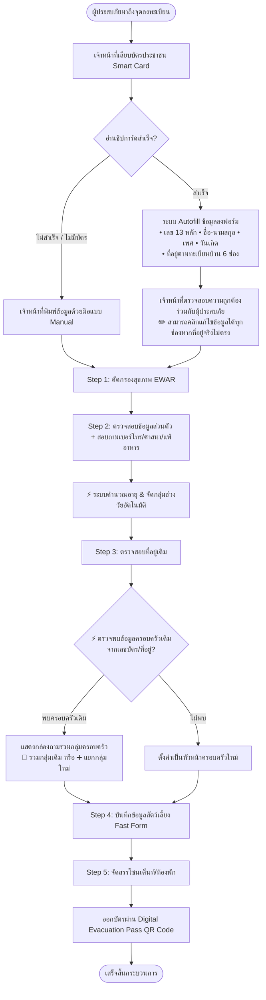

# สเปคระบบอ่านบัตรประชาชน (Smart Card Reader) และการลงทะเบียนผู้ประสบภัย (Evacuee Registration)

_ระบบ SmartShelter — Disaster Relief & Shelter Management System_  
_เอกสารข้อกำหนดทางเทคนิคและการออกแบบ UI/UX (Technical & Operational Specification)_

---

## 1. ภาพรวมและวัตถุประสงค์ (Overview & Objectives)

เพื่อเพิ่มความรวดเร็ว แม่นยำ และลดภาระงานของเจ้าหน้าที่ ณ จุดรับเข้าหน้าศูนย์พักพิง (Front Desk / Reception Kiosk) ระบบ SmartShelter ได้ออกแบบให้รองรับการเชื่อมต่อกับ **เครื่องอ่านบัตรประชาชนแบบสมาร์ตการ์ด (Smart Card Reader / Dip Chip)** เพื่อดึงข้อมูลอัตลักษณ์บุคคลและที่อยู่ตามทะเบียนบ้านมาเติมลงในฟอร์มลงทะเบียนผู้ประสบภัย (Autofill) ภายในเวลา **3–5 วินาที**

> [!IMPORTANT]  
> **หลักการแก้ไขข้อมูล (Editable & Manual Override):**  
> ข้อมูลทุกฟิลด์ที่ถูกดึงมาจากชิปบัตรประชาชนและเติมลงในฟอร์มอัตโนมัติ (Autofill) **จะต้องไม่ถูกล็อกตาย (Must be fully editable)** เจ้าหน้าที่หรือผู้ใช้งานสามารถคลิกพิมพ์แก้ไข ปรับปรุง หรือลบข้อมูลในช่องนั้นๆ ได้อย่างอิสระตลอดเวลา เพื่อรองรับกรณี:
> 1. ที่อยู่พักอาศัยจริงในปัจจุบันไม่ตรงกับที่อยู่ตามทะเบียนบ้านเดิมบนบัตร
> 2. มีการเปลี่ยนชื่อ-สกุล คำนำหน้า หรือข้อมูลยังไม่ได้รับการอัปเดตบนชิปบัตร
> 3. บัตรประชาชนชำรุด มีข้อมูลสูญหายบางส่วน หรือต้องการกรอกข้อมูลเพิ่มเติม

---

## 2. ตาราง Mapping ข้อมูลจากชิปบัตรประชาชนสู่ฟอร์มลงทะเบียน (Data Mapping Table)

| ลำดับ | ข้อมูลในชิปบัตรประชาชน (Thai National ID Card) | ฟิลด์ปลายทางในระบบ SmartShelter | ขั้นตอนในระบบ (Step) | พฤติกรรมของระบบ (System Behavior) |
|:---:|---|---|:---:|---|
| **1** | `Citizen ID (CID)` เลขประจำตัวประชาชน 13 หลัก | **เลขประจำตัวประชาชน** | **Step 2** (ข้อมูลส่วนบุคคล) | **Autofill อัตโนมัติ** *(สามารถคลิกแก้ไข/พิมพ์ใหม่ได้)* |
| **2** | `Title / Prefix TH` คำนำหน้าชื่อภาษาไทย | **คำนำหน้าชื่อ** | **Step 2** (ข้อมูลส่วนบุคคล) | **Autofill อัตโนมัติ** *(มี Dropdown ให้เลือกเปลี่ยนได้)* |
| **3** | `First Name TH` + `Last Name TH` ชื่อตัว และ นามสกุล | **ชื่อ - นามสกุล** | **Step 2** (ข้อมูลส่วนบุคคล) | **Autofill อัตโนมัติ** *(สามารถคลิกแก้ไขตัวสะกดได้)* |
| **4** | `Gender` เพศ (รหัส 1=ชาย, 2=หญิง) | **เพศ** | **Step 2** (ข้อมูลส่วนบุคคล) | **Autofill อัตโนมัติ** *(สามารถเลือกสลับปุ่ม Radio ได้)* |
| **5** | `Date of Birth (DOB)` วัน/เดือน/ปีเกิด | **วัน/เดือน/ปีเกิด** | **Step 2** (ข้อมูลส่วนบุคคล) | **Autofill อัตโนมัติ** *(มี Datepicker ให้ปรับแก้วันที่ได้)* |
| **-** | _(คำนวณจากวันเกิด)_ | **อายุ และ ช่วงวัย (Age Bracket)** • ทารก (0–3 ปี) • เด็ก (4–17 ปี) • ผู้ใหญ่ (18–59 ปี) • ผู้สูงอายุ (60 ปีขึ้นไป) | **Step 2** (ข้อมูลส่วนบุคคล) | **ระบบคำนวณให้อัตโนมัติ (Auto-calculated)** และแสดงป้ายกำกับช่วงวัยทันที |
| **6** | `House No.` บ้านเลขที่ | **บ้านเลขที่** | **Step 3** (ที่อยู่เดิม) | **Autofill อัตโนมัติ** *(สามารถคลิกแก้ไขได้)* |
| **7** | `Moo / Soi / Road` หมู่ที่ / ตรอก / ซอย / ถนน | **หมู่ / ซอย / ถนน** | **Step 3** (ที่อยู่เดิม) | **Autofill อัตโนมัติ** *(สามารถคลิกแก้ไขได้)* |
| **8** | `Sub-district (Tambon)` ตำบล / แขวง | **ตำบล / แขวง** | **Step 3** (ที่อยู่เดิม) | **Autofill อัตโนมัติ** *(สามารถคลิกแก้ไขได้)* |
| **9** | `District (Amphoe)` อำเภอ / เขต | **อำเภอ / เขต** | **Step 3** (ที่อยู่เดิม) | **Autofill อัตโนมัติ** *(สามารถคลิกแก้ไขได้)* |
| **10** | `Province (Changwat)` จังหวัด | **จังหวัด** | **Step 3** (ที่อยู่เดิม) | **Autofill อัตโนมัติ** *(สามารถคลิกแก้ไขได้)* |
| **11** | `Zipcode` รหัสไปรษณีย์ | **รหัสไปรษณีย์** | **Step 3** (ที่อยู่เดิม) | **Autofill อัตโนมัติ** *(สามารถคลิกแก้ไขได้)* |
| **-** | _(รูปถ่ายหน้าตรงจากบัตร - Base64)_ | **ภาพพรีวิวบัตรประชาชน (ID Photo Preview)** | **จุดตรวจสอบหน้างาน** | แสดงพรีวิวรูปถ่ายหน้าตรงชั่วคราวให้ จนท. ตรวจสอบบุคคลจริงหน้างาน (ไม่เก็บรูปซ้ำซ้อนในฐานข้อมูลตาม Task #167) |

---

## 3. ระบบอัจฉริยะที่ทำงานต่อเนื่องหลัง Autofill (Automated Intelligence)

เมื่อข้อมูลถูกดึงเข้ามาในระบบ ระบบ SmartShelter จะเรียกใช้ฟังก์ชันอัตโนมัติดังนี้:

### 3.1 ระบบตรวจจับครอบครัวอัตโนมัติ (Automated Family Matching - Step 3)
* ทันทีที่ระบบได้รับ `เลขประจำตัวประชาชน 13 หลัก` หรือ `ที่อยู่เดิมฉบับเต็ม` ระบบจะนำไปค้นหาในฐานข้อมูลศูนย์พักพิงแบบ Real-time
* **หากพบว่ามีสมาชิกครอบครัว/บ้านเดียวกันลงทะเบียนไว้แล้ว**: ระบบจะแสดงการ์ดแจ้งเตือน  
  `[ 🏡 พบข้อมูลครอบครัวเดิม: ครอบครัวคุณ... (มีสมาชิกแล้ว N คน) ต้องการรวมกลุ่มด้วยกันใช่หรือไม่? ]`
* **ตัวเลือก Action**:
  * `[ 🔗 ใช่ รวมกลุ่มครอบครัวนี้ ]` $\rightarrow$ นำบุคคลนี้เข้ากลุ่มบ้านเดิม จัดสรรเต็นท์/ห้องพักโซนเดียวกัน และเชื่อมโยงโควตาอาหาร
  * `[ ➕ ไม่ใช่ สร้างกลุ่มครอบครัวใหม่ ]` $\rightarrow$ บันทึกเป็นหัวหน้าครอบครัวของบ้านใหม่แยกต่างหาก

### 3.2 การคำนวณความต้องการตามมาตรฐานสากล (Sphere Standard & Vulnerability Grouping)
* การแปลงวันเกิดเป็น **ช่วงวัย (Age Bracket)** อัตโนมัติ จะส่งผลต่อการคำนวณเสบียงและสิ่งของจำเป็นทันที:
  * **กลุ่มทารก (0–3 ปี)**: เพิ่มยอดความต้องการนมผง, ผ้าอ้อมเด็ก, ชุดสุขอนามัยเด็กเล็ก
  * **กลุ่มผู้สูงอายุ (60+ ปี)**: จัดเข้าเกณฑ์กลุ่มเปราะบางเพื่อพิจารณาที่พักชั้นล่าง/ใกล้ห้องน้ำ

---

## 4. รายการข้อมูลที่ต้อง "สอบถามเพิ่มเติมหน้างาน" (Manual Input Fields)

เนื่องจากบัตรประชาชนไม่ได้บันทึกข้อมูลส่วนบุคคลบางประเภท เจ้าหน้าที่จะสอบถามเพิ่มเติมในขั้นตอนต่างๆ ดังนี้:

### 4.1 ข้อมูลคัดกรองสุขภาพด่านหน้า (Step 1: EWAR & Triage)
* อาการผิดปกติหรือความเสี่ยงโรคระบาด (ไข้, ไอ, หอบเหนื่อย, ท้องเสีย, บาดเจ็บฉุกเฉิน)
* ความจำเป็นในการส่งต่อแพทย์/แยกกักตัว

### 4.2 ข้อมูลติดต่อและสุขอนามัยเฉพาะ (Step 2: Contact & Medical Guard)
* **เบอร์โทรศัพท์มือถือ (Phone Number)** *(ใช้เป็น Universal Identifier สำรอง และใช้รับ Digital Pass)*
* **ศาสนา / ข้อจำกัดด้านโภชนาการ** (เช่น นับถือศาสนาอิสลาม $\rightarrow$ เปิดระบบ **Halal Dietary Guard** ป้องกันการแจกอาหารผิดประเภท)
* **ข้อมูลสุขภาพเฉพาะ**: โรคประจำตัว, ประวัติแพ้ยา, ประวัติแพ้อาหาร
* **กลุ่มเปราะบางพิเศษ**: ภาวะตั้งครรภ์, ผู้ป่วยติดเตียง, ผู้พิการทางร่างกาย

### 4.3 สัตว์เลี้ยงและทรัพย์สิน (Step 4: Pets & Belongings)
* **ข้อมูลสัตว์เลี้ยง (Unified Fast Pet Intake Form - 4 ฟิลด์)**:
  1. ชนิดสัตว์ (Dropdown: สุนัข, แมว, สัตว์ปีก, สัตว์เล็ก, ปศุสัตว์, อื่นๆ)
  2. ชื่อสัตว์เลี้ยง
  3. พันธุ์ / สี / จุดสังเกต
  4. สถานะการนำกรงหรือสายจูงมาด้วยตนเอง `[ ✔️ ]` + หมายเหตุ
* ยานพาหนะหรือทรัพย์สินชิ้นใหญ่ที่นำมาด้วย

### 4.4 การจัดสรรพื้นที่พักพิง (Step 5: Shelter Allocation)
* กำหนด โซน / เต็นท์ / หมายเลขห้องพัก (เช่น โซนทั่วไป, โซนเปราะบาง, โซน Pet-Friendly)
* พิมพ์บัตรหรือออกรหัส **Digital Evacuation Pass (QR Code)** ให้ผู้ประสบภัยไว้ใช้สแกนรับอาหารและสิ่งของ

---

## 5. แผนผังกระบวนการทำงาน (Process Flow Diagram)

---

## 6. มาตรฐานความมั่นคงปลอดภัยและการคุ้มครองข้อมูล (PDPA & Security)

1. **PDPA Search-First Workspace (Task #187)**: หน้าจอระบบค้นหาและลงทะเบียนจะไม่มีการแสดงรายชื่อผู้ประสบภัยทั้งหมดบนหน้าจอแบบเปิดเผย เพื่อป้องกันการรั่วไหลของข้อมูลส่วนบุคคล
2. **Universal Multi-Role Linking (Task #180)**: เลขประจำตัวประชาชน 13 หลักที่ได้จากบัตรจะถูกใช้เป็น Single Source of Truth เชื่อมโยงข้อมูลข้ามมิติ (ผู้ประสบภัย $\leftrightarrow$ จิตอาสา $\leftrightarrow$ เจ้าหน้าที่) เพื่อป้องกันการนับยอดคนซ้ำซ้อน
3. **Local Card Read Processing**: การอ่านข้อมูลจากชิปการ์ดเป็นการอ่านผ่านอุปกรณ์ Local Agent หน้างานโดยตรงเพื่อนำมาใส่ในฟอร์ม ปลอดภัยตามมาตรฐานความมั่นคงปลอดภัยสารสนเทศ
